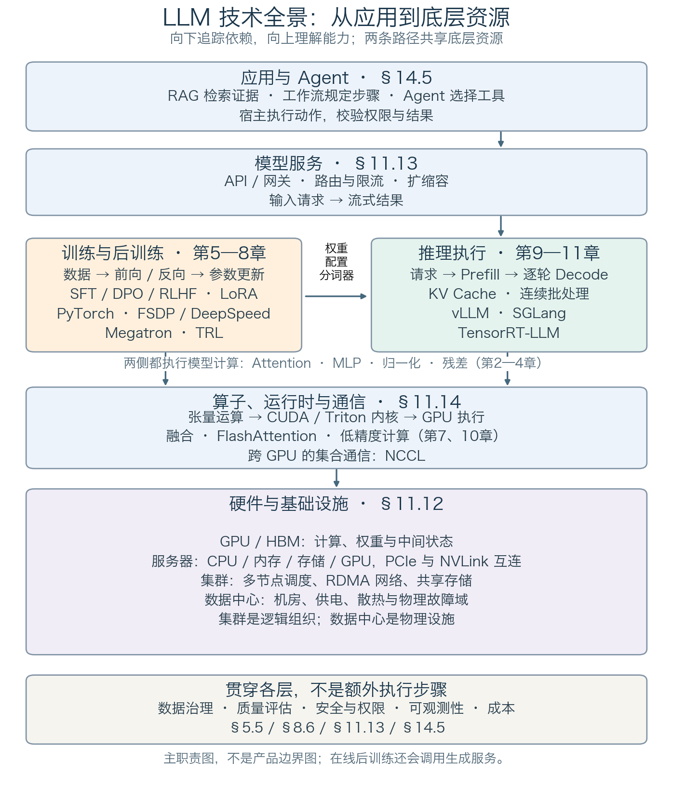

## 1.0 技术全景：从 GPU 到 Agent

理解大模型系统，需要同时回答两个问题：一次计算怎样执行，一项任务怎样完成。前者涉及模型、算子和硬件；后者还需要数据、服务、工具与治理。图 1-0 将这些技术放在同一张地图中，后文再逐层展开。

### 1.0.1 先看层次，再看两条工作路径

图 1-0：从应用需求向下追踪依赖。纵向箭头表示“依赖”，不是一次请求的执行顺序；横向箭头表示训练制品交给推理系统加载。基础设施框内表示组织关系，不是软件调用链。[绘图源文件](https://github.com/yeasy/llm_internals/blob/main/tools/figures/llm_technology_map.py)

快速导航：[GPU／集群／数据中心](../11_serving/11.12_hardware.md) · [CUDA／Triton／NCCL](../11_serving/11.14_gpu_software.md) · [模型计算](../03_components/3.8_gpt_inference_flow.md) · [训练框架](../appendix/a7_framework_recipes.md) · [vLLM](../11_serving/11.10_vllm_internals.md) · [SGLang](../11_serving/11.11_sglang_internals.md) · [服务治理](../11_serving/11.13_best_practices.md) · [RAG／Agent](../14_future_trends/14.5_agent_tool_use.md)。各项优化技术的细分入口见下一小节。

**自下而上看能力。** GPU 执行计算，显存保存权重与中间状态；服务器组合计算、主机内存和输入输出设备；集群把多台服务器组织成可调度的资源；数据中心提供机房、供电和散热。集群是逻辑资源组织，数据中心是物理设施，二者并非一一对应。软件在这些资源之上实现算子、模型执行、在线服务与应用。

**沿两条路径看工作。** 训练读取样本，通过前向、损失、反向和参数更新产生模型；推理加载模型，处理请求并生成词元。两侧共享算子与硬件，但管理的状态不同：训练还需梯度、优化器与恢复状态，推理重点管理请求队列和 KV 缓存。RLHF 等在线后训练会反复调用生成服务，图中的两条路径并不隔绝。

**区分模型与框架。** Transformer 定义计算结构，PyTorch 等框架组织计算，vLLM 等引擎组织高效生成，Agent 宿主组织工具与任务。它们不是相互替代的产品。图按主要职责定位，实际软件可跨层：例如 vLLM 同时提供 API 服务入口、调度与模型执行，不能理解成只包含一个方框。其实现分工可对照 [vLLM 架构说明](https://docs.vllm.ai/en/latest/design/arch_overview/)。

### 1.0.2 图中的技术，到哪里学

下表是正文入口，不是要求读者先记住的缩写表。第一次阅读可先理解各行“解决的问题”，再按章节查看计算与取舍。

| 地图位置 | 核心技术与解决的问题 | 机制与实践入口 |
| --- | --- | --- |
| 硬件与基础设施 | GPU／HBM 提供计算和显存；PCIe／NVLink 连接设备；RDMA 网络与存储连接节点；数据中心提供运行条件 | [11.12 硬件、集群与数据中心](../11_serving/11.12_hardware.md) |
| 算子与运行时 | CUDA 管理 GPU 编程与执行；Triton 编写分块内核；融合减少中间读写；NCCL 实现跨 GPU 通信 | [11.14 GPU 软件栈](../11_serving/11.14_gpu_software.md)、[7.1 集合通信](../07_distributed_training/7.1_data_parallel.md) |
| 模型计算 | Attention、MLP、归一化、残差和位置编码共同把词元变成预测 | [3.8 完整推理过程](../03_components/3.8_gpt_inference_flow.md)、[第四章 位置编码](../04_position_encoding/README.md) |
| 预训练与分布式执行 | 数据流水线、损失与优化器决定学什么；DDP、FSDP／ZeRO、张量／流水线并行决定如何分摊计算与状态 | [5.5 数据](../05_pretraining/5.5_data_pipeline.md)、[第六章 优化](../06_training_techniques/README.md)、[第七章 分布式](../07_distributed_training/README.md)、[A.7 框架配方](../appendix/a7_framework_recipes.md) |
| 后训练 | SFT 用示范监督，DPO 用偏好对，RLHF／GRPO 用奖励反馈；LoRA 是可与这些方法组合的参数更新方式 | [第八章 对齐](../08_alignment/README.md)、[A.6 核心计算实验](../appendix/a6_practice_path.md)、[A.7 框架配方](../appendix/a7_framework_recipes.md) |
| 推理执行 | GQA／MQA 减少 KV 头数，KV Cache 避免重复计算；FlashAttention 减少注意力访存；FP8 等量化降低表示开销；投机解码尝试减少串行等待 | [GQA／MQA](../02_attention/2.3_multi_head.md)、[KV Cache](../10_inference_optimization/10.2_kv_cache.md)、[FlashAttention](../10_inference_optimization/10.3_flash_attention.md)、[FP8 与量化](../10_inference_optimization/10.4_quantization.md)、[投机解码](../10_inference_optimization/10.6_speculative_decoding.md) |
| 推理引擎 | PagedAttention 管理分页 KV 的访问，Continuous Batching 动态组织请求；vLLM、SGLang、TensorRT-LLM 集成执行机制 | [11.1 引擎比较](../11_serving/11.1_engines_overview.md)、[11.2 连续批处理](../11_serving/11.2_continuous_batching.md)、[11.4 KV 管理](../11_serving/11.4_kv_memory_management.md)、[11.10 vLLM](../11_serving/11.10_vllm_internals.md)、[11.11 SGLang](../11_serving/11.11_sglang_internals.md) |
| 模型服务 | API、网关、词元感知路由、限流和扩缩容，将引擎能力变成可用服务 | [11.13 服务最佳实践](../11_serving/11.13_best_practices.md) |
| 应用与 Agent | RAG 把外部证据带入上下文；工作流规定步骤；Agent 在约束下选择工具与下一步，由宿主执行 | [12.3 检索与重排](../12_encoder_models/12.3_longformer_bigbird.md)、[14.5 工具、Agent 与 RAG](../14_future_trends/14.5_agent_tool_use.md) |
| 贯穿各层 | 数据治理、质量评估、安全、可观测性和成本决定系统能否持续使用，不是最后才增加的一层 | [5.5 数据治理](../05_pretraining/5.5_data_pipeline.md)、[8.6 评估](../08_alignment/8.6_evaluation.md)、[11.13 运行治理](../11_serving/11.13_best_practices.md)、[14.5 工具权限](../14_future_trends/14.5_agent_tool_use.md) |

PyTorch、FSDP、DeepSpeed、Megatron 和 TRL 的职责及组合方式集中在 A.7，不要求每个项目都使用整套工具。先选需要的机制，再选能支持该机制、模型与硬件的实现。

### 1.0.3 用一个问题串起整张地图

假设用户询问“公司的差旅住宿上限是多少”，系统需要读取内部制度：

1. **应用整理任务。** RAG 检索当前用户有权读取的制度片段，将来源与问题放入上下文；固定的检索问答流程不一定需要 Agent。
2. **服务接收请求。** 网关校验身份和配额，路由到可用模型实例。这里处理的是请求，不是矩阵。
3. **引擎安排计算。** 调度器分配计算批次和 KV 空间，先做 Prefill，再逐轮 Decode。批处理和缓存改变执行效率，不替代模型公式。
4. **模型执行算子。** Attention、MLP 等张量运算落到 GPU 内核；多卡模型在需要的地方通信。输入与输出矩阵的维度见 3.8 节。
5. **基础设施搬运数据。** GPU 使用显存中的权重和状态，服务器、网络与存储负责相应资源和传输；网络拥塞、加载缓慢或显存不足会表现为不同的上层症状。
6. **应用检查并交付。** 宿主返回答案与引用；若需要执行报销等动作，则另行校验参数、权限与授权，不能把模型生成的调用当作执行许可。

模型权重在上线前由训练路径产生；这次问答通常不更新权重。检索到新制度、复用 KV 缓存和把知识训练进模型，是三个不同过程。

排障也沿这张地图定位：答案依据错误，先检查检索与生成；首词元慢，拆开排队与 Prefill；逐词元输出慢，检查 Decode、访存和通信；扩卡不增吞吐，检查切分与互连。不要用同一种优化解决所有层的问题，具体判据见 [11.13 节](../11_serving/11.13_best_practices.md)。
