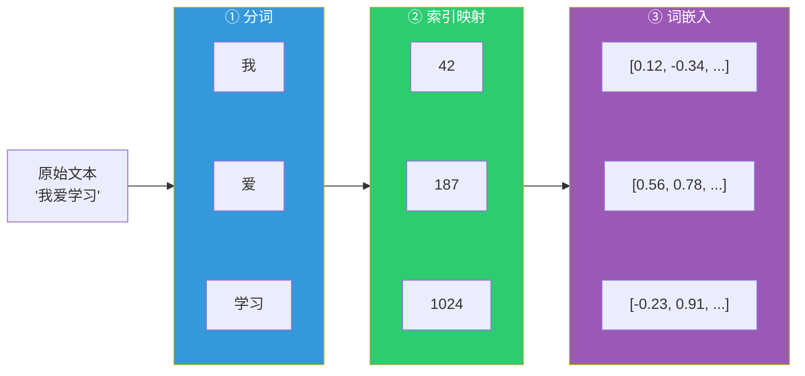

## 1.1 序列建模的根本挑战

在深入 Transformer 的技术细节之前，有必要先理解它试图解决的根本问题：**如何对序列数据进行有效建模。**

### 1.1.1 什么是序列建模

序列建模（Sequence Modeling）是指让计算机理解和处理有序数据的任务。自然语言是最典型的序列数据——一句话中词语的排列顺序直接决定了语义。"猫追狗"和"狗追猫"使用了完全相同的词汇，但含义截然不同。

序列建模涵盖了 NLP 中的绝大多数核心任务：

- **语言建模**：给定前文，预测下一个词（如输入法联想）
- **机器翻译**：将一种语言的句子转换为另一种语言
- **文本分类**：判断一段文字的情感、主题或意图
- **序列标注**：为每个词标注词性、实体类型等标签
- **文本生成**：根据提示生成连贯的段落或文章

所有这些任务的共同核心是：模型必须理解元素之间的**顺序关系**和**依赖关系**。

### 1.1.2 序列建模的三大核心难题

任何序列模型都必须同时解决三个相互关联的挑战：

**第一，变长输入问题。** 与图像不同，句子的长度可以从一个词到数千个词不等。模型必须能够处理任意长度的输入，而不是假设固定大小的数据。传统的全连接网络要求输入维度固定，这使得它无法直接处理变长序列。

**第二，长距离依赖问题。** 语言中的依赖关系可能跨越很长的距离。例如，"那个昨天在公园里遇到的穿红色外套的**女孩**，今天又**来了**"——主语"女孩"和谓语"来了"之间相隔了很多词，但模型必须正确地将它们关联起来。这种长距离依赖的捕捉能力，直接决定了模型理解复杂语义的能力。

**第三，计算效率问题。** 处理序列的速度至关重要。如果一个模型必须严格按顺序逐个处理每个元素，那么对于长序列，计算时间将线性增长，且无法利用现代硬件（如 GPU）的并行计算能力。训练速度的瓶颈直接限制了模型的规模和数据的吞吐量。

这三个问题构成了评判序列模型优劣的基本维度。正如接下来将看到的，循环神经网络（RNN）较好地解决了第一个问题，长短期记忆网络（LSTM）在第二个问题上有所改善，但直到 Transformer 的出现，第三个问题才得到根本性的突破——而且它在前两个问题上也给出了更优雅的答案。

### 1.1.3 从统计方法到神经网络

在深度学习之前，序列建模主要依赖统计方法。

**N-gram 语言模型**是早期最成功的方案之一。它的思路很直接：用前 N-1 个词来预测第 N 个词，概率通过语料库中的统计频率来估算。例如，一个 3-gram（三元组）模型会根据"我 喜欢"来预测下一个词可能是"你"或"吃"等。

N-gram 的问题在于：上下文窗口是固定且狭窄的。当 N 增大时，可能的组合数呈指数增长（词汇量为 $V$ 时，N-gram 的组合数为 $V^N$），导致绝大多数组合在训练数据中从未出现，即严重的**数据稀疏**问题。即便使用各种平滑技术，N-gram 也很难捕捉超过 5-6 个词的上下文。

**隐马尔可夫模型**（Hidden Markov Model，HMM）和**条件随机场**（Conditional Random Field，CRF）等概率图模型提供了更强的建模能力，但它们同样受限于马尔可夫假设——当前状态只依赖于有限的前序状态。

神经网络的引入改变了游戏规则。从 2003 年 Bengio 等人的前馈神经网络语言模型开始，研究者发现可以将词表示为连续向量（词嵌入），让模型在一个连续的语义空间中处理语言——这一突破性思想的来龙去脉将在下一节详细展开。

### 1.1.4 从文字到向量：模型看到的是什么

上文提到了词嵌入把词表示为连续向量。但"文本是怎样变成向量的"这个问题值得在此做一个直觉性的梳理——理解这条管线，是理解后续所有序列模型（从 RNN 到 Transformer）的前提。

神经网络只能处理数值，不能直接"阅读"文字。因此，模型在接收到一段文本后，必须经过以下三个阶段才能开始计算：

**第一步，分词（Tokenization）。** 将原始文本切分为一系列基本单元，称为**词元**（Token）。词元既可以是一个完整的词，也可以是一个子词片段甚至一个字符。例如，"我爱学习"可能被切分为"我"、"爱"、"学习"三个词元；而英文单词"tokenization"可能被切分为"token"和"ization"两个子词。这种**子词分词**策略是现代大语言模型的标准做法，它在词汇覆盖率和序列长度之间取得了良好的平衡。

**第二步，索引映射。** 每个词元在预先构建的**词汇表**（Vocabulary）中有一个唯一的整数索引。分词器将词元序列转换为整数索引序列。例如，"我"→ 42，"爱"→ 187，"学习"→ 1024。

**第三步，词嵌入（Embedding）。** 模型内部维护一个**嵌入矩阵**，每一行对应词汇表中一个词元的向量表示。通过查找索引对应的行，每个词元被映射为一个固定维度的稠密向量。这些向量就是神经网络真正"看到"和处理的输入。

下图展示了这条完整的管线：

图 1-1：从原始文本到向量表示的三步管线

嵌入向量的关键特征是：**语义相近的词在向量空间中距离也相近。** 例如，"国王"和"女王"的嵌入向量会比"国王"和"苹果"更接近。这意味着向量不仅是一种编码方式，更捕捉了词汇的语义关系——这正是神经网络能够理解语言的基础。

"用向量表示词义"这一思想最早源自 1986 年，Hinton 等人提出**分布式表示**（Distributed Representation）的概念，主张用一组连续数值而非单一符号来表示语义。2003 年，Bengio 等人在前馈神经网络语言模型中首次系统性地将词嵌入作为模型的可学习参数，证明了神经网络可以在训练过程中自动学到有意义的词向量。2013 年，Mikolov 等人提出的 **Word2Vec** 通过极其高效的训练算法，首次实现了在数十亿词的语料上训练词向量，并揭示了著名的向量类比关系（如 $\vec{\text{king}} - \vec{\text{man}} + \vec{\text{woman}} \approx \vec{\text{queen}}$），让词嵌入真正走向了工业应用。此后，**GloVe**（2014 年）通过全局共现统计、**FastText**（2016 年）通过引入子词信息，进一步完善了词向量的质量。2018 年，**ELMo** 和 **BERT** 的出现标志着一个质的飞跃：词的向量表示不再是固定的，而是根据上下文动态变化——同一个词"苹果"在"吃苹果"和"苹果公司"中会得到不同的向量，这就是**上下文化嵌入**（Contextualized Embedding），也是当代大语言模型的标准做法。

有了"文本如何变成向量"的基本认知后，接下来要回答的核心问题是：如何处理这些向量序列？从根本上突破固定窗口限制的第一个方案，是循环神经网络的出现。
