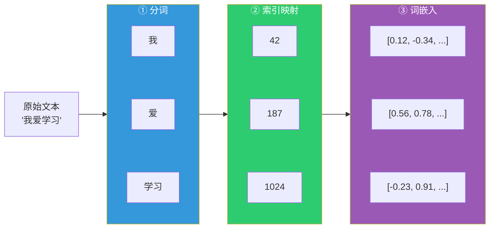

## 1.1 序列建模的根本挑战

本节回答两个问题：序列建模到底要算什么，以及用什么口径衡量一个序列模型的好坏。前者给出全书的训练目标——概率的链式分解与它的两个读数（交叉熵、困惑度）；后者立起三条评判轴（变长输入、长距离依赖、计算效率），1.2 到 1.4 节会拿同样三条轴逐个考察 RNN、CNN、注意力与 Transformer。本节不讲任何具体架构，只把尺子做出来。

### 1.1.1 什么是序列建模

序列建模（Sequence Modeling）是指让计算机处理有序数据的任务。自然语言是最典型的序列数据：词的排列顺序直接决定语义。“猫追狗”和“狗追猫”用词完全相同，含义相反。

序列建模涵盖 NLP 的多数核心任务：

- **语言建模**：给定前文，预测下一个词
- **机器翻译**：将一种语言的句子转换为另一种语言
- **文本分类**：判断一段文字的情感、主题或意图
- **序列标注**：为每个词标注词性、实体类型等标签
- **文本生成**：根据提示生成连贯的段落

这些任务的共同点是，模型必须同时利用元素的顺序和元素之间的依赖。

**语言模型的形式化。** 上面第一项值得单独写清楚，因为全书的训练目标、解码策略和评测指标都建立在它上面。一个语言模型给整条序列 $$x_1 \ldots x_T$$ 赋一个概率，按条件概率的链式法则拆成 $$T$$ 个一步预测：

$$
P(x_1,\ldots,x_T)=\prod_{t=1}^{T} P(x_t \mid x_{<t})
$$

这条恒等式本身不含任何假设，它只是把“给一整句话打分”换成“反复预测下一个词元”。训练时把它取对数再取负、除以长度，得到每词元平均交叉熵：

$$
L = -\frac{1}{T}\sum_{t=1}^{T}\log P(x_t \mid x_{<t})
$$

对数底取自然对数时，$$L$$ 的单位是 nat。这个量的指数就是**困惑度**（Perplexity，PPL）$$= e^{L}$$，可以读作“模型平均在多少个等概率候选之间犹豫”。

**一格算术。** 设某条 4 个词元的序列，模型给正确词元的概率依次是 0.5、0.25、0.4、0.1。联合概率是 $$0.5 \times 0.25 \times 0.4 \times 0.1 = 0.005$$，即 $$1/200$$。四个 $$-\ln p$$ 依次是 0.693、1.386、0.916、2.303，平均得 $$L = 1.325$$ nat，于是 $$\mathrm{PPL} = e^{1.325} = 3.76$$。换个算法结果相同：$$200^{1/4} = 3.76$$，困惑度就是逐步概率几何平均的倒数。联合概率随长度指数衰减，长短不同的句子无法比较；困惑度做了长度归一，因此可比。那个 0.1 的低概率步代价明显：只看前三步，困惑度是 2.71；把它算进来就升到 3.76。

困惑度依赖分词方式，不同词表的模型不能直接比。这条限制与交叉熵的另外两种读法（压缩视角、与真实分布的 KL 距离）放在 [5.1 节](../05_pretraining/5.1_autoregressive.md)和 [6.1 节](../06_training_techniques/6.1_loss_optimizer.md)展开，本章只需要记住：序列建模的目标函数就是这条链式分解。

### 1.1.2 三条评判轴

任何序列模型都要同时应付三件事，它们也是后四节反复对照的三条轴。

**第一，变长输入。** 句子长度从一个词到数千词不等，模型必须接受任意长度。全连接网络要求输入维度固定，无法直接处理变长序列。解法是让同一组参数在所有位置上复用。

**第二，长距离依赖。** 依赖关系可以跨越很远。“那个昨天在公园里遇到的穿红色外套的女孩，今天又来了”，主语和谓语之间隔了十几个词。衡量这一项的量是**信息路径长度**：两个位置之间的信息要经过多少次变换才能相遇。路径越长，信号在正向传播中被稀释、在反向传播中被衰减得越厉害。

**第三，计算效率。** 这一项必须拆成两个互不相同的量，否则后面的对比会失真。

- **总计算量**：处理一条长度 $$n$$ 的序列共需多少次浮点运算。
- **顺序步数**：这些运算里有多少步必须严格排队，不能同时做。

两者可以背道而驰。循环网络的总计算量随 $$n$$ 线性增长，已经相当省；但它的顺序步数也是 $$n$$，每一步都要等上一步算完。自注意力的打分与读取随 $$n$$ 平方增长，长序列上比循环网络更贵；可它的顺序步数是常数，整条序列能一次算完。GPU 上决定训练速度的往往是后者：顺序步数多意味着每步只有一小批数据，数千个计算核心大部分时间在空转。表 1-2 与表 1-5 分列的正是这两个量。

三条轴上，RNN 先解决了变长输入，LSTM 显著改善了长距离依赖，Transformer 则把顺序步数降到常数，同时把路径长度也降到常数。

### 1.1.3 从统计方法到神经网络

深度学习之前，序列建模主要依赖统计方法。

**N-gram 语言模型**用前 $$N-1$$ 个词预测第 $$N$$ 个词，把链式分解里的条件截断到固定窗口，再用语料中的频次直接估计每一项：

$$
P(w_t \mid w_{<t}) \approx P(w_t \mid w_{t-N+1},\ldots,w_{t-1})
= \frac{\mathrm{count}(w_{t-N+1},\ldots,w_t)}{\mathrm{count}(w_{t-N+1},\ldots,w_{t-1})}
$$

它的麻烦在分子上。**一格算术**：词表 $$V = 10^5$$ 时，三元组的可能取值有 $$V^3 = 10^{15}$$ 种；一份 $$10^{10}$$ 词的语料最多只含 $$10^{10}$$ 个三元组实例，其中还有大量重复。即便每个实例都互不相同，被见过的三元组也不超过所有可能取值的 $$10^{10}/10^{15} = 10^{-5}$$。窗口每加宽一个词，分母再乘 $$10^5$$，覆盖率再掉五个数量级。绝大多数组合的计数是 0，对应的概率估计也是 0——这就是**数据稀疏**。[Bengio 等 2003 的开篇](https://www.jmlr.org/papers/volume3/bengio03a/bengio03a.pdf)用的是同一笔账的极端版本：$$V = 10^5$$、建模 10 个连续词，自由参数多达 $$10^{50}-1$$ 个。平滑与回退能缓解 0 概率，但改变不了这个量级，因此 N-gram 实际能用的窗口通常停在 5 到 6 个词。

**隐马尔可夫模型**（Hidden Markov Model，HMM）和**条件随机场**（Conditional Random Field，CRF）提供了更强的建模能力。两者都对状态（标签）序列施加马尔可夫假设，但对观测的处理不同：HMM 假设每个观测只由当前状态生成，线性链 CRF 的特征函数则可以读取整条观测序列。受限的是标签之间的依赖距离，不是能看到多少输入。

神经语言模型换了一条路：不再为每个组合单独存一个计数，而是把每个词映射成一个低维向量，让相似的词共享统计强度。参数量因此从随窗口指数增长变成随窗口线性增长。以 Bengio 等 2003 在 AP News 上的配置为例，词表 $$|V| = 17{,}964$$、隐层 $$h = 60$$、阶数 $$n = 6$$、词向量维度 $$m = 100$$，参数量为 $$|V|(1+nm+h) + h(1+(n-1)m)$$，即 $$17{,}964 \times 661 + 60 \times 501 = 11{,}904{,}264$$，约 1,190 万个。同阶的计数表则有 $$17{,}964^6 \approx 3.4 \times 10^{25}$$ 项，相差 18 个数量级。从这一步起，“表示”成了可学习的参数。

### 1.1.4 从文字到向量：模型看到的是什么

神经网络只处理数值。一段文本要经过三步才能进入计算，这条管线对 RNN 和 Transformer 是同一条。

**第一步，分词（Tokenization）。** 把原始文本切成基本单元，称为**词元**（Token）。词元可以是完整的词、子词片段或单个字符。“我爱学习”可能被切为“我”“爱”“学习”；英文的 tokenization 可能被切为 token 与 ization 两个子词。**子词分词**是当代大语言模型的通行做法，它在两个极端之间取折中：词级切分的词表要覆盖所有词形，未登录词无法表示；字符级切分的词表极小，但同一句话的词元数会翻好几倍，而计算量与词元数直接挂钩。子词切分让常见词保持一个词元，罕见词拆成若干已知片段，任何字符串都能被表示。细节见 [3.1 节](../03_components/3.1_tokenization.md)。

**第二步，索引映射。** 每个词元在预先构建的**词汇表**（Vocabulary）里有唯一的整数索引，分词器据此把词元序列转成整数序列。

**第三步，词嵌入（Embedding）。** 模型持有一个**嵌入矩阵** $$E$$，每一行是一个词元的向量。查表就是按索引取行。写成形状：$$E$$ 的形状是 $$[V, d]$$，一条长度 $$T$$ 的 ID 序列 `ids[T]` 查表后得到 $$X$$，形状 $$[T, d]$$。框架里对应 `torch.nn.Embedding(num_embeddings, embedding_dim)`，两个参数分别是 $$V$$ 和 $$d$$。

| 模型 | 词表 $$V$$ | 宽度 $$d$$ | 嵌入表 $$E$$ 的形状 | 参数量 |
| --- | ---: | ---: | --- | ---: |
| GPT-3 Small | 50,257 | 768 | `[50257, 768]` | 38,597,376 |
| GPT-3 175B | 50,257 | 12,288 | `[50257, 12288]` | 617,558,016 |
| Llama 3 8B | 128,256 | 4,096 | `[128256, 4096]` | 525,336,576 |

表 1-1：三个公开模型的嵌入表。$$d$$ 与 [3.8.3 节](../03_components/3.8_gpt_inference_flow.md)的表 3-17 同一口径；$$V$$ 在 GPT-3 两行上也相同，Llama 3 一行取的是发布权重的 128,256 行（表 3-17 的单元格写 128,000，那是论文口径，两者相差 256 个特殊词元）。参数量由 $$V \times d$$ 算出，例如 Llama 3 8B 是 $$128{,}256 \times 4{,}096 = 525{,}336{,}576$$。一个 80 亿参数的模型，光查表这一步就占掉约 5.25 亿个参数。

下图展示这条管线：

```mermaid
flowchart LR
    text["原始文本<br/>'我爱学习'"]
    subgraph tokenize["① 分词"]
        t1["我"] ~~~ t2["爱"] ~~~ t3["学习"]
    end
    subgraph index["② 索引映射"]
        i1["42"] ~~~ i2["187"] ~~~ i3["1024"]
    end
    subgraph embed["③ 词嵌入"]
        v1["[0.12, -0.34, ...]"] ~~~ v2["[0.56, 0.78, ...]"] ~~~ v3["[-0.23, 0.91, ...]"]
    end

    text --> tokenize --> index --> embed

    style tokenize fill:#3498db,color:#fff
    style index fill:#2ecc71,color:#fff
    style embed fill:#9b59b6,color:#fff
```

图 1-1：从原始文本到向量表示的三步管线

嵌入矩阵初始化时是随机的，取出的向量彼此之间没有任何关系。“语义相近的词向量也相近”是训练之后才出现的经验性质，不是查表这个操作的定义；而且它在 Word2Vec 一类静态词向量上最明显，在大语言模型的输入嵌入上要弱得多，因为那里的语义区分主要由后续各层的上下文计算完成（见 [3.2 节](../03_components/3.2_embedding.md)）。

“用向量表示词义”这一思路可上溯到 Hinton 等 1986 年提出的**分布式表示**（Distributed Representation）：用一组连续数值而非单一符号承载语义。2003 年 Bengio 等把词嵌入做成语言模型里的可学习参数。2013 年的 **Word2Vec** 去掉隐层、改用层次 Softmax，把训练成本压到“一天之内吃完 16 亿词语料”（[论文摘要的原话](https://arxiv.org/abs/1301.3781)），并展示了向量类比关系（如 $$\vec{\text{king}} - \vec{\text{man}} + \vec{\text{woman}} \approx \vec{\text{queen}}$$）。2018 年的 **ELMo** 与 **BERT** 带来了性质上的变化：同一个词在不同上下文里得到不同的向量，即**上下文化嵌入**（Contextualized Embedding）。这条线索的训练目标与几何性质留给 3.2 节，本章只用到“查表得到向量”这一步。

有了输入表示，接下来的问题是怎样处理这串向量。第一个真正突破固定窗口限制的方案是循环神经网络。
