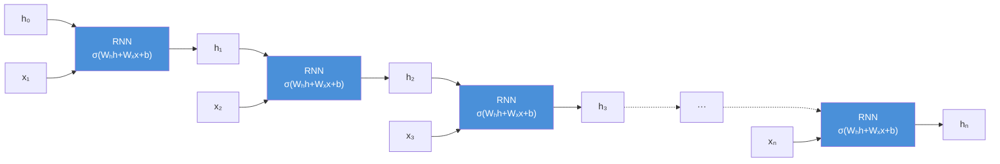
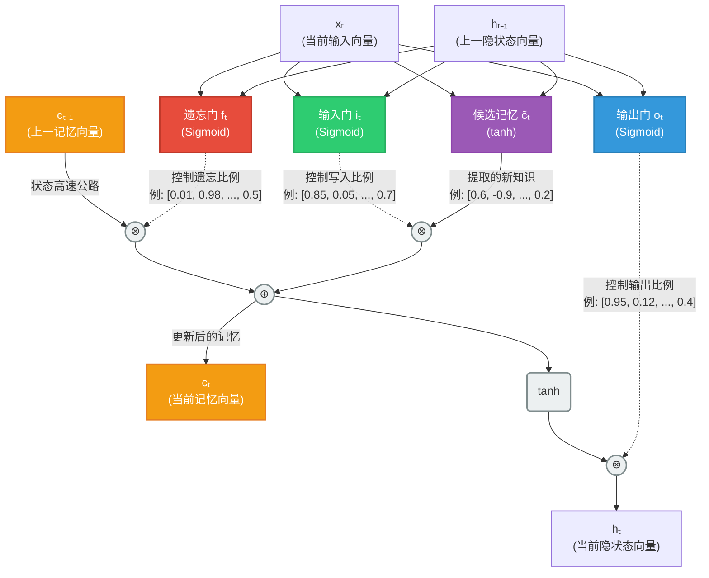

## 1.2 RNN 与 CNN：成就与瓶颈

理解 RNN 和 CNN 在序列建模中的成就与局限，是理解 Transformer 为什么这样设计的前提。每一个 Transformer 的核心设计决策，都可以追溯到对这些前驱架构的某个具体不足的改进。

### 1.2.1 循环神经网络：用“记忆”处理序列

循环神经网络（Recurrent Neural Network，RNN）是第一个真正为序列数据设计的神经网络架构。它的核心思想极为自然：**像人类阅读一样，逐个处理序列中的元素，并维护一个“记忆”（隐藏状态）来积累已经看过的信息。**

具体而言，RNN 在每个时间步 $t$ 接收当前输入 $x_t$ 和上一步的**隐藏状态**（Hidden State）$h_{t-1}$。**隐藏状态是网络内部维护的一个数学向量，用于浓缩和表征迄今为止处理过的所有历史信息。** RNN 结合这两个输入，计算出新的隐藏状态：

$$h_t = \sigma(W_h h_{t-1} + W_x x_t + b)$$

其中 $\sigma$ 是激活函数（通常为 tanh），$W_h$ 和 $W_x$ 是权重矩阵。关键在于：**所有时间步共享同一组参数**（$W_h$、$W_x$ 和 $b$），这使得 RNN 天然地能够处理任意长度的序列——第一个核心挑战得以解决。

下图将 RNN 沿时间展开，展示了隐藏状态如何在时间步之间依次传递：

图 1-2：RNN 沿时间展开示意图，每个时间步共享同一组参数

正如前文所述，隐藏状态 $h_t$ 理论上编码了从序列开头到当前位置的所有信息，可以被视为一个“压缩的历史摘要”。在序列结束时，最终的隐藏状态可以用于分类任务；在每一步，隐藏状态也可以用于序列标注或生成下一个输出。

RNN 在 2010 年代初取得了显著的成功：语言建模、语音识别、机器翻译等任务的性能都得到了大幅提升。然而，当人们试图将 RNN 应用于更复杂的真实场景（尤其是需要全局语境的任务）以及更长的序列时，几个根本性的问题暴露了出来。

### 1.2.2 单向视野：无法“预知未来”

如果仅仅按照从左到右的单向顺序去处理序列，在诸如机器翻译这样的任务中会遇到显著的语义盲区。如前所述，当 RNN 逐词处理序列并输出当前词的隐藏状态时，**它只能看到之前的输入，对后文一无所知**。假设我们要翻译“I arrived in London yesterday.”，当模型编码“arrived”这个词时，它的状态中只有“I arrived”的信息，并不清楚其后的“London”（目的地）和“yesterday”（时间）。但在语言表达中，当前词的真实含义、形态甚至具体用词往往强烈依赖于**后文**的完整语境。**单向 RNN 无法“预知未来”，这使得它在理解序列时极易产生偏差，进而导致基于此表示的生成极有可能“翻译不好”。**

为了解决“只能看到过去”的单向视野问题，研究人员随后引入了**双向 RNN（Bidirectional RNN）**。它通过同时运行一个正向（从左到右）和一个逆向（从右向左）的 RNN，将两个方向的状态拼接起来，使得序列中每个词的表征都能同时包含过去与未来的完整上下文。这一改进大幅弥补了单向视野的缺陷，成为了理解类任务的重要基石。但即便有了双向结构，RNN 在长距离传递信息时依然面临着更深层次的数学极限。

### 1.2.3 梯度消失：RNN 的致命弱点

RNN 的训练依赖**时间反向传播**（Backpropagation Through Time，BPTT）：将 RNN 沿时间展开为一个很深的前馈网络，然后用标准的反向传播算法计算梯度。

问题出在梯度的链式传播上。当梯度从时间步 $T$ 回传到时间步 $1$ 时，需要连续乘以 $T$ 次权重矩阵 $W_h$ 的转置。如果 $W_h$ 的特征值（或等价地，梯度的范数）小于 1，这种连乘会导致梯度**指数级衰减**——这就是**梯度消失**（Vanishing Gradient）问题。

$$\frac{\partial h_T}{\partial h_1} = \prod_{t=2}^{T} \frac{\partial h_t}{\partial h_{t-1}} \approx (W_h)^{T-1}$$

上式为简化表达，省略了激活函数的 Jacobian 项 $\prod \text{diag}(\sigma'(\cdot))$，以突出权重矩阵连乘这一关键因素。当序列长度 $T$ 较大时，如果权重矩阵的谱范数小于 1，上式趋近于零；如果大于 1，则梯度**爆炸**。这意味着 RNN 实际上**无法学习长距离依赖**：距离较远的两个词之间的关联信号在回传过程中会消失殆尽。

Bengio 等人在 1994 年的经典论文中系统分析了这一问题，指出这不是工程细节，而是 RNN 架构的**内在数学缺陷**。

### 1.2.4 LSTM 与 GRU：改善梯度消失

为了缓解梯度消失问题，Hochreiter 和 Schmidhuber 在 1997 年提出了**长短期记忆网络**（Long Short-Term Memory，LSTM）。

LSTM 的核心创新是引入了**门控机制**（Gating Mechanism）和一条独立的**记忆单元通路**（Cell State）。记忆单元 $c_t$ 通过线性的自循环路径传递信息，不经过激活函数的压缩：

这三个门（遗忘门 $f_t$、输入门 $i_t$、输出门 $o_t$）的本质是**结构完全相同的全连接层**。它们都接收当前输入 $x_t$ 和上一时刻的隐状态 $h_{t-1}$，通过仿射变换（乘以各自的权重矩阵再加上偏置）后，再经过一个 **Sigmoid 激活函数（$\sigma$）**：

$$f_t = \sigma(W_{fx} x_t + W_{fh} h_{t-1} + b_f)$$
$$i_t = \sigma(W_{ix} x_t + W_{ih} h_{t-1} + b_i)$$
$$o_t = \sigma(W_{ox} x_t + W_{oh} h_{t-1} + b_o)$$

> [!TIP]
> **门控的值到底长什么样？**
>
> 无论是 $f_t$、$i_t$ 还是 $o_t$，由于它们最后经过了 Sigmoid 函数的挤压，它们的输出不是一个单独的数字，而是一个**和记忆单元 $c_t$ 维度完全一样的向量**（例如 512 维）。在这个向量里，每一个数字都被极其严格地限制在 **0 到 1 之间**（比如 `[0.01, 0.98, 0.5, ...]`）。
> 当这个向量跟记忆单元做逐元素相乘时：如果在某个维度上门控值为接近 0 的数字（如 0.01），就意味着这个维度的信息被“关门”阻断了；如果是接近 1 的数字（如 0.98），信息被放行；如果是 0.5，则通过一半。

对于主干道上的记忆更新和隐状态输出：
$$c_t = f_t \odot c_{t-1} + i_t \odot \tilde{c}_t$$
$$h_t = o_t \odot \tanh(c_t)$$

我们可以这样直观地理解 LSTM 中这三个门控（阀门）的具体分工（符号 $\odot$ 表示逐元素相乘 Hadamard Product）：

1. **遗忘门 $f_t$（负责“除旧”）**：控制上一时刻的老记忆（$c_{t-1}$）有多少能保留下来。
2. **输入门 $i_t$（负责“纳新”）**：控制由当前输入提取出的新知识（候选记忆 $\tilde{c}_t$）有多少能写到当前记忆里。
   *经过前面这两个门的加和，真正的“当前长期记忆” $c_t$ 此时已经更新完毕。*
3. **输出门 $o_t$（负责“展示”）**：控制刚刚更新好的内部记忆 $c_t$，有多少应该被立刻“公开”出去作为当前的短期输出（隐状态 $h_t$）。

> [!NOTE]
> **为什么既有记忆单元 $c_t$ 又有隐藏状态 $h_t$？**
>
> 在传统 RNN 中，唯一的隐状态 $h_t$ 要同时承担**长期记忆转运**和**当前短期对外输出**双重任务，导致其在每次更新时极易被新输入冲刷覆盖。LSTM 的核心精妙之处在于将这两种职能解耦：
>
> 1. **内部长期私密日记本（$c_t$）**：它是模型私有的底稿，里面记录了所有的背景故事和时间线，主要通过简单的线性加法平滑更新。这种设计为梯度回传提供了一条无阻碍的“状态高速公路”（State Highway），从根本上缓解了梯度消失。
> 2. **外部当前工作简报（$h_t$）**：为了不把繁杂的历史底稿全部暴露给当前时刻的计算节点，$c_t$ 会被 `tanh` 函数整流，再由负责“展示”的**输出门 $o_t$** 进行过滤。模型会根据当前上下文动态决定：“虽然我有一大堆历史记忆（$c_t$），但在这个时间步只会向外展示对当前预测有关联的那一小部分”，从而将其按比例提取作为 $h_t$ 对外输出。这不仅用于当前步的任务预测，也会作为最新焦点传递给下一个时间步。
> 
> **那为什么不直接拿 $c_t$ 当作当前时间步的输出，彻底干掉 $h_t$ 呢？**
>
> 1. **保持长程友好的梯度通道**：$c_t$ 之所以能解决梯度消失，就是因为它在时间线上的更新几乎只有加法（$+$），没有被任意非线性函数（如 sigmoid 或 tanh）反复挤压。如果直接强迫 $c_t$ 去负责每个时刻的具体输出任务，为了适应输出的非线性边界，它自身的数值分布就会被严重扭曲干扰，这就毁了这条专用于长程传递的“加法状态高速公路”。
> 2. **数值范围的稳定性**：$c_t$ 是一直累加的，如果没有干预，它里面的数值可能会长得非常大或非常小。直接把这种无界的数值暴露给下一层网络是不稳定的。引入 $h_t = o_t \odot \tanh(c_t)$ 后，`tanh` 强行把底稿的数值压缩到 `[-1, 1]` 的安全区间内，而输出门 $o_t$ 则进一步屏蔽掉那些对当前无用的剧烈波动。
> 3. **与残差网络（ResNet）的共鸣**：$c_t = f_t \odot c_{t-1} + \dots$ 这种主要依靠 **加法（$+$）** 传递前一层状态的设计，启发了 18 年后（2015年）提出的残差网络（ResNet）。它们在数学本质上是一致的，都是在深层计算图（LSTM 是时间深度，ResNet 是空间深度）中添加一条线性的恒等映射旁路（Identity Connection/Highway），让梯度信息在反向传播时能畅通无阻地直接跨越层级回传，从而解决困扰深度学习多年的梯度消失难题。

下图展示了 LSTM 单元的内部结构，详细还原了各个门控与这两条主线的协同运算过程：

图 1-3：LSTM 单元结构，记忆单元 $c_t$ 通过线性通路传递信息

这种设计的精妙之处在于：当遗忘门接近 1 且输入门接近 0 时，$c_t \approx c_{t-1}$，信息可以几乎无损地沿时间传递。这条“高速公路”使得梯度能够跨越较长的距离而不至于消失，从而显著改善了长距离依赖的学习能力。

2014 年提出的**门控循环单元**（Gated Recurrent Unit，GRU）进一步简化了 LSTM 的结构，将遗忘门和输入门合并为一个“更新门”，减少了参数和计算量，同时保持了相近的性能。

LSTM 和 GRU 极大地扩展了 RNN 的能力边界，在 2014-2017 年间主导了几乎所有的 NLP 任务。但它们并没有从根本上解决 RNN 家族的另一个致命缺陷——**串行计算瓶颈**。计算效率太低，就意味着无法真正实用。

### 1.2.5 串行计算：无法逾越的效率壁垒

无论是基础 RNN、LSTM 还是 GRU，它们都有一个共同的结构特征：$h_t$ 的计算必须等待 $h_{t-1}$ 完成。这种**严格的顺序依赖**意味着序列中的元素无法并行处理。

对于长度为 $n$ 的序列，RNN 的前向计算需要 $O(n)$ 个顺序步骤。在训练阶段，这意味着 GPU 上数千个计算核心中，每个时间步只有一小部分被有效利用。随着训练数据和模型规模的增长，这种效率瓶颈变得越来越不可接受。

下面的对比清楚地说明了这一问题：

| 特性 | RNN/LSTM | 理想方案 |
|------|----------|----------|
| 顺序操作数 | $O(n)$ | $O(1)$ |
| 并行度 | 低（串行） | 高（全并行） |
| 长距离依赖路径 | $O(n)$ 步 | $O(1)$ 步 |
| GPU 利用率 | 低 | 高 |

表 1-1：RNN/LSTM 与理想方案的性能对比

正是这种对并行计算的渴望，推动了两个方向的探索：一是将 CNN 引入序列建模，二是注意力机制的诞生。

### 1.2.6 CNN 在序列建模中的尝试

卷积神经网络（Convolutional Neural Network，CNN）最初为图像处理设计，但研究者发现一维卷积同样可以对序列进行建模，而且**天然支持并行计算**。

一维 CNN 通过滑动固定大小的滤波器（核）在序列上提取局部特征，不同位置的卷积运算可以同时进行。2017 年前后，Facebook 提出的 ConvS2S（卷积序列到序列模型）证明了纯 CNN 架构也能胜任机器翻译任务，且训练速度远快于 RNN。

然而，CNN 的根本局限在于其**有限的感受野**（Receptive Field）。单层 CNN 只能看到局部窗口内的几个元素。要捕捉距离较远的依赖关系，必须堆叠多层卷积，使感受野逐层扩大。对于距离为 $d$ 的两个元素，需要 $O(d/k)$ 层卷积（$k$ 为核大小）才能建立连接，这意味着**信息传递的路径仍然不是最短的**。

此外，CNN 对序列中元素的绝对位置不太敏感——同样的滤波器在不同位置提取的是相同模式的特征，这在某些需要区分位置的任务中是一个缺点。

RNN 的串行瓶颈和 CNN 的局部视野限制，共同指向了一个关键需求：**是否存在一种机制，既能实现全并行计算，又能在任意两个位置之间建立直接连接？** 答案是 [注意力机制](1.3_attention_birth.md)。
