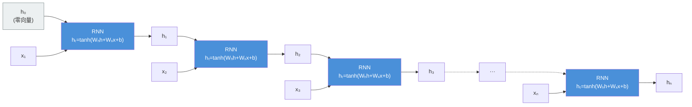
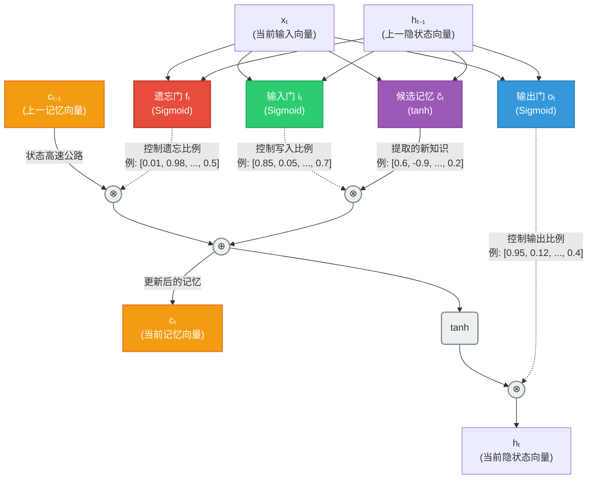
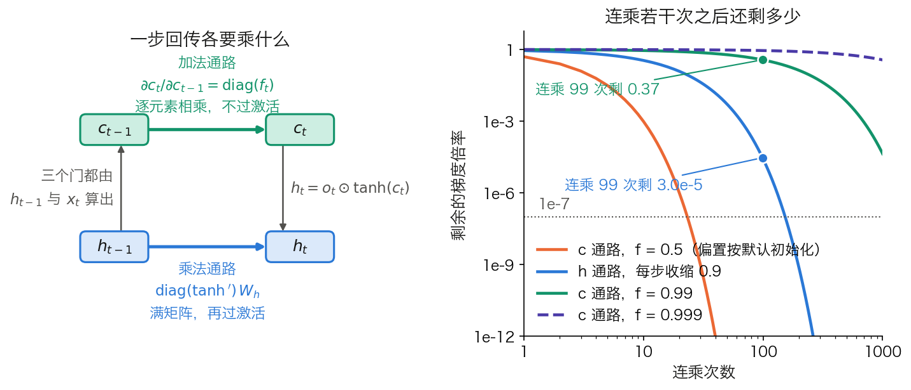

## 1.2 RNN 与 CNN：成就与瓶颈

上一节立起了三条评判轴：变长输入、长距离依赖、计算效率（拆成总计算量与顺序步数）。本节把循环网络与一维卷积放到这三条轴上逐项称量，并把“梯度消失”“串行瓶颈”“感受野有限”这三句常见结论换成可复核的数字。Transformer 的每一个核心设计决策，都能追溯到本节的某一条具体不足。

### 1.2.1 循环神经网络：用“记忆”处理序列

循环神经网络（Recurrent Neural Network，RNN）为序列数据而设计，核心思想是逐个处理序列元素，并维护一个**隐藏状态**（Hidden State）来积累已看过的信息。

在每个时间步 $$t$$，RNN 接收当前输入 $$x_t$$ 和上一步的隐藏状态 $$h_{t-1}$$，算出新的隐藏状态：

$$h_t = \tanh(W_h h_{t-1} + W_x x_t + b)$$

隐藏状态是一个向量，浓缩了到当前位置为止的历史。形状上，若输入宽 $$d_x$$、隐藏宽 $$d_h$$，则 $$W_x$$ 是 $$[d_x, d_h]$$、$$W_h$$ 是 $$[d_h, d_h]$$，$$x_t[1, d_x] \times W_x[d_x, d_h] \to [1, d_h]$$。关键在于所有时间步共享同一组 $$W_h$$、$$W_x$$、$$b$$：参数量与序列长度无关，任意长度的序列都能处理，第一条轴就此解决。

下图将 RNN 沿时间展开（$$h_0$$ 初始化为零向量）：

```mermaid
graph LR
    h0["h₀<br/>(零向量)"] --> A["RNN<br/>hₜ=tanh(Wₕh+Wₓx+b)"]
    x1["x₁"] --> A
    A --> h1["h₁"]
    h1 --> B["RNN<br/>hₜ=tanh(Wₕh+Wₓx+b)"]
    x2["x₂"] --> B
    B --> h2["h₂"]
    h2 --> C["RNN<br/>hₜ=tanh(Wₕh+Wₓx+b)"]
    x3["x₃"] --> C
    C --> h3["h₃"]
    h3 -..-> D[" ··· "]
    D -..-> E["RNN<br/>hₜ=tanh(Wₕh+Wₓx+b)"]
    xn["xₙ"] --> E
    E --> hn["hₙ"]

    style A fill:#4a90d9,color:#fff
    style B fill:#4a90d9,color:#fff
    style C fill:#4a90d9,color:#fff
    style E fill:#4a90d9,color:#fff
    style h0 fill:#ecf0f1,stroke:#7f8c8d
```

图 1-2：RNN 沿时间展开示意图，每个时间步共享同一组参数 $$(W_h, W_x, b)$$

$$h_t$$ 在理论上编码了从序列开头到当前位置的全部信息。序列结束时的末状态可用于分类；每一步的隐藏状态可用于序列标注或生成下一个输出。RNN 在 2010 年代初把语言建模、语音识别、机器翻译的性能都推上了一个台阶。问题出现在序列变长、模型变大之后。

### 1.2.2 单向视野：无法“预知未来”

从左到右逐词处理时，位置 $$i$$ 的隐藏状态只汇总了位置 1 到 $$i$$ 的输入，对右边一无所知。这对**逐位置表示**是硬伤：给“I arrived in London yesterday”做序列标注时，编码到 arrived 的那一步还不知道后面是地点还是时间。Seq2Seq 中的编码器要读完整句才开始解码，末状态已含全句，所以单向的代价不在“看不到全句”，而在每个位置交出的那份表示是残缺的——1.3 节的注意力恰好要逐个读取这些位置表示。

**双向 RNN**（Bidirectional RNN）的做法是同时跑一个正向和一个逆向的 RNN，把两个方向的隐藏状态拼接：$$\vec{h}_i = \text{RNN}_\text{fwd}(x_1, \ldots, x_i)$$，$$\overleftarrow{h}_i = \text{RNN}_\text{bwd}(x_n, \ldots, x_i)$$，位置 $$i$$ 的表示取 $$[\vec{h}_i; \overleftarrow{h}_i]$$，宽度翻倍为 $$2d_h$$。

这一改进有一条不可逾越的前提：逆向那一路必须先看到完整输入。因此双向结构只能用于理解类任务（序列标注、句子分类、作为 Seq2Seq 的编码器），不能用于逐词生成——生成第 $$t$$ 个词时，第 $$t+1$$ 个词还不存在。这条前提在第三章会以另一种面貌重现：BERT 是双向编码器因而不能直接做生成，GPT 用因果掩码换取了生成能力（见 [3.7 节](../03_components/3.7_full_architecture.md)）。此外，双向不解决梯度消失，两个方向上都存在；也不解决串行，两条链各自仍要走 $$n$$ 步。

### 1.2.3 梯度消失：连乘的必然结果

RNN 的训练依赖**时间反向传播**（Backpropagation Through Time，BPTT）：把网络沿时间展开成一个很深的前馈网络，再跑标准反向传播。

梯度从时间步 $$T$$ 回传到时间步 1，要连乘 $$T-1$$ 个一步雅可比：

$$
\frac{\partial h_T}{\partial h_1} = \prod_{t=2}^{T} \frac{\partial h_t}{\partial h_{t-1}}
= \prod_{t=2}^{T} \operatorname{diag}(\tanh'(z_t))\,W_h^{\top}
$$

其中 $$z_t = W_h h_{t-1} + W_x x_t + b$$。每一项都是“一个对角矩阵乘一个固定矩阵”，连乘 $$T-1$$ 次之后，整体倍率大体按几何级数走：若每一项的范数稳定在 $$\rho$$ 附近，剩下的倍率约为 $$\rho^{T-1}$$。

**一格算术。** 取 $$\rho = 0.9$$，回传 100 步剩 $$0.9^{99} = 3.0 \times 10^{-5}$$，回传 1000 步剩 $$1.9 \times 10^{-46}$$。梯度并非“变小”，而是被抹平到与数值噪声同级：优化器看到的几乎只有近处几十步的信号，远处的依赖学不到。反方向同样成立，$$\rho = 1.1$$ 时 100 步后放大到 $$1.3 \times 10^{4}$$，参数一次更新就被打飞。

[Pascanu 等 2013](https://arxiv.org/abs/1211.5063) 给出了准确的条件，值得照抄清楚，因为二手转述常把充分与必要说反。设激活函数导数的绝对值上界为 $$\gamma$$（tanh 取 1，Sigmoid 取 1/4），$$\lambda_1$$ 为 $$W_h$$ 最大特征值的模：$$\lambda_1 < 1/\gamma$$ 是梯度消失的**充分**条件；$$\lambda_1 > 1/\gamma$$ 是梯度爆炸的**必要**条件。也就是说，谱半径大于 1 只是爆炸的前提，并不保证爆炸——tanh 在饱和区的导数远小于 1，实际倍率可能仍然收缩。该文的证明用雅可比的 2-范数（最大奇异值）作上界；谱半径不超过谱范数，所以按谱范数判定更保守。

该文同时给出了爆炸一侧的工程对策：**梯度范数裁剪**（gradient norm clipping）。梯度的范数超过阈值就整体缩放回阈值，方向不变。框架里对应 `torch.nn.utils.clip_grad_norm_`，至今仍是大模型训练的标配之一（见 [6.1 节](../06_training_techniques/6.1_loss_optimizer.md)）。裁剪治得了爆炸，治不了消失：把一个 $$10^{-5}$$ 的梯度放大回来，放大的是噪声。Bengio 等 1994 年的论文已指出，这不是工程细节，而是这类架构的内在数学性质。

### 1.2.4 LSTM 与 GRU：给梯度另开一条通路

**长短期记忆网络**（Long Short-Term Memory，LSTM）由 Hochreiter 和 Schmidhuber 于 1997 年提出，做法是在隐藏状态之外再开一条**记忆单元通路**（Cell State）$$c_t$$，让它以近似线性的方式沿时间传递。

[1997 年的原文](https://www.bioinf.jku.at/publications/older/2604.pdf)只有两个门——输入门与输出门，$$c_t$$ 的自环权重被**固定**为 1.0，论文称之为 constant error carousel（CEC）。这是“梯度一点不衰减”的最纯形态，代价是记忆永远无法重置。**遗忘门**由 Gers、Schmidhuber 和 Cummins 加入（ICANN 1999，扩充版载于 *Neural Computation* 2000，题为 Learning to Forget: Continual Prediction with LSTM），它把恒为 1 的自环换成一个可学习的 $$f_t$$：用可控的衰减换来可重置。当代教科书里的三门 LSTM 指的是这个 2000 年的版本。

三个门结构相同：各自接收 $$x_t$$ 与 $$h_{t-1}$$，做仿射变换后过 Sigmoid，输出与 $$c_t$$ 同维、取值在 0 到 1 之间的向量。

$$f_t = \sigma(W_{fx} x_t + W_{fh} h_{t-1} + b_f)$$
$$i_t = \sigma(W_{ix} x_t + W_{ih} h_{t-1} + b_i)$$
$$o_t = \sigma(W_{ox} x_t + W_{oh} h_{t-1} + b_o)$$

候选记忆走的是 tanh 而非 Sigmoid，因为它提供的是内容而不是开关，取值需要有正有负：

$$\tilde{c}_t = \tanh(W_{cx} x_t + W_{ch} h_{t-1} + b_c)$$

主干道上的两条更新式（$$\odot$$ 表示逐元素相乘）：

$$c_t = f_t \odot c_{t-1} + i_t \odot \tilde{c}_t$$
$$h_t = o_t \odot \tanh(c_t)$$

> [!TIP]
> **门控的值到底长什么样？**
>
> $$f_t$$、$$i_t$$、$$o_t$$ 经过 Sigmoid 挤压后都不是单个数字，而是与 $$c_t$$ 同维的向量（例如 512 维），每个分量都落在 0 到 1 之间，如 `[0.01, 0.98, 0.5, ...]`。与记忆单元逐元素相乘时：接近 0 的分量把该维信息挡住，接近 1 的放行，0.5 通过一半。

下图展示 LSTM 单元的内部结构：

```mermaid
graph TD
    %% 输入
    x_t["xₜ<br/>(当前输入向量)"]
    h_prev["hₜ₋₁<br/>(上一隐状态向量)"]
    c_prev["cₜ₋₁<br/>(上一记忆向量)"]

    %% 输出
    c_next["cₜ<br/>(当前记忆向量)"]
    h_next["hₜ<br/>(当前隐状态向量)"]

    %% 门控网络层
    f_gate["遗忘门 fₜ<br/>(Sigmoid)"]
    i_gate["输入门 iₜ<br/>(Sigmoid)"]
    c_cand["候选记忆 c̃ₜ<br/>(tanh)"]
    o_gate["输出门 oₜ<br/>(Sigmoid)"]

    %% 运算节点
    op_mul_f(("⊗"))
    op_mul_i(("⊗"))
    op_add(("⊕"))
    op_tanh("tanh")
    op_mul_o(("⊗"))

    %% 连线：输入到各个门
    x_t --> f_gate & i_gate & c_cand & o_gate
    h_prev --> f_gate & i_gate & c_cand & o_gate

    %% 连线：遗忘机制 (主干道)
    c_prev -->|"状态高速公路"| op_mul_f
    f_gate -.->|"控制遗忘比例<br/>例: [0.01, 0.98, ..., 0.5]"| op_mul_f

    %% 连线：写入机制
    i_gate -.->|"控制写入比例<br/>例: [0.85, 0.05, ..., 0.7]"| op_mul_i
    c_cand -->|"提取的新知识<br/>例: [0.6, -0.9, ..., 0.2]"| op_mul_i

    op_mul_f --> op_add
    op_mul_i --> op_add

    op_add -->|"更新后的记忆"| c_next

    %% 连线：输出机制
    op_add --> op_tanh
    op_tanh --> op_mul_o
    o_gate -.->|"控制输出比例<br/>例: [0.95, 0.12, ..., 0.4]"| op_mul_o
    op_mul_o --> h_next

    %% 样式美化
    style c_prev fill:#f39c12,color:#fff,stroke:#e67e22,stroke-width:2px
    style c_next fill:#f39c12,color:#fff,stroke:#e67e22,stroke-width:2px
    style f_gate fill:#e74c3c,color:#fff,stroke:#c0392b,stroke-width:2px
    style i_gate fill:#2ecc71,color:#fff,stroke:#27ae60,stroke-width:2px
    style o_gate fill:#3498db,color:#fff,stroke:#2980b9,stroke-width:2px
    style c_cand fill:#9b59b6,color:#fff,stroke:#8e44ad,stroke-width:2px
    style op_mul_f fill:#ecf0f1,stroke:#7f8c8d,stroke-width:2px
    style op_mul_i fill:#ecf0f1,stroke:#7f8c8d,stroke-width:2px
    style op_add fill:#ecf0f1,stroke:#7f8c8d,stroke-width:2px
    style op_mul_o fill:#ecf0f1,stroke:#7f8c8d,stroke-width:2px
    style op_tanh fill:#ecf0f1,stroke:#7f8c8d,stroke-width:2px
```

图 1-3：LSTM 单元结构，记忆单元 $$c_t$$ 通过线性通路传递信息

**为什么这条通路有用：两行推导。** 把 $$c_t = f_t \odot c_{t-1} + i_t \odot \tilde{c}_t$$ 对 $$c_{t-1}$$ 求偏导，直接通路上的项是

$$
\frac{\partial c_t}{\partial c_{t-1}} = \operatorname{diag}(f_t)
$$

与 1.2.3 的 $$\operatorname{diag}(\tanh')W_h^{\top}$$ 对比，区别有两处：没有权重矩阵，也没有激活函数的导数。连乘 $$T$$ 步之后的倍率是 $$\prod_t f_t$$，由门自己决定，与 $$W_h$$ 的谱无关。图 1-4 把两条通路并排画出。

图 1-4：一步回传各要乘什么，以及连乘若干次之后还剩多少（[生成脚本](https://github.com/yeasy/llm_internals/blob/main/tools/figures/ch01_gradient_paths.py)）。左幅蓝色是 h 通路、青绿是 c 通路；右幅只有蓝色一条是 h 通路，其余三条是 c 通路在 $$f$$ 取 0.5、0.99、0.999 时的衰减，横纵轴均为对数刻度。

**一格算术。** 步数口径与 1.2.3 一致，回传 $$T$$ 步连乘 $$T-1$$ 次。$$f = 0.99$$ 时，回传 100 步剩 $$0.99^{99} = 0.37$$；$$f = 0.999$$ 时，回传 1000 步剩 $$0.999^{999} = 0.37$$。与 $$\rho = 0.9$$ 的 $$3.0 \times 10^{-5}$$ 相比，差了四个数量级。这条“高速公路”的前提写得很清楚：$$f_t$$ 必须贴近 1。一旦 $$f = 0.9$$，连乘的就是同一个 $$0.9^{99} = 3.0 \times 10^{-5}$$，与普通 RNN 没有区别。

这条前提有一个直接的工程后果。按常规的小随机数初始化，Sigmoid 的输出在 0.5 附近，相当于每步衰减一半：$$0.5^{99} = 1.6 \times 10^{-30}$$。[Jozefowicz 等 2015](https://proceedings.mlr.press/v37/jozefowicz15.pdf) 指出这一点，并建议把遗忘门偏置 $$b_f$$ 初始化为 1 或 2，让门的初值靠近 1；该文也说明这个做法源自 Gers 等 2000。

> [!NOTE]
> **为什么既有记忆单元 $$c_t$$ 又有隐藏状态 $$h_t$$？**
>
> 在普通 RNN 中，唯一的 $$h_t$$ 要同时承担“沿时间搬运历史”和“对外提供当前表示”两件事，每次更新都会被新输入冲刷。LSTM 把这两种职能拆开：
>
> 1. **内部长期状态 $$c_t$$**：以加法为主更新，为梯度提供一条低衰减通路。
> 2. **对外表示 $$h_t$$**：$$c_t$$ 经 tanh 整流、再由输出门筛选后交出，只暴露与当前预测相关的那部分。
>
> **那为什么不直接拿 $$c_t$$ 当输出？** 两条理由。其一，$$c_t$$ 之所以能缓解梯度消失，正因为它在时间线上几乎只做加法；一旦强迫它直接承担每一步的输出任务，为适应输出的非线性边界，它的数值分布会被扭曲，这条通路也就废了。其二，$$c_t$$ 是累加量，数值无界，直接送入下一层不稳定；$$h_t = o_t \odot \tanh(c_t)$$ 把它压回 $$[-1, 1]$$ 并滤掉无关波动。
>
> 这条“加法旁路”的思路与 2015 年的 Highway Networks 和残差网络（ResNet）同源，但不同型：ResNet 的旁路是恒等映射，系数恒为 1；LSTM 的旁路带门 $$f_t$$，与 Highway Networks 更接近（见 [3.5 节](../03_components/3.5_residual.md)）。

**代价：四倍参数。** 三个门加一个候选记忆，共四组权重，每组都是“输入一份、隐状态一份、偏置一份”。单层参数量为

$$
4\left(d_h(d_x + d_h) + d_h\right)
$$

取 $$d_x = d_h = 1000$$，得 $$4 \times (1000 \times 2000 + 1000) = 8{,}004{,}000$$，约 800 万；同宽的普通 RNN 只有 2,001,000，正好是四分之一。对到实现：PyTorch 的 `nn.LSTM` 把四组权重打包成两个矩阵，`weight_ih_l0` 形状 `[4*hidden_size, input_size]`、`weight_hh_l0` 形状 `[4*hidden_size, hidden_size]`，行按 $$i, f, g, o$$ 的顺序切成四段（$$g$$ 即本节的 $$\tilde{c}$$）；偏置为兼容 cuDNN 存了两份 `bias_ih_l0` 与 `bias_hh_l0`，因此框架报出的参数量是 8,008,000，比数学口径多出一份 $$4d_h$$。

2014 年的**门控循环单元**（Gated Recurrent Unit，GRU）把遗忘门与输入门合并为一个更新门，去掉独立的 $$c_t$$，参数量降到三组，性能相近。

LSTM 与 GRU 在 2014 至 2017 年间主导了几乎所有 NLP 任务，也进了生产系统：Google 的 GNMT 用 8 层编码器加 8 层解码器、每层 1024 个 LSTM 单元上线翻译服务，其中编码器最底层是双向的，正对应 1.2.2 的用法。它们没有解决的是下一小节的问题——[GNMT 论文自报](https://arxiv.org/abs/1609.08144)，WMT 英法模型用 96 块 K80 GPU 训练约 6 天。这限制的不是能不能用，而是模型与数据规模还能不能继续放大。

### 1.2.5 串行计算：顺序步数卡住了吞吐

无论基础 RNN、LSTM 还是 GRU，$$h_t$$ 的计算都必须等 $$h_{t-1}$$ 完成。按 1.1.2 的两个量看，问题不在总计算量。

对长度 $$n = 1000$$、宽度 $$d$$ 的一条序列，RNN 训练一步要发射 1000 次小矩阵乘 $$[B, d] \times [d, d]$$；Transformer 的同一步把它们合成一次 $$[B \cdot n, d] \times [d, d]$$。两者的乘加次数同阶，差别在于前者是 1000 个依次排队的内核、每个只有 $$B$$ 行数据，后者是一个内核、$$B \times 1000$$ 行数据。矩阵越瘦长，每读一个权重字节能摊到的运算次数越少，GPU 的算力就越闲（这条判据在 [10.1 节](../10_inference_optimization/10.1_bottleneck.md)展开为 Roofline 分析）。顺序步数 $$O(n)$$ 因此不只是延迟问题，它同时压低了每一步的算术强度。

| 特性 | RNN/LSTM | 理想方案 |
|------|----------|----------|
| 每层总计算量 | $$O(n \cdot d^2)$$ | 越低越好 |
| 顺序步数 | $$O(n)$$ | $$O(1)$$ |
| 并行度 | 低（串行） | 高（全并行） |
| 长距离依赖路径 | $$O(n)$$ 步 | $$O(1)$$ 步 |
| GPU 利用率 | 低 | 高 |
| 推理时每步的状态大小 | $$O(d)$$，不随已读长度增长 | 越小越好 |

表 1-2：RNN/LSTM 与“理想方案”在六个量上的对照

最后一行是 RNN 唯一一项至今仍占优的指标，值得单独说明。推理时，RNN 只需携带一个固定大小的 $$h_t$$（LSTM 再加一个 $$c_t$$），每生成一个词元的计算量是 $$O(d^2)$$，与已读长度无关。Transformer 为避免重算历史，要保存随长度线性增长的 KV 缓存（见 [3.8.5 节](../03_components/3.8_gpt_inference_flow.md)与 [10.2 节](../10_inference_optimization/10.2_kv_cache.md)）。这笔取舍正是线性注意力与状态空间模型近年回潮的出发点（见 [14.3 节](../14_future_trends/14.3_ssm_hybrid.md)）：它们想拿回 RNN 的恒定状态，同时保住 Transformer 的并行训练。

对并行的渴望推动了两个方向：把 CNN 引入序列建模，以及注意力机制的诞生。

### 1.2.6 CNN 在序列建模中的尝试

一维卷积用固定宽度的核在序列上滑动提取局部特征，不同位置的卷积互不依赖，顺序步数是 $$O(1)$$。2017 年 Facebook 的 ConvS2S 证明纯卷积架构也能胜任机器翻译，训练速度远快于 RNN。

代价是**感受野**（Receptive Field）有限。核宽 $$k$$ 的普通卷积每叠一层，感受野扩大 $$k-1$$，堆 $$L$$ 层后为 $$1 + L(k-1)$$。**一格算术**：$$k = 3$$ 时感受野是 $$2L+1$$，要让相距 1000 的两个位置相互覆盖，需要 $$L = 500$$ 层。若改用扩张率按 $$k$$ 倍增长的空洞卷积，$$L$$ 层的覆盖是 $$k^L$$，$$\log_3 1000 = 6.29$$，7 层即可（$$3^7 = 2187$$）。[Vaswani 等 2017 的表 1 下方](https://arxiv.org/abs/1706.03762)把这两种情形分开写：连续核需要 $$O(n/k)$$ 层，空洞卷积需要 $$O(\log_k n)$$ 层。两个数字相差近两个数量级，引用时必须说明用的是哪一种。

多出来的层不是白来的。ConvS2S 每层都带残差连接，所以深度本身并不必然带回梯度消失；真正的代价是两个位置之间的信息路径变长，每多一层就多一次有损的压缩与混合。

还有一点常被忽略：卷积核在各个位置提取的是同一种模式，本身不带绝对位置信息。[ConvS2S 论文](https://arxiv.org/abs/1705.03122)因此显式加了可学习的位置嵌入，与词嵌入逐元素相加，并在表 4 里做了消融——同时去掉源端与目标端的位置嵌入，验证 BLEU 从 21.7 降到 21.2。该文也点明了对照：循环模型通常不需要显式位置嵌入，因为隐藏状态的递推过程本身就带着“走到第几步”。同一条约束在 1.4 节会再次出现，自注意力的处境比卷积更极端。

RNN 的串行瓶颈与 CNN 的局部视野指向同一个需求：能否有一种机制，既让顺序步数降到常数，又让任意两个位置之间的路径长度降到常数。答案是[注意力机制](1.3_attention_birth.md)。
