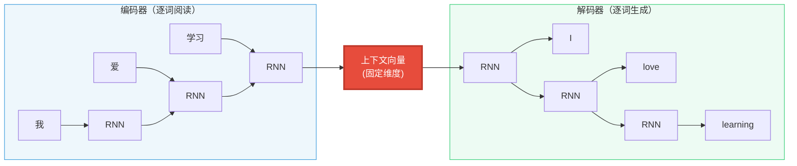
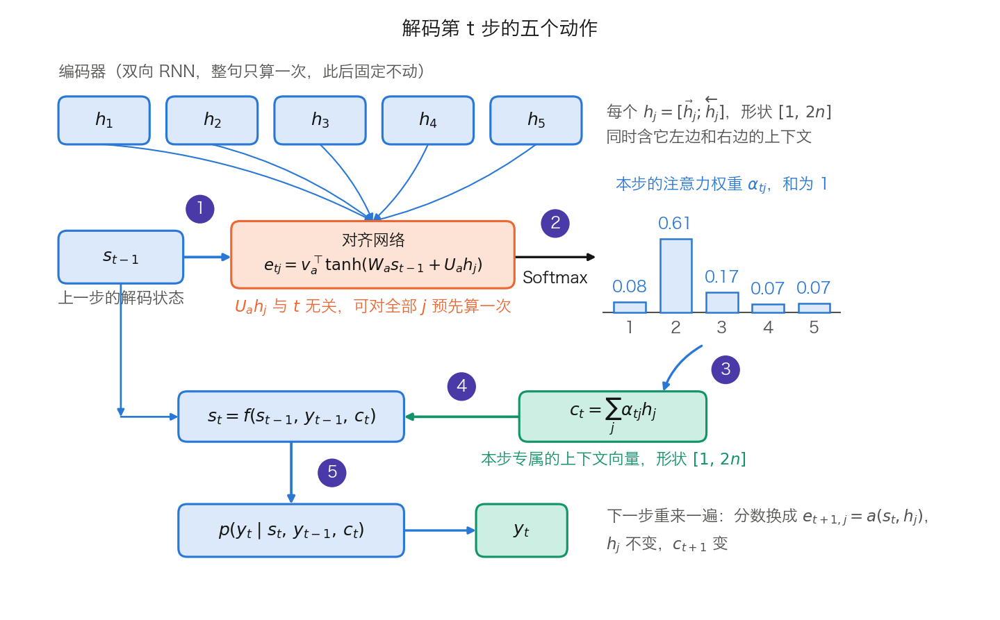

## 1.3 注意力的诞生：让模型学会“看哪里”

上一节留下的缺口是：RNN 把任意长度的输入压进一个固定大小的状态，长距离依赖的路径长度仍是 $$O(n)$$。本节讲注意力如何把这条路径压到 1，代价是什么，以及一个解码步内部的动作顺序——这个顺序是两篇奠基论文最容易混淆之处，也是第二章 Q/K/V 的直接前身。本节的注意力仍嫁接在 RNN 之上，串行瓶颈要到 1.4 节才被拆掉。

### 1.3.1 编码器-解码器：理解与生成的分离

2014 年，[Sutskever 等提出的**序列到序列**](https://arxiv.org/abs/1409.3215)（Sequence-to-Sequence，Seq2Seq）模型把机器翻译拆成两个阶段，分别交由**编码器**（Encoder）和**解码器**（Decoder）负责。

#### 为什么要分离

翻译的输入与输出是两种语言，词汇、语法和表达方式都不同。让同一个模块同时负责“读懂源语言”和“写出目标语言”，等于把两套统计规律塞进一组参数。分开之后，编码器只需把输入变成一种与语言无关的中间表示，解码器只需从这种表示出发生成目标语言，各自的参数不再互相牵制。

#### 编码器的本质

编码器把离散、变长的输入序列转成连续的内部表示。在 Seq2Seq 中它是一个 RNN，逐词阅读并更新隐藏状态；读到序列末尾时，末状态被当作整句的语义摘要，称为**上下文向量**（Context Vector）。它的价值在于把“不同长度的符号序列”统一成“固定形状的数值表示”，让后续的生成有一个可操作的起点。

#### 解码器的本质

解码器在给定这份表示的条件下逐步构建输出。它同样是一个 RNN，以上下文向量作为初始状态，每一步生成一个词元，并把这个词元作为下一步的输入。因此每一步的输出同时依赖两种信息：编码器给的“对输入的理解”，以及自己已经写出的部分。

训练与推理在这里并不对称。训练时用的是**教师强制**（Teacher Forcing）：第 $$t$$ 步的输入取自真实目标句的第 $$t-1$$ 个词，而不是模型自己上一步的输出，因此整条目标句的监督信号可以一次算出。推理时没有真实答案，只能把模型自己的输出接回输入，一步接一步。这条不对称贯穿全书，Transformer 也没有改变它（见 1.4.3 与 [9.1 节](../09_decoding/9.1_autoregressive_decode.md)）。

#### 协作与信息瓶颈

下图展示 Seq2Seq 的结构。注意中间那个固定大小的上下文向量：编码器的全部“理解”都要压进它，解码器对输入的全部了解也只来自它。

图 1-5：Seq2Seq 编码器-解码器架构，所有信息必须通过中间的固定维度向量

这个向量有多大？[Sutskever 等 2014 的原文](https://arxiv.org/abs/1409.3215)写得很具体：4 层 LSTM、每层 1000 个单元、1000 维词嵌入，于是“the deep LSTM uses 8000 real numbers to represent a sentence”。8000 这个数来自 $$4 \text{ 层} \times 2 \text{ 份}(c \text{ 与 } h) \times 1000$$。

**一格算术，以及一个常见论证的失效。** 把 8000 个 float32 数一数比特：$$8000 \times 32 = 256{,}000$$ bit，合 31 KiB。再按该文自己的词表给句子的信息量估一个上界：源端取最高频的 160,000 词，每个词最多 $$\log_2 160{,}000 = 17.3$$ bit，50 个词的句子不超过 $$50 \times 17.3 = 865$$ bit，只占 256,000 bit 的 0.34%。自然语言每词的实际熵远低于这个上界，差距只会更大。所以“比特装不下”这个论证不成立，瓶颈另有来源。

真正的约束有两条。其一，编码器必须在**不知道解码器将要问什么**的前提下完成压缩：同一个向量要同时支持“第一个目标词该译什么”“第十个目标词该译什么”等所有询问，只能编码一份折中的摘要。其二，这份摘要必须以一个 RNN 能逐步解出的形式存在，而 RNN 的末状态天然偏向最近读到的输入——Sutskever 等正是因此把源句倒序输入，让源句开头与目标句开头靠近，测试困惑度从 5.8 降到 4.7，BLEU 从 25.9 升到 30.6。一个靠调整输入顺序就能多拿 4.7 个 BLEU 点的架构，说明问题出在“什么时候决定读哪里”，而不是“能存多少比特”。

实证也指向同一处。[Cho 等 2014](https://arxiv.org/abs/1409.1259) 报告这类模型在短句上表现尚可，但性能随句长与未登录词数量迅速下滑，该文把这一现象命名为 the curse of sentence length。[Bahdanau 等 2015 的图 2](https://arxiv.org/abs/1409.0473) 给出了直接对照：固定向量的 RNNencdec 随句长明显下滑，带注意力的 RNNsearch-50 按该文 5.1 节的说法，在 50 词及以上的句子上也没有出现性能退化。

> 编码器-解码器的分离是一个影响深远的架构思想。Seq2Seq 的信息瓶颈很快被注意力机制解决（见 1.3.2），但“理解与生成分离”延续到了 Transformer 时代。Transformer 的原始架构仍是编码器-解码器，后续的 BERT（仅编码器）、GPT（仅解码器）和 T5（编码器-解码器）分别发展了这一思想的不同侧面，系统对比见[第三章](../03_components/3.7_full_architecture.md)。

### 1.3.2 Bahdanau 注意力：把“读哪里”推迟到解码时

2015 年，Bahdanau 等给出的解法是：解码每个词时不再只看那一个固定向量，而是回头读编码器在每个位置留下的隐藏状态，并自动决定各读多少。

> 为什么读隐藏状态而不是原始词向量？因为 $$h_j$$ 不只编码了位置 $$j$$ 的词，还融合了上下文。原始词向量里，“苹果”在“吃苹果”和“苹果公司”中完全一样；隐藏状态则已经带上了区分二者的信息。更关键的是，该文的编码器是**双向 RNN**，$$h_j = [\vec{h}_j; \overleftarrow{h}_j]$$ 同时含左右两侧的上下文，宽度是单向的两倍。这正好接上 1.2.2 留下的线索：双向结构不能用于生成，但可以用于编码。

**解码一步的五个动作，以及它们的顺序。** 这是全节最要紧的地方。按[该论文第 3.1 节](https://arxiv.org/abs/1409.0473)，第 $$i$$ 步依次做：

1. 用**上一步**的解码状态 $$s_{i-1}$$ 与每个 $$h_j$$ 算对齐分数 $$e_{ij} = a(s_{i-1}, h_j)$$
2. 对 $$j$$ 归一化得到权重 $$\alpha_{ij} = \dfrac{\exp(e_{ij})}{\sum_{k=1}^{T_x}\exp(e_{ik})}$$
3. 加权求和得到本步专属的上下文向量 $$c_i = \sum_j \alpha_{ij} h_j$$
4. 更新解码状态 $$s_i = f(s_{i-1},\, y_{i-1},\, c_i)$$
5. 输出分布 $$p(y_i \mid y_{<i}, x) = g(y_{i-1},\, s_i,\, c_i)$$

原文对第 1 步的措辞很明确：分数基于“即将发出 $$y_i$$ 之前”的那个隐藏状态，也就是 $$s_{i-1}$$。顺序不能颠倒：$$c_i$$ 是算 $$s_i$$ 的输入之一，因此打分只能用 $$s_{i-1}$$。用当前状态打分的是下一小节的 Luong。

图 1-6：解码第 $$t$$ 步的五个动作（[生成脚本](https://github.com/yeasy/llm_internals/blob/main/tools/figures/ch01_bahdanau_step.py)）。蓝色是随输入变化的数据，橙色是权重，青绿是本步新产生的量；柱状图里的权重由脚本中的五个分数经 Softmax 算出。图中用 $$t$$ 记解码步，与正文的 $$i$$ 同义。

注意力权重本身不决定输出哪个词，它决定的是本步该参考源句的哪些部分；最终由第 5 步综合 $$s_i$$、$$y_{i-1}$$ 和 $$c_i$$ 做出预测。与 Seq2Seq 的根本区别在下标：那里的上下文向量只有一个，对所有解码步完全相同；这里每一步都重算一个 $$c_i$$，相当于每次带着不同的问题重新翻阅原文。

**形状与真实配置。** 该文用的加性打分函数是

$$
e_{ij} = v_a^{\top} \tanh(W_a s_{i-1} + U_a h_j)
$$

附录 A.2.2 与 A.2.3 给出的形状与配置是：隐层宽度 $$n = 1000$$、词嵌入维度 $$m = 620$$、深度输出的 maxout 隐层 $$l = 500$$、对齐网络隐层 $$n' = 1000$$。据此三个权重的形状是 $$W_a[n', n]$$、$$U_a[n', 2n]$$、$$v_a[n']$$，即 `[1000, 1000]`、`[1000, 2000]`、`[1000]`；$$h_j$$ 的 $$2n$$ 来自双向拼接。论文还点出了一个实现要点：$$U_a h_j$$ 不依赖 $$i$$，可以对全部 $$j$$ 预先算一次，每个解码步只需重算 $$W_a s_{i-1}$$ 并做 $$T_x$$ 次加法与 tanh。

**一格算术：三个源位置。** 为看清每一步的算术，把维度缩到 2。设 $$s = [1, 2]$$，三个源位置的表示为 $$h_1 = [2, 0]$$、$$h_2 = [0, 2]$$、$$h_3 = [1, 1]$$，打分改用最简单的点积 $$e_j = s \cdot h_j$$：

- 分数：$$e_1 = 1 \times 2 + 2 \times 0 = 2$$，$$e_2 = 1 \times 0 + 2 \times 2 = 4$$，$$e_3 = 1 \times 1 + 2 \times 1 = 3$$
- 取指数：$$e^2 = 7.389$$，$$e^4 = 54.598$$，$$e^3 = 20.086$$，行和 $$= 82.073$$
- 权重：$$7.389/82.073 = 0.090$$，$$54.598/82.073 = 0.665$$，$$20.086/82.073 = 0.245$$
- 加权求和：第 1 个分量 $$(0.090 \times 2 + 0.665 \times 0 + 0.245 \times 1) = 0.425$$，第 2 个分量 $$(0 + 0.665 \times 2 + 0.245 \times 1) = 1.575$$，即 $$c = [0.425,\ 1.575]$$

分数只差 1 和 2，权重却拉开到 0.090 与 0.665，这是指数放大的结果。这条性质在下一小节会变成一个需要处理的问题。第二章的 Q/K/V 做的就是同一套算术，只是把 $$s$$ 换成 Query、把 $$h_j$$ 同时当作 Key 和 Value（见 [2.1 节](../02_attention/2.1_qkv_intuition.md)）。

注意力还附带一个产物：把 $$\alpha_{ij}$$ 排成矩阵可视化，就能看到翻译每个目标词时模型读了源句的哪些位置。这是一种诊断工具而非解释：权重说明信息从哪里被取走，不说明模型为何做出该预测。

### 1.3.3 从加性注意力到点积注意力

Bahdanau 之后不久，[Luong 等 2015](https://arxiv.org/abs/1508.04025) 提出了更简洁的打分方式，并把三种形式并列写出（$$h_t$$ 是目标端状态，$$\bar{h}_s$$ 是源端状态）：

$$
\operatorname{score}(h_t, \bar{h}_s) =
\begin{cases}
h_t^{\top} \bar{h}_s & \textit{dot} \\
h_t^{\top} W_a \bar{h}_s & \textit{general} \\
v_a^{\top} \tanh(W_a [h_t; \bar{h}_s]) & \textit{concat}
\end{cases}
$$

该文还区分了 global 与 local 两类：前者对所有源位置打分，后者先预测一个对齐位置 $$p_t$$，只在它周围的窗口内打分。

**两种打分的取舍。**

- 点积（dot）没有可学习参数，且能写成一次矩阵乘法，在 GPU 上由高度优化的内核完成。前提是 $$h_t$$ 与 $$\bar{h}_s$$ 维度相同；维度不同时要退回 general 形式，靠 $$W_a$$ 转接。
- 加性（concat）多一组参数和一次 tanh，但对两端维度没有要求，且在高维下更稳。

第二条优势有具体来源。[Vaswani 等 2017 的 3.2.1 节](https://arxiv.org/abs/1706.03762)写道，两者在 $$d_k$$ 较小时表现相近，$$d_k$$ 较大时不做缩放的点积会输给加性；该文脚注给出了原因：设 $$q$$、$$k$$ 的各分量独立、均值 0、方差 1，则 $$q \cdot k$$ 的方差是 $$d_k$$。方差随维度线性增长，分数被拉开，Softmax 落进梯度极小的饱和区。上一小节的算例正是这一现象的缩影：把那三个分数同乘 2，权重从 0.090/0.665/0.245 变成 0.016/0.867/0.117；同乘 4 则变成 0.0003/0.982/0.018，几乎成了 one-hot，反传回去的梯度也随之趋零。Transformer 的对策是给点积除以 $$\sqrt{d_k}$$，把方差拉回 1（见 [2.2 节](../02_attention/2.2_scaled_dot_product.md)）。

另一条常见的说法需要收窄：点积不等于方向相似度。$$q \cdot k = \|q\|\|k\|\cos\theta$$ 同时取决于两个模长，只有先归一化才只剩夹角。上面“同乘一个倍数”的演示就是模长在起作用，而不是方向变了。

两篇论文的差别不止打分函数，还有解码一步的时序，这一点常被混为一谈。Luong 论文在与 Bahdanau 的对比中直接写出了两条计算路径：自己是 $$h_t \to a_t \to c_t \to \tilde{h}_t$$，Bahdanau 是 $$h_{t-1} \to a_t \to c_t \to h_t$$。表 1-3 把两者并列。

| 对照项 | Bahdanau 2015 | Luong 2015 |
| --- | --- | --- |
| 打分用的解码状态 | 上一步的 $$s_{i-1}$$ | 当前步的 $$h_t$$ |
| 计算路径 | $$s_{i-1} \to \alpha_i \to c_i \to s_i \to y_i$$ | $$h_t \to a_t \to c_t \to \tilde{h}_t \to y_t$$ |
| 上下文向量的去向 | 作为输入参与算出 $$s_i$$ | 与 $$h_t$$ 拼接后过一层 tanh 得 $$\tilde{h}_t$$ |
| 打分函数 | 只试了加性（concat） | dot、general、concat 三种 |
| 编码器 | 双向 RNN，$$h_j$$ 宽 $$2n$$ | 堆叠 LSTM 的顶层状态 |
| 关注范围 | 全部源位置 | global 与 local 两种 |

表 1-3：两篇注意力奠基论文的时序与打分对照。各行取自两文正文，Luong 论文在 3.1 节末尾明确对比了两条计算路径。

从加性到点积这一步看似微小，却决定了此后的走向：注意力的全部计算都能落在矩阵乘法上，而矩阵乘法正是 GPU 最擅长的算子。

### 1.3.4 注意力带来的变化与它的代价

回到 1.1.2 的三条轴，注意力改变了其中两条。

**第一，固定向量不再是唯一通道。** 解码器可以访问编码器每个位置的完整表示，能取多少信息不再受一个向量的宽度限制。

**第二，路径长度从 $$O(n)$$ 降到 $$O(1)$$。** 在 Seq2Seq 中，源句第一个词的信息要依次经过所有编码时间步、再经过解码时间步才能影响当前输出；有了注意力，解码器一跳就能读到任意源位置。

代价出现在第三条轴上，而且是两笔实打实的开销。

**存储。** 编码器的全部注释都要保留。源句 50 个词、$$n = 1000$$ 的双向编码器，注释矩阵形状是 $$[50, 2000]$$，共 100,000 个实数，是那 8000 个数的 12.5 倍，并且随源句长度线性增长。Seq2Seq 的 $$O(1)$$ 存储换成了 $$O(n)$$。

**计算。** 每个解码步要对全部 $$n$$ 个源位置各打一次分，生成 $$m$$ 个目标词共 $$n \times m$$ 次打分；源 50 词、目标 60 词即 3000 次。加性打分的每一次还含一次 $$[1, n']$$ 规模的向量运算。

这笔“用随长度增长的存储与计算，换路径长度降到 1”的账，与后文 KV 缓存的账是同一笔（见 [10.2 节](../10_inference_optimization/10.2_kv_cache.md)）：只要允许任意位置被直接读取，就得把可被读取的东西全部留着。

还有一处细节值得先记下，它是下一节的直接引子：$$h_j$$ 在这里身兼两职——既是算分数的依据（决定读多少），又是被取走的内容（决定读到什么）。两种角色用同一个向量承担，意味着“容易被找到”和“携带有用内容”这两件事必须妥协在同一组数里。

这一阶段的注意力仍嫁接在 RNN 之上，编码器和解码器依旧是 LSTM 或 GRU，顺序步数仍是 $$O(n)$$。于是问题自然浮现：既然注意力已能直接连接任意两个位置，还需要 RNN 吗？
