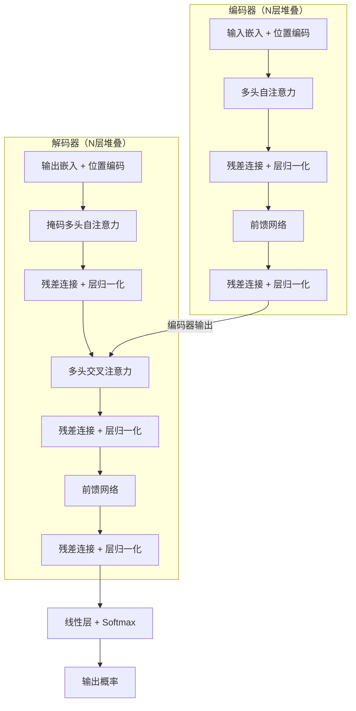

## 1.4 Transformer 的提出与核心思想

2017 年 6 月，Google 的 Vaswani 等人发表了论文《Attention Is All You Need》。这篇论文的标题本身就是一个激进的宣言：**注意力就是你所需要的全部——不需要 RNN，不需要 CNN。**

### 1.4.1 “完全基于注意力”的设计理念

Transformer 的核心创新并不在于发明了某种全新的数学工具，而在于一个大胆的**架构决策**：完全抛弃循环结构和卷积结构，仅用注意力机制和简单的前馈网络构建整个模型。

这个决策的动机直接来源于前面讨论的 RNN 与 CNN 的局限性：

- **消除串行瓶颈**：去掉 RNN 的循环结构后，序列中所有位置的计算可以完全并行，训练速度大幅提升。
- **建立直接连接**：自注意力机制让每个位置都能直接关注序列中的任意其他位置，信息传递路径为 $O(1)$。
- **统一的计算模式**：整个模型由相同结构的“层”堆叠而成，每层包含注意力子层和前馈子层，架构简洁一致。

这看起来似乎是一个简单的“替换”——用注意力层替换循环层。但实际上，要让这种纯注意力架构真正工作起来，需要解决一系列精巧的设计问题，这正是 Transformer 论文最重要的贡献。

### 1.4.2 自注意力：从“看别人”到“看自己”

在 [1.3 节](1.3_attention_birth.md)讨论的注意力机制中，注意力发生在编码器和解码器之间——解码器关注编码器的输出。这称为**交叉注意力**（Cross-Attention）。

Transformer 引入了一个关键变体：**自注意力**（Self-Attention）。自注意力不是让解码器看编码器，而是让序列中的每个位置看同一个序列中的所有其他位置（包括自己）。

为什么需要自注意力？考虑理解句子"The animal didn't cross the street because it was too tired“中的代词”it“。要确定”it“指的是”animal“还是”street“，模型需要在同一个句子内部建立词与词之间的关系。自注意力正是做这件事的机制——它让每个词都能”询问“序列中其他所有词，并根据相关性来更新自己的表示。

这一设计带来了深远的影响：通过多层自注意力的堆叠，模型能够逐层构建越来越抽象的表示，底层捕捉语法和局部关系，高层捕捉语义和全局关系。

### 1.4.3 Transformer 的整体架构

Transformer 采用了经典的**编码器-解码器**（Encoder-Decoder）结构，但内部完全由注意力机制和前馈网络构成。下面用 Mermaid 图展示其高层架构：

图 1-5：Transformer 编码器-解码器整体架构

每个编码器层包含两个子层：

1. **多头自注意力子层**：让每个位置关注输入序列中的所有位置
2. **逐位置前馈网络子层**：对每个位置的表示进行独立的非线性变换

每个解码器层包含三个子层：

1. **掩码多头自注意力子层**：让每个位置只关注它之前的位置（防止”看到未来“）
2. **多头交叉注意力子层**：让解码器关注编码器的输出
3. **逐位置前馈网络子层**：与编码器中相同

值得注意的是，编码器和解码器的输入都需要加上**位置编码**（Positional Encoding）。这是因为自注意力机制本身是**置换不变的**（Permutation-Invariant）——它只关心元素之间的关系，不关心元素的顺序。因此，必须通过位置编码显式注入顺序信息，否则模型无法区分不同排列的序列。位置编码的设计方案将在[第四章](../04_position_encoding/README.md)详细讨论。

每个子层都使用了**残差连接**（Residual Connection）和**层归一化**（Layer Normalization），即子层的输出为 $\text{LayerNorm}(x + \text{Sublayer}(x))$。这些设计细节的原因和效果将在后续章节中详细讨论。

### 1.4.4 为什么这个设计如此有效

Transformer 的设计看似”简单"，但它精巧地同时解决了序列建模的三个核心挑战：

**解决变长输入**：自注意力对序列中每对位置计算关系，自然地适应任意长度的输入。无论序列有 10 个还是 10000 个词元（Token），计算逻辑完全相同。

**解决长距离依赖**：在自注意力中，任意两个位置之间的信息传递路径长度为 $O(1)$——不需要像 RNN 那样经过中间每个时间步，也不需要像 CNN 那样堆叠多层才能扩大感受野。这是 Transformer 最根本的优势之一。

**解决计算效率**：去掉了循环结构后，所有位置的注意力计算可以通过矩阵乘法**完全并行**完成。这使得 Transformer 能够充分利用 GPU 的并行计算能力，训练吞吐量远超同期的 RNN 模型。

下面的表格对比了三种架构在关键指标上的表现：

| 指标 | RNN | CNN | Transformer |
|------|-----|-----|-------------|
| 每层复杂度 | $O(n \cdot d^2)$ | $O(k \cdot n \cdot d^2)$ | $O(n^2 \cdot d)$ |
| 顺序操作数 | $O(n)$ | $O(1)$ | $O(1)$ |
| 最大路径长度 | $O(n)$ | $O(n/k)$ | $O(1)$ |

表 1-2：三种架构的复杂度对比（$n$：序列长度，$d$：模型维度，$k$：卷积核大小）

值得注意的是，Transformer 的 $O(n^2 \cdot d)$ 复杂度意味着它在**超长序列**上的计算成本会迅速增长——这也确实成为了后续研究的重点优化方向（参见[第十四章](../14_future_trends/README.md)）。但对于常见的序列长度（数百到数千个词元），且维度 $d$ 通常较大时，$n < d$ 使得 Transformer 实际上比 RNN 更快。

### 1.4.5 原始论文的实验验证

Vaswani 等人在 WMT 2014 英德和英法翻译任务上验证了 Transformer 的效果。结果令人瞩目：

- **英德翻译**：BLEU 分数达到 28.4，超越了当时所有已发表结果（包括模型集成）
- **英法翻译**：BLEU 分数达到 41.0，刷新了单模型记录
- **训练效率**：在 8 块 P100 GPU 上训练 3.5 天即可达到最优性能，而当时最好的 RNN 模型需要训练数周

论文还通过消融实验系统验证了各个设计选择的贡献：多头注意力优于单头，注意力头数存在最优点（非越多越好），前馈网络的中间维度对性能有重要影响。这些实验为后续研究提供了重要的设计指导。
