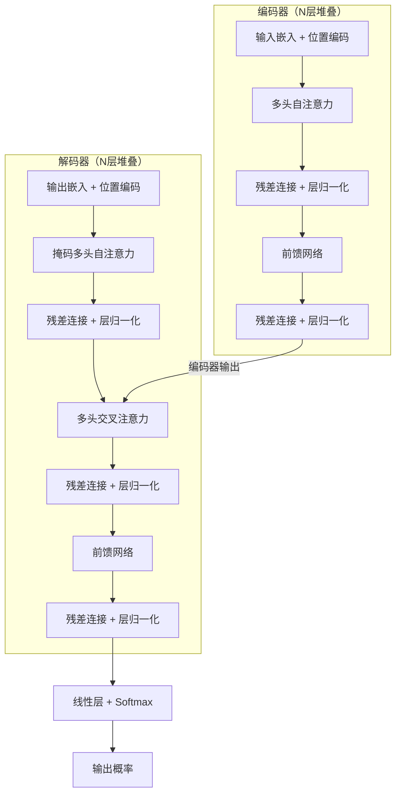
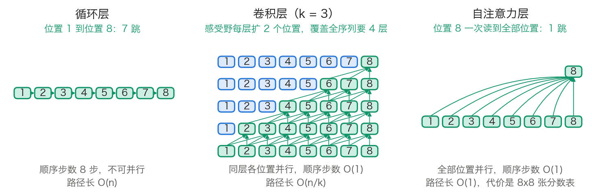

## 1.4 Transformer 的提出与核心思想

上一节结束时，注意力还只是嫁接在 RNN 之上的一个部件：它把源位置到解码器的路径缩短到了 $$O(1)$$，可编码器和解码器本身仍要走完 $$O(n)$$ 个时间步。2017 年 6 月，[Vaswani 等的《Attention Is All You Need》](https://arxiv.org/abs/1706.03762)把剩下的循环结构整个拿掉。本节讲这一决策改变了什么、原论文的配置与实验数字是多少，以及“完全并行”这句话在什么范围内成立。自注意力本身怎么算，留给第二章。

### 1.4.1 “完全基于注意力”的设计理念

Transformer 的核心创新不在于发明了新的数学工具，而在于一个**架构决策**：不用循环也不用卷积，只用注意力和逐位置前馈网络搭出整个模型。

这个决策直接对应前两节的三条不足：

- **消除串行瓶颈**：去掉循环后，编码器与训练时的解码器中，所有位置的计算可以一次完成，顺序步数从 $$O(n)$$ 降到 $$O(1)$$。
- **建立直接连接**：自注意力让每个位置直接读取序列中的任意位置，路径长度为 $$O(1)$$。
- **统一的计算模式**：整个模型由同构的层堆叠而成，每层只有注意力子层与前馈子层两种部件。

拿掉循环之后有两笔账要补：顺序信息没有了，必须显式注入；深层堆叠的训练稳定性要靠残差与归一化撑住。这两件事才是论文里真正精巧的部分。

### 1.4.2 自注意力：从“看别人”到“看自己”

[1.3 节](1.3_attention_birth.md)的注意力发生在解码器与编码器之间，称为**交叉注意力**（Cross-Attention）。**自注意力**（Self-Attention）让序列中的每个位置去看同一个序列中的所有位置（包括自己）。

自注意力并非该论文的发明。论文第 2 节自己交代，自注意力又称 intra-attention，此前已被用于阅读理解、抽象摘要、文本蕴含和句子表示等任务；该文的原话是，据其所知 Transformer 是**第一个完全依赖自注意力**、不使用序列对齐 RNN 或卷积来计算输入与输出表示的转导模型。贡献在“只用”，不在“引入”。

为什么需要自注意力？考虑句子 “The animal didn't cross the street because it was too tired” 中的代词 it。要判断它指向 animal 还是 street，必须在同一个句子内部建立词与词的关系。自注意力让每个词向其余所有词发问，并按相关性更新自己的表示。

**一身两职被拆成三个投影。** 1.3.4 结尾指出，Bahdanau 的 $$h_j$$ 同时充当打分依据与被取走的内容。改成自注意力时，序列里的每个位置既要向别人发问、又要被别人匹配、还要提供内容，三种角色全落在同一个向量上，矛盾比原来更尖锐。解法是给同一个向量乘三个不同的矩阵，分别得到 Query、Key、Value：发问用 Query，被匹配用 Key，被取走的内容用 Value。$$h_j$$ 的两职因此拆成 Key 与 Value 两个独立投影，模型可以学出“容易被找到”与“携带有用内容”两套不同的表示。这三个投影的形状与算法见 [2.1 节](../02_attention/2.1_qkv_intuition.md)与 [3.8.3 节](../03_components/3.8_gpt_inference_flow.md)。

多层堆叠之后，不同层的表示确实呈现出分工。探针研究报告较低层更多反映词法与句法、较高层更多反映语义与篇章（[Tenney 等 2019](https://arxiv.org/abs/1905.05950) 的说法是 BERT 按传统 NLP 流水线的顺序分布这些信息）。但这是统计倾向而非严格分层，具体划分随模型与探针任务变化，不宜当成设计规则（见 [14.8 节](../14_future_trends/14.8_interpretability.md)）。

### 1.4.3 整体架构与两种运行模式

Transformer 采用编码器-解码器结构，内部完全由注意力与前馈网络构成：

```mermaid
graph TB
    subgraph enc["编码器（N层堆叠）"]
        e_input["输入嵌入 + 位置编码"]
        e_sa["多头自注意力"]
        e_an1["残差连接 + 层归一化"]
        e_ff["前馈网络"]
        e_an2["残差连接 + 层归一化"]
        e_input --> e_sa --> e_an1 --> e_ff --> e_an2
    end

    subgraph dec["解码器（N层堆叠）"]
        d_input["输出嵌入 + 位置编码"]
        d_sa["掩码多头自注意力"]
        d_an1["残差连接 + 层归一化"]
        d_ca["多头交叉注意力"]
        d_an2["残差连接 + 层归一化"]
        d_ff["前馈网络"]
        d_an3["残差连接 + 层归一化"]
        d_input --> d_sa --> d_an1 --> d_ca --> d_an2 --> d_ff --> d_an3
    end

    e_an2 -->|"编码器输出"| d_ca
    d_an3 --> linear["线性层 + Softmax"]
    linear --> output["输出概率"]
```

图 1-7：Transformer 编码器-解码器整体架构

每个编码器层含两个子层：多头自注意力，逐位置前馈网络。每个解码器层含三个：掩码多头自注意力（只看自己和左边），多头交叉注意力（读编码器输出），逐位置前馈网络。每个子层都套上残差连接与层归一化，原论文写作 $$\text{LayerNorm}(x + \text{Sublayer}(x))$$，即归一化在子层之后，称为 Post-Norm。

编码器与解码器的输入都要加上**位置编码**（Positional Encoding）。原因是自注意力对位置是置换等变的：把输入位置重排，输出只会跟着重排，模型本身分不出谁在第几位。这比 1.2.6 里卷积的处境更极端——卷积核至少还携带局部的相对顺序，自注意力连这一点都没有。设计方案见[第四章](../04_position_encoding/README.md)。

**训练时并行，生成时仍然串行。** “完全并行”只对编码器和**训练时**的解码器成立，这一点必须说在前面，否则后半本书的出发点会被误解。训练时用教师强制：解码器的输入是真实目标句右移一位的结果，因果掩码保证位置 $$i$$ 只能看到位置 $$1$$ 到 $$i$$，于是一次前向就能同时算出所有位置的预测。推理时没有真实答案，第 $$i$$ 个词元必须等第 $$i-1$$ 个选出来才能作为输入，因此生成 $$m$$ 个词元仍需 $$m$$ 次顺序前向。Transformer 消掉的是**训练**的顺序步数，没有消掉**生成**的。整条推理轨迹见 [3.8 节](../03_components/3.8_gpt_inference_flow.md)，围绕它展开的优化占了第十、十一两章。

原论文给出了两组配置：

| 超参数 | base | big |
| --- | ---: | ---: |
| 层数 $$N$$（编码器与解码器各） | 6 | 6 |
| $$d_{\text{model}}$$ | 512 | 1,024 |
| 前馈中间层 $$d_{\text{ff}}$$ | 2,048 | 4,096 |
| 头数 $$h$$ | 8 | 16 |
| 每头宽度 $$d_k = d_v$$ | 64 | 64 |
| Dropout $$P_{drop}$$ | 0.1 | 0.3 |
| 标签平滑 $$\epsilon_{ls}$$ | 0.1 | 0.1 |
| 训练步数 | 100K | 300K |
| 训练时长（8 块 P100） | 12 小时 | 3.5 天 |
| 参数量 | 65M | 213M |
| newstest2013 开发集 BLEU | 25.8 | 26.4 |

表 1-4：原论文 base 与 big 的配置。层数至参数量各行取自论文表 3 的首行与末行，表注写明“Unlisted values are identical to those of the base model”，故 big 的 $$d_k$$ 仍为 64，$$16 \times 64 = 1024 = d_{\text{model}}$$；训练步数与时长取自 5.2 节。注意 $$h \times d_k = d_{\text{model}}$$ 这条关系在两组配置上都成立，头不是额外加出来的宽度，而是把 $$d_{\text{model}}$$ 分给各个头（见 3.8.3 的表 3-16）。

### 1.4.4 参数都在哪里：把 65M 拆开

有了配置就能自己把参数量算出来，这比记住“65M”有用得多。按“只数矩阵乘、不计偏置与 LayerNorm”的粗口径：

- 编码器层：自注意力的 Q、K、V、O 四个投影各 $$d^2$$，共 $$4d^2$$；前馈的两个矩阵各 $$d \cdot d_{\text{ff}}$$，共 $$2 d\, d_{\text{ff}}$$。
- 解码器层：多一个交叉注意力子层，注意力部分翻倍为 $$8d^2$$；前馈同上。
- 词嵌入：EN-DE 用的是源目标共享的 BPE 词表，论文 5.1 节写明约 37,000 个词元，故为 $$37{,}000 \times d$$。

代入 base（$$N = 6$$，$$d = 512$$，$$d_{\text{ff}} = 2048$$），先算一格：单个编码器层的注意力部分是 $$4 \times 512^2 = 1{,}048{,}576$$，前馈部分是 $$2 \times 512 \times 2048 = 2{,}097{,}152$$，合计约 314 万，其中前馈占三分之二。整体：

$$
\underbrace{6(4d^2 + 2d\,d_{\text{ff}})}_{18{,}874{,}368}
+ \underbrace{6(8d^2 + 2d\,d_{\text{ff}})}_{25{,}165{,}824}
+ \underbrace{37{,}000 \times 512}_{18{,}944{,}000}
= 62{,}984{,}192
$$

约 63M，与论文表 3 的 65M 相差不到 4%，差额来自偏置、LayerNorm 参数与词表大小的取整。同一套算法代入 big（$$d = 1024$$，$$d_{\text{ff}} = 4096$$）得 $$75{,}497{,}472 + 100{,}663{,}296 + 37{,}888{,}000 = 214{,}048{,}768$$，约 214M，论文记 213M。

这个拆分暴露了两件事。其一，base 有 $$18{,}944{,}000 / 62{,}984{,}192 = 30\%$$ 的参数在词嵌入上，模型越窄这一块的占比越高（对照表 1-1）。其二，抛开嵌入，前馈网络比注意力更吃参数：编码器层里是 $$8d^2$$ 对 $$4d^2$$，正好两倍；解码器层多一个交叉注意力子层，两者持平；整个 base 模型合计 $$96d^2$$ 对 $$72d^2$$，比值 4 比 3。仅解码器模型没有交叉注意力，比值回到 2 比 1，这正是 [3.8.7 节](../03_components/3.8_gpt_inference_flow.md)里“$$24Td^2$$ 中 MLP 占三分之二”的由来，也是 MoE 选择稀疏化前馈而不是注意力的原因（见 [3.4 节](../03_components/3.4_feedforward.md)与 [14.2 节](../14_future_trends/14.2_moe.md)）。

### 1.4.5 三种架构的对照，以及交叉点在哪

图 1-8 把同一段长度为 8 的序列放在三种层下，看首尾两个位置要几跳才能相遇。

图 1-8：同一段长度 $$n = 8$$ 的序列，循环层、卷积层（$$k = 3$$）与自注意力层各自的信息路径（[生成脚本](https://github.com/yeasy/llm_internals/blob/main/tools/figures/ch01_path_and_steps.py)）。青绿标出信息实际走过的位置；卷积层的层数由 $$\lceil (n-1)/(k-1) \rceil$$ 算出。

| 指标 | 循环层 | 卷积层 | 自注意力层 |
|------|-----|-----|-------------|
| 单层计算复杂度 | $$O(n \cdot d^2)$$ | $$O(k \cdot n \cdot d^2)$$ | $$O(n^2 \cdot d)$$ |
| 顺序依赖步数 | $$O(n)$$ | $$O(1)$$ | $$O(1)$$ |
| 任意两位置的最长路径 | $$O(n)$$ | 连续核 $$O(n/k)$$；空洞卷积 $$O(\log_k n)$$ | $$O(1)$$ |

表 1-5：三种层的对照（$$n$$：序列长度，$$d$$：模型维度，$$k$$：卷积核大小）。各行取自 Vaswani 等 2017 的表 1；卷积一行按该表下方正文拆成两种情形，与 1.2.6 的算例口径一致。第一行只数了该层的核心算子（循环单元、卷积、注意力打分与读取），不含 Q/K/V/O 投影与前馈网络，下面的交叉点分析要把它们补回来。

**交叉点在哪：两格算术。** 按表 1-5 的口径直接比较，$$n = 512$$、$$d = 768$$ 时 $$n^2 d = 2.01 \times 10^8$$、$$n d^2 = 3.02 \times 10^8$$，注意力那一项确实更小。但一个真实的 Transformer 层里，Q/K/V/O 四个投影与前馈网络都是 $$O(n d^2)$$，它们的总量远大于表中的核心算子。按 [3.8.7 节](../03_components/3.8_gpt_inference_flow.md)的口径，一层的前向计算量约为

$$
\underbrace{24\,n d^2}_{\text{与权重相乘}} + \underbrace{2\,n^2 d}_{\text{打分与读取}}
$$

其中 $$24nd^2$$ 拆开是：Q/K/V 投影 $$6nd^2$$、输出投影 $$2nd^2$$、前馈两个矩阵 $$16nd^2$$。$$2n^2d$$ 来自两边都是数据的那两步：打分 $$QK^{\top}$$ 与读取 $$AV$$ 各约 $$2n^2d$$，因果掩码下各只需算下三角那一半，折半后合计仍是 $$2n^2d$$。两项之比因此是 $$n/(12d)$$，在 $$n = 12d$$ 时持平；编码器自注意力不带掩码，二次项加倍为 $$4n^2d$$，持平点降到 $$n = 6d$$。代入几个数：

- base 的 $$d = 512$$，持平点是 $$n = 6{,}144$$（编码器 3,072），而 WMT 的句子普遍在百词以内。
- $$n = 512$$、$$d = 768$$ 正是 BERT-base 的规模。它是双向编码器，适用的是无掩码口径，二次项占线性项的 11.1%；同样尺寸换成因果掩码则减半为 5.6%。
- $$n = 8192$$、$$d = 4096$$ 时按因果口径占 16.7%，要到 $$n = 32{,}768$$ 才升到 66.7%。

结论因此要改写：在常见长度下，Transformer 的总计算量并不比同宽的循环网络少，它快在别处——顺序步数是 $$O(1)$$，而且所有位置合成一次大矩阵乘，算术强度高、GPU 利用率高。真正被 $$O(n^2)$$ 卡住的是超长上下文，那时二次项才成为主角（见 [2.5 节](../02_attention/2.5_complexity_limits.md)与[第十四章](../14_future_trends/README.md)）。

**边界与失效情形。** 三条挑战没有一条被彻底解决。

- **“任意长度”有前提。** 计算逻辑与长度无关，效果却不是。原始正弦位置编码的外推能力有限，超出训练长度后质量下降；长上下文需要专门的位置编码设计与训练（见[第四章](../04_position_encoding/README.md)与 [14.7 节](../14_future_trends/14.7_long_context.md)）。
- **$$n \times n$$ 的分数矩阵要占显存。** $$n = 8192$$ 时单头 FP16 就是 $$8192^2 \times 2$$ 字节 = 128 MiB，乘上头数与批大小迅速失控。这正是 FlashAttention 不把这张矩阵写回显存的动机（见 [10.3 节](../10_inference_optimization/10.3_flash_attention.md)）。
- **弱归纳偏置要用数据补。** 循环与卷积自带“邻近位置更相关”的先验，自注意力没有。数据不足时，Transformer 未必胜过 LSTM 或 CNN，1.5 节的 ViT 是这条规律最直接的证据。
- **Post-Norm 在深层不好训。** 原论文的写法需要学习率预热才能稳住，层数继续加深时容易发散；当代大模型普遍改用 Pre-Norm（预归一化，把归一化移到子层之前，见 [3.6 节](../03_components/3.6_layer_norm.md)）。

### 1.4.6 原始论文的实验数字

论文在 WMT 2014 英德与英法翻译上验证。表 2 的口径是同时报告 BLEU 与训练所用的浮点运算总量，这比“训练了多久”更可比。

| 模型 | EN-DE BLEU | EN-FR BLEU | EN-DE 训练成本（FLOPs） |
| --- | ---: | ---: | ---: |
| GNMT + RL | 24.6 | 39.92 | $$2.3 \times 10^{19}$$ |
| ConvS2S | 25.16 | 40.46 | $$9.6 \times 10^{18}$$ |
| GNMT + RL 集成 | 26.30 | 41.16 | $$1.8 \times 10^{20}$$ |
| Transformer (base) | 27.3 | 38.1 | $$3.3 \times 10^{18}$$ |
| Transformer (big) | 28.4 | 41.8 | $$2.3 \times 10^{19}$$ |

表 1-6：论文表 2 中的五行。原表的成本部分与 BLEU 一样分 EN-DE 与 EN-FR 两列，这里只取 EN-DE，末列不可与 EN-FR BLEU 配读；EN-FR 的成本另计，GNMT + RL 是 $$1.4 \times 10^{20}$$、ConvS2S 是 $$1.5 \times 10^{20}$$、GNMT + RL 集成是 $$1.1 \times 10^{21}$$，均比 EN-DE 高一个数量级左右。Transformer 两行的成本在原表中跨两列合并，只报一个值。EN-DE 一列上，base 比 GNMT + RL 高 2.7 BLEU，训练成本只有它的 $$3.3 \times 10^{18} / 2.3 \times 10^{19} = 1/7$$；big 以与 GNMT + RL 相同的 $$2.3 \times 10^{19}$$ 拿到 28.4，超过当时包括集成模型在内的全部已发表结果。该文估算成本的方法是训练时长乘 GPU 数乘单卡持续单精度算力，是个粗估。

消融实验（论文表 3）给出了几条具体结论，数字都在该表内：

- 头数存在最优点。该组实验令 $$h \times d_k = d_{\text{model}}$$ 恒定，总计算量不变：$$h = 1$$（$$d_k = 512$$）时 BLEU 24.9，比 base 的 $$h = 8$$、25.8 低 0.9；$$h = 16$$（$$d_k = 32$$）同为 25.8，$$h = 32$$（$$d_k = 16$$）反而降到 25.4。
- 减小 $$d_k$$ 有害。$$d_k = 16$$ 时 BLEU 25.1、困惑度 5.16，均差于 base 的 25.8 与 4.92。论文由此推测点积可能不足以刻画匹配程度。
- 位置编码的两种方案差别很小。把正弦编码换成可学习的位置嵌入，困惑度同为 4.92、BLEU 25.7 对 25.8。论文选正弦的理由是它或许能外推到训练时未见过的长度——这一预期后来被证明相当乐观（见 [4.1 节](../04_position_encoding/4.1_sinusoidal.md)）。
- 模型更大更好、Dropout 有用，这两条在行 (C)(D) 里，但都是在同一数据集与同一训练预算下得到的，不能直接外推。

这些数字都来自 2014 年的翻译任务，规模比当代大模型小三到四个数量级。下一节要看的，正是同一套架构在规模扩大之后发生了什么。
