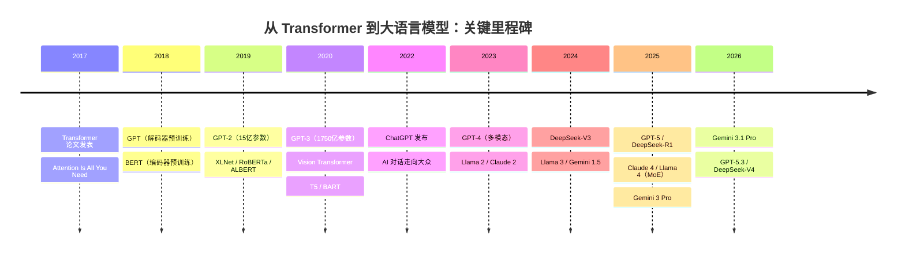

## 1.5 里程碑时刻：从学术论文到产业变革

Transformer 的论文发表于 2017 年，但它的影响远远超出了机器翻译这一初始应用场景。从一篇学术论文到重塑整个 AI 产业，Transformer 经历了一段密集而深刻的演化历程。下图概览了这一进程中的关键里程碑：

图 1-6：从 Transformer 到大语言模型的关键里程碑

### 1.5.1 预训练革命（2018-2019）

Transformer 发表后的第一年，两项工作从根本上改变了 NLP 的研究范式。

在此之前，NLP 的标准做法是为每个任务独立训练一个模型。要做情感分析，就用情感标注数据从零训练一个模型；要做命名实体识别，就用实体标注数据再从零训练另一个模型。这种方式有两个根本性的瓶颈：一是**高质量标注数据稀缺且昂贵**，每个任务都需要大量人工标注，而这些标注不能跨任务复用；二是**小规模任务数据不足以让模型学到深层的语言规律**，如语法结构、语义关系和常识知识。

GPT 和 BERT 的突破在于发现了一种新的出路：**语言文本本身就蕴含着丰富的“免费”监督信号，不需要人工标注。**

**GPT（2018 年 6 月）**：OpenAI 的 Radford 等人将多层 Transformer 解码器用于语言模型预训练，然后在下游任务上微调。其核心思路是让模型在海量文本上**预测下一个词**——给定“今天天气”，模型学习预测“很好”。这个看似简单的任务迫使模型习得语法、语义乃至世界知识，而所需的训练数据（普通文本）几乎是无限的。预训练完成后，模型就“理解了语言”，之后只需用少量标注数据微调，模型就能在具体任务上表现出色。

**BERT（2018 年 10 月）**：Google 的 Devlin 等人采用了相反的方向——使用 Transformer 编码器，通过**掩码语言模型**（Masked Language Model，MLM）进行双向预训练。具体做法是随机遮住句子中的一些词，让模型根据上下文猜测被遮住的词。BERT 的双向性使其能够同时利用左右上下文信息，在 11 项 NLP 基准测试上全面超越了之前的最佳结果。

GPT 和 BERT 分别代表了 Transformer 的两种使用方式：**生成式**（解码器，自回归）和**理解式**（编码器，双向），它们共同开启了 NLP 的“预训练时代”。此后，研究者不再为每个任务从零训练模型，而是先在大规模语料上预训练一个通用模型，再针对具体任务微调。这一范式之所以能大幅降低 NLP 应用的门槛，关键在于：**预训练将最昂贵的“理解语言”这一步做了一次，后续无数任务都可以复用这些通用语言知识，只需少量标注数据即可适配。**

2019 年涌现了一批重要的后续工作：

- **Transformer-XL**（Dai 等人）：引入片段级循环机制和相对位置编码，将上下文能力扩展到传统 Transformer 的数倍
- **XLNet**（Yang 等人）：通过全排列语言模型，兼具双向表征能力的同时避免了 BERT 中[MASK]标记带来的预训练-微调不一致
- **RoBERTa**（Liu 等人）：通过优化训练策略（更大批量、更长训练、去除下一句预测任务）显著提升了 BERT 性能
- **ALBERT**（Lan 等人）：通过跨层参数共享和分解嵌入矩阵大幅减少参数量

### 1.5.2 规模定律的发现（2020-2021）

这一时期的核心发现是**规模定律**（Scaling Laws）：模型性能与参数量、数据量和计算量之间存在可预测的幂律关系。更大的模型配合更多的数据，几乎总能带来更好的结果。

**GPT-2（2019 年）**：15 亿参数，证明了更大的语言模型能够在零样本（Zero-shot）设置下完成多种任务，无需任何微调。

**GPT-3（2020 年）**：1750 亿参数，展示了“少样本学习”（Few-shot Learning）的惊人能力。只需在提示中给出几个示例，GPT-3 就能完成翻译、问答、摘要等多种任务，无需更新任何参数。这标志着**提示工程**（Prompt Engineering）的兴起。

**T5（2020 年）** 和 **BART（2020 年）** 则探索了编码器-解码器架构的预训练，将所有 NLP 任务统一为文本到文本的生成问题。

同期，Transformer 也跨越了 NLP 的边界：

- **Vision Transformer（ViT，2020 年）**：将图像分割为补丁序列，直接用 Transformer 编码器处理，在 ImageNet 上匹敌甚至超越 CNN
- **Perceiver（2021 年）**：通过非对称注意力处理任意模态的高维输入，统一了图像、音频、点云等多种数据类型

### 1.5.3 大语言模型时代（2022 年至今）

2022 年以后，大语言模型进入了爆发期。几个关键的里程碑塑造了当前的技术格局：

**ChatGPT（2022 年 11 月）**：基于 GPT-3.5 并使用基于人类反馈的强化学习（RLHF）进行对齐，成为首个引发全球关注的 AI 对话产品，将大语言模型从学术研究推向大众应用。

**GPT-4（2023 年 3 月）**：多模态能力（接受文本和图像输入），在各种专业考试和基准测试上展现出接近人类的表现。

**GPT-5（2025 年 8 月）**：OpenAI 的最新旗舰模型，在推理、编程和多模态理解上全面超越 GPT-4。此后快速迭代了 GPT-5.1（2025 年 11 月）、GPT-5.2（2025 年 12 月）和 GPT-5.3（2026 年 2 月）等版本，持续提升对话质量和推理深度。

**Llama 系列（2023 年至今）**：Meta 发布的开源模型系列，Llama 2 和 Llama 3 极大地推动了开源大模型生态的发展，使学术界和中小企业也能训练和部署高质量的语言模型。2025 年 4 月发布的 Llama 4 引入了混合专家（MoE）架构，其中 Llama 4 Scout（1090 亿总参数、170 亿活跃参数、16 个专家）支持 1000 万 Token 的超长上下文，Llama 4 Maverick（4000 亿总参数、170 亿活跃参数、128 个专家）则在多模态和多语言任务上表现优异。

**DeepSeek 系列（2024 年至今）**：DeepSeek-V3（2024 年 12 月）通过创新的 MoE 架构和高效训练策略，以远低于 GPT-4 的训练成本达到了前沿水平，证明了架构创新可以显著降低训练门槛。2025 年 1 月发布的 DeepSeek-R1 专注于推理能力，通过强化学习让模型自主习得思维链推理。此后的 DeepSeek-V3.1（2025 年 5 月）将通用对话与深度推理融合为统一模型，V3.2（2025 年 12 月）则进一步提升了智能体和推理性能。

**Claude 系列（2023 年至今）**：Anthropic 的 Claude 系列在安全对齐与智能体能力上具有代表性。2025 年 5 月发布的 Claude 4（包括 Opus 4 和 Sonnet 4）在编程、高级推理和智能体工作流上展现出强大能力，此后通过 Opus 4.5（2025 年 11 月 24 日）等版本持续迭代，到 2026 年 2 月发布的 Opus 4.6 更是在智能体编程和计算机操控等场景中树立了新标杆。

**Gemini 系列（2024 年至今）**：Google 的原生多模态模型，Gemini 2.5 Pro（2025 年 3 月 25 日）引入了原生思考能力和百万级上下文窗口。2025 年 11 月 18 日推出的 Gemini 3 Pro 进一步提升了推理与编程能力，2026 年 2 月 19 日发布的 Gemini 3.1 Pro 则是截至目前 Google 最先进的模型。

截至 2026 年初，大语言模型的前沿呈现出几个明确的趋势：

- **架构多样化**：从纯 Transformer 向混合专家（MoE）、状态空间模型等方向演化，MoE 已成为主流选择
- **开源与闭源并行**：Llama、DeepSeek 等开源模型与 GPT、Claude 等闭源模型形成互补生态
- **推理能力突破**：以 DeepSeek-R1 为代表，通过强化学习和推理时计算（Test-time Compute）使模型具备深度思考能力
- **智能体化**：模型从被动回答走向主动执行，工具调用、多步规划和自主编程成为核心能力方向
- **极致效率**：量化、投机解码、高效注意力等技术使大模型在更低成本下运行

### 1.5.4 为什么 Transformer 能主导这一切

回顾这段历史，Transformer 能够从一个翻译模型演化为通用 AI 的基础架构，根本原因在于它的几个内在特质：

1. **良好的扩展性**：简洁一致的堆叠结构使其参数量可以轻松扩展到数千亿，且性能随规模可预测地增长
2. **高效的并行性**：完全并行的计算模式使其能充分利用大规模 GPU 集群，这是扩展到万亿参数的硬件前提
3. **通用的表示能力**：自注意力的全局连接使其不限于特定类型的模式或结构，从文本到图像、音频、视频甚至蛋白质序列都能有效处理
4. **灵活的架构变体**：编码器、解码器或两者的组合可以适应理解、生成、翻译等不同类型的任务

这些特质并非偶然——它们根植于 Transformer 的底层设计选择中。接下来的几章将逐一深入这些设计选择的细节与原理。
