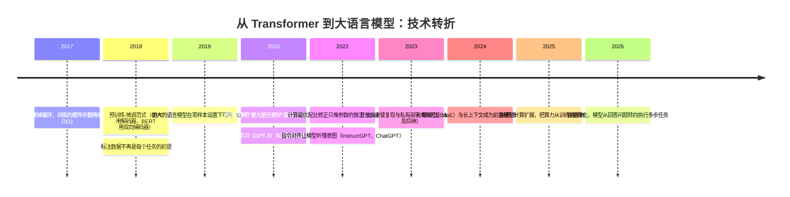

## 1.5 里程碑时刻：从学术论文到产业变革

上一节的 Transformer 还是一个 6 层、6500 万参数的翻译模型。本节回答它是怎样长成今天这套系统的，重点不在“哪一年出了哪个模型”，而在每一次技术转折解决了上一步的什么问题、又留下什么新代价。具体型号与日期是易变事实，本节只保留少数作为量级锚点的公开配置，其余交给[第十三章](../13_decoder_models/README.md)与[附录 A.5](../appendix/a5_volatile_facts.md)。

```mermaid
timeline
    title 从 Transformer 到大语言模型：技术转折
    2017 : 拿掉循环，训练的顺序步数降到 O(1)
    2018 : 预训练-微调范式（GPT 用解码器，BERT 用双向编码器）
         : 标注数据不再是每个任务的前提
    2019 : 更大的语言模型在零样本设置下可用（GPT-2）
    2020 : 规模定律把“更大是否更好”变成可外推的幂律
         : 少样本学习（GPT-3）与跨模态迁移（ViT）
    2022 : 计算最优配比修正只堆参数的做法（Chinchilla）
         : 指令对齐让模型听懂意图（InstructGPT、ChatGPT）
    2023 : 开放权重使复现与私有部署成为可能（LLaMA 及后继）
    2024 : 稀疏化（MoE）与长上下文成为前沿模型的常规配置
    2025 : 推理时计算扩展，把算力从训练侧挪到生成侧
    2026 : 智能体化，模型从回答问题转向执行多步任务
```

图 1-9：从 Transformer 到大语言模型的技术转折。每一栏写的是该阶段解决了什么问题，对应的代表模型、发布日期与规格见第十三章与附录 A.5。

### 1.5.1 预训练革命：把最贵的一步只做一次

Transformer 发表后的第一年，两项工作改变了 NLP 的研究范式。

在此之前，每个任务各自从零训练一个模型。这有两个瓶颈：高质量标注稀缺且不能跨任务复用；单个任务的数据量不足以让模型学到语法、语义与常识。GPT 和 BERT 的共同发现是，文本本身就带着免费的监督信号。

**GPT（[2018 年 6 月](https://openai.com/index/language-unsupervised/)）** 用多层 Transformer 解码器做语言模型预训练，再在下游任务上微调。预训练目标就是 1.1.1 的链式分解：给定前文预测下一个词。这个任务迫使模型习得语法、语义乃至世界知识，而训练数据（普通文本）近乎无限。

**BERT（2018 年 10 月）** 走了相反方向：用 Transformer 编码器，通过**掩码语言模型**（Masked Language Model，MLM）做双向预训练。随机遮住一部分词元，让模型根据左右上下文还原。双向性让每个位置都能同时利用两侧信息，该文在 11 项基准上刷新了最佳结果。

两者的配置都很小，放在一起看能建立量级感。[GPT-1 论文](https://cdn.openai.com/research-covers/language-unsupervised/language_understanding_paper.pdf)写明 12 层、768 维、12 个头、前馈中间层 3072、序列长度 512；[BERT 论文](https://arxiv.org/abs/1810.04805)的 base 是 $$L=12$$、$$H=768$$、$$A=12$$、1.10 亿参数，large 是 $$L=24$$、$$H=1024$$、$$A=16$$、3.40 亿参数，前馈中间层固定为 $$4H$$，词表是 30,000 个 WordPiece 词元。GPT-1 与 BERT-base 的层数与宽度完全相同，差别在训练目标与注意力掩码。

**一格算术：两种目标的信号密度。** 自回归目标下，一条长 512 的序列每个位置都产生一次损失，一次前向得到 512 个监督信号。BERT 的 MLM 只在被选中的 15% 位置上计损：$$\lfloor 512 \times 0.15 \rfloor = 76$$ 个，信号密度只有前者的 15%，相差 $$1/0.15 = 6.7$$ 倍。该论文自己也提到，MLM 每批只在 15% 的词元上做预测，因此收敛可能需要更多步数。被选中的位置还要再分三路：80% 换成 `[MASK]`、10% 换成随机词、10% 保持原样，目的是缩小预训练与微调之间的分布差异——微调时输入里没有 `[MASK]`。折算到全部词元，真正被替换成 `[MASK]` 的只有 12%。两种目标的完整对比见 [5.1 节](../05_pretraining/5.1_autoregressive.md)与 [5.2 节](../05_pretraining/5.2_masked_lm.md)。

2019 年涌现了一批后续工作：

- **Transformer-XL**：引入片段级循环与相对位置编码，扩展可用上下文
- **XLNet**：用全排列语言模型兼顾双向表征，同时避开 `[MASK]` 带来的不一致
- **RoBERTa**：只改训练策略（更大批量、更长训练、去掉下一句预测）就显著超过 BERT
- **ALBERT**：跨层参数共享与嵌入矩阵分解，大幅压缩参数量
- **T5** 与 **BART**：编码器-解码器预训练。T5 的主张是把所有 NLP 任务统一成文本到文本的格式；BART 的贡献是系统比较各种去噪目标下的 Seq2Seq 预训练（两者 arXiv 首发均在 2019 年 10 月，正式发表在 2020 年，设计选择见 [13.4 节](../13_decoder_models/13.4_t5_bart.md)）

### 1.5.2 规模定律：把“更大是否更好”变成可外推的公式

2020 年前后的核心发现是**规模定律**（Scaling Laws）：损失与参数量、数据量、算力之间存在可预测的幂律关系。这把“再大一点会怎样”从经验直觉变成了可以先算后练的工程问题。

[Kaplan 等 2020](https://arxiv.org/abs/2001.08361) 给出的形式是，当性能只受参数量限制时

$$
L(N) = \left(\frac{N_c}{N}\right)^{\alpha_N},\quad \alpha_N \approx 0.076,\ N_c \approx 8.8 \times 10^{13}
$$

其中 $$N$$ 是非嵌入参数量。指数很小，意味着收益缓慢但稳定：参数翻倍，损失乘 $$2^{-0.076} = 0.95$$，即降低约 5%。该文对数据量给出同型的式子（$$\alpha_D \approx 0.095$$），并指出这些关系跨越 $$N$$ 的六个数量级、算力的八个数量级，且对深度、宽度、头数这些形状参数不敏感。$$N_c$$ 这类常数依赖词表与分词方式，换一套分词就要重新拟合，不具有普适含义；有普适性的是指数。

同一篇论文给出了算力的估算式，它是后文一切成本估算的基础：

$$
C \approx 6ND
$$

$$N$$ 是非嵌入参数量，$$D$$ 是训练词元数，系数 6 的来源是每个参数每个词元前向约 2 次浮点运算、反向约为前向的两倍。

**一格算术：GPT-3 训练用了多少算力。** [GPT-3 论文](https://arxiv.org/abs/2005.14165)的表 D.1 给出 175B 模型的参数量 174,600M、训练词元 300B、每参数每词元 6 次运算。代入：

$$
6 \times 1.746 \times 10^{11} \times 3 \times 10^{11} = 3.14 \times 10^{23}\ \text{FLOPs}
$$

与该表报告的 $$3.14 \times 10^{23}$$ 一致。换成论文常用的 petaflop/s-day（每个为 $$8.64 \times 10^{19}$$ FLOPs）是 $$3.64 \times 10^3$$，同样对得上。作为对照，1.4.6 里 Transformer big 的训练成本是 $$2.3 \times 10^{19}$$，三年之间差了四个数量级。

参数量也能自己估。非嵌入参数约为 $$12 L d^2$$（每层 $$4d^2$$ 的注意力投影加 $$8d^2$$ 的前馈，前馈中间层取 $$4d$$），代入 GPT-3 175B 的 $$L = 96$$、$$d = 12288$$ 得 $$1.74 \times 10^{11}$$，与 1746 亿吻合。

| 模型 | 层数 | $$d_{\text{model}}$$ | 头数 | 参数量 | 上下文长度 | 训练词元 |
| --- | ---: | ---: | ---: | ---: | ---: | ---: |
| GPT-1 | 12 | 768 | 12 | 117M | 512 | — |
| GPT-2 XL | 48 | 1,600 | — | 1,542M | 1,024 | — |
| GPT-3 Small | 12 | 768 | 12 | 125M | 2,048 | 300B |
| GPT-3 175B | 96 | 12,288 | 96 | 174,600M | 2,048 | 300B |
| BERT-base | 12 | 768 | 12 | 110M | 512 | — |
| BERT-large | 24 | 1,024 | 16 | 340M | 512 | — |

表 1-7：四年之间的规模变化。GPT-1 各列取自其论文的 Model specifications 一段，117M 取自 GPT-2 论文表 2，该文第 3 节说明这一档等同于原始 GPT；GPT-2 XL 的层数与宽度取自同一张表，该表未列头数。GPT-3 两行的层数、宽度、头数与上下文取自其论文表 2.1，174,600M 这个精确值取自附录表 D.1（表 2.1 该行的参数量只写作 175.0B）；该文全部 8 个规模都训练 300B 词元、上下文 2048。BERT 两行取自其论文 3.1 节。横向比较时注意词表不同：GPT-2 与 GPT-3 是 50,257，BERT 是 30,000。

**Chinchilla 的修正。** Kaplan 的结论被普遍读成“算力优先给参数”，GPT-3 的 175B 配 300B 词元正是这种配比。[Hoffmann 等 2022](https://arxiv.org/abs/2203.15556) 训练了 400 多个模型重新拟合，结论是计算最优时参数量与词元数应当**等比例**放大：模型大一倍，数据也要大一倍。他们按同样的算力预算训练了 700 亿参数、1.4 万亿词元的 Chinchilla，在大量下游任务上超过 2800 亿参数的 Gopher。推论很直接：GPT-3 这一代模型是训练不足的。两种拟合的差异、后续的复现争议与推理成本视角下的再修正，见 [5.4 节](../05_pretraining/5.4_data_scaling.md)。

**Transformer 跨出 NLP，以及它的数据前提。** [ViT](https://arxiv.org/abs/2010.11929) 把图像切成补丁序列，直接送进 Transformer 编码器。它的结论常被简化成“打败了 CNN”，论文自己的表述要严格得多：在 ImageNet 这类中等规模数据上不加强正则地训练，ViT 的准确率比同等规模的 ResNet 低几个百分点；原因是它缺少 CNN 自带的平移等变性与局部性等归纳偏置，数据不足时泛化不好。只有先在 ImageNet-21k 或 JFT-300M（3.03 亿张图）上预训练，它才追平或超过当时最好的卷积网络。论文把这条经验总结为“large scale training trumps inductive bias”。这正好印证 1.4.5 列出的一条边界：弱先验要用大数据来补。

### 1.5.3 六次技术转折：每一步解决了上一步的什么问题

2022 年之后，架构本身的变化远小于用法与系统的变化。按“解决了什么、代价是什么”排，有六次转折。

**一、指令对齐：把“会续写”变成“会照做”。** 预训练模型的目标函数是续写文本，不是满足意图；提示里稍有歧义，它就可能续写出一段格式正确但答非所问的内容。[InstructGPT](https://arxiv.org/abs/2203.02155) 的做法是先用人工示范做监督微调，再用人类对输出排序训练奖励模型、以强化学习优化。效果的量级由该文摘要给出：人类评测中，13 亿参数的 InstructGPT 的输出比 1750 亿参数的 GPT-3 更受偏好，参数少 100 倍。代价是引入了一条依赖人工标注的新流水线，以及奖励模型被过度优化的风险（见 [8.2 节](../08_alignment/8.2_rlhf.md)）。ChatGPT（2022 年 11 月）是这条路线的产品化，它带来的第二个变化是把对话历史当作输入的一部分，上下文长度从此成为硬指标。

**二、开放权重：把复现权从少数机构手里拿出来。** 前沿模型只提供 API 时，学术界无法研究其内部，企业也无法私有部署。[LLaMA](https://arxiv.org/abs/2302.13971)（2023 年 2 月）给出了两个结论：只用公开数据集也能训出有竞争力的模型；130 亿参数的 LLaMA-13B 在多数基准上超过 1750 亿的 GPT-3。开放权重生态由此起步，微调、量化、本地部署的整套工具链都建立在它之上（见 [13.2 节](../13_decoder_models/13.2_llama.md)）。代价是安全与滥用的控制手段从“服务端拒绝”退化为“训练时对齐”，后者可被下游微调抹掉（见 [8.5 节](../08_alignment/8.5_practice.md)）。

**三、稀疏化：让参数量与每词元计算量脱钩。** 稠密模型每处理一个词元都要用上全部参数，$$C \approx 6ND$$ 里的 $$N$$ 既是容量也是成本。**混合专家**（Mixture of Experts，MoE）把前馈子层换成一组专家，路由器为每个词元只激活其中少数几个，于是总参数（容量）可以远大于激活参数（成本）。这不是换掉了 Transformer，而是把它的前馈子层稀疏化——1.4.4 的拆分已说明仅解码器模型的前馈占非嵌入参数的三分之二，稀疏化选它而不是注意力正是因为这个比例。代价是显存要装下全部专家、路由要做负载均衡、通信模式从规整变得不规整（见 [14.2 节](../14_future_trends/14.2_moe.md)与 [11.8 节](../11_serving/11.8_multi_gpu_inference.md)）。

**四、长上下文：把外部信息搬进输入。** 上下文从 GPT-3 的 2,048 扩到百万级，改变的是使用方式：整个代码库、整份合同可以直接放进提示。三处必须同时动：位置编码要能外推（见[第四章](../04_position_encoding/README.md)），注意力的 $$O(n^2)$$ 要设法回避（见 [14.1 节](../14_future_trends/14.1_efficient_attention.md)），KV 缓存随长度线性增长的显存要管起来（见 [11.4 节](../11_serving/11.4_kv_memory_management.md)）。代价不止成本：窗口写着百万，不等于模型能可靠用到窗口中部的信息（见 [14.7 节](../14_future_trends/14.7_long_context.md)）。

**五、推理时计算扩展：把算力从训练侧挪到生成侧。** 规模定律描述的是训练算力与损失的关系，前提是每个问题只做一次前向。让模型先生成一段推理过程、或生成多条候选再择优，等于在**生成时**追加算力。这条路线用强化学习训练出稳定的长推理行为，在数学与编程类任务上收益明显。代价直接体现在账单与延迟上：输出词元数可能增加一个数量级，而 Decode 恰恰是显存带宽受限的那一段（见 [3.8.7 节](../03_components/3.8_gpt_inference_flow.md)、[9.5 节](../09_decoding/9.5_test_time_scaling.md)与 [14.6 节](../14_future_trends/14.6_test_time_scaling.md)）。

**六、智能体化：从生成文本到执行动作。** 模型调用工具、读取返回结果、再决定下一步，把单轮生成变成多步循环。这让它能接触训练数据之外的实时信息，也能改变外部状态。代价是错误会沿步数累乘：单步成功率 0.95 时，十步全对的概率是 $$0.95^{10} = 0.60$$；同时新增了提示注入等安全面（见 [14.5 节](../14_future_trends/14.5_agent_tool_use.md)）。服务侧的影响同样具体——请求变成长度差异极大的多轮，调度与前缀复用的重要性随之上升（见 [11.3 节](../11_serving/11.3_scheduler_loop.md)与 [11.5 节](../11_serving/11.5_prefix_reuse.md)）。

这六条互相咬合：稀疏化降低了长上下文的单词元成本，长上下文使智能体能携带更多中间状态，推理时扩展又把这些中间状态变成了主要的输出量。当前各家前沿模型的具体型号、上下文与输出上限属于快变事实，以附录 A.5 登记的权威入口为准。

### 1.5.4 为什么是 Transformer

同期并非没有并行方案。ByteNet 与 ConvS2S 也把顺序步数降到了 $$O(1)$$，最终胜出的是 Transformer，原因可以拆成三条，其中两条有直接证据。

**第一，它在规模上的表现更好，而且有实测对照。** Kaplan 等 2020 在同样的数据与上下文长度下训练了 LSTM 与 Transformer，结论写在 3.2.1 节：LSTM 在上下文靠前的词元上与 Transformer 打平，但在靠后的词元上追不上。这不是“Transformer 更强”的笼统说法，而是指出差距出现在需要长距离信息的位置上——正是 1.2.3 那条连乘衰减所预言的地方。

**第二，它的计算形态与硬件对路。** 拿掉循环之后，一层里的主要开销是几个大矩阵乘（1.4.4 的 $$24nd^2$$），它们的算术强度高、能把 GPU 的运算单元喂饱；而 RNN 的 $$O(n)$$ 个瘦长矩阵乘做不到这一点（见 1.2.5 与 [10.1 节](../10_inference_optimization/10.1_bottleneck.md)）。这不是架构自带的魔力，而是它恰好与当时最快的硬件原语吻合。若主流硬件的强项不是稠密矩阵乘，这笔账会得出不同的结论。

**第三，结构简洁，变体成本低。** 同构层的堆叠让深度、宽度、头数成为三个可独立调节的旋钮；编码器、解码器或两者组合可以适配理解、生成、翻译等不同任务。这一条更多是工程便利，缺少像前两条那样的实证。

代价同样清楚，本章已逐条算过：注意力的 $$O(n^2)$$（1.4.5）、KV 缓存随长度线性增长（1.2.5）、弱归纳偏置需要大数据补偿（1.5.2 的 ViT）。把参数量推到数千亿并不轻松，第七章的分布式训练整章都在处理这件事。

这些代价也正是后续各章的题目：第二、三章拆开注意力与各个组件，第四章处理位置，第五到八章讲怎样训练与对齐，第九到十一章讲怎样把它跑快、跑省。
