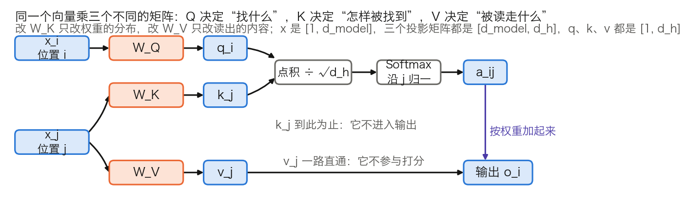

## 2.1 查询-键-值：一种信息检索的直觉

[1.3 节](../01_introduction/1.3_attention_birth.md)里的注意力只有两个角色：解码器状态 $$s_t$$ 负责发问，编码器隐藏状态 $$h_j$$ 既是算分时的比对依据，又是加权求和时被取走的内容。本节回答三个问题：为什么要把 $$h_j$$ 的这两个身份拆开，为什么发问的一方也要单独投影，以及这三套投影在参数量和框架源码里各对应什么。

本节只讲一个头内部的三路投影。多个头怎样切分与拼接见 [2.3 节](2.3_multi_head.md)，完整的两头数值手算见 [3.8.4 节](../03_components/3.8_gpt_inference_flow.md)，本节不重复做。

### 2.1.1 三种角色，三套投影

**查询**（Query）、**键**（Key）、**值**（Value）这套术语来自信息检索：用搜索词去比对每个网页的关键词，命中后取回网页的内容。注意力沿用了这个分工，但做的是软匹配：不是只返回最匹配的一项，而是按匹配程度对所有项加权混合。权重连续可导，梯度因此能穿过整个检索过程，让匹配标准随训练一起被学出来。

一层注意力对位置 $$i$$ 做的事可以写成三步：把 $$x_i$$ 投影成查询向量，与各位置的键向量逐一打分，再按分数加权取走各位置的值向量。三种角色由三个矩阵产生：

$$Q = XW^Q, \quad K = XW^K, \quad V = XW^V$$

其中 $$X \in \mathbb{R}^{n \times d_{\text{model}}}$$ 是输入矩阵（$$n$$ 个位置，每个位置 $$d_{\text{model}}$$ 维），$$W^Q, W^K \in \mathbb{R}^{d_{\text{model}} \times d_k}$$，$$W^V \in \mathbb{R}^{d_{\text{model}} \times d_v}$$。形状写法与 [3.8.3 节](../03_components/3.8_gpt_inference_flow.md)一致：`X[n, d_model] × W_Q[d_model, d_k] → Q[n, d_k]`。

图 2-1 把三条路径分开画。要记住的是它们并不对称：键只参与打分，从不进入输出；值只进入输出，从不参与打分。

图 2-1：三路投影各自流向哪里（[生成脚本](https://github.com/yeasy/llm_internals/blob/main/tools/figures/ch02_qkv_roles.py)）。蓝色是随输入变化的数据，橙色是训练好就固定的权重，与 3.8 节各图的配色一致。

这条不对称性有一个直接推论：改动 $$W^K$$ 只改变权重的分布，改动 $$W^V$$ 只改变被读出的内容，两者互不干扰。后面几节反复用到它。

### 2.1.2 不投影会怎样：一个 3×3 的反例

“分开投影更灵活”只是说法，代价与收益要用数字看。先看不投影时会发生什么：直接用输入向量打分，即 $$s_{ij} = x_i x_j^\top$$。

取三个二维的单位向量作为三个位置的表示：

$$X = \begin{bmatrix} 1 & 0 \\ 0.8 & 0.6 \\ 0 & 1 \end{bmatrix}$$

一格的算术是逐分量相乘再相加，例如位置 1 对位置 2 的分数 $$s_{12} = 1 \times 0.8 + 0 \times 0.6 = 0.8$$。对九个位置对重复，得到

$$XX^\top = \begin{bmatrix} 1 & 0.8 & 0 \\ 0.8 & 1 & 0.6 \\ 0 & 0.6 & 1 \end{bmatrix}$$

这张表有两处病症，都与具体取值无关。

第一，矩阵必然对称：$$x_i x_j^\top = x_j x_i^\top$$。于是“位置 1 关注位置 2 的强度”被迫等于“位置 2 关注位置 1 的强度”。语言里的依赖关系很少对称，代词指向先行词，先行词并不同等地指向代词。

第二，各位置范数相同时，对角线必然是每行最大：由柯西-施瓦茨不等式 $$x_i x_j^\top \leq \|x_i\|\|x_j\| = \|x_i\|^2 = x_i x_i^\top$$，“看自己”总是排第一。除以 $$\sqrt{d_k} = \sqrt{2}$$ 再取 Softmax，三行权重分别是 `[0.424, 0.368, 0.209]`、`[0.331, 0.381, 0.288]`、`[0.220, 0.335, 0.445]`，每一行的最大值都落在对角线上。

加上投影，两处病症同时消失。取

$$W^Q = \begin{bmatrix} 0 & 1 \\ 0 & 0 \end{bmatrix}, \quad W^K = \begin{bmatrix} 1 & 0 \\ 0 & 1 \end{bmatrix}$$

位置 1 的查询是 $$x_1 W^Q = [0, 1]$$，位置 2 的键是 $$x_2 W^K = [0.8, 0.6]$$，分数 $$s_{12} = 0 \times 0.8 + 1 \times 0.6 = 0.6$$；反过来，位置 2 的查询是 $$[0, 0.8]$$，位置 1 的键是 $$[1, 0]$$，分数 $$s_{21} = 0$$。同一对位置，两个方向的分数不再相等：

$$XW^Q (XW^K)^\top = \begin{bmatrix} 0 & 0.6 & 1 \\ 0 & 0.48 & 0.8 \\ 0 & 0 & 0 \end{bmatrix}$$

除以 $$\sqrt{2}$$ 再 Softmax，第一行是 `[0.220, 0.335, 0.445]`：位置 1 把最大的权重给了位置 3，而不是自己。投影换来的正是这两样东西，不是笼统的“灵活”。

### 2.1.3 查询与键的投影只以乘积出现

把两个投影代回分数式，可以看出它们从不单独起作用：

$$s_{ij} = (x_i W^Q)(x_j W^K)^\top = x_i \underbrace{W^Q (W^K)^\top}_{d_{\text{model}} \times d_{\text{model}}} x_j^\top$$

分数是关于 $$x_i$$ 与 $$x_j$$ 的**双线性型**（bilinear form），中间那个矩阵才是真正被学到的东西。它有两个性质。

其一，秩不超过 $$d_k$$。乘积 $$W^Q (W^K)^\top$$ 由 `[d_model, d_k] × [d_k, d_model]` 得到，中间那一维是瓶颈。以 GPT-3 6.7B 的配置（`d_model = 4096`、`d_k = 128`，见 [3.8.6 节](../03_components/3.8_gpt_inference_flow.md)的表 3-24）为例，它是一个 `4096 × 4096` 的矩阵，秩至多 128。单头能表达的打分方式因此受限，这一点在 [2.3.5 节](2.3_multi_head.md)还要用来解释头宽度的取值。

其二，单个 Q/K 维度没有固定含义。对任意可逆矩阵 $$R$$，把 $$W^Q$$ 换成 $$W^Q R$$、把 $$W^K$$ 换成 $$W^K (R^{-1})^\top$$，乘积不变，分数也不变。因此“第 3 个 Query 维度代表什么”这类问题没有答案，能被解释的是乘积。

同样的道理适用于 $$W^V$$ 与输出投影 $$W^O$$：值向量算出后立刻被 $$W^O$$ 读走，两者也只以乘积 $$W^V W^O$$ 出现。[Transformer 电路框架](https://transformer-circuits.pub/2021/framework/index.html)把这两个乘积分别称作 QK 回路与 OV 回路，并指出 Q、K、V 向量可以看作计算这两个低秩矩阵过程中的中间结果。该文用列向量约定，故写作 $$W_Q^\top W_K$$ 与 $$W_O W_V$$，与本书的行向量写法互为转置。

### 2.1.4 键与值为什么分开

键与值可以共用一套投影，只是要付出代价。把四种绑定方案并排看，取舍就清楚了（每层每头的参数以 `d_model × d_k` 为单位计）。

| 绑定方案 | 每个头的投影参数 | 换来了什么 | 失去了什么 | 谁在用 |
| --- | ---: | --- | --- | --- |
| Q、K、V 全独立 | 3 份 | 三种角色各自优化 | 参数最多 | 标准 Transformer |
| K = V（共用一套） | 2 份 | 省一份投影 | “怎样被找到”与“提供什么内容”被迫同向 | 少见 |
| Q = K（共享 QK） | 2 份 | 省一份投影，键可复用为查询 | 分数近乎对称（归一化后不严格对称），且需专门禁止位置读取自身 | [Reformer](https://arxiv.org/abs/2001.04451) |
| K、V 由同一隐向量上投影 | 低秩的 2 份 | 缓存只存一份压缩隐向量 | 多一次上投影，结构更复杂 | MLA，见 [10.2.7 节](../10_inference_optimization/10.2_kv_cache.md) |

表 2-1：键与值的四种绑定方案。Reformer 为使局部敏感哈希能把查询和键放进同一空间，令 $$k_j = q_j / \|q_j\|$$；由于共享后每个位置与自身的分数总是最高，它必须把“读取自身”单独屏蔽掉。MLA 并不是让 K 与 V 相等，而是让两者从同一个压缩隐向量各自上投影，目的是压缩 KV 缓存而非省参数。

由此可以给 2.1.1 的不对称性补上边界：$$W^K$$ 与 $$W^V$$ 分开是标准做法，因为耦合会把“如何被找到”与“提供什么内容”压进同一组参数；但这不是不可违反的约束，为推理时的显存而做出的让步（如 MLA）就是反例。

在交叉注意力中，这种分离另有一层用处：键帮助解码器定位源序列中的相关位置，值提供这些位置的内容，两者的最佳表示空间通常不同（见 [2.4.4 节](2.4_self_cross_causal.md)）。

### 2.1.5 形状、参数量与实现里的名字

形状上只有一条硬约束：查询与键必须同维，因为两者要做点积；值的维度 $$d_v$$ 在数学上可以不同，输出 $$AV \in \mathbb{R}^{n \times d_v}$$ 照样成立。实践中取 $$d_k = d_v$$，便于拼接后由 $$W^O$$ 投回 $$d_{\text{model}}$$。

**记号。** 下面的参数账起，多头相关的量按全书形状清单的写法记：$$n_h$$ 是 Query 头数，$$d_h$$ 是每头宽度，$$n_{kv}$$ 是 K/V 头数，`T` 是词元数。标准多头注意力中 $$n_{kv} = n_h$$，GQA 下 $$n_{kv}$$ 更小（见 [2.3.7 节](2.3_multi_head.md)）。本章的数学推导则沿用原论文的写法，序列长度记作 $$n$$、每头宽度记作 $$d_k$$，值的一侧记作 $$d_v$$。两套写法指同一批量：$$n$$ 即 `T`，按上面 $$d_k = d_v$$ 的常规取法，两者即 $$d_h$$。汇总见 [3.8.3 节](../03_components/3.8_gpt_inference_flow.md)的表 3-17。

**参数账。** 一层注意力有四个矩阵：$$W^Q$$、$$W^K$$、$$W^V$$ 各把 $$d_{\text{model}}$$ 投到 $$n_h \times d_h = d_{\text{model}}$$，$$W^O$$ 再投回来。不计偏置，一层共 $$4d_{\text{model}}^2$$ 个参数，与头数无关。以 GPT-3 6.7B（`d_model = 4096`、32 层、MLP 中间层 16,384）为例：

- 一层注意力：`4 × 4096² = 67,108,864`。
- 一层 MLP：`2 × 4096 × 16,384 = 134,217,728`。
- 一层合计 201,326,592，注意力占 `67,108,864 ÷ 201,326,592 = 33.3%`。
- 32 层的注意力参数 `67,108,864 × 32 = 2,147,483,648`，注意力与 MLP 合计 `201,326,592 × 32 = 6,442,450,944`；再加词嵌入 `50,257 × 4096 = 205,852,672`，约 66.5 亿，与“6.7B”这个标称值对得上。

计算量按同一口径：每个词元在一层注意力里与权重相乘约 $$8d_{\text{model}}^2$$ 次浮点运算，其中 Q/K/V 三个投影占 $$6d_{\text{model}}^2$$，输出投影占 $$2d_{\text{model}}^2$$。加上 MLP 的 $$16d_{\text{model}}^2$$，一层合计约 $$24d_{\text{model}}^2$$。这部分随词元数线性增长，与序列长度无关；随长度平方增长的是打分与读取，见 [2.5.1 节](2.5_complexity_limits.md)。

**每头宽度不一定是 $$d_{\text{model}} / n_h$$。** 多数模型确实平分，但 `head_dim` 可以单独设定。Qwen3-4B 的公开配置是 `hidden_size` 2560、`num_attention_heads` 32、`head_dim` 128，此时 `32 × 128 = 4096` 并不等于 2560，$$W^O$$ 负责把 4096 投回 2560。Hugging Face 的实现正是按这个优先级取值：先读配置里的 `head_dim`，没有才退回 `hidden_size // num_attention_heads`。

**框架里的名字。** 读源码时，本节的四个矩阵会以下面这些名字出现。

| 实现 | 模块名 | 权重形状 | 偏置 |
| --- | --- | --- | --- |
| Hugging Face Llama | `q_proj`、`k_proj`、`v_proj`、`o_proj`（`nn.Linear`） | `q_proj` 为 `[n_h × d_h, d_model]`，`k_proj`、`v_proj` 为 `[n_kv × d_h, d_model]` | 由 `config.attention_bias` 决定，Llama 系列为 `False` |
| Hugging Face GPT-2 | `c_attn`、`c_proj`（`Conv1D`） | `c_attn` 把 Q/K/V 融合成一个 `[768, 3 × 768]`，前向后按 `split` 拆成三份 | 有 |

表 2-2：两种常见实现里的注意力权重。两点容易看错：`nn.Linear` 按“输出 × 输入”存放权重，与正文 $$XW$$ 的 `[输入, 输出]` 互为转置；GPT-2 用的 `Conv1D` 则按 `[输入, 输出]` 存放，且把三个投影融合成一个矩阵，一次矩阵乘法算出 Q、K、V。GQA 下 `k_proj` 与 `v_proj` 的输出宽度按 `n_kv` 而非 `n_h` 计算（见 [2.3.7 节](2.3_multi_head.md)）。

头数与每头宽度如何取值、多个头怎样切分同一个大矩阵，都留给 [2.3 节](2.3_multi_head.md)。下一节先把打分这一步补完：点积算出来之后，为什么要除以 $$\sqrt{d_k}$$。
