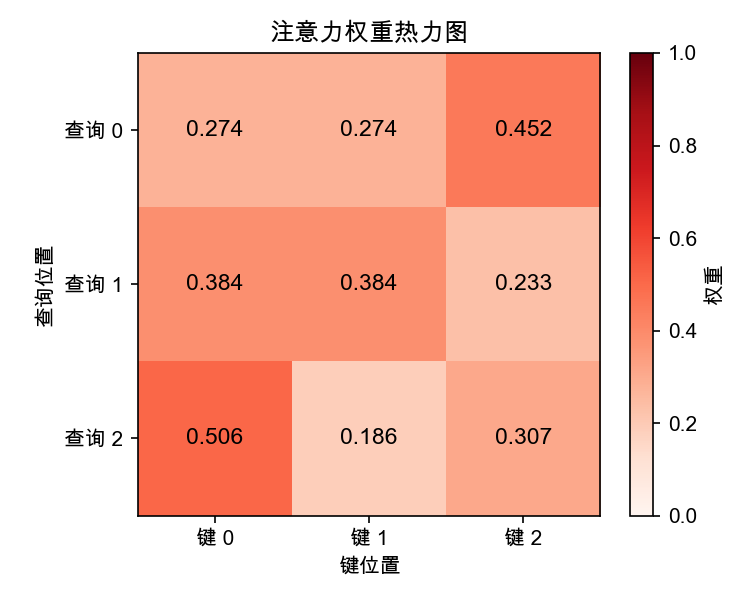

## 2.2 缩放点积注意力：为什么要除以根号 d

缩放点积注意力（Scaled Dot-Product Attention）是 Transformer 中最基础的注意力计算单元。它的公式看起来很简洁，但每一项都有明确的设计理由。

### 2.2.1 完整公式与计算流程

缩放点积注意力的计算公式为：

$$\text{Attention}(Q, K, V) = \text{softmax}\left(\frac{QK^T}{\sqrt{d_k}}\right)V$$

整个计算可以分解为四个步骤：

1. **计算注意力分数**：$S = QK^T$，结果矩阵 $S \in \mathbb{R}^{n \times n}$ 中的每个元素 $S_{ij}$ 是第 $i$ 个查询与第 $j$ 个键的点积，衡量两者的“匹配度”
2. **缩放**：$S' = S / \sqrt{d_k}$，将分数除以键向量维度的平方根，保持点积的方差为常数 1
3. **归一化**：$A = \text{softmax}(S')$，对每一行应用 Softmax，得到注意力权重矩阵，每行的权重之和为 1
4. **加权求和**：$\text{Output} = AV$，用注意力权重对值向量进行加权求和

> [!NOTE]
> **行向量与矩阵打包**：按照《Attention Is All You Need》原论文的设定与深度学习的实现惯例，单个词的查询向量 $\vec{q}$ 被视作**行向量**（维度为 $1 \times d_k$）。序列中 $n$ 个词的查询向量被逐行“打包”（packed together）拼接成完整的查询矩阵 $Q \in \mathbb{R}^{n \times d_k}$。这使得矩阵乘法 $QK^T$ 可以一次性并行计算出所有词对之间的点积分数。

整个过程可以完全用矩阵运算表达，因此能够在 GPU 上高效执行。

### 2.2.2 点积为什么能衡量相关性

点积 $q \cdot k = \sum_{i=1}^{d_k} q_i k_i$ 本质上衡量的是两个向量的**方向一致性**。根据向量的几何关系：

$$q \cdot k = \|q\| \|k\| \cos\theta$$

其中 $\theta$ 是两个向量之间的夹角。当两个向量方向一致时（$\theta = 0$），点积最大；方向正交时（$\theta = 90°$），点积为零；方向相反时（$\theta = 180°$），点积最小。

这种几何属性使得点积成为衡量语义相关性的天然工具：**经过投影后，语义相关的查询和键应该在向量空间中方向接近，从而产生较大的点积分数。**

相比 [1.3 节](../01_introduction/1.3_attention_birth.md)中介绍的加性注意力（需要额外的权重矩阵和 tanh 激活），点积注意力**不需要额外的可学习参数**，且可以直接利用优化过的矩阵乘法库（如 cuBLAS），在实践中快得多。这也是 Transformer 选择点积而非加性注意力的主要原因。

### 2.2.3 为什么必须缩放：Softmax 的饱和问题

现在来到这个公式中最关键的设计细节：**为什么要除以 $\sqrt{d_k}$？**

这是因为当维度 $d_k$ 较大时，点积的数值也会变大，导致 Softmax 函数进入饱和区。

Softmax 函数 $\text{softmax}(z_i) = e^{z_i} / \sum_j e^{z_j}$ 对输入的尺度非常敏感。当输入值很大时，指数函数会使最大值对应的输出接近 1，其余接近 0——这就是“饱和（saturation）”。在饱和区，Softmax 的梯度**趋近于零**，导致反向传播时梯度消失，模型难以学习。

假设查询和键的每个分量都独立地服从标准正态分布 $\mathcal{N}(0, 1)$，那么它们的点积：

$$q \cdot k = \sum_{i=1}^{d_k} q_i k_i$$

是 $d_k$ 个独立随机变量的和。根据概率论：

- **均值**：$E[q \cdot k] = 0$（因为 $E[q_i k_i] = E[q_i]E[k_i] = 0$）
- **方差**：$\text{Var}(q \cdot k) = d_k$（因为 $\text{Var}(q_i k_i) = 1$，共 $d_k$ 项）

因此，点积的标准差为 $\sqrt{d_k}$。当 $d_k = 64$ 时，标准差为 8；当 $d_k = 512$ 时，标准差约为 22.6。这意味着**点积的绝对值会随维度增长而增大**。


除以 $\sqrt{d_k}$ 正是将点积的理论标准差重新缩放为 1（实际模型中约为常数级 1），使 Softmax 保持在梯度较大的“活跃区”，从而确保训练的稳定性。

这不是一个随意的超参数选择，而是一个由统计分析严格推导出的数学必然。

### 2.2.4 Softmax 的作用：从分数到概率

Softmax 在注意力计算中扮演着双重角色：

**第一，归一化**：将任意实数范围的注意力分数转换为非负且总和为 1 的权重，使其可以解释为“概率分布”——每个位置被关注的程度。

**第二，竞争机制**：Softmax 的指数特性使得较大的分数被进一步放大，较小的分数被进一步压缩。这创造了一种**赢者通吃**的效果，使模型能够将注意力集中在最相关的少数位置上，而非均匀分散。

下面的示例直观说明了这一效果。假设某个查询对五个键的点积分数为 $[2.0, 1.0, 0.1, -0.5, -1.0]$，经过 Softmax 后变为：

| 位置 | 原始分数 | Softmax 权重 |
|------|---------|-------------|
| 1    | 2.0     | 0.506       |
| 2    | 1.0     | 0.186       |
| 3    | 0.1     | 0.076       |
| 4    | -0.5    | 0.042       |
| 5    | -1.0    | 0.025       |

可以看到，分数最高的位置 1 获得了超过一半的注意力，而分数较低的位置几乎被忽略。这正是注意力机制“选择性关注”的体现。

### 2.2.5 完整的计算示例

以一个简化的例子来完整展示缩放点积注意力的计算过程。假设序列长度 $n=3$，维度 $d_k = 4$：

$$Q = \begin{bmatrix} 1 & 0 & 1 & 0 \\ 0 & 1 & 0 & 1 \\ 1 & 1 & 0 & 0 \end{bmatrix}, \quad K = \begin{bmatrix} 1 & 1 & 0 & 0 \\ 0 & 0 & 1 & 1 \\ 1 & 0 & 1 & 0 \end{bmatrix}, \quad V = \begin{bmatrix} 1 & 0 & 0 & 1 \\ 0 & 1 & 1 & 0 \\ 1 & 1 & 0 & 0 \end{bmatrix}$$

1. **计算点积** $S = QK^T$：
   $$S = \begin{bmatrix} 1 & 1 & 2 \\ 1 & 1 & 0 \\ 2 & 0 & 1 \end{bmatrix}$$
2. **缩放**（除以 $\sqrt{d_k} = \sqrt{4} = 2$）：
   $$S' = \begin{bmatrix} 0.5 & 0.5 & 1.0 \\ 0.5 & 0.5 & 0 \\ 1.0 & 0 & 0.5 \end{bmatrix}$$
3. **Softmax 归一化**（按行操作，得到注意力权重）：
   $$A = \text{softmax}(S') \approx \begin{bmatrix} 0.274 & 0.274 & 0.452 \\ 0.384 & 0.384 & 0.233 \\ 0.506 & 0.186 & 0.307 \end{bmatrix}$$
4. **加权求和**计算输出 $\text{Output} = AV$：
   $$\text{Output} \approx \begin{bmatrix} 0.726 & 0.726 & 0.274 & 0.274 \\ 0.616 & 0.616 & 0.384 & 0.384 \\ 0.814 & 0.494 & 0.186 & 0.506 \end{bmatrix}$$

每个输出位置的向量是所有位置值向量的加权组合，权重由查询和键的匹配度决定。**输出与输入有相同的维度**，可以直接传递给下一层——这是 Transformer 能够堆叠多层的关键。

下面用 PyTorch 代码完整实现上述计算过程，使用与正文相同的 Q、K 矩阵，读者可以直接运行验证每一步的结果：

```python
import torch
import torch.nn.functional as F
import math

# 与正文 §2.2.5 相同的矩阵 (n=3, d_k=4)
Q = torch.tensor([[1, 0, 1, 0],
                   [0, 1, 0, 1],
                   [1, 1, 0, 0]], dtype=torch.float32)

K = torch.tensor([[1, 1, 0, 0],
                   [0, 0, 1, 1],
                   [1, 0, 1, 0]], dtype=torch.float32)

V = torch.tensor([[1, 0, 0, 1],
                   [0, 1, 1, 0],
                   [1, 1, 0, 0]], dtype=torch.float32)

d_k = Q.size(-1)  # 4

# 第1步：计算注意力分数 S = Q @ K^T
scores = torch.matmul(Q, K.transpose(-2, -1))
print("注意力分数 QK^T:\n", scores)

# 第2步：缩放 S' = S / sqrt(d_k)
scaled_scores = scores / math.sqrt(d_k)
print("缩放后分数 (÷√4):\n", scaled_scores)

# 第3步：Softmax 归一化（每行之和为 1）
attn_weights = F.softmax(scaled_scores, dim=-1)
print("注意力权重 (softmax):\n", attn_weights)
print("每行之和:", attn_weights.sum(dim=-1))

# 第4步：加权求和 Output = A @ V
output = torch.matmul(attn_weights, V)
print("最终输出:\n", output)
print("输出形状:", output.shape, " （与输入相同: n×d_k）")
```

运行上述代码后，可以得到如下结果。

```bash
注意力分数 QK^T:
 tensor([[1., 1., 2.],
        [1., 1., 0.],
        [2., 0., 1.]])
缩放后分数 (÷√4):
 tensor([[0.5000, 0.5000, 1.0000],
        [0.5000, 0.5000, 0.0000],
        [1.0000, 0.0000, 0.5000]])
注意力权重 (softmax):
 tensor([[0.2741, 0.2741, 0.4519],
        [0.3837, 0.3837, 0.2327],
        [0.5065, 0.1863, 0.3072]])
每行之和: tensor([1., 1., 1.])
最终输出:
 tensor([[0.7259, 0.7259, 0.2741, 0.2741],
        [0.6163, 0.6163, 0.3837, 0.3837],
        [0.8137, 0.4935, 0.1863, 0.5065]])
输出形状: torch.Size([3, 4])  （与输入相同: n×d_k）
```

可以进一步将注意力权重矩阵绘制为**热力图**（heatmap），从颜色的深浅直观感受每个查询对各键的关注程度：

```python
import matplotlib.pyplot as plt

fig, ax = plt.subplots(figsize=(5, 4))
im = ax.imshow(attn_weights.detach().numpy(), cmap="Reds", vmin=0, vmax=1)

ax.set_xticks(range(3))
ax.set_yticks(range(3))
ax.set_xticklabels(["键 0", "键 1", "键 2"])
ax.set_yticklabels(["查询 0", "查询 1", "查询 2"])
ax.set_xlabel("键位置")
ax.set_ylabel("查询位置")
ax.set_title("注意力权重热力图")

# 在每个单元格中标注数值
for i in range(3):
    for j in range(3):
        ax.text(j, i, f"{attn_weights[i, j]:.3f}",
                ha="center", va="center", fontsize=11)

plt.colorbar(im, ax=ax, label="权重")
plt.tight_layout()
plt.savefig("_images/attention_heatmap.png", dpi=150)
plt.show()
```



图 2-1：缩放点积注意力权重热力图

在热力图中，**颜色越深的单元格表示注意力权重越高**——即该查询位置更“关注”对应的键位置。读者可以观察到，每一行（每个查询）的权重之和为 1，且不同查询关注的位置分布差异明显，这正是注意力机制“选择性关注”能力的直观体现。
