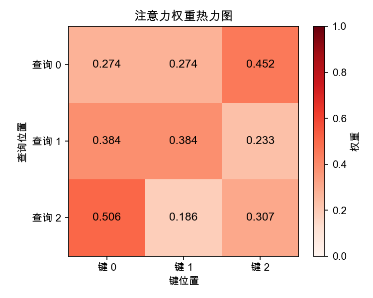

## 2.2 缩放点积注意力：为什么要除以根号 d

上一节把打分写成查询与键的点积，还没有解释分母。选点积而不选别的打分函数，理由是工程性的；分母 $$\sqrt{d_k}$$ 修正的则是一个具体的统计现象，而且这个修正只管到训练开始的那一刻。下面按这个顺序推导，最后把四步计算对到真实实现里的参数与数值处理。

### 2.2.1 完整公式与计算流程

缩放点积注意力（Scaled Dot-Product Attention）的计算公式为：

$$\text{Attention}(Q, K, V) = \text{softmax}\left(\frac{QK^T}{\sqrt{d_k}}\right)V$$

整个计算分为四步，形状按 [3.8.3 节](../03_components/3.8_gpt_inference_flow.md)的写法给出：

1. **打分**：$$S = QK^T$$，即 `Q[n, d_k] × Kᵀ[d_k, n] → S[n, n]`。$$S_{ij}$$ 是第 $$i$$ 个查询与第 $$j$$ 个键的点积。
2. **缩放**：$$S' = S / \sqrt{d_k}$$，逐格除以同一个数。在 2.2.3 给出的初始化假设下，这一步把点积的方差拉回 1。
3. **归一化**：$$A = \text{softmax}(S')$$，逐行归一，`S'[n, n] → A[n, n]`，每行之和为 1。
4. **读取**：$$\text{Output} = AV$$，即 `A[n, n] × V[n, d_v] → Output[n, d_v]`。

> [!NOTE]
> **行向量与矩阵打包**：按照《Attention Is All You Need》原论文的设定与深度学习的实现惯例，单个词的查询向量 $$\vec{q}$$ 被视作**行向量**（维度为 $$1 \times d_k$$）。序列中 $$n$$ 个词的查询向量被逐行“打包”（packed together）拼接成完整的查询矩阵 $$Q \in \mathbb{R}^{n \times d_k}$$。这使得矩阵乘法 $$QK^T$$ 可以一次性并行计算出所有词对之间的点积分数。

四步中只有第 1、4 步是矩阵乘法，第 2 步是逐格除法，第 3 步是逐行归一。两次矩阵乘法的两个操作数都是数据而非权重，这一点决定了它们的代价随序列长度平方增长（见 [2.5 节](2.5_complexity_limits.md)）。

### 2.2.2 点积为什么能衡量相关性

点积 $$q \cdot k = \sum_{i=1}^{d_k} q_i k_i$$ 衡量的是两个向量的方向一致性：

$$q \cdot k = \|q\| \|k\| \cos\theta$$

方向一致时（$$\theta = 0$$）点积最大，正交时为零，相反时最小。经过投影后，语义上该被读取的键会被学得与查询方向接近，从而得到较大的分数。

选点积而不是 [1.3 节](../01_introduction/1.3_attention_birth.md)的加性注意力，原论文给的理由是工程性的：两者理论复杂度相近，但点积可以用高度优化的矩阵乘法实现，实践中更快、更省空间。它同时指出了点积的短板：$$d_k$$ 较小时两者表现相当，$$d_k$$ 较大时，不加缩放的点积注意力不如加性注意力。缩放因子正是为了补上这个短板。

### 2.2.3 为什么必须缩放：Softmax 的饱和

**点积的方差随 $$d_k$$ 线性增长。** 设 $$q$$ 与 $$k$$ 的各分量相互独立、均值为 0、方差为 1（原论文脚注即用这一组假设，并不要求正态分布），则

- 均值：$$E[q \cdot k] = \sum_{i=1}^{d_k} E[q_i]E[k_i] = 0$$。
- 方差：$$\text{Var}(q \cdot k) = \sum_{i=1}^{d_k} \text{Var}(q_i k_i) = d_k$$，因为每一项的方差为 1，共 $$d_k$$ 项且相互独立。

标准差因此是 $$\sqrt{d_k}$$。表 2-3 给出几个常见取值。

| $$d_k$$ | 点积方差 | 点积标准差 | 典型点积范围（$$\approx \pm 2\sigma$$） | 除以 $$\sqrt{d_k}$$ 后的方差 |
|-----:|------:|------:|------:|------:|
| 16 | 16 | 4.0 | $$\pm 8$$ | 1 |
| 64 | 64 | 8.0 | $$\pm 16$$ | 1 |
| 128 | 128 | 11.3 | $$\pm 22.6$$ | 1 |
| 512 | 512 | 22.6 | $$\pm 45.2$$ | 1 |

表 2-3：未缩放点积的方差随 $$d_k$$ 线性增长，缩放后回到 1。$$d_k = 128$$ 是当代大模型最常见的每头宽度，对应的未缩放分数典型幅度约 $$\pm 23$$。

**幅度变大为什么有害。** Softmax 对输入尺度敏感：分数拉开后，最大项的权重趋近 1，其余趋近 0。此时梯度几乎为零，这一层学不到东西。要看清这一点，需要 Softmax 的雅可比矩阵：

$$\frac{\partial a_i}{\partial z_j} = a_i(\delta_{ij} - a_j)$$

其中 $$\delta_{ij}$$ 在 $$i = j$$ 时为 1、否则为 0。对角元 $$a_i(1 - a_i)$$ 在 $$a_i \to 1$$ 或 $$a_i \to 0$$ 时都趋于 0，非对角元 $$-a_i a_j$$ 同理。分布越接近 one-hot，整个雅可比越接近零矩阵，回传到 $$Q$$、$$K$$ 的梯度也随之消失。

代入数字。取同一组方向，使缩放后的三个分数为 `[1, 0, −1]`；若 $$d_k = 64$$ 且不缩放，同样的方向会给出 8 倍大的分数 `[8, 0, −8]`。

| 分数 | Softmax 权重 | 最大项的 $$a_1(1 - a_1)$$ |
| --- | --- | ---: |
| `[1, 0, −1]`（已缩放） | `[0.665, 0.245, 0.090]` | 0.223 |
| `[8, 0, −8]`（$$d_k = 64$$，未缩放） | `[0.99966, 0.00034, ≈0]` | 0.000335 |

表 2-4：同一组方向在缩放前后的 Softmax 与梯度尺度。后者的雅可比对角元只有前者的约 1/664，回传的梯度小了两个多数量级。三位小数的权重可用计算器复核：`e⁸ = 2981`，`e⁰ = 1`，`e⁻⁸ = 0.000335`，`2981 ÷ (2981 + 1 + 0.000335) = 0.99966`。

> [!NOTE]
> **减最大值与除以 $$\sqrt{d_k}$$ 解决的是两个问题。** Softmax 对输入整体平移不变（$$\text{softmax}(z) = \text{softmax}(z - c)$$），实现时先按行减去最大值再取指数，防的是 $$e^{z_i}$$ **数值上溢**；除以 $$\sqrt{d_k}$$ 防的是**梯度消失**。前者是恒等变形，不改变结果；后者改变结果，是模型定义的一部分。

**这个修正只管到初始化。** 上面的推导用的是“各分量独立、零均值、单位方差”，这只在随机初始化时成立。训练开始后，$$Q$$ 与 $$K$$ 由同一份输入经两个正在学习的矩阵得到，分量既不独立也不再是单位方差；实测中注意力 logits 会随训练持续增长，大模型上尤其明显。因此 $$1/\sqrt{d_k}$$ 是一个静态修正，管住的是训练第一步的尺度，管不住其后的漂移。全程性的约束要靠别的手段：QK-Norm 在打分前对 $$q$$、$$k$$ 做归一化，logit soft-cap 用 $$\tanh$$ 把分数压进固定区间，QK-clip 在优化器更新之后回缩 $$W^Q$$、$$W^K$$。另有 z-loss 约束最终 Softmax 的配分函数，与注意力内部这个 Softmax 不是一回事。四者都见 [6.3.6 节](../06_training_techniques/6.3_regularization.md)。

**换别的缩放行不行。** 三种替代方案各有取舍：

- 不除以 $$\sqrt{d_k}$$，改为把 $$W^Q$$、$$W^K$$ 的初始化方差按 $$1/\sqrt{d_k}$$ 缩小。初始时刻等价，但缩放因子被藏进了参数尺度，学习率与初始化从此耦合，调参更难。
- μP（最大更新参数化）用 $$1/d_k$$ 而非 $$1/\sqrt{d_k}$$，目的是让超参数在宽度变化时可迁移；代价是它与标准实现的分数尺度不同，整套初始化和学习率都要一起改。
- 余弦注意力与 QK-Norm 先把 $$q$$、$$k$$ 归一化，再乘一个可学习的温度。分数尺度不再依赖 $$d_k$$，但多了一个待学参数和一次归一化开销。

### 2.2.4 Softmax：指数放大与长度稀释

Softmax 在这里做两件事。一是归一化，把任意实数分数变成非负且和为 1 的权重。二是按指数放大差距：两个位置的分数差 $$\Delta$$ 对应的权重比恰好是 $$e^{\Delta}$$，与其他位置无关。分数差 1 对应 2.72 倍，差 5 对应 148 倍。

放大不等于通吃。五个分数 `[2.0, 1.0, 0.1, −0.5, −1.0]` 的 Softmax 是：

| 位置 | 原始分数 | Softmax 权重 |
|------|---------|-------------|
| 1    | 2.0     | 0.606       |
| 2    | 1.0     | 0.223       |
| 3    | 0.1     | 0.091       |
| 4    | -0.5    | 0.050       |
| 5    | -1.0    | 0.030       |

表 2-5：五个分数经 Softmax 后的权重。最高分拿到 60.6%，其余四项合计仍有 39.4%，最低的一项也有 3%，并非只剩一个赢家。

**候选一多，同样的优势会被稀释。** 设某个位置的分数比其余所有位置都高出 5，其余位置彼此相同，则它的权重是 $$e^5 / (e^5 + n - 1)$$：

- $$n = 512$$ 时为 0.225；
- $$n = 8{,}192$$ 时为 0.018；
- $$n = 131{,}072$$ 时为 0.001。

分数优势没变，权重却掉了两百倍。这不是训练不好，而是行和为 1 这条约束在长序列上的必然结果，[2.5.5 节](2.5_complexity_limits.md)会把它与注意力汇放在一起讨论。

### 2.2.5 完整的计算示例

以一个简化的例子完整展示缩放点积注意力的计算过程。假设序列长度 $$n=3$$，维度 $$d_k = 4$$：

$$Q = \begin{bmatrix} 1 & 0 & 1 & 0 \\ 0 & 1 & 0 & 1 \\ 1 & 1 & 0 & 0 \end{bmatrix}, \quad K = \begin{bmatrix} 1 & 1 & 0 & 0 \\ 0 & 0 & 1 & 1 \\ 1 & 0 & 1 & 0 \end{bmatrix}, \quad V = \begin{bmatrix} 1 & 0 & 0 & 1 \\ 0 & 1 & 1 & 0 \\ 1 & 1 & 0 & 0 \end{bmatrix}$$

1. **计算点积** $$S = QK^T$$。第 1 行第 3 列由 $$Q$$ 的第 1 行与 $$K$$ 的第 3 行逐项相乘再相加：$$1\times1 + 0\times0 + 1\times1 + 0\times0 = 2$$。
   $$S = \begin{bmatrix} 1 & 1 & 2 \\ 1 & 1 & 0 \\ 2 & 0 & 1 \end{bmatrix}$$
2. **缩放**（除以 $$\sqrt{d_k} = \sqrt{4} = 2$$）：
   $$S' = \begin{bmatrix} 0.5 & 0.5 & 1.0 \\ 0.5 & 0.5 & 0 \\ 1.0 & 0 & 0.5 \end{bmatrix}$$
3. **Softmax 归一化**（按行操作）。第 1 行取指数得 `[1.649, 1.649, 2.718]`，行和 6.016，各项除以行和即得该行权重：
   $$A = \text{softmax}(S') \approx \begin{bmatrix} 0.274 & 0.274 & 0.452 \\ 0.384 & 0.384 & 0.233 \\ 0.506 & 0.186 & 0.307 \end{bmatrix}$$
4. **加权求和**计算输出 $$\text{Output} = AV$$：
   $$\text{Output} \approx \begin{bmatrix} 0.726 & 0.726 & 0.274 & 0.274 \\ 0.616 & 0.616 & 0.384 & 0.384 \\ 0.814 & 0.494 & 0.186 & 0.506 \end{bmatrix}$$

每个输出位置的向量是所有位置值向量的加权组合，权重由查询和键的匹配度决定。输出维度是 $$d_v$$；多头拼接后再由输出投影回到 $$d_{\text{model}}$$，因此可以直接传给下一层。

下面用 PyTorch 完整实现上述计算，矩阵与正文相同，可直接运行核对每一步：

```python
import torch
import torch.nn.functional as F
import math

# 与正文 §2.2.5 相同的矩阵 (n=3, d_k=4)
Q = torch.tensor([[1, 0, 1, 0],
                  [0, 1, 0, 1],
                  [1, 1, 0, 0]], dtype=torch.float32)

K = torch.tensor([[1, 1, 0, 0],
                  [0, 0, 1, 1],
                  [1, 0, 1, 0]], dtype=torch.float32)

V = torch.tensor([[1, 0, 0, 1],
                  [0, 1, 1, 0],
                  [1, 1, 0, 0]], dtype=torch.float32)

d_k = Q.size(-1)  # 4

# 第1步：计算注意力分数 S = Q @ K^T
scores = torch.matmul(Q, K.transpose(-2, -1))
print("注意力分数 QK^T:\n", scores)

# 第2步：缩放 S' = S / sqrt(d_k)
scaled_scores = scores / math.sqrt(d_k)
print("缩放后分数 (÷√4):\n", scaled_scores)

# 第3步：Softmax 归一化（每行之和为 1）
attn_weights = F.softmax(scaled_scores, dim=-1)
print("注意力权重 (softmax):\n", attn_weights)
print("每行之和:", attn_weights.sum(dim=-1))

# 第4步：加权求和 Output = A @ V
output = torch.matmul(attn_weights, V)
print("最终输出:\n", output)
print("输出形状:", output.shape, " （与输入相同: n×d_v）")
```

运行上述代码后，可以得到如下结果。

```text
注意力分数 QK^T:
 tensor([[1., 1., 2.],
        [1., 1., 0.],
        [2., 0., 1.]])
缩放后分数 (÷√4):
 tensor([[0.5000, 0.5000, 1.0000],
        [0.5000, 0.5000, 0.0000],
        [1.0000, 0.0000, 0.5000]])
注意力权重 (softmax):
 tensor([[0.2741, 0.2741, 0.4519],
        [0.3837, 0.3837, 0.2327],
        [0.5065, 0.1863, 0.3072]])
每行之和: tensor([1., 1., 1.])
最终输出:
 tensor([[0.7259, 0.7259, 0.2741, 0.2741],
        [0.6163, 0.6163, 0.3837, 0.3837],
        [0.8137, 0.4935, 0.1863, 0.5065]])
输出形状: torch.Size([3, 4])  （与输入相同: n×d_v）
```

把权重矩阵绘成热力图，颜色深浅即权重高低。



图 2-2：缩放点积注意力权重热力图（[生成脚本](https://github.com/yeasy/llm_internals/blob/main/tools/figures/attention_heatmap.py)）。颜色越深权重越高；每一行之和为 1。图中行列下标从 0 起，正文从 1 起，「查询 0」即上式中的第 1 行。

### 2.2.6 对到真实实现

生产代码里很少手写这四步，而是调用融合内核。PyTorch 的入口是 `torch.nn.functional.scaled_dot_product_attention`，签名为 `(query, key, value, attn_mask=None, dropout_p=0.0, is_causal=False, scale=None, enable_gqa=False)`。表 2-6 把正文的四步逐一对上去。

| 正文的步骤 | 接口里的对应物 | 要点 |
| --- | --- | --- |
| 输入的 Q、K、V | `query` 形状 `[..., Hq, L, E]`，`key` 形状 `[..., H, S, E]`，`value` 形状 `[..., H, S, Ev]` | 常见布局是 `[B, n_h, T, d_h]`，与 3.8.6 的表 3-25 一致；`L` 是查询数，`S` 是键值数，两者不必相等；`E` 即正文的 $$d_k$$，`Ev` 即 $$d_v$$ |
| 第 2 步的 $$1/\sqrt{d_k}$$ | `scale` | 默认即 $$1/\sqrt{E}$$，$$E$$ 取 `query` 的最后一维；传入非默认值可实现 μP 那类缩放 |
| 第 3 步之前加掩码 | `attn_mask` 或 `is_causal=True` | 布尔掩码中 `True` 表示**参与**注意力，与 `masked_fill` 的约定相反；浮点掩码则直接加到分数上；两者不能与 `is_causal` 同时使用 |
| 第 3 步之后的 dropout | `dropout_p` | 作用在注意力权重上，即 Softmax 之后、乘 $$V$$ 之前 |
| K/V 头数少于 Q 头数 | `enable_gqa=True` | 见 [2.3.7 节](2.3_multi_head.md) |

表 2-6：缩放点积注意力的四步与 PyTorch 接口的对应关系。该函数会在多个后端之间选择，包括不把 `[L, S]` 分数矩阵写回显存的融合实现（见 [10.3 节](../10_inference_optimization/10.3_flash_attention.md)）与朴素的数学实现；后者在半精度输入下会把中间结果保持为 FP32。手写版本可见[附录 A.2](../appendix/a2_pytorch_examples.md)。

三处数值细节值得单独记住。

**Softmax 常被升到 FP32。** FP16 能表示的最大值是 65,504，超出即为 `inf`。未缩放的 $$QK^T$$ 在长序列或大 $$d_k$$ 下有溢出风险，指数运算更是把风险放大。Hugging Face 的 Llama 朴素实现把这一步写成 `softmax(attn_weights, dim=-1, dtype=torch.float32).to(query.dtype)`：以 FP32 计算，再转回原精度。BF16 的指数范围与 FP32 相同，溢出风险小得多，但尾数更短。

**注意力 dropout 的位置容易记错。** 它丢弃的是注意力权重，不是值向量，丢弃后行和不再为 1。GPT-2 的配置里 `attn_pdrop` 为 0.1；现代大模型的预训练多把它设为 0，微调时才可能启用。

**分数矩阵是数据，不是权重。** 它随输入变化，每层每个头各一张，训练时还要留到反向传播（见 [2.5.1 节](2.5_complexity_limits.md)）。这是长上下文显存开销的主要来源，也是 FlashAttention 要绕开的东西。
