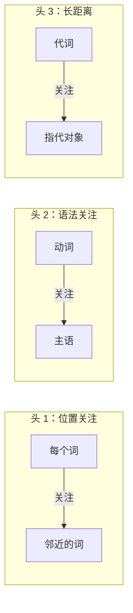

## 2.3 多头注意力：为什么多个子空间更好

单头注意力将所有的表示能力集中在一个注意力函数中，但 Transformer 的作者直觉地认为这还不够。多头注意力（Multi-Head Attention）的设计让模型能够同时关注来自不同子空间的不同类型的关系。

### 2.3.1 单头注意力的局限

考虑这样一个句子："小明在北京的大学里学习计算机科学。"

对于"学习"这个词，至少需要建立以下几种不同的关系：

- **主语关系**：谁在学习？——"小明"
- **地点关系**：在哪里学习？——"北京的大学"
- **宾语关系**：学什么？——"计算机科学"

在单头注意力中，所有这些关系的捕捉都必须通过**同一组 Q、K、V 投影**来完成。这意味着同一个投影矩阵既要捕捉主谓关系，又要捕捉动宾关系，还要捕捉修饰关系——这对单一的线性变换来说是一个过重的负担。

更直观地说：单头注意力产生的注意力权重是一个概率分布，**必须在所有位置之间分配总量为 1 的注意力**。如果"学习"需要同时关注"小明"、"大学"和"计算机科学"三个不同的位置，每个位置能分到的注意力权重就会被摊薄。

### 2.3.2 多头注意力：并行的多视角

多头注意力的解决方案是：**让模型拥有多组独立的 Q、K、V 投影，每组关注一种类型的关系，最后将结果合并。**

数学上，多头注意力定义为：

$$\text{MultiHead}(Q, K, V) = \text{Concat}(\text{head}_1, \dots, \text{head}_h)W^O$$

其中每个头独立计算注意力：

$$\text{head}_i = \text{Attention}(QW_i^Q, KW_i^K, VW_i^V)$$

各投影矩阵的维度为：$W_i^Q \in \mathbb{R}^{d_{\text{model}} \times d_k}$，$W_i^K \in \mathbb{R}^{d_{\text{model}} \times d_k}$，$W_i^V \in \mathbb{R}^{d_{\text{model}} \times d_v}$，输出投影 $W^O \in \mathbb{R}^{hd_v \times d_{\text{model}}}$。

在原始 Transformer 中，$h = 8$ 个头，$d_{\text{model}} = 512$，因此每个头的维度为 $d_k = d_v = d_{\text{model}} / h = 64$。

### 2.3.3 为什么多头设计有效

多头注意力的有效性可以从多个角度理解：

**子空间分解的直觉**：每个头在一个较低维的子空间中操作，可以专注于学习一种特定类型的关系模式。研究表明，训练后的不同注意力头确实学到了不同的功能——有些头关注语法依赖（如主谓一致），有些关注邻近位置，有些关注特定的语义关系。

**信息论的视角**：在高维空间中，向量之间的关系非常丰富。将 $d_{\text{model}}$ 维空间分解为 $h$ 个 $d_k$ 维子空间，相当于从 $h$ 个不同的"视角"来审视同一组数据。每个视角可能捕捉到不同的模式。这与信号处理中的"多通道"概念类似。

**计算代价不变**：一个关键的设计考量是，多头注意力**并不增加总计算量**。虽然有 $h$ 个头，但每个头的维度从 $d_{\text{model}}$ 降低到 $d_{\text{model}}/h$。因此：

$$h \times O(n^2 \cdot d_{\text{model}}/h) = O(n^2 \cdot d_{\text{model}})$$

总计算量与单头（使用完整 $d_{\text{model}}$ 维度）相同。这意味着多头注意力通过"重新分配"表示能力（而非增加计算量）来获得更好的效果。

### 2.3.4 注意力头的可视化分析

研究者对训练好的 Transformer 模型进行了注意力头的可视化分析，发现了一些有趣的模式：

图 2-1：不同注意力头学到的关注模式示意

这些可视化结果验证了多头设计的直觉：**不同的头自发地学习了不同类型的语言关系**，无需人工设定每个头应该关注什么。

### 2.3.5 头数的选择与权衡

注意力头的数量 $h$ 是一个需要权衡的超参数。原始论文通过消融实验发现：

- 太少的头（如 $h=1$）无法充分捕捉多种关系模式
- 太多的头（如 $h=32$）每个头的维度 $d_k$ 太小（$512/32=16$），单个头的表示能力不足
- $h=8$ 在原始配置中是最优的平衡点

这个权衡的本质是**专业化程度与单头容量的矛盾**：更多的头意味着更细的专业化分工，但也意味着每个头能操作的维度更少、表达能力更有限。

现代大语言模型通常使用更多的头（32、40 甚至 128），但这是因为它们的 $d_{\text{model}}$ 也相应增大了（4096 甚至更高），因此每个头的维度仍然足够。
