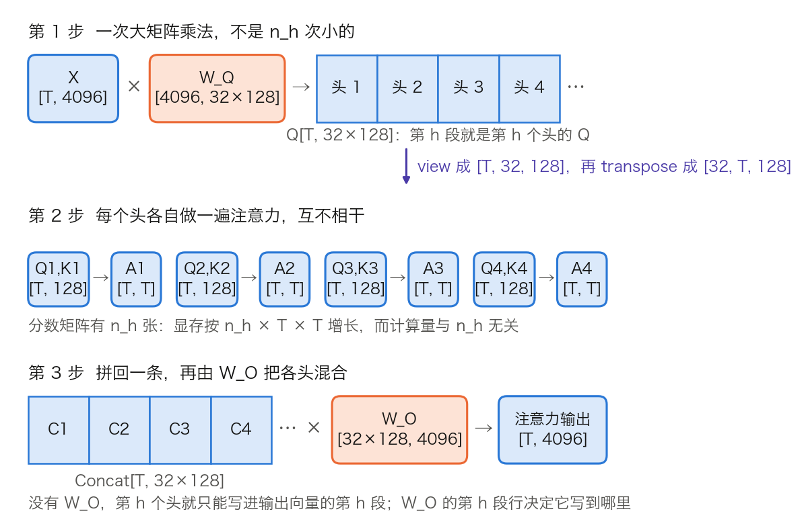

## 2.3 多头注意力：为什么多个子空间更好

前两节的公式里只有一组 Q、K、V。真实模型把这一组切成 $$n_h$$ 份并行计算，再拼回来。本节先说明一组为什么不够，再把切分还原成实现里的几次变形，然后给出头数与每头宽度的取值依据，最后检验切出来的头是不是都在干活。

### 2.3.1 单头只能给出一个加权平均

考虑句子“小明在北京的大学里学习计算机科学”。对“学习”这个位置，至少要建立三种关系：主语是“小明”，地点是“北京的大学”，宾语是“计算机科学”。

单头注意力对这个位置只输出**一个**加权平均。三处内容被同一组权重读出后相加成一个向量，之后再也分不开：后续层拿到的是混合结果，无法知道其中哪部分来自主语、哪部分来自宾语。原论文对此的表述是，多头让模型能同时关注来自不同表示子空间的信息，而单头的平均会妨碍这一点。

这里的障碍不是“注意力总量只有 1 不够分”。多头之下每个头的权重同样和为 1，总量并没有变多。真正的差别是输出的份数：$$n_h$$ 个头给出 $$n_h$$ 个独立的加权平均，各自占据输出向量的一段，再由 $$W^O$$ 决定怎样组合。一个平均变成 $$n_h$$ 个平均，这才是多头换来的东西。

### 2.3.2 实现里的多头：一次投影，两次变形

**多头注意力**（Multi-Head Attention，MHA）的定义是：

$$\text{MultiHead}(Q, K, V) = \text{Concat}(\text{head}_1, \dots, \text{head}_{n_h})W^O$$

其中每个头独立计算注意力：

$$\text{head}_i = \text{Attention}(QW_i^Q, KW_i^K, VW_i^V)$$

各投影矩阵的维度为 $$W_i^Q, W_i^K \in \mathbb{R}^{d_{\text{model}} \times d_k}$$，$$W_i^V \in \mathbb{R}^{d_{\text{model}} \times d_v}$$，输出投影 $$W^O \in \mathbb{R}^{n_h d_v \times d_{\text{model}}}$$。原论文把头数记作 $$h$$，本书统一记作 $$n_h$$，与形状清单一致。

公式写成 $$n_h$$ 个独立的头，代码里却不做 $$n_h$$ 次小矩阵乘法。图 2-3 给出真实的数据流：一次大投影，两次变形。

图 2-3：多头在实现里是“一次大投影，两次变形”（[生成脚本](https://github.com/yeasy/llm_internals/blob/main/tools/figures/ch02_multihead_reshape.py)）。形状按 GPT-3 6.7B 的配置标注，省略 batch 维；图上画 4 个头只为画得下。

按形状清单写出来是四步，其中 `T` 是词元数，即前面各式里的序列长 $$n$$：

- **一次投影**：`X[T, d_model] × W_Q[d_model, n_h × d_h] → Q[T, n_h × d_h]`。所谓“第 $$i$$ 个头的 $$W_i^Q$$”，就是这个大矩阵的第 $$i$$ 段列。
- **第一次变形**：`view` 成 `[T, n_h, d_h]`，把最后一维按头切开。这一步只改变下标的解释方式，不搬数据。
- **第二次变形**：`transpose` 成 `[n_h, T, d_h]`，把头提到前面，使每个头拿到一个连续的 `[T, d_h]`。实际实现还带着 batch 维，即 `[B, n_h, T, d_h]`（见 3.8.6 的表 3-25）。
- **拼回去**：各头算出 `[T, d_h]` 的 context，`transpose` 回来再 `reshape` 成 `[T, n_h × d_h]`，最后 `× W_O[n_h × d_h, d_model]`。

取 `d_model = 4`、`n_h = 2`、`d_h = 2`，切分与拼接的下标是：投影结果每一行有 4 个数，第 1、2 个数归头 1，第 3、4 个数归头 2；头 1 交出的 2 个数写回第 1、2 位，头 2 的写回第 3、4 位。完整的两头数值手算见 [3.8.4 节](../03_components/3.8_gpt_inference_flow.md)，本节不重复。

$$W^O$$ 不是可有可无的收尾。拼接只是把数字排在一起，前 $$d_h$$ 个分量仍只含头 1 的信息。没有 $$W^O$$，第 $$i$$ 个头就永远只能写进输出向量的第 $$i$$ 段；有了它，每个头的结果可以写到输出的任何方向上，也可以互相抵消。$$W^O$$ 的第 $$i$$ 段行正是头 $$i$$ 的“写入地址”。

### 2.3.3 三笔账：参数、计算与显存

“多头不增加计算量”是常被引用的结论，但它只对其中两笔账成立。取 $$d_{\text{model}} = n_h \times d_h = d$$，序列长 $$n$$：

- **参数**：$$4d^2$$，与 $$n_h$$ 无关。头多头少，切的都是同样大的四个矩阵。
- **打分与读取的计算量**：每个头两次矩阵乘法，各约 $$2n^2 d_h$$ 次浮点运算，$$n_h$$ 个头合计 $$n_h \times 4n^2 d_h = 4n^2 d$$，同样与 $$n_h$$ 无关（因果掩码下只需算下三角，减半为 $$2n^2d$$）。
- **分数矩阵的显存**：每个头一张 `[n, n]`，合计 $$n_h \times n^2$$ 个数，**随 $$n_h$$ 线性增长**。

第三笔账常被漏掉。取 $$d = 4096$$、$$n = 4096$$、FP16、批大小 1，一层里所有头的分数矩阵合计：

- $$n_h = 8$$（$$d_h = 512$$）：`8 × 4096² × 2 = 268,435,456` 字节，即 0.25 GiB。
- $$n_h = 32$$（$$d_h = 128$$）：1 GiB。
- $$n_h = 128$$（$$d_h = 32$$）：4 GiB。

三种配置的参数量和 FLOPs 一模一样，峰值显存却差 16 倍。头数因此不是“反正不要钱”的旋钮，[2.5.1 节](2.5_complexity_limits.md)会把这笔账推广到整个模型。

### 2.3.4 训练后的头学到了什么

对训练好的模型做头级分析，可以把头的行为归类。[对翻译模型编码器各头的分析](https://arxiv.org/abs/1905.09418)在英俄、英德、英法三个方向上识别出三种可解释的功能：位置头指向相邻位置，句法头指向特定句法关系的词，稀有词头指向句中频率最低的词。这些功能是训练中自发形成的，没有人为指定。

自发分工是否优于人工指派，该文献没有做过对照实验。一种解释是目标函数只要求降低预测误差，不要求分工方式可被人类命名。各类语言关系所需的表示容量差别很大，把“头 1 只看标点”这类规则固定下来，既可能与子空间容量错配，又压缩了表示学习的自由度。

可解释的头只是少数，比例见 2.3.6；把注意力权重直接当作模型的解释，也已被证明站不住脚。

### 2.3.5 头数与每头宽度怎么定

原论文在保持总计算量不变的前提下做过消融，改变头数的同时反向调整每头宽度。表 2-7 是原文表 3 的 (A) 组。

| $$h$$ | $$d_k = d_v$$ | PPL（dev） | BLEU（dev） |
| ---: | ---: | ---: | ---: |
| 1 | 512 | 5.29 | 24.9 |
| 4 | 128 | 5.00 | 25.5 |
| 8（base） | 64 | 4.92 | 25.8 |
| 16 | 32 | 4.91 | 25.8 |
| 32 | 16 | 5.01 | 25.4 |

表 2-7：头数消融，数据取自[原论文](https://arxiv.org/abs/1706.03762)表 3 的 (A) 组，任务为英德翻译，评测集 newstest2013。表头沿用原文记号，$$h$$ 即本书的 $$n_h$$，$$d_k = d_v$$ 即 $$d_h$$。原文的结论是单头比最好的配置低 0.9 BLEU，头太多时质量也会下降。

照数字读，这是一段平缓的最优区间而非一个最优点：16 头与 8 头的 BLEU 同为 25.8，PPL 还略低；32 头回落 0.4 BLEU，谈不上“严重不足”；只有 1 头明显落后。换言之，头数在相当宽的范围内都可接受，真正吃亏的是极端值。

**为什么每头不能太窄，有理论依据。** 单头的分数矩阵 $$QK^\top$$ 由 `[n, d_k] × [d_k, n]` 得到，秩不超过 $$d_k$$。当 $$d_k < n$$ 时，这个头无法表达任意的 `n × n` 注意力模式。[对低秩瓶颈的分析](https://arxiv.org/abs/2002.07028)据此论证：把每头宽度压到低于输入序列长度，会限制单个头的表示能力，并提出把头宽度直接设为序列长度、与头数解耦。这为“先定每头宽度、再反推头数”提供了论据，也解释了 2.1.3 中那个秩不超过 $$d_k$$ 的双线性矩阵为什么重要。

实践中的做法正是先定宽度：把 $$d_h$$ 固定在 64 到 128，再由 $$n_h = d_{\text{model}} / d_h$$ 反推。GPT-3 Small 是 `768 / 64 = 12` 个头，GPT-3 175B 是 `12288 / 128 = 96` 个头，Llama 3 8B 是 `4096 / 128 = 32` 个头（见 3.8.6 的表 3-24）。模型变大，主要是头数和层数一起增加，每头宽度几乎不动。少数模型单独设定 `head_dim`，此时 $$n_h \times d_h \neq d_{\text{model}}$$，由 $$W^O$$ 投回（例子见 [2.1.5 节](2.1_qkv_intuition.md)）。

### 2.3.6 头并不都有用

切出来的头不是每个都在干活，这一点有可复核的实验结论。

**多数头可以在推理时直接去掉。** [一项逐头消融实验](https://arxiv.org/abs/1905.10650)对训练好的翻译模型与 BERT 逐个屏蔽注意力头，按重要性从低到高依次剪除，分别剪掉 20% 与 40% 的头时性能没有明显下降；多数层甚至可以只保留一个头。继续剪则性能陡降，说明两个模型都不能在不重训的情况下退化为纯单头。

**用带惩罚的剪枝可以剪得更狠。** 同一篇头级分析对英俄翻译模型剪掉 48 个编码器头中的 38 个，BLEU 只下降 0.15；而且被最后剪掉的正是 2.3.4 中那些有明确功能的专门化头。

**注意力权重不等于解释。** 把权重高的位置说成“模型据此做出判断”是一种流行的误读。[一项跨任务的检验](https://arxiv.org/abs/1902.10186)发现：学到的注意力权重常与基于梯度的重要性度量不相关，而且可以构造出与原权重差别很大、却给出几乎相同预测的注意力分布。权重说明的是信息从哪里被读出，不等于结论由哪里决定。

这三条合起来给出本节的边界：多头是有效的设计，但“头数越多分工越细致”“权重图就是模型的推理过程”都不成立。

### 2.3.7 Q 头与 K/V 头可以不一样多

到这里，Q、K、V 的头数始终相等。推理时这三者的地位并不对称：Q 每轮只用一次就丢，K 和 V 却要存进 KV 缓存，被后面每一轮反复读取（见 [3.8.5 节](../03_components/3.8_gpt_inference_flow.md)）。于是有了同一条轴上的三种配置：

| 配置 | K/V 头数 $$n_{kv}$$ | 每词元 KV 缓存 | 代表模型 |
| --- | --- | --- | --- |
| MHA（多头） | $$n_{kv} = n_h$$ | 最大 | GPT-3 各规模 |
| GQA（分组查询） | $$1 < n_{kv} < n_h$$，每组 Q 头共用一套 K/V | 按 $$n_{kv} / n_h$$ 缩小 | Llama 3 各规模，$$n_{kv} = 8$$ |
| MQA（多查询） | $$n_{kv} = 1$$ | 最小 | 见 [3.7.5 节](../03_components/3.7_full_architecture.md) |

表 2-8：Q 头数与 K/V 头数的三种关系。Q 的头数不变，变的只是 K/V 被共享的程度。

一个词元要存的 K/V 个数是“K 与 V 两份 × K/V 头数 × 每头宽度 × 层数”，四项里只有 K/V 头数随这条轴变化。Llama 3 8B 把 $$n_{kv}$$ 从 32 降到 8，缓存就降到四分之一，同样的显存因而能多服务四倍的上下文；代价是每组 Q 头共用一套 K/V，匹配依据的多样性下降。逐项代入的字节算例见 [3.7.5 节](../03_components/3.7_full_architecture.md)，缓存的完整账与分页管理见 [10.2 节](../10_inference_optimization/10.2_kv_cache.md)，更激进的压缩见 10.2.7 的 MLA。

下一节换另一条坐标轴：Q 与 K、V 可以来自不同的序列，而哪些位置允许被看见，则由掩码决定。
