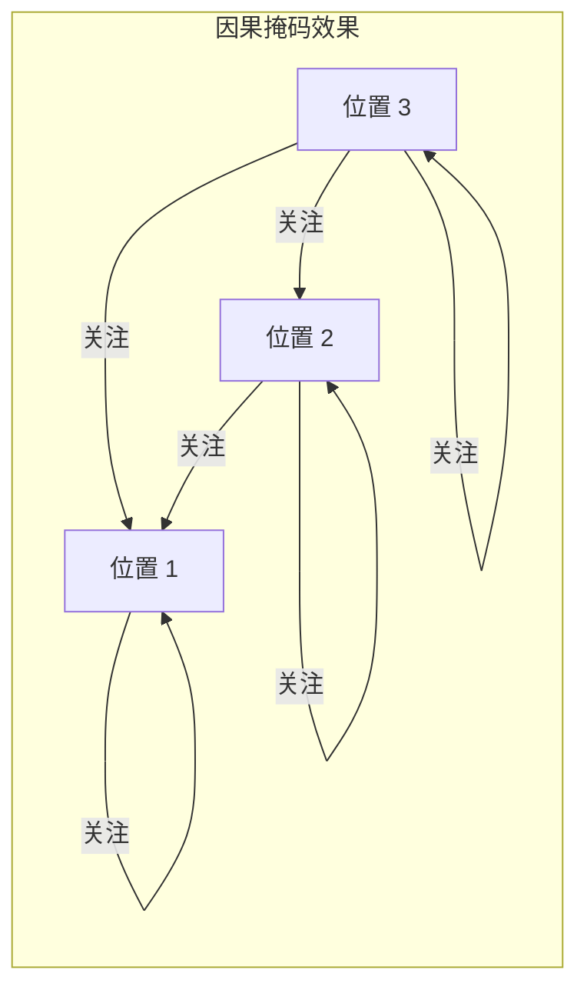

## 2.4 自注意力、交叉注意力与因果掩码

注意力机制在 Transformer 中的应用不是千篇一律的。根据查询和键值的来源不同，以及是否需要限制信息流向，注意力机制衍生出了几种重要的变体。理解它们的区别和设计动机，对于掌握 Transformer 的完整架构至关重要。

### 2.4.1 自注意力：序列内部的信息交互

**自注意力**（Self-Attention）是指 Q、K、V 全部来自同一个序列。每个位置既充当查询者（提出问题），也充当被查询者（提供用于匹配的键和信息）。

自注意力的核心能力是**建立序列内部的全局依赖关系**。以句子"猫坐在垫子上，因为它很软"为例，自注意力需要帮助模型理解"它"指的是"垫子"而非"猫"。通过计算"它"的查询向量与"猫"和"垫子"的键向量的匹配度，模型可以学习到正确的指代关系。

在 Transformer 编码器中，自注意力是**全双向**的——每个位置可以关注序列中的任意其他位置，包括前面和后面的位置。这使得编码器能够利用完整的上下文信息来构建每个位置的表示。

### 2.4.2 交叉注意力：两个序列之间的桥梁

**交叉注意力**（Cross-Attention）中，Q 来自一个序列（目标序列），而 K 和 V 来自另一个序列（源序列）。这种机制是编码器-解码器架构的核心连接点。

在机器翻译中，交叉注意力让解码器（生成目标语言）能够"查看"编码器（处理源语言）的输出。直觉上，这就像翻译者在写出法语译文时不断回头看英语原文——每写一个词，都需要参考原文中相关的部分。

交叉注意力的设计是自然的：解码器的当前状态决定了"需要什么信息"（Query），而编码器的输出提供了"有哪些可用信息"（Key 和 Value）。

### 2.4.3 因果掩码：为什么生成任务需要"遮住未来"

在自回归生成任务中（如语言模型、文本生成），模型必须逐步生成输出——第 $t$ 个词只能基于前 $t-1$ 个词来预测，**不能"偷看"后面的内容**。

但自注意力的默认行为是全连接的——每个位置会关注所有位置，包括后面的位置。如果在训练时不加限制，模型在预测第 $t$ 个词时就能直接看到第 $t+1, t+2, \dots$ 个词（即正确答案），导致训练变成"复制"而非"预测"，模型将无法学到任何有用的东西。

**因果掩码**（Causal Mask）正是解决这个问题的机制。它在注意力分数矩阵上应用一个上三角掩码，将所有 $j > i$ 的位置（即"未来"位置）的分数设为 $-\infty$：

$$\text{Mask}_{ij} = \begin{cases} 0 & \text{if } j \leq i \\ -\infty & \text{if } j > i \end{cases}$$

将掩码加到缩放后的注意力分数上：

$$A = \text{softmax}\left(\frac{QK^T}{\sqrt{d_k}} + \text{Mask}\right)$$

由于 $e^{-\infty} = 0$，Softmax 后这些位置的注意力权重为零，信息被完全阻断。效果是：**位置 $i$ 只能关注位置 $1, 2, \dots, i$**，形成一种严格的因果（从左到右的）信息流。



图 2-2：因果掩码的信息流向示意（每个位置只能看到自己和之前的位置）

下面的代码展示了因果掩码的完整实现过程，读者可以运行后观察掩码如何将"未来"位置的注意力权重归零：

```python
import torch
import torch.nn.functional as F
import math

seq_len, d_k = 4, 8
torch.manual_seed(42)
Q = torch.randn(seq_len, d_k)
K = torch.randn(seq_len, d_k)
V = torch.randn(seq_len, d_k)

# 计算原始注意力分数并缩放
scores = torch.matmul(Q, K.transpose(-2, -1)) / math.sqrt(d_k)
print("缩放后注意力分数:\n", scores.round(decimals=3))

# 生成因果掩码：上三角部分填充 -inf
mask = torch.triu(torch.ones(seq_len, seq_len), diagonal=1).bool()
scores_masked = scores.masked_fill(mask, float('-inf'))
print("应用因果掩码后:\n", scores_masked.round(decimals=3))

# Softmax 后，-inf 位置的权重变为 0
attn_weights = F.softmax(scores_masked, dim=-1)
print("注意力权重（未来位置权重为 0）:\n", attn_weights.round(decimals=3))

# 验证：位置 0 只关注自己，位置 3 关注所有位置
print("位置 0 的非零权重数:", (attn_weights[0] > 0).sum().item())  # 1
print("位置 3 的非零权重数:", (attn_weights[3] > 0).sum().item())  # 4
```

下面的代码将因果掩码后的注意力权重绘制为热力图，直观展示下三角结构——**右上角（未来位置）的权重全部为零**：

```python
import matplotlib.pyplot as plt

fig, axes = plt.subplots(1, 2, figsize=(11, 4))
labels = [f"位置 {i}" for i in range(seq_len)]

# 左图：无掩码的注意力权重
attn_no_mask = F.softmax(scores, dim=-1)
im0 = axes[0].imshow(attn_no_mask.detach().numpy(), cmap="Blues", vmin=0, vmax=1)
axes[0].set_title("（a）无掩码的注意力权重")
axes[0].set_xticks(range(seq_len))
axes[0].set_yticks(range(seq_len))
axes[0].set_xticklabels(labels, fontsize=8)
axes[0].set_yticklabels(labels, fontsize=8)
for i in range(seq_len):
    for j in range(seq_len):
        axes[0].text(j, i, f"{attn_no_mask[i, j]:.2f}",
                     ha="center", va="center", fontsize=8)

# 右图：因果掩码后的注意力权重
im1 = axes[1].imshow(attn_weights.detach().numpy(), cmap="Blues", vmin=0, vmax=1)
axes[1].set_title("（b）因果掩码后的注意力权重")
axes[1].set_xticks(range(seq_len))
axes[1].set_yticks(range(seq_len))
axes[1].set_xticklabels(labels, fontsize=8)
axes[1].set_yticklabels(labels, fontsize=8)
for i in range(seq_len):
    for j in range(seq_len):
        axes[1].text(j, i, f"{attn_weights[i, j]:.2f}",
                     ha="center", va="center", fontsize=8)

plt.colorbar(im1, ax=axes, label="权重", shrink=0.8)
plt.tight_layout()
plt.savefig("causal_mask_heatmap.png", dpi=150)
plt.show()
```

图 2-3：因果掩码前后的注意力权重热力图对比

对比两张热力图可以清晰看到：左图（无掩码）中每一行的权重分布在所有位置上；右图（因果掩码后）中**右上角区域全为零**，每个位置只能关注自己和之前的位置。位置 0 的整行权重集中在自身（1.00），而位置 3 的权重分散在所有 4 个位置上——这正是自回归模型"逐步生成、不看未来"要求的直观体现。


### 2.4.4 三种注意力在 Transformer 中的位置

在完整的 Transformer 编码器-解码器架构中，三种注意力各有其位置：

| 注意力类型 | 所在位置 | Q 来源 | K/V 来源 | 掩码 |
|-----------|---------|-------|---------|------|
| 自注意力 | 编码器 | 编码器输入 | 编码器输入 | 无（或填充掩码） |
| 掩码自注意力 | 解码器第一层 | 解码器输入 | 解码器输入 | 因果掩码 |
| 交叉注意力 | 解码器第二层 | 解码器状态 | 编码器输出 | 无（或填充掩码） |

需要注意的是，现代仅解码器（Decoder-Only）模型（如 GPT 系列）只使用**掩码自注意力**，不需要交叉注意力。而仅编码器（Encoder-Only）模型（如 BERT）只使用**全双向的自注意力**。第五章将详细讨论这些架构选择。

### 2.4.5 填充掩码：处理变长输入的工程细节

除了因果掩码，实际实现中还需要**填充掩码**（Padding Mask）。由于批处理要求同一批次内的序列长度一致，较短的序列会用特殊的填充标记（通常是 `[PAD]` 或 `0`）补齐到统一长度。

填充位置不包含实际信息，注意力机制不应该关注它们。因此，填充掩码会将所有指向填充位置的注意力分数设为 $-\infty$，使 Softmax 后的权重为零。这确保了**填充标记不会"污染"真实位置的表示**。
