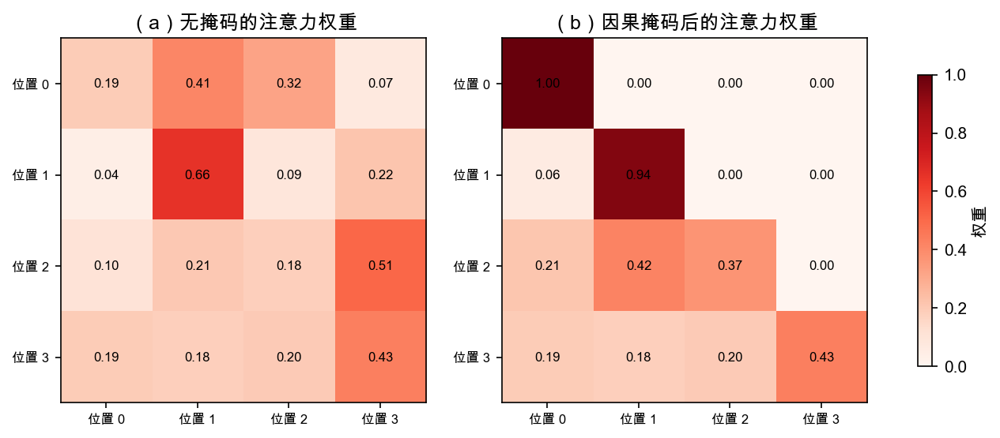
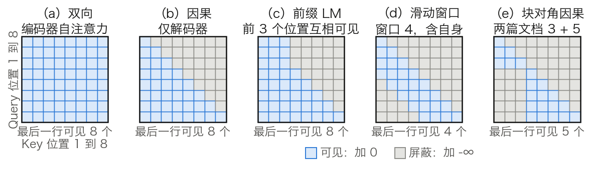

## 2.4 自注意力、交叉注意力与因果掩码

2.1 到 2.3 节里的 Q、K、V 始终由同一个输入矩阵 $$X$$ 投影而来，多头切分的也只是 $$d_{\text{model}}$$ 这一个维度；至于键值取自哪个序列、哪些位置允许被看见，此前一直默认“同一个序列、全部可见”。本节换的正是这另一条坐标轴，并说明因果掩码换来的两样东西：训练时的并行，和推理时的可缓存。

### 2.4.1 自注意力：序列内部的信息交互

**自注意力**（Self-Attention）指 Q、K、V 全部来自同一个序列。每个位置既提问，也提供用于匹配的键和被读走的内容。

它的核心能力是建立序列内部的任意距离依赖。以“猫坐在垫子上，因为它很软”为例，“它”的查询向量与“猫”“垫子”的键向量各自打分，指代关系由分数决定，与两者相隔多远无关。

在 Transformer 编码器中，自注意力是全双向的：每个位置可以关注任意其他位置。这使编码器能用完整上下文构建每个位置的表示。

有一点要先记下：不加掩码的自注意力对输入顺序是置换等变的，打乱输入的行序，输出只是跟着换行（推导见 [3.3.1 节](../03_components/3.3_position_encoding.md)）。顺序信息靠位置编码带入（见[第四章](../04_position_encoding/README.md)），可见范围靠掩码规定，两者是不同的机制。下一小节的因果掩码正是打破置换等变的那个例外。

### 2.4.2 因果掩码：遮住未来换来了什么

自回归生成中，第 $$t$$ 个词元只能依据前 $$t-1$$ 个词元预测。但自注意力默认是全连接的：训练时若不加限制，预测第 $$t$$ 个词元的位置会直接读到第 $$t$$ 个词元本身，任务退化为复制。

**因果掩码**（Causal Mask）把分数矩阵的上三角置为 $$-\infty$$：

$$\text{Mask}_{ij} = \begin{cases} 0 & \text{if } j \leq i \\ -\infty & \text{if } j > i \end{cases}$$

加到缩放后的分数上，再做 Softmax：

$$A = \text{softmax}\left(\frac{QK^T}{\sqrt{d_k}} + \text{Mask}\right)$$

由于 $$e^{-\infty} = 0$$，被屏蔽的位置权重为零，既不进入行和，也读不到任何内容。训练时解码器输入整体右移一位，位置 $$i$$ 读到的是已给定的前缀，预测目标是下一个词元。

遮住未来不只是为了不作弊，它还换来两样东西，仅解码器架构能胜出主要靠这两条。

**收益一：一次前向产生 $$n$$ 个训练信号。** 一条长 $$n$$ 的序列送进模型，每个位置都算出“下一个词元”的分布，于是一次前向同时得到 $$n$$ 个预测的损失。这等价于用 $$n$$ 个前缀各做一次预测，计算却只做一遍。没有掩码则只有两条路：要么泄漏答案，要么真的跑 $$n$$ 次。

**收益二：旧位置的 K、V 永不改变。** 位置 $$i$$ 的键和值只由位置 $$1$$ 到 $$i$$ 的内容算出，追加新词元不会改变它们，因此可以存下来复用，这就是 KV 缓存（见 [3.8.5 节](../03_components/3.8_gpt_inference_flow.md)与 [10.2 节](../10_inference_optimization/10.2_kv_cache.md)）。双向注意力没有这个性质：新词元会改变所有旧位置的表示，缓存无从谈起。

下面的代码展示因果掩码的实现，`torch.triu` 造出上三角，`masked_fill` 把它填成 $$-\infty$$：

```python
import torch
import torch.nn.functional as F
import math

seq_len, d_k = 4, 8
torch.manual_seed(42)
Q = torch.randn(seq_len, d_k)
K = torch.randn(seq_len, d_k)
V = torch.randn(seq_len, d_k)

# 计算原始注意力分数并缩放
scores = torch.matmul(Q, K.transpose(-2, -1)) / math.sqrt(d_k)
print("缩放后注意力分数:\n", scores.round(decimals=3))

# 生成因果掩码：上三角部分填充 -inf
mask = torch.triu(torch.ones(seq_len, seq_len), diagonal=1).bool()
scores_masked = scores.masked_fill(mask, float('-inf'))
print("应用因果掩码后:\n", scores_masked.round(decimals=3))

# Softmax 后，-inf 位置的权重变为 0
attn_weights = F.softmax(scores_masked, dim=-1)
print("注意力权重（未来位置权重为 0）:\n", attn_weights.round(decimals=3))

# 验证：位置 0 只关注自己，位置 3 关注所有位置
print("位置 0 的非零权重数:", (attn_weights[0] > 0).sum().item())  # 1
print("位置 3 的非零权重数:", (attn_weights[3] > 0).sum().item())  # 4
```

上述代码的输出结果如下：

```text
缩放后注意力分数:
 tensor([[-2.0540, -1.3070, -1.5420, -3.0560],
        [-1.2510,  1.5270, -0.5000,  0.4230],
        [-1.0700, -0.3880, -0.5080,  0.5160],
        [-0.5580, -0.6240, -0.5440,  0.2480]])
应用因果掩码后:
 tensor([[-2.0540,    -inf,    -inf,    -inf],
        [-1.2510,  1.5270,    -inf,    -inf],
        [-1.0700, -0.3880, -0.5080,    -inf],
        [-0.5580, -0.6240, -0.5440,  0.2480]])
注意力权重（未来位置权重为 0）:
 tensor([[1.0000, 0.0000, 0.0000, 0.0000],
        [0.0590, 0.9410, 0.0000, 0.0000],
        [0.2110, 0.4180, 0.3710, 0.0000],
        [0.1930, 0.1800, 0.1950, 0.4320]])
位置 0 的非零权重数: 1
位置 3 的非零权重数: 4
```

**用这组数字验证收益二。** 第 3 行（即上面代码输出里的位置 2）的权重是 `[0.211, 0.418, 0.371, 0]`。它只由 $$q_3$$ 与 $$k_1$$ 到 $$k_3$$ 决定：对 `[-1.070, -0.388, -0.508]` 取指数得 `[0.343, 0.678, 0.602]`，行和 1.623，逐项相除即得这三个数。如果只把前 3 个词元送进模型，算出来的最后一行一模一样。Decode 每轮只算一行，结果与把整条序列重算一遍完全相同，依据就在这里。

把掩码前后的权重并排画成热力图，下三角结构一目可见。



图 2-4：因果掩码前后的注意力权重热力图对比（[生成脚本](https://github.com/yeasy/llm_internals/blob/main/tools/figures/causal_mask_heatmap.py)）。左图每一行的权重分布在全部 4 个位置上；右图右上角全为零，位置 0 的权重全部集中在自身。

### 2.4.3 掩码的实现细节与两个陷阱

掩码是**加**在分数上，不是乘在权重上。先做 Softmax 再把未来位置乘 0，行和就不再是 1，等于悄悄改变了各位置的相对权重；加 $$-\infty$$ 则让被屏蔽的项从指数和里彻底消失，剩下各项仍然归一。

两个实际陷阱值得记住。

**半精度下常用 `finfo(dtype).min` 代替 $$-\infty$$。** Hugging Face 的掩码工具就是把布尔掩码转成“可见处为 0.0、屏蔽处为 `torch.finfo(dtype).min`”的浮点掩码再相加。用有限的极小值而非 $$-\infty$$，是为了避免后续算子在半精度下遇到 `inf` 时产生 `NaN`。

**整行被遮住会得到 NaN。** 一行分数若全是 $$-\infty$$，指数全为 0，行和为 0，Softmax 变成 0 除以 0。左填充序列里填充位置自己的那一行正是这种情形：它前面没有任何可见位置。这是批量推理里“损失突然变成 NaN”的常见原因，对策要么保证每行至少一个可见位置，要么用有限极小值让分数仍可归一。

还有一笔浪费值得知道。朴素实现先算满 `[n, n]` 再遮掉上三角，被丢弃的有 $$n(n-1)/2$$ 格，$$n = 1024$$ 时占 49.95%，接近一半的乘法白做。融合内核不这样做：给定 `is_causal=True`，它直接跳过整块被遮住的分块。因此 3.8.7 与 [2.5.1 节](2.5_complexity_limits.md)在数因果注意力的 FLOPs 时都已折半。传入显式下三角掩码与设置 `is_causal=True` 在数学上等价，但能否走到跳块的快路径可能不同。

### 2.4.4 交叉注意力：两个序列之间的桥梁

**交叉注意力**（Cross-Attention）中，Q 来自目标序列，K、V 来自另一个序列（通常是编码器最后一层的输出）。它是编码器-解码器架构的连接点。

形状是它与自注意力最明显的区别。设目标序列长 $$m$$、源序列长 $$n$$：`Q[m, d_k] × Kᵀ[d_k, n] → 分数[m, n]`，再 `[m, n] × V[n, d_v] → [m, d_v]`。分数矩阵不是方阵，代价为 $$O(mnd)$$，而且通常不加因果掩码——源序列是已知的完整输入，目标位置读取它的任何部分都不算偷看。

实现上有一条重要性质：源序列的 K、V 在整个生成过程中不变，可以只算一次并一直缓存。自注意力的 KV 缓存每轮追加一行，交叉注意力的缓存则是一次写入、只读到底。

今天它的主要去处是编码器-解码器模型，以及把非文本模态编码后交给语言模型的多模态结构（见 [14.4 节](../14_future_trends/14.4_multimodal.md)）。仅解码器模型不需要它：源内容被直接拼进同一条序列，由同一套自注意力读取，代价是源内容也占用上下文长度。

### 2.4.5 三种注意力在 Transformer 中的位置

| 注意力类型 | 所在位置 | Q 来源 | K/V 来源 | 掩码 |
|-----------|---------|-------|---------|------|
| 自注意力 | 编码器 | 编码器输入 | 编码器输入 | 无（或填充掩码） |
| 掩码自注意力 | 解码器每层的第一个子层 | 解码器输入 | 解码器输入 | 因果掩码 |
| 交叉注意力 | 解码器每层的第二个子层 | 解码器状态 | 编码器输出 | 无（或填充掩码） |

表 2-9：三种注意力的位置、来源与掩码。仅解码器模型（如 GPT 系列）只用掩码自注意力，仅编码器模型（如 BERT）只用全双向自注意力；三种架构变体的取舍见 [3.7.4 节](../03_components/3.7_full_architecture.md)与 [5.3.3 节](../05_pretraining/5.3_encoder_decoder.md)。

### 2.4.6 填充掩码：遮的是列，不是行

批处理要求同批序列等长，较短的序列用填充词元补齐。**填充掩码**（Padding Mask）把指向填充位置的分数设为 $$-\infty$$，使真实位置读不到填充内容。

要点是它遮的是**列**：不让别人读填充位。填充位自己那一行照常计算，输出是垃圾，靠损失掩码丢弃即可，不必也不该整行屏蔽——整行屏蔽正是上面 NaN 的来源。

实现上，`attention_mask` 通常是 `[B, T]` 的 0/1 张量，广播成 `[B, 1, T, T]` 后与因果掩码相加。两张掩码是逻辑与的关系：一个位置要可见，必须既在因果范围内，又不是填充位。

生成时还有一条容易踩的坑：仅解码器模型批量生成必须**左填充**。右填充会把填充词元排在真实内容之后，于是“最后一个位置”不再是真实的最后一个词元，位置索引也整体错位。Hugging Face 的分词器用 `padding_side="left"` 设置，细节与图示见 [9.1 节](../09_decoding/9.1_autoregressive_decode.md)。

### 2.4.7 序列打包与文档掩码

预训练几乎不会让一条序列只装一篇短文档，那样填充会浪费大量算力。常见做法是把多篇文档首尾相接，拼满固定长度。纯因果掩码此时有漏洞：后一篇文档的位置可以读到前一篇的内容，而两者毫无关系。

对策是块对角因果掩码：在因果条件之外再加一条“同属一篇文档”。Llama 3 明确采用了这一做法，[其论文](https://arxiv.org/abs/2407.21783)写明使用一种掩码来阻止同一条序列内不同文档之间的自注意力。论文同时指出，该改动在标准预训练中影响有限，在超长序列的继续预训练中则很重要。

只重置 `position_ids` 是不够的。重置位置索引只改变位置编码，不改变可见性；注意力分数仍会在文档之间产生非零权重。真正阻断依赖的是掩码本身。

实现上，变长打包通常不显式构造这张 `[n, n]` 矩阵。FlashAttention 的变长接口 `flash_attn_varlen_func` 用 `cu_seqlens` 表达边界：把各条序列长度的前缀和传进去，内核按段处理，天然不会跨段打分。这样既省掉掩码矩阵的显存，也省掉被遮住那些块的计算。相关训练细节见 [6.4 节](../06_training_techniques/6.4_batch_sequence.md)。

### 2.4.8 掩码家族一览

因果、双向、前缀 LM、滑动窗口、块对角，本质是同一张 `[T, T]` 的 0/$$-\infty$$ 矩阵，区别只在哪些格子被置为 $$-\infty$$。图 2-5 把五种并排画出。



图 2-5：五种掩码都是同一张 `[T, T]` 矩阵（[生成脚本](https://github.com/yeasy/llm_internals/blob/main/tools/figures/ch02_mask_family.py)）。行是 Query 位置，列是 Key 位置，深色格表示被屏蔽。

| 掩码 | 规则 | 最后一行可见数（$$T = 8$$） | 典型使用者 |
| --- | --- | ---: | --- |
| 双向 | 全部可见 | 8 | BERT 等仅编码器模型（见 [12.1 节](../12_encoder_models/12.1_bert.md)） |
| 因果 | $$j \leq i$$ | 8 | GPT 等仅解码器模型 |
| 前缀 LM | 前缀内部互相可见，前缀之后按因果 | 8 | [UniLM](https://arxiv.org/abs/1905.03197) 的序列到序列目标等（见 [5.3.5 节](../05_pretraining/5.3_encoder_decoder.md)） |
| 滑动窗口 | $$i - w < j \leq i$$ | 4（$$w = 4$$） | Longformer（见 [12.3 节](../12_encoder_models/12.3_longformer_bigbird.md)）、Mistral、长上下文混合结构（见 [14.7 节](../14_future_trends/14.7_long_context.md)） |
| 块对角因果 | 因果且同属一段 | 5（第二段长 5） | 打包预训练、多请求拼批 |

表 2-10：掩码家族的规则与使用者。滑动窗口把每行的可见数从 $$O(n)$$ 压到常数 $$w$$，计算量随之从 $$O(n^2)$$ 降到 $$O(nw)$$，代价是超出窗口的依赖要靠层数堆叠或少量全局位置来补。前缀 LM 一行容易与编码器-解码器混淆：T5 论文把两者并列为不同的架构变体做对照，T5 自身是编码器-解码器。它的编码器用双向掩码、解码器用因果掩码，两者由交叉注意力相连，不是这里的单张 `[T, T]` 矩阵。

下一节把这些形状换算成时间和显存，看长上下文究竟贵在哪里。
