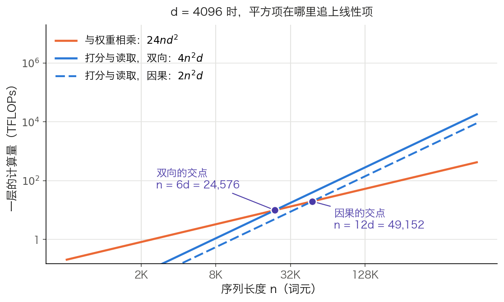

## 2.5 注意力的代价：复杂度与局限

前四节讲的是注意力怎样工作、为什么这样设计。本节算它的账：一层要做多少次运算、显存里存了什么、长上下文从多长开始变贵，以及除复杂度之外，Softmax 注意力还有哪些绕不开的固有局限。

### 2.5.1 一层要算多少、存多少

注意力里只有两次矩阵乘法的两个操作数都是数据：打分 $$QK^\top$$ 和读取 $$AV$$。

- **打分**：`Q[n, d_k] × Kᵀ[d_k, n] → S[n, n]`，约 $$2n^2 d_k$$ 次浮点运算。
- **读取**：`A[n, n] × V[n, d_v] → [n, d_v]`，约 $$2n^2 d_v$$ 次。

按 [3.7.7 节](../03_components/3.7_full_architecture.md)与 [3.8.7 节](../03_components/3.8_gpt_inference_flow.md)的惯例，一次 `[a, b] × [b, c]` 的矩阵乘法记作约 $$2abc$$ 次运算。把各个头合起来（$$n_h \times d_h = d$$），这两步合计约 $$4n^2 d$$；因果掩码下只需算下三角，折半为 $$2n^2 d$$。

同一层里与权重相乘的部分是另一笔账：Q/K/V 投影 $$6nd^2$$、输出投影 $$2nd^2$$、MLP 的两个矩阵 $$16nd^2$$，合计约 $$24nd^2$$，随词元数线性增长。于是一层的总账是

$$\underbrace{24nd^2}_{\text{与权重相乘}} + \underbrace{2n^2d}_{\text{打分与读取，因果}}$$

两项在 $$n = 12d$$ 时相等（双向注意力为 $$n = 6d$$），与 3.7.7 和 3.8.7 给出的门槛一致。

**显存里存的是分数矩阵，而且训练时必须留着。** 前向算出的 $$A = \text{softmax}(S')$$ 有 $$n^2$$ 个数，每层每个头各一张。反向传播绕不开它：记这一步的输出为 $$C = AV$$，则值的梯度是 $$\partial L/\partial V = A^\top \, \partial L / \partial C$$，直接用到 $$A$$；分数的梯度经过 Softmax 的雅可比（见 [2.2.3 节](2.2_scaled_dot_product.md)），写成逐行形式 $$\partial L/\partial S' = A \odot \left(\partial L/\partial A - \text{rowsum}(\partial L/\partial A \odot A)\right)$$，同样只用 $$A$$ 和上游梯度。拿到 $$\partial L/\partial S'$$ 之后，查询与键的梯度各是一次矩阵乘法：`∂S'[n, n] × K[n, d_k] → ∂Q[n, d_k]`，`∂S'ᵀ[n, n] × Q[n, d_k] → ∂K[n, d_k]`，都再除以 $$\sqrt{d_k}$$。四个梯度里有两个直接含 $$A$$，另两个经 $$\partial L/\partial S'$$ 间接依赖它，所以朴素实现在前向时把这张 `[n, n]` 矩阵写进显存，反向时再读回来。

代入一个真实规模：GPT-3 6.7B 的配置（32 层、32 个头），序列长 4,096，FP16，批大小 1。

- 一层所有头的分数矩阵：`32 × 4096² × 2 B = 1,073,741,824 B`，正好 1 GiB。
- 32 层合计 32 GiB。

这还只是一条序列。批大小翻倍，这笔显存也翻倍，而模型权重不变。FlashAttention 针对的正是这一项：它不保存 `[n, n]`，反向时按块重算，用计算换显存和访存（见 [10.3 节](../10_inference_optimization/10.3_flash_attention.md)）；同样的“存还是重算”取舍在 [7.5 节](../07_distributed_training/7.5_activation_checkpointing.md)有系统的讨论。

### 2.5.2 与其他架构的复杂度对比

表 2-11 沿用原论文表 1 的口径。$$n$$ 是序列长度，$$d$$ 是表示维度，$$k$$ 是卷积核宽度，$$r$$ 是受限自注意力的邻域大小。

| 架构 | 单层计算量 | 顺序操作数 | 最长路径 |
|------|-----------|-----------|-------------|
| 自注意力 | $$O(n^2 \cdot d)$$ | $$O(1)$$ | $$O(1)$$ |
| 循环层 | $$O(n \cdot d^2)$$ | $$O(n)$$ | $$O(n)$$ |
| 卷积层 | $$O(k \cdot n \cdot d^2)$$ | $$O(1)$$ | $$O(\log_k n)$$ |
| 受限自注意力 | $$O(r \cdot n \cdot d)$$ | $$O(1)$$ | $$O(n/r)$$ |

表 2-11：四种层的复杂度对比，取自[原论文](https://arxiv.org/abs/1706.03762)表 1。“最长路径”指任意两个位置之间信息传递所经过的最短路径的上界，前向与反向都适用：路径越短，长距离依赖越容易学。最后一行的受限自注意力就是今天滑动窗口注意力的源头，它用 $$O(n/r)$$ 的路径长度换来了对 $$n$$ 的线性复杂度。

真正的取舍在前三行：自注意力用平方的计算量买到了 $$O(1)$$ 的路径和完全并行；循环层计算省、但顺序依赖使它无法在序列维度上并行。Transformer 比 RNN 快，主因是顺序操作数从 $$O(n)$$ 降到 $$O(1)$$，不是单层 FLOPs 更少。

原论文确实提过“当 $$n < d$$ 时自注意力比循环层更快”，但它给的限定是机器翻译中的句子级表示，即几十个词元配 $$d = 512$$。这个前提今天不成立：上下文动辄 8K 到 128K 以上，而 $$d$$ 仍在 4,096 到 16,384 之间，$$n$$ 远大于 $$d$$。

### 2.5.3 平方项从多长开始主导

把 2.5.1 的两项相除，就得到“平方项占线性项的比例”，它只取决于 $$n / d$$。取 $$d = 4096$$：

| 序列长度 $$n$$ | 单头分数矩阵元素数 | 单头 FP16 显存 | 平方项占比（双向） | 平方项占比（因果） |
|---------:|---------:|---------:|---------:|---------:|
| 512 | 262,144 | 0.5 MiB | 2.1% | 1.0% |
| 2,048 | 4,194,304 | 8 MiB | 8.3% | 4.2% |
| 8,192 | 67,108,864 | 128 MiB | 33.3% | 16.7% |
| 32,768 | 1,073,741,824 | 2 GiB | 133.3% | 66.7% |
| 131,072 | 17,179,869,184 | 32 GiB | 533.3% | 266.7% |

表 2-12：$$d = 4096$$ 时，注意力的平方项相对一层线性项的比例，以及单个头的分数矩阵显存。占比按 $$4n^2d \div 24nd^2 = n / (6d)$$ 算出，因果掩码下再折半。显存列是单层单头的数值，整层整模型要再乘头数和层数（见 2.5.1）。[3.7.7 节](../03_components/3.7_full_architecture.md)的表 3-13 用的是另一个分母（注意力项占一层总计算量），同一长度下数值略小，$$n = 8{,}192$$ 时为 14.3%。

这张表比“计算量增长 65,536 倍”更有用。从 512 增长到 131,072 确实是 65,536 倍，但那只是平方项自己的倍数；决定实际耗时的是它与线性项的相对大小。在 2K 上下文上，注意力的打分与读取只占一层的百分之几，瓶颈在 MLP 和投影；到 32K 以上，它才成为主导项。图 2-6 把两条线画在一起。

图 2-6：$$d = 4096$$ 时，一层中线性项与平方项的交点（[生成脚本](https://github.com/yeasy/llm_internals/blob/main/tools/figures/ch02_flops_crossover.py)）。橙色是与权重相乘的部分，蓝色是打分与读取；双向注意力在 $$n = 6d = 24{,}576$$ 处交叉，因果注意力在 $$n = 12d = 49{,}152$$ 处交叉。

顺带纠正一个常见说法：早期模型把长度限制在 512 或 1024，主因是训练成本和学习式绝对位置嵌入的固定表长，不是硬件上算不动。$$n = 1024$$、$$d = 768$$ 时，单头分数矩阵在 FP16 下只有 2 MiB。

### 2.5.4 推理时的另一笔账

上面都是训练与 Prefill 的视角。有了 KV 缓存，Decode 的每一轮只有新位置这一行 Query，账完全不同：

- 没有 `[n, n]` 矩阵，只有 `[1, s]` 的一行分数，$$s$$ 是当前总长度。
- 打分与读取每层约 $$4sd$$ 次运算，对 $$s$$ 是线性的。
- 与权重相乘的部分退化为每层 $$24d^2$$，与 $$s$$ 无关。

代入 $$d = 4096$$：$$s = 1000$$ 时，每层打分与读取约 $$1.6 \times 10^7$$ 次，只有权重部分 $$4.0 \times 10^8$$ 次的 4%；$$s = 131{,}072$$ 时前者升到 $$2.1 \times 10^9$$ 次，反超后者 5 倍。

但 Decode 的真正约束不是这些运算，而是把 KV 缓存从显存搬出来的带宽，以及它占掉的容量。按 [2.3.7 节](2.3_multi_head.md)的算法，Llama 3 8B 每个词元要存 128 KiB；128K 的上下文即 `131,072 个词元 × 128 KiB = 16 GiB`，一个请求就吃掉一张卡的大半显存。这条线索由 [10.1 节](../10_inference_optimization/10.1_bottleneck.md)和 [10.2 节](../10_inference_optimization/10.2_kv_cache.md)接手。

### 2.5.5 复杂度之外的四条局限

平方复杂度是工程问题，下面四条是 Softmax 注意力的结构性质，换硬件解决不了。

**其一，不含顺序。** 不加掩码时自注意力置换等变，顺序必须由位置编码补上（见 [3.3.1 节](../03_components/3.3_position_encoding.md)）。这既是代价，也给了位置编码可替换的空间，第四章整章都在这条缝隙上展开。

**其二，行和必须为 1，没有“谁都不看”的选项。** Softmax 强制每一行权重加起来等于 1。某个头在当前这一步确实无事可看时，它仍必须把这份权重倒到某处。模型学到的解法是倒给位置固定、语义无害的地方，通常是序列开头的几个词元，这就是**注意力汇**（attention sink）。[StreamingLLM](https://arxiv.org/abs/2309.17453) 据此提出：流式推理时保留最靠前的少量词元的 KV（实验中 4 个即够），再配上最近的窗口，困惑度就能稳住；只留最近窗口则会突然退化。这条线索详见 [14.7 节](../14_future_trends/14.7_long_context.md)。

**其三，长度稀释。** 同样的分数优势，候选越多权重越小。按 [2.2.4 节](2.2_scaled_dot_product.md)的算例，领先 5 个单位的位置在 $$n = 512$$ 时权重 0.225，在 $$n = 131{,}072$$ 时只剩 0.001。长上下文里注意力分布天然变平，这是“大海捞针”类任务变难的机制来源之一。

**其四，纯注意力堆叠会秩坍缩。** [一项理论分析](https://arxiv.org/abs/2103.03404)证明：去掉残差连接与 MLP 的纯自注意力网络，其输出随深度以双指数速度收敛到秩 1 的矩阵，各行趋同；而残差连接与 MLP 恰好阻止了这种退化。这说明残差和 MLP 不是可有可无的配件，而是让深层注意力网络仍有表达力的必要条件（见 [3.5 节](../03_components/3.5_residual.md)）。

此外，[2.3.6 节](2.3_multi_head.md)已经给出两条与头有关的局限：多数头可剪，以及注意力权重不能直接当作解释。

### 2.5.6 应对平方复杂度的四类思路

| 思路 | 代表 | 是否精确 | 计算复杂度 | 显存 | 主要代价 |
| --- | --- | --- | --- | --- | --- |
| 稀疏注意力 | Longformer、BigBird | 否 | $$O(n \cdot w)$$ | $$O(n \cdot w)$$ | 窗口外的依赖要靠全局词元或层数补 |
| 线性注意力 | Performer、Linear Transformer | 否 | $$O(n)$$ | $$O(n)$$ | 精确检索能力弱于 Softmax 注意力，详见 [14.1 节](../14_future_trends/14.1_efficient_attention.md) |
| IO 感知 | FlashAttention | **是** | 仍是 $$O(n^2)$$ | $$O(n)$$ | 只省显存与访存，不省运算 |
| 替代架构 | Mamba 等状态空间模型 | 否 | $$O(n)$$ | 推理时状态固定 | 状态容量固定，长程精确回忆受限 |

表 2-13：四类思路的取舍。最需要分清的是第三行：FlashAttention 不改变注意力的数学定义，也不降低计算复杂度，它避免的是把 `[n, n]` 矩阵写回显存再读回来。把它说成“解决了平方复杂度”是常见误读。Longformer 的复杂度写作 $$O(n)$$ 时省略了窗口宽度 $$w$$，严格说是 $$O(n \cdot w)$$。

这四类方向在[第十章](../10_inference_optimization/README.md)和[第十四章](../14_future_trends/README.md)展开。值得留意的是它们的分工：稀疏与线性改的是注意力的定义，IO 感知改的是实现，替代架构则换掉整个算子。
