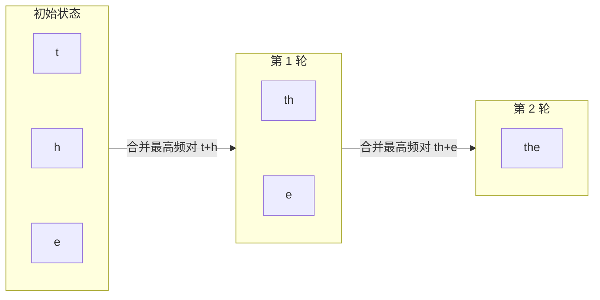

## 3.1 分词：从文本到词元

上一章介绍了注意力机制如何对向量序列进行全局信息交互。但在注意力能够发挥作用之前，文本必须先被转化为数值向量。这个过程的第一步不是词嵌入，而是**分词**（Tokenization）——将原始文本切分为模型可以处理的基本单元，即**词元**（Token）。分词策略的选择直接影响模型的词汇覆盖率、序列长度和多语言能力。

### 3.1.1 为什么分词是必要的

神经网络只能处理数值，不能直接理解文字。因此需要一个从文本到数字的映射过程。最朴素的方案是**字符级分词**（逐字符处理）或**词级分词**（以空格分隔），但两者都有明显缺陷：

- **字符级分词**：词汇表极小（如英文仅 26 个字母），但序列变得极长，模型需要更多的计算才能捕获语义
- **词级分词**：语义清晰，但词汇表庞大（英文数十万词），且无法处理未登录词（Out-of-Vocabulary，OOV）——遇到训练时未见过的词时，只能用 `[UNK]` 替代，导致信息丢失

现代 LLM 普遍采用**子词分词**（Subword Tokenization），在字符级和词级之间取得平衡：常见词保持完整（如 “the”、“模型”），罕见词则被拆分为有意义的子词片段（如 “tokenization” → “token” + “ization”）。

### 3.1.2 字节对编码：从数据中学习分词规则

**字节对编码**（Byte Pair Encoding，BPE）是最广泛使用的子词分词算法，GPT 系列、Llama 等主流模型均采用此方案。其核心思想是**从字符开始，不断合并最频繁出现的相邻序列**：

1. 初始化词汇表为所有单个字符（或字节）
2. 统计训练语料中所有相邻词元对的出现频率
3. 将频率最高的词元对合并为一个新词元，加入词汇表
4. 重复步骤 2-3，直到词汇表达到预设大小

例如，在英文语料中，字母对 “t” + “h” 可能被高频合并为 “th”，随后 “th” + “e” 合并为 “the”。这种数据驱动的方式自动发现了语言中的常见模式。

BPE 的关键优势在于彻底解决 **未登录词（Out-of-Vocabulary, OOV）问题”**：当遇到不在词汇表中的罕见词或新词时，BPE 会将其递归拆解为更短的已知子词，极端情况下甚至回退到单个字符级表示。这种机制确保模型能处理任意输入文本，避免了使用 `[UNK]` 标记导致的信息丢失。

下图展示了 BPE 对单词“the”的合并过程：

图 3-1：BPE 从字符级逐步合并为完整子词的迭代过程

### 3.1.3 主流分词器实现

不同的分词器实现在 BPE 基础上做出了不同的工程选择：

**SentencePiece** 是 Google 开发的语言无关分词工具，Llama 和 T5 等模型使用它。它的特点是直接在原始文本上操作（不依赖预分词的空格切分），对中文、日文等无空格分隔的语言尤为友好。SentencePiece 将空格视为特殊字符“▁”编码到词元中，使得分词结果可以无损还原为原始文本。

**Tiktoken** 是 OpenAI 为 GPT 系列开发的高性能分词器。它使用字节级 BPE（Byte-level BPE），以 UTF-8 字节而非 Unicode 字符为基本单元。这意味着词汇表的基础单元只有 256 个字节，天然支持任何语言和特殊符号。Tiktoken 的实现采用 Rust 编写，分词速度比纯 Python 实现快数十倍。

**WordPiece** 是 BERT 使用的分词算法，与 BPE 类似但合并策略不同：BPE 选择频率最高的词元对，WordPiece 则选择使语言模型似然最大化的词元对。未知子词以 “##” 前缀标记（如 “playing” → “play” + “##ing”）。

**Unigram** 是 SentencePiece 支持的另一种核心算法，与 BPE 的“自底向上合并”策略相反，Unigram 采用“自顶向下裁剪”的方式：从一个大词汇表出发，迭代地移除对整体似然影响最小的词元，直到词汇表缩小到目标大小。Unigram 的一个优势是它可以为同一输入提供多种分词方案及其概率，有助于训练时的正则化。

### 3.1.4 词表大小的权衡

词汇表大小是一个关键的设计决策，直接影响模型的多个方面：

| 词表大小 | 优势 | 劣势 |
|---------|------|------|
| 较小（如 32K） | 嵌入层参数少，训练效率高 | 序列更长，推理成本增加 |
| 较大（如 128K） | 序列更短，语义完整性更好 | 嵌入层参数膨胀，稀有词元训练不充分 |

GPT-2 使用 50,257 个词元，GPT-4 扩展到约 100K，Llama 3 进一步扩大到 128K。**词表扩大的趋势**反映了对多语言支持和语义完整性的追求——更大的词表意味着中文等非拉丁语系的文字更可能被编码为完整词元而非被拆分为多个字节，从而提高这些语言的处理效率。

### 3.1.5 特殊词元

分词器还需要定义一组**特殊词元**（Special Tokens）来标记序列的结构信息：

- `[BOS]` / `<s>`：序列开始标记
- `[EOS]` / `</s>`：序列结束标记，模型生成此词元时停止解码
- `[PAD]`：填充标记，将不同长度的序列对齐到相同长度
- `[SEP]`：分隔标记，区分不同的输入段落（如 BERT 的句子对输入）
- `[MASK]`：掩码标记，用于掩码语言模型的预训练（如 BERT）

在对话模型中，还有系统提示、用户消息、助手回复等角色标记，用于区分对话中不同参与者的文本。这些特殊词元的设计看似琐碎，但对模型的正确运作至关重要。

分词完成后，每个词元被映射为一个整数 ID（在词汇表中的索引），然后通过下一节介绍的词嵌入层转化为连续向量表示。
