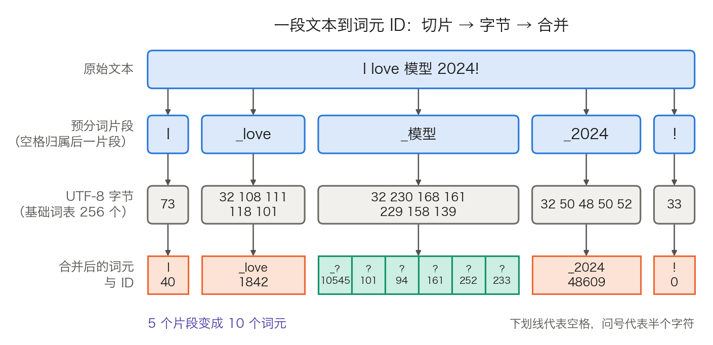

## 3.1 分词：从文本到词元

上一章介绍了注意力机制如何对向量序列进行全局信息交互。但在注意力能够发挥作用之前，文本必须先被转化为数值向量。这个过程的第一步不是词嵌入，而是**分词**（Tokenization）：将原始文本切分为模型可以处理的基本单元，即**词元**（Token）。

说得更具体些：第二章所有公式的起点都是 $$Q = XW^Q$$ 里的 $$X \in \mathbb{R}^{n \times d_{\text{model}}}$$，而 $$n$$ 由谁决定、$$X$$ 的每一行从哪里来，第二章始终没有交代。本节回答前半个问题：$$n$$ 是分词器切出的词元个数，它同时决定了序列长度、上下文占用与计费单位。

本节按四步展开：先说明为什么落在子词这一层，再手算一遍 BPE 的训练与编码，然后交代字节级与预分词这两个工程细节，最后算清词表大小的账并列出分词的典型失效情形。

### 3.1.1 为什么是子词

神经网络只能处理数值，因此需要一个从文本到整数的映射。两种朴素方案各有明确的代价。

**字符级分词**把每个字符当作一个词元。词表小，但序列极长；要覆盖全部 Unicode，基础词表本身也不小：[GPT-2 论文](https://cdn.openai.com/better-language-models/language_models_are_unsupervised_multitask_learners.pdf)指出，按码点建表会得到“a base vocabulary of over 130,000”，比常用的 32,000 到 64,000 大得多。

**词级分词**以空格切分，语义清晰，但词表庞大，且无法处理**未登录词**（Out-of-Vocabulary，OOV）：训练时未见过的词只能用 `[UNK]` 替代，信息丢失。中文、日文没有空格分隔，这一方案还需要额外的分词工具。

**子词分词**（Subword Tokenization）在两者之间取平衡：常见词保持完整，罕见词拆成已知片段（如 `tokenization` 切成 `token` 与 `ization`）。这一思路由 [Sennrich 等人 2015 年的工作](https://arxiv.org/abs/1508.07909)引入机器翻译，现已成为主流 LLM 的默认选择。

衡量分词好坏的第一个量是**压缩率**，即平均每个词元覆盖多少个字符。用 tiktoken 的 `cl100k_base` 实测一句 69 个字符的英文，得到 12 个词元，压缩率 5.75 字符/词元；同一句话的中文译文 24 个字符切出 28 个词元，压缩率只有 0.86。压缩率直接决定序列长度，而序列长度决定注意力的开销（见 [2.5 节](../02_attention/2.5_complexity_limits.md)）。

### 3.1.2 BPE 训练：一个可手算的三轮例子

**字节对编码**（Byte Pair Encoding，BPE）是最广泛使用的子词算法。训练过程只有一条规则：反复把语料中出现最频繁的相邻符号对合并成一个新符号。

用一份四个词的迷你语料演示，括号里是词频：`low`（5）、`lower`（2）、`newest`（6）、`widest`（3）。先把每个词拆成字符，并在词尾追加一个词尾标记 `</w>`，用来区分词内片段与词末片段。初始基础符号共 11 个：`</w> d e i l n o r s t w`。

第 1 轮统计全部相邻对。语料里共 14 种相邻对，计数之和 79，逐项如表 3-1。

| 相邻对 | 计数 | 来源 |
| --- | ---: | --- |
| `e`+`s` | 9 | newest 6 + widest 3 |
| `s`+`t` | 9 | newest 6 + widest 3 |
| `t`+`</w>` | 9 | newest 6 + widest 3 |
| `w`+`e` | 8 | lower 2 + newest 6 |
| `l`+`o` | 7 | low 5 + lower 2 |
| `o`+`w` | 7 | low 5 + lower 2 |
| `e`+`w` | 6 | newest 6 |
| `n`+`e` | 6 | newest 6 |
| `w`+`</w>` | 5 | low 5 |
| `d`+`e` | 3 | widest 3 |
| `i`+`d` | 3 | widest 3 |
| `w`+`i` | 3 | widest 3 |
| `e`+`r` | 2 | lower 2 |
| `r`+`</w>` | 2 | lower 2 |

表 3-1：迷你语料第 1 轮的全部相邻对计数。每一项等于包含该相邻对的词的词频之和：`e`+`s` 只出现在 `newest` 与 `widest` 中，故为 `6 + 3 = 9`。三对并列第一，取哪一对由实现的平局规则决定。

最高计数是 9，有三对并列。真实实现按一个固定次序打破平局，结果因实现而异；这里取 `e`+`s`。合并后语料变成 `l o w </w>`、`l o w e r </w>`、`n e w es t </w>`、`w i d es t </w>`。

第 2 轮重新计数。`es`+`t` 的计数是 9，与 `t`+`</w>` 并列第一，取前者，得到 `est`。第 3 轮 `est`+`</w>` 计数 9，独占第一，得到 `est</w>`。

三轮结束，**合并表**（merge table）按学到的先后顺序记为：`(e, s)`、`(es, t)`、`(est, </w>)`。词表则是 11 个基础符号加上这 3 个新符号。训练到此为止，模型此后再也不改这张表。

一个常被忽略的性质：合并表是**有序**的。同一份语料、不同的平局规则，会得到不同的表；表不同，同一个字符串的切分就不同。分词器与模型因此不可分离，见 3.1.8。

### 3.1.3 BPE 编码：合并表怎样切开一个新词

推理时给定一个新词，编码不是在词表里找最长匹配，而是**按合并表中的先后次序（rank）反复合并**。

用上表切 `lowest`。初始符号序列是 `l o w e s t </w>`。

1. 扫描全部相邻对，找出出现在合并表里、rank 最小的一对。`(e, s)` 的 rank 为 0，命中，合并为 `l o w es t </w>`。
2. 重新扫描。`(es, t)` 的 rank 为 1，命中，得到 `l o w est </w>`。
3. 再扫描。`(est, </w>)` 的 rank 为 2，命中，得到 `l o w est</w>`。
4. 剩余相邻对 `(l, o)`、`(o, w)`、`(w, est</w>)` 都不在表里，停止。

结果是 4 个词元：`l`、`o`、`w`、`est</w>`。注意 `l o w` 没有被合并成 `low`，尽管语料里 `low` 出现 5 次：那需要更多轮训练，而这里只训了 3 轮。

再切 `newer`。初始序列 `n e w e r </w>` 里，`(e, r)` 与 `(r, </w>)` 都不在合并表中，其余相邻对也不在，一次合并都做不了，结果是 6 个词元。同一份语料训出的表，对 `lowest` 压得很紧，对 `newer` 完全无效。

这解释了**词表更大 ≠ 每个词都更短**：合并表只压它见过的高频组合。

### 3.1.4 字节级与预分词：从 UTF-8 字节到词元

真实 GPT 类分词器在上述算法外加了两层工程处理。

**字节级：基础词表固定为 256。** BPE 的基础符号不取 Unicode 字符，而取 UTF-8 字节。GPT-2 论文的原话是“a byte-level version of BPE only requires a base vocabulary of size 256”。代价是非拉丁文字要先拆成多个字节：`模型` 是 2 个字符、6 个 UTF-8 字节；`大模型原理` 是 5 个字符、15 个字节。好处是任何输入都能表示，`[UNK]` 从根本上不再需要。

字节序列里有不可打印的值，直接放进词表文件不便阅读与处理。GPT-2 的分词器用一个 `bytes_to_unicode` 映射，把 256 个字节一一映射到 256 个可打印的 Unicode 字符，再在映射后的字符上跑 BPE。词表文件因此看起来全是可见字符，实质仍是字节。

**预分词：先用正则切片，再在片内合并。** 不做这一步，BPE 会把标点和空格一起合进词里。GPT-2 论文说明了动机：直接在字节上跑 BPE 会学出 `dog.`、`dog!`、`dog?` 等同一个词的多种变体，“This results in a sub-optimal allocation of limited vocabulary slots and model capacity”，因此“we prevent BPE from merging across character categories”。tiktoken 仓库的 `tiktoken_ext/openai_public.py` 收录了 GPT-2 原始发布所用的模式：

```text
's|'t|'re|'ve|'m|'ll|'d| ?[\p{L}]+| ?[\p{N}]+| ?[^\s\p{L}\p{N}]+|\s+(?!\S)|\s+
```

读法是：常见缩写单独成片；字母串、数字串、其他符号串各自成片；前导的一个空格归属**后面**那个片段。这就是 GPT 系列词元前常带一个空格的原因。

`cl100k_base` 起，数字一项改成了 `\p{N}{1,3}`：一个片段最多 3 位数字。这限制了合并能学出的数字词元，也直接影响算术表现，见 3.1.8。

图 3-1 把这条流水线走了一遍，片段与 ID 由 tiktoken 的 `gpt2` 编码实测。



图 3-1：一段文本怎样经预分词、字节化与合并变成词元 ID（[生成脚本](https://github.com/yeasy/llm_internals/blob/main/tools/figures/ch03_bpe_pipeline.py)）。蓝色是数据，橙色表示片段与词元一一对应，青绿色表示一个片段裂成了多个词元。图中 ID 取自 `gpt2` 编码：` 2024` 是一个词元（ID 48609），而 ` 模型` 的 7 个字节要 6 个词元。

**另一条路线：SentencePiece 的字节回退。** SentencePiece 在 Unicode 字符上建表，遇到词表外的字符时按 `byte_fallback` 退回字节，写成 `<0xE6>` 这样的词元。Llama 1/2 的词表里可以直接看到这 256 个字节词元。两条路线的效果接近，区别在于字节是基础单元还是兜底方案。

### 3.1.5 算法与库：不要混为一谈

“BPE、WordPiece、Unigram”是**算法**，“SentencePiece、tiktoken、HF tokenizers”是**库**。一个库可以实现多种算法，同一个算法也有多种实现。表 3-2 把两层分开。

| 名称 | 属于 | 关键做法 | 使用者 |
| --- | --- | --- | --- |
| BPE | 算法 | 每轮合并计数最高的相邻对 | GPT 系列、Llama 系列 |
| WordPiece | 算法 | 每轮合并使语言模型似然增加最多的一对；非词首片段加 `##` 前缀 | BERT |
| Unigram | 算法 | 从大词表出发，迭代删去对似然影响最小的词元；可给出多种切分及其概率 | T5 |
| SentencePiece | 库 | 直接在原始文本上训练，把空格编码为 `▁`，可无损还原；同时支持 BPE 与 Unigram | Llama 1/2 用其 BPE，T5 用其 Unigram |
| tiktoken | 库 | 字节级 BPE，Rust 实现，只做编码不做训练 | GPT 系列 |
| HF tokenizers | 库 | 把预分词、模型、后处理组织成流水线，产物是一个 `tokenizer.json` | 大量开源模型 |

表 3-2：分词的算法层与库层。SentencePiece 不是一种算法，把它与 WordPiece 并列会造成误解：Llama 1/2 用的是 SentencePiece 库里的 **BPE**，T5 用的是同一个库里的 **Unigram**。tiktoken 官方 README 的口径是“between 3-6x faster than a comparable open source tokeniser”，并非泛泛的“快数十倍”。

读一个真实分词器，核心是 `tokenizer.json` 里的四项：`model.vocab` 是词元到 ID 的映射；`model.merges` 是有序合并表，即 3.1.3 里的 rank 来源；`pre_tokenizer` 是 3.1.4 里的正则；`added_tokens` 是特殊词元及其 ID。tiktoken 一侧则按编码名组织，常见的有 `gpt2`、`cl100k_base`、`o200k_base`，其 `n_vocab` 实测分别为 50,257、100,277、200,019。

### 3.1.6 词表大小怎么算账

词表大小是一个可以两边都量化的取舍。

**代价一侧：参数。** 词表矩阵的形状是 `[V, d_model]`，与层数无关，但与词表大小成正比。Llama 3 8B 的 `vocab_size = 128256`、`hidden_size = 4096`，一份是 `128,256 × 4,096 = 525,336,576`；它的 `tie_word_embeddings` 为 `false`，输入与输出各一份，共 1,050,673,152 个参数。该模型总参数为 8,030,261,248（逐项账见 3.7.7），词表矩阵占 13.1%。Llama 2 7B 的词表只有 32,000，两份合计 262,144,000，占其 6,738,415,616 的 3.9%。

**代价二侧：LM head 的计算量。** 每生成一个词元，LM head 要做一次 `x[1, d] × W_vocab[d, V]`，约 `2 × d × V` 次浮点运算；整个前向约 `2N` 次（见 3.7.7）。两者之比：Llama 3 8B 为 6.54%，Llama 3 405B 只有 0.52%，而 GPT-2 small 高达 31.02%。词表在小模型上既吃参数也吃计算，在大模型上两项都可忽略。

**收益一侧：序列变短。** [Llama 3 论文](https://arxiv.org/abs/2407.21783)在介绍架构改动时写道，新分词器把英文样本上的压缩率“from 3.17 to 3.94 characters per token”，同时指出“This enables the model to 'read' more text for the same amount of training compute”。序列缩短约 20%，注意力的 `O(T²)` 项与 KV 缓存同比缩小。

结论是一条随规模变化的曲线：模型越小，大词表越不划算；模型越大，扩词表几乎白送。这也正是 3.7.6 里“小模型绑定权重、大模型不绑定”的量化依据。

### 3.1.7 特殊词元与聊天模板

分词器还要定义一组**特殊词元**（Special Tokens）标记序列结构。两套体系不要混用。

掩码语言模型一侧（BERT）：`[CLS]` 置于序列首，其输出用于分类；`[SEP]` 分隔句对；`[MASK]` 标记被掩盖的位置；`[PAD]` 补齐长度。

自回归一侧（GPT、Llama）：序列开始标记写作 `<s>` 或 `<|begin_of_text|>`；序列结束标记写作 `</s>`、`<|endoftext|>` 或 `<|eot_id|>`，模型选中它即停止解码。GPT-2 把开始与结束合用一个 ID 50256。

对话模型还要把角色写进词元序列，这就是**聊天模板**（chat template）：系统提示、用户消息、助手回复各有自己的起止标记。模板由分词器配置携带，而不是模型权重的一部分；模板错了，模型看到的是训练时没见过的格式。[3.8.2 节](3.8_gpt_inference_flow.md)给出了一条消息变成词元序列的完整例子。

停止词元还有一处工程含义：约束解码时的掩码必须覆盖 logits 的每一列，漏掉停止词元，模型就能在半截输出上结束（见 [11.7 节](../11_serving/11.7_constrained_decoding.md)）。

### 3.1.8 分词会在哪里出错

分词器训练与模型训练是两件分开做的事，接缝处会漏。

**故障词元。** 词表里存在、模型训练中几乎没见过的词元，其嵌入行停留在初始化附近，喂给模型会引出异常输出。[Land 等人 2024 年的工作](https://arxiv.org/abs/2405.05417)把这类词元称作 glitch token，原文把成因归结为“the disconnect between tokenizer creation and model training”，并给出了基于词表分析与权重指标的自动检测方法。低频词元的嵌入行为见 3.2.7。

**数字切分不固定。** 同一数值在不同上下文里切法不同。用 `cl100k_base` 实测：`1000` 切成 `100`/`0`，`1000000` 切成 `100`/`000`/`0`，`2024` 切成 `202`/`4`。`gpt2` 编码下 `10000` 是一个词元，而 `100000` 是 `100`/`000` 两个。模型要做加法，得先在这些不对齐的片段上把位值恢复出来，这是 3.8 节“教学模型不会算加法”之外、真实模型也常算错的上游原因之一。

**多语言词元税。** 同一句话在不同语言下的词元数相差数倍，直接换算成上下文占用与 API 计费。表 3-3 是同一句话的四种语言版本在三种编码下的实测结果。

| 语言 | 字符数 | UTF-8 字节 | `gpt2` | `cl100k_base` | `o200k_base` |
| --- | ---: | ---: | ---: | ---: | ---: |
| 英语 | 69 | 69 | 13 | 12 | 12 |
| 法语 | 86 | 88 | 31 | 23 | 21 |
| 日语 | 35 | 105 | 38 | 37 | 27 |
| 中文 | 24 | 72 | 52 | 28 | 18 |

表 3-3：同一句话的四种语言版本在三种 tiktoken 编码下的词元数，数值由 tiktoken 0.14.0 实测。中文从 `gpt2` 的 52 个词元降到 `o200k_base` 的 18 个，正是扩词表换来的收益；但即便如此，24 个汉字仍占 18 个词元，而 69 个英文字符只占 12 个。

**尾随空格。** Prompt 以空格结尾，会迫使模型从一个训练中罕见的切分点续写。实测 `The capital of France is` 的末词元是 ` is`，而 `The capital of France is ` 的末两个词元是 ` is` 与一个单独的空格词元。后者在训练语料里几乎不会紧跟一个实词，模型的续写分布因此偏移。

**分词器与模型不可分离。** 换分词器等于换词表，嵌入矩阵与 LM head 同时作废。给已有模型扩词表（如为中文补充词元）必须新增嵌入行并继续预训练，新行否则一直停在初始化值上，与故障词元同理。

分词完成后，每个词元成为一个整数 ID。下一节把这些 ID 换成向量。
