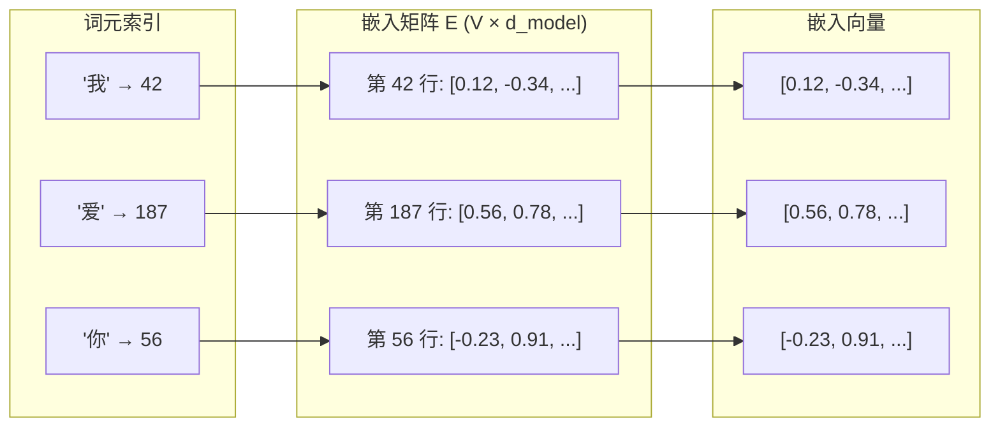

## 3.2 词嵌入：从离散符号到连续向量

Transformer 处理的是连续的数值向量，而自然语言是由离散的符号（字、词、子词）组成的。词嵌入（Word Embedding）是连接这两个世界的桥梁。

### 3.2.1 为什么需要词嵌入

计算机原生处理的是数字，而非符号。将词转化为数字最简单的方式是**独热编码**（One-Hot Encoding）：为词汇表中的每个词分配一个唯一的索引，用一个在该索引位置为 1、其余位置为 0 的向量表示。

独热编码有两个致命缺陷：

**维度灾难**：向量维度等于词汇表大小（通常数万到数十万），绝大部分是零，计算效率极低。

**语义缺失**：所有词两两正交，“猫”和“狗”的距离与“猫”和“飞机”的距离完全相同。独热编码不包含任何语义信息。

词嵌入的核心思想是：**将每个词映射为一个低维、稠密的实数向量，使得语义相近的词在向量空间中距离也相近。** 例如，“国王”和“女王”的嵌入向量应该比“国王”和“苹果”更接近。

### 3.2.2 词嵌入的思想溯源

“用向量表示词义”的思想并非 Transformer 的发明，它有深厚的历史渊源。

2013 年，Mikolov 提出的 **Word2Vec** 首次大规模验证了词嵌入的威力。它通过预测上下文（Skip-gram）或由上下文预测中心词（CBOW）的方式，在大规模语料上学习词向量。Word2Vec 揭示了词向量空间中令人惊叹的线性关系——例如 $\vec{\text{king}} - \vec{\text{man}} + \vec{\text{woman}} \approx \vec{\text{queen}}$。

随后，**GloVe**（2014 年）通过全局词共现矩阵的分解学习词向量，**FastText**（2016 年）则将子词信息引入词嵌入，使其能够处理未登录词。

Transformer 中的词嵌入与这些早期方法有一个关键区别：**早期词嵌入是静态的**——一个词无论出现在什么上下文中，其向量始终相同（“bank”在“河岸”和“银行”的语境下有相同的向量）。而 Transformer 的嵌入层只是**初始表示**，经过多层注意力和前馈网络后，每个词的表示会根据上下文动态调整，这就是所谓的**上下文化嵌入**（Contextualized Embedding）。

### 3.2.3 嵌入层的工作机制

如 [3.1 节](3.1_tokenization.md) 所述，分词器将文本转化为离散的词元索引构成的序列。在 Transformer 中，嵌入层的任务正是接收这些索引序列并转化为连续向量。嵌入层本质上是一个**查找表**（Lookup Table）。假设词汇表大小为 $V$，嵌入维度为 $d_{\text{model}}$，则嵌入矩阵 $E \in \mathbb{R}^{V \times d_{\text{model}}}$ 包含了每个词的嵌入向量。

给定词的索引 $i$，嵌入操作就是取出矩阵的第 $i$ 行：$\text{embed}(i) = E[i, :]$。这在数学上等价于用独热向量左乘嵌入矩阵，但实现上直接索引更高效。

下图展示了嵌入层的查找过程——每个词元索引直接对应嵌入矩阵中的一行向量：

图 3-2：嵌入层通过查找表将词元索引映射为稠密向量

嵌入矩阵是**可学习的参数**——在训练过程中，反向传播会调整每个词的嵌入向量，使其在上下文中更准确地表达该词的含义。

### 3.2.4 嵌入维度的选择

嵌入维度 $d_{\text{model}}$ 是模型的核心超参数，直接影响模型的表达能力和计算成本：

| 模型 | $d_{\text{model}}$ | 参数量 |
|------|---------------------|--------|
| Transformer base | 512 | 65M |
| BERT-base | 768 | 110M |
| GPT-2 | 768 | 1.5B |
| Llama 2 7B | 4096 | 7B |
| Llama 2 70B | 8192 | 70B |

嵌入维度的选择体现了**信息容量与计算效率的平衡**：更高的维度意味着每个词元可以编码更丰富的语义信息，但注意力和前馈网络的计算量会随 $d_{\text{model}}$ 的增大而快速增长。经验上，$d_{\text{model}}$ 通常随模型总参数量的增大而增大，因为更大的模型需要更丰富的初始表示来充分利用其容量。

### 3.2.5 嵌入的缩放

Transformer 原始论文中有一个容易被忽略的细节：**嵌入向量会乘以 $\sqrt{d_{\text{model}}}$**。

$$\text{ScaledEmbed}(x) = E[x] \times \sqrt{d_{\text{model}}}$$

为什么？嵌入矩阵通常用均值为 0、方差较小的值初始化，导致嵌入向量的范数（模长）较小。而后续要加上的位置编码使用正弦/余弦函数，值域在 $[-1, 1]$。如果嵌入值太小，位置编码就会“淹没”词汇的语义信息。

乘以 $\sqrt{d_{\text{model}}}$ 将嵌入向量的尺度放大，使其与位置编码在数量级上匹配，确保两者对最终表示的贡献大致相当。这是一个看似微小但对训练稳定性有重要影响的设计细节。

需要注意的是，这种显式缩放主要见于原始 Transformer 及其直接后续模型。现代大语言模型（如 GPT 系列、Llama 等）通常不再使用 $\sqrt{d_{\text{model}}}$ 缩放，而是通过精心选择的初始化方案（如将嵌入权重初始化为较大方差）来隐式解决尺度匹配问题。
