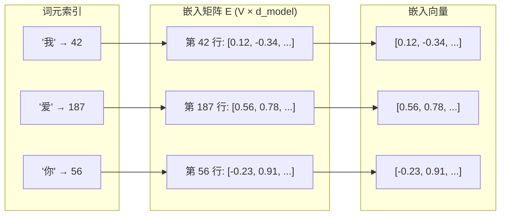

## 3.2 词嵌入：从离散符号到连续向量

上一节把文本变成了一串整数 ID。Transformer 处理的却是连续向量，**词嵌入**（Word Embedding）就是这两个世界之间的那张表。

[3.1 节](3.1_tokenization.md)比较 32K 与 128K 词表时，判据一直是“嵌入层参数少”还是“嵌入层参数膨胀”；那个会膨胀的矩阵正是本节要拆开看的东西。本节回答四个问题：查表在形状上做了什么，谁在训练中改写这张表，它到底占多少参数，以及同一张表在输出端怎样第二次出现。

### 3.2.1 为什么需要词嵌入

将词转化为数字最简单的方式是**独热编码**（One-Hot Encoding）：为词表中的每个词元分配一个索引，用一个在该索引处为 1、其余为 0 的向量表示。

独热编码有两个缺陷。其一是维度：向量长度等于词表大小，Llama 3 的一个词元就要 128,256 维，且绝大部分为零。其二是语义：所有词元两两正交，“猫”和“狗”的距离与“猫”和“飞机”完全相同。

词嵌入把每个词元映射为一个低维稠密向量，让语义相近的词元在向量空间中也靠近。维度从 128,256 降到 4,096，同时腾出了表达相似度的空间。

### 3.2.2 思想溯源与一处限定

用向量表示词义的思想早于 Transformer。2013 年的 **Word2Vec** 用预测上下文（Skip-gram）或由上下文预测中心词（CBOW）的方式学词向量，并展示了向量空间中的线性关系，如 $$\vec{\text{king}} - \vec{\text{man}} + \vec{\text{woman}} \approx \vec{\text{queen}}$$。随后 **GloVe**（2014 年）改用全局共现矩阵分解，**FastText**（2016 年）把子词信息引入词嵌入。

这条线性关系需要一个限定。标准评测在检索最近邻时会排除三个输入词本身，否则返回的往往是 $$\vec{\text{king}}$$ 或 $$\vec{\text{woman}}$$ 而不是 $$\vec{\text{queen}}$$。它是一个在特定评测约定下成立的经验现象，不是向量空间的严格代数性质。

与早期方法的关键区别在于：早期词嵌入是**静态**的，一个词无论出现在什么上下文里向量都相同；Transformer 的嵌入层只给出**初始表示**，经过多层注意力与前馈网络后，同一个词元在不同上下文中的表示会分开，这就是**上下文化嵌入**（Contextualized Embedding）。

### 3.2.3 查表的形状与梯度：谁读、谁写

嵌入层是一个**查找表**（Lookup Table）。设词表大小为 $$V$$、嵌入维度为 $$d_{\text{model}}$$，则嵌入矩阵 $$E \in \mathbb{R}^{V \times d_{\text{model}}}$$ 每行对应一个词元。

**形状流。** 分词器交出的是整数张量，嵌入层交出的是浮点张量：

- 输入：`ids[B, T]`，元素是 `0` 到 `V - 1` 的整数。
- 查表：`E[V, d]` 的第 `ids[b, t]` 行。
- 输出：`X[B, T, d]`。

取第 $$i$$ 行写作 $$\text{embed}(i) = E[i, :]$$。这在数学上等价于用独热行向量左乘 $$E$$，即 `onehot[1, V] × E[V, d] → x[1, d]`；实现上直接索引，省掉了一次 `V` 维的乘加。

**谁写这张表。** 嵌入矩阵是可学习参数，但它的梯度结构与其他权重不同：一次前向只读了本批出现过的那些行，反向传播也只给这些行非零梯度。这是**稀疏行梯度**：词表有 12.8 万行，一个批次可能只碰到几万行，低频词元要很多个批次才被更新一次。PyTorch 的 `nn.Embedding` 因此提供 `sparse=True` 选项。

绑定权重时情况不同。输入端与输出端共用同一张矩阵，输出端的 LM head 每一步对**全部** `V` 行都有梯度，稀疏性消失，见 3.2.5。

图 3-2 展示查表过程：每个词元索引直接对应嵌入矩阵中的一行。

```mermaid
flowchart LR
    subgraph input["词元索引"]
        T0["'我' → 42"]
        T1["'爱' → 187"]
        T2["'你' → 56"]
    end

    subgraph matrix["嵌入矩阵 E (V × d_model)"]
        R0["第 42 行: [0.12, -0.34, ...]"]
        R1["第 187 行: [0.56, 0.78, ...]"]
        R2["第 56 行: [-0.23, 0.91, ...]"]
    end

    subgraph output["嵌入向量"]
        V0["[0.12, -0.34, ...]"]
        V1["[0.56, 0.78, ...]"]
        V2["[-0.23, 0.91, ...]"]
    end

    T0 --> R0 --> V0
    T1 --> R1 --> V1
    T2 --> R2 --> V2
```

图 3-2：嵌入层通过查找表将词元索引映射为稠密向量。三个索引各取一行，行与行之间互不影响。

### 3.2.4 嵌入矩阵有多大

嵌入矩阵的参数量是 `V × d_model`，与层数无关。这条简单事实决定了它在不同规模上的地位完全不同。表 3-4 按公开配置逐项算出。

| 模型 | 词表 `V` | `d_model` | 一份词表矩阵 | 绑定 | 总参数 | 词表占比 |
| --- | ---: | ---: | ---: | --- | ---: | ---: |
| GPT-2 small | 50,257 | 768 | 38,597,376 | 是 | 124,439,808 | 31.0% |
| Llama 2 7B | 32,000 | 4,096 | 131,072,000 | 否 | 6,738,415,616 | 3.9% |
| Llama 3 8B | 128,256 | 4,096 | 525,336,576 | 否 | 8,030,261,248 | 13.1% |
| Llama 3 70B | 128,256 | 8,192 | 1,050,673,152 | 否 | 70,553,706,496 | 3.0% |
| Llama 3 405B | 128,256 | 16,384 | 2,101,346,304 | 否 | 405,853,388,800 | 1.0% |

表 3-4：五个公开模型的词表矩阵参数账。不绑定时词表占比按输入、输出两份合计；GPT-2 small 绑定，只有一份。`V`、`d_model` 与绑定与否取自各模型的 `config.json`（405B 的层数与宽度取自 [Llama 3 论文](https://arxiv.org/abs/2407.21783)表 3，见 3.8.6 的表 3-24），总参数由逐项相加得到，算法见 3.7.7。

三条读法。第一，GPT-2 small 有 31.0% 的参数在词表里，这是它当年必须绑定权重的直接原因。第二，Llama 3 8B 的词表比 Llama 2 7B 大 4 倍，占比从 3.9% 跳到 13.1%；同一张 12.8 万行的表放到 405B 上只占 1.0%。第三，占比大致等于 `kV / (kV + 12Ld)`（`k` 为词表矩阵份数），只由词表、层数与宽度三者的比例决定。

GPT-2 small 的“117M”是论文初版口径；按公开权重逐项相加为 124,439,808，OpenAI 后来的模型卡也用 124M。本书统一用逐项相加的口径。

每层参数随 `d_model` 平方增长（3.7.7 给出 `12d²`），词表参数只随 `d_model` 线性增长。模型变大时，分母涨得比分子快，词表占比必然下降。

### 3.2.5 输入端与输出端：同一张表的两种用法

嵌入矩阵的另一半故事在模型末端。最后一层输出经末端归一化后，要换算成词表上的分数：

`h[T, d] × W_vocab[d, V] → logits[T, V]`

这一步称为 **LM head**（unembedding）。它与嵌入矩阵形状互为转置，因此可以共用同一份权重，即**权重绑定**（Weight Tying）。[Transformer 原论文](https://arxiv.org/abs/1706.03762) 3.4 节写明“we share the same weight matrix between the two embedding layers and the pre-softmax linear transformation”。

绑定与否的判据就是 3.2.4 的占比：词表占比高就绑定，占比低就放开，让输入表示与输出预测各自优化。取舍的完整讨论在 3.7.6。

输出端还带来一项显存开销，训练时尤其明显：logits 的形状是 `[B, T, V]`。Llama 3 8B 在 `B = 4`、`T = 8192` 下，仅这一个张量在 BF16 下就是 `4 × 8192 × 128256 × 2 = 8,405,385,216` 字节，约 7.8 GiB。这是训练框架把损失分块计算、推理时只对最后一行算 logits 的原因（见 [3.8.3 节](3.8_gpt_inference_flow.md)）。词表并行则把 `V` 维切开分到多卡（见 [11.8 节](../11_serving/11.8_multi_gpu_inference.md)）。

### 3.2.6 嵌入缩放：一个量级算例

Transformer 原论文在同一小节里还交代了一件事：“In the embedding layers, we multiply those weights by $$\sqrt{d_{\text{model}}}$$”。

$$\text{ScaledEmbed}(x) = E[x] \times \sqrt{d_{\text{model}}}$$

原文只给了做法，没有给动机，也没有消融。通行的解释是量级匹配，可以算一笔账验证其合理性。取 $$d_{\text{model}} = 512$$：

- 正弦位置向量的每一对分量是同一角度的 $$\sin$$ 与 $$\cos$$，平方和恰为 1；共 $$d/2$$ 对，故 L2 范数恒为 $$\sqrt{d/2} = \sqrt{256} = 16$$。
- 嵌入若按标准差 0.02 初始化，每个分量的平方期望是 $$0.02^2$$，范数约 $$0.02 \times \sqrt{512} = 0.4525$$。
- 乘以 $$\sqrt{512} = 22.627$$ 后，范数约 10.24，与 16 同量级。
- 若改按标准差 $$d^{-1/2} = 0.0442$$ 初始化，范数约 1，缩放后约 22.63，同样是同一量级。

不缩放时，嵌入的范数比位置向量小一个半数量级，位置信息会盖过词义。这一解释与算术相符，但它是后人的解释，不是原论文的论证。

缩放还与权重绑定有关。同一张矩阵在输出端要产生 logits，尺度过大会让 Softmax 过尖；在输入端又要与位置编码可比，尺度不能太小。乘 $$\sqrt{d_{\text{model}}}$$ 只作用于输入端，正好调和这一对要求。这同样是通行理解，原文未明说。

**这个乘法不是普适的。** 现代仅解码器模型各不相同：Llama 系列的 `LlamaModel` 直接用 `embed_tokens` 的输出进入第一层，没有任何缩放，位置信息由每层内部的 RoPE 带入；Gemma 2 在 HF 实现中保留了缩放，把嵌入乘以 `config.hidden_size ** 0.5`。判据不是“原论文怎么做”，而是嵌入、位置机制与残差流三者的量级是否协调。

### 3.2.7 边界：低频词元与各向异性

**低频词元的嵌入行训练不足。** 3.2.3 说明梯度只落在本批出现过的行上。词表里排在尾部的词元可能在整个预训练中只出现几十次，其嵌入行基本停在初始化值附近，还要承受权重衰减，范数偏小。这正是 [3.1.8 节](3.1_tokenization.md)故障词元的直接成因：分词器语料与模型训练语料不一致时，一批词元会系统性地落入这种状态。

**上下文化表示不是各向同性的。** [Ethayarajh 2019 年的工作](https://arxiv.org/abs/1909.00512)测量了 ELMo、BERT 与 GPT-2 的表示几何，结论是“the contextualized representations of all words are not isotropic in any layer”：向量挤在一个窄锥里，任意两个词的余弦相似度都偏高。该文还指出，在这三个模型的所有层上，平均“less than 5% of the variance in a word's contextualized representations can be explained by a static embedding for that word”。

两个推论。其一，不能把余弦值直接当语义距离用，需要先做中心化或白化。其二，“嵌入层学到了词义”这句话对静态嵌入成立，对深层表示只成立一部分：绝大部分方差来自上下文，而不是词元本身。

**实现对照。** PyTorch 的 `nn.Embedding(num_embeddings, embedding_dim)` 权重形状是 `[V, d]`。HF 的 Llama 实现里，输入端是 `model.embed_tokens`，输出端是 `lm_head`，末端归一化是 `model.norm`；相关配置字段是 `vocab_size`、`hidden_size`、`tie_word_embeddings`。GPT-2 实现里对应的名字是 `wte`（词嵌入）、`wpe`（位置嵌入）与 `ln_f`。张量并行下，嵌入表按行切分 `V`，每卡只持有自己那段，越界 ID 的结果置零后做一次 all-reduce（见 [7.3 节](../07_distributed_training/7.3_model_tensor_parallel.md)）；词表大小常被补齐到某个倍数，正是为了让这一步切得整齐。

下一节交代那个被拿来做量级对照的东西：位置编码。
