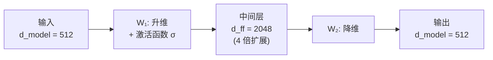

## 3.4 前馈网络：Transformer 的“记忆层”

Transformer 每层中除了注意力子层外，还有一个**逐位置前馈网络**（Position-wise Feed-Forward Network，FFN）。这个组件经常被忽视，但它在 Transformer 中扮演着不可或缺的角色。

### 3.4.1 结构与计算

前馈网络的结构非常简洁——两层全连接网络，中间夹一个非线性激活函数：

$$\text{FFN}(x) = \sigma(x W_1 + b_1) W_2 + b_2$$

这里把单个位置的表示 $$x$$ 视为行向量，$$W_1 \in \mathbb{R}^{d_{\text{model}} \times d_{ff}}$$，$$W_2 \in \mathbb{R}^{d_{ff} \times d_{\text{model}}}$$。原始 Transformer base 模型使用 ReLU 激活函数 $$\sigma(x) = \max(0, x)$$，中间层维度 $$d_{ff} = 2048$$，是 $$d_{\text{model}} = 512$$ 的 4 倍（big 模型则为 $$d_{ff} = 4096$$）。

“逐位置”意味着**同一个 FFN 独立地应用于序列中的每个位置**，各位置之间不共享信息。这与注意力层形成互补：注意力层负责位置之间的信息交互，FFN 负责对每个位置的信息进行独立变换。

下图展示了 FFN 的沙漏结构——先升维以扩展表达空间，经过非线性变换后再降回原始维度：



图 3-3：FFN 的沙漏结构——先升维再降维，中间层提供更大的变换容量

### 3.4.2 为什么需要前馈网络

一个自然的问题是：**注意力机制已经能够捕捉全局依赖了，为什么还需要 FFN？**

我们可以从**直觉分工**和**数学原理**两个维度来回答这个问题。

**1. 直觉层面的分工：信息收集（计算“怎么联系”） vs. 知识加工（计算“这是什么”）**

注意力机制其实是在 **整理输入信息**。它负责在不同的 Token 之间建立联系，计算每个位置需要关注上下文中哪些部分，并将这些分散的全局信息汇聚到当前 Token 的向量表示中。这是一种 **全局的信息路由与组合**。

然而，仅仅把信息“搬运”和“混合”在一起是不够的。当当前 Token 收集到了充足的全文上下文后，它还需要对这些信息进行 **深度的内部加工转化**。FFN 扮演的就是这个“内部加工者”的角色。它不再去看其它位置，而是只处理当前这个已经满载全文信息的 Token，通过非线性变换和通道混合更新表示；某些事实关联可以在 FFN 中被定位，但模型知识并不是像数据库记录一样只存放在这一层。

打个比方：
*   **注意力层** 就像是“开会交流”，每个单词都在环顾四周，听取其他单词的意见，把相关的语境收集到自己身上。
*   **前馈网络（FFN）** 就像是“闭门思考”，每个单词回到自己的工位，根据刚才收集到的全盘信息，结合大脑里原本记忆的知识，独立进行深加工，得出新的结论（更新自身的表示，为最终预测下一个 Token 做准备）。

**2. 数学层面的必要性：逐位置非线性与通道混合**

从数学计算上看，自注意力的输出是值向量（Value）的加权和；但注意力权重由 $$QK^T$$ 经过 Softmax 得到，本身包含非线性和输入依赖。因此，不能简单把只有自注意力的多层网络说成会等价塌缩为单层线性变换。

FFN 的关键作用是在每个位置上提供额外的**非线性变换**和**通道混合**：$$W_1$$ 将表示投影到更宽的中间维度，激活函数进行选择性响应，$$W_2$$ 再把这些响应组合回模型维度。它与注意力层的跨位置信息路由互补，共同提升 Transformer 的表达能力。

### 3.4.3 FFN 作为“记忆层”的直觉

近年来的研究提供了一个有用视角：FFN 往往是 Transformer 中若干事实关联和特征变换较容易被局部化的位置之一。

Geva 等人（2021 年）的研究表明，FFN 的第一层（$$W_1$$）可以被视为一组“键”，在上述右乘约定下每一列对应一种激活模式；第二层（$$W_2$$）对应这些模式关联的“值”。这种键值存储视角是解释 FFN 行为的有用模型，但它是机制解释的一种近似，不意味着事实知识只以显式记录的形式保存在 FFN 中：

1. 第一层通过矩阵乘法和激活函数选择性地“激活”某些模式
2. 第二层将激活的模式映射为特定的输出

实验证据支持了这一解释。当研究者编辑 FFN 中的特定参数时，能够精确地修改模型存储的事实知识（如“埃菲尔铁塔在巴黎”→“埃菲尔铁塔在伦敦”）。

### 3.4.4 中间层维度为什么接近 4 倍

原始 Transformer 中，FFN 中间层维度 $$d_{ff}$$ 是 $$d_{\text{model}}$$ 的 4 倍（$$d_{ff} = 4 \times d_{\text{model}}$$）。这个比例的选择基于以下考量：

**扩展再压缩的设计模式**：先将表示投影到更高维度的空间（$$d_{\text{model}} \rightarrow d_{ff}$$），在高维空间中进行非线性变换和特征选择，然后压缩回原始维度（$$d_{ff} \rightarrow d_{\text{model}}$$）。高维空间提供了更多的“容量”来存储和处理信息。

**参数效率的权衡**：FFN 的参数量为 $$2 \times d_{\text{model}} \times d_{ff}$$。4 倍扩展在增加计算能力的同时，参数量仍然可控。实验表明，进一步增大 $$d_{ff}$$ 的收益递减。

现代大语言模型延续了“扩展再压缩”的容量分配，但不一定仍使用严格的 4 倍宽度。采用 **SwiGLU** 的 Llama 等模型有三个投影矩阵（gate、up、down），因此常把中间维度设为约 $$\frac{8}{3}d_{\text{model}}$$：三矩阵的总参数量约等于传统 ReLU/GELU FFN 在 $$4d_{\text{model}}$$ 宽度下的两矩阵参数量，同时获得门控表达能力。

以下代码对比了三种激活函数在相同输入下的行为差异，帮助直观理解从 ReLU 到 SwiGLU 的演进：

```python
import torch
import torch.nn.functional as F

d_model, d_ff, d_swiglu = 8, 32, 22
torch.manual_seed(42)
x = torch.randn(1, d_model)  # 单个位置的输入

# ---- ReLU FFN（原始 Transformer）----
W1 = torch.randn(d_model, d_ff)
W2 = torch.randn(d_ff, d_model)
relu_out = F.relu(x @ W1) @ W2
print("ReLU FFN 输出:", torch.round(relu_out * 1000) / 1000)
# ReLU 将所有负值"硬截断"为 0
print("ReLU 激活后零值比例:", (F.relu(x @ W1) == 0).float().mean().item())

# ---- GELU FFN（GPT-2 等模型）----
gelu_out = F.gelu(x @ W1) @ W2
print("GELU FFN 输出:", torch.round(gelu_out * 1000) / 1000)
# GELU 平滑过渡，负值不完全为 0
print("GELU 激活后零值比例:", (F.gelu(x @ W1) == 0).float().mean().item())

# ---- SwiGLU FFN（Llama 等模型）----
# SwiGLU 使用 gate/up/down 三个投影；宽度通常低于 4x 以保持参数量接近
W_gate = torch.randn(d_model, d_swiglu)
W_up = torch.randn(d_model, d_swiglu)
W_down = torch.randn(d_swiglu, d_model)
swiglu_hidden = F.silu(x @ W_gate) * (x @ W_up)  # 门控机制
swiglu_out = swiglu_hidden @ W_down
print("SwiGLU FFN 输出:", torch.round(swiglu_out * 1000) / 1000)
```

运行这段代码时，ReLU 会产生较高比例的零激活，GELU 会保留更平滑的负值响应，SwiGLU 则通过 gate/up 两路投影的逐元素乘法选择性放大或抑制特征。
