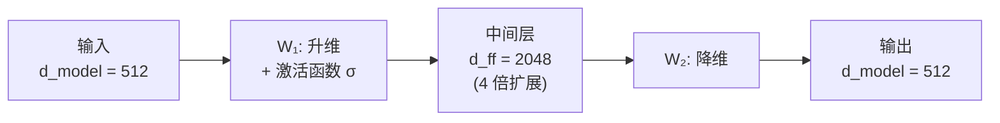

## 3.4 前馈网络：Transformer 的“记忆层”

Transformer 每层中除了注意力子层外，还有一个**逐位置前馈网络**（Position-wise Feed-Forward Network，FFN）。这个组件经常被忽视，但它在 Transformer 中扮演着不可或缺的角色。

### 3.4.1 结构与计算

前馈网络的结构非常简洁——两层全连接网络，中间夹一个非线性激活函数：

$$\text{FFN}(x) = W_2 \cdot \sigma(W_1 x + b_1) + b_2$$

其中 $W_1 \in \mathbb{R}^{d_{\text{model}} \times d_{ff}}$，$W_2 \in \mathbb{R}^{d_{ff} \times d_{\text{model}}}$。原始 Transformer base 模型使用 ReLU 激活函数 $\sigma(x) = \max(0, x)$，中间层维度 $d_{ff} = 2048$，是 $d_{\text{model}} = 512$ 的 4 倍（big 模型则为 $d_{ff} = 4096$）。

“逐位置”意味着**同一个 FFN 独立地应用于序列中的每个位置**，各位置之间不共享信息。这与注意力层形成互补：注意力层负责位置之间的信息交互，FFN 负责对每个位置的信息进行独立变换。

下图展示了 FFN 的沙漏结构——先升维以扩展表达空间，经过非线性变换后再降回原始维度：



图 3-3：FFN 的沙漏结构——先升维再降维，中间层提供更大的变换容量

### 3.4.2 为什么需要前馈网络

一个自然的问题是：**注意力机制已经能够捕捉全局依赖了，为什么还需要 FFN？**

我们可以从**直觉分工**和**数学原理**两个维度来回答这个问题。

**1. 直觉层面的分工：信息收集（计算“怎么联系”） vs. 知识加工（计算“这是什么”）**

注意力机制其实是在 **整理输入信息**。它负责在不同的 Token 之间建立联系，计算每个位置需要关注上下文中哪些部分，并将这些分散的全局信息汇聚到当前 Token 的向量表示中。这是一种 **全局的信息路由与组合**。

然而，仅仅把信息“搬运”和“混合”在一起是不够的。当当前 Token 收集到了充足的全文上下文后，它还需要对这些信息进行 **深度的内部加工转化**，并与模型内部记忆的事实知识进行碰撞。FFN 扮演的就是这个“内部加工者”的角色。它不再去看其它位置，而是只盯着当前这个已经满载全文信息的 Token，结合模型内部的知识进行 **非线性推理**。

打个比方：
*   **注意力层** 就像是“开会交流”，每个单词都在环顾四周，听取其他单词的意见，把相关的语境收集到自己身上。
*   **前馈网络（FFN）** 就像是“闭门思考”，每个单词回到自己的工位，根据刚才收集到的全盘信息，结合大脑里原本记忆的知识，独立进行深加工，得出新的结论（更新自身的表示，为最终预测下一个 Token 做准备）。

**2. 数学层面的必要性：打破线性组合的局限**

从数学计算上看，**注意力层本质上做的是线性组合。** 自注意力的输出是值向量（Value）的加权和——这是一个线性操作（虽然注意力权重是通过 Softmax 非线性生成的，但对 Value 的组合本身仍是线性的）。如果整个网络只堆叠多层注意力而没有 FFN，那么多层连续的线性变换在数学上等价于单层线性变换，模型的表达能力会被锁死在极低的水平。

FFN 通过在两层线性映射之间插入**非线性激活函数**（如 ReLU、GELU 等），赋予了网络“非线性拟合”的能力。这才是深度学习模型能够理解复杂自然语言逻辑的根本前提。

### 3.4.3 FFN 作为“记忆层”的直觉

近年来的研究揭示了 FFN 的另一重要角色：**它是 Transformer 存储事实知识的主要位置。**

Geva 等人（2021 年）的研究表明，FFN 的第一层（$W_1$）可以被视为一组“键”，每一行对应一种激活模式；第二层（$W_2$）对应这些模式关联的“值”——即具体的知识内容。这种视角下，FFN 的工作方式类似于一个**键值存储**：

1. 第一层通过矩阵乘法和激活函数选择性地“激活”某些模式
2. 第二层将激活的模式映射为特定的输出

实验证据支持了这一解释。当研究者编辑 FFN 中的特定参数时，能够精确地修改模型存储的事实知识（如“埃菲尔铁塔在巴黎”→“埃菲尔铁塔在伦敦”）。

### 3.4.4 中间层维度为什么是 4 倍

原始 Transformer 中，FFN 中间层维度 $d_{ff}$ 是 $d_{\text{model}}$ 的 4 倍（$d_{ff} = 4 \times d_{\text{model}}$）。这个比例的选择基于以下考量：

**扩展再压缩的设计模式**：先将表示投影到更高维度的空间（$d_{\text{model}} \rightarrow d_{ff}$），在高维空间中进行非线性变换和特征选择，然后压缩回原始维度（$d_{ff} \rightarrow d_{\text{model}}$）。高维空间提供了更多的“容量”来存储和处理信息。

**参数效率的权衡**：FFN 的参数量为 $2 \times d_{\text{model}} \times d_{ff}$。4 倍扩展在增加计算能力的同时，参数量仍然可控。实验表明，进一步增大 $d_{ff}$ 的收益递减。

现代大语言模型通常保持了这个约 4 倍的比例，但激活函数从 ReLU 演化为 GELU（Gaussian Error Linear Unit）或 SiLU/Swish——这些更平滑的激活函数在实践中表现更好。此外，Llama 等模型采用了 **SwiGLU**（Gated Linear Unit 的变体），它将 FFN 扩展为三个矩阵，在同等参数量下获得更强的表达能力。

以下代码对比了三种激活函数在相同输入下的行为差异，帮助直观理解从 ReLU 到 SwiGLU 的演进：

```python
import torch
import torch.nn as nn
import torch.nn.functional as F

d_model, d_ff = 8, 32
torch.manual_seed(42)
x = torch.randn(1, d_model)  # 单个位置的输入

# ---- ReLU FFN（原始 Transformer）----
W1 = torch.randn(d_model, d_ff)
W2 = torch.randn(d_ff, d_model)
relu_out = F.relu(x @ W1) @ W2
print("ReLU FFN 输出:", relu_out.round(decimals=3))
# ReLU 将所有负值"硬截断"为 0
print("ReLU 激活后零值比例:", (F.relu(x @ W1) == 0).float().mean().item())

# ---- GELU FFN（GPT-2 等模型）----
gelu_out = F.gelu(x @ W1) @ W2
print("GELU FFN 输出:", gelu_out.round(decimals=3))
# GELU 平滑过渡，负值不完全为 0
print("GELU 激活后零值比例:", (F.gelu(x @ W1) == 0).float().mean().item())

# ---- SwiGLU FFN（Llama 等模型）----
# SwiGLU 使用两个投影 W1 和 W_gate，并用 SiLU 门控
W_gate = torch.randn(d_model, d_ff)
swiglu_hidden = F.silu(x @ W_gate) * (x @ W1)  # 门控机制
swiglu_out = swiglu_hidden @ W2
print("SwiGLU FFN 输出:", swiglu_out.round(decimals=3))
```

上述代码的输出结果如下：

```text
ReLU FFN 输出: tensor([[ 18.9740, -18.8040,   4.1560,   8.7130,   7.6620,  -8.1090, -16.5200,
           8.1550]])
ReLU 激活后零值比例: 0.46875
GELU FFN 输出: tensor([[ 18.7710, -17.7720,   4.2050,   8.9820,   7.5910,  -8.2340, -15.5350,
           8.2760]])
GELU 激活后零值比例: 0.03125
SwiGLU FFN 输出: tensor([[ -9.5410, -21.0820,   9.3630,  39.1050,  -8.3680, -12.2070, -66.7940,
          -8.8370]])
```
