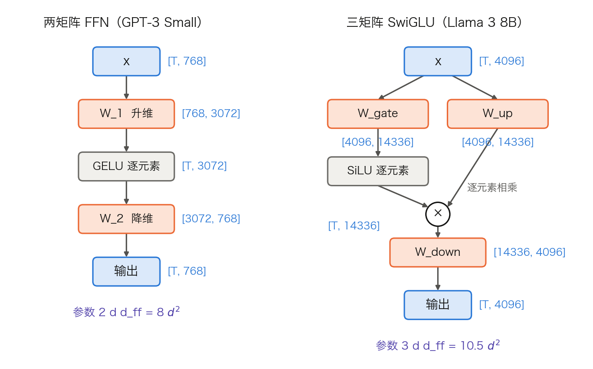

## 3.4 前馈网络：Transformer 的“记忆层”

前三节交代的都是进入第一层之前的事：$$\text{Input}_i = \text{Embed}(x_i) + \text{PE}(i)$$ 一旦备齐，词元、语义和位置就全都装进了同一个向量。从本节起，讨论转入层的内部。

每层有两个子层，注意力负责跨位置搬运信息（第二章），**逐位置前馈网络**（Position-wise Feed-Forward Network，FFN）负责在每个位置上就地加工。它占了一层参数的三分之二以上，却常被当成配角。本节给出它的形状、参数账、宽度取舍、激活函数的演进，以及它在推理上的特殊性质。

### 3.4.1 结构与形状：从两矩阵到三矩阵

原始 FFN 是两层全连接，中间夹一个逐元素激活：

$$\text{FFN}(x) = \sigma(x W_1 + b_1) W_2 + b_2$$

把单个位置的表示 $$x$$ 视为行向量，则 $$W_1 \in \mathbb{R}^{d_{\text{model}} \times d_{ff}}$$、$$W_2 \in \mathbb{R}^{d_{ff} \times d_{\text{model}}}$$。原始 Transformer base 取 $$\sigma = \text{ReLU}$$、$$d_{ff} = 2048$$，是 $$d_{\text{model}} = 512$$ 的 4 倍。

按 3.8 节的记法写出形状，`T` 是词元数：

- `X[T, d] × W_1[d, d_ff] → H[T, d_ff]`
- `H[T, d_ff] → σ(H)[T, d_ff]`（逐元素，不改形状）
- `σ(H)[T, d_ff] × W_2[d_ff, d] → Y[T, d]`

现代模型普遍改用 **SwiGLU**，把升维那一步拆成两路并行投影，一路过激活当作门，另一路直通：

$$\text{FFN}_{\text{SwiGLU}}(x) = \left(\text{SiLU}(x W_{\text{gate}}) \odot x W_{\text{up}}\right) W_{\text{down}}$$

其中 $$\odot$$ 是逐元素乘，$$W_{\text{gate}}, W_{\text{up}} \in \mathbb{R}^{d \times d_{ff}}$$，$$W_{\text{down}} \in \mathbb{R}^{d_{ff} \times d}$$。两个激活函数的定义各一行：

$$\text{SiLU}(z) = z \cdot \sigma(z), \qquad \sigma(z) = \frac{1}{1 + e^{-z}}$$

$$\text{GELU}(z) = z \cdot \Phi(z)$$

$$\Phi$$ 是标准正态的累积分布函数。GPT-2 等模型用的是它的 tanh 近似，实现里叫 `gelu_new`。

SwiGLU 的形状流多一路，但输入输出仍是 `[T, d]`：

- `X[T, d] × W_gate[d, d_ff] → G[T, d_ff]`，同时 `X[T, d] × W_up[d, d_ff] → U[T, d_ff]`
- `SiLU(G) ⊙ U → H[T, d_ff]`
- `H[T, d_ff] × W_down[d_ff, d] → Y[T, d]`

现代模型通常去掉 $$b_1$$、$$b_2$$。HF 的 Llama 实现里，三个投影的 `bias` 由 `config.mlp_bias` 控制，Llama 系列的 `config.json` 中该字段缺省为假。

图 3-3 把两种结构并排画出，标出各矩阵的真实形状。



图 3-3：两矩阵 FFN 与三矩阵 SwiGLU 的形状对照（[生成脚本](https://github.com/yeasy/llm_internals/blob/main/tools/figures/ch03_ffn_shapes.py)）。橙色是权重，蓝色是数据。左边取 GPT-3 Small 的配置，右边取 Llama 3 8B 的配置；两者的输入与输出都回到 `[T, d_model]`，差别只在中间那一段。

“逐位置”意味着同一组权重独立地作用于每个位置，位置之间不交换信息。这是与注意力互补的一半：注意力跨位置路由，FFN 就地变换。

### 3.4.2 为什么注意力之外还要 FFN

一个常见的说法是“没有 FFN，多层注意力会塌缩成一层线性变换”。这句话不成立：注意力权重由 $$QK^\top$$ 经 Softmax 得到，本身既非线性又依赖输入，多层堆叠并不等价于单个线性映射。

FFN 的真实作用要具体些说。其一是**通道混合**：注意力的输出是 Value 的加权和，权重对所有通道相同，通道之间从未被重新组合；$$W_1$$ 与 $$W_2$$（或 gate/up/down 三者）正是做这件事。其二是**逐位置非线性**：把表示升到 $$d_{ff}$$ 维，在高维空间做一次选择性响应，再压回 $$d_{\text{model}}$$ 维。

分工可以这样对照：注意力决定“从哪里取信息”，FFN 决定“取到之后怎么算”。两者都在残差流上读写（见 [3.5 节](3.5_residual.md)），互不替代。

### 3.4.3 键值记忆视角：依据与限度

把 FFN 看作一张查询表，是一个有实证依据的视角。[Geva 等人 2021 年的工作](https://arxiv.org/abs/2012.14913)给出了这一命题：feed-forward layers “operate as key-value memories, where each key correlates with textual patterns in the training examples, and each value induces a distribution over the output vocabulary”。在本节的右乘记法下，$$W_1$$ 的每一列是一个“键”，与它匹配的输入会让对应的中间单元激活；$$W_2$$ 的对应行是“值”，被加权后写回残差流。该文还观察到“lower layers tend to capture shallow patterns, while upper layers learn more semantic ones”，并在摘要开头指出 FFN “constitute two-thirds of a transformer model's parameters”。

**编辑权重能改事实，是另一篇工作的结论。** [ROME](https://arxiv.org/abs/2202.05262)（Meng 等人 2022 年）用因果干预定位出“a distinct set of steps in middle-layer feed-forward modules that mediate factual predictions while processing subject tokens”，再用一次秩一更新改写这些权重，把某个主语的属性换成另一个值。原文的结论措辞是“confirm an important role for mid-layer feed-forward modules in storing factual associations”，用的是“an important role”，不是“事实只存在这里”。

**限度同样有实证。** [Hase 等人 2023 年的工作](https://arxiv.org/abs/2301.04213)发现，基于因果追踪的定位结论“do not provide any insight into which model MLP layer would be best to edit”，并指出“which layer we edit is a far better predictor of performance”。换言之，“定位到哪一层”与“编辑哪一层有效”并不一致。

综合三篇：键值记忆是一个好用的解释模型，编辑 FFN 权重确实能改写事实关联，但不能由此推出知识像数据库记录一样只存放在 FFN 里，也不能用定位结果直接指导编辑。

### 3.4.4 中间层多宽：4 倍、8/3 与真实取值

原始 Transformer 取 $$d_{ff} = 4 d_{\text{model}}$$，两矩阵版本的参数量是 $$2 d \cdot d_{ff} = 8d^2$$。

SwiGLU 有三个矩阵，参数量是 $$3 d \cdot d_{ff}$$。若要与 4 倍宽的两矩阵版本等参，需要

$$3 d \cdot d_{ff} = 8 d^2 \implies d_{ff} = \tfrac{8}{3} d \approx 2.667 d$$

[Shazeer 2020 年的 GLU Variants 论文](https://arxiv.org/abs/2002.05202)正是这样做对照的：基线的 $$d_{ff} = 3072$$，GLU 类变体缩到 $$d_{ff} = 2048$$，原文说明这是“to keep the number of parameters and the amount of computation constant”，缩减因子 $$2/3$$。

**但 $$8/3$$ 只是等参的理论值，真实模型并不照抄。** Llama 2 7B 的 `intermediate_size` 是 11,008，等于 $$2.6875 d$$，接近 $$8/3$$；它的来历是 $$\tfrac{8}{3} \times 4096 = 10{,}922.7$$ 向上取整到 256 的倍数。Llama 3 则把这一比例放宽：8B 与 70B 取 3.5 倍，405B 取 3.25 倍。表 3-6 给出三个模型一层内部的参数分配。

| 模型 | `d_model` | `d_ff` | `d_ff / d` | 注意力 | FFN | FFN 占一层 |
| --- | ---: | ---: | ---: | ---: | ---: | ---: |
| GPT-3 175B | 12,288 | 49,152 | 4.00 | 4.0 `d²` | 8.0 `d²` | 66.7% |
| Llama 2 7B | 4,096 | 11,008 | 2.6875 | 4.0 `d²` | 8.06 `d²` | 66.8% |
| Llama 3 8B | 4,096 | 14,336 | 3.50 | 2.5 `d²` | 10.5 `d²` | 80.8% |

表 3-6：一层内部的参数分配。注意力项按 `2 d² + 2 d · n_kv · d_h` 算：GPT-3 与 Llama 2 是普通多头注意力，故为 `4 d²`；Llama 3 8B 用 GQA，`n_kv = 8`，降到 `2.5 d²`。FFN 项按结构分两种算法：两矩阵版本是 `2 d · d_ff`，三矩阵 SwiGLU 是 `3 d · d_ff`。GPT-3 是两矩阵，`2 × 12,288 × 49,152 = 1,207,959,552`，即 `8.0 d²`；两个 Llama 是三矩阵。末列的分母还计入每层归一化的参数（两个 RMSNorm 共 `2d`，两个 LayerNorm 共 `4d`）。`d_ff` 取自各模型的 `config.json`（GPT-3 按论文规定的 `4 × d_model` 算出）。

表里的规律是：**GQA 省下的参数被挪给了 FFN。** Llama 3 8B 的注意力比 Llama 2 7B 少了 $$1.5 d^2$$，FFN 多了 $$2.4 d^2$$，一层反而更大。Geva 论文“三分之二”的口径对 GPT-3 式配置成立；到了 Llama 3 8B，FFN 已占一层的八成。

“进一步加宽收益递减”是一个流传很广的说法，本书未找到给出消融的一手出处，此处不作断言。可以确定的是宽度与深度在固定参数量下可以互换，[Kaplan 等人](https://arxiv.org/abs/2001.08361)的实测是“Performance depends strongly on scale, weakly on model shape”，其图 5 的注里写道“Aspect ratio in particular can vary by a factor of 40 while only slightly impacting performance”。

### 3.4.5 激活函数为什么从 ReLU 换到 SwiGLU

三种激活在负半轴上的差别，决定了它们的梯度行为。先看逐点取值：

```python
import math

def relu(z): return max(0.0, z)
def silu(z): return z / (1.0 + math.exp(-z))
def gelu(z):  # tanh 近似，即 GPT-2 实现里的 gelu_new
    return 0.5 * z * (1.0 + math.tanh(math.sqrt(2.0 / math.pi) * (z + 0.044715 * z ** 3)))

print(f"{'z':>6}{'ReLU':>10}{'GELU':>10}{'SiLU':>10}")
for z in (-3.0, -1.0, -0.5, 0.0, 0.5, 1.0, 3.0):
    print(f"{z:>6.1f}{relu(z):>10.4f}{gelu(z):>10.4f}{silu(z):>10.4f}")
```

实际输出：

```text
     z      ReLU      GELU      SiLU
  -3.0    0.0000   -0.0036   -0.1423
  -1.0    0.0000   -0.1588   -0.2689
  -0.5    0.0000   -0.1543   -0.1888
   0.0    0.0000    0.0000    0.0000
   0.5    0.5000    0.3457    0.3112
   1.0    1.0000    0.8412    0.7311
   3.0    3.0000    2.9964    2.8577
```

三条读法。ReLU 在整个负半轴严格为零，梯度也为零，单元一旦长期落在负半轴就不再更新，这就是死神经元。GELU 与 SiLU 在负半轴保留一小段非零响应：GELU 的最小值约 $$-0.170$$（在 $$z \approx -0.752$$ 处），SiLU 的最小值约 $$-0.279$$（在 $$z \approx -1.278$$ 处），此后再缓慢回到 0，梯度处处非零。三者在正半轴都接近恒等。

**门控是另一件事。** GLU 类结构里，是否通过、通过多少，由输入的**另一条**投影决定，而不是由同一条投影的符号决定。这给了网络一个与内容相关的开关。

证据方面，GLU Variants 论文在参数与计算量对齐的条件下做了对照，表 3-7 摘录其表 1 的一列。

| FFN 变体 | 524,288 步的 heldout log 困惑度 |
| --- | ---: |
| ReLU（基线） | 1.677 |
| GELU | 1.679 |
| Swish | 1.683 |
| GLU | 1.663 |
| Bilinear | 1.648 |
| ReGLU | 1.645 |
| SwiGLU | 1.636 |
| GEGLU | 1.633 |

表 3-7：GLU Variants 论文表 1 中训练 524,288 步后的 heldout-set log 困惑度，任务是 T5 的 span-filling 目标，全部模型“matched for parameters and computation”。GLU 类整体优于非门控类，但组内差异很小：SwiGLU 与 GEGLU 相差 0.003。该文对机理未给解释，原话是“We offer no explanation as to why these architectures seem to work”。

所以“换成 SwiGLU”的依据是一次等参对照实验中的稳定小幅提升，不是某条理论推导。SwiGLU 与 GEGLU 的差别在这张表里几乎不可分，具体选哪个更多是工程惯例。

### 3.4.6 FFN 的开销与失效情形

**计算量。** 每个词元的 FFN 前向约 $$2 \times 3 \times d \times d_{ff}$$ 次浮点运算（两矩阵版本是 $$2 \times 2 \times d \times d_{ff}$$）。Llama 3 8B 每层是 $$6 \times 4096 \times 14336 \approx 3.52 \times 10^8$$，32 层共约 $$1.13 \times 10^{10}$$，约为全模型前向 $$2N = 1.61 \times 10^{10}$$ 的七成（见 3.7.7）。其余由注意力的四个投影（$$2.68 \times 10^{9}$$）和 LM head（$$1.05 \times 10^{9}$$）承担；嵌入查表只按行取值，不做乘加，$$2N$$ 在这一项上是高估。

**Decode 阶段 FFN 是纯访存。** FFN 不跨位置，Decode 每轮只有一行输入，计算量与序列长度无关；权重却要完整读一遍。这正是 3.8.7 里 Decode 卡在显存带宽上的主要来源，也是 MoE 选择稀疏化 FFN 而不动注意力的原因（见 [14.2 节](../14_future_trends/14.2_moe.md)）。

**激活稀疏性被 SwiGLU 换掉了。** ReLU 模型的中间层有大量精确为零的单元，可以据此跳过计算；SiLU 与 GELU 的输出几乎处处非零，这种稀疏性消失，依赖它的推理加速手段随之失效。

**异常激活集中在 FFN 输出上。** 少数通道会出现远大于其余通道的激活值，写回残差流后一路传下去。它是低比特量化最主要的困难来源，处理方式见 [10.4 节](../10_inference_optimization/10.4_quantization.md)。

**“逐位置”带来两个工程便利。** Prefill 时可以把词元任意切块分批过 FFN，分块 Prefill 正依赖这一点；张量并行时按列切 `W_gate` 与 `W_up`、按行切 `W_down`，整层只需一次 all-reduce（见 [7.3 节](../07_distributed_training/7.3_model_tensor_parallel.md)）。

### 3.4.7 对到实现

HF 的 `LlamaMLP` 定义了三个投影，名字分别是 `gate_proj`、`up_proj`、`down_proj`，激活由 `config.hidden_act` 选取，Llama 系列的取值是 `"silu"`；中间宽度是 `config.intermediate_size`，偏置由 `config.mlp_bias` 控制。前向就是一行：先 `act_fn(gate_proj(x)) * up_proj(x)`，再过 `down_proj`。

推理引擎常把 `gate_proj` 与 `up_proj` 的权重横向拼成一个矩阵，一次矩阵乘得到两段结果再切开，省掉一次内核启动与一次对 `x` 的重复读取。具体命名随引擎版本变化，此处只记机制。

读一个新模型的 FFN，四个字段就够：`hidden_size`、`intermediate_size`、`hidden_act`、`mlp_bias`。三个矩阵的参数量随即是 `3 × hidden_size × intermediate_size`。
