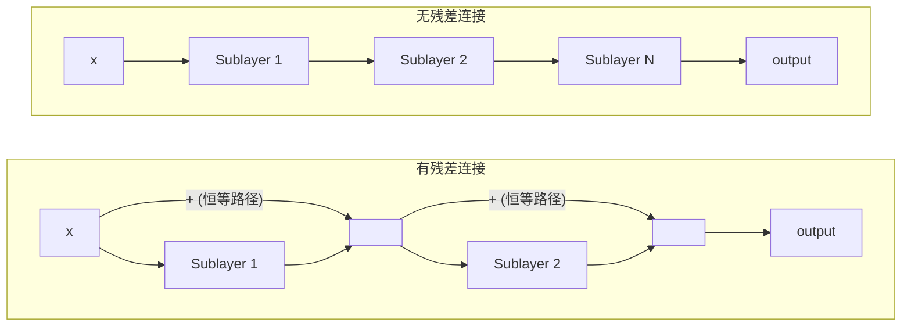

## 3.5 残差连接：梯度为什么能流过百层网络

残差连接（Residual Connection）是 Transformer 能够堆叠数十甚至上百层的关键使能技术。这一概念最初由 He 等人在 2015 年的 ResNet 中提出，Transformer 对其进行了沿用。

### 3.5.1 深层网络的退化问题

理论上，更深的网络应该至少不比浅层网络差——因为深层网络总可以学习一个恒等映射（Identity Mapping），使多余的层什么也不做。但实践中恰恰相反：当网络深度超过一定阈值后，训练误差反而**升高**。

这就是**退化问题**（Degradation Problem）——不是过拟合（训练好但泛化差），而是连训练本身都失败了。原因在于：**优化算法难以学习恒等映射。** 当一个层试图直接学习 $$H(x) = x$$ 时，必须将所有权重精确地调整为恒等矩阵，这在反向传播中非常困难。

### 3.5.2 残差连接的精巧设计

残差连接的核心想法非常简洁：**不让网络直接学习目标映射 $$H(x)$$，而是学习残差 $$F(x) = H(x) - x$$**。网络的实际输出变为：

$$H(x) = x + F(x)$$

如果目标映射接近恒等变换，那么 $$F(x)$$ 接近零。让网络学习一个接近零的函数（$$F(x) \approx 0$$）比学习一个恒等映射（$$F(x) = x$$）要容易得多——只需要将权重初始化为接近零即可。

在 Transformer 中，每个子层都包裹在残差连接中：

$$\text{output} = x + \text{Sublayer}(x)$$

其中 $$\text{Sublayer}$$ 可以是注意力层或前馈网络。

### 3.5.3 梯度流动的直觉

残差连接对梯度传播的改善可以通过链式法则直观地理解。

对于没有残差连接的深层网络，梯度需要经过每一层的权重矩阵连乘：

$$\frac{\partial \mathcal{L}}{\partial x} = \frac{\partial \mathcal{L}}{\partial h_L} \prod_{l=1}^{L} \frac{\partial h_l}{\partial h_{l-1}}$$

当层数 $$L$$ 很大时，连乘容易导致梯度消失（乘积趋近零）或爆炸（乘积趋近无穷）。

有了残差连接，由于 $$h_l = h_{l-1} + F_l(h_{l-1})$$，梯度变为：

$$\frac{\partial h_l}{\partial h_{l-1}} = I + \frac{\partial F_l}{\partial h_{l-1}}$$

其中 $$I$$ 是单位矩阵。这意味着**梯度始终有一条从输出直达输入的“高速公路”**——即使 $$\partial F_l / \partial h_{l-1}$$ 很小，梯度仍然可以通过恒等路径（$$I$$）无损地传播。

这就是 Transformer 能够堆叠 6 层、12 层、96 层甚至更多层的根本原因。

下图对比了有无残差连接时的梯度流动路径：

图 3-4：残差连接提供了梯度的“高速公路”，使梯度可以跳过中间层直接传播

### 3.5.4 维度一致性的要求

残差连接要求 $$x$$ 和 $$\text{Sublayer}(x)$$ 的维度完全一致，否则无法相加。这就是为什么 Transformer 中**所有层的输出维度都保持为 $$d_{\text{model}}$$**——这个看似简单的设计约束直接源于残差连接的数学要求。

这也解释了 FFN 为什么采用“先升维再降维”的沙漏结构：输入和输出必须保持 $$d_{\text{model}}$$ 维，但中间可以临时扩展到 $$d_{ff}$$ 维来进行更丰富的变换。

### 3.5.5 PreNorm 稀释问题与注意力残差

残差连接与 Pre-Norm 的组合（[3.6.4 节](3.6_layer_norm.md)）已成为现代 LLM 的标准结构，但这一范式在极深模型中暴露了一个长期被忽视的结构性缺陷——**PreNorm 稀释问题**。

经过 $$L$$ 层累积后，模型的隐状态可以展开为：

$$h_L = x_0 + \sum_{l=1}^{L} F_l(\text{LN}(h_{l-1}))$$

所有层的输出以**固定的单位权重**相加。这意味着第 1 层的粗浅特征和第 50 层的深度推理结果在最终表征中拥有相同的发言权。随着层数加深，后面层的贡献被前面庞大的累积量不断稀释；为了对抗这种稀释，深层不得不放大输出幅度，导致隐状态范数持续增长。这一现象与当年 RNN 将所有历史信息强行压缩进一个固定状态的瓶颈如出一辙。

2025 年，Moonshot AI（月之暗面）团队提出了**注意力残差**（Attention Residuals，AttnRes）来解决这一问题。核心思路是：用深度维度上的注意力机制替代盲目求和，让每一层能够选择性地聚合前序层的输出。

具体做法是为每一层引入一个可学习的投影向量 $$w_l$$，对所有前序层的输出计算注意力权重后加权聚合：

$$h_l = \sum_{j=0}^{l} \alpha_{l,j} \cdot v_j, \quad \alpha_{l,j} = \frac{\exp(w_l^\top \cdot \text{LN}(v_j))}{\sum_{k=0}^{l} \exp(w_l^\top \cdot \text{LN}(v_k))}$$

其中 $$v_j$$ 是第 $$j$$ 层的原始输出。模型由此获得了对深度信息的**选择性过滤能力**——可以大幅依赖某些关键层的输出，同时抑制其他层的干扰。

全量 AttnRes 需要 $$O(Ld)$$ 的额外内存。为此团队进一步提出了 **Block AttnRes**（分块注意力残差）：将 $$L$$ 层划分为约 8 个分块，块内使用标准残差累积，仅在块级表征上应用注意力聚合。实测表明，Block AttnRes 在 48B 参数模型上仅增加不到 2% 的推理开销和不到 4% 的训练耗时，却在复杂推理（GPQA-Diamond +7.5 分）、数学（+3.6 分）和代码（+3.1 分）等任务上带来显著提升。以上为该团队公开技术报告中的快照数字，具体增益随模型规模与训练设置而异，应以其官方报告为准。

这一工作表明，残差连接的“固定权重求和”并非不可改变的设计约束，而是一个可以被注意力机制优化的聚合策略。
