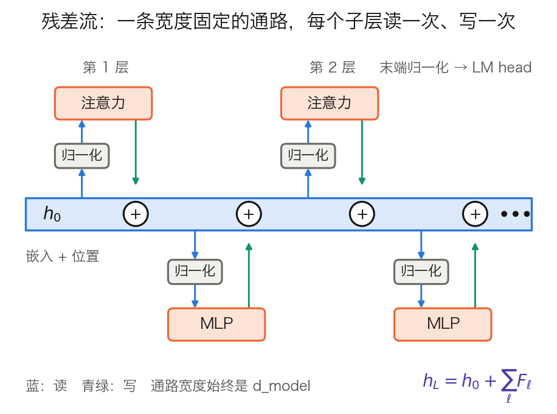

## 3.5 残差连接：梯度为什么能流过百层网络

上一节那个先升到 $$d_{ff}$$ 再降回 $$d_{\text{model}}$$ 的沙漏结构，中间那一段宽窄可调，两端却必须回到 $$d_{\text{model}}$$。这个约束并不来自 FFN 自身的需要，而是本节这条加法通路强加的。

**残差连接**（Residual Connection）由 He 等人在 2015 年的 [ResNet](https://arxiv.org/abs/1512.03385) 中提出，Transformer 沿用至今。本节做四件事：还原原论文对退化问题的解释，把反向的连乘展开成路径之和，给出前向的残差流视角，并交代它成立所依赖的尺度条件。

### 3.5.1 退化问题：原论文怎么说

更深的网络理应不比浅网络差：只要多出来的层学成恒等映射，深网络就能复现浅网络。实验却相反。ResNet 原文的描述是：“with the network depth increasing, accuracy gets saturated … and then degrades rapidly”，并强调“such degradation is not caused by overfitting, and adding more layers to a suitably deep model leads to higher training error”。

这里有一处常被讹传的归因。原文明确否定了梯度消失这一解释：“We argue that this optimization difficulty is unlikely to be caused by vanishing gradients. These plain networks are trained with BN … We also verify that the backward propagated gradients exhibit healthy norms with BN. So neither forward nor backward signals vanish.”

原文给出的解释是优化难度：“The degradation problem suggests that the solvers might have difficulties in approximating identity mappings by multiple nonlinear layers.” 换言之，困难不在信号消失，而在求解器找不到那个存在的解。

两种说法要分开：“难以逼近恒等映射”出自原论文，“残差提供梯度通路”是后来对 Transformer 训练的普遍观察。两者都对深层网络有解释力，但不能互相冒充。3.5.3 给出梯度一侧的算术。

### 3.5.2 学残差而不是学映射

残差连接的想法是：不让网络直接学目标映射 $$H(x)$$，而是学**残差** $$F(x) = H(x) - x$$，输出写成

$$H(x) = x + F(x)$$

若目标接近恒等映射，即 $$H(x) \approx x$$，那么 $$F(x) \approx 0$$。让一组权重趋近于零，比让它们精确拼出一个恒等矩阵容易得多。ResNet 原文补了一句限定：“In real cases, it is unlikely that identity mappings are optimal, but our reformulation may help to precondition the problem.” 重构的作用是换一个更好的起点，不是断言最优解就是恒等。

Transformer 中每个子层都包在这样一条加法里：

$$\text{output} = x + \text{Sublayer}(x)$$

$$\text{Sublayer}$$ 可以是注意力，也可以是 FFN。

**维度一致性是这条加法的直接后果。** $$x$$ 与 $$\text{Sublayer}(x)$$ 必须同形状才能相加，所以 Transformer 里每一层的输入输出宽度都固定为 $$d_{\text{model}}$$。3.4 节 FFN 的沙漏形状正源于此：中间可以临时扩到 $$d_{ff}$$，两端必须回到 $$d_{\text{model}}$$。注意力也一样，各头结果拼接后由 $$W_O$$ 投回 $$d_{\text{model}}$$。

### 3.5.3 反向：$$2^L$$ 条路径与一个数值对照

无残差时，梯度要连乘每一层的雅可比：

$$\frac{\partial \mathcal{L}}{\partial h_0} = \frac{\partial \mathcal{L}}{\partial h_L} \prod_{l=1}^{L} \frac{\partial h_l}{\partial h_{l-1}}$$

连乘对尺度极其敏感。设每层雅可比的谱范数约为 $$\rho$$，96 层后整体缩放约为 $$\rho^{96}$$：

- $$\rho = 0.9$$：$$0.9^{96} \approx 4.05 \times 10^{-5}$$，梯度基本消失。
- $$\rho = 0.99$$：$$0.99^{96} \approx 0.381$$，尚可。
- $$\rho = 1.1$$：$$1.1^{96} \approx 9.41 \times 10^{3}$$，梯度爆炸。

可用区间窄到 $$\rho$$ 必须几乎正好是 1。

有残差时 $$h_l = h_{l-1} + F_l(h_{l-1})$$，单层雅可比变成

$$\frac{\partial h_l}{\partial h_{l-1}} = I + J_l, \qquad J_l = \frac{\partial F_l}{\partial h_{l-1}}$$

把连乘展开：

$$\prod_{l=1}^{L} (I + J_l) = I + \sum_l J_l + \sum_{l < m} J_m J_l + \cdots + J_L \cdots J_1$$

展开式共 $$2^L$$ 项，每一项对应一条“在每层上选择进入子层或跳过”的路径；经过 $$k$$ 个子层的路径有 $$\binom{L}{k}$$ 条。恒等项 $$I$$ 始终在，$$\rho$$ 略小于 1 时梯度也不会整体塌到零。

[Veit 等人 2016 年的工作](https://arxiv.org/abs/1605.06431)把这一展开当作解释残差网络的主线：“residual networks have $$2^n$$ paths connecting input to output layers”，且“the distribution of all possible path lengths through a residual network follows a Binomial distribution”。对 54 个残差模块的网络，原文给出“more than 95% of paths go through 19 to 35 modules”（按二项分布复核为 98.0%）。更关键的一条结论是：“most gradient during training comes from paths that are even shorter, i.e., 10-34 layers deep”。

由此得到一个比“梯度高速公路”更可检验的说法：深层残差网络在训练中的行为，更接近许多条较浅路径的集成，而不是一条很深的链。

### 3.5.4 前向：残差流、方差增长与初始化缩放

反向只是故事的一半。把递推式正向展开：

$$h_{\text{out}} = h_0 + \sum_{s=1}^{2L} F_s\left(\text{Norm}(h_{s-1})\right)$$

求和上限是 $$2L$$ 而不是 $$L$$：每层有注意力与 FFN 两个子层，各写入一次。最终表示等于**初始嵌入加上所有子层输出之和**。这条贯穿全模型、宽度恒为 $$d_{\text{model}}$$ 的向量通路称为**残差流**（residual stream）。

残差流给出了一个统一的读写视角：每个子层从流上读一份（先经归一化），算出自己的贡献，再把结果加回流上；子层之间不直接相连，全部通过这条流通信。图 3-4 把两层四个子层的读写画出来。

图 3-4：残差流——各子层从同一条通路读、向同一条通路写（[生成脚本](https://github.com/yeasy/llm_internals/blob/main/tools/figures/ch03_residual_stream.py)）。蓝色箭头是读，读操作不改变通路；青绿色箭头是写，写操作是一次逐元素相加。通路宽度始终是 `d_model`，这正是 3.5.2 的维度约束。

这个视角有三条直接推论。

其一，各子层的贡献是**线性叠加**的，因此可以逐项拆开分析：某个注意力头写了什么、某个 FFN 写了什么，可以分别投影到词表上看。这是 Logit Lens 一类方法可行的前提（见 [14.8 节](../14_future_trends/14.8_interpretability.md)）。

其二，靠前的子层写进去的东西，靠后的所有子层都读得到，无须逐层转发。跨层组合（如第 $$l$$ 层的头读第 $$l'$$ 层写入的特征）因此成为可能。

其三，残差流的宽度固定，写入的东西越多越挤。子层要写入互不干扰的信息，只能占用不同的方向；$$d_{\text{model}}$$ 是这条通路的全部预算。

**残差的代价：方差随深度增长。** 恒等项使信号只增不减。

设 $$h_0$$ 与各子层输出近似独立、方差同量级 $$s^2$$，则

$$\text{Var}(h_{\text{out}}) \approx \text{Var}(h_0) + 2L \cdot s^2$$

方差随深度**线性增长**，范数按 $$\sqrt{2L}$$ 增长。取 $$\text{Var}(h_0) = s^2 = 1$$：$$L = 12$$ 时方差是 $$1 + 24 = 25$$，范数为初值的 $$\sqrt{25} = 5.0$$ 倍；$$L = 96$$ 时方差是 193，范数为 $$\sqrt{193} = 13.9$$ 倍。深层的子层输出相对于已积累的和越来越小，贡献被稀释；同时残差流的数值范围一路抬高，对低精度训练不利。

GPT-2 的对策是在初始化时压小每个残差分支的末端投影。[GPT-2 论文](https://cdn.openai.com/better-language-models/language_models_are_unsupervised_multitask_learners.pdf) 2.3 节的原话是：“A modified initialization which accounts for the accumulation on the residual path with model depth is used. We scale the weights of residual layers at initialization by a factor of $$1/\sqrt{N}$$ where $$N$$ is the number of residual layers.”

HF 的 GPT-2 实现把 $$N$$ 取作 $$2 \times$$ 层数，即每层两次残差相加各算一层，只对注意力与 FFN 的输出投影 `c_proj` 生效：初始化标准差取 `initializer_range / sqrt(2 * n_layer)`。代入 `initializer_range = 0.02`：

- $$L = 12$$：$$1/\sqrt{24} = 0.2041$$，标准差 $$0.00408$$。
- $$L = 48$$：$$1/\sqrt{96} = 0.1021$$，标准差 $$0.00204$$。
- $$L = 96$$：$$1/\sqrt{192} = 0.0722$$，标准差 $$0.00144$$。

这样每个分支的初始输出方差正比于 $$1/(2L)$$，$$2L \cdot s^2$$ 回到常数，残差流的初始范数不再随深度增长。这是一条**只作用于初始化**的措施：训练开始后权重自行调整，范数仍会长大，把归一化放在子层之前（Pre-Norm，见 [3.6.5 节](3.6_layer_norm.md)）时尤其明显。同一条缩放放在训练配方里看，以及它与损失尖峰、logits 尺度失控的关系，见 [6.3.5 节](../06_training_techniques/6.3_regularization.md)的表 6-8。

这一条与本小节开头的残差流视角是同一件事的两面：通路只加不减，所以既要靠归一化管住读出的尺度，也要靠初始化管住写入的尺度。

### 3.5.5 固定权重求和的代价与替代方案

上面的公式还隐含一件事：所有子层的输出以**固定的单位权重**相加。第 1 层的粗浅特征和第 50 层的推理结果在最终表示中权重相同，模型只能靠调整各分支自身的幅度来分配话语权。

这一约束并非不可改。表 3-8 列出四类改法及其代价。

| 方案 | 公式 | 改动的对象 | 代价 |
| --- | --- | --- | --- |
| Highway | $$h = g \odot F(x) + (1 - g) \odot x$$ | 用可学习的门控分配残差与分支 | 恒等路径被门衰减，深度一大又回到连乘问题 |
| ReZero / SkipInit | $$h = x + \alpha F(x)$$，$$\alpha$$ 初始为 0 | 给每个分支一个可学习标量 | 训练初期分支形同不存在，收敛路径改变 |
| 初始化缩放 | $$h = x + F(x)$$，$$F$$ 末端初始化乘 $$1/\sqrt{2L}$$ | 只改初值，结构不变 | 只在初始时刻成立，训练中不再保持 |
| 深度维注意力 | $$h_l = \sum_{j<l} \alpha_{j\to l} v_j$$ | 用注意力权重替代固定求和 | 需要保存前序层输出，额外内存与计算 |

表 3-8：四类替代固定权重求和的做法。前两类改的是分支的缩放系数，第三类只改初值，最后一类改的是聚合方式本身。初始化缩放即 3.5.4 的 GPT-2 做法，是四者中唯一被主流模型普遍采用的。

最后一行对应一类较新的工作。Moonshot AI 团队提出的**注意力残差**（Attention Residuals，AttnRes）为每层引入一个可学习的投影向量 $$w_l$$，对所有前序层输出计算注意力权重后加权聚合：

$$h_l = \sum_{j=0}^{l-1} \alpha_{j \to l} \cdot v_j, \quad \alpha_{j \to l} = \frac{\exp(w_l^\top \cdot \text{RMSNorm}(v_j))}{\sum_{k=0}^{l-1} \exp(w_l^\top \cdot \text{RMSNorm}(v_k))}$$

其中 $$v_j$$ 是第 $$j$$ 层的原始输出。归一化用的是 RMSNorm 而非 LayerNorm，原文给的理由是防止输出幅度大的层垄断注意力权重。全量版本每个词元需要 $$O(Ld)$$ 的额外内存来存各层输出，算术量为 $$O(L^2 d)$$；团队因此给出 **Block AttnRes**：把 $$L$$ 层分成若干块，块内仍用标准残差累积，只在块级表征上做注意力聚合。该团队报告的开销与基准增益属论文当时版本的快照，随规模与训练设置而异，以其官方报告为准（登记于 [A.5 易过期事实台账](../appendix/a5_volatile_facts.md)）。

这条线的意义不在某个具体数字，而在于说明：固定权重求和是一个设计选择，不是残差连接的必要形式。

### 3.5.6 对到实现

HF 的 `LlamaDecoderLayer.forward` 把 3.5.4 的读写画成了代码：一层里出现两次 `residual = hidden_states`，两次 `hidden_states = residual + hidden_states`，中间分别夹着 `input_layernorm` 加注意力、`post_attention_layernorm` 加 `mlp`。读一个新模型的层实现，先找这两对语句，就能确定它的归一化放在哪里。

两处工程细节值得留意。其一，推理引擎常把“残差相加”与“下一次归一化”融进同一个内核：两步都是逐元素操作，合并后残差流只需读写一遍显存，省掉一次全量往返。其二，低精度训练中残差流常保留较高精度累加，原因正是 3.5.4 的方差增长：一路累加的数值范围最宽，最先溢出。

残差把子层的输出加回主通路，却没说这条通路的数值该有多大。下一节的归一化负责这件事。
