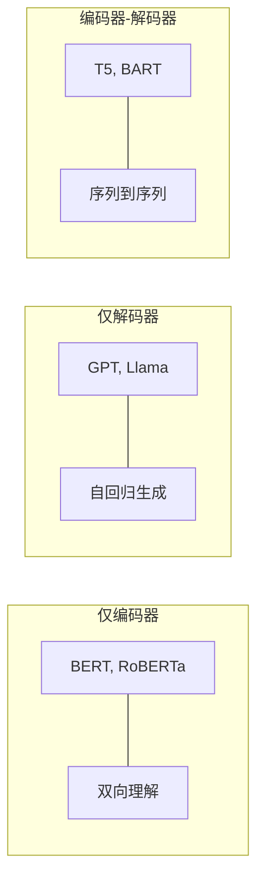

## 3.6 编码器-解码器：完整架构如何协同工作

前面的章节分别介绍了 Transformer 的各个组件。现在，将它们组装起来，理解完整架构的信息流动和各组件之间的协同关系。

### 3.6.1 编码器的信息流

编码器由 $N$ 个相同结构的层堆叠而成（原始论文中 $N = 6$）。对于输入序列 "I love machine learning"：

1. **词元化与嵌入**：将文本分割为词元，通过嵌入层转化为向量，并加上位置编码
2. **第 1 层自注意力**：每个词元关注所有其他词元，建立初步的上下文关系
3. **第 1 层残差 + 归一化**：保留原始信息，稳定数值
4. **第 1 层 FFN**：对每个位置独立进行非线性变换，存储和提取知识
5. **第 1 层残差 + 归一化**：同上
6. **重复 2-5 步**：经过 $N$ 层后，每个位置的表示已经融合了整个序列的上下文信息

关键洞察：**随着层数的增加，表示从底层的局部语法特征逐渐演化为高层的全局语义特征。** 底层注意力头可能关注相邻词汇，高层注意力头可能关注远距离的语义依赖。

### 3.6.2 解码器的信息流

解码器同样由 $N$ 层堆叠而成，但每层多了一个交叉注意力子层。以翻译"I love machine learning"为"我热爱机器学习"为例：

1. **已生成词元的嵌入 + 位置编码**：当前已生成了"我 热爱"
2. **掩码自注意力**：让"热爱"关注"我"和自己，但不能看到未来的"机器学习"
3. **交叉注意力**：让"热爱"查看编码器对"I love machine learning"的表示，找到对应的源语言信息
4. **FFN**：对每个位置进行独立变换
5. **线性层 + Softmax**：将最后一个位置的表示映射到词汇表大小的概率分布，预测下一个词"机器"

### 3.6.3 三种架构变体

基于编码器和解码器的组合方式，Transformer 衍生出三种主流架构变体：

图 3-1：三种 Transformer 架构变体及代表模型

**仅编码器（Encoder-Only）**：使用全双向的自注意力，擅长理解型任务（分类、序列标注、问答）。代表模型：BERT、RoBERTa。

**仅解码器（Decoder-Only）**：使用因果掩码的自注意力，擅长生成型任务（文本生成、对话）。代表模型：GPT 系列、Llama、DeepSeek。这是当前大语言模型的主流架构。

**编码器-解码器（Encoder-Decoder）**：编码器处理输入，解码器生成输出，适合序列到序列任务（翻译、摘要）。代表模型：T5、BART。

值得注意的是，仅解码器架构在大规模上展现出了出色的通用性——GPT-3 以后的实践表明，足够大的自回归语言模型可以通过提示方式完成几乎所有 NLP 任务，包括原本被认为需要双向编码器的理解型任务。这也是为什么仅解码器架构成为了大模型时代的主流选择。

### 3.6.4 参数共享与权重绑定

Transformer 中有一个值得注意的参数共享设计：在原始论文和大多数后续模型中，**输入嵌入层和输出预测层共享权重矩阵**。

输出层需要将 $d_{\text{model}}$ 维的隐藏状态映射为 $V$ 维的概率分布（$V$ 是词汇表大小）。这个线性映射的权重矩阵恰好与嵌入矩阵的转置形状相同（$d_{\text{model}} \times V$）。共享这两个矩阵不仅减少了参数量，还在语义上有合理性：**嵌入层学到的词向量空间与输出层的预测空间应该是一致的。**

这种权重绑定（Weight Tying）在中小规模模型中效果显著。在超大规模模型中，有时会放弃这种绑定，以给输入和输出更大的独立表示能力。
