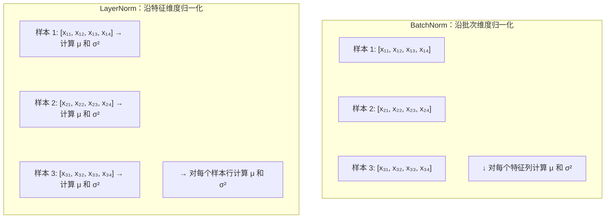

## 3.6 层归一化：为什么选择 LayerNorm 而非 BatchNorm

归一化（Normalization）是深度学习训练稳定性的基石之一。Transformer 选择了**层归一化**（Layer Normalization）而非更早被广泛使用的**批归一化**（Batch Normalization），这一选择有着深刻的技术原因。

### 3.6.1 归一化解决什么问题

深度网络训练中的一个核心困难是**内部协变量偏移**（Internal Covariate Shift）：每一层输入的分布在训练过程中不断变化（因为前面的层参数在更新），导致后面的层需要不断适应新的输入分布。

归一化通过将每层的输入重新标准化为均值为 0、方差为 1 的分布，缓解了这一问题，使每层的输入分布更加稳定，从而加速收敛并允许使用更大的学习率。

### 3.6.2 批归一化与层归一化的区别

**批归一化（BatchNorm）**：在同一批次内，对每个特征维度跨所有样本计算均值和方差，然后进行标准化。

$$\text{BN}(x_i) = \gamma \frac{x_i - \mu_B}{\sqrt{\sigma_B^2 + \epsilon}} + \beta$$

其中 $\mu_B$ 和 $\sigma_B^2$ 是该特征维度在整个批次上的均值和方差。

**层归一化（LayerNorm）**：对每个样本，跨所有特征维度计算均值和方差，然后进行标准化。

$$\text{LN}(x_i) = \gamma \frac{x_i - \mu_L}{\sqrt{\sigma_L^2 + \epsilon}} + \beta$$

其中 $\mu_L$ 和 $\sigma_L^2$ 是该样本在所有特征维度上的均值和方差。

两者都有可学习的缩放参数 $\gamma$ 和偏移参数 $\beta$，允许模型在需要时恢复原始分布。

下图以矩阵视角对比两种归一化的方向——BatchNorm 沿批次维度（纵向）归一化，LayerNorm 沿特征维度（横向）归一化：

图 3-4：BatchNorm 沿批次维度归一化，LayerNorm 沿特征维度归一化

### 3.6.3 Transformer 为什么选择层归一化

LayerNorm 而非 BatchNorm 的选择源于几个关键因素：

**变长序列的困境**：NLP 任务中的序列长度不一，即使在同一批次内。BatchNorm 需要在批次维度上计算统计量，但**不同位置的词元在语义上并不构成“同一分布”**——句子第一个词和第五个词有不同的统计特性。对位置维度做 BatchNorm 在理论上就不合理。

**批次大小的敏感性**：BatchNorm 的效果依赖于足够大的批次来估计稳定的统计量。在序列任务中，批次大小往往受显存限制，较小的批次会导致 BatchNorm 的统计量不稳定。

**推理时的一致性**：BatchNorm 在推理时使用训练阶段积累的运行均值和方差，但在自回归生成中，模型每次只处理一个样本（或一个时间步），BatchNorm 的运行统计量可能不准确。LayerNorm 的统计量只依赖当前样本，推理时行为与训练时一致。

**独立于批次和序列长度**：LayerNorm 对每个样本的每个位置独立计算，不受批次大小或序列长度的影响。这使其天然适合 Transformer 的并行计算模式。

### 3.6.4 Pre-Norm 与 Post-Norm

Transformer 原始论文使用**Post-Norm**（先子层计算，再加残差，最后归一化）：

$$\text{output} = \text{LN}(x + \text{Sublayer}(x))$$

但后续研究发现，**Pre-Norm**（先归一化，再子层计算，最后加残差）在深层模型中训练更加稳定：

$$\text{output} = x + \text{Sublayer}(\text{LN}(x))$$

Pre-Norm 的优势在于：残差路径上没有归一化操作的干扰，梯度可以更直接地流过恒等路径。这使得 Pre-Norm 不需要精心的学习率预热策略，模型即使在很高的学习率下也能稳定训练。

现代大语言模型几乎都使用 Pre-Norm 配置。在确定了 Pre-Norm 的放置策略后，一个自然的追问是：**归一化层本身能否进一步简化？**

回顾标准 LayerNorm 的计算，它包含两个步骤：先减去均值使数据零中心化，再除以标准差使方差归一。但研究者发现，对于 Transformer 中的表征向量，**均值中心化这一步实际贡献有限**——因为残差连接已经在一定程度上维持了表征的分布稳定性。去掉均值计算不仅减少了一次全量归约操作（reduction），还省去了偏移参数 $\beta$，同时对模型性能几乎没有影响。

基于这一洞察，**RMSNorm**（Root Mean Square Normalization）应运而生。它只保留“缩放”操作，直接用均方根（RMS）代替标准差来归一化：

$$\text{RMSNorm}(x) = \frac{x}{\sqrt{\frac{1}{d}\sum_{i=1}^{d}x_i^2 + \epsilon}} \cdot \gamma$$

与标准 LayerNorm 相比，RMSNorm 省去了均值计算和偏移参数 $\beta$，参数量减半，计算量约减少 10-15%。在实际基准测试中，RMSNorm 的训练和推理速度均优于 LayerNorm，而模型收敛质量基本持平。因此，RMSNorm 已成为当前的主流选择（Llama、Gemma、Mistral 等主流开源模型均采用 RMSNorm）。
