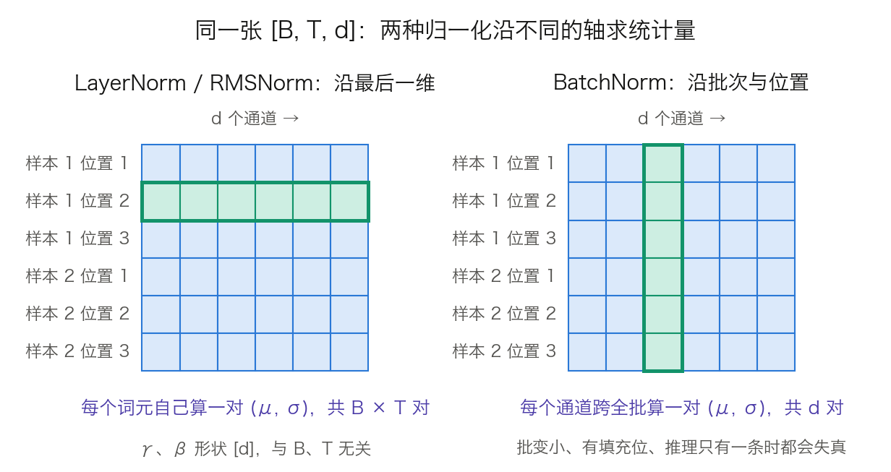
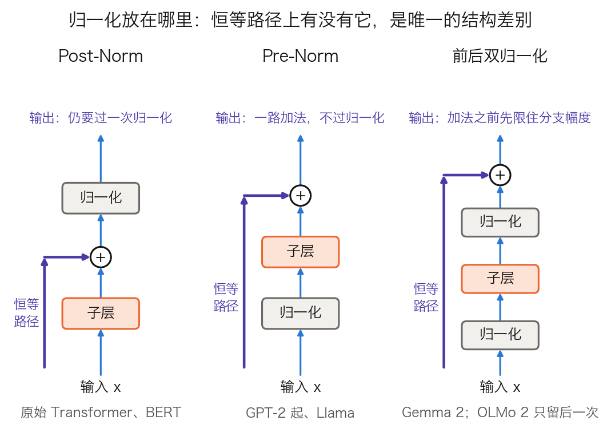

## 3.6 层归一化：为什么选择 LayerNorm 而非 BatchNorm

上一节写出的子层输出是 $$x + \text{Sublayer}(x)$$，而 [1.4 节](../01_introduction/1.4_transformer_idea.md)给出的原始形式是 $$\text{LayerNorm}(x + \text{Sublayer}(x))$$。上一节暂时省掉的那层外壳，正是本节的主角。

**归一化**（Normalization）做的事只有一件：把一组数重新缩放到一个受控的尺度。本节回答四个问题：沿哪个轴归一化，一个 4 维输入具体算出什么，归一化层放在残差的哪一侧，以及 RMSNorm 省掉了什么。

### 3.6.1 归一化解决什么问题

深度网络训练的一个经典解释是**内部协变量偏移**（Internal Covariate Shift）：前面的层参数一更新，后面的层输入分布就变了，后者需要不断适应。

这是 BatchNorm 论文给出的原始动机，并非定论。[后续研究](https://arxiv.org/abs/1805.11604)发现归一化的实际收益未必来自减小协变量偏移，更可能来自平滑损失地形、让梯度更稳定可预测。把归一化理解为“行之有效的优化辅助手段”，比把这一解释当作严格机制更稳妥。

在 Transformer 里还有一个更直接的理由：[3.5.4 节](3.5_residual.md)已经说明残差流的方差随深度线性增长。子层读到的向量尺度一路抬高，归一化把它拉回固定范围，子层的权重才不必随深度重新标定。

### 3.6.2 沿哪个轴：BN 与 LN 在 `[B, T, d]` 上的区别

一次前向的激活张量形状是 `[B, T, d]`：B 个样本、每个样本 T 个位置、每个位置 d 个通道。两种归一化的唯一差别是沿哪个轴求统计量。

**层归一化**（Layer Normalization）沿最后一维：

$$\text{LN}(x) = \gamma \odot \frac{x - \mu_L}{\sqrt{\sigma_L^2 + \epsilon}} + \beta, \qquad
\mu_L = \frac{1}{d}\sum_{i=1}^{d} x_i, \quad \sigma_L^2 = \frac{1}{d}\sum_{i=1}^{d}(x_i - \mu_L)^2$$

每个**词元**自己算一对 $$(\mu, \sigma)$$，共 `B × T` 对。$$\gamma$$ 与 $$\beta$$ 的形状都是 `[d]`，与 B、T 无关。

**批归一化**（Batch Normalization）沿批次与位置两维：

$$\text{BN}(x) = \gamma \odot \frac{x - \mu_B}{\sqrt{\sigma_B^2 + \epsilon}} + \beta$$

其中 $$\mu_B$$、$$\sigma_B^2$$ 是某个通道在全批全位置上的均值与方差，共 `d` 对。图 3-5 把两者画在同一张表上。

图 3-5：同一张 `[B, T, d]` 上，两种归一化沿不同的轴求统计量（[生成脚本](https://github.com/yeasy/llm_internals/blob/main/tools/figures/ch03_norm_axes.py)）。每一行是一个词元（样本与位置的组合），每一列是一个通道。LayerNorm 圈一行，BatchNorm 圈一列。

### 3.6.3 一个 4 维算例：LayerNorm 与 RMSNorm 各做了什么

取 $$x = [1, 2, 3, 4]$$，$$d = 4$$，暂设 $$\gamma = 1$$、$$\beta = 0$$、$$\epsilon = 0$$。

**LayerNorm。** 均值 $$\mu = (1 + 2 + 3 + 4)/4 = 2.5$$。方差 $$\sigma^2 = \frac{1}{4}\left[(-1.5)^2 + (-0.5)^2 + 0.5^2 + 1.5^2\right] = \frac{5}{4} = 1.25$$，标准差 $$\sigma = 1.1180$$。逐项相减再相除：

$$\frac{1 - 2.5}{1.1180} = -1.3416, \quad \frac{2 - 2.5}{1.1180} = -0.4472, \quad \frac{3 - 2.5}{1.1180} = 0.4472, \quad \frac{4 - 2.5}{1.1180} = 1.3416$$

结果是 $$[-1.3416,\ -0.4472,\ 0.4472,\ 1.3416]$$。

**RMSNorm。** 不减均值，直接除以均方根：$$\text{RMS} = \sqrt{(1 + 4 + 9 + 16)/4} = \sqrt{7.5} = 2.7386$$。逐项相除：

$$[0.3651,\ 0.7303,\ 1.0954,\ 1.4606]$$

两点结论可以直接读出来。

其一，**RMSNorm 只改变长度，不改变方向**：输出各分量之比仍是 1 : 2 : 3 : 4，符号不变。输出的 L2 范数恒为 $$\sqrt{d} = 2$$，即所有输出都落在半径 $$\sqrt{d}$$ 的球面上。

其二，**LayerNorm 多做了一次投影**：减均值等价于减去输入沿全 1 方向的分量。本例中 $$x - \mu \mathbf{1} = [-1.5, -0.5, 0.5, 1.5]$$，与全 1 向量的内积为 0。输出被限制在一个 $$d - 1$$ 维子空间里，范数同样是 $$\sqrt{d} = 2$$。

### 3.6.4 为什么不用 BatchNorm

BatchNorm 在序列任务上的困难，来自它的统计量依赖整个批次。

**批内统计量不稳定。** 序列任务的批大小受显存限制，常远小于视觉任务；批越小，$$\mu_B$$、$$\sigma_B^2$$ 的估计方差越大。

**填充位置污染统计量。** 同一批内序列长度不齐，短序列要补 `[PAD]`。这些位置的激活是无意义的，却照样进入某个通道的均值与方差。要排除它们，需要带掩码的归约，实现复杂且随批内长度分布抖动。

**训练与推理行为不一致。** BatchNorm 训练时用批统计量、推理时用滑动平均；自回归生成每轮只处理一个新位置，批构成还随调度不断变化（见 [11.2 节](../11_serving/11.2_continuous_batching.md)），滑动统计量与实际分布容易对不上。

LayerNorm 一条也不沾：统计量只依赖当前词元自己的 d 个数，与批大小、序列长度、填充位置、训练还是推理全都无关。这才是它被选中的原因，而不是“不同位置的词元不构成同一分布”这类含混说法。BatchNorm 在 Transformer 上的具体失效与一种补救见 [PowerNorm](https://arxiv.org/abs/2003.07845)。

### 3.6.5 Pre-Norm 与 Post-Norm：梯度、预热与代价

原始 Transformer 用 **Post-Norm**：先算子层，再加残差，最后归一化。

$$\text{output} = \text{LN}\left(x + \text{Sublayer}(x)\right)$$

GPT-2 起改用 **Pre-Norm**：先归一化，再算子层，最后加残差。

$$\text{output} = x + \text{Sublayer}\left(\text{LN}(x)\right)$$

差别只有一处：**恒等路径上有没有归一化**。Post-Norm 下每层的恒等路径都要穿过一次 LN，梯度被逐层重新缩放；Pre-Norm 下恒等路径是一条纯加法通道，3.5.3 的 $$I$$ 项完整保留。图 3-6 把三种放置并排画出，第三种见 3.6.7。

图 3-6：归一化放在哪里——Post-Norm、Pre-Norm 与前后双归一化（[生成脚本](https://github.com/yeasy/llm_internals/blob/main/tools/figures/ch03_norm_placement.py)）。紫色是恒等路径。三者的子层与归一化算子完全相同，差别只在接线。

[Xiong 等人 2020 年的工作](https://arxiv.org/abs/2002.04745)用平均场理论算了两者在初始化时的梯度量级：Post-LN 最后一层 FFN 的梯度范数是 $$\mathcal{O}(d\sqrt{\ln d})$$，与层数 $$L$$ 无关；Pre-LN 则是 $$\mathcal{O}(d\sqrt{\ln d / L})$$。原文的结论是“the learning rate warm-up stage can be safely removed”，因为 Pre-LN 的梯度在初始化时就已经良态。

这条结论要加两处限定。其一，它说的是“可以去掉预热”，不是“任意学习率都稳定”；主流 LLM 预训练仍普遍使用预热（见 [6.2 节](../06_training_techniques/6.2_lr_schedule.md)）。其二，Pre-Norm 有自己的代价，同一篇文章也说明了成因：“in the Pre-LN Transformer, the scale of the input to the final layer normalization is linear in $$L$$”。残差流范数随深度增长，深层子层的相对贡献被稀释，这与 [3.5.4 节](3.5_residual.md)的方差增长是同一件事。

Pre-Norm 还留下一个必须补的口子：最后一层之后残差流没有被任何归一化处理过，所以模型末端、LM head 之前要再加一次归一化。GPT-2 实现里它叫 `ln_f`，Llama 实现里叫 `model.norm`。

### 3.6.6 RMSNorm：省掉了什么，为什么影响不大

**RMSNorm**（Root Mean Square Normalization）去掉减均值这一步，也去掉偏移参数 $$\beta$$：

$$\text{RMSNorm}(x) = \frac{x}{\sqrt{\frac{1}{d}\sum_{i=1}^{d}x_i^2 + \epsilon}} \odot \gamma$$

[RMSNorm 原论文](https://arxiv.org/abs/1910.07467)给出的理由不是“残差连接已经稳住了分布”，而是关于不变性：原文认为重缩放不变性才是 LayerNorm 起效的关键，“We argue that this mean normalization does not reduce the variance of hidden states or model gradients, and hypothesize that it has little impact on the success of LayerNorm.”

省下的是什么：一次全量归约（求均值）与 $$d$$ 个偏移参数。收益的口径要看具体模型。原文摘要报告的是端到端运行时间，“reduces the running time by 7% ∼ 64% on different models”；其中 Transformer 一档的实测最小，“RMSNorm achieves BLEU scores comparable to LayerNorm, and yields a speedup of 7% ∼ 9%”，原文解释是 Transformer 里顺序执行的归一化操作本就比 RNN 少得多。

**为什么这点节省值得做。** 归一化的参数与 FLOPs 都可以忽略：GPT-3 175B 每层两个 LayerNorm 各 `2d` 个参数，加末端一个，合计 `2 × 2 × 12,288 × 96 + 2 × 12,288 = 4,743,168`，只占 1.75 × 10¹¹ 的 0.0027%。但它是逐元素、访存密集的操作，要把整条 `[B, T, d]` 完整读一遍、写一遍，实际耗时占比远高于 FLOPs 占比。少一次全量归约就是少一次全量读取，这也是推理引擎把 RMSNorm 与上一步残差相加融成一个内核的原因（见 [3.5.6 节](3.5_residual.md)）。

Llama、Gemma、Mistral 等开源模型均采用 RMSNorm。

### 3.6.7 放置方式的新变体

Pre-Norm 不是终点。表 3-9 列出三种在用的接线，对应图 3-6 的三块。

| 放置方式 | 一层里的归一化 | 恒等路径上有归一化吗 | 实现线索 |
| --- | --- | --- | --- |
| Post-Norm | 每个子层后 1 次，共 2 次 | 有 | 原始 Transformer、BERT |
| Pre-Norm | 每个子层前 1 次，共 2 次，末端再 1 次 | 无 | HF Llama 的 `input_layernorm`、`post_attention_layernorm`、`model.norm` |
| 前后双归一化 | 每个子层前后各 1 次，共 4 次 | 无 | HF Gemma 2 的 `input_layernorm`、`post_attention_layernorm`、`pre_feedforward_layernorm`、`post_feedforward_layernorm` |

表 3-9：三种归一化放置方式。名字容易误导：HF Llama 的 `post_attention_layernorm` 位于注意力之后，但它是 **FFN 的 Pre-Norm**，不是 Post-Norm。Gemma 2 在子层输出加回残差之前再归一化一次，等于给每个分支的写入幅度加了一道闸；OLMo 2 的实现走得更远，一层里只有 `post_attention_layernorm` 与 `post_feedforward_layernorm` 两次，即只归一化子层输出、不归一化子层输入。

把归一化放进注意力内部是另一条线：对 Q 与 K 分别做归一化（QK-Norm）可以压住注意力 logits 的量级，OLMo 2 的实现里就是 `q_norm` 与 `k_norm`。这一做法与 z-loss、logit soft-cap 一并在 [6.3.6 节](../06_training_techniques/6.3_regularization.md)讨论。

### 3.6.8 对到实现：模块名、$$\epsilon$$ 与精度

HF 的 `LlamaRMSNorm` 只有一个参数 `weight`，初始化为全 1；$$\epsilon$$ 来自配置字段 `rms_norm_eps`，Llama 2/3 的 `config.json` 里是 `1e-5`。

**精度是一处易错点。** `LlamaRMSNorm.forward` 先把输入 `to(torch.float32)`，算完平方均值与 `rsqrt` 后再转回原 dtype。平方和在 FP16 下极易溢出：一个 4,096 维向量，各分量哪怕只有 100 量级，平方和就到 $$4.1 \times 10^{7}$$，约为 FP16 上限 65,504 的 625 倍。归一化用 FP32 计算是必须的，不是保守。

**参数化也有差异。** Gemma 2 的 `Gemma2RMSNorm` 把 `weight` 初始化为全 0，前向时用 `(1.0 + weight)` 作为缩放系数。数学上等价于初始值为 1 的 $$\gamma$$，但权重衰减作用在 0 附近而不是 1 附近，正则化行为不同。移植权重时若忽略这一行，整个模型的尺度会错。

一层里的名字对照：HF Llama 的 `input_layernorm` 在注意力之前，`post_attention_layernorm` 在 FFN 之前，末端是 `model.norm`；GPT-2 的对应物是 `ln_1`、`ln_2` 与 `ln_f`。[附录 A.2](../appendix/a2_pytorch_examples.md) 给出了一段可运行的 RMSNorm 实现，可与上述细节逐项对照。

至此本章的零件全部到齐，但每个零件都是单独介绍的。下一节把它们接起来。
