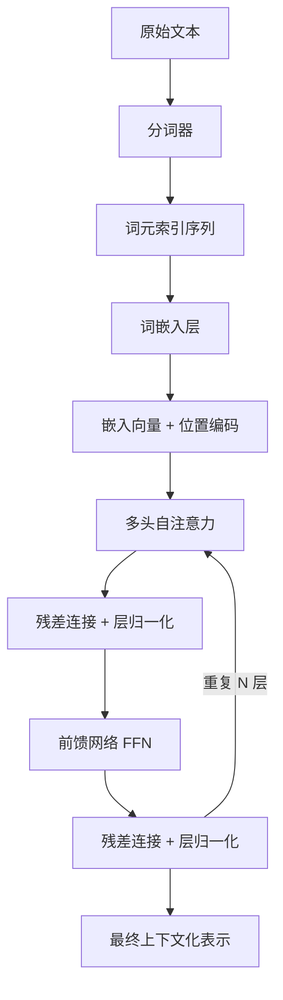
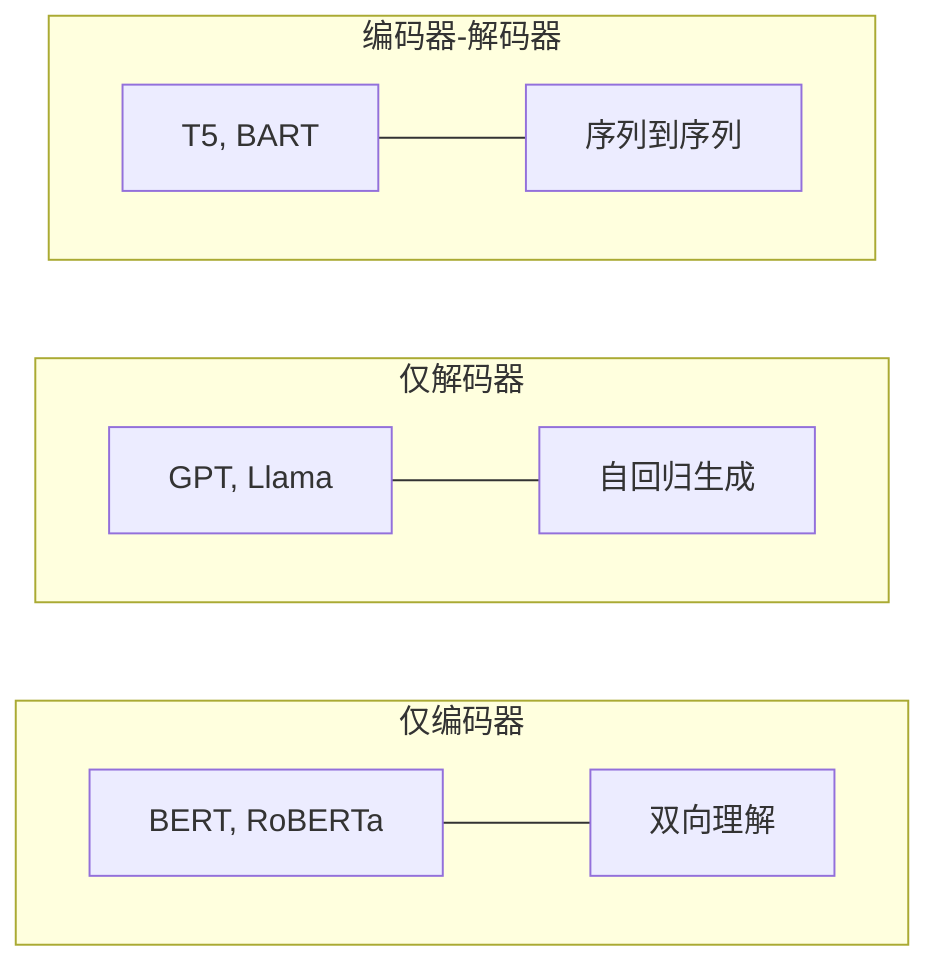

## 3.7 编码器-解码器：完整架构如何协同工作

前面的章节分别介绍了 Transformer 的各个组件。现在，将它们组装起来，理解完整架构的信息流动和各组件之间的协同关系。

下图展示了一个 Transformer 编码器层的完整数据流——从原始文本输入到上下文化的表示输出：

图 3-6：Transformer 编码器层的完整数据流

### 3.7.1 编码器的信息流

编码器由 $N$ 个相同结构的层堆叠而成（原始论文中 $N = 6$）。对于输入序列“I love machine learning”：

1. **词元化与嵌入**：将文本分割为词元，通过嵌入层转化为向量，并加上位置编码
2. **第 1 层自注意力**：每个词元关注所有其他词元，建立初步的上下文关系
3. **第 1 层残差 + 归一化**：保留原始信息，稳定数值
4. **第 1 层 FFN**：对每个位置独立进行非线性变换，存储和提取知识
5. **第 1 层残差 + 归一化**：同上
6. **重复 2-5 步**：经过 $N$ 层后，每个位置的表示已经融合了整个序列的上下文信息

关键洞察：**随着层数的增加，表示从底层的局部语法特征逐渐演化为高层的全局语义特征。** 底层注意力头可能关注相邻词汇，高层注意力头可能关注远距离的语义依赖。

### 3.7.2 解码器的信息流

解码器同样由 $N$ 层堆叠而成，但每层多了一个交叉注意力子层。以翻译“I love machine learning”为“我热爱机器学习”为例：

1. **已生成词元的嵌入 + 位置编码**：当前已生成了“我 热爱”
2. **掩码自注意力**：让“热爱”关注“我”和自己，但不能看到未来的“机器学习”
3. **交叉注意力**：让“热爱”查看编码器对“I love machine learning”的表示，找到对应的源语言上下文表示
4. **FFN**：对每个位置进行独立变换
5. **线性层 + Softmax**：将最后一个位置的表示映射到词汇表大小的概率分布，预测下一个词“机器”

### 3.7.3 为何要重复堆叠 N 层？

在 Transformer 架构中，将相同的网络结构（编码器层或解码器层）重复 $N$ 层进行堆叠，其核心目的是为了实现 **特征的层级抽象** 与 **深度的信息融合**。具体原因包括：

1. **从局部语法到全局语义的演化**：底层的层（浅层）往往倾向于关注局部的表面特征（例如短语搭配、相邻词汇等基本语法属性）；而高层的层（深层）则能基于底层提取出的特征进行整合，从而捕捉远距离的依赖关系和更加抽象的全局语义意图。
2. **多跳推理与深度上下文融合**：每一层的自注意力机制都会让一个词去“看”句子中的其他所有词，并吸收相关信息。当重复了 $N$ 层之后，这就变成了一个迭代更新的过程。这种多轮次的信息交换，使得大模型能够进行类似于“多跳推理”的复杂逻辑运算（例如跨越多句话的代词指代消解）。
3. **扩大模型容量与知识存储能力**：单个注意力层和前馈网络（FFN）所包含的参数量与表达能力是有限的。通过垂直堆叠 $N$ 层，模型的参数量成倍增加。特别是每层独立存在的 FFN，被认为是 Transformer 存储“世界知识”和进行复杂非线性映射的关键组件。
4. **渐进式的特征提纯**：每一层都遵循一套标准的数据流（注意力 $\rightarrow$ 残差与归一化 $\rightarrow$ FFN）。在经过 $N$ 次循环打磨后，原始的词嵌入向量会被一步步“提纯”和“加工”，最终变成一个高度浓缩了当前整个上下文语境、随时可以用于准确预测下一个词（或分类）的终态向量表示。

简而言之，仅仅一层网络只能做浅层的模式匹配，而 **重复 N 层则赋予了模型足够的“思考深度”**，让其能够从理解简单的字词表面，逐层深入到理解句子背后的复杂逻辑与全局含义。

### 3.7.4 三种架构变体

基于编码器和解码器的组合方式，Transformer 衍生出三种主流架构变体：

图 3-7：三种 Transformer 架构变体及代表模型

**仅编码器（Encoder-Only）**：使用全双向的自注意力，擅长理解型任务（分类、序列标注、问答）。代表模型：BERT、RoBERTa。

**仅解码器（Decoder-Only）**：使用因果掩码的自注意力，擅长生成型任务（文本生成、对话）。代表模型：GPT 系列、Llama、DeepSeek。这是当前大语言模型的主流架构。

**编码器-解码器（Encoder-Decoder）**：编码器处理输入，解码器生成输出，适合序列到序列任务（翻译、摘要）。代表模型：T5、BART。

值得注意的是，仅解码器架构在大规模上展现出了出色的通用性——GPT-3 以后的实践表明，足够大的自回归语言模型可以通过提示方式完成几乎所有 NLP 任务，包括原本被认为需要双向编码器的理解型任务。这也是为什么仅解码器架构成为了大模型时代的主流选择。

### 3.7.5 多查询与分组查询注意力

在标准多头注意力中，每个注意力头都有独立的查询、键、值投影矩阵，KV 缓存（详见[第十章](../10_inference_optimization/10.2_kv_cache.md)）的显存消耗随头数线性增长。为了降低推理成本，研究者提出了两种高效变体：

**多查询注意力**（Multi-Query Attention，MQA）让所有查询头共享**同一组**键和值投影，KV 缓存减少为原来的 $1/h$（$h$ 为头数）。这大幅降低了推理时的显存占用和访存带宽需求，但在部分任务上质量略有下降。

**分组查询注意力**（Grouped-Query Attention，GQA）是 MQA 和标准多头注意力之间的折中：将查询头分为若干组，每组共享一组键和值。例如 Llama 2（70B）和 Llama 3 使用 8 组 KV 头，在保持接近标准多头注意力的质量的同时，显著降低了推理成本。

GQA 已成为 2024 年以后几乎所有主流大模型的标配（Llama 2/3、Gemini、Mistral、DeepSeek 等），是工程实践中不可忽视的架构选择。

### 3.7.6 参数共享与权重绑定

Transformer 中有一个值得注意的参数共享设计：在原始论文和大多数后续模型中，**输入嵌入层和输出预测层共享权重矩阵**。

输出层需要将 $d_{\text{model}}$ 维的隐藏状态映射为 $V$ 维的概率分布（$V$ 是词汇表大小）。这个线性映射的权重矩阵恰好与嵌入矩阵的转置形状相同（$d_{\text{model}} \times V$）。共享这两个矩阵不仅减少了参数量，还在语义上有合理性：**嵌入层学到的词向量空间与输出层的预测空间应该是一致的。**

这种权重绑定（Weight Tying）在中小规模模型中效果显著。在超大规模模型（70B 及以上）中，绝大多数模型已不再使用这种绑定，以给输入和输出更大的独立表示能力。
