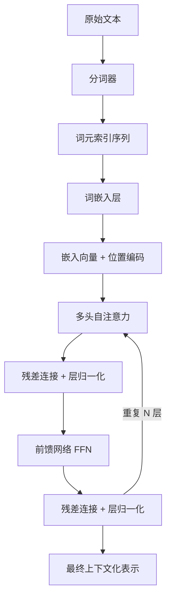
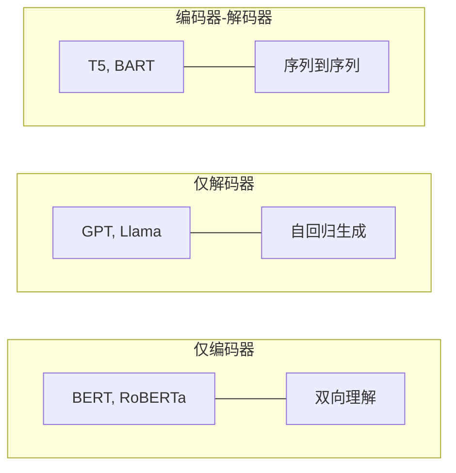
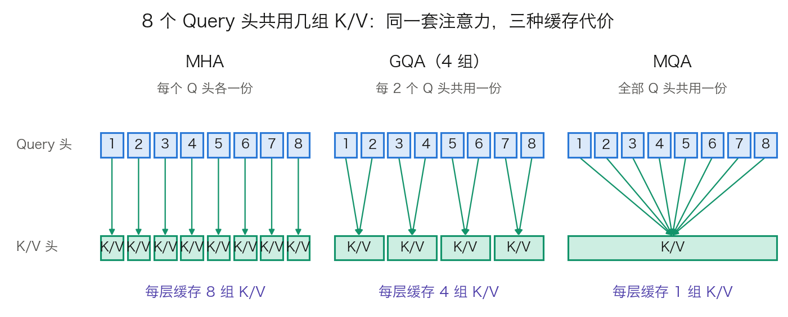

## 3.7 编码器-解码器：完整架构如何协同工作

六节下来，零件已经齐了：词元与词表、嵌入矩阵、位置编码、FFN、残差、归一化。缺的只是接线图：谁先算、谁的输出接谁的输入、$$N$$ 层之间如何首尾相连。

本节先走通编码器与解码器两条信息流，再说明为什么仅解码器成为主流、现代层与原始层差在哪里，最后给出一套只凭 `config.json` 就能算出参数量、KV 缓存与训练算力的方法。

图 3-7 是一个 Transformer 编码器层的完整数据流。

```mermaid
flowchart TD
    A["原始文本"] --> B["分词器"]
    B --> C["词元索引序列"]
    C --> D["词嵌入层"]
    D --> E["嵌入向量 + 位置编码"]
    E --> F["多头自注意力"]
    F --> G["残差连接 + 层归一化"]
    G --> H["前馈网络 FFN"]
    H --> I["残差连接 + 层归一化"]
    I -->|"重复 N 层"| F
    I --> J["最终上下文化表示"]
```

图 3-7：Transformer 编码器层的完整数据流。图中画的是 Post-Norm 接线（归一化在残差相加之后），即原始论文与 BERT 的做法；Pre-Norm 的接线见 [3.6.5 节](3.6_layer_norm.md)的图 3-6 与 [3.8.6 节](3.8_gpt_inference_flow.md)的图 3-14。

### 3.7.1 编码器的信息流

编码器由 $$N$$ 个同构层堆叠（原始论文 $$N = 6$$）。以输入“I love machine learning”为例：

1. 词元化与嵌入：文本切成词元，查表得向量，加上位置编码。
2. 自注意力：每个位置读取全部位置（双向，无掩码），建立上下文关系。
3. 残差与归一化：把注意力输出加回残差流，并归一化。
4. FFN：对每个位置独立做非线性变换。
5. 残差与归一化：同上。
6. 重复 2 到 5 步：$$N$$ 层之后，每个位置的表示都融合了整条序列。

编码器的输出是 `[T, d_model]`，每个输入位置各一行。它不产生新词元，只产生表示。

关于“底层学局部语法、高层学全局语义”的说法：探针研究与注意力可视化给出了一些支持，但这是一条统计上的倾向，不是层的硬分工。可检验的结论在 3.7.3。

### 3.7.2 解码器的信息流

解码器每层比编码器多一个交叉注意力子层，一层里因此有三处残差与三处归一化。以翻译“I love machine learning”为“我热爱机器学习”为例，设已生成“我 热爱”：

1. 嵌入与位置：已生成词元查表得向量，加上位置信息。
2. 掩码自注意力 + 残差 + 归一化：“热爱”能看到“我”和自己，看不到未来位置。
3. 交叉注意力 + 残差 + 归一化：Query 来自解码器当前表示，Key 与 Value 来自编码器最后一层的输出。
4. FFN + 残差 + 归一化：逐位置变换。
5. 重复 $$N$$ 层，最后一层的最后一行经 LM head 与 Softmax，得到下一个词元的分布。

两处细节决定了工程行为。

**交叉注意力的 K、V 只算一次。** 编码器最后一层的输出在整个生成过程中不变，每个解码器层用自己的 $$W_K$$、$$W_V$$ 把它投影一次并缓存；此后每生成一个词元，只需算新的 Query。这与解码器自注意力的 KV 缓存是两件事：前者长度固定为源序列长度，后者随生成变长。

**训练时不逐词元进行。** 训练用**教师强制**（teacher forcing）：把目标序列整体右移一位作为解码器输入，一次前向就算出所有位置的预测，损失在全部目标位置上同时计算。因果掩码保证位置 $$i$$ 看不到位置 $$i$$ 之后的目标词元。逐词元只发生在推理时（见 [2.4 节](../02_attention/2.4_self_cross_causal.md)与 [3.8 节](3.8_gpt_inference_flow.md)）。

### 3.7.3 为什么要重复堆叠 $$N$$ 层

“多层带来更深的思考”这类说法无法检验。两条可检验的事实更有用。

**其一：某些算法必须至少两层才能实现。** 最清楚的例子是归纳头（induction head）：它由两个头组成，前一层的“前序词元头”把“上一个词元是谁”搬到当前位置，后一层的匹配头据此回头查找，实现“序列中出现过 [A][B]，再遇到 [A] 就预测 [B]”。一层注意力做不到这件事，因为“把信息搬过来”和“据此再查一次”必须分两步（见 [14.8 节](../14_future_trends/14.8_interpretability.md)）。层数因此是可组合算法的步数预算，而不只是容量。

**其二：固定参数量下，深度与宽度可以大幅互换。** [Kaplan 等人](https://arxiv.org/abs/2001.08361)的实测结论是“Performance depends strongly on scale, weakly on model shape”，其图 5 注中写道“Aspect ratio in particular can vary by a factor of 40 while only slightly impacting performance”，并举例 $$(n_{\text{layer}}, d_{\text{model}}) = (6, 4288)$$ 的模型与 $$(48, 1600)$$ 的 GPT-2 相比，损失相差在 3% 以内。

两条合起来给出一个平衡的判断：深度提供组合步数，宽度提供每步的容量；在很宽的范围内两者可以互换，但深度不能压到算法所需的步数以下。真实模型的取法见 [3.8.6 节](3.8_gpt_inference_flow.md)的表 3-25：从 GPT-3 Small 到 Llama 3 405B，层数从 12 增到 126，宽度从 768 增到 16,384，两者一起长。

### 3.7.4 三种架构变体，以及仅解码器为何胜出

按编码器与解码器的组合方式，Transformer 有三种主流变体，见图 3-8。

```mermaid
flowchart TD
    subgraph ed["编码器-解码器"]
        ed1["T5, BART"]
        ed2["序列到序列"]
        ed1 --- ed2
    end

    subgraph do["仅解码器"]
        d1["GPT, Llama"]
        d2["自回归生成"]
        d1 --- d2
    end

    subgraph eo["仅编码器"]
        e1["BERT, RoBERTa"]
        e2["双向理解"]
        e1 --- e2
    end

    ed ~~~ do
    do ~~~ eo
```

图 3-8：三种 Transformer 架构变体及代表模型。

**仅编码器**用全双向自注意力，输出表示而非词元，适合分类、序列标注、检索（BERT、RoBERTa，见[第十二章](../12_encoder_models/README.md)）。**仅解码器**用因果掩码，每个位置预测下一个词元（GPT、Llama，见[第十三章](../13_decoder_models/README.md)）。**编码器-解码器**用编码器读输入、解码器写输出，适合序列到序列任务（T5、BART）。

仅解码器胜出的原因不是“通用性”这样的词，而是三条可以算的账。

**训练信号密度。** 因果语言模型一次前向在每个位置产生一个监督信号，长度 $$T$$ 的序列给出 $$T - 1$$ 个（见 [5.1 节](../05_pretraining/5.1_autoregressive.md)）；掩码语言模型只在被掩盖的约 15% 位置产生信号（见 [5.2 节](../05_pretraining/5.2_masked_lm.md)）。同样的算力，前者从每条序列里榨出的梯度信息多好几倍。

**推理工程。** 多轮对话中，前缀的 KV 缓存可以原样复用，追加内容只需为新词元计算（见 [11.5 节](../11_serving/11.5_prefix_reuse.md)）。编码器的双向表示做不到这一点：输入一变，整条序列的表示都要重算。

**参数利用。** 编码器-解码器把参数分给两侧，其中一侧只处理输入。同样的总参数量，仅解码器全部用在同一条通路上。

**反面证据同样要写。** [Wang 等人 2022 年的大规模对照](https://arxiv.org/abs/2204.05832)在纯无监督预训练后确认“causal decoder-only models trained on an autoregressive language modeling objective exhibit the strongest zero-shot generalization”，但同一实验也发现，“models with non-causal visibility on their input trained with a masked language modeling objective followed by multitask finetuning perform the best among our experiments”。仅解码器的胜出是预训练目标、工程复用与规模化三者综合的结果，不是任何单一维度上的完胜。

**从原始层到现代层。** 今天的仅解码器层与 2017 年的原始层，零件几乎逐项换过一遍。表 3-10 把差异列齐，每一行都指向本章前面的某一节。

| 部位 | 原始 Transformer | 现代仅解码器（Llama 式） | 本书对应处 |
| --- | --- | --- | --- |
| 归一化算子 | LayerNorm | RMSNorm | 3.6.6 |
| 归一化位置 | Post-Norm | Pre-Norm，末端再加一次 | 3.6.5 |
| FFN 激活 | ReLU，两个矩阵 | SwiGLU，三个矩阵 | 3.4.5 |
| FFN 宽度 | `4 d` | `2.7 d` 到 `3.5 d` | 3.4.4 |
| 位置编码 | 正弦，输入端相加 | RoPE，每层注意力内部旋转 | 3.3.5 |
| 注意力 | 多头，`n_kv = n_h` | GQA，`n_kv` 远小于 `n_h` | 3.7.5 |
| 偏置项 | 只有 FFN 的 `b₁`、`b₂`；注意力投影本来就无偏置 | 线性层普遍无偏置 | 3.4.1 |
| 权重绑定 | 输入输出共享 | 视词表占比而定 | 3.7.6 |

表 3-10：原始 Transformer 层与现代仅解码器层的逐项对照。偏置那一行常被记反：1706.03762 的多头注意力写作 $$\text{Concat}(\text{head}_i)W^O$$、$$\text{head}_i = \text{Attention}(QW_i^Q, KW_i^K, VW_i^V)$$，全文不出现偏置项，只有 FFN 的 $$\max(0, xW_1+b_1)W_2+b_2$$ 带两个。真正给注意力投影加上偏置的是 GPT-2 一路：HF 实现里这些投影是 `Conv1D`，该模块无条件持有一个 `bias` 参数。Llama 一侧的做法可由 `config.json` 直接确认：`hidden_act`、`rms_norm_eps`、`intermediate_size`、`rope_theta`、`num_key_value_heads`、`attention_bias`、`mlp_bias`、`tie_word_embeddings` 各对应表中一行。另有一类改动本表未列：PaLM、GPT-J 采用的并行块把注意力与 FFN 并联在同一次归一化之后，而不是串联。

### 3.7.5 多查询与分组查询注意力

标准多头注意力里，每个头有自己的 K、V 投影，KV 缓存随头数线性增长。两个变体沿这条线做削减。

**多查询注意力**（Multi-Query Attention，MQA）让所有 Query 头共用同一组 K、V，KV 缓存减到原来的 $$1/n_h$$。**分组查询注意力**（Grouped-Query Attention，GQA）是中间档：Query 头分成 $$n_{kv}$$ 组，每组共用一组 K、V。图 3-9 画出三者的对应关系。

图 3-9：8 个 Query 头共用几组 K/V（[生成脚本](https://github.com/yeasy/llm_internals/blob/main/tools/figures/ch03_gqa_heads.py)）。蓝色是 Query 头，青绿色是它们共用的 K/V 头。注意力的计算步骤三者完全相同，差别只在每层要缓存几组 K/V。

**形状怎么变。** $$W_Q$$ 与 $$W_O$$ 仍是 `[d, d]`；$$W_K$$、$$W_V$$ 变成 `[d, n_kv × d_h]`。Llama 3 8B 的 `num_key_value_heads = 8`、`num_attention_heads = 32`、`d_h = 128`，所以 $$W_K$$、$$W_V$$ 各是 `[4096, 1024]`。算注意力分数时，每组 K/V 要被复制 $$n_h / n_{kv} = 4$$ 份与对应的 Query 头配对，HF 实现里这一步是 `repeat_kv`。

**缓存账。** 每个词元每层要存的 K/V 元素数是 `2 × n_kv × d_h`，全模型是 `2 × L × n_kv × d_h`。Llama 3 8B 是 `2 × 32 × 8 × 128 = 65,536` 个数，BF16 下 131,072 字节，即每词元 128 KiB。若改回多头（`n_kv = 32`），同一模型是 512 KiB，正好 4 倍。按 8K 上下文算，一条请求的 KV 缓存从 4 GiB 降到 1 GiB。完整推导与分页管理在 [10.2 节](../10_inference_optimization/10.2_kv_cache.md)与 [11.4 节](../11_serving/11.4_kv_memory_management.md)。

**质量代价。** [GQA 论文](https://arxiv.org/abs/2305.13245)的结论是“MQA can lead to quality degradation”，而“uptrained GQA achieves quality close to multi-head attention with comparable speed to MQA”。GQA 是这条取舍曲线上的折中点，不是免费的。

Llama 2 的 70B、Llama 3 全系与 Mistral 均采用 GQA；[Llama 3 论文](https://arxiv.org/abs/2407.21783)的措辞是“We use grouped query attention (GQA; Ainslie et al. 2023) with 8 key-value heads to improve inference speed and to reduce the size of key-value caches during decoding”。并非所有现代模型都走这条路：DeepSeek-V2 起改用 MLA，把所有头的 K、V 压成一个低维隐向量再缓存，方向与 GQA 不同（见 [10.2.7 节](../10_inference_optimization/10.2_kv_cache.md)与 [13.3 节](../13_decoder_models/13.3_deepseek_gemini.md)）。未公开架构的闭源模型不宜列入任何一侧。

### 3.7.6 参数共享与权重绑定

输入嵌入与输出 LM head 的形状互为转置，因此可以共用同一张矩阵，即**权重绑定**（Weight Tying）。原始 Transformer、GPT-2、BERT 都这样做。

取舍的判据已在 [3.2.4 节](3.2_embedding.md)量化：词表矩阵占总参数的比例。GPT-2 small 是 31.0%，不绑定意味着模型凭空大三成；Llama 3 405B 只有 1.0%，绑定省下的参数可以忽略，不如让输入表示与输出预测各自优化。

因此规律是随规模变化的：小尺寸或大词表模型倾向绑定，大模型倾向不绑定。判断一个模型属于哪一档，直接看 `config.json` 里的 `tie_word_embeddings`。

### 3.7.7 参数量与计算量的速算

三条估算式在实践中反复用到。它们不是精确公式，而是**数量级工具**。

**单层参数量 $$\approx 12 d^2$$。** 多头注意力有 $$W_Q, W_K, W_V, W_O$$ 四个 $$d \times d$$ 矩阵，合计 $$4d^2$$；4 倍宽的两矩阵 FFN 合计 $$8d^2$$。两者相加：

$$N \approx 12 L d^2$$

**这条式子有两个未声明的前提**：注意力是多头（$$n_{kv} = n_h$$），FFN 是 4 倍宽的两矩阵版本。Llama 3 两条都不满足。

先看一个逐项相加的精确账。表 3-11 用 Llama 3 8B 的 `config.json` 算出全部参数。

| 部位 | 形状 | 参数量 | 折合 |
| --- | --- | ---: | --- |
| `q_proj` | `[4096, 4096]` | 16,777,216 | `1.0 d²` |
| `k_proj` | `[4096, 1024]` | 4,194,304 | `0.25 d²` |
| `v_proj` | `[4096, 1024]` | 4,194,304 | `0.25 d²` |
| `o_proj` | `[4096, 4096]` | 16,777,216 | `1.0 d²` |
| `gate_proj`、`up_proj`、`down_proj` | 各 `4096 × 14336` | 176,160,768 | `10.5 d²` |
| 每层两个 RMSNorm | 各 `[4096]` | 8,192 | — |
| **每层合计** | | **218,112,000** | `13.0 d²` |
| 32 层 | | 6,979,584,000 | |
| `embed_tokens` | `[128256, 4096]` | 525,336,576 | |
| `lm_head` | `[128256, 4096]` | 525,336,576 | |
| `model.norm` | `[4096]` | 4,096 | |
| **总计** | | **8,030,261,248** | |

表 3-11：Llama 3 8B 的逐项参数账，全部由 `config.json` 的七个字段算出：`num_hidden_layers = 32`、`hidden_size = 4096`、`num_attention_heads = 32`、`num_key_value_heads = 8`、`intermediate_size = 14336`、`vocab_size = 128256`、`tie_word_embeddings = false`。`d_h = hidden_size / num_attention_heads = 128`，故 `k_proj`、`v_proj` 的列数是 `8 × 128 = 1024`。总计 80.3 亿，与标称的 8B 吻合。本书其他小节在算矩阵乘法或权重访存时只数七个矩阵，每层记 218,103,808、32 层记 6,979,321,856；与本表相差的 8,192 正是每层两个 RMSNorm，它们不参与矩阵乘法。

同一张表可以套到任何 Llama 式模型上，只要把七个字段换掉。表 3-12 把 $$12Ld^2$$ 与四个模型的逐项账放在一起对比。

| 模型 | 注意力/层 | FFN/层 | 逐项总计 | `12Ld²` | 偏差 |
| --- | --- | --- | ---: | ---: | ---: |
| Llama 2 7B | `4.00 d²` | `8.06 d²` | 6,738,415,616 | 6,442,450,944 | −4.4% |
| Llama 3 8B | `2.50 d²` | `10.50 d²` | 8,030,261,248 | 6,442,450,944 | −19.8% |
| Llama 3 70B | `2.25 d²` | `10.50 d²` | 70,553,706,496 | 64,424,509,440 | −8.7% |
| Llama 3 405B | `2.13 d²` | `9.75 d²` | 405,853,388,800 | 405,874,409,472 | +0.0% |

表 3-12：`12Ld²` 与逐项账的偏差。405B 上几乎完全吻合，但这是抵消的结果而非公式仍然精确：GQA 把注意力项从 `4 d²` 压到 `2.13 d²`，FFN 从 `8 d²` 放宽到 `9.75 d²`，再加上占 1.0% 的词表矩阵，三者正好凑回 `12 d²`。同一公式用在 8B 上低估近两成，因为那里词表占 13.1%，抵消关系不成立。

结论：`12Ld²` 适合估计同代模型的量级，不适合替代逐项相加。手边有 `config.json` 时，用表 3-11 的方法。

**训练每词元约 $$6N$$ 次浮点运算。** 矩阵乘法里每个参数对应一次乘加，[乘加算两次浮点运算](https://arxiv.org/abs/2001.08361)，故前向约 $$2N$$；反向要同时算输入梯度与权重梯度，代价约为前向的两倍，即 $$4N$$。合计

$$C \approx 6ND$$

$$D$$ 是训练词元总数。代入 Llama 3 405B：$$N = 4.05 \times 10^{11}$$，论文自报的 $$D = 15.6 \times 10^{12}$$ 词元，得 $$6ND \approx 3.79 \times 10^{25}$$ FLOPs，与论文自报的“pre-trained using $$3.8 \times 10^{25}$$ FLOPs”一致。这条式子是 Scaling Law 讨论的地基，[5.4 节](../05_pretraining/5.4_data_scaling.md)里 Chinchilla 的结论就是在这个约束下解出来的。

**推理每词元约 $$2N$$ 次浮点运算**，即只有前向那一份。训练与推理相差 3 倍。

**共同失效边界。** 三条式子只数了权重，没数注意力自身的 $$O(T^2)$$ 项。一层的计算量约为 $$24Td^2 + 2T^2d$$（推导见 [3.8.7 节](3.8_gpt_inference_flow.md)），两项之比正是

$$\frac{2T^2d}{24Td^2} = \frac{T}{12d}$$

Kaplan 等人用的判据是同一个：“For contexts and models with $$d_{\text{model}} > n_{\text{ctx}}/12$$, the context-dependent computational cost per token is a relatively small fraction of the total compute.” 注意 $$T = 12d$$ 是两项相等的点，不是“开始不能忽略”的点。对 $$d = 4096$$ 的模型，$$12d = 49{,}152$$，各档上下文下的占比见表 3-13。

| 上下文长度 | `T / (12d)` | 注意力项占一层计算量 |
| --- | ---: | ---: |
| 2,048 | 0.042 | 4.0% |
| 8,192 | 0.167 | 14.3% |
| 49,152 | 1.000 | 50.0% |
| 131,072 | 2.667 | 72.7% |

表 3-13：`d = 4096` 时注意力项随上下文长度的占比。第三列由第二列换算：记 `r = T / (12d)` 为两项之比，注意力项占一层计算量就是 `r / (1 + r)`，例如 `0.167 / 1.167 = 14.3%`。8K 上下文下已占一成四，到 128K 则反超权重项。长上下文因此是一个独立的工程问题（见 [14.7 节](../14_future_trends/14.7_long_context.md)），不能把同一套估算往大了套。

对 MoE 模型，$$6ND$$ 里的 $$N$$ 要取**激活参数量**而非总参数量，这正是 MoE 能在固定算力预算下堆更大总参数的原因（见 [14.2 节](../14_future_trends/14.2_moe.md)）。

零件与接线都已齐备。下一节把它们接通电源，走一遍真实的生成流程。
