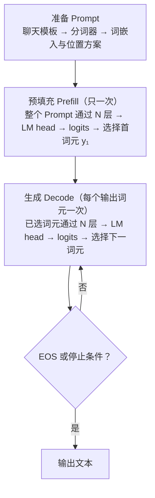
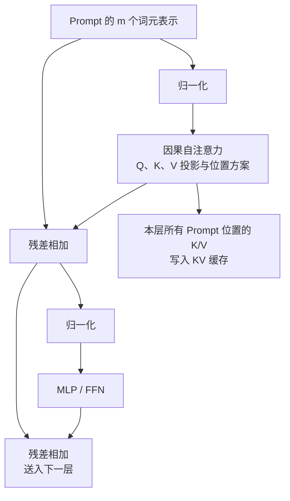
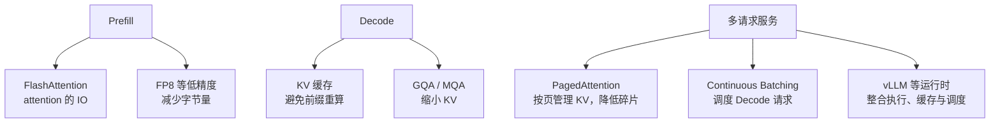

## 3.8 GPT 式仅解码器：一次回答如何生成

前面各节已经拆开了分词、嵌入、位置、注意力、前馈网络、残差和归一化。现在把它们接成一条实际的生成路径：一条聊天请求如何变成第一个输出词元，随后又如何一个词元接一个词元地完成回答。

本节描述的是公开可验证的**GPT 式仅解码器**（Decoder-Only）Transformer 抽象。它解释可观察的数值计算，不声称复原任何闭源 GPT 模型未公开的层数、注意力变体、路由机制或内部推理轨迹。不同模型的聊天模板、位置方案、归一化顺序和解码策略会不同，但下面的因果生成主线相同。

### 3.8.1 先看完整时间线

假设用户询问“请用一句完整的话回答：2 + 3 等于几？”。聊天模型通常不会只把这句话直接交给分词器；系统消息、用户消息、角色边界和助手起始位置会先按模型自己的**聊天模板**序列化。为避免把某个模型的分词规则误当成通则，下面将所得词元写成 t₁、t₂、…、tₘ，不展示虚构的词元 ID。

为清晰展示连续 Decode，假设选出的词元在解码后依次显示为“答案”“是”“ 5”“。”和 EOS。它们只是教学标记，不代表任何具体分词器的真实切分；下文以 y₁、y₂、y₃、y₄ 指代这一假设序列。

一次请求的第一枚输出词元和后续词元并不走同样大小的输入：前者来自对整个 Prompt 的预填充，后者来自一次只处理一个新词元的生成循环。

图 3-8：GPT 式仅解码器模型从 Prompt 到逐词元输出的时间线。

这张图最重要的不是术语，而是时间顺序：**Prompt 只做一次 Prefill；每个输出词元都要完成一轮 Decode，成为已知上下文后才能触发下一轮。**

### 3.8.2 从 Prompt 到首个词元

#### 聊天模板、分词和初始表示

聊天模板把“谁说的话、说给谁听”编码为一个有顺序的输入序列。分词器再把该序列映射到词表索引，嵌入矩阵将每个索引查表为 d_model 维向量。这正是 [3.1 节](3.1_tokenization.md)和[3.2 节](3.2_embedding.md)所说的从文本到连续表示的过程。

仅有词嵌入仍无法区分“甲在乙前”与“乙在甲前”，因此模型还要注入位置信息。原始 Transformer 会把位置向量加到嵌入上；采用 RoPE 的现代模型通常在每层注意力内部对 Q/K 施加位置相关旋转。两者的落点不同，但目的相同：让注意力能区分位置和相对距离。位置方案的完整比较见[第四章](../04_position_encoding/README.md)。

#### Prefill：整段 Prompt 一次通过模型

设 Prompt 长度为 m，初始表示组成矩阵：

$$H^{(0)} \in \mathbb{R}^{m \times d_{\text{model}}}$$

Prefill 将这 m 个已有位置同时送入 N 个 Transformer block。以常见的预归一化抽象为例，第 ℓ 层可写成：

$$U^{(\ell)} = H^{(\ell-1)} + \operatorname{Attention}\left(\operatorname{Norm}\left(H^{(\ell-1)}\right)\right)$$

$$H^{(\ell)} = U^{(\ell)} + \operatorname{MLP}\left(\operatorname{Norm}\left(U^{(\ell)}\right)\right)$$

其中注意力负责在词元位置之间路由信息，MLP/FFN 负责逐位置的非线性变换；残差连接与归一化保持深层计算稳定。原始 Transformer 的 Post-Norm、现代模型常见的 Pre-Norm 或 RMSNorm 在排列上不同，但不改变这里的主线。

每个位置都能并行计算，并不表示它能偷看未来。因果掩码规定位置 i 只能关注不晚于它的位置，因此 tᵢ 的表示只依赖 t₁、…、tᵢ。这也是训练时可并行计算整段序列、而预测目标仍保持“下一个词元”的原因，具体掩码机制见 [2.4 节](../02_attention/2.4_self_cross_causal.md)。

下面的图把一层中的计算和跨层状态放在一起。每一层都有独立参数，也各自保存一份 Prompt 的 Key/Value。

图 3-9：Prefill 中一个 Transformer block 的计算，以及本层 K/V 缓存的来源。

最后一个 Prompt 位置的表示 hₘ 汇集了可见上下文。LM head 将它线性映射到词表大小的 **logits**：每个候选词元一个未归一化分数。概念上，可对 logits 做 Softmax 得到概率分布，再以贪心、温度、Top-p 等策略选择 y₁；工程实现常将这些步骤融合执行，未必在显存中显式保存完整概率数组。不同选择策略的权衡见[第九章](../09_decoding/README.md)。

### 3.8.3 Decode：每次只推进一个词元

选出 y₁ 后，模型仍不知道 y₂。它必须先把 y₁ 当作位置 m + 1 的新输入，完成一次完整的前向计算，再根据该位置的 logits 选择 y₂。这就是自回归生成的因果约束。

对于每一层，新位置只需计算自己的 Q、K、V。它的 Query 与该层缓存中的历史 K/V（以及自己的 K/V）计算注意力；新 K/V 随后追加到该层缓存。新的隐藏状态仍必须经过 MLP、输出投影以及后续所有层，KV 缓存并没有把一次 Decode 变成常数成本。

用上面的教学序列追踪，y₂ 的来历就很具体：Prefill 处理 t₁、…、tₘ 后，末位置 logits 选出 y₁，解码片段为“答案”；第一轮 Decode 将 y₁ 作为位置 m + 1 的输入，才得到选择 y₂ 的 logits，解码片段为“是”。之后每轮完全相同：新选出的词元成为下一轮唯一的新输入。

| 阶段 | 本轮新增输入 | 本轮 logits 选出 | 已显示的回答 |
| --- | --- | --- | --- |
| Prefill | 完整 Prompt：t₁、…、tₘ | y₁：“答案” | 答案 |
| 第 1 轮 Decode | y₁：“答案” | y₂：“是” | 答案是 |
| 第 2 轮 Decode | y₂：“是” | y₃：“ 5” | 答案是 5 |
| 第 3 轮 Decode | y₃：“ 5” | y₄：“。” | 答案是 5。 |
| 第 4 轮 Decode | y₄：“。” | EOS | 停止 |

表 3-1：教学序列中，每轮 Decode 的输入是上一轮已选出的词元，输出才是下一个词元；表中的中文片段不代表真实 tokenizer 的切分。

将两个阶段并列比较，差异会更清楚：

| 维度 | Prefill | Decode |
| --- | --- | --- |
| 发生次数 | 每个请求一次 | 每个输出词元一次 |
| 输入 | 全部 Prompt 词元 | 上一轮已选出的一个词元 |
| 单请求内的并行单位 | Prompt 的全部已有位置 | 一个新位置；不同请求可由服务端并行处理 |
| 主要产物 | 首个输出词元，以及每层历史 K/V | 下一个输出词元，以及每层新增 K/V |
| 直觉 | 一次读完题目 | 每写一个词元，再决定下一个 |

表 3-2：Prefill 与 Decode 的输入规模、并行方式和缓存状态不同；单个请求的 Decode 循环不能跳过尚未选出的词元。

可以把一轮 Decode 固定记为四步：

1. 将第 t 轮已选出的词元作为新位置输入；
2. 它穿过全部 Transformer 层，读取每层历史 K/V，并追加自己的 K/V；
3. 最后一层的该位置表示经 LM head 得到下一组 logits，按解码策略选出下一个词元；
4. 只有下一个词元被选定后，下一轮才开始；遇到 EOS、最大长度或外部停止条件才结束。

这里有两个常见误解。第一，KV 缓存保存的是**每层历史词元的 Key/Value**，不是所有中间层输出。第二，缓存避免了重新计算历史前缀的 K/V，却仍要读取越来越长的缓存，并为每个新词元执行全部层的投影、注意力、MLP 和输出计算。因此，输出越长或上下文越长，Decode 的成本不会保持不变。关于这一循环的解码视角，见 [9.1 节](../09_decoding/9.1_autoregressive_decode.md)。

### 3.8.4 同一条流程上的优化地图

前面的路径故意按单请求、未优化的方式描述，目的是先固定正确的因果关系。实际推理优化不改变“选出一个词元，才能继续下一个词元”的依赖；它们改变的是每一步的数据搬运、KV 占用或多请求的调度方式。

图 3-10：优化技术挂在同一条生成流程的不同层次上。

| 技术 | 挂在流程的哪一步 | 主要处理的瓶颈 | 深入阅读 |
| --- | --- | --- | --- |
| FlashAttention | Prefill 和注意力计算 | 注意力中间量的 HBM 读写 | [10.3 节](../10_inference_optimization/10.3_flash_attention.md) |
| FP8 等低精度 | 权重、激活值或 KV 的存取 | 字节量、显存容量和带宽 | [10.4 节](../10_inference_optimization/10.4_quantization.md)、[11.4 节](../11_serving/11.4_hardware.md) |
| GQA/MQA | 模型的注意力结构 | 每个词元须保存的 KV 头数 | [2.3 节](../02_attention/2.3_multi_head.md)、[10.2 节](../10_inference_optimization/10.2_kv_cache.md) |
| KV 缓存 | Decode 的历史上下文 | 历史前缀 K/V 的重复计算 | [10.2 节](../10_inference_optimization/10.2_kv_cache.md) |
| PagedAttention | 多请求 KV 缓存管理 | 碎片化和过度预留 | [11.2 节](../11_serving/11.2_continuous_batching.md) |
| Continuous Batching | 多请求的每个 Decode 步 | 已完成请求留下的批次空洞 | [11.2 节](../11_serving/11.2_continuous_batching.md) |
| vLLM 等推理运行时 | 服务层 | 将执行内核、缓存和调度组织为可用系统 | [11.1 节](../11_serving/11.1_engines_overview.md) |

这些技术不是同一类开关。FlashAttention 是 attention 内核的 IO 优化；GQA/MQA 是模型架构选择；KV 缓存是单请求推理状态；PagedAttention 是该状态的内存管理；Continuous Batching 是请求调度；vLLM 则是将多种机制组织起来的推理运行时。先分清它们各自挂在哪一步，才不会把“模型为什么逐词元生成”和“服务为什么能更快地逐词元生成”混为一谈。
