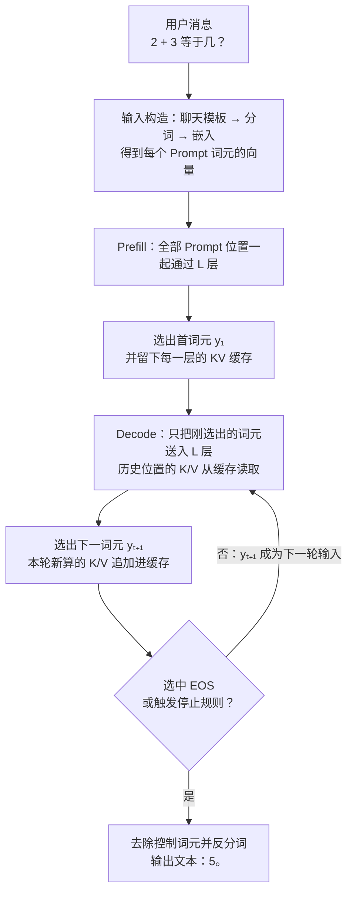
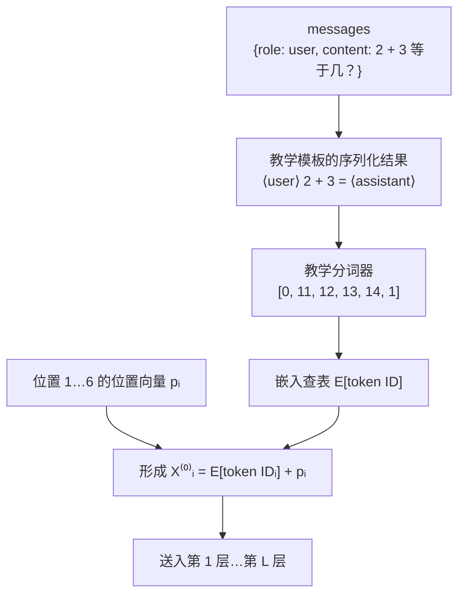
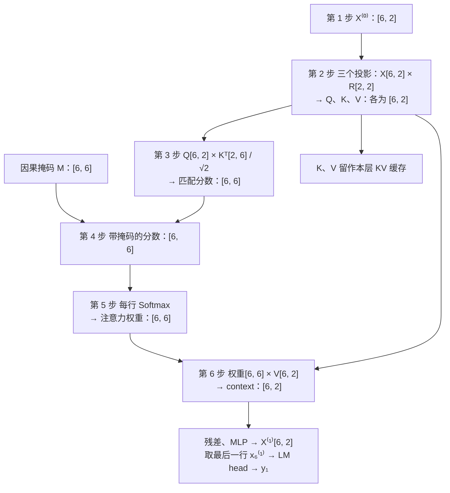
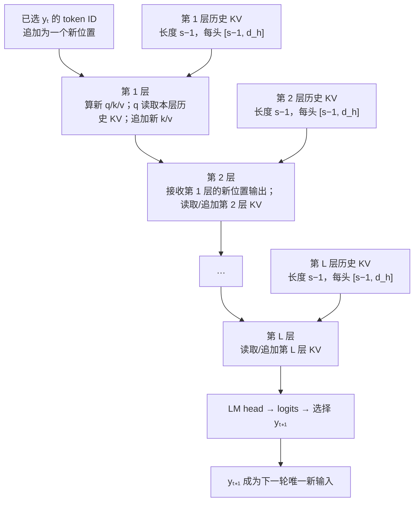
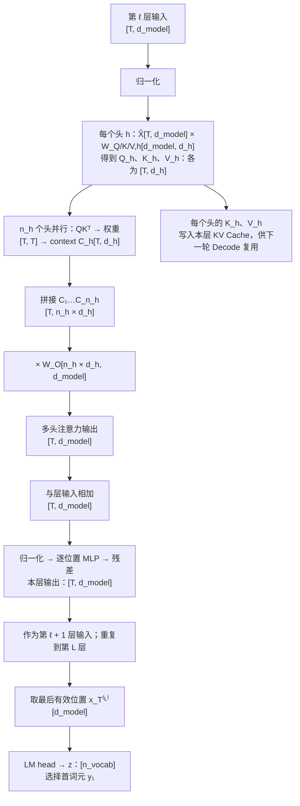
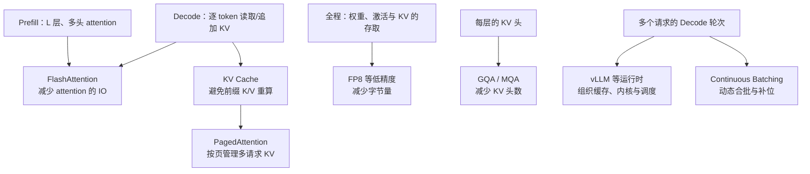
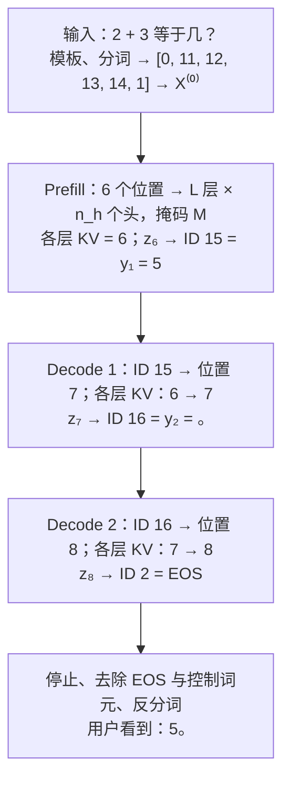

## 3.8 GPT 式仅解码器：一次回答如何生成

以用户提问“2 + 3 等于几？”为例，一次 GPT 式回答不是模型先一次性写好“5。”，再逐字显示出来。它先处理完整输入，并选出第一个输出词元；随后把这个词元加到序列末尾，再计算下一个。选中 EOS 或触发停止规则（如达到最大长度、命中停止字符串）后，生成结束；已选词元经反分词还原为文本，流式输出时则是每选出一个就增量还原一次。

本节讲的是公开仅解码器 Transformer 的**计算流程**，不试图复原任何闭源 GPT 的未公开权重、层数或服务实现。为使每一步可追踪，文中的词元、ID、向量和权重均为教学示意；它们不是任何实际模型的分词结果或参数。

需要先说明一点，免得后文找错重点：本节的教学模型并不会算加法。它输出“5”，只因为权重被手工设成了能得到这个结果的数值；真实模型的权重来自训练（见[第五章](../05_pretraining/README.md)），“会算”的能力存放在那些权重里。本节只回答“数据怎样一步步流过模型”，不回答“权重为什么是这些值”。

阅读路线有两条。只想弄清流程，读 3.8.1、3.8.2 和 3.8.4 中的表 3-9 即可；想亲手验证每个数字，再读 3.8.3 的六步手算。3.8.5 把手算放回真实规模，3.8.6 标出各种优化技术的挂点，3.8.7 回放全程并给出自测题。

### 3.8.1 整体流程：三次前向，换来两个字

先看结果。为了回答“5。”，模型一共做了三次**前向计算**：把一串词元（token，见 [3.1 节](3.1_tokenization.md)）送进模型，从第一层算到最后一层，选出一个输出词元，这算一次前向。

| 第几次前向 | 送进模型的词元 | 模型选出的词元 | 这一次的名称 |
| --- | --- | --- | --- |
| 1 | 完整 Prompt，共 6 个词元：`⟨user⟩ 2 + 3 = ⟨assistant⟩` | `5` | Prefill（预填充） |
| 2 | 只有刚选出的 `5` | `。` | Decode（解码）第 1 轮 |
| 3 | 只有刚选出的 `。` | EOS | Decode 第 2 轮 |

表 3-1：回答“5。”所需的三次前向计算。EOS（end of sequence）是“序列结束”词元，只表示停止，不显示给用户。

这张表里有三件事，后文都围绕它们展开：

- **每次前向只选出一个词元。** 模型算出的不是一段文本，而是“下一个词元”的一组分数；从中选定一个，这次前向就结束了。
- **后一次的输入是前一次的输出。** 在 `5` 被选出之前，第 2 次前向连输入都还不存在。因此同一个回答里的输出词元无法并行产生，只能一个接一个。
- **第 2、3 次只送进一个词元，却仍要“看见”前面的全部内容。** 做法是把第 1 次前向中为每个位置算出的 Key 与 Value（3.8.3 解释）保存下来，后面直接读取，不再重算。这份保存下来的状态叫 **KV 缓存**（KV Cache）。

第 1 次与后两次差别很大，因而各有名称：一次读完整个 Prompt 的叫 Prefill，此后每次只处理一个新词元的叫 Decode。图 3-8 把这三次前向推广为一般流程：一次请求只有一次 Prefill，Decode 则循环到选中 EOS 或触发停止规则为止。

这是未经优化的基本流程，本节始终按它来讲。后面章节会看到，投机解码让一次前向确认多个词元（见 [10.6 节](../10_inference_optimization/10.6_speculative_decoding.md)），分块 Prefill 把长 Prompt 拆成几次前向（见 [11.2 节](../11_serving/11.2_continuous_batching.md)）；它们改变的是每次前向的工作量，不是“后一个词元依赖前一个词元”这条因果顺序。

图 3-8：一次 GPT 推理的整体流程。`y₁`、`y₂` 是逐个选定的输出词元，不是模型预先写好的完整答案；L 是模型的层数。

| 阶段 | 输入 | 输出 | 目的 |
| --- | --- | --- | --- |
| 输入构造 | 消息 | Prompt 的词元 ID、每个位置的初始向量 | 将文本转为模型可计算的向量。 |
| Prefill | 全部 Prompt 位置 | 首词元 `y₁`、每层的 KV 缓存 | 一次读完已知上下文，并选出首个新词元。 |
| Decode | 上一轮已选词元、各层 KV 缓存 | 下一个词元、更新后的 KV 缓存 | 每轮只处理一个新位置，并只选出一个词元。 |
| 结束处理 | 已选词元序列 | 用户可见文本 | 遇到 EOS 或停止条件后，去除控制词元并反分词。 |

表 3-2：整体流程中每个阶段的输入、输出与目的。后文按这张表的顺序展开：3.8.2 讲输入构造，3.8.3 讲 Prefill，3.8.4 讲 Decode 与结束处理。

### 3.8.2 输入边界：消息如何变成初始表示

模型不直接接收一句自然语言。服务端先按该模型的聊天模板，把消息列表排成一串词元；生成时，模板通常还会加入“助手将开始说话”的控制标记。不同模型的模板和特殊词元不同，因此下面固定一套教学模板，不伪造真实模型的 token ID。

图 3-9：消息、模板、词元 ID 和初始表示之间的边界。真实模型的模板与 ID 可以不同，但数据流顺序相同。

图中有两次“由离散变连续”的转换。分词把文本切成词元，并给每个词元一个整数 ID；嵌入查表再按 ID 从词嵌入矩阵 E 中取出对应的一行向量（见 [3.2 节](3.2_embedding.md)）。取出的向量只说明“这是哪个词元”，不说明“它排在第几位”，所以还要加上位置向量 p。两者之和就是该位置进入第 1 层之前的**初始表示**，全部位置合起来记作 X⁽⁰⁾。

为使后面的数值可复算，教学模板把问题写成“⟨user⟩ 2 + 3 = ⟨assistant⟩”。表 3-3 保留了完整 Prompt：模型既看到算式，也看到谁在提问、何时该由助手回答。教学模板还把“等于几？”缩写成了“=”，只为减少词元数；真实聊天模板只添加角色标记，不改写用户内容。位置方面，这里采用“词嵌入加位置向量”的简化方案（见 [3.3 节](3.3_position_encoding.md)）；另一类方案 RoPE 不在输入处相加，而是在每层注意力内部旋转 Query 和 Key 来带入位置（见[第四章](../04_position_encoding/README.md)）。无论哪种，位置信息都在注意力打分之前进入计算。

| 位置 | 教学词元 | 教学 ID | 词嵌入 E | 位置向量 p | 初始表示 X⁽⁰⁾ |
| --- | --- | ---: | --- | --- | --- |
| 1 | `⟨user⟩` | 0 | [0.0, 0.0] | [0.0, 0.0] | [0.0, 0.0] |
| 2 | `2` | 11 | [0.9, -0.1] | [0.1, 0.1] | [1.0, 0.0] |
| 3 | `+` | 12 | [-0.2, 0.8] | [0.2, 0.2] | [0.0, 1.0] |
| 4 | `3` | 13 | [0.7, 0.7] | [0.3, 0.3] | [1.0, 1.0] |
| 5 | `=` | 14 | [0.6, -0.4] | [0.4, 0.4] | [1.0, 0.0] |
| 6 | `⟨assistant⟩` | 1 | [0.5, -0.5] | [0.5, 0.5] | [1.0, 0.0] |

表 3-3：教学 Prompt 的离散 ID 如何成为连续的初始表示。最后一列由它左边的两列（词嵌入 E 与位置向量 p）逐分量相加得到，例如位置 2 是 `[0.9 + 0.1, −0.1 + 0.1] = [1.0, 0.0]`。每个值均为手算设定：词嵌入和位置向量是倒推出来的，为的是让相加后的初始表示只含 0 和 1，后面的乘法可以心算。

为便于跟踪输出，本例再固定三个教学 ID：`15` 对应 `5`，`16` 对应 `。`，`2` 对应 EOS；“其他”代表其余候选。于是后文的 ID `15` 可以直接还原为词元 `5`。

### 3.8.3 Prefill：手算一个注意力头，直到选出首词元

Prefill 要交出两样东西：首词元 y₁，以及留给 Decode 复用的 KV 缓存。它让 6 个位置同时通过一层又一层的 Transformer 计算，每一层对每个位置做两件事：

1. **读**：用因果自注意力，从自己和左边的位置读取信息（见 [2.1 节](../02_attention/2.1_qkv_intuition.md)、[2.2 节](../02_attention/2.2_scaled_dot_product.md)和 [2.4 节](../02_attention/2.4_self_cross_causal.md)）。
2. **加工**：用逐位置的 MLP，对读到的结果做非线性变换（见 [3.4 节](3.4_feedforward.md)）。

两步的结果都通过残差加回原向量（见 [3.5 节](3.5_residual.md)），进入每一步之前通常先做归一化（见 [3.6 节](3.6_layer_norm.md)）。真实模型把“读”分给多个注意力头并行完成（见 [2.3 节](../02_attention/2.3_multi_head.md)），并把这样的层串联 L 次；最后一层的输出再交给 **LM head**，换算成词表中每个词元的分数。

L 层、多头的完整计算无法手算，所以本小节只取**一层中的一个头**，把它用到的每个矩阵都写出来；这个头在完整结构中的位置，留到 3.8.5 的图 3-12 再看。表 3-4 列出会反复出现的符号，不必先记住，遇到时回查即可。

| 符号 | 含义与用途 |
| --- | --- |
| `T`、`n_vocab` | 当前序列的词元数（本例 Prefill 时为 6）、词表大小。 |
| `L` | Transformer 层数；层按 1 到 L 依次执行。 |
| `h`、`n_h`、`n_kv` | 第 h 个注意力头、Query 头总数、K/V 头总数；普通多头注意力中 `n_h = n_kv`，GQA/MQA 中 `n_kv` 可更小。 |
| `i`、`s`、`t` | 词元位置与生成轮次；i 表示任意已有位置，s 表示正在预测下一个词元的位置（Prefill 时是 Prompt 的最后位置，Decode 时是刚追加的新位置），t 表示第 t 个已选输出词元。 |
| `E[idᵢ]`、`pᵢ` | ID `idᵢ` 的词嵌入、位置 i 的位置向量。 |
| `X⁽ˡ⁾`、`xₛ⁽ˡ⁾` | 第 ℓ 层输出的全部位置表示、其中位置 s 的单个向量；`X⁽⁰⁾` 是进入第 1 层前的表示。 |
| `Q`、`K`、`V` | Query、Key、Value：分别表示“当前位置要找什么”“各位置可怎样匹配”“被加权读出的内容”。 |
| `qₛ`、`kₛ`、`vₛ`、`A` | 小写 q、k、v 是 Q、K、V 中位置 s 的那一行；A 是 Softmax 之后的注意力权重。 |
| `d_model`、`d_h`、`M` | 模型表示宽度、每个头的向量宽度、因果掩码；M 将未来位置的分数置为 −∞。 |
| `zₛ`、`yₜ`、EOS | 位置 s 的 logits（各候选词元的未归一化分数）、已选第 t 个输出词元、序列结束词元。 |

表 3-4：本节使用的符号与含义。大写 `X` 表示全部位置，小写 `x` 表示一个位置；公式中的上标 `T` 表示矩阵转置，方括号形状里的 `T` 表示词元数。第 2 章把每头宽度记作 `d_k`、头数记作 `h`、序列长度记作 `n`；本节为了区分 Query 头与 K/V 头，改记 `d_h`、`n_h`、`T`。3.7 节用 `V` 表示词表大小；本节的 `V` 专指 Value，词表大小记作 `n_vocab`。

**教学模型的设定。** 取 `L = n_h = n_kv = 1`、`d_model = d_h = 2`，把计算缩小到能手算的程度：

- `L = 1`：只展开一个 Transformer 层；否则同一套计算要按不同参数重复 L 次。
- `n_h = 1`：只展开一个注意力头；因此不必同时列出多组 Q/K/V 与拼接结果。
- `n_kv = 1`：一头 Query 自然只需一组 K/V。让多个 Query 头共用一组 K/V 的 GQA/MQA 见 [3.7 节](3.7_full_architecture.md)，首次阅读可跳过。
- `d_model = d_h = 2`：每个位置只有两个数，`X` 是 `6 × 2`、投影矩阵是 `2 × 2`，乘法能完整写出。

其余部件一次交代清楚：各处归一化都设为恒等变换（即不改变输入），多头输出投影 `W_O` 也取恒等，MLP 定义为 `0.1 × ReLU(x)`，LM head 不设偏置，打分规则到用时给出。Q/K/V 的投影则使用一个非恒等的、可手算的坐标交换矩阵：

$$
W_Q = W_K = W_V =
R \in \mathbb{R}^{2\times2} =
\begin{bmatrix}
0 & 1 \\
1 & 0
\end{bmatrix}
$$

任何二维向量乘以 R，两个分量就互换位置，例如 `[1, 0]` 变成 `[0, 1]`。选择 R 不是为了模拟训练结果，而是让“乘以投影矩阵确实会改变向量”这件事看得见；R 同时保持点积不变，所以注意力分数仍是简单数字。为缩短本例，三组投影设成相同；真实模型分别学习 `W_Q`、`W_K`、`W_V`，三者通常互不相同。

图 3-10 是接下来六步手算的路线图，每个节点标出了矩阵的形状。

图 3-10：一个注意力头的完整矩阵计算。每个矩阵的第 i 行都对应位置 i；最后一行对应 Prompt 的最后位置 6。context 指每个位置“读到的上下文向量”，第 6 步给出定义。

六步都按同一顺序写：先说这一步要解决什么问题，再给通用公式，然后把其中一格的算术完整写出来，最后给出整张矩阵。只要会算这一格，整张矩阵就是同一种算术的重复。始终跟踪位置 6，是因为它是 Prompt 的最后位置，首个输出词元由它产生。

手算只需要两样工具。一是矩阵乘法的规则：结果的第 i 行第 j 列，等于左边矩阵的第 i 行与右边矩阵的第 j 列逐项相乘再相加。二是几个常数。本例的注意力分数只有 0、`1/√2 ≈ 0.707`、`√2 ≈ 1.414` 三种取值，对应的指数是 `e⁰ = 1`、`e^(1/√2) ≈ 2.028`、`e^√2 ≈ 4.113`；Decode 第 2 轮还会用到 `e^(−1/√2) ≈ 0.493`。本节所有注意力权重都能由这几个数加减乘除得到，普通计算器即可复核；只有 LM head 的概率一列需要计算器上的 eˣ 键。

**第 1 步：排成输入矩阵。** 问题：怎样让 6 个位置一起参与计算？把各位置的向量按行堆叠成一个矩阵，后面每一次矩阵乘法就同时处理了全部位置：

$$
X^{(0)} =
\begin{bmatrix}
x_1^{(0)} \\
\vdots \\
x_T^{(0)}
\end{bmatrix}
\in \mathbb{R}^{T\times d_{\mathrm{model}}}
$$

本例将表 3-3 的最后一列按位置堆叠，得到 `X⁽⁰⁾:[6, 2]`：

$$
X^{(0)} \in \mathbb{R}^{6\times2} =
\begin{bmatrix}
0 & 0 \\
1 & 0 \\
0 & 1 \\
1 & 1 \\
1 & 0 \\
1 & 0
\end{bmatrix}
$$

**第 2 步：投影出 Q、K、V。** 问题：同一个位置既要向别人“提问”，又要被别人“匹配”，还要“提供内容”，一个向量怎样承担三种角色？给它乘三个不同的矩阵，得到三个不同用途的向量：

$$
Q=XW_Q,\quad K=XW_K,\quad V=XW_V
$$

输入是 `[T, d_model]`，三个输出各为 `[T, d_h]`。Q 的第 i 行是位置 i 的“我要找什么”，K 的第 i 行是“我可被怎样匹配”，V 的第 i 行是“我提供什么内容”。本例三组权重都取 R。以位置 2 为例，取 `X⁽⁰⁾` 的第 2 行 `[1, 0]`，分别与 R 的第 1 列 `[0, 1]`、第 2 列 `[1, 0]` 逐项相乘再相加：

$$
[1,\ 0]\,R = [1\times0+0\times1,\ \ 1\times1+0\times0] = [0,\ 1]
$$

其余各行同法。因为 R 的作用就是交换两个分量，结果的每一行恰是 `X⁽⁰⁾` 对应行左右互换；又因为三组权重相同，三个矩阵也相同：

$$
\underbrace{X^{(0)}}_{6\times2}
\underbrace{R}_{2\times2}
= Q = K = V \in \mathbb{R}^{6\times2} =
\begin{bmatrix}
0 & 0 \\
0 & 1 \\
1 & 0 \\
1 & 1 \\
0 & 1 \\
0 & 1
\end{bmatrix}
$$

这一步的 K 和 V 还有第二个用途：它们就是 Prefill 留给 Decode 的 KV 缓存，3.8.4 会原样取用。

**第 3 步：Q 与 K 打分。** 问题：位置 i 该重点读取哪些位置？用位置 i 的 Query 与每个位置的 Key 做点积，点积越大表示越匹配；再除以 `√d_h`，避免分数随维度增大而过大（见 2.2 节）：

$$
\text{匹配分数}=\frac{QK^T}{\sqrt{d_h}}
$$

输入 `Q、K:[6, 2]`，输出 `[6, 6]`：第 i 行第 j 列是“位置 i 的 Query 对位置 j 的 Key”的分数。`Kᵀ` 是把 K 的行列对调，它的第 j 列就是 K 的第 j 行，所以按矩阵乘法的规则，这一格等于 Q 的第 i 行与 K 的第 j 行的点积。本例 `d_h = 2`，故除以 `√2`。以位置 6 对位置 4 为例，取 Q 的第 6 行和 K 的第 4 行：

$$
\frac{[0,1]\,[1,1]^T}{\sqrt{2}} = \frac{0\times1+1\times1}{\sqrt{2}} = 0.707
$$

同理，位置 4 对自己的分数是 `[1, 1]·[1, 1] / √2 = 2 × 0.707 = 1.414`，是全表最大的一格。本例的 Q、K 各行只含 0 和 1，点积只可能是 0、1 或 2，因此分数只有 0、0.707、1.414 三种取值。对所有位置对重复这一步，得到匹配分数矩阵：

$$
\frac{\underbrace{Q}_{6\times2}\underbrace{K^T}_{2\times6}}{\sqrt{2}}
\in \mathbb{R}^{6\times6} =
\begin{bmatrix}
0 & 0 & 0 & 0 & 0 & 0 \\
0 & 0.707 & 0 & 0.707 & 0.707 & 0.707 \\
0 & 0 & 0.707 & 0.707 & 0 & 0 \\
0 & 0.707 & 0.707 & 1.414 & 0.707 & 0.707 \\
0 & 0.707 & 0 & 0.707 & 0.707 & 0.707 \\
0 & 0.707 & 0 & 0.707 & 0.707 & 0.707
\end{bmatrix}
$$

**第 4 步：加因果掩码。** 问题：上面的矩阵里，位置 2 对位置 5 也有分数，可位置 5 在位置 2 的右边，属于“未来”。Prompt 里位置 5 的内容其实是已知的，屏蔽它不是因为看不到，而是因为模型训练时每个位置就只见过自己和左边的内容，推理时必须保持同样的条件；也正因为每个位置从不读取右边，3.8.4 的 KV 缓存才成立。所以要把未来位置的分数屏蔽掉。做法是加上因果掩码 M：允许读取的格子加 0，禁止读取的格子加 −∞。

| Query 位置 \ Key 位置 | 1 | 2 | 3 | 4 | 5 | 6 |
| --- | ---: | ---: | ---: | ---: | ---: | ---: |
| 1 | 0 | −∞ | −∞ | −∞ | −∞ | −∞ |
| 2 | 0 | 0 | −∞ | −∞ | −∞ | −∞ |
| 3 | 0 | 0 | 0 | −∞ | −∞ | −∞ |
| 4 | 0 | 0 | 0 | 0 | −∞ | −∞ |
| 5 | 0 | 0 | 0 | 0 | 0 | −∞ |
| 6 | 0 | 0 | 0 | 0 | 0 | 0 |

表 3-5：教学 Prompt 的因果掩码 M。行是正在计算的 Query 位置，列是被读取的 Key 位置；位置 i 只能读取位置 1 到 i。

$$
\text{带掩码的分数}=\text{匹配分数}+M
$$

输入、输出均为 `[6, 6]`。位置 2 对位置 5 的分数变为 −∞；位置 6 右边没有位置，故整行不变：

$$
\underbrace{\text{匹配分数}}_{6\times6} + \underbrace{M}_{6\times6}
\in \mathbb{R}^{6\times6} =
\begin{bmatrix}
0 & -\infty & -\infty & -\infty & -\infty & -\infty \\
0 & 0.707 & -\infty & -\infty & -\infty & -\infty \\
0 & 0 & 0.707 & -\infty & -\infty & -\infty \\
0 & 0.707 & 0.707 & 1.414 & -\infty & -\infty \\
0 & 0.707 & 0 & 0.707 & 0.707 & -\infty \\
0 & 0.707 & 0 & 0.707 & 0.707 & 0.707
\end{bmatrix}
$$

**第 5 步：把分数变成权重。** 问题：分数有大有小，还不能直接用来“按比例读取”。对每一行做 Softmax，把分数换成一组非负且和为 1 的权重；−∞ 经过 Softmax 恰好变成 0，被屏蔽的位置因此完全读不到：

$$
\text{注意力权重}=\operatorname{softmax}_{\mathrm{row}}(\text{带掩码的分数})
$$

一行分数 `s₁ … sₙ` 的 Softmax 分三个动作：每个分数取 e 的指数，把这一行的指数全部加起来，再用每个指数除以这个和。其中 `e^(−∞) = 0`，所以被屏蔽的格子既不进入行和，自己的权重也是 0：

$$
\text{第 } j \text{ 格的权重} = \frac{e^{s_j}}{e^{s_1}+e^{s_2}+\cdots+e^{s_n}}
$$

输入、输出仍为 `[6, 6]`。位置 6 这一行的分数是 `[0, 0.707, 0, 0.707, 0.707, 0.707]`，取指数得 `[1, 2.028, 1, 2.028, 2.028, 2.028]`，行和为 `2 × 1 + 4 × 2.028 = 10.112`。于是它对位置 2 的权重为：

$$
\text{位置 6 对位置 2 的权重}
= \frac{e^{0.707}}{2e^0 + 4e^{0.707}} = \frac{2.028}{10.112} = 0.201
$$

对位置 1 的权重则是 `1 / 10.112 = 0.099`。表 3-6 对每一行都写出这三个动作。

| 位置 | 可见各格取指数 | 行和（指数相加） | 权重（各项 ÷ 行和） |
| --- | --- | ---: | --- |
| 1 | 1 | 1 | 1 |
| 2 | 1、2.028 | 3.028 | 0.330、0.670 |
| 3 | 1、1、2.028 | 4.028 | 0.248、0.248、0.503 |
| 4 | 1、2.028、2.028、4.113 | 9.169 | 0.109、0.221、0.221、0.449 |
| 5 | 1、2.028、1、2.028、2.028 | 8.084 | 0.124、0.251、0.124、0.251、0.251 |
| 6 | 1、2.028、1、2.028、2.028、2.028 | 10.112 | 0.099、0.201、0.099、0.201、0.201、0.201 |

表 3-6：逐行计算注意力权重。第一列是 Query 位置；每行从左到右依次对应 Key 位置 1、2、3…；被掩码屏蔽的格子指数为 0，未列出。

把各行的权重填回 `[6, 6]` 的矩阵，屏蔽的格子填 0：

$$
\text{注意力权重}
\in \mathbb{R}^{6\times6} =
\begin{bmatrix}
1 & 0 & 0 & 0 & 0 & 0 \\
0.330 & 0.670 & 0 & 0 & 0 & 0 \\
0.248 & 0.248 & 0.503 & 0 & 0 & 0 \\
0.109 & 0.221 & 0.221 & 0.449 & 0 & 0 \\
0.124 & 0.251 & 0.124 & 0.251 & 0.251 & 0 \\
0.099 & 0.201 & 0.099 & 0.201 & 0.201 & 0.201
\end{bmatrix}
$$

这张矩阵可以逐行读：最后一行表示位置 6 把约 20% 的注意力各分给位置 2、4、5、6，约 10% 各分给位置 1、3。右上角全是 0，正是因果掩码的效果；位置 1 只能读自己，所以第一行是 `[1, 0, 0, 0, 0, 0]`。

**第 6 步：按权重读取 Value。** 问题：权重只说明“各读多少”，读的内容是什么？是各位置的 Value。把每个位置的 Value 按权重加起来，得到该位置读到的上下文向量 context：

$$
\text{context}=\text{注意力权重}\times V
$$

本例是 `[6, 6] × [6, 2] → [6, 2]`。位置 6 的一行就是六个 Value 的加权和，权重取自上一步的最后一行，Value 取自第 2 步 V 矩阵的六行：

$$
\text{位置 6 的 context} = 0.099[0,0] + 0.201[0,1] + 0.099[1,0]
+ 0.201[1,1] + 0.201[0,1] + 0.201[0,1]
$$

两个分量分开算：第 1 个分量只有位置 3 和位置 4 的 Value 有贡献，第 2 个分量来自位置 2、4、5、6。直接用三位小数的权重相加会得到 `[0.300, 0.804]`，末位带有舍入误差；要得到准确值，可以先用未除行和的指数做加权，最后只除一次：

$$
\begin{aligned}
\text{位置 6 的 context}
&= \frac{[\,1+2.028,\ \ 4\times2.028\,]}{10.112} \\
&= \frac{[3.028,\ 8.112]}{10.112}
= [0.299,\ 0.802]
\end{aligned}
$$

本节其余小数也都由未舍入的值算出后再保留三位，所以用页面上已舍入的数复算时，末位可能相差 1 到 2。再看一个短的例子：位置 2 只能读位置 1 和 2，它的 context 是 `(1 × [0, 0] + 2.028 × [0, 1]) / 3.028 = [0, 0.670]`。

对所有位置重复这一步，得到：

$$
\underbrace{\text{注意力权重}}_{6\times6}\underbrace{V}_{6\times2}
\in \mathbb{R}^{6\times2} =
\begin{bmatrix}
0 & 0 \\
0 & 0.670 \\
0.503 & 0.248 \\
0.670 & 0.670 \\
0.375 & 0.753 \\
0.299 & 0.802
\end{bmatrix}
$$

每一行都是该位置在这一个头里读出的 `d_h` 维 context。真实模型会先收集同一位置在所有头中的 context，拼接后再乘输出投影 `W_O`，才得到注意力的输出；本例只有一个头，`W_O` 设为恒等，因此 context 本身就是注意力输出。第 2 步到第 6 步合起来，就是第 2 章的公式：

$$
\text{context} =
\operatorname{softmax}\!\left(\frac{QK^T}{\sqrt{d_h}} + M\right)V
$$

**从 context 到本层输出。** 注意力只完成了“读”。接着把读到的 context 加回位置 6 原来的向量（残差），再让 MLP 加工一次，加工结果同样加回去：

$$
\begin{aligned}
\text{注意力残差后的向量}
&= [1, 0] + [0.299, 0.802] = [1.299, 0.802] \\
\text{MLP 输出}
&= 0.1\operatorname{ReLU}([1.299, 0.802]) = [0.130, 0.080] \\
x_6^{(1)}
&= [1.299, 0.802] + [0.130, 0.080] = [1.429, 0.882]
\end{aligned}
$$

其中 `[1, 0]` 是位置 6 的初始表示，即 `X⁽⁰⁾` 的第 6 行；向量相加是逐分量相加。ReLU 把负数置 0、正数保持不变，这里两个分量都是正数，所以 MLP 输出就是各分量乘以 0.1。教学 MLP 采用 ReLU 只为便于手算，真实模型的激活函数可为 GELU、SwiGLU 等。得到的 `x₆⁽¹⁾` 是位置 6 在第 1 层的输出。真实模型会继续把它送入第 2 层，直至得到 `x₆⁽ᴸ⁾`；本例只有一层，`x₆⁽¹⁾` 就是最终表示。

**从最终表示到首词元。** 最后一步由 LM head 完成：它是一个线性层，把最后位置的 `d_model` 维向量换算成词表中每个词元的一个分数。这些未归一化的分数称为 logits，记作 z：

$$
\underbrace{x_s^{(L)}}_{[1,\ d_{\mathrm{model}}]}
\underbrace{W_{\mathrm{vocab}}}_{[d_{\mathrm{model}},\ n_{\mathrm{vocab}}]}
+ \underbrace{b_{\mathrm{vocab}}}_{[n_{\mathrm{vocab}}]}
= \underbrace{z_s}_{[1,\ n_{\mathrm{vocab}}]}
$$

`W_vocab` 是模型学习到的词表投影，`b_vocab` 是偏置；多数 GPT 式模型不设偏置，有些模型还让 `W_vocab` 直接取输入词嵌入矩阵的转置（见 3.7 节）。采用预归一化的真实模型在这一步之前还有一次最终归一化，3.8.5 的完整公式会写出。真实词表有数万到数十万个词元，z 也就有同样多个分数。本例只保留 `5`、`。`、EOS、“其他”四个候选，`W_vocab` 取一个手工设定的 `[2, 4]` 矩阵，偏置为 0：

$$
\begin{aligned}
z_6 = x_6^{(1)}W_{\mathrm{vocab}}
&= [1.429,\ 0.882]
\begin{bmatrix}
1 & 0 & -1 & 0 \\
0 & 1 & 0 & 0
\end{bmatrix} \\
&= [1.429,\ 0.882,\ -1.429,\ 0]
\end{aligned}
$$

第 1 格是 `1.429 × 1 + 0.882 × 0`，第 3 格是 `1.429 × (−1) + 0.882 × 0`，其余同理。表 3-7 把这个矩阵的四列翻译成四条打分规则。

| 候选词元 | 教学 ID | 教学打分规则 | 位置 6 的 logit | 取指数 | 概率（÷ 7.831） |
| --- | ---: | --- | ---: | ---: | ---: |
| `5` | 15 | 取 `x₆⁽¹⁾` 的第 1 个分量 | 1.429 | 4.175 | 0.533 |
| `。` | 16 | 取第 2 个分量 | 0.882 | 2.416 | 0.309 |
| EOS | 2 | 第 1 个分量取负 | −1.429 | 0.240 | 0.031 |
| 其他 | — | 恒为 0 | 0 | 1 | 0.128 |

表 3-7：教学 LM head 对位置 6 的打分。写成向量即 `z₆ = [1.429, 0.882, −1.429, 0]`；四个指数之和为 7.831，概率的算法与第 5 步的 Softmax 完全相同；这一列的指数需要计算器上的 eˣ 键。

Softmax 把 logits 变成概率，第 9 章讨论如何按概率采样。本节固定采用最简单的贪心策略：直接选分数最大的候选，即 `argmax(z₆)`。贪心只需比较 logits 的大小，概率一列并非必需，列出来只为直观。四个 logits 中 1.429 最大，它对应教学 ID `15`，所以 y₁ = `5`。

为什么只用位置 6？其实 6 个位置都能算出各自的 logits，位置 i 的 logits 预测的是“位置 i + 1 是什么词元”。对位置 1 到 5 而言，下一个词元早已写在 Prompt 里，预测结果用不上（例如训练时用它们计算损失）；只有位置 6 的下一个位置还空着，所以只有它的 logits 决定新词元。

至此 Prefill 结束。它交出了两样东西：首词元 y₁ = `5`，以及第 2 步算出的 K、V 两个 `[6, 2]` 矩阵，也就是这一层、6 个位置的 KV 缓存。真实模型的**每一层**都要各留一份。

### 3.8.4 Decode：每轮只算一个新位置

位置 6 的 logits 只选出第一个词元 `5`，不会顺带给出第二个。要继续生成，先把 y₁ = `5` 作为位置 7 追加到序列末尾，再为位置 7 做一次前向；位置 7 的 logits 才决定 y₂。

**为什么位置 1 到 6 不必重算。** 位置 7 的 Query 要与位置 1 到 7 的 Key 逐一打分，再按权重读取位置 1 到 7 的 Value。其中位置 1 到 6 的 K、V 在 Prefill 的第 2 步已经算过，而且一个数都不会变：因果掩码保证位置 1 到 6 从不读取位置 7，而归一化、MLP 和残差都只作用于单个位置，注意力是位置之间唯一的信息通道；所以在末尾追加新词元，不会改变前面任何位置的任何中间结果。把它们原样留下、下一轮直接读取，就是 KV 缓存。表 3-8 列出本例缓存的全部内容。

| 位置 | 词元 | 缓存的 K 行 | 缓存的 V 行 | 何时写入 |
| --- | --- | --- | --- | --- |
| 1 | `⟨user⟩` | [0, 0] | [0, 0] | Prefill |
| 2 | `2` | [0, 1] | [0, 1] | Prefill |
| 3 | `+` | [1, 0] | [1, 0] | Prefill |
| 4 | `3` | [1, 1] | [1, 1] | Prefill |
| 5 | `=` | [0, 1] | [0, 1] | Prefill |
| 6 | `⟨assistant⟩` | [0, 1] | [0, 1] | Prefill |
| 7 | `5` | [1, 0] | [1, 0] | Decode 第 1 轮 |
| 8 | `。` | [0, −1] | [0, −1] | Decode 第 2 轮 |

表 3-8：教学模型唯一一层的 KV 缓存。前 6 行就是 3.8.3 第 2 步的 K、V 矩阵；本例 K 与 V 相同，只因为 `W_K = W_V = R`，真实模型中两者不同。

于是 Decode 的一轮只需为新位置 s 多算一行。新 Query 是 `[1, d_h]`，缓存的 Key/Value 追加新行后是 `[s, d_h]`；注意力权重是 `[1, s]`，新位置的 context 是 `[1, d_h]`。对第 ℓ 层写成公式：

$$
\begin{aligned}
A_s^{(\ell)}
&= \operatorname{softmax}\!\left(
\frac{\underbrace{q_s^{(\ell)}}_{[1,\ d_h]}
\underbrace{[K_{\mathrm{cache}}^{(\ell)};k_s^{(\ell)}]^T}_{[d_h,\ s]}}{\sqrt{d_h}}
\right) && [1,\ s] \\
\operatorname{context}_s^{(\ell)}
&= \underbrace{A_s^{(\ell)}}_{[1,\ s]}
\underbrace{[V_{\mathrm{cache}}^{(\ell)};v_s^{(\ell)}]}_{[s,\ d_h]} && [1,\ d_h]
\end{aligned}
$$

其中 `[K_cache; k_s]` 表示在缓存的 K 矩阵下方追加新的一行 `k_s`。公式里没有掩码 M：新位置是序列的最后一个位置，右边没有需要屏蔽的“未来”。这只对“单个请求、每轮一个新位置”成立；多个请求合批，或一次送入多个新位置时，仍然需要掩码。

#### 第 1 轮 Decode：由 y₁ = `5` 选出 y₂ = `。`

教学词元 `5` 的 ID 为 15，被追加到位置 7。令它的词嵌入为 `[-0.6, 0.4]`；位置向量沿表 3-3 的规律每个位置增加 0.1，位置 7 是 `[0.6, 0.6]`。两者相加，新位置的初始表示为 `[0, 1]`。乘以 R 得到 `q₇ = k₇ = v₇ = [1, 0]`；其中 `k₇`、`v₇` 追加进缓存，成为表 3-8 的第 7 行。

接着用 `q₇` 与表 3-8 的前 7 个 K 行逐一打分。例如对位置 4 是 `[1, 0]·[1, 1] / √2 = 0.707`，对位置 2 是 `[1, 0]·[0, 1] / √2 = 0`。全部 7 个分数为：

$$
\frac{q_7K_{\leq7}^T}{\sqrt{2}}
= [0,\ 0,\ 0.707,\ 0.707,\ 0,\ 0,\ 0.707]
$$

对这一行做 Softmax：取指数得 `[1, 1, 2.028, 2.028, 1, 1, 2.028]`，行和为 `4 × 1 + 3 × 2.028 = 10.084`，各项除以行和即得权重。再按权重读取表 3-8 的前 7 个 V 行；沿用“先加权、最后只除一次”的算法，第 1 个分量来自位置 3、4、7，第 2 个分量来自位置 2、4、5、6：

$$
\text{注意力权重} = [0.099,\ 0.099,\ 0.201,\ 0.201,\ 0.099,\ 0.099,\ 0.201]
$$

$$
\begin{aligned}
\text{context}
&= \frac{[\,3\times2.028,\ \ 1+2.028+1+1\,]}{10.084} \\
&= \frac{[6.084,\ 5.028]}{10.084}
= [0.603,\ 0.499]
\end{aligned}
$$

之后的残差、MLP 和 LM head 与 Prefill 中位置 6 的算法完全相同：

$$
\begin{aligned}
\text{注意力残差后的向量} &= [0, 1] + [0.603, 0.499] = [0.603, 1.499] \\
\text{MLP 输出} &= 0.1\operatorname{ReLU}([0.603, 1.499]) = [0.060, 0.150] \\
x_7^{(1)} &= [0.603, 1.499] + [0.060, 0.150] = [0.664, 1.648]
\end{aligned}
$$

最后一行若直接把页面上的三位小数相加，会得到 `[0.663, 1.649]`，末位各差 1。原因仍是舍入：未舍入的残差向量是 `[0.6033, 1.4986]`，乘以 1.1 后为 `[0.6637, 1.6485]`。

$$
z_7 = [0.664,\ 1.648,\ -0.664,\ 0],\quad
\operatorname{softmax}(z_7) = [0.224,\ 0.601,\ 0.059,\ 0.116]
$$

四个分数仍按表 3-7 的顺序排列，由 `x₇⁽¹⁾` 乘以同一个 `W_vocab` 得到；概率的算法也相同，四个指数约为 `[1.942, 5.199, 0.515, 1]`，和为 8.656。`argmax(z₇)` 是第 2 个候选，对应教学 ID `16`，所以 y₂ = `。`。

这一轮可以用来检验缓存是否改变了结果。假如不用缓存，把 7 个词元重新做一遍 Prefill，会得到一张 `7 × 7` 的权重矩阵：它的前 6 行与 3.8.3 第 5 步的矩阵逐格相同，只是末尾多出一列 0；第 7 行正是上面那一行权重。缓存省掉的就是前 6 行的重复计算，结果分毫不差（本例是精确相等；真实实现中 Prefill 与 Decode 走不同的计算内核，只会有浮点舍入级的差异）。计算量的差别也由此可见：Prefill 算了一张 `6 × 6` 的分数矩阵，这一轮只算了一行 7 个分数。

#### 第 2 轮 Decode：由 y₂ = `。` 选出 EOS

教学 ID `16` 被追加到位置 8。令它的词嵌入为 `[-1.7, -0.7]`，位置 8 的位置向量为 `[0.7, 0.7]`，新位置的初始表示为 `[-1, 0]`。乘以 R 得到 `q₈ = k₈ = v₈ = [0, −1]`，追加为表 3-8 的第 8 行。`q₈` 与 8 个 K 行打分，例如对位置 2 是 `[0, −1]·[0, 1] / √2 = −0.707`：

$$
\frac{q_8K_{\leq8}^T}{\sqrt{2}}
= [0,\ -0.707,\ 0,\ -0.707,\ -0.707,\ -0.707,\ 0,\ 0.707]
$$

这一行第一次出现负分数，取指数时用 `e^−0.707 ≈ 0.493`：指数为 `[1, 0.493, 1, 0.493, 0.493, 0.493, 1, 2.028]`，行和为 `3 × 1 + 4 × 0.493 + 2.028 = 7.000`。读取 Value 时，第 1 个分量来自 V 的首分量为 1 的位置 3、4、7，它们的指数分别是 1、0.493、1；第 2 个分量来自位置 2、4、5、6，指数各为 0.493，另有位置 8 的 Value `[0, −1]`，它的贡献是负的 2.028：

$$
\text{注意力权重} = [0.143,\ 0.070,\ 0.143,\ 0.070,\ 0.070,\ 0.070,\ 0.143,\ 0.290]
$$

$$
\begin{aligned}
\text{context}
&= \frac{[\,1+0.493+1,\ \ 4\times0.493-2.028\,]}{7.000} \\
&= \frac{[2.493,\ -0.056]}{7.000}
= [0.356,\ -0.008]
\end{aligned}
$$

$$
\begin{aligned}
\text{注意力残差后的向量} &= [-1, 0] + [0.356, -0.008] = [-0.644, -0.008] \\
\text{MLP 输出} &= 0.1\operatorname{ReLU}([-0.644, -0.008]) = [0, 0] \\
x_8^{(1)} &= [-0.644, -0.008] + [0, 0] = [-0.644, -0.008]
\end{aligned}
$$

两个分量都是负数，ReLU 把它们全部置 0，所以这一轮 MLP 没有贡献。按表 3-7 的打分规则，第 3 个候选 EOS 的分数是第 1 个分量取负，即 0.644：

$$
z_8 = [-0.644,\ -0.008,\ 0.644,\ 0],\quad
\operatorname{softmax}(z_8) = [0.119,\ 0.224,\ 0.431,\ 0.226]
$$

四个指数约为 `[0.525, 0.992, 1.904, 1]`，和为 4.421。`argmax(z₈)` 是第 3 个候选 EOS，循环停止。EOS 用于控制生成结束，不会被拼接到用户可见文本中；服务端去掉它和其他控制词元，把剩下的 ID `15`、`16` 反分词为“5。”。表 3-9 把表 3-1 补全为完整的状态轨迹。

| 阶段 | 本轮输入 | 本轮选择 | 本轮结束后的 KV 长度 | 本轮结束后用户可见的文本 |
| --- | --- | --- | ---: | --- |
| Prefill | 6 个 Prompt 词元的 ID | y₁ = `5` | 6 | `5` |
| Decode 第 1 轮 | `5` 的 ID | y₂ = `。` | 7 | `5。` |
| Decode 第 2 轮 | `。` 的 ID | EOS | 8 | `5。` |
| 结束处理 | 已选词元 `5`、`。`、EOS | 去除 EOS，反分词 | 不再增长 | `5。` |

表 3-9：同一请求的离散状态轨迹。每一轮的“本轮选择”只能在本轮前向计算结束后出现；流式输出时，用户大体按这个节奏看到文本，不过一个汉字可能由多个词元拼成，要攒齐才能显示。

**真实模型中，每一层各有一份缓存。** 教学模型只有一层，所以只有一份缓存。真实模型的新位置要依次穿过第 1 层到第 L 层：每层用本层的权重算出新位置的 q、k、v，读取并追加**本层自己的**缓存，再把输出交给下一层。图 3-11 刻意把各层的历史 KV 画成相互独立的状态。

图 3-11：一轮 Decode 的层内顺序。每层各有自己的缓存；新位置仍须经过全部 L 层，KV 缓存只避免重算历史前缀。

在这种每层各有一套 K/V 投影的标准结构里，各层缓存不能混用：第 2 层的 K、V 是由第 1 层的输出乘以第 2 层自己的权重得到的，与第 1 层的 K、V 不是同一组数。让若干层共用一份 K/V 的变体见 [10.2 节](../10_inference_optimization/10.2_kv_cache.md)。可以把全部缓存想成“K 与 V 两份 × 层 × K/V 头 × 已有长度 × 每头宽度”的一大块数组；带 batch 时，单层常写作 `[B, n_kv, s, d_h]`，B 是批大小，s 是当前总长度，实际数组顺序因运行时而异。要记住的只有一条：标准结构中，K/V 只在**同一层、跨时间步**复用。

### 3.8.5 将局部手算还原为典型 GPT

手算只展开了一层中的一个头。图 3-12 给出真实 GPT 中同一层的通用计算模板，每个节点都标出形状，可以逐个节点与图 3-10 对照。

图 3-12：真实 GPT 在一次 Prefill 中从层输入到首个词元的通用计算模板。

读图时对照手算即可：图中的 `T` 对应本例的 6，`d_model` 与 `d_h` 对应本例的 2，`X̃` 是归一化后的层输入。手算里没有出现的只有两个节点：把 `n_h` 个头的 context 拼接成 `[T, n_h × d_h]`，再乘输出投影 `W_O` 回到 `d_model` 维；通常 `n_h × d_h = d_model`。教学模型只有一个头，其 `[T, d_h]` 输出恰好就是 `[T, d_model]` 的注意力输出，真实多头模型不能跳过“拼接 → W_O”这一步。

表 3-10 将“可手算的 1 层 1 头”与“典型 L 层 n_h 头”并列。两者的区别在于并行的头数和串行的层数，而不是输出词元是否还能并行地产生。

| 教学局部 | 典型 GPT 式结构 | 对生成顺序的影响 |
| --- | --- | --- |
| 1 个 Q/K/V 投影 | 每层 n_h 个头各有 Q/K/V 投影，随后拼接并过 W_O | 同一层的头可并行；仍只为当前新位置计算 |
| 1 层注意力与 MLP | L 层参数不同的注意力、残差、归一化和 MLP 依次执行 | 第 ℓ 层输出必须成为第 ℓ + 1 层输入 |
| 1 份 K/V | 每层各存一份 K/V；GQA/MQA 可令 n_kv 小于 n_h | 标准结构中只在同层跨时间步复用 |
| x⁽¹⁾ 直接进 LM head | x⁽ᴸ⁾ 的最后有效位置进 LM head | 每轮仍只得到一个“下一词元”分布 |

表 3-10：教学局部与典型 GPT 式结构的对应关系。

因此，完整的 Decode 不是“只跑一个小注意力层”。一个已选词元要先过第 1 层，再过第 2 层，直到第 L 层；每层中的 `n_h` 个头可以并行。最后才由 LM head 选出一个新词元。对单个请求，`y₁ → y₂ → …` 的因果顺序不可跳过；服务端能做的，是把多个请求各自的当前一步（不论各是第几轮）合并进同一次前向。

**回看：图 3-12 的精确写法。** 第一次阅读只需跟住图和手算；下面把同一张图写成完整公式，以便和实现逐项对应。以常见的预归一化（Pre-Norm）写法，层号 `ℓ` 从 1 重复到 L，头号 `h` 从 1 重复到 `n_h`：

$$
\begin{aligned}
\widetilde{X}^{(\ell)}
&= \operatorname{Norm}_{\mathrm{attn}}^{(\ell)}\left(X^{(\ell-1)}\right) && [T, d_{\mathrm{model}}] \\[2pt]
Q_h^{(\ell)},K_h^{(\ell)},V_h^{(\ell)}
&= \widetilde{X}^{(\ell)}W_{Q,h}^{(\ell)},\ \widetilde{X}^{(\ell)}W_{K,h}^{(\ell)},\ \widetilde{X}^{(\ell)}W_{V,h}^{(\ell)} && [T, d_h] \\[2pt]
A_h^{(\ell)}
&= \operatorname{softmax}_{\mathrm{row}}\left(
\frac{Q_h^{(\ell)}K_h^{(\ell)T}}{\sqrt{d_h}} + M
\right) && [T, T] \\[2pt]
C_h^{(\ell)}
&= A_h^{(\ell)}V_h^{(\ell)} && [T, d_h] \\[2pt]
U^{(\ell)}
&= X^{(\ell-1)} +
\operatorname{Concat}\left(C_1^{(\ell)},\ldots,C_{n_h}^{(\ell)}\right)W_O^{(\ell)} && [T, d_{\mathrm{model}}] \\[2pt]
X^{(\ell)}
&= U^{(\ell)} +
\operatorname{MLP}^{(\ell)}\left(\operatorname{Norm}_{\mathrm{mlp}}^{(\ell)}\left(U^{(\ell)}\right)\right) && [T, d_{\mathrm{model}}] \\[2pt]
z
&= \operatorname{Norm}_{\mathrm{final}}\left(x_T^{(L)}\right)W_{\mathrm{vocab}} + b_{\mathrm{vocab}} && [n_{\mathrm{vocab}}]
\end{aligned}
$$

这里 `A_h` 是第 h 个头的注意力权重（3.8.3 的第 5 步），3.8.4 的 `A_s` 就是它的第 s 行，只是省略了头下标；`C_h` 是这个头读出的 context（第 6 步），`U` 是加上注意力残差后的中间表示。每层的两处归一化 `Norm_attn`、`Norm_mlp` 各有独立参数，最后还有一次 `Norm_final`。前四行对应“一个头”，第 5、6 行对应“拼接 → 输出投影 → 残差 → MLP”；对 `ℓ = 1…L` 重复后，最后位置才经 LM head 得到 logits。真实模型的 `W_Q`、`W_K`、`W_V` 是三组分别学习到的权重，通常既不相同也不等于恒等矩阵。GQA/MQA 只改变 K/V 的共享方式，不改变这条计算顺序；多头可并行，多层必须依次执行。

**真实规模的参照。** 实际规模没有唯一的“典型值”，但下表从 [GPT-3 论文](https://arxiv.org/pdf/2005.14165)公开的八个纯解码器配置中取出三个。`d_h` 是每个 Query 头的宽度，等于 `d_model / n_h`。

| 公开配置 | 参数量 | 层数 L | `d_model` | Query 头数 `n_h` | 每头宽度 `d_h` |
| --- | ---: | ---: | ---: | ---: | ---: |
| GPT-3 Small | 125M | 12 | 768 | 12 | 64 |
| GPT-3 6.7B | 6.7B | 32 | 4,096 | 32 | 128 |
| GPT-3 175B | 175B | 96 | 12,288 | 96 | 128 |

表 3-11：公开 GPT-3 配置的层数、模型宽度与头数。教学模型的 `L = n_h = 1`、`d_model = d_h = 2` 只为把图 3-12 缩小到能手算的程度，并不表示真实模型只有一层一头。

**延伸：实现中的打包形状。** 上文按“一个头、一个请求”写作 `[T, d_h]`；实际运行通常还显式保留 batch 和头数：

| 对象 | 一个头的数学视角 | 常见的打包实现形状 |
| --- | --- | --- |
| Q | `[T, d_h]` | `[B, n_h, T, d_h]` |
| K、V | `[T, d_h]` | `[B, n_kv, T, d_h]` |
| 注意力权重 | `[T, T]` | `[B, n_h, T, T]` |
| 因果掩码 | `[T, T]` | 通常广播为 `[B, 1, T, T]` |

表 3-12：同一计算在运行时额外保留 batch 与头维度。表中是 Prefill 的形状；Decode 时 Q 为 `[B, n_h, 1, d_h]`，注意力权重为 `[B, n_h, 1, s]`。`B` 是并行请求数；普通多头注意力中 `n_kv = n_h`，GQA/MQA 中 `n_kv` 更小。以 GPT-3 6.7B 为例，Q 可写作 `[B, 32, T, 128]`。

### 3.8.6 同一条流程上的优化地图

前面的轨迹故意从未优化的单请求角度解释因果关系。这里列出的优化都不改变“后一个词元依赖前一个词元”的因果顺序；它们处理的是 attention 的数据搬运、KV 容量或多请求调度。

图 3-13：优化技术挂在同一条生成流程的不同位置。

| 技术 | 挂在流程的哪一步 | 主要处理的瓶颈 | 深入阅读 |
| --- | --- | --- | --- |
| FlashAttention | Prefill 与 Decode 的 attention 内核 | attention 中间量的 HBM 读写 | [10.3 节](../10_inference_optimization/10.3_flash_attention.md) |
| FP8 等低精度 | 权重、激活值或 KV 的存取 | 字节量、显存容量和带宽 | [10.4 节](../10_inference_optimization/10.4_quantization.md)、[11.4 节](../11_serving/11.4_hardware.md) |
| GQA/MQA | 模型的多头注意力结构 | 每个词元须保存的 KV 头数 | [3.7 节](3.7_full_architecture.md)、[10.2 节](../10_inference_optimization/10.2_kv_cache.md) |
| KV 缓存 | Decode 的历史上下文 | 历史前缀 K/V 的重复计算 | [10.2 节](../10_inference_optimization/10.2_kv_cache.md) |
| PagedAttention | 多请求的 KV 缓存管理 | 碎片化和过度预留 | [11.2 节](../11_serving/11.2_continuous_batching.md) |
| Continuous Batching | 多请求的逐轮 Decode | 已完成请求留下的批次空洞 | [11.2 节](../11_serving/11.2_continuous_batching.md) |
| vLLM 等推理运行时 | 服务层 | 将执行内核、缓存和调度组织为系统 | [11.1 节](../11_serving/11.1_engines_overview.md) |

表 3-13：各项优化技术的挂点、处理的瓶颈与深入章节。

这些技术不是同一类开关。FlashAttention 优化 attention 内核；GQA/MQA 改变模型结构；KV 缓存保存请求的历史状态（相同前缀还可以跨请求共享，见 10.2 节）；PagedAttention 管理缓存内存；Continuous Batching 调度请求；vLLM 将这些机制组织为运行时。

### 3.8.7 回放与自测

图 3-14 把同一教学例子的输入、每轮位置、logits、选出的 ID、每层缓存长度和用户可见文本连在一起，可从上到下复述一次完整生成。

图 3-14：从用户消息到“5。”的完整教学示例。Prefill 只发生一次；每个 Decode 节点只处理一个已选词元，且所有层的缓存长度在该轮结束后同步增加 1。

读完本节，应能不看正文回答下面六个问题；答不上来时，括号里是回看的位置。

1. 回答“5。”一共做了几次前向计算？每次送进模型几个词元？（表 3-1）
2. 为什么 y₂ 不能与 y₁ 同时算出？（3.8.1；位置 7 的输入正是 y₁ 的嵌入）
3. KV 缓存里存的是什么？为什么追加新词元后，旧的内容不必更新？（表 3-8 及其上方的说明）
4. Prefill 时 6 个位置都能算出 logits，为什么只用位置 6 的？（3.8.3 末尾）
5. 真实模型有 L 层、每层 `n_h` 个头，哪些计算可以并行，哪些必须依次执行？（表 3-10）
6. FlashAttention、GQA、PagedAttention 和 Continuous Batching 各自作用在流程的哪一步？有哪一条规则是它们都没有改变的？（3.8.6）

想换一个角度再看一遍同样的流程，可以读 Jay Alammar 的[图解 Transformer](https://jalammar.github.io/illustrated-transformer/)和[图解 GPT-2](https://jalammar.github.io/illustrated-gpt2/)，前者同样用六步讲单个词的注意力，后者画出了逐词元生成与 K/V 的保留；[Transformer Explainer](https://poloclub.github.io/transformer-explainer/) 则可以在浏览器里对真实的 GPT-2 逐阶段查看输入和输出。

本节固定用贪心策略选词；[第九章](../09_decoding/README.md)从这里接手，讨论贪心之外的选词方式，第十、十一章则沿图 3-13 的挂点逐项展开各种优化。
