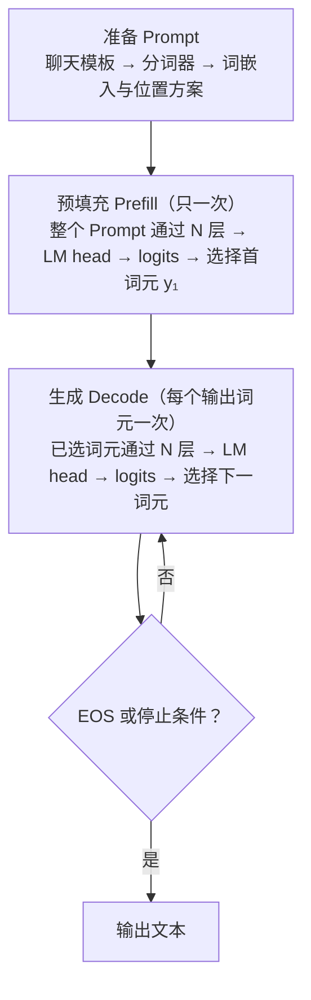
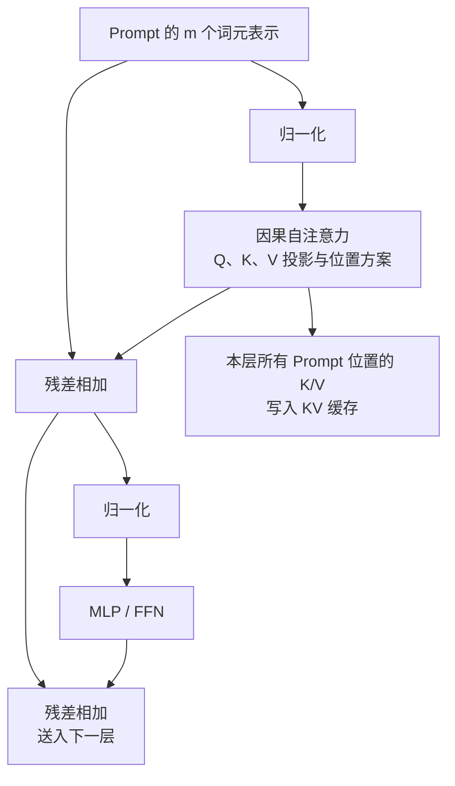
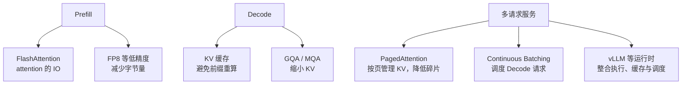

## 3.8 GPT 式仅解码器：一次回答如何生成

前面各节已经拆开了分词、嵌入、位置、注意力、前馈网络、残差和归一化。现在把它们接成一条实际的生成路径：一条聊天请求如何变成第一个输出词元，随后又如何一个词元接一个词元地完成回答。

本节描述的是公开可验证的**GPT 式仅解码器**（Decoder-Only）Transformer 抽象。它解释可观察的数值计算，不声称复原任何闭源 GPT 模型未公开的层数、注意力变体、路由机制或内部推理轨迹。不同模型的聊天模板、位置方案、归一化顺序和解码策略会不同，但下面的因果生成主线相同。

### 3.8.1 先看完整时间线

假设用户询问“请用一句完整的话回答：2 + 3 等于几？”。聊天模型通常不会只把这句话直接交给分词器；系统消息、用户消息、角色边界和助手起始位置会先按模型自己的**聊天模板**序列化。为避免把某个模型的分词规则误当成通则，下面将所得词元写成 t₁、t₂、…、tₘ，不展示虚构的词元 ID。

为清晰展示连续 Decode，假设选出的词元在解码后依次显示为“答案”“是”“ 5”“。”和 EOS。它们只是教学标记，不代表任何具体分词器的真实切分；下文以 y₁、y₂、y₃、y₄ 指代这一假设序列。

一次请求的第一枚输出词元和后续词元并不走同样大小的输入：前者来自对整个 Prompt 的预填充，后者来自一次只处理一个新词元的生成循环。

图 3-8：GPT 式仅解码器模型从 Prompt 到逐词元输出的时间线。

这张图最重要的不是术语，而是时间顺序：**Prompt 只做一次 Prefill；每个输出词元都要完成一轮 Decode，成为已知上下文后才能触发下一轮。**

### 3.8.2 从 Prompt 到首个词元

#### 聊天模板、分词和初始表示

聊天模板把“谁说的话、说给谁听”编码为一个有顺序的输入序列。分词器再把该序列映射到词表索引，嵌入矩阵将每个索引查表为 d_model 维向量。这正是 [3.1 节](3.1_tokenization.md)和[3.2 节](3.2_embedding.md)所说的从文本到连续表示的过程。

仅有词嵌入仍无法区分“甲在乙前”与“乙在甲前”，因此模型还要注入位置信息。原始 Transformer 会把位置向量加到嵌入上；采用 RoPE 的现代模型通常在每层注意力内部对 Q/K 施加位置相关旋转。两者的落点不同，但目的相同：让注意力能区分位置和相对距离。位置方案的完整比较见[第四章](../04_position_encoding/README.md)。

#### Prefill：整段 Prompt 一次通过模型

设 Prompt 长度为 m，初始表示组成矩阵：

$$H^{(0)} \in \mathbb{R}^{m \times d_{\text{model}}}$$

Prefill 将这 m 个已有位置同时送入 N 个 Transformer block。以常见的预归一化抽象为例，第 ℓ 层可写成：

$$U^{(\ell)} = H^{(\ell-1)} + \operatorname{Attention}\left(\operatorname{Norm}\left(H^{(\ell-1)}\right)\right)$$

$$H^{(\ell)} = U^{(\ell)} + \operatorname{MLP}\left(\operatorname{Norm}\left(U^{(\ell)}\right)\right)$$

其中注意力负责在词元位置之间路由信息，MLP/FFN 负责逐位置的非线性变换；残差连接与归一化保持深层计算稳定。原始 Transformer 的 Post-Norm、现代模型常见的 Pre-Norm 或 RMSNorm 在排列上不同，但不改变这里的主线。

每个位置都能并行计算，并不表示它能偷看未来。因果掩码规定位置 i 只能关注不晚于它的位置，因此 tᵢ 的表示只依赖 t₁、…、tᵢ。这也是训练时可并行计算整段序列、而预测目标仍保持“下一个词元”的原因，具体掩码机制见 [2.4 节](../02_attention/2.4_self_cross_causal.md)。

下面的图把一层中的计算和跨层状态放在一起。每一层都有独立参数，也各自保存一份 Prompt 的 Key/Value。

图 3-9：Prefill 中一个 Transformer block 的计算，以及本层 K/V 缓存的来源。

最后一个 Prompt 位置的表示 hₘ 汇集了可见上下文。LM head 将它线性映射到词表大小的 **logits**：每个候选词元一个未归一化分数。概念上，可对 logits 做 Softmax 得到概率分布，再以贪心、温度、Top-p 等策略选择 y₁；工程实现常将这些步骤融合执行，未必在显存中显式保存完整概率数组。不同选择策略的权衡见[第九章](../09_decoding/README.md)。

### 3.8.3 一个可以逐项复算的微型示例

上面的公式描述真实 GPT 式模型的通用骨架，但还没有展示一组数如何走到下一个词元。下面构造一个**专为手算而设的微型仅解码器**，只追踪“2 + 3 =”后的 `5`、`。` 和 EOS。它的参数是人为选定的，目的只是展示一次前向传播；它**不是**任何真实 GPT 的权重，也不能解释模型为何在训练后学会算术。真实模型使用更高维的表示、更多注意力头和更多层，但推理时的依赖顺序相同。

为把计算限制在纸面可复核的范围内，这个微型模型取 1 层、1 个注意力头，且 d_model、d_k、d_v 都为 2。归一化和注意力输出投影在本例中设为恒等变换，Q/K/V 投影矩阵也都设为单位矩阵；MLP 则定义为 `0.1 × ReLU(x)`。因此，本例仍保留“注意力残差 + MLP 残差”的主线，却省去了与因果循环无关的参数细节。

词表只保留四个 LM head 候选：`5`、`。`、EOS 和“其他”。下表的初始表示已经抽象地包含了词嵌入和位置方案的结果；这些向量不是某个 tokenizer 的输出，也不对应真实模型的词元 ID。

$$
H^{(0)} =
\begin{bmatrix}
1 & 0 \\
0 & 1 \\
1 & 1 \\
1 & 0
\end{bmatrix}
$$

| 位置 | 教学词元 | 初始表示 |
| --- | --- | --- |
| 1 | `2` | [1, 0] |
| 2 | `+` | [0, 1] |
| 3 | `3` | [1, 1] |
| 4 | `=` | [1, 0] |

#### Prefill：由最后一个 Prompt 位置选出 y₁

**目的**是让最后一个 Prompt 位置汇集它能看到的上下文，并把该位置的最终表示交给 LM head。因为投影矩阵是单位矩阵，四个位置的 Q、K、V 都等于上表的初始表示。我们只追踪位置 4：它是 Prompt 的末位置，可以关注 1 到 4；若追踪位置 1 到 3，因果掩码会把各自右侧的未来位置置为不可见。

位置 4 的 Query 与四个 Key 做点积，并按 d_k = 2 缩放：

$$
q_4 = [1, 0], \quad
\frac{q_4K^T}{\sqrt{2}} = [0.707,\ 0,\ 0.707,\ 0.707]
$$

Softmax 将“匹配分数”变成总和为 1 的读取权重。它的目的不是直接选择输出词元，而是决定位置 4 从四个 Value 中各读取多少信息：

$$
a_4 = \operatorname{softmax}([0.707,\ 0,\ 0.707,\ 0.707])
= [0.286,\ 0.141,\ 0.286,\ 0.286]
$$

将这些权重加到 Value 上，得到注意力输出；再经过两条残差路径，得到这个教学层的最终位置表示：

$$
o_4 = a_4V = [0.859,\ 0.427]
$$

$$
r_4 = h_4^{(0)} + o_4 = [1.859,\ 0.427], \quad
m_4 = 0.1\operatorname{ReLU}(r_4) = [0.186,\ 0.043]
$$

$$
h_4^{(1)} = r_4 + m_4 = [2.045,\ 0.470]
$$

最后，LM head 把二维表示映射为四个候选词元的 logits。为使本例可复算，定义其输出顺序为 `5`、`。`、EOS、“其他”，并令第一个分数取表示的第一维、第二个分数取第二维、EOS 分数取第一维的相反数、其余分数为 0：

$$
\ell_4 = [h_{4,1}^{(1)},\ h_{4,2}^{(1)},\ -h_{4,1}^{(1)},\ 0]
= [2.045,\ 0.470,\ -2.045,\ 0]
$$

$$
\operatorname{softmax}(\ell_4)
= [0.739,\ 0.153,\ 0.012,\ 0.096]
$$

若采用贪心解码，最大 logit 对应 `5`，因此选出 y₁ = `5`。到此为止，Prefill 已结束，同时第 1 层中位置 1 到 4 的 K/V 已写入缓存；下一步不能直接猜 y₂，而必须把 y₁ 送回模型。

#### 第 1 轮 Decode：将 y₁ 作为新输入，选出 y₂

**目的**是只为新位置计算一次前向传播，并复用 Prefill 留下的历史 K/V。本例将 y₁ `5` 在位置 5 的初始表示设为 [0, 1]。历史四个 K/V 已经存在；由于本例投影为单位矩阵，新位置的 k₅、v₅ 都是 [0, 1]，把它们追加后再做注意力即可，不需要重算位置 1 到 4 的 K/V。

新 Query 对“4 个历史 Key + 自己的 Key”计算分数：

$$
\frac{q_5K_{\leq5}^T}{\sqrt{2}}
= [0,\ 0.707,\ 0.707,\ 0,\ 0.707]
$$

$$
a_5 = [0.124,\ 0.251,\ 0.251,\ 0.124,\ 0.251], \quad
o_5 = a_5V_{\leq5} = [0.498,\ 0.753]
$$

这一次的注意力输出与新位置自己的表示相加，再经过 MLP 残差：

$$
r_5 = [0,\ 1] + [0.498,\ 0.753] = [0.498,\ 1.753]
$$

$$
m_5 = [0.050,\ 0.175], \quad
h_5^{(1)} = [0.548,\ 1.928]
$$

同一个 LM head 现在给出另一组 logits 和概率：

$$
\ell_5 = [0.548,\ 1.928,\ -0.548,\ 0], \quad
\operatorname{softmax}(\ell_5) = [0.170,\ 0.675,\ 0.057,\ 0.098]
$$

最大分数对应 `。`，所以 y₂ = `。`。注意，y₂ 是由位置 5 的 logits 选出的；位置 4 的 logits 只负责选 y₁。这正是“第二个输出词元如何生成”的完整因果链。

#### 第 2 轮 Decode：由 y₂ 选出 EOS

**目的**是展示停止也来自一次普通的“下一个词元”选择，而不是模型在输出 `。` 时预先算好的结果。将 y₂ `。` 在位置 6 的初始表示设为 [-1, 0]；缓存中此时已有位置 1 到 5 的 K/V。追加 k₆、v₆ 后，计算结果如下：

$$
\frac{q_6K_{\leq6}^T}{\sqrt{2}}
= [-0.707,\ 0,\ -0.707,\ -0.707,\ 0,\ 0.707]
$$

$$
a_6 = [0.090,\ 0.182,\ 0.090,\ 0.090,\ 0.182,\ 0.368], \quad
o_6 = [-0.100,\ 0.453]
$$

$$
r_6 = [-1.100,\ 0.453], \quad
m_6 = [0,\ 0.045], \quad
h_6^{(1)} = [-1.100,\ 0.498]
$$

$$
\ell_6 = [-1.100,\ 0.498,\ 1.100,\ 0], \quad
\operatorname{softmax}(\ell_6) = [0.056,\ 0.275,\ 0.502,\ 0.167]
$$

EOS 的 logit 最大，于是循环停止。将三轮连起来，读者应当看到：**每轮的输出是下一轮的输入；缓存只是带来历史 K/V，不会替下一轮预先产生 logits。**

| 阶段 | 本轮新输入 | 本轮算出的 logits 选择 | 本轮结束后的可用状态 |
| --- | --- | --- | --- |
| Prefill | 完整 Prompt：`2 + 3 =` | y₁ = `5` | 每层位置 1 到 4 的 K/V |
| Decode 1 | y₁：`5` | y₂ = `。` | 每层位置 1 到 5 的 K/V |
| Decode 2 | y₂：`。` | EOS | 每层位置 1 到 6 的 K/V，停止 |

表 3-1：同一请求中，Prefill 只运行一次；每一轮 Decode 只接受上一轮选出的一个词元，并在所有层各追加一组 K/V。

### 3.8.4 从一层推广到 N 层：哪些计算会重复

上面的数值例子只有一层，真实 GPT 式模型则把同一结构堆叠 N 次。**不是把第 1 层的 K/V 直接交给第 2 层使用**：每一层都有独立的归一化、Q/K/V/O 投影和 MLP 参数，因此每层都从自己的输入重新产生自己的 K/V。

对 Prefill 而言，第 ℓ 层接收前一层的全部位置表示 H⁽ℓ−1⁾，并在该层完成注意力和 MLP：

$$
\widetilde{H}^{(\ell)} = \operatorname{Norm}^{(\ell)}\left(H^{(\ell-1)}\right)
$$

$$
Q^{(\ell)} = \widetilde{H}^{(\ell)}W_Q^{(\ell)}, \quad
K^{(\ell)} = \widetilde{H}^{(\ell)}W_K^{(\ell)}, \quad
V^{(\ell)} = \widetilde{H}^{(\ell)}W_V^{(\ell)}
$$

$$
R^{(\ell)} = H^{(\ell-1)} + \operatorname{Attention}^{(\ell)}\left(Q^{(\ell)}, K^{(\ell)}, V^{(\ell)}\right)
$$

$$
H^{(\ell)} = R^{(\ell)} + \operatorname{MLP}^{(\ell)}\left(\operatorname{Norm}^{(\ell)}\left(R^{(\ell)}\right)\right)
$$

在真实的多头注意力中，每个头各自完成 Q/K/V 投影和注意力加权，随后拼接并经过该层的输出投影；为不遮蔽主线，上式把它们合写为 Attention。第 ℓ 层得到的 H⁽ℓ⁾ 才是第 ℓ + 1 层的输入。完成第 N 层后，只有最后位置的 H⁽ᴺ⁾ 交给 LM head，产生下一词元的 logits。

| 时刻 | 第 1 层 | 中间第 ℓ 层 | 第 N 层 | 目的 |
| --- | --- | --- | --- | --- |
| Prefill | 处理全部 Prompt 位置，写入第 1 层 K/V | 处理 H⁽ℓ−1⁾ 的全部位置，写入第 ℓ 层 K/V | 处理 H⁽ᴺ−1⁾，给出 H⁽ᴺ⁾ | 建立每层各自的历史状态，并选出 y₁ |
| 一轮 Decode | 新词元先经第 1 层，读取第 1 层历史 K/V 并追加本层新 K/V | 接收本轮第 ℓ−1 层输出，读取/追加第 ℓ 层 K/V | 接收本轮第 N−1 层输出，读取/追加第 N 层 K/V | 为同一新位置产生下一词元的 logits |

对 Decode 的新位置 s，更精确的层内顺序是：第 ℓ 层先根据该层输入算出 qₛ⁽ℓ⁾、kₛ⁽ℓ⁾、vₛ⁽ℓ⁾；把 kₛ⁽ℓ⁾、vₛ⁽ℓ⁾ 接到**第 ℓ 层**缓存后，用 qₛ⁽ℓ⁾ 读取该层所有历史 K/V；随后通过残差和 MLP 得到 hₛ⁽ℓ⁾，才进入第 ℓ + 1 层。

$$
\operatorname{Attn}^{(\ell)}_s =
\operatorname{softmax}\left(
\frac{q_s^{(\ell)}[K_{\mathrm{cache}}^{(\ell)}; k_s^{(\ell)}]^T}{\sqrt{d_k}}
\right)
[V_{\mathrm{cache}}^{(\ell)}; v_s^{(\ell)}]
$$

因此，N 层并没有改变“一个词元接一个词元”的外层循环；它只是把每轮中“经过 Transformer”展开为 N 次不同参数的层计算。KV 缓存的正确对应关系是“同一层、跨时间步”，而不是“不同层、同一时间步”。

### 3.8.5 Decode：每次只推进一个词元

选出 y₁ 后，模型仍不知道 y₂。它必须先把 y₁ 当作位置 m + 1 的新输入，完成一次完整的前向计算，再根据该位置的 logits 选择 y₂。这就是自回归生成的因果约束。

对于每一层，新位置只需计算自己的 Q、K、V。它的 Query 与该层缓存中的历史 K/V（以及自己的 K/V）计算注意力；新 K/V 随后追加到该层缓存。新的隐藏状态仍必须经过 MLP、输出投影以及后续所有层，KV 缓存并没有把一次 Decode 变成常数成本。

3.8.3 已将这件事算到具体数值：位置 4 的 Prefill logits 选择 y₁ = `5`；位置 5 的 Decode logits 才选择 y₂ = `。`；位置 6 的 Decode logits 再选择 EOS。对任意 Prompt 和任意长度的回答，唯一会替换的是“本轮新输入”和“本轮 logits 的最大项”，循环顺序并不改变。

将两个阶段并列比较，差异会更清楚：

| 维度 | Prefill | Decode |
| --- | --- | --- |
| 发生次数 | 每个请求一次 | 每个输出词元一次 |
| 输入 | 全部 Prompt 词元 | 上一轮已选出的一个词元 |
| 单请求内的并行单位 | Prompt 的全部已有位置 | 一个新位置；不同请求可由服务端并行处理 |
| 主要产物 | 首个输出词元，以及每层历史 K/V | 下一个输出词元，以及每层新增 K/V |
| 直觉 | 一次读完题目 | 每写一个词元，再决定下一个 |

表 3-2：Prefill 与 Decode 的输入规模、并行方式和缓存状态不同；单个请求的 Decode 循环不能跳过尚未选出的词元。

可以把一轮 Decode 固定记为四步：

1. 将第 t 轮已选出的词元作为新位置输入；
2. 它穿过全部 Transformer 层，读取每层历史 K/V，并追加自己的 K/V；
3. 最后一层的该位置表示经 LM head 得到下一组 logits，按解码策略选出下一个词元；
4. 只有下一个词元被选定后，下一轮才开始；遇到 EOS、最大长度或外部停止条件才结束。

这里有两个常见误解。第一，KV 缓存保存的是**每层历史词元的 Key/Value**，不是所有中间层输出。第二，缓存避免了重新计算历史前缀的 K/V，却仍要读取越来越长的缓存，并为每个新词元执行全部层的投影、注意力、MLP 和输出计算。因此，输出越长或上下文越长，Decode 的成本不会保持不变。关于这一循环的解码视角，见 [9.1 节](../09_decoding/9.1_autoregressive_decode.md)。

### 3.8.6 同一条流程上的优化地图

前面的路径故意按单请求、未优化的方式描述，目的是先固定正确的因果关系。实际推理优化不改变“选出一个词元，才能继续下一个词元”的依赖；它们改变的是每一步的数据搬运、KV 占用或多请求的调度方式。

图 3-10：优化技术挂在同一条生成流程的不同层次上。

| 技术 | 挂在流程的哪一步 | 主要处理的瓶颈 | 深入阅读 |
| --- | --- | --- | --- |
| FlashAttention | Prefill 和注意力计算 | 注意力中间量的 HBM 读写 | [10.3 节](../10_inference_optimization/10.3_flash_attention.md) |
| FP8 等低精度 | 权重、激活值或 KV 的存取 | 字节量、显存容量和带宽 | [10.4 节](../10_inference_optimization/10.4_quantization.md)、[11.4 节](../11_serving/11.4_hardware.md) |
| GQA/MQA | 模型的注意力结构 | 每个词元须保存的 KV 头数 | [2.3 节](../02_attention/2.3_multi_head.md)、[10.2 节](../10_inference_optimization/10.2_kv_cache.md) |
| KV 缓存 | Decode 的历史上下文 | 历史前缀 K/V 的重复计算 | [10.2 节](../10_inference_optimization/10.2_kv_cache.md) |
| PagedAttention | 多请求 KV 缓存管理 | 碎片化和过度预留 | [11.2 节](../11_serving/11.2_continuous_batching.md) |
| Continuous Batching | 多请求的每个 Decode 步 | 已完成请求留下的批次空洞 | [11.2 节](../11_serving/11.2_continuous_batching.md) |
| vLLM 等推理运行时 | 服务层 | 将执行内核、缓存和调度组织为可用系统 | [11.1 节](../11_serving/11.1_engines_overview.md) |

这些技术不是同一类开关。FlashAttention 是 attention 内核的 IO 优化；GQA/MQA 是模型架构选择；KV 缓存是单请求推理状态；PagedAttention 是该状态的内存管理；Continuous Batching 是请求调度；vLLM 则是将多种机制组织起来的推理运行时。先分清它们各自挂在哪一步，才不会把“模型为什么逐词元生成”和“服务为什么能更快地逐词元生成”混为一谈。
