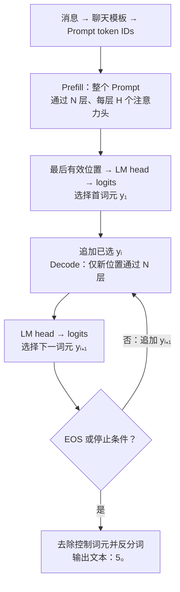
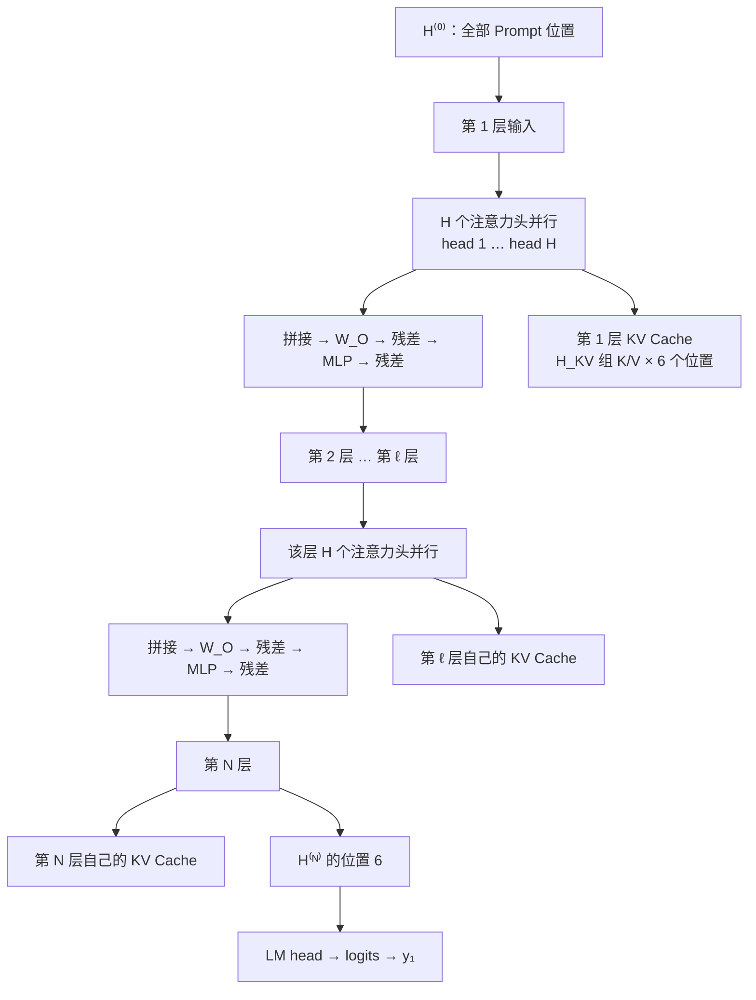
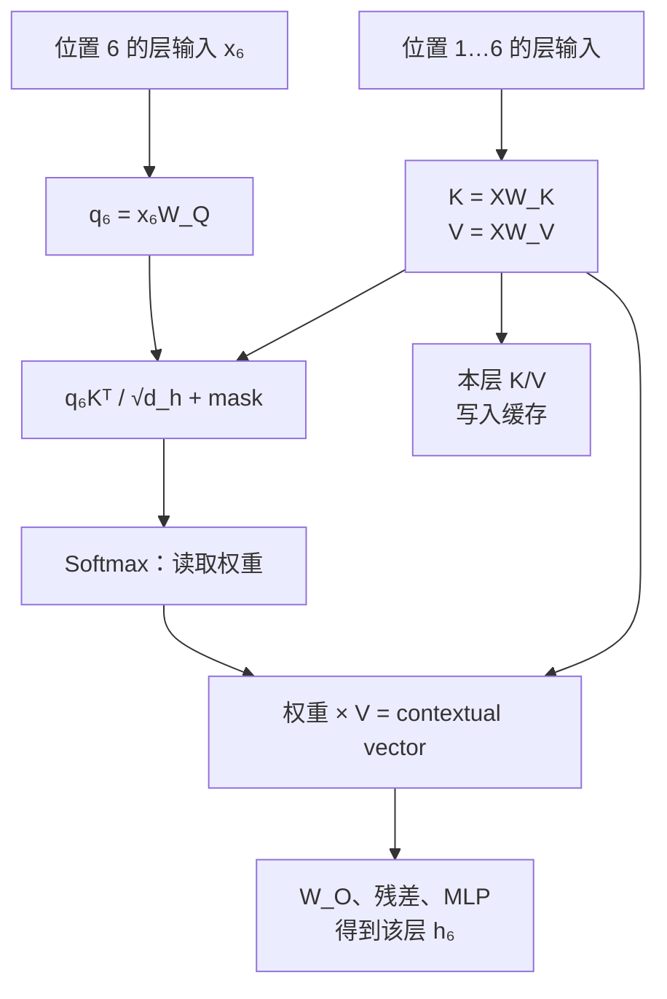
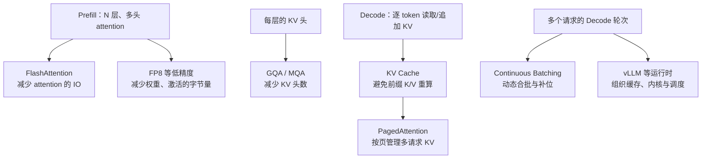

## 3.8 GPT 式仅解码器：一次回答如何生成

以用户提问“2 + 3 等于几？”为例，一次 GPT 式回答不是模型先一次性写好“5。”，再逐字显示出来。它先处理完整输入，再选出一个输出词元；这个词元成为新输入后，模型才有条件选出下一个词元。直到选中 EOS 或触发停止规则，已选词元才会被还原为最终文本。

本节讲的是公开仅解码器 Transformer 的**计算流程**，不试图复原任何闭源 GPT 的未公开权重、层数或服务实现。为使每一步可追踪，文中的词元、ID、向量和权重均为教学示意；它们不是任何实际模型的分词结果或参数。

### 3.8.1 先记住整条时间线

一次请求中只有一次 Prefill；此后每生成一个词元，都要完成一次 Decode。下图中的 `y₁`、`y₂` 是已经被选定的离散词元，不是模型预先写好的完整答案。

图 3-8：从结构化消息到最终文本的完整生成时间线。

这条图可以压缩成一句话：**Prefill 读完已知上下文并选出 y₁；Decode 每次只处理一个已选词元，并选出下一个词元。** N 层、多头注意力发生在这两个阶段内部，不能消除输出词元之间的因果依赖。

### 3.8.2 输入边界：消息如何变成初始表示

模型不直接接收“用户说了什么”这一抽象对象。服务端先将消息列表按该模型的聊天模板序列化；生成时，模板通常还会放入“助手将开始说话”的控制标记。不同模型的模板和特殊词元不同，因此以下固定一套教学模板，而不伪造真实模型的 token ID。

图 3-9：消息、模板、词元 ID 和初始表示之间的边界。真实模型的模板与 ID 可以不同，但数据流顺序相同。

为使后面的数值可复算，教学模板把问题写成符号形式“⟨user⟩ 2 + 3 = ⟨assistant⟩”。表 3-1 列出了整个 Prompt，而不是只从“2 + 3 =”中途开始。这里采用“词嵌入加位置向量”的简化位置方案；使用 RoPE 的模型通常在每层注意力内部对 Q/K 注入位置信息，位置作用的边界相同，具体机制见[第四章](../04_position_encoding/README.md)。

| 位置 | 教学词元 | 教学 ID | 词嵌入 E | 位置表示 P | 初始表示 H⁽⁰⁾ |
| --- | --- | ---: | --- | --- | --- |
| 1 | `⟨user⟩` | 0 | [0.0, 0.0] | [0.0, 0.0] | [0.0, 0.0] |
| 2 | `2` | 11 | [0.9, -0.1] | [0.1, 0.1] | [1.0, 0.0] |
| 3 | `+` | 12 | [-0.2, 0.8] | [0.2, 0.2] | [0.0, 1.0] |
| 4 | `3` | 13 | [0.7, 0.7] | [0.3, 0.3] | [1.0, 1.0] |
| 5 | `=` | 14 | [0.6, -0.4] | [0.4, 0.4] | [1.0, 0.0] |
| 6 | `⟨assistant⟩` | 1 | [0.5, -0.5] | [0.5, 0.5] | [1.0, 0.0] |

表 3-1：教学 Prompt 的离散 ID 如何成为连续的初始表示。每个值均为手算设定。

### 3.8.3 Prefill：完整 Prompt 穿过 N 层、多头注意力

Prefill 的输入是表 3-1 的全部六个位置。它们可以并行计算，但并不意味着位置 2 可以读取位置 5：因果掩码会在注意力分数上屏蔽未来位置。

| Query 位置 \ Key 位置 | 1 | 2 | 3 | 4 | 5 | 6 |
| --- | ---: | ---: | ---: | ---: | ---: | ---: |
| 1 | 0 | −∞ | −∞ | −∞ | −∞ | −∞ |
| 2 | 0 | 0 | −∞ | −∞ | −∞ | −∞ |
| 3 | 0 | 0 | 0 | −∞ | −∞ | −∞ |
| 4 | 0 | 0 | 0 | 0 | −∞ | −∞ |
| 5 | 0 | 0 | 0 | 0 | 0 | −∞ |
| 6 | 0 | 0 | 0 | 0 | 0 | 0 |

表 3-2：教学 Prompt 的因果掩码 M。Softmax 前加上 M 后，被屏蔽项的概率为 0；所以所有位置可以并行算，依赖方向仍从左到右。

典型 GPT 式模型的主体是 N 个不同参数的 Transformer 层。第 ℓ 层接收上一层的全部位置表示 H⁽ˡ⁻¹⁾；该层的 H 个注意力头并行计算，拼接后经输出投影，再经残差和 MLP 得到 H⁽ˡ⁾。只有 H⁽ᴺ⁾ 的最后一个有效位置会交给 LM head 来选择 y₁。

图 3-10：Prefill 中的 N 层、多头结构。KV 只能在“同一层、跨时间步”复用，不能把第 1 层的 K/V 当作第 2 层的 K/V。

一层计算按“目的”可拆为五步：先投影出 Q/K/V 并形成带掩码的分数 S；再用 Softmax 将 S 变成注意力权重矩阵 P，并用 P 读取 V，得到每个头的 contextual vector C；接着合并多头、经过 W_O、残差和 MLP，更新本层表示；随后在第 2 层至第 N 层重复；最后由 LM head 将最后一层的最后位置表示变成下一词元分数。

以常见预归一化写法，第 ℓ 层中第 h 个头的计算可概括为：

$$
\widetilde{H}^{(\ell)} = \operatorname{Norm}^{(\ell)}\left(H^{(\ell-1)}\right)
$$

$$
Q_h^{(\ell)} = \widetilde{H}^{(\ell)}W_{Q,h}^{(\ell)},\quad
K_h^{(\ell)} = \widetilde{H}^{(\ell)}W_{K,h}^{(\ell)},\quad
V_h^{(\ell)} = \widetilde{H}^{(\ell)}W_{V,h}^{(\ell)}
$$

$$
S_h^{(\ell)} = \frac{Q_h^{(\ell)}K_h^{(\ell)T}}{\sqrt{d_h}} + M,\quad
P_h^{(\ell)} = \operatorname{softmax}\left(S_h^{(\ell)}\right),\quad
C_h^{(\ell)} = P_h^{(\ell)}V_h^{(\ell)}
$$

$$
R^{(\ell)} = H^{(\ell-1)} +
\operatorname{Concat}\left(C_1^{(\ell)},\ldots,C_H^{(\ell)}\right)W_O^{(\ell)}
$$

$$
H^{(\ell)} = R^{(\ell)} +
\operatorname{MLP}^{(\ell)}\left(\operatorname{Norm}^{(\ell)}\left(R^{(\ell)}\right)\right)
$$

这里的“多头”表示同一层有多组独立的 Q/K/V 投影和注意力结果；“多层”表示第 ℓ 层的输出才会成为第 ℓ + 1 层输入。多头注意力的结构细节见[2.3 节](../02_attention/2.3_multi_head.md)。若模型使用 GQA/MQA，Query 头数 H 仍可较多，但 K/V 只保存 H_KV 组；这会改变缓存大小，不会改变这条层间与时间上的因果链。

#### 只展开第 1 层、第 1 个头：位置 6 如何选出 y₁

真实模型无法手算完 N × H 份矩阵。以下只展开图 3-10 中“第 1 层的 head 1”，用来说明一个头在一个位置具体做什么；其余头按同样规则并行，第 2 层到第 N 层按同样层结构依次重复。

图 3-11：一个头在最后 Prompt 位置的局部计算。最后位置可见 1 到 6；早期位置使用表 3-2 的掩码屏蔽未来。

为保持算式简短，教学模型仅取 1 层、1 个头，`d_model = d_h = 2`，令 Norm、W_Q、W_K、W_V、W_O 都为恒等变换，MLP 定义为 `0.1 × ReLU(x)`。因此此处 `Q = K = V = H⁽⁰⁾`；这不是说真实模型只有一层一头，而是从完整架构中截取一个可复核的局部。

下列小数显示到三位；每一步都以未显示的完整精度继续计算，再在展示时四舍五入。

位置 6 的 Query 为 `[1, 0]`。它对六个 Key 的缩放分数、读取权重和 Value 加权和依次为：

$$
q_6 = [1, 0],\quad
\frac{q_6K^T}{\sqrt{2}} = [0,\ 0.707,\ 0,\ 0.707,\ 0.707,\ 0.707]
$$

$$
a_6 = \operatorname{softmax}([0,\ 0.707,\ 0,\ 0.707,\ 0.707,\ 0.707])
= [0.099,\ 0.201,\ 0.099,\ 0.201,\ 0.201,\ 0.201]
$$

$$
o_6 = a_6V = [0.802,\ 0.299]
$$

注意力输出首先经残差，再经过 MLP 残差。这个教学层的最后位置表示为：

$$
r_6 = [1, 0] + [0.802, 0.299] = [1.802, 0.299]
$$

$$
m_6 = 0.1\operatorname{ReLU}(r_6) = [0.180, 0.030],\quad
h_6^{(1)} = r_6 + m_6 = [1.982, 0.329]
$$

真实模型会继续把 h₆⁽¹⁾ 送入第 2 层，直至 h₆⁽ᴺ⁾。在这个单层教学模型中，直接用 h₆⁽¹⁾ 接 LM head。LM head 的候选顺序固定为 `5`、`。`、EOS、“其他”，并定义：

$$
\ell_6 = [h_{6,1}^{(1)},\ h_{6,2}^{(1)},\ -h_{6,1}^{(1)},\ 0]
= [1.982,\ 0.329,\ -1.982,\ 0]
$$

$$
\operatorname{softmax}(\ell_6) = [0.742,\ 0.142,\ 0.014,\ 0.102]
$$

采用贪心解码时，最大 logit 对应教学 ID `15`，即 y₁ = `5`。至此 Prefill 结束：它产生了首词元，也为**每一层**保存了六个位置的 K/V。

### 3.8.4 Decode：把一个已选词元送回 N 层

第二个词元不是由位置 6 的 logits 直接“顺带得到”的。必须先将 y₁ = `5` 作为位置 7 的新输入，依次穿过第 1 层到第 N 层；每层只计算位置 7 新增的 Q/K/V，读取并追加本层自己的 K/V。最后一层的位置 7 表示才会产生 y₂。

对于第 ℓ 层的新位置 s，其注意力读取可写为：

$$
\operatorname{Attn}^{(\ell)}_s =
\operatorname{softmax}\left(
\frac{q_s^{(\ell)}[K_{\mathrm{cache}}^{(\ell)};k_s^{(\ell)}]^T}{\sqrt{d_h}}
\right)
[V_{\mathrm{cache}}^{(\ell)};v_s^{(\ell)}]
$$

缓存的概念形状是“每层 × K/V 头 × 已有长度 × 每头维度”；带 batch 时常写作 `[B, H_KV, s, d_h]`，实际布局可随运行时变化。关键不在数组顺序，而在 K/V 的归属：**同一层跨时间步**。

下图将这个公式展开为一轮实际的层内状态流。它刻意画出“第 1 层历史 KV”“第 2 层历史 KV”和“第 N 层历史 KV”是三份独立状态。

图 3-12：一轮 Decode 的层内顺序。每层各有自己的缓存；新位置仍须经过全部 N 层，KV 缓存只避免重算历史前缀。

#### 第 1 轮 Decode：由 y₁ = `5` 选出 y₂ = `。`

教学 token `5` 的 ID 为 15，并被追加到位置 7。其词嵌入为 `[-0.7, 0.3]`、位置表示为 `[0.7, 0.7]`，所以新位置初始表示为 `[0, 1]`。在单层单头教学模型中，位置 7 的 Query 要读取六个历史 Key 和自己的新 Key：

$$
\frac{q_7K_{\leq7}^T}{\sqrt{2}}
= [0,\ 0,\ 0.707,\ 0.707,\ 0,\ 0,\ 0.707]
$$

$$
a_7 = [0.099,\ 0.099,\ 0.201,\ 0.201,\ 0.099,\ 0.099,\ 0.201],\quad
o_7 = [0.499,\ 0.603]
$$

$$
r_7 = [0, 1] + [0.499, 0.603] = [0.499, 1.603]
$$

$$
m_7 = [0.050, 0.160],\quad h_7^{(1)} = [0.548, 1.764]
$$

$$
\ell_7 = [0.548,\ 1.764,\ -0.548,\ 0],\quad
\operatorname{softmax}(\ell_7) = [0.189,\ 0.638,\ 0.063,\ 0.109]
$$

最大 logit 对应教学 ID `16`，所以 y₂ = `。`。位置 6 的 logits 只负责选择 `5`；位置 7 的 logits 才负责选择 `。`。

#### 第 2 轮 Decode：由 y₂ = `。` 选出 EOS

接着，教学 ID `16` 被追加到位置 8。令它的词嵌入为 `[-1.8, -0.8]`、位置表示为 `[0.8, 0.8]`，因此新位置表示为 `[-1, 0]`。位置 8 读取七个历史 K/V 和自己的 K/V：

$$
\frac{q_8K_{\leq8}^T}{\sqrt{2}}
= [0,\ -0.707,\ 0,\ -0.707,\ -0.707,\ -0.707,\ 0,\ 0.707]
$$

$$
a_8 = [0.143,\ 0.070,\ 0.143,\ 0.070,\ 0.070,\ 0.070,\ 0.143,\ 0.290],\quad
o_8 = [-0.008,\ 0.356]
$$

$$
r_8 = [-1, 0] + [-0.008, 0.356] = [-1.008, 0.356]
$$

$$
m_8 = [0, 0.036],\quad h_8^{(1)} = [-1.008, 0.392]
$$

$$
\ell_8 = [-1.008,\ 0.392,\ 1.008,\ 0],\quad
\operatorname{softmax}(\ell_8) = [0.065,\ 0.265,\ 0.491,\ 0.179]
$$

EOS 的 logit 最大，循环停止。EOS 用于控制生成结束，不会被拼接到用户可见文本中。

| 阶段 | 本轮输入 | 本轮选择 | 每层 KV 长度 | 用户可见累积文本 |
| --- | --- | --- | ---: | --- |
| Prefill | 6 个 Prompt token IDs | y₁ = `5` | 6 | 空 |
| Decode 1 | `5` 的 ID | y₂ = `。` | 7 | `5` |
| Decode 2 | `。` 的 ID | EOS | 8 | `5。` |
| 结束处理 | 去除 EOS 与控制词元 | 反分词 | 不再增长 | `5。` |

表 3-3：同一请求的离散状态轨迹。每一轮的“本轮选择”只能在本轮前向计算结束后出现。

### 3.8.5 将局部手算还原为典型 GPT

表 3-4 将“可手算的 1 层 1 头”与“典型 N 层 H 头”并列。它们的区别在于并行的头数和串行的层数，而不是输出词元是否还能并行地产生。

| 教学局部 | 典型 GPT 式结构 | 对生成顺序的影响 |
| --- | --- | --- |
| 1 个 Q/K/V 投影 | 每层 H 个头各有 Q/K/V 投影，随后拼接并过 W_O | 同一层的头可并行；仍只为当前新位置计算 |
| 1 层注意力与 MLP | N 层参数不同的注意力、残差、归一化和 MLP 依次执行 | 第 ℓ 层输出必须成为第 ℓ + 1 层输入 |
| 1 份 K/V | 每层各存一份 K/V；GQA/MQA 可令 K/V 头少于 Query 头 | 只可在同层跨时间步复用 |
| h⁽¹⁾ 直接进 LM head | h⁽ᴺ⁾ 的最后有效位置进 LM head | 每轮仍只得到一个“下一词元”分布 |

因此，完整的 Decode 不是“只跑一个小注意力层”。它是：一个已选词元先过第 1 层，再过第 2 层，直到第 N 层；每层中 H 个头并行计算；最后才由 LM head 选择一个新词元。对于单个请求，`y₁ → y₂ → …` 的外层顺序不可跳过；不同请求的同一轮 Decode 则可以由服务端合批。

### 3.8.6 同一条流程上的优化地图

前面的轨迹故意从未优化的单请求角度解释因果关系。实际优化不改变“选出一个词元后，才能开始下一轮”的规则；它们处理的是 attention 的数据搬运、KV 容量或多请求调度。

图 3-13：优化技术挂在同一条生成流程的不同位置。

| 技术 | 挂在流程的哪一步 | 主要处理的瓶颈 | 深入阅读 |
| --- | --- | --- | --- |
| FlashAttention | Prefill 与 Decode 的 attention 内核 | attention 中间量的 HBM 读写 | [10.3 节](../10_inference_optimization/10.3_flash_attention.md) |
| FP8 等低精度 | 权重、激活值或 KV 的存取 | 字节量、显存容量和带宽 | [10.4 节](../10_inference_optimization/10.4_quantization.md)、[11.4 节](../11_serving/11.4_hardware.md) |
| GQA/MQA | 模型的多头注意力结构 | 每个词元须保存的 KV 头数 | [2.3 节](../02_attention/2.3_multi_head.md)、[10.2 节](../10_inference_optimization/10.2_kv_cache.md) |
| KV 缓存 | Decode 的历史上下文 | 历史前缀 K/V 的重复计算 | [10.2 节](../10_inference_optimization/10.2_kv_cache.md) |
| PagedAttention | 多请求的 KV 缓存管理 | 碎片化和过度预留 | [11.2 节](../11_serving/11.2_continuous_batching.md) |
| Continuous Batching | 多请求的逐轮 Decode | 已完成请求留下的批次空洞 | [11.2 节](../11_serving/11.2_continuous_batching.md) |
| vLLM 等推理运行时 | 服务层 | 将执行内核、缓存和调度组织为系统 | [11.1 节](../11_serving/11.1_engines_overview.md) |

这些技术不是同一类开关。FlashAttention 是 attention 内核优化；GQA/MQA 是模型架构选择；KV 缓存是单请求状态；PagedAttention 是缓存的内存管理；Continuous Batching 是调度；vLLM 是把这些机制组织起来的运行时。理解图 3-8 到图 3-13 的状态流后，才能准确判断每项技术究竟省掉了什么，又没有省掉什么。
