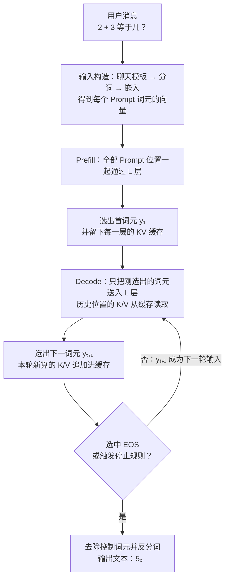
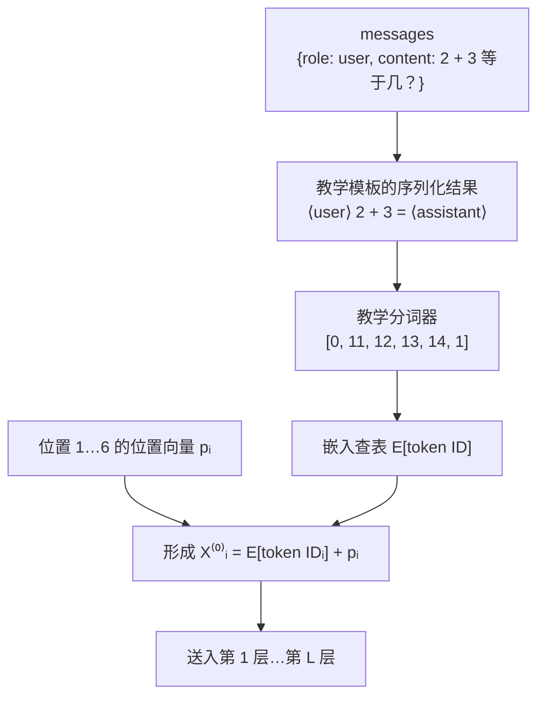
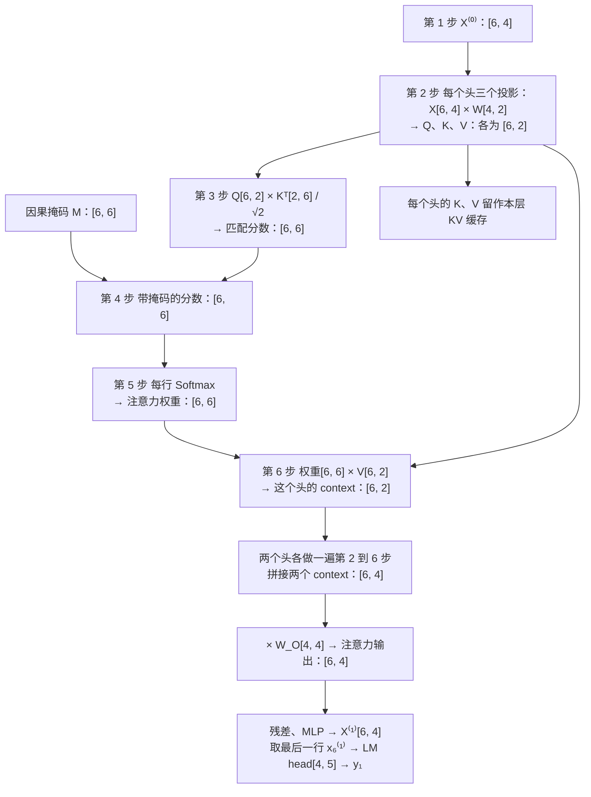
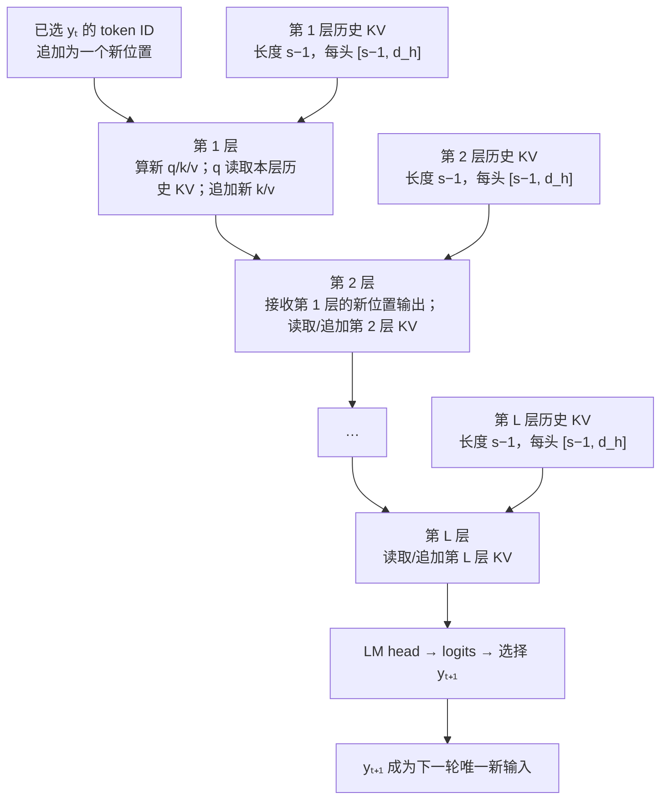
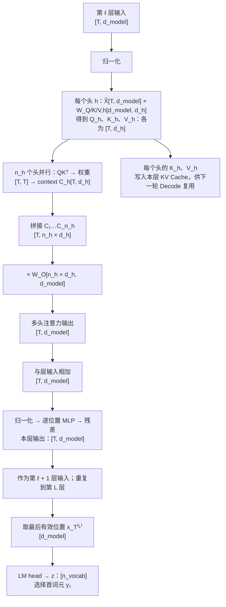
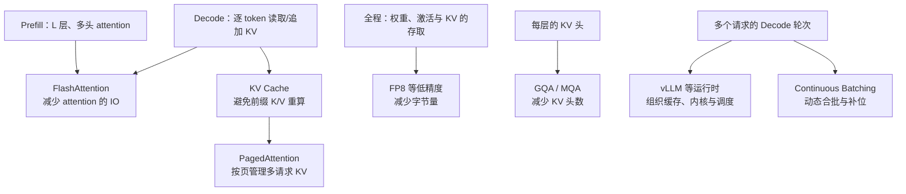
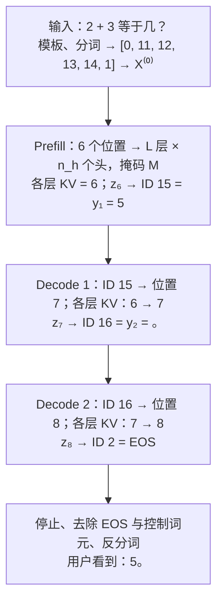

## 3.8 GPT 式仅解码器：一次回答如何生成

以用户提问“2 + 3 等于几？”为例，一次 GPT 式回答不是模型先一次性写好“5。”，再逐字显示出来。它先处理完整输入，并选出第一个输出词元；随后把这个词元加到序列末尾，再计算下一个。选中 EOS 或触发停止规则（如达到最大长度、命中停止字符串）后，生成结束；已选词元经反分词还原为文本，流式输出时则是每选出一个就增量还原一次。

本节讲的是公开仅解码器 Transformer 的**计算流程**，不试图复原任何闭源 GPT 的未公开权重、层数或服务实现。为使每一步可追踪，文中的词元、ID、向量和权重均为教学示意；它们不是任何实际模型的分词结果或参数。

需要先说明一点，免得后文找错重点：本节的教学模型并不会算加法。它输出“5”，只因为权重被手工设成了能得到这个结果的数值；真实模型的权重来自训练（见[第五章](../05_pretraining/README.md)），“会算”的能力存放在那些权重里。本节只回答“数据怎样一步步流过模型”，不回答“权重为什么是这些值”。

阅读路线有两条。只想弄清流程，读 3.8.1、3.8.2 和 3.8.4 中的表 3-10 即可；想亲手验证每个数字，再读 3.8.3 的六步手算。3.8.5 把手算放回真实规模，3.8.6 标出各种优化技术的挂点，3.8.7 回放全程并给出自测题。

### 3.8.1 整体流程：三次前向，换来两个字

先看结果。为了回答“5。”，模型一共做了三次**前向计算**：把一串词元（token，见 [3.1 节](3.1_tokenization.md)）送进模型，从第一层算到最后一层，选出一个输出词元，这算一次前向。

| 第几次前向 | 送进模型的词元 | 模型选出的词元 | 这一次的名称 |
| --- | --- | --- | --- |
| 1 | 完整 Prompt，共 6 个词元：`⟨user⟩ 2 + 3 = ⟨assistant⟩` | `5` | Prefill（预填充） |
| 2 | 只有刚选出的 `5` | `。` | Decode（解码）第 1 轮 |
| 3 | 只有刚选出的 `。` | EOS | Decode 第 2 轮 |

表 3-1：回答“5。”所需的三次前向计算。EOS（end of sequence）是“序列结束”词元，只表示停止，不显示给用户。

这张表里有三件事，后文都围绕它们展开：

- **每次前向只选出一个词元。** 模型算出的不是一段文本，而是“下一个词元”的一组分数；从中选定一个，这次前向就结束了。
- **后一次的输入是前一次的输出。** 在 `5` 被选出之前，第 2 次前向连输入都还不存在。因此同一个回答里的输出词元无法并行产生，只能一个接一个。
- **第 2、3 次只送进一个词元，却仍要“看见”前面的全部内容。** 做法是把第 1 次前向中为每个位置算出的 Key 与 Value（3.8.3 解释）保存下来，后面直接读取，不再重算。这份保存下来的状态叫 **KV 缓存**（KV Cache）。

第 1 次与后两次差别很大，因而各有名称：一次读完整个 Prompt 的叫 Prefill，此后每次只处理一个新词元的叫 Decode。图 3-8 把这三次前向推广为一般流程：一次请求只有一次 Prefill，Decode 则循环到选中 EOS 或触发停止规则为止。

这是未经优化的基本流程，本节始终按它来讲。后面章节会看到，投机解码让一次前向确认多个词元（见 [10.6 节](../10_inference_optimization/10.6_speculative_decoding.md)），分块 Prefill 把长 Prompt 拆成几次前向（见 [11.2 节](../11_serving/11.2_continuous_batching.md)）；它们改变的是每次前向的工作量，不是“后一个词元依赖前一个词元”这条因果顺序。

图 3-8：一次 GPT 推理的整体流程。`y₁`、`y₂` 是逐个选定的输出词元，不是模型预先写好的完整答案；L 是模型的层数。

| 阶段 | 输入 | 输出 | 目的 |
| --- | --- | --- | --- |
| 输入构造 | 消息 | Prompt 的词元 ID、每个位置的初始向量 | 将文本转为模型可计算的向量。 |
| Prefill | 全部 Prompt 位置 | 首词元 `y₁`、每层的 KV 缓存 | 一次读完已知上下文，并选出首个新词元。 |
| Decode | 上一轮已选词元、各层 KV 缓存 | 下一个词元、更新后的 KV 缓存 | 每轮只处理一个新位置，并只选出一个词元。 |
| 结束处理 | 已选词元序列 | 用户可见文本 | 遇到 EOS 或停止条件后，去除控制词元并反分词。 |

表 3-2：整体流程中每个阶段的输入、输出与目的。后文按这张表的顺序展开：3.8.2 讲输入构造，3.8.3 讲 Prefill，3.8.4 讲 Decode 与结束处理。

### 3.8.2 输入边界：消息如何变成初始表示

模型不直接接收一句自然语言。服务端先按该模型的聊天模板，把消息列表排成一串词元；生成时，模板通常还会加入“助手将开始说话”的控制标记。不同模型的模板和特殊词元不同，因此下面固定一套教学模板，不伪造真实模型的 token ID。

图 3-9：消息、模板、词元 ID 和初始表示之间的边界。真实模型的模板与 ID 可以不同，但数据流顺序相同。

图中有两次“由离散变连续”的转换。分词把文本切成词元，并给每个词元一个整数 ID；嵌入查表再按 ID 从词嵌入矩阵 E 中取出对应的一行向量（见 [3.2 节](3.2_embedding.md)）。取出的向量只说明“这是哪个词元”，不说明“它排在第几位”，所以还要加上位置向量 p。两者之和就是该位置进入第 1 层之前的**初始表示**，全部位置合起来记作 X⁽⁰⁾。

为使后面的数值可复算，教学模板把问题写成“⟨user⟩ 2 + 3 = ⟨assistant⟩”。表 3-3 保留了完整 Prompt：模型既看到算式，也看到谁在提问、何时该由助手回答。教学模板还把“等于几？”缩写成了“=”，只为减少词元数；真实聊天模板只添加角色标记，不改写用户内容。位置方面，这里采用“词嵌入加位置向量”的简化方案（见 [3.3 节](3.3_position_encoding.md)）；另一类方案 RoPE 不在输入处相加，而是在每层注意力内部旋转 Query 和 Key 来带入位置（见[第四章](../04_position_encoding/README.md)）。无论哪种，位置信息都在注意力打分之前进入计算。

| 位置 | 教学词元 | 教学 ID | 词嵌入 E | 位置向量 p | 初始表示 X⁽⁰⁾ |
| --- | --- | ---: | --- | --- | --- |
| 1 | `⟨user⟩` | 0 | [0.0, 0.0, 0, 0] | [0.0, 0.0, 0, 0] | [0, 0, 0, 0] |
| 2 | `2` | 11 | [0.9, -0.1, 1, 0] | [0.1, 0.1, 0, 0] | [1, 0, 1, 0] |
| 3 | `+` | 12 | [-0.2, 0.8, 0, 0] | [0.2, 0.2, 0, 0] | [0, 1, 0, 0] |
| 4 | `3` | 13 | [0.7, 0.7, 1, 0] | [0.3, 0.3, 0, 0] | [1, 1, 1, 0] |
| 5 | `=` | 14 | [0.6, -0.4, 0, 1] | [0.4, 0.4, 0, 0] | [1, 0, 0, 1] |
| 6 | `⟨assistant⟩` | 1 | [0.5, -0.5, 0, 1] | [0.5, 0.5, 0, 0] | [1, 0, 0, 1] |

表 3-3：教学 Prompt 的离散 ID 如何成为连续的初始表示。最后一列由它左边的两列（词嵌入 E 与位置向量 p）逐分量相加得到，例如位置 2 是 `[0.9 + 0.1, −0.1 + 0.1, 1 + 0, 0 + 0] = [1, 0, 1, 0]`。

每个位置用 4 个数表示，即 `d_model = 4`。这些值都是手工设定的：前两维是倒推出来的，为的是让相加后只剩 0 和 1，后面的乘法可以心算；第 3 维标记“这个词元是数字”，第 4 维标记“这个位置在等答案”，是为了让后文第二个注意力头的行为一眼看得懂。真实模型的向量有数百到上万维，由训练得到，单独某一维通常没有这样清晰的含义。

为便于跟踪输出，本例再固定四个教学 ID：`15` 对应 `5`，`16` 对应 `。`，`17` 对应 `6`，`2` 对应 EOS；“其他”代表其余候选。于是后文的 ID `15` 可以直接还原为词元 `5`。

### 3.8.3 Prefill：手算两个注意力头，直到选出首词元

Prefill 要交出两样东西：首词元 y₁，以及留给 Decode 复用的 KV 缓存。它让 6 个位置同时通过一层又一层的 Transformer 计算，每一层对每个位置做两件事：

1. **读**：用因果自注意力，从自己和左边的位置读取信息（见 [2.1 节](../02_attention/2.1_qkv_intuition.md)、[2.2 节](../02_attention/2.2_scaled_dot_product.md)和 [2.4 节](../02_attention/2.4_self_cross_causal.md)）。
2. **加工**：用逐位置的 MLP，对读到的结果做非线性变换（见 [3.4 节](3.4_feedforward.md)）。

两步的结果都通过残差加回原向量（见 [3.5 节](3.5_residual.md)），进入每一步之前通常先做归一化（见 [3.6 节](3.6_layer_norm.md)）。真实模型把“读”分给多个注意力头并行完成（见 [2.3 节](../02_attention/2.3_multi_head.md)），并把这样的层串联 L 次；最后一层的输出再交给 **LM head**，换算成词表中每个词元的分数。

真实规模的计算无法手算，所以本小节把模型缩到最小，但不丢掉结构：1 层、2 个头、每个位置 4 个数。头 1 的每一步都把整张矩阵写出来；头 2 照同样的步骤，只算决定输出的最后一行；然后演示两个头的结果怎样拼接、怎样回到 4 维。真实模型的通用模板见 3.8.5 的图 3-12。表 3-4 列出会反复出现的符号，不必先记住，遇到时回查即可。

| 符号 | 含义与用途 |
| --- | --- |
| `T`、`n_vocab` | 当前序列的词元数（本例 Prefill 时为 6）、词表大小。 |
| `L` | Transformer 层数；层按 1 到 L 依次执行。 |
| `h`、`n_h`、`n_kv` | 第 h 个注意力头、Query 头总数、K/V 头总数；普通多头注意力中 `n_h = n_kv`，GQA/MQA 中 `n_kv` 可更小。 |
| `i`、`s`、`t` | 词元位置与生成轮次；i 表示任意已有位置，s 表示正在预测下一个词元的位置（Prefill 时是 Prompt 的最后位置，Decode 时是刚追加的新位置），t 表示第 t 个已选输出词元。 |
| `E[idᵢ]`、`pᵢ` | ID `idᵢ` 的词嵌入、位置 i 的位置向量。 |
| `X⁽ˡ⁾`、`xₛ⁽ˡ⁾` | 第 ℓ 层输出的全部位置表示、其中位置 s 的单个向量；`X⁽⁰⁾` 是进入第 1 层前的表示。 |
| `Q`、`K`、`V` | Query、Key、Value：分别表示“当前位置要找什么”“各位置可怎样匹配”“被加权读出的内容”。 |
| `qₛ`、`kₛ`、`vₛ`、`A` | 小写 q、k、v 是 Q、K、V 中位置 s 的那一行；A 是 Softmax 之后的注意力权重。 |
| `W_Q,h`、`W_K,h`、`W_V,h`、`W_O` | 第 h 个头的三个投影矩阵，形状 `[d_model, d_h]`；`W_O` 是把各头拼接（Concat）结果投回 `d_model` 的输出投影。 |
| `W_vocab`、`b_vocab` | LM head 的词表投影 `[d_model, n_vocab]` 与偏置。 |
| `d_model`、`d_h`、`M` | 模型表示宽度、每个头的向量宽度、因果掩码；M 将未来位置的分数置为 −∞。 |
| `zₛ`、`yₜ`、EOS | 位置 s 的 logits（各候选词元的未归一化分数）、已选第 t 个输出词元、序列结束词元。 |

表 3-4：本节使用的符号与含义。大写 `X` 表示全部位置，小写 `x` 表示一个位置；公式中的上标 `T` 表示矩阵转置，方括号形状里的 `T` 表示词元数。第 2 章把每头宽度记作 `d_k`、头数记作 `h`、序列长度记作 `n`；本节为了区分 Query 头与 K/V 头，改记 `d_h`、`n_h`、`T`。3.7 节用 `V` 表示词表大小；本节的 `V` 专指 Value，词表大小记作 `n_vocab`。10.2 节把 K/V 头数记作 `H_kv`、已有长度记作 `t`，对应本节的 `n_kv` 和 `s`。单个位置的向量写作 `[d]` 或 `[1, d]`，两者不作区分。

**教学模型的设定，以及真实模型的典型取值。** 表 3-5 左边是本节的取值，右边是三个公开模型的取值，用来建立量级感：教学模型里的 4，在真实模型里是几百到上万。

| 符号 | 含义 | 教学取值 | GPT-3 Small | GPT-3 175B | Llama 3 8B |
| --- | --- | ---: | ---: | ---: | ---: |
| `L` | 层数 | 1 | 12 | 96 | 32 |
| `d_model` | 每个位置的向量宽度 | 4 | 768 | 12,288 | 4,096 |
| `n_h` | Query 头数 | 2 | 12 | 96 | 32 |
| `d_h` | 每个头的宽度 | 2 | 64 | 128 | 128 |
| `n_kv` | K/V 头数 | 2 | 12 | 96 | 8 |
| — | MLP 中间层宽度 | 不扩展 | 3,072 | 49,152 | 14,336 |
| `n_vocab` | 词表大小 | 5 个候选 | 50,257 | 50,257 | 128,000 |

表 3-5：教学取值与公开模型取值的对照。GPT-3 的层数、宽度、头数取自 [GPT-3 论文](https://arxiv.org/pdf/2005.14165)的表 2.1；该文规定 MLP 中间层为 `4 × d_model`，并说明沿用 GPT-2 的分词器，词表大小 50,257 出自 [GPT-2 论文](https://cdn.openai.com/better-language-models/language_models_are_unsupervised_multitask_learners.pdf)；它采用普通多头注意力，故 `n_kv = n_h`。Llama 3 的数值取自 [Llama 3 论文](https://arxiv.org/abs/2407.21783)的表 3，`d_h` 由 `d_model / n_h` 算出；128,000 是论文口径，发布权重的嵌入表另含特殊词元，共 128,256 行（见 9.3 节）。

这张表里有三条规律，读真实模型的配置时可以直接套用：

- **多数模型取 `d_model = n_h × d_h`。** 头不是额外加出来的宽度，而是把 `d_model` 平分给各个头：本节是 `4 = 2 × 2`，GPT-3 Small 是 `768 = 12 × 64`。每头宽度 `d_h` 常见的取值是 64 到 128，模型变大主要靠增加宽度、头数和层数。少数模型单独设定每头宽度，此时拼接后的宽度 `n_h × d_h` 不等于 `d_model`，由 `W_O` 投影回去。
- **Q/K/V 的投影矩阵因此不是方阵**，形状是 `[d_model, d_h]`：本节是 `[4, 2]`，GPT-3 Small 是 `[768, 64]`。各头的结果拼接后回到 `n_h × d_h = d_model` 维。
- **`n_kv` 可以小于 `n_h`。** Llama 3 8B 让 32 个 Query 头共用 8 组 K/V，这就是 GQA（见 [3.7 节](3.7_full_architecture.md)），首次阅读可跳过；本节取 `n_kv = n_h = 2`，每个头各有自己的 K/V。

其余部件一次交代清楚：各处归一化都设为恒等变换（即不改变输入）；MLP 定义为 `0.1 × ReLU(x)`，其中 ReLU 把负数变成 0、正数保持不变，这个定义省掉了真实 MLP“先扩到约 4 倍宽、再压回来”的两个矩阵（见 [3.4 节](3.4_feedforward.md)）；LM head 不设偏置。另有输出投影 `W_O`、词表投影 `W_vocab` 以及新词元 `5`、`。` 的词嵌入，用到时给出。剩下的就是两个头各自的三个投影矩阵，它们全部是 `[4, 2]`，即 4 行 2 列：

$$
W_{Q,1} = W_{K,1} = W_{V,1} =
\begin{bmatrix}
0 & 1 \\
1 & 0 \\
0 & 0 \\
0 & 0
\end{bmatrix}
$$

$$
W_{Q,2} =
\begin{bmatrix}
0 & 0 \\
0 & 0 \\
0 & 1 \\
2 & 0
\end{bmatrix},\quad
W_{K,2} =
\begin{bmatrix}
0 & 0 \\
0 & 0 \\
1 & 0 \\
0 & 1
\end{bmatrix},\quad
W_{V,2} =
\begin{bmatrix}
1 & 0 \\
0 & 1 \\
0 & 0 \\
0 & 0
\end{bmatrix}
$$

矩阵的第 k 行决定输入向量的第 k 维怎样进入结果，全 0 的行表示这个头不看那一维。头 1 只看前两维，并把它们左右互换，例如 `[1, 0, 1, 0]` 变成 `[0, 1]`；为缩短手算，它的三个投影设成了相同。头 2 的三个矩阵互不相同，这才是真实模型的常态。它的 Key 直接取第 3、4 维，第 1 格是“是数字”，第 2 格是“在等答案”；Query 则是交叉摆放的，第 1 格放“在等答案”并放大 2 倍，第 2 格放“是数字”；Value 取前两维。点积是对应格相乘再相加，所以 Query 第 1 格的“我在等答案”恰好对上 Key 第 1 格的“我是数字”。合起来的意思是：**正在等答案的位置，去找是数字的位置，读走它们的前两维内容**；反过来，数字也会去找等答案的位置，只是分数小一半，3.8.4 会用到这一条。 这些权重都不是训练得到的，只为让乘法的每一步看得见。

图 3-10 是接下来手算的路线图，每个节点标出了矩阵的形状。

图 3-10：一层、两个头的完整矩阵计算。每个矩阵的第 i 行都对应位置 i；最后一行对应 Prompt 的最后位置 6。context 指每个位置“读到的上下文向量”，第 6 步给出定义。

第 1 到 6 步先只算头 1，都按同一顺序写：先说这一步要解决什么问题，再给通用公式，然后把其中一格的算术完整写出来，最后给出整张矩阵。只要会算这一格，整张矩阵就是同一种算术的重复。始终跟踪位置 6，是因为它是 Prompt 的最后位置，首个输出词元由它产生。

手算只需要两样工具。一是矩阵乘法的规则：结果的第 i 行第 j 列，等于左边矩阵的第 i 行与右边矩阵的第 j 列逐项相乘再相加。二是几个常数。本例 Prefill 中的注意力分数只有 0、`1/√2 ≈ 0.707`、`√2 ≈ 1.414` 三种取值，对应的指数是 `e⁰ = 1`、`e^(1/√2) ≈ 2.028`、`e^√2 ≈ 4.113`；Decode 第 2 轮还会用到 `e^(−1/√2) ≈ 0.493`。本节所有注意力权重都能由这几个数加减乘除得到，普通计算器即可复核；只有 LM head 的概率一列需要计算器上的 eˣ 键。

**第 1 步：排成输入矩阵。** 问题：怎样让 6 个位置一起参与计算？把各位置的向量按行堆叠成一个矩阵，后面每一次矩阵乘法就同时处理了全部位置：

$$
X^{(0)} =
\begin{bmatrix}
x_1^{(0)} \\
\vdots \\
x_T^{(0)}
\end{bmatrix}
\in \mathbb{R}^{T\times d_{\mathrm{model}}}
$$

本例将表 3-3 的最后一列按位置堆叠，得到 `X⁽⁰⁾:[6, 4]`，6 行是 6 个位置，4 列是 `d_model`：

$$
X^{(0)} \in \mathbb{R}^{6\times4} =
\begin{bmatrix}
0 & 0 & 0 & 0 \\
1 & 0 & 1 & 0 \\
0 & 1 & 0 & 0 \\
1 & 1 & 1 & 0 \\
1 & 0 & 0 & 1 \\
1 & 0 & 0 & 1
\end{bmatrix}
$$

**第 2 步：投影出 Q、K、V。** 问题：同一个位置既要向别人“提问”，又要被别人“匹配”，还要“提供内容”，一个向量怎样承担三种角色？给它乘三个不同的矩阵，得到三个不同用途的向量：

$$
Q=XW_Q,\quad K=XW_K,\quad V=XW_V
$$

输入是 `[T, d_model]`，权重是 `[d_model, d_h]`，三个输出各为 `[T, d_h]`：本例是 `[6, 4] × [4, 2] → [6, 2]`，每个位置从 4 个数变成 2 个数。Q 的第 i 行是位置 i 的“我要找什么”，K 的第 i 行是“我可被怎样匹配”，V 的第 i 行是“我提供什么内容”。以头 1、位置 2 为例，取 `X⁽⁰⁾` 的第 2 行 `[1, 0, 1, 0]`，分别与 `W_Q,1` 的第 1 列 `[0, 1, 0, 0]`、第 2 列 `[1, 0, 0, 0]` 逐项相乘再相加：

$$
\begin{aligned}
\text{第 1 格} &= 1\times0+0\times1+1\times0+0\times0 = 0 \\
\text{第 2 格} &= 1\times1+0\times0+1\times0+0\times0 = 1 \\
[1,\ 0,\ 1,\ 0]\,W_{Q,1} &= [0,\ 1]
\end{aligned}
$$

其余各行同法。头 1 的三组权重相同，所以三个矩阵也相同，每一行恰是 `X⁽⁰⁾` 对应行的前两维左右互换：

$$
\underbrace{X^{(0)}}_{6\times4}
\underbrace{W_{Q,1}}_{4\times2}
= Q_1 = K_1 = V_1 \in \mathbb{R}^{6\times2} =
\begin{bmatrix}
0 & 0 \\
0 & 1 \\
1 & 0 \\
1 & 1 \\
0 & 1 \\
0 & 1
\end{bmatrix}
$$

这一步的 K 和 V 还有第二个用途：它们就是 Prefill 留给 Decode 的 KV 缓存，3.8.4 会原样取用。第 3 到 6 步继续只算头 1，为了简洁，把 `Q₁`、`K₁`、`V₁` 写作 Q、K、V。

**第 3 步：Q 与 K 打分。** 问题：位置 i 该重点读取哪些位置？用位置 i 的 Query 与每个位置的 Key 做点积（对应分量相乘再相加），点积越大表示越匹配；再除以 `√d_h`，避免分数随维度增大而过大（见 2.2 节）：

$$
\text{匹配分数}=\frac{QK^T}{\sqrt{d_h}}
$$

输入 `Q、K:[6, 2]`，输出 `[6, 6]`：第 i 行第 j 列是“位置 i 的 Query 对位置 j 的 Key”的分数。`Kᵀ` 是把 K 的行列对调，它的第 j 列就是 K 的第 j 行，所以按矩阵乘法的规则，这一格等于 Q 的第 i 行与 K 的第 j 行的点积。除数里是每头宽度 `d_h = 2` 而不是 `d_model = 4`，故除以 `√2`。以位置 6 对位置 4 为例，取 Q 的第 6 行和 K 的第 4 行：

$$
\frac{[0,1]\,[1,1]^T}{\sqrt{2}} = \frac{0\times1+1\times1}{\sqrt{2}} = 0.707
$$

同理，位置 4 对自己的分数是 `[1, 1]·[1, 1] / √2 = 2 × 0.707 = 1.414`，是全表最大的一格。头 1 的 Q、K 各行只含 0 和 1，点积只可能是 0、1 或 2，因此分数只有 0、0.707、1.414 三种取值。对所有位置对重复这一步，得到匹配分数矩阵：

$$
\frac{\underbrace{Q}_{6\times2}\underbrace{K^T}_{2\times6}}{\sqrt{2}}
\in \mathbb{R}^{6\times6} =
\begin{bmatrix}
0 & 0 & 0 & 0 & 0 & 0 \\
0 & 0.707 & 0 & 0.707 & 0.707 & 0.707 \\
0 & 0 & 0.707 & 0.707 & 0 & 0 \\
0 & 0.707 & 0.707 & 1.414 & 0.707 & 0.707 \\
0 & 0.707 & 0 & 0.707 & 0.707 & 0.707 \\
0 & 0.707 & 0 & 0.707 & 0.707 & 0.707
\end{bmatrix}
$$

**第 4 步：加因果掩码。** 问题：上面的矩阵里，位置 2 对位置 5 也有分数，可位置 5 在位置 2 的右边，属于“未来”。Prompt 里位置 5 的内容其实是已知的，屏蔽它不是因为看不到，而是因为模型训练时每个位置就只见过自己和左边的内容，推理时必须保持同样的条件；也正因为每个位置从不读取右边，3.8.4 的 KV 缓存才成立。所以要把未来位置的分数屏蔽掉。做法是加上因果掩码 M：允许读取的格子加 0，禁止读取的格子加 −∞。

| Query 位置 \ Key 位置 | 1 | 2 | 3 | 4 | 5 | 6 |
| --- | ---: | ---: | ---: | ---: | ---: | ---: |
| 1 | 0 | −∞ | −∞ | −∞ | −∞ | −∞ |
| 2 | 0 | 0 | −∞ | −∞ | −∞ | −∞ |
| 3 | 0 | 0 | 0 | −∞ | −∞ | −∞ |
| 4 | 0 | 0 | 0 | 0 | −∞ | −∞ |
| 5 | 0 | 0 | 0 | 0 | 0 | −∞ |
| 6 | 0 | 0 | 0 | 0 | 0 | 0 |

表 3-6：教学 Prompt 的因果掩码 M。行是正在计算的 Query 位置，列是被读取的 Key 位置；位置 i 只能读取位置 1 到 i。

$$
\text{带掩码的分数}=\text{匹配分数}+M
$$

输入、输出均为 `[6, 6]`。位置 2 对位置 5 的分数变为 −∞；位置 6 右边没有位置，故整行不变：

$$
\underbrace{\text{匹配分数}}_{6\times6} + \underbrace{M}_{6\times6}
\in \mathbb{R}^{6\times6} =
\begin{bmatrix}
0 & -\infty & -\infty & -\infty & -\infty & -\infty \\
0 & 0.707 & -\infty & -\infty & -\infty & -\infty \\
0 & 0 & 0.707 & -\infty & -\infty & -\infty \\
0 & 0.707 & 0.707 & 1.414 & -\infty & -\infty \\
0 & 0.707 & 0 & 0.707 & 0.707 & -\infty \\
0 & 0.707 & 0 & 0.707 & 0.707 & 0.707
\end{bmatrix}
$$

**第 5 步：把分数变成权重。** 问题：分数有大有小，还不能直接用来“按比例读取”。对每一行做 Softmax，把分数换成一组非负且和为 1 的权重；−∞ 经过 Softmax 恰好变成 0，被屏蔽的位置因此完全读不到：

$$
\text{注意力权重}=\operatorname{softmax}_{\mathrm{row}}(\text{带掩码的分数})
$$

一行分数 `s₁ … sₙ` 的 Softmax 分三个动作：每个分数取 e 的指数，把这一行的指数全部加起来，再用每个指数除以这个和。其中 `e^(−∞) = 0`，所以被屏蔽的格子既不进入行和，自己的权重也是 0：

$$
\text{第 } j \text{ 格的权重} = \frac{e^{s_j}}{e^{s_1}+e^{s_2}+\cdots+e^{s_n}}
$$

输入、输出仍为 `[6, 6]`。位置 6 这一行的分数是 `[0, 0.707, 0, 0.707, 0.707, 0.707]`，取指数得 `[1, 2.028, 1, 2.028, 2.028, 2.028]`，行和为 `2 × 1 + 4 × 2.028 = 10.112`。于是它对位置 2 的权重为：

$$
\text{位置 6 对位置 2 的权重}
= \frac{e^{0.707}}{2e^0 + 4e^{0.707}} = \frac{2.028}{10.112} = 0.201
$$

对位置 1 的权重则是 `1 / 10.112 = 0.099`。表 3-7 对每一行都写出这三个动作。

| 位置 | 可见各格取指数 | 行和（指数相加） | 权重（各项 ÷ 行和） |
| --- | --- | ---: | --- |
| 1 | 1 | 1 | 1 |
| 2 | 1、2.028 | 3.028 | 0.330、0.670 |
| 3 | 1、1、2.028 | 4.028 | 0.248、0.248、0.503 |
| 4 | 1、2.028、2.028、4.113 | 9.169 | 0.109、0.221、0.221、0.449 |
| 5 | 1、2.028、1、2.028、2.028 | 8.084 | 0.124、0.251、0.124、0.251、0.251 |
| 6 | 1、2.028、1、2.028、2.028、2.028 | 10.112 | 0.099、0.201、0.099、0.201、0.201、0.201 |

表 3-7：逐行计算注意力权重。第一列是 Query 位置；每行从左到右依次对应 Key 位置 1、2、3…；被掩码屏蔽的格子指数为 0，未列出。

把各行的权重填回 `[6, 6]` 的矩阵，屏蔽的格子填 0：

$$
\text{注意力权重}
\in \mathbb{R}^{6\times6} =
\begin{bmatrix}
1 & 0 & 0 & 0 & 0 & 0 \\
0.330 & 0.670 & 0 & 0 & 0 & 0 \\
0.248 & 0.248 & 0.503 & 0 & 0 & 0 \\
0.109 & 0.221 & 0.221 & 0.449 & 0 & 0 \\
0.124 & 0.251 & 0.124 & 0.251 & 0.251 & 0 \\
0.099 & 0.201 & 0.099 & 0.201 & 0.201 & 0.201
\end{bmatrix}
$$

这张矩阵可以逐行读：最后一行表示位置 6 把约 20% 的注意力各分给位置 2、4、5、6，约 10% 各分给位置 1、3。右上角全是 0，正是因果掩码的效果；位置 1 只能读自己，所以第一行是 `[1, 0, 0, 0, 0, 0]`。

**第 6 步：按权重读取 Value。** 问题：权重只说明“各读多少”，读的内容是什么？是各位置的 Value。把每个位置的 Value 按权重加起来，得到该位置读到的上下文向量 context：

$$
\text{context}=\text{注意力权重}\times V
$$

本例是 `[6, 6] × [6, 2] → [6, 2]`。位置 6 的一行就是六个 Value 的加权和，权重取自上一步的最后一行，Value 取自第 2 步 V 矩阵的六行：

$$
\begin{aligned}
\text{位置 6 的 context}
&= 0.099[0,0] + 0.201[0,1] + 0.099[1,0] \\
&\quad + 0.201[1,1] + 0.201[0,1] + 0.201[0,1]
\end{aligned}
$$

两个分量分开算：第 1 个分量只有位置 3 和位置 4 的 Value 有贡献，第 2 个分量来自位置 2、4、5、6。直接用三位小数的权重相加会得到 `[0.300, 0.804]`，末位带有舍入误差；要得到准确值，可以先用未除行和的指数做加权，最后只除一次：

$$
\begin{aligned}
\text{位置 6 的 context}
&= \frac{[\,1+2.028,\ \ 4\times2.028\,]}{10.112} \\
&= \frac{[3.028,\ 8.112]}{10.112}
= [0.299,\ 0.802]
\end{aligned}
$$

本节其余的分数、权重和向量也都由未舍入的值算出后再保留三位，所以用页面上已舍入的数复算时，末位可能相差 1 到 2。行和与 LM head 的指数例外：它们按页面上写出的常数和 logit 计算，可以直接核对。再看一个短的例子：位置 2 只能读位置 1 和 2，它的 context 是 `(1 × [0, 0] + 2.028 × [0, 1]) / 3.028 = [0, 0.670]`。

对所有位置重复这一步，得到：

$$
\underbrace{\text{注意力权重}}_{6\times6}\underbrace{V}_{6\times2}
\in \mathbb{R}^{6\times2} =
\begin{bmatrix}
0 & 0 \\
0 & 0.670 \\
0.503 & 0.248 \\
0.670 & 0.670 \\
0.375 & 0.753 \\
0.299 & 0.802
\end{bmatrix}
$$

每一行都是该位置在头 1 里读出的 `d_h = 2` 维 context，最后一行 `[0.299, 0.802]` 留待拼接。第 2 步到第 6 步合起来，就是第 2 章的公式：

$$
\text{context} =
\operatorname{softmax}\!\left(\frac{QK^T}{\sqrt{d_h}} + M\right)V
$$

**头 2：同样的第 2 到 6 步，换一组权重。** 头 2 与头 1 读的是同一个 `X⁽⁰⁾`，区别只在投影矩阵。先做第 2 步，三个投影都是 `[6, 4] × [4, 2] → [6, 2]`：

$$
Q_2 =
\begin{bmatrix}
0 & 0 \\
0 & 1 \\
0 & 0 \\
0 & 1 \\
2 & 0 \\
2 & 0
\end{bmatrix},\quad
K_2 =
\begin{bmatrix}
0 & 0 \\
1 & 0 \\
0 & 0 \\
1 & 0 \\
0 & 1 \\
0 & 1
\end{bmatrix},\quad
V_2 =
\begin{bmatrix}
0 & 0 \\
1 & 0 \\
0 & 1 \\
1 & 1 \\
1 & 0 \\
1 & 0
\end{bmatrix}
$$

以位置 6 的 Query 为例，`X⁽⁰⁾` 的第 6 行是 `[1, 0, 0, 1]`，第 1、4 维非 0；`W_Q,2` 的第 1 行全是 0，不起作用，只剩第 4 行 `[2, 0]`，得到 `q = 1 × [0, 0] + 1 × [2, 0] = [2, 0]`。`K₂` 的每一行就是 `X⁽⁰⁾` 对应行的第 3、4 维，`V₂` 的每一行是前两维。这一次 Q、K、V 三个矩阵各不相同。

本例只有一层，决定输出的只有位置 6 这一行，所以第 3 到 6 步只算这一行。用 `q = [2, 0]` 与 `K₂` 的六行逐一做点积再除以 `√2`：只有位置 2 和位置 4 的 Key 是 `[1, 0]`，点积为 2，分数为 `2 × 0.707 = 1.414`；其余都是 0。位置 6 是最后一个位置，掩码不改变这一行。

$$
\text{头 2 中位置 6 的分数} = [0,\ 1.414,\ 0,\ 1.414,\ 0,\ 0]
$$

取指数得 `[1, 4.113, 1, 4.113, 1, 1]`，行和为 `4 × 1 + 2 × 4.113 = 12.226`，于是：

$$
\text{头 2 中位置 6 的权重} = [0.082,\ 0.336,\ 0.082,\ 0.336,\ 0.082,\ 0.082]
$$

头 2 把约三分之二的注意力放在 `2` 和 `3` 这两个数字上；同一个位置 6，在头 1 里却是把注意力大致均分给位置 2、4、5、6。**不同的头用不同的权重，从同一串输入里读出不同的东西**，这正是设置多个头的目的。再按权重读取 `V₂`，沿用“先加权、最后只除一次”的算法：

$$
\begin{aligned}
\text{头 2 中位置 6 的 context}
&= \frac{[\,4.113+4.113+1+1,\ \ 1+4.113\,]}{12.226} \\
&= \frac{[10.226,\ 5.113]}{12.226}
= [0.836,\ 0.418]
\end{aligned}
$$

第 1 个分量来自 Value 首分量为 1 的位置 2、4、5、6，第 2 个分量来自位置 3 和位置 4。

**拼接两个头，乘输出投影 `W_O`。** 每个头给位置 6 交出一个 2 维的 context，把它们首尾相接，就回到了 `n_h × d_h = 4` 维：

$$
\operatorname{Concat}\big([0.299,\ 0.802],\ [0.836,\ 0.418]\big)
= [0.299,\ 0.802,\ 0.836,\ 0.418]
$$

对 6 个位置都这样做，就是把两个头的 `[6, 2]` 左右并排成 `[6, 4]`。GPT-3 Small 做的是同一件事：12 个 `[T, 64]` 的 context 左右并排成 `[T, 12 × 64] = [T, 768]`。拼接只是把数字排在一起，前两维仍只含头 1 的信息，后两维只含头 2 的信息。输出投影 `W_O` 是一个 `[n_h × d_h, d_model] = [4, 4]` 的矩阵，它让两个头的结果相互混合，得到注意力子层的最终输出：

$$
\begin{aligned}
\text{注意力输出}
&= [0.299,\ 0.802,\ 0.836,\ 0.418]
\begin{bmatrix}
1 & 0 & 1 & 0 \\
0 & 1 & 0 & 1 \\
1 & 0 & 0 & 0 \\
0 & 1 & 0 & 0
\end{bmatrix} \\
&= [0.299+0.836,\ \ 0.802+0.418,\ \ 0.299,\ \ 0.802] \\
&= [1.136,\ 1.220,\ 0.299,\ 0.802]
\end{aligned}
$$

算法仍是“行乘列”：输出的第 1 个分量取 `W_O` 的第 1 列 `[1, 0, 1, 0]`，即头 1 的第 1 个数加上头 2 的第 1 个数。第 1 个分量若用页面上的三位小数相加会得到 1.135，未舍入的值是 1.1359，这仍是舍入带来的末位差。

**从注意力输出到本层输出。** 注意力只完成了“读”。接着把读到的结果加回位置 6 原来的向量（残差），再让 MLP 加工一次，加工结果同样加回去：

$$
\begin{aligned}
\text{注意力残差后的向量}
&= [1, 0, 0, 1] + [1.136, 1.220, 0.299, 0.802] \\
&= [2.136, 1.220, 0.299, 1.802] \\
\text{MLP 输出}
&= 0.1\operatorname{ReLU}([2.136, 1.220, 0.299, 1.802]) \\
&= [0.214, 0.122, 0.030, 0.180] \\
x_6^{(1)}
&= [2.349, 1.342, 0.329, 1.982]
\end{aligned}
$$

其中 `[1, 0, 0, 1]` 是位置 6 的初始表示，即 `X⁽⁰⁾` 的第 6 行；向量相加是逐分量相加。ReLU 把负数置 0、正数保持不变，这里四个分量都是正数，所以 MLP 输出就是各分量乘以 0.1，最后一行等于残差向量的 1.1 倍（第 1 个分量用页面上的数相加会得到 2.350，未舍入的值是 2.34945）。教学 MLP 采用 ReLU 只为便于手算，真实模型的激活函数可为 GELU、SwiGLU 等。得到的 `x₆⁽¹⁾` 是位置 6 在第 1 层的输出，宽度仍是 `d_model = 4`。残差相加要求每个子层的输出与输入同宽，`W_O` 把拼接结果投回 `d_model` 正是为此；**一层的输入和输出因此同宽，层才能一层接一层地堆叠。** 真实模型会继续把它送入第 2 层，直至得到 `x₆⁽ᴸ⁾`；本例只有一层，`x₆⁽¹⁾` 就是最终表示。

**从最终表示到首词元。** 最后一步由 LM head 完成：它是一个线性层，把最后位置的 `d_model` 维向量换算成词表中每个词元的一个分数。这些未归一化的分数称为 logits，记作 z：

$$
\underbrace{x_s^{(L)}}_{[1,\ d_{\mathrm{model}}]}
\underbrace{W_{\mathrm{vocab}}}_{[d_{\mathrm{model}},\ n_{\mathrm{vocab}}]}
+ \underbrace{b_{\mathrm{vocab}}}_{[n_{\mathrm{vocab}}]}
= \underbrace{z_s}_{[1,\ n_{\mathrm{vocab}}]}
$$

`W_vocab` 是模型学习到的词表投影，`b_vocab` 是偏置；多数 GPT 式模型不设偏置，有些模型还让 `W_vocab` 直接取输入词嵌入矩阵的转置（见 3.7 节）。采用预归一化（Pre-Norm，见 3.6 节）的真实模型在这一步之前还有一次最终归一化，3.8.5 的完整公式会写出。真实词表有数万到数十万个词元，z 也就有同样多个分数。本例只保留 `5`、`。`、EOS、`6`、“其他”五个候选，`W_vocab` 取一个手工设定的 `[4, 5]` 矩阵，偏置为 0：

$$
\begin{aligned}
z_6 = x_6^{(1)}W_{\mathrm{vocab}}
&= [2.349,\ 1.342,\ 0.329,\ 1.982]
\begin{bmatrix}
1 & 0 & -1 & 0 & 0 \\
0 & 1 & 0 & 0 & 0 \\
0 & 0 & 1 & 0 & 0 \\
0 & 0 & 0 & 1 & 0
\end{bmatrix} \\
&= [2.349,\ 1.342,\ -2.020,\ 1.982,\ 0]
\end{aligned}
$$

每一列对应一个候选词元。第 3 格取第 3 列 `[−1, 0, 1, 0]`，是 `2.349 × (−1) + 0.329 × 1 = −2.020`；第 5 列全 0，所以“其他”恒为 0。表 3-8 把这个矩阵的五列翻译成五条打分规则。

| 候选词元 | 教学 ID | 教学打分规则 | 位置 6 的 logit | 取指数 | 概率（÷ 22.692） |
| --- | ---: | --- | ---: | ---: | ---: |
| `5` | 15 | 取 `x₆⁽¹⁾` 的第 1 个分量 | 2.349 | 10.475 | 0.462 |
| `。` | 16 | 取第 2 个分量 | 1.342 | 3.827 | 0.169 |
| EOS | 2 | 第 3 个分量减第 1 个分量 | −2.020 | 0.133 | 0.006 |
| `6` | 17 | 取第 4 个分量 | 1.982 | 7.257 | 0.320 |
| 其他 | — | 恒为 0 | 0 | 1 | 0.044 |

表 3-8：教学 LM head 对位置 6 的打分。“取指数”一列是对表中三位小数的 logit 取指数，方便用计算器上的 eˣ 键直接核对；五个指数之和为 22.692，概率的算法与第 5 步的 Softmax 完全相同。

Softmax 把 logits 变成概率，第 9 章讨论如何按概率采样。本节固定采用最简单的贪心策略：直接选分数最大的候选，即 `argmax(z₆)`。贪心只需比较 logits 的大小，概率一列并非必需，列出来只为直观。五个 logits 中 2.349 最大，它对应教学 ID `15`，所以 y₁ = `5`。顺带一看，错误答案 `6` 的概率也有 0.320，选中 `5` 的概率还不到一半；若改用按概率采样，这个教学模型大约每三次就有一次答成 `6`，这也印证了引言的提醒：它的权重是手工摆的，并不会算加法。

为什么只用位置 6？其实 6 个位置都能算出各自的 logits，位置 i 的 logits 预测的是“位置 i + 1 是什么词元”。对位置 1 到 5 而言，下一个词元早已写在 Prompt 里，预测结果在推理时用不上（训练时才用它们计算损失）；只有位置 6 的下一个位置还空着，所以只有它的 logits 决定新词元。

至此 Prefill 结束。它交出了两样东西：首词元 y₁ = `5`，以及两个头在第 2 步算出的 `K₁`、`V₁`、`K₂`、`V₂` 四个 `[6, 2]` 矩阵，也就是这一层、6 个位置的 KV 缓存。真实模型的**每一层、每个 K/V 头**都要各留一份。

### 3.8.4 Decode：每轮只算一个新位置

位置 6 的 logits 只选出第一个词元 `5`，不会顺带给出第二个。要继续生成，先把 y₁ = `5` 作为位置 7 追加到序列末尾，再为位置 7 做一次前向；位置 7 的 logits 才决定 y₂。

**为什么位置 1 到 6 不必重算。** 位置 7 的 Query 要与位置 1 到 7 的 Key 逐一打分，再按权重读取位置 1 到 7 的 Value。其中位置 1 到 6 的 K、V 在 Prefill 的第 2 步已经算过，而且一个数都不会变：因果掩码保证位置 1 到 6 从不读取位置 7，而归一化、MLP 和残差都只作用于单个位置，注意力是位置之间唯一的信息通道；所以在末尾追加新词元，不会改变前面任何位置的任何中间结果。把它们原样留下、下一轮直接读取，就是 KV 缓存。表 3-9 列出本例缓存的全部内容：两个头各有一份 K 和一份 V。

| 位置 | 词元 | 头 1 的 K 行 | 头 1 的 V 行 | 头 2 的 K 行 | 头 2 的 V 行 | 何时写入 |
| --- | --- | --- | --- | --- | --- | --- |
| 1 | `⟨user⟩` | [0, 0] | [0, 0] | [0, 0] | [0, 0] | Prefill |
| 2 | `2` | [0, 1] | [0, 1] | [1, 0] | [1, 0] | Prefill |
| 3 | `+` | [1, 0] | [1, 0] | [0, 0] | [0, 1] | Prefill |
| 4 | `3` | [1, 1] | [1, 1] | [1, 0] | [1, 1] | Prefill |
| 5 | `=` | [0, 1] | [0, 1] | [0, 1] | [1, 0] | Prefill |
| 6 | `⟨assistant⟩` | [0, 1] | [0, 1] | [0, 1] | [1, 0] | Prefill |
| 7 | `5` | [1, 0] | [1, 0] | [1, 0] | [0, 1] | Decode 第 1 轮 |
| 8 | `。` | [0, −1] | [0, −1] | [0, 0] | [−1, 0] | Decode 第 2 轮 |

表 3-9：教学模型唯一一层的 KV 缓存。前 6 行就是 3.8.3 中的 `K₁`、`V₁`、`K₂`、`V₂` 四个矩阵。缓存里没有 Q：位置 i 的 Query 只用来算位置 i 自己那一行注意力，那一行算完就不再变，后来的位置也用不到它。

这张表也说明了缓存为什么吃显存：每个词元要存 `2 × n_kv × d_h` 个数，本例是 `2 × 2 × 2 = 8` 个；真实模型还要乘以层数，Llama 3 8B 是 `2 × 8 × 128 × 32 = 65,536` 个数。GQA 把 `n_kv` 从 32 降到 8，省的正是这一项。

于是 Decode 的一轮只需为新位置 s 在每个头里多算一行。新 Query 是 `[1, d_h]`，这个头缓存的 Key/Value 追加新行后是 `[s, d_h]`；注意力权重是 `[1, s]`，新位置的 context 是 `[1, d_h]`。对第 ℓ 层的任意一个头写成公式（省略头下标）：

$$
\begin{aligned}
A_s^{(\ell)}
&= \operatorname{softmax}\!\left(
\frac{\underbrace{q_s^{(\ell)}}_{[1,\ d_h]}
\underbrace{[K_{\mathrm{cache}}^{(\ell)};k_s^{(\ell)}]^T}_{[d_h,\ s]}}{\sqrt{d_h}}
\right) && [1,\ s] \\
\operatorname{context}_s^{(\ell)}
&= \underbrace{A_s^{(\ell)}}_{[1,\ s]}
\underbrace{[V_{\mathrm{cache}}^{(\ell)};v_s^{(\ell)}]}_{[s,\ d_h]} && [1,\ d_h]
\end{aligned}
$$

其中 `[K_cache; k_s]` 表示在缓存的 K 矩阵下方追加新的一行 `k_s`。公式里没有掩码 M：新位置是序列的最后一个位置，右边没有需要屏蔽的“未来”。这只对“单个请求、每轮一个新位置”成立；多个请求合批，或一次送入多个新位置时，仍然需要掩码。

#### 第 1 轮 Decode：由 y₁ = `5` 选出 y₂ = `。`

教学词元 `5` 的 ID 为 15，被追加到位置 7。令它的词嵌入为 `[-0.6, 0.4, 1, 0]`，第 3 维的 1 表示它是数字；位置向量沿表 3-3 的规律每个位置增加 0.1，位置 7 是 `[0.6, 0.6, 0, 0]`。两者相加，新位置的初始表示为 `[0, 1, 1, 0]`。这一轮送进模型的只有这一行 `[1, 4]`，而不是 `[7, 4]` 的整个矩阵。

**头 1。** 新行乘以 `W_Q,1` 得到 `q = k = v = [1, 0]`；其中 k、v 追加进缓存，成为表 3-9 的第 7 行。用 q 与头 1 的前 7 个 K 行逐一打分，例如对位置 4 是 `[1, 0]·[1, 1] / √2 = 0.707`，对位置 2 是 `[1, 0]·[0, 1] / √2 = 0`：

$$
\text{头 1 的分数}
= [0,\ 0,\ 0.707,\ 0.707,\ 0,\ 0,\ 0.707]
$$

取指数得 `[1, 1, 2.028, 2.028, 1, 1, 2.028]`，行和为 `4 × 1 + 3 × 2.028 = 10.084`，各项除以行和即得权重：

$$
\text{头 1 的权重} = [0.099,\ 0.099,\ 0.201,\ 0.201,\ 0.099,\ 0.099,\ 0.201]
$$

再按权重读取头 1 的前 7 个 V 行，沿用“先加权、最后只除一次”的算法。第 1 个分量来自 Value 首分量为 1 的位置 3、4、7，第 2 个分量来自位置 2、4、5、6：

$$
\begin{aligned}
\text{头 1 的 context}
&= \frac{[\,3\times2.028,\ \ 1+2.028+1+1\,]}{10.084} \\
&= \frac{[6.084,\ 5.028]}{10.084}
= [0.603,\ 0.499]
\end{aligned}
$$

**头 2。** 同一行 `[0, 1, 1, 0]` 乘以头 2 的三个矩阵，得到 `q = [0, 1]`、`k = [1, 0]`、`v = [0, 1]`，后两者追加进头 2 的缓存。q 与头 2 的 7 个 K 行打分，只有位置 5 和位置 6 的 Key 是 `[0, 1]`，分数为 0.707，其余为 0；换句话说，数字 `5` 在头 2 里回头去看 `=` 和 `⟨assistant⟩`：

$$
\text{头 2 的分数}
= [0,\ 0,\ 0,\ 0,\ 0.707,\ 0.707,\ 0]
$$

取指数得 `[1, 1, 1, 1, 2.028, 2.028, 1]`，行和为 `5 × 1 + 2 × 2.028 = 9.056`：

$$
\text{头 2 的权重} = [0.110,\ 0.110,\ 0.110,\ 0.110,\ 0.224,\ 0.224,\ 0.110]
$$

读取头 2 的 7 个 V 行，第 1 个分量来自位置 2、4、5、6，第 2 个分量来自位置 3、4、7：

$$
\begin{aligned}
\text{头 2 的 context}
&= \frac{[\,1+1+2.028+2.028,\ \ 1+1+1\,]}{9.056} \\
&= \frac{[6.056,\ 3]}{9.056}
= [0.669,\ 0.331]
\end{aligned}
$$

**拼接、输出投影、残差、MLP 和 LM head** 与 Prefill 中位置 6 的算法完全相同，用的也是同一个 `W_O` 和同一个 `W_vocab`：

$$
\begin{aligned}
\text{拼接} &= [0.603,\ 0.499,\ 0.669,\ 0.331] \\
\text{注意力输出} &= [0.603+0.669,\ \ 0.499+0.331,\ \ 0.603,\ \ 0.499] \\
&= [1.272,\ 0.830,\ 0.603,\ 0.499] \\
\text{注意力残差后的向量} &= [0, 1, 1, 0] + [1.272, 0.830, 0.603, 0.499] \\
&= [1.272,\ 1.830,\ 1.603,\ 0.499] \\
x_7^{(1)} &= 1.1 \times [1.272,\ 1.830,\ 1.603,\ 0.499] \\
&= [1.399,\ 2.013,\ 1.764,\ 0.548]
\end{aligned}
$$

四个分量都是正数，MLP 输出是各分量的 0.1 倍，加回去就是 1.1 倍。后两个分量若用页面上的三位小数计算会得到 1.763 和 0.549，末位各差 1，原因仍是舍入。

$$
z_7 = x_7^{(1)}W_{\mathrm{vocab}} = [1.399,\ 2.013,\ 0.364,\ 0.548,\ 0]
$$

五个分数仍按表 3-8 的顺序排列，其中第 3 格是 `1.764 − 1.399`（未舍入为 0.3644）。对这五个三位小数取指数，约为 `[4.051, 7.486, 1.439, 1.730, 1]`，和为 15.706，对应概率 `[0.258, 0.477, 0.092, 0.110, 0.064]`。`argmax(z₇)` 是第 2 个候选，对应教学 ID `16`，所以 y₂ = `。`。

这一轮可以用来检验缓存是否改变了结果。假如不用缓存，把 7 个词元重新做一遍 Prefill，每个头都会得到一张 `7 × 7` 的权重矩阵：它的前 6 行与 Prefill 时的矩阵逐格相同，只是末尾多出一列 0；第 7 行正是上面那一行权重。缓存省掉的就是前 6 行的重复计算，结果分毫不差（本例是精确相等；真实实现中 Prefill 与 Decode 走不同的计算内核，只会有浮点舍入级的差异）。计算量的差别也由此可见：Prefill 的每个头要算一张 `6 × 6` 的分数矩阵，这一轮每个头只算了一行 7 个分数。

#### 第 2 轮 Decode：由 y₂ = `。` 选出 EOS

教学 ID `16` 被追加到位置 8。令它的词嵌入为 `[-1.7, -0.7, 0, 0]`，位置 8 的位置向量为 `[0.7, 0.7, 0, 0]`，新位置的初始表示为 `[-1, 0, 0, 0]`。

**头 1。** 新行乘以 `W_Q,1` 得到 `q = k = v = [0, −1]`，追加为表 3-9 的第 8 行。q 与头 1 的 8 个 K 行打分，例如对位置 2 是 `[0, −1]·[0, 1] / √2 = −0.707`：

$$
\text{头 1 的分数}
= [0,\ -0.707,\ 0,\ -0.707,\ -0.707,\ -0.707,\ 0,\ 0.707]
$$

这一行第一次出现负分数，取指数时用 `e^(−1/√2) ≈ 0.493`：指数为 `[1, 0.493, 1, 0.493, 0.493, 0.493, 1, 2.028]`，行和为 `3 × 1 + 4 × 0.493 + 2.028 = 7.000`：

$$
\text{头 1 的权重} = [0.143,\ 0.070,\ 0.143,\ 0.070,\ 0.070,\ 0.070,\ 0.143,\ 0.290]
$$

读取 Value 时，第 1 个分量来自 V 的首分量为 1 的位置 3、4、7，它们的指数分别是 1、0.493、1。第 2 个分量来自位置 2、4、5、6，指数各为 0.493；另有位置 8 的 Value `[0, −1]`，它的贡献是负的 2.028：

$$
\begin{aligned}
\text{头 1 的 context}
&= \frac{[\,1+0.493+1,\ \ 4\times0.493-2.028\,]}{7.000} \\
&= \frac{[2.493,\ -0.056]}{7.000}
= [0.356,\ -0.008]
\end{aligned}
$$

**头 2。** `。` 的第 3、4 维都是 0，乘以 `W_Q,2` 和 `W_K,2` 得到 `q = [0, 0]`、`k = [0, 0]`；Value 取前两维，`v = [−1, 0]`。Query 全为 0，它与任何 Key 的点积都是 0，8 个分数全是 0，取指数全是 1，于是 8 个位置各分到 `1/8 = 0.125`：一个“什么都不找”的 Query，得到的是平均注意力。读取头 2 的 8 个 V 行就是求它们的平均：

$$
\begin{aligned}
\text{头 2 的 context}
&= \frac{[\,1+1+1+1-1,\ \ 1+1+1\,]}{8} \\
&= \frac{[3,\ 3]}{8}
= [0.375,\ 0.375]
\end{aligned}
$$

第 1 个分量来自位置 2、4、5、6 的 1 和位置 8 的 −1，第 2 个分量来自位置 3、4、7。

$$
\begin{aligned}
\text{拼接} &= [0.356,\ -0.008,\ 0.375,\ 0.375] \\
\text{注意力输出} &= [0.356+0.375,\ \ -0.008+0.375,\ \ 0.356,\ \ -0.008] \\
&= [0.731,\ 0.367,\ 0.356,\ -0.008] \\
\text{注意力残差后的向量} &= [-1, 0, 0, 0] + [0.731, 0.367, 0.356, -0.008] \\
&= [-0.269,\ 0.367,\ 0.356,\ -0.008] \\
\text{MLP 输出} &= 0.1\operatorname{ReLU}([-0.269,\ 0.367,\ 0.356,\ -0.008]) \\
&= [0,\ 0.037,\ 0.036,\ 0] \\
x_8^{(1)} &= [-0.269,\ 0.404,\ 0.392,\ -0.008]
\end{aligned}
$$

这一次第 1、4 个分量是负数，ReLU 把它们置 0，MLP 对这两个分量没有贡献。再乘以 `W_vocab`，第 3 个候选 EOS 的分数是第 3 个分量减第 1 个分量，即 `0.392 − (−0.269) = 0.661`：

$$
z_8 = x_8^{(1)}W_{\mathrm{vocab}} = [-0.269,\ 0.404,\ 0.661,\ -0.008,\ 0]
$$

对这五个三位小数取指数，约为 `[0.764, 1.498, 1.937, 0.992, 1]`，和为 6.191，对应概率 `[0.123, 0.242, 0.313, 0.160, 0.162]`。`argmax(z₈)` 是第 3 个候选 EOS，循环停止。EOS 用于控制生成结束，不会被拼接到用户可见文本中；服务端去掉它和其他控制词元，把剩下的 ID `15`、`16` 反分词为“5。”。表 3-10 把表 3-1 补全为完整的状态轨迹。

| 阶段 | 本轮输入 | 本轮选择 | 本轮结束后的 KV 长度 | 本轮结束后用户可见的文本 |
| --- | --- | --- | ---: | --- |
| Prefill | 6 个 Prompt 词元的 ID | y₁ = `5` | 6 | `5` |
| Decode 第 1 轮 | `5` 的 ID | y₂ = `。` | 7 | `5。` |
| Decode 第 2 轮 | `。` 的 ID | EOS | 8 | `5。` |
| 结束处理 | 已选词元 `5`、`。`、EOS | 去除 EOS，反分词 | 不再增长 | `5。` |

表 3-10：同一请求的离散状态轨迹。每一轮的“本轮选择”只能在本轮前向计算结束后出现；流式输出时，用户大体按这个节奏看到文本，不过一个汉字可能由多个词元拼成，要攒齐才能显示。

**真实模型中，每一层各有一份缓存。** 教学模型只有一层，所以表 3-9 就是它的全部缓存。真实模型的新位置要依次穿过第 1 层到第 L 层：每层用本层的权重算出新位置的 q、k、v，读取并追加**本层自己的**缓存，再把输出交给下一层。图 3-11 刻意把各层的历史 KV 画成相互独立的状态。

图 3-11：一轮 Decode 的层内顺序。每层各有自己的缓存；新位置仍须经过全部 L 层，KV 缓存只避免重算历史前缀。

在这种每层各有一套 K/V 投影的标准结构里，各层缓存不能混用：第 2 层的 K、V 是由第 1 层的输出乘以第 2 层自己的权重得到的，与第 1 层的 K、V 不是同一组数。让若干层共用一份 K/V 的变体见 [10.2 节](../10_inference_optimization/10.2_kv_cache.md)。可以把全部缓存想成“K 与 V 两份 × 层 × K/V 头 × 已有长度 × 每头宽度”的一大块数组；带 batch 时，单层常写作 `[B, n_kv, s, d_h]`，B 是批大小，s 是当前总长度，实际数组顺序因运行时而异。要记住的只有一条：标准结构中，K/V 只在**同一层、跨时间步**复用。

### 3.8.5 将局部手算还原为典型 GPT

手算展开的是 1 层、2 个头、4 维的模型。图 3-12 给出真实 GPT 中同一层的通用计算模板，每个节点都标出形状，可以逐个节点与图 3-10 对照。

图 3-12：真实 GPT 在一次 Prefill 中从层输入到首个词元的通用计算模板。

读图时对照手算即可：图中的 `T` 对应本例的 6，`d_model` 对应 4，`d_h` 对应 2，`n_h` 对应 2，`X̃` 是归一化后的层输入。图上每个节点手算里都出现过，区别只是数字变大。表 3-11 把同一步在两种规模下的形状并排列出，右列取 GPT-3 Small。

| 步骤 | 类别 | 教学模型 | GPT-3 Small |
| --- | --- | --- | --- |
| 输入矩阵 X | 数据 | `[6, 4]` | `[T, 768]` |
| 每个头的 Q/K/V 投影矩阵 | 权重 | `[4, 2]`，共 2 个头 | `[768, 64]`，共 12 个头 |
| 每个头的 Q、K、V | 数据 | `[6, 2]` | `[T, 64]` |
| 每个头的分数、权重 | 数据 | `[6, 6]` | `[T, T]` |
| 每个头的 context | 数据 | `[6, 2]` | `[T, 64]` |
| 拼接各头 | 数据 | `[6, 4]` | `[T, 768]` |
| 输出投影 `W_O` | 权重 | `[4, 4]` | `[768, 768]` |
| 注意力输出 | 数据 | `[6, 4]` | `[T, 768]` |
| MLP 的两个矩阵 | 权重 | 不扩展，逐分量计算 | `[768, 3072]` 和 `[3072, 768]` |
| 词表投影 `W_vocab` | 权重 | `[4, 5]` | `[768, 50257]` |
| 每个词元的 KV 缓存 | 数据 | `2 × 2 × 2 × 1 = 8` 个数 | `2 × 12 × 64 × 12 = 18,432` 个数 |

表 3-11：同一步计算在教学模型和 GPT-3 Small 中的形状。“权重”是模型训练好就固定的矩阵，“数据”随输入变化。以 GPT-3 Small 的一个头为例，第 2 步是 `X[T, 768] × W_Q[768, 64] → Q[T, 64]`，K、V 同理；12 个头的 context 拼成 `[T, 768]`，再乘 `W_O[768, 768]`，得到与层输入同宽的注意力输出。KV 缓存一行按“K 与 V 两份 × K/V 头数 × 每头宽度 × 层数”计算。

从教学模型走到真实模型，变化发生在三个互相独立的方向上，难度并不一样。向量变宽（4 到 768）最容易：点积、加权求和的算法一字不改，只是每次多加几百项。头变多（2 到 12）也不改算法：每个头各做一遍第 2 到 6 步，拼接时多排几段。层变多（1 到 12）是把“注意力、残差、MLP、残差”整个重复，每层换一套权重，上一层的输出作为下一层的输入；这时位置 1 到 5 的 context 也要全部算出来，因为下一层要用到它们，而教学模型只有一层，才可以在头 2 里只算最后一行。

表 3-12 再从生成顺序的角度，将“可手算的 1 层 2 头”与“典型 L 层 n_h 头”并列。两者的区别在于并行的头数和串行的层数，而不是输出词元是否还能并行地产生。

| 教学局部 | 典型 GPT 式结构 | 对生成顺序的影响 |
| --- | --- | --- |
| 2 个头各有 Q/K/V 投影，拼接后过 W_O | 每层 n_h 个头各有 Q/K/V 投影，随后拼接并过 W_O | 同一层的头可并行；仍只为当前新位置计算 |
| 1 层注意力与 MLP | L 层参数不同的注意力、残差、归一化和 MLP 依次执行 | 第 ℓ 层输出必须成为第 ℓ + 1 层输入 |
| 1 层、2 个头各存一份 K/V | 每层、每个 K/V 头各存一份；GQA/MQA 可令 n_kv 小于 n_h | 标准结构中只在同层跨时间步复用 |
| x⁽¹⁾ 直接进 LM head | x⁽ᴸ⁾ 的最后有效位置进 LM head | 每轮仍只得到一个“下一词元”分布 |

表 3-12：教学局部与典型 GPT 式结构的对应关系。

因此，完整的 Decode 不是“只跑一个小注意力层”。一个已选词元要先过第 1 层，再过第 2 层，直到第 L 层；每层中的 `n_h` 个头可以并行。最后才由 LM head 选出一个新词元。对单个请求，`y₁ → y₂ → …` 的因果顺序不可跳过；服务端能做的，是把多个请求各自的当前一步（不论各是第几轮）合并进同一次前向。

**回看：图 3-12 的精确写法。** 第一次阅读只需跟住图和手算；下面把同一张图写成完整公式，以便和实现逐项对应。以常见的预归一化（Pre-Norm）写法，层号 `ℓ` 从 1 重复到 L，头号 `h` 从 1 重复到 `n_h`：

$$
\begin{aligned}
\widetilde{X}^{(\ell)}
&= \operatorname{Norm}_{\mathrm{attn}}^{(\ell)}\left(X^{(\ell-1)}\right) && [T, d_{\mathrm{model}}] \\[2pt]
Q_h^{(\ell)},K_h^{(\ell)},V_h^{(\ell)}
&= \widetilde{X}^{(\ell)}W_{Q,h}^{(\ell)},\ \widetilde{X}^{(\ell)}W_{K,h}^{(\ell)},\ \widetilde{X}^{(\ell)}W_{V,h}^{(\ell)} && [T, d_h] \\[2pt]
A_h^{(\ell)}
&= \operatorname{softmax}_{\mathrm{row}}\left(
\frac{Q_h^{(\ell)}K_h^{(\ell)T}}{\sqrt{d_h}} + M
\right) && [T, T] \\[2pt]
C_h^{(\ell)}
&= A_h^{(\ell)}V_h^{(\ell)} && [T, d_h] \\[2pt]
U^{(\ell)}
&= X^{(\ell-1)} +
\operatorname{Concat}\left(C_1^{(\ell)},\ldots,C_{n_h}^{(\ell)}\right)W_O^{(\ell)} && [T, d_{\mathrm{model}}] \\[2pt]
X^{(\ell)}
&= U^{(\ell)} +
\operatorname{MLP}^{(\ell)}\left(\operatorname{Norm}_{\mathrm{mlp}}^{(\ell)}\left(U^{(\ell)}\right)\right) && [T, d_{\mathrm{model}}] \\[2pt]
z
&= \operatorname{Norm}_{\mathrm{final}}\left(x_T^{(L)}\right)W_{\mathrm{vocab}} + b_{\mathrm{vocab}} && [n_{\mathrm{vocab}}]
\end{aligned}
$$

这里 `A_h` 是第 h 个头的注意力权重（3.8.3 的第 5 步），3.8.4 的 `A_s` 就是它的第 s 行，只是省略了头下标；`C_h` 是这个头读出的 context（第 6 步），`U` 是加上注意力残差后的中间表示。每层的两处归一化 `Norm_attn`、`Norm_mlp` 各有独立参数，最后还有一次 `Norm_final`。第 1 行是各头共用的归一化，第 2 到 4 行对应“一个头”，第 5、6 行对应“拼接 → 输出投影 → 残差 → MLP”；对 `ℓ = 1…L` 重复后，最后位置才经 LM head 得到 logits。真实模型的 `W_Q`、`W_K`、`W_V` 是三组分别学习到的权重，通常互不相同，也不会像教学模型那样只含 0、1、2 这几个“挑选维度”的数。GQA/MQA 只改变 K/V 的共享方式，不改变这条计算顺序；多头可并行，多层必须依次执行。

**真实规模的参照。** 实际规模没有唯一的“典型值”。表 3-13 从 [GPT-3 论文](https://arxiv.org/pdf/2005.14165)公开的八个纯解码器配置中取出三个，再加上 [Llama 3 论文](https://arxiv.org/abs/2407.21783)的三个配置。`d_h` 是每个 Query 头的宽度，等于 `d_model / n_h`。

| 公开配置 | 层数 L | `d_model` | Query 头数 `n_h` | 每头宽度 `d_h` | K/V 头数 `n_kv` | MLP 中间层宽度 |
| --- | ---: | ---: | ---: | ---: | ---: | ---: |
| GPT-3 Small（125M） | 12 | 768 | 12 | 64 | 12 | 3,072 |
| GPT-3 6.7B | 32 | 4,096 | 32 | 128 | 32 | 16,384 |
| GPT-3 175B | 96 | 12,288 | 96 | 128 | 96 | 49,152 |
| Llama 3 8B | 32 | 4,096 | 32 | 128 | 8 | 14,336 |
| Llama 3 70B | 80 | 8,192 | 64 | 128 | 8 | 28,672 |
| Llama 3 405B | 126 | 16,384 | 128 | 128 | 8 | 53,248 |

表 3-13：公开模型的层数、宽度与头数。GPT-3 各行取自该论文表 2.1，其 MLP 中间层宽度按文中规定的 `4 × d_model` 算出，`n_kv` 等于 `n_h`；Llama 3 各行取自该论文表 3，`d_h` 由 `d_model / n_h` 算出。

几条经验可以从表中直接读出。模型从 1 亿到 4000 亿参数，每头宽度只在 64 到 128 之间变化（GPT-3 未列出的配置里还有 80 和 96）；变大靠的是层数（12 到 126）、宽度（768 到 16,384）和头数（12 到 128）一起增长。MLP 中间层约为 `d_model` 的 3 到 4 倍：GPT-3 固定为 4 倍；Llama 3 采用 SwiGLU，MLP 有三个矩阵，中间层取 3.25 到 3.5 倍，高于 3.4 节提到的 8/3 惯例。GPT-3 6.7B 与 Llama 3 8B 的层数、宽度、头数完全相同，差别之一是后者只保留 8 组 K/V，每个词元的 KV 缓存因此缩小到四分之一。上下文长度方面，GPT-3 为 2,048 个词元；Llama 3 论文的结果均出自 Llama 3.1，三个规模都支持到 128K（见 13.2 节）。教学模型的 `L = 1`、`n_h = 2`、`d_model = 4` 只为把图 3-12 缩小到能手算的程度，并不表示真实模型只有一层两头。

**延伸：实现中的打包形状。** 上文按“一个头、一个请求”写作 `[T, d_h]`；实际运行通常还显式保留 batch 和头数：

| 对象 | 一个头的数学视角 | 常见的打包实现形状 |
| --- | --- | --- |
| Q | `[T, d_h]` | `[B, n_h, T, d_h]` |
| K、V | `[T, d_h]` | `[B, n_kv, T, d_h]` |
| 注意力权重 | `[T, T]` | `[B, n_h, T, T]` |
| 因果掩码 | `[T, T]` | 通常广播为 `[B, 1, T, T]` |

表 3-14：同一计算在运行时额外保留 batch 与头维度。权重同样是打包存放的：各头的 `[d_model, d_h]` 投影横向拼成一个 Q 投影 `[d_model, n_h × d_h]`，K、V 各为 `[d_model, n_kv × d_h]`，Llama 3 8B 分别是 4096 到 4096 和 4096 到 1024；有些框架按“输出 × 输入”存放，行列与本书相反。对照代码时看到方阵，并不与“每个头的投影不是方阵”矛盾。表中是 Prefill 的形状；Decode 时 Q 为 `[B, n_h, 1, d_h]`，注意力权重为 `[B, n_h, 1, s]`。`B` 是并行请求数；普通多头注意力中 `n_kv = n_h`，GQA/MQA 中 `n_kv` 更小。以 GPT-3 6.7B 为例，Q 可写作 `[B, 32, T, 128]`。

### 3.8.6 同一条流程上的优化地图

前面的轨迹故意从未优化的单请求角度解释因果关系。这里列出的优化都不改变“后一个词元依赖前一个词元”的因果顺序；它们处理的是 attention 的数据搬运、KV 容量或多请求调度。

图 3-13：优化技术挂在同一条生成流程的不同位置。

| 技术 | 挂在流程的哪一步 | 主要处理的瓶颈 | 深入阅读 |
| --- | --- | --- | --- |
| FlashAttention | Prefill 与 Decode 的 attention 内核 | attention 中间量的 HBM 读写 | [10.3 节](../10_inference_optimization/10.3_flash_attention.md) |
| FP8 等低精度 | 权重、激活值或 KV 的存取 | 字节量、显存容量和带宽 | [10.4 节](../10_inference_optimization/10.4_quantization.md)、[11.4 节](../11_serving/11.4_hardware.md) |
| GQA/MQA | 模型的多头注意力结构 | 每个词元须保存的 KV 头数 | [3.7 节](3.7_full_architecture.md)、[10.2 节](../10_inference_optimization/10.2_kv_cache.md) |
| KV 缓存 | Decode 的历史上下文 | 历史前缀 K/V 的重复计算 | [10.2 节](../10_inference_optimization/10.2_kv_cache.md) |
| PagedAttention | 多请求的 KV 缓存管理 | 碎片化和过度预留 | [11.2 节](../11_serving/11.2_continuous_batching.md) |
| Continuous Batching | 多请求的逐轮 Decode | 已完成请求留下的批次空洞 | [11.2 节](../11_serving/11.2_continuous_batching.md) |
| vLLM 等推理运行时 | 服务层 | 将执行内核、缓存和调度组织为系统 | [11.1 节](../11_serving/11.1_engines_overview.md) |

表 3-15：各项优化技术的挂点、处理的瓶颈与深入章节。

这些技术不是同一类开关。FlashAttention 优化 attention 内核；GQA/MQA 改变模型结构；KV 缓存保存请求的历史状态（相同前缀还可以跨请求共享，见 10.2 节）；PagedAttention 管理缓存内存；Continuous Batching 调度请求；vLLM 将这些机制组织为运行时。

### 3.8.7 回放与自测

图 3-14 把同一教学例子的输入、每轮位置、logits、选出的 ID、每层缓存长度和用户可见文本连在一起，可从上到下复述一次完整生成。

图 3-14：从用户消息到“5。”的完整教学示例。Prefill 只发生一次；每个 Decode 节点只处理一个已选词元，且所有层的缓存长度在该轮结束后同步增加 1。

读完本节，应能不看正文回答下面六个问题；答不上来时，括号里是回看的位置。

1. 回答“5。”一共做了几次前向计算？每次送进模型几个词元？（表 3-1）
2. 为什么 y₂ 不能与 y₁ 同时算出？（3.8.1；位置 7 的输入正是 y₁ 的嵌入）
3. KV 缓存里存的是什么？为什么追加新词元后，旧的内容不必更新？（表 3-9 及其上方的说明）
4. Prefill 时 6 个位置都能算出 logits，为什么只用位置 6 的？（3.8.3 末尾）
5. 真实模型有 L 层、每层 `n_h` 个头，哪些计算可以并行，哪些必须依次执行？（表 3-12）
6. FlashAttention、GQA、PagedAttention 和 Continuous Batching 各自作用在流程的哪一步？有哪一条规则是它们都没有改变的？（3.8.6）

想换一个角度再看一遍同样的流程，可以读 Jay Alammar 的[图解 Transformer](https://jalammar.github.io/illustrated-transformer/)和[图解 GPT-2](https://jalammar.github.io/illustrated-gpt2/)，前者同样用六步讲单个词的注意力，后者画出了逐词元生成与 K/V 的保留；[Transformer Explainer](https://poloclub.github.io/transformer-explainer/) 则可以在浏览器里对真实的 GPT-2 逐阶段查看输入和输出。

本节固定用贪心策略选词；[第九章](../09_decoding/README.md)从这里接手，讨论贪心之外的选词方式，第十、十一章则沿图 3-13 的挂点逐项展开各种优化。
