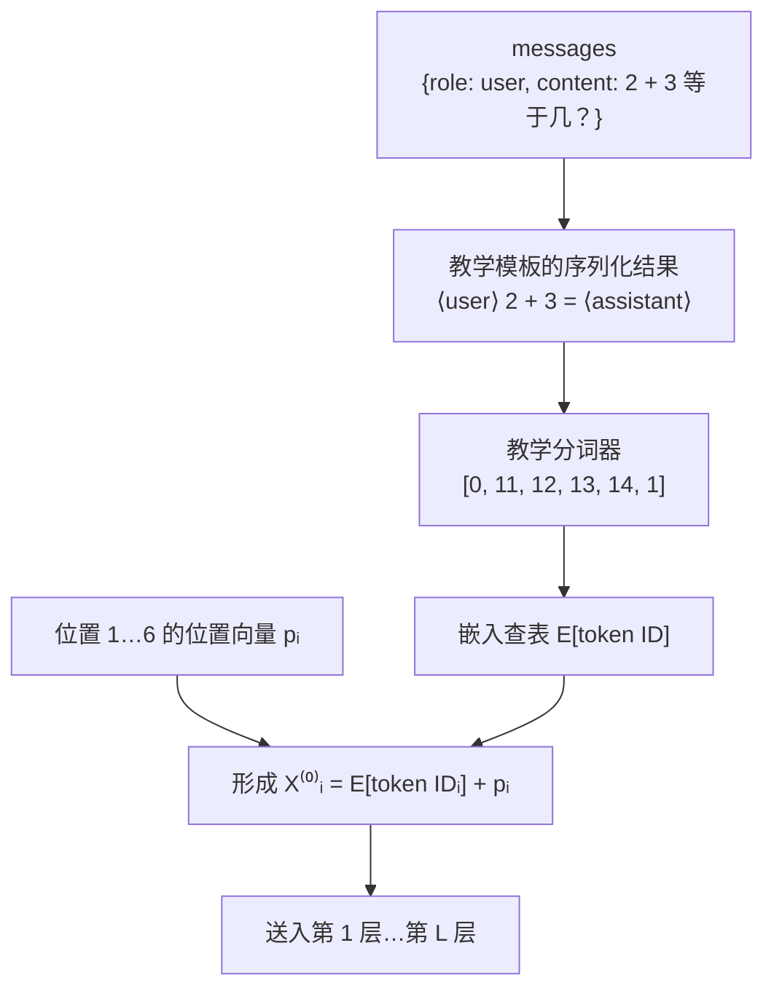
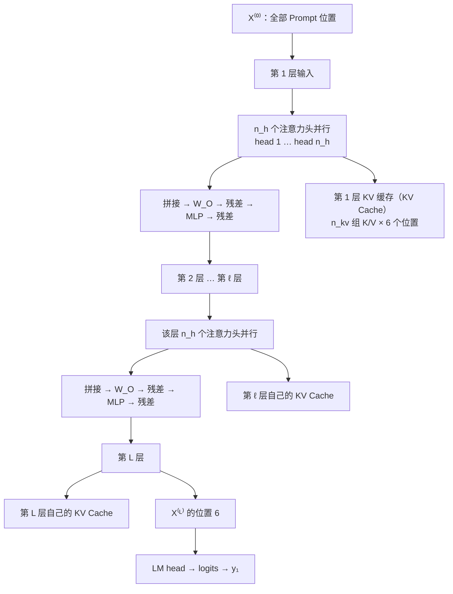
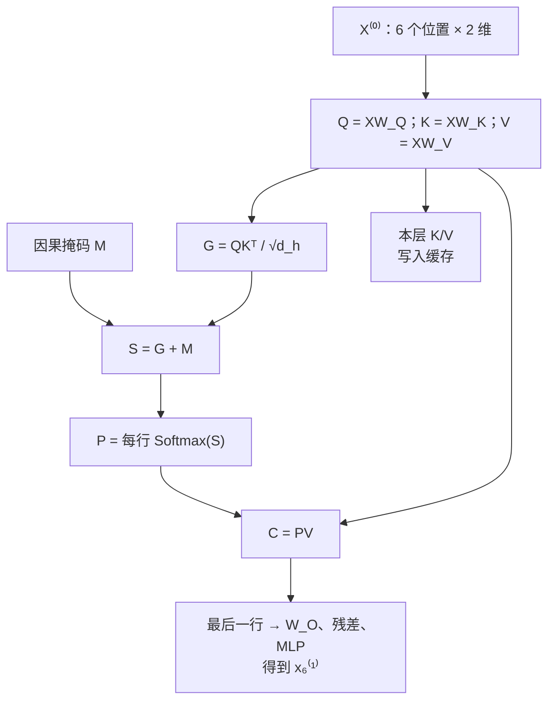
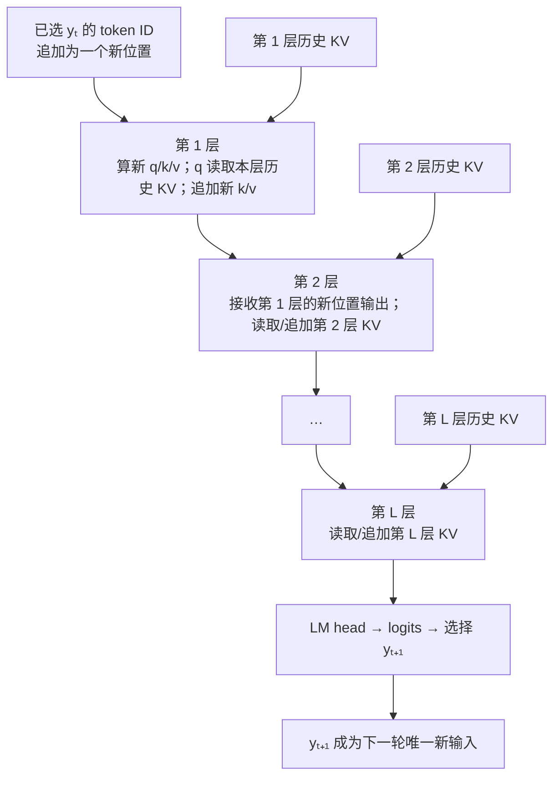
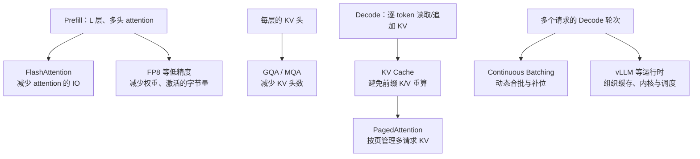
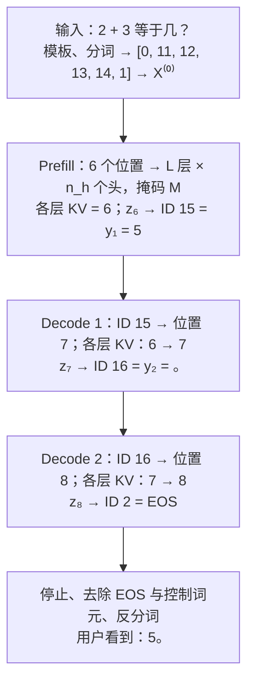

## 3.8 GPT 式仅解码器：一次回答如何生成

以用户提问“2 + 3 等于几？”为例，一次 GPT 式回答不是模型先一次性写好“5。”，再逐字显示出来。它先处理完整输入，并选出第一个输出词元；随后把这个词元加到序列末尾，再计算下一个。选中 EOS 或触发停止规则后，已选词元才会被还原为最终文本。

本节讲的是公开仅解码器 Transformer 的**计算流程**，不试图复原任何闭源 GPT 的未公开权重、层数或服务实现。为使每一步可追踪，文中的词元、ID、向量和权重均为教学示意；它们不是任何实际模型的分词结果或参数。

### 3.8.1 先记住整条时间线

一次请求中只有一次 Prefill；此后每生成一个词元，都要完成一次 Decode。下图中的 `y₁`、`y₂` 是已经被选定的离散词元，不是模型预先写好的完整答案。EOS 是“序列结束”词元：它只表示停止，不显示给用户。LM head 是把最后表示映射为整个词表分数的线性层；这些未归一化分数称为 logits。

为让后面的图和公式可以连续阅读，表 3-1 先固定本节符号。大写 `X` 表示全部位置，小写 `x` 表示其中一个位置；大写 `P` 表示注意力权重，小写 `p` 表示位置向量，二者不要混淆。

| 符号 | 含义与用途 |
| --- | --- |
| `L` | Transformer 层数；层按 1 到 L 依次执行。 |
| `n_h`、`n_kv` | Query 头数、K/V 头数；普通多头注意力中二者相同，GQA/MQA 中 `n_kv` 可更小。 |
| `i`、`s`、`t` | 词元位置与生成轮次；i 表示任意已有位置，s 表示 Decode 中刚追加的新位置，t 表示第 t 个已选输出词元。 |
| `E[idᵢ]`、`pᵢ` | ID `idᵢ` 的词嵌入、位置 i 的位置向量。 |
| `X⁽ˡ⁾`、`xₛ⁽ˡ⁾` | 第 ℓ 层输出的全部位置表示、其中位置 s 的单个向量；`X⁽⁰⁾` 是进入第 1 层前的表示。 |
| `Q`、`K`、`V` | Query、Key、Value：分别用于提出读取请求、标记可被读取的位置、提供被加权读取的内容。 |
| `S`、`P`、`C` | 注意力分数、Softmax 后的注意力权重、读出后的上下文化向量。 |
| `W_Q`、`W_K`、`W_V`、`W_O`、`W_vocab`、`b_vocab` | 模型学习到的 Q/K/V 投影、多头输出投影，以及 LM head 的词表投影矩阵和偏置。 |
| `d_model`、`d_h`、`M` | 模型表示维度、每个头的向量维度、因果掩码；M 将未来位置的分数置为 −∞。 |
| `X̃`、`U`、Norm、MLP、ReLU | 归一化后的层输入、注意力残差后的中间表示、归一化、逐位置非线性网络；ReLU 只用于本节教学手算。 |
| `K_cache`、`V_cache`、`Attnₛ` | 同一层中历史位置的 Key/Value 缓存、位置 s 读出历史与当前 Value 后的注意力输出。 |
| `zₛ`、`yₜ`、EOS | 位置 s 的 logits、已选第 t 个输出词元、序列结束词元。 |
| `B` | 批大小；缓存形状中的 B 表示一次并行处理的请求数。 |

表 3-1：本节使用的符号与含义。

上标 `T` 表示矩阵转置；`[A; B]` 表示沿词元位置拼接 A 和 B；`Concat` 表示沿特征维拼接多个头的输出。

图 3-8：从结构化消息到最终文本的完整生成时间线。

这条图可以压缩成一句话：**Prefill 读完已知上下文并选出 y₁；Decode 每次只处理一个已选词元，并选出下一个词元。** L 层、多头注意力发生在这两个阶段内部，不能消除输出词元之间的因果依赖。

### 3.8.2 输入边界：消息如何变成初始表示

模型不直接接收一句自然语言。服务端先按该模型的聊天模板，把消息列表排成一串词元；生成时，模板通常还会加入“助手将开始说话”的控制标记。不同模型的模板和特殊词元不同，因此下面固定一套教学模板，不伪造真实模型的 token ID。

图 3-9：消息、模板、词元 ID 和初始表示之间的边界。真实模型的模板与 ID 可以不同，但数据流顺序相同。

为使后面的数值可复算，教学模板把问题写成“⟨user⟩ 2 + 3 = ⟨assistant⟩”。表 3-2 保留了完整 Prompt：模型既看到算式，也看到谁在提问、何时该由助手回答。这里采用“词嵌入加位置向量”的简化位置方案；使用 RoPE 的模型通常在每层注意力内部对 Q/K 注入位置信息，位置作用的边界相同，具体机制见[第四章](../04_position_encoding/README.md)。

| 位置 | 教学词元 | 教学 ID | 词嵌入 E | 位置向量 p | 初始表示 X⁽⁰⁾ |
| --- | --- | ---: | --- | --- | --- |
| 1 | `⟨user⟩` | 0 | [0.0, 0.0] | [0.0, 0.0] | [0.0, 0.0] |
| 2 | `2` | 11 | [0.9, -0.1] | [0.1, 0.1] | [1.0, 0.0] |
| 3 | `+` | 12 | [-0.2, 0.8] | [0.2, 0.2] | [0.0, 1.0] |
| 4 | `3` | 13 | [0.7, 0.7] | [0.3, 0.3] | [1.0, 1.0] |
| 5 | `=` | 14 | [0.6, -0.4] | [0.4, 0.4] | [1.0, 0.0] |
| 6 | `⟨assistant⟩` | 1 | [0.5, -0.5] | [0.5, 0.5] | [1.0, 0.0] |

表 3-2：教学 Prompt 的离散 ID 如何成为连续的初始表示。每个值均为手算设定。

为便于跟踪输出，本例固定三个教学 ID：`15` 对应 `5`，`16` 对应 `。`，`2` 对应 EOS；“其他”代表其余候选。于是后文的 ID `15` 可以直接还原为词元 `5`。

### 3.8.3 Prefill：完整 Prompt 穿过 L 层、多头注意力

Prefill 一开始就拿到表 3-2 列出的 6 个 Prompt 词元，也就是位置 1 到 6；它们同时进入模型。下面的表先规定“谁可以看谁”：行是正在计算的 Query 位置，列是可读取的 Key 位置。`0` 表示允许读取，`−∞` 表示禁止读取。

| Query 位置 \ Key 位置 | 1 | 2 | 3 | 4 | 5 | 6 |
| --- | ---: | ---: | ---: | ---: | ---: | ---: |
| 1 | 0 | −∞ | −∞ | −∞ | −∞ | −∞ |
| 2 | 0 | 0 | −∞ | −∞ | −∞ | −∞ |
| 3 | 0 | 0 | 0 | −∞ | −∞ | −∞ |
| 4 | 0 | 0 | 0 | 0 | −∞ | −∞ |
| 5 | 0 | 0 | 0 | 0 | 0 | −∞ |
| 6 | 0 | 0 | 0 | 0 | 0 | 0 |

表 3-3：教学 Prompt 的因果掩码 M。举例说，计算位置 2 时可以读取位置 1 和 2，却不能读取未来的位置 5。对应的位置对满足：

$$
S_{2,5} = \frac{q_2 k_5^T}{\sqrt{d_h}} + (-\infty) = -\infty,
\qquad P_{2,5} = 0
$$

也就是说，先把 M 加到注意力分数 S，再对该行做 Softmax；被屏蔽的位置自然得到 0 权重。这样，6 个位置可以同时计算，但每个位置仍只能读取自己和左边的历史位置，依赖方向始终从左到右。

典型 GPT 式模型由 L 个参数不同的 Transformer 层串联而成。第 ℓ 层接收上一层的全部位置表示 X⁽ˡ⁻¹⁾。层内的 `n_h` 个注意力头并行计算，结果拼接后依次经过输出投影、残差和 MLP，得到 X⁽ˡ⁾。最后，只有 X⁽ᴸ⁾ 的最后一个有效位置交给 LM head，选择 y₁。

图 3-10：Prefill 中的 L 层、多头结构。KV 只能在“同一层、跨时间步”复用，不能把第 1 层的 K/V 当作第 2 层的 K/V。

可以按五步理解一层计算。先投影出 Q/K/V，并形成带掩码的分数 S。再用 Softmax 把 S 变成注意力权重矩阵 P，用 P 读取 V，得到每个头的上下文化向量 C。接着合并多头，经 W_O、残差和 MLP 更新本层表示。第 2 层到第 L 层重复相同结构。最后，LM head 把最后一层最后一个位置的表示变成下一词元的分数。

以常见预归一化写法，第 ℓ 层中第 h 个头的计算可概括为：

$$
\widetilde{X}^{(\ell)} = \operatorname{Norm}^{(\ell)}\left(X^{(\ell-1)}\right)
$$

$$
Q_h^{(\ell)} = \widetilde{X}^{(\ell)}W_{Q,h}^{(\ell)},\quad
K_h^{(\ell)} = \widetilde{X}^{(\ell)}W_{K,h}^{(\ell)},\quad
V_h^{(\ell)} = \widetilde{X}^{(\ell)}W_{V,h}^{(\ell)}
$$

$$
S_h^{(\ell)} = \frac{Q_h^{(\ell)}K_h^{(\ell)T}}{\sqrt{d_h}} + M,\quad
P_h^{(\ell)} = \operatorname{softmax}\left(S_h^{(\ell)}\right),\quad
C_h^{(\ell)} = P_h^{(\ell)}V_h^{(\ell)}
$$

这里的 Softmax 按行独立执行：每一行对应一个 Query 位置，行内所有可见 Key 的权重之和为 1；被 M 屏蔽的位置权重为 0。

$$
U^{(\ell)} = X^{(\ell-1)} +
\operatorname{Concat}\left(C_1^{(\ell)},\ldots,C_{n_h}^{(\ell)}\right)W_O^{(\ell)}
$$

$$
X^{(\ell)} = U^{(\ell)} +
\operatorname{MLP}^{(\ell)}\left(\operatorname{Norm}^{(\ell)}\left(U^{(\ell)}\right)\right)
$$

“多头”指同一层有 `n_h` 组独立的 Q/K/V 投影和注意力结果；“多层”指第 ℓ 层的输出必须先成为第 ℓ + 1 层的输入。上式按普通多头注意力书写。若模型使用 GQA/MQA，Query 头数 `n_h` 仍可较多，但多个 Query 头共享一组 K/V，缓存中只保存 `n_kv` 组。这样会缩小缓存，却不会改变层间顺序或逐词元生成的因果顺序。多头注意力的结构细节见[2.3 节](../02_attention/2.3_multi_head.md)。

**先完整算一遍第 1 层、第 1 个头。**

真实模型中的 L × `n_h` 份矩阵无法逐项手算。下面用同一个 6 个词元的 Prompt，完整算出图 3-10 中“第 1 层的 head 1”的每个矩阵。其余头按同样规则并行；第 2 层到第 L 层再按同样结构依次执行。

图 3-11：一个注意力头的完整矩阵计算。最后一行对应 Prompt 的最后位置 6；其他行使用表 3-3 的掩码屏蔽未来。

为保持算式简短，教学模型取 `L = n_h = n_kv = 1`，`d_model = d_h = 2`。Norm、W_Q、W_K、W_V、W_O 都设为恒等变换，MLP 定义为 `0.1 × ReLU(x)`。因此这里有 `Q = K = V = X⁽⁰⁾`。这只是从完整架构中取出一个可复核的局部，不表示真实模型只有一层一头。

下面始终跟踪**位置 6**，因为它是 Prompt 的最后位置，会产生首个输出词元。矩阵中的第 i 行都对应位置 i；完整矩阵用于核对所有位置，而每一步后的“位置 6”算式用于亲手跟算。下列小数显示到三位；计算时仍使用完整精度。

**第 1 步：把 6 个初始表示排成输入矩阵。** 表 3-2 的最后一列按位置堆叠后得到：

$$
X^{(0)} =
\begin{bmatrix}
0 & 0 \\
1 & 0 \\
0 & 1 \\
1 & 1 \\
1 & 0 \\
1 & 0
\end{bmatrix}
$$

**第 2 步：从输入投影出 Q、K、V。** 本例的 Q/K/V 投影都是恒等变换，所以三者都等于这个输入矩阵：

$$
Q = K = V = X^{(0)}
$$

**第 3 步：让每个 Query 与每个 Key 打分。** 先不加掩码。令 G 表示原始分数矩阵，则每个元素都来自一个 Query 与一个 Key 的点积，再除以 $\sqrt{2}$。例如位置 6 对位置 4 的分数是：

$$
G_{6,4} = \frac{[1,0]\,[1,1]^T}{\sqrt{2}} = 0.707
$$

对所有位置对重复这一步，得到：

$$
G = \frac{QK^T}{\sqrt{2}} =
\begin{bmatrix}
0 & 0 & 0 & 0 & 0 & 0 \\
0 & 0.707 & 0 & 0.707 & 0.707 & 0.707 \\
0 & 0 & 0.707 & 0.707 & 0 & 0 \\
0 & 0.707 & 0.707 & 1.414 & 0.707 & 0.707 \\
0 & 0.707 & 0 & 0.707 & 0.707 & 0.707 \\
0 & 0.707 & 0 & 0.707 & 0.707 & 0.707
\end{bmatrix}
$$

**第 4 步：加因果掩码，切断未来位置。** 接着将表 3-3 的 M 加到 G。位置 2 原本能与位置 5 算出分数，但加 M 后变为 −∞；同理，所有右上三角的未来位置都被屏蔽。位置 6 没有未来位置，所以它的一整行保持不变：

$$
S = G + M =
\begin{bmatrix}
0 & -\infty & -\infty & -\infty & -\infty & -\infty \\
0 & 0.707 & -\infty & -\infty & -\infty & -\infty \\
0 & 0 & 0.707 & -\infty & -\infty & -\infty \\
0 & 0.707 & 0.707 & 1.414 & -\infty & -\infty \\
0 & 0.707 & 0 & 0.707 & 0.707 & -\infty \\
0 & 0.707 & 0 & 0.707 & 0.707 & 0.707
\end{bmatrix}
$$

**第 5 步：把分数变成权重。** 对 S 的每一行分别做 Softmax，得到注意力权重矩阵 P。每一行只在可见位置间分配权重，行和为 1。位置 6 的第二个权重为：

$$
P_{6,2} = \frac{e^{0.707}}{2e^0 + 4e^{0.707}} = 0.201
$$

其余五个位置按同一规则计算，得到：

$$
P = \operatorname{softmax}_{\mathrm{row}}(S) =
\begin{bmatrix}
1 & 0 & 0 & 0 & 0 & 0 \\
0.330 & 0.670 & 0 & 0 & 0 & 0 \\
0.248 & 0.248 & 0.503 & 0 & 0 & 0 \\
0.109 & 0.221 & 0.221 & 0.449 & 0 & 0 \\
0.124 & 0.251 & 0.124 & 0.251 & 0.251 & 0 \\
0.099 & 0.201 & 0.099 & 0.201 & 0.201 & 0.201
\end{bmatrix}
$$

**第 6 步：按权重读取 Value。** 最后用 P 加权 V，得到上下文化矩阵 C。位置 6 的一行就是六个 Value 的加权和：

$$
o_6 = 0.099[0,0] + 0.201[1,0] + 0.099[0,1]
+ 0.201[1,1] + 0.201[1,0] + 0.201[1,0]
= [0.802,\ 0.299]
$$

对所有位置重复这一步，得到：

$$
C = PV =
\begin{bmatrix}
0 & 0 \\
0.670 & 0 \\
0.248 & 0.503 \\
0.670 & 0.670 \\
0.753 & 0.375 \\
0.802 & 0.299
\end{bmatrix}
$$

C 的第 s 行就是位置 s 读出后的上下文化向量；最后一行 `[0.802, 0.299]` 与刚才手算的 o₆ 一致。

后面的 Decode 仍只需计算一行。为方便描述，记 `aₛ = Pₛ,:` 为位置 s 的注意力权重行，`oₛ = Cₛ,:` 为位置 s 的上下文化向量；`rₛ` 是注意力残差后的向量，`mₛ` 是 MLP 输出。

至此注意力完成。现在只取 C 的最后一行，继续计算位置 6 的残差和 MLP：

$$
r_6 = [1, 0] + [0.802, 0.299] = [1.802, 0.299]
$$

$$
m_6 = 0.1\operatorname{ReLU}(r_6) = [0.180, 0.030],\quad
x_6^{(1)} = r_6 + m_6 = [1.982, 0.329]
$$

真实模型会继续把 x₆⁽¹⁾ 送入第 2 层，直至 x₆⁽ᴸ⁾。对需要生成的最后位置 s，真实 LM head 的一般形式是：

$$
z_s = x_s^{(L)}W_{\mathrm{vocab}} + b_{\mathrm{vocab}}
$$

`W_vocab` 是模型学习到的词表投影，`b_vocab` 是可选偏置；有些模型省略偏置，或让 `W_vocab` 与输入词嵌入矩阵共享。zₛ 的长度等于词表大小，每个分量对应一个候选 token ID 的分数。Softmax 可以把这些分数变成概率。本节固定采用贪心策略 `argmax(zₛ)`，即选择分数最大的 ID。

在这个单层教学模型中，直接用 x₆⁽¹⁾ 接 LM head。为便于手算，只保留 `5`、`。`、EOS、“其他”四个候选；下面的四维规则是上述词表投影的教学替代，并定义位置 6 的 logits 为 z₆。教学 MLP 采用 ReLU；真实模型的激活函数可为 GELU、SwiGLU 等，随具体架构而定：

$$
z_6 = [x_{6,1}^{(1)},\ x_{6,2}^{(1)},\ -x_{6,1}^{(1)},\ 0]
= [1.982,\ 0.329,\ -1.982,\ 0]
$$

$$
\operatorname{softmax}(z_6) = [0.742,\ 0.142,\ 0.014,\ 0.102]
$$

采用贪心解码时，`argmax(z₆)` 对应教学 ID `15`，即 y₁ = `5`。至此 Prefill 结束：它产生了首词元，也为**每一层**保存了六个位置的 KV 缓存（KV Cache）。

### 3.8.4 Decode：把一个已选词元送回 L 层

位置 6 的 logits 只选出第一个词元 `5`，不会顺带给出第二个词元。要继续生成，先把 y₁ = `5` 加到位置 7。位置 7 再依次穿过第 1 层到第 L 层；每层只计算它新增的 Q/K/V，读取并追加本层自己的 K/V。最后一层的位置 7 表示才会产生 y₂。

对于第 ℓ 层的新位置 s，其注意力读取可写为：

$$
\operatorname{Attn}^{(\ell)}_s =
\operatorname{softmax}\left(
\frac{q_s^{(\ell)}[K_{\mathrm{cache}}^{(\ell)};k_s^{(\ell)}]^T}{\sqrt{d_h}}
\right)
[V_{\mathrm{cache}}^{(\ell)};v_s^{(\ell)}]
$$

可以把缓存想成“每层 × K/V 头 × 已有长度 × 每头维度”。带 batch 时常写作 `[B, n_kv, s, d_h]`：B 是批大小，s 是当前总长度；实际数组顺序会因运行时而异。要记住的只有一条：K/V 只能在**同一层、跨时间步**复用。

下图将这个公式展开为一轮实际的层内状态流。它刻意画出“第 1 层历史 KV”“第 2 层历史 KV”和“第 L 层历史 KV”是三份独立状态。

图 3-12：一轮 Decode 的层内顺序。每层各有自己的缓存；新位置仍须经过全部 L 层，KV 缓存只避免重算历史前缀。

#### 第 1 轮 Decode：由 y₁ = `5` 选出 y₂ = `。`

教学 token `5` 的 ID 为 15，并被追加到位置 7。其词嵌入为 `[-0.7, 0.3]`、位置表示为 `[0.7, 0.7]`，所以新位置初始表示为 `[0, 1]`。在单层单头教学模型中，位置 7 的 Query 要读取六个历史 Key 和自己的新 Key：

$$
\frac{q_7K_{\leq7}^T}{\sqrt{2}}
= [0,\ 0,\ 0.707,\ 0.707,\ 0,\ 0,\ 0.707]
$$

$$
a_7 = [0.099,\ 0.099,\ 0.201,\ 0.201,\ 0.099,\ 0.099,\ 0.201],\quad
o_7 = [0.499,\ 0.603]
$$

$$
r_7 = [0, 1] + [0.499, 0.603] = [0.499, 1.603]
$$

$$
m_7 = [0.050, 0.160],\quad x_7^{(1)} = [0.548, 1.764]
$$

$$
z_7 = [0.548,\ 1.764,\ -0.548,\ 0],\quad
\operatorname{softmax}(z_7) = [0.189,\ 0.638,\ 0.063,\ 0.109]
$$

`argmax(z₇)` 对应教学 ID `16`，所以 y₂ = `。`。位置 6 的 logits 只负责选择 `5`；位置 7 的 logits 才负责选择 `。`。

#### 第 2 轮 Decode：由 y₂ = `。` 选出 EOS

接着，教学 ID `16` 被追加到位置 8。令它的词嵌入为 `[-1.8, -0.8]`、位置表示为 `[0.8, 0.8]`，因此新位置表示为 `[-1, 0]`。位置 8 读取七个历史 K/V 和自己的 K/V：

$$
\frac{q_8K_{\leq8}^T}{\sqrt{2}}
= [0,\ -0.707,\ 0,\ -0.707,\ -0.707,\ -0.707,\ 0,\ 0.707]
$$

$$
a_8 = [0.143,\ 0.070,\ 0.143,\ 0.070,\ 0.070,\ 0.070,\ 0.143,\ 0.290],\quad
o_8 = [-0.008,\ 0.356]
$$

$$
r_8 = [-1, 0] + [-0.008, 0.356] = [-1.008, 0.356]
$$

$$
m_8 = [0, 0.036],\quad x_8^{(1)} = [-1.008, 0.392]
$$

$$
z_8 = [-1.008,\ 0.392,\ 1.008,\ 0],\quad
\operatorname{softmax}(z_8) = [0.065,\ 0.265,\ 0.491,\ 0.179]
$$

`argmax(z₈)` 对应 EOS，循环停止。EOS 用于控制生成结束，不会被拼接到用户可见文本中。

| 阶段 | 本轮输入 | 本轮选择 | 每层 KV 长度 | 用户可见累积文本 |
| --- | --- | --- | ---: | --- |
| Prefill | 6 个 Prompt token IDs | y₁ = `5` | 6 | 空 |
| Decode 1 | `5` 的 ID | y₂ = `。` | 7 | `5` |
| Decode 2 | `。` 的 ID | EOS | 8 | `5。` |
| 结束处理 | 去除 EOS 与控制词元 | 反分词 | 不再增长 | `5。` |

表 3-4：同一请求的离散状态轨迹。每一轮的“本轮选择”只能在本轮前向计算结束后出现。

### 3.8.5 将局部手算还原为典型 GPT

表 3-5 将“可手算的 1 层 1 头”与“典型 L 层 n_h 头”并列。它们的区别在于并行的头数和串行的层数，而不是输出词元是否还能并行地产生。

| 教学局部 | 典型 GPT 式结构 | 对生成顺序的影响 |
| --- | --- | --- |
| 1 个 Q/K/V 投影 | 每层 n_h 个头各有 Q/K/V 投影，随后拼接并过 W_O | 同一层的头可并行；仍只为当前新位置计算 |
| 1 层注意力与 MLP | L 层参数不同的注意力、残差、归一化和 MLP 依次执行 | 第 ℓ 层输出必须成为第 ℓ + 1 层输入 |
| 1 份 K/V | 每层各存一份 K/V；GQA/MQA 可令 n_kv 小于 n_h | 只可在同层跨时间步复用 |
| x⁽¹⁾ 直接进 LM head | x⁽ᴸ⁾ 的最后有效位置进 LM head | 每轮仍只得到一个“下一词元”分布 |

因此，完整的 Decode 不是“只跑一个小注意力层”。一个已选词元要先过第 1 层，再过第 2 层，直到第 L 层；每层中的 `n_h` 个头可以并行。最后才由 LM head 选出一个新词元。对单个请求，`y₁ → y₂ → …` 的外层顺序不可跳过；服务端只能把不同请求处在同一轮的 Decode 合并计算。

### 3.8.6 同一条流程上的优化地图

前面的轨迹故意从未优化的单请求角度解释因果关系。实际优化不改变“选出一个词元后，才能开始下一轮”的规则；它们处理的是 attention 的数据搬运、KV 容量或多请求调度。

图 3-13：优化技术挂在同一条生成流程的不同位置。

| 技术 | 挂在流程的哪一步 | 主要处理的瓶颈 | 深入阅读 |
| --- | --- | --- | --- |
| FlashAttention | Prefill 与 Decode 的 attention 内核 | attention 中间量的 HBM 读写 | [10.3 节](../10_inference_optimization/10.3_flash_attention.md) |
| FP8 等低精度 | 权重、激活值或 KV 的存取 | 字节量、显存容量和带宽 | [10.4 节](../10_inference_optimization/10.4_quantization.md)、[11.4 节](../11_serving/11.4_hardware.md) |
| GQA/MQA | 模型的多头注意力结构 | 每个词元须保存的 KV 头数 | [2.3 节](../02_attention/2.3_multi_head.md)、[10.2 节](../10_inference_optimization/10.2_kv_cache.md) |
| KV 缓存 | Decode 的历史上下文 | 历史前缀 K/V 的重复计算 | [10.2 节](../10_inference_optimization/10.2_kv_cache.md) |
| PagedAttention | 多请求的 KV 缓存管理 | 碎片化和过度预留 | [11.2 节](../11_serving/11.2_continuous_batching.md) |
| Continuous Batching | 多请求的逐轮 Decode | 已完成请求留下的批次空洞 | [11.2 节](../11_serving/11.2_continuous_batching.md) |
| vLLM 等推理运行时 | 服务层 | 将执行内核、缓存和调度组织为系统 | [11.1 节](../11_serving/11.1_engines_overview.md) |

这些技术不是同一类开关。FlashAttention 优化 attention 内核；GQA/MQA 改变模型结构；KV 缓存保存单请求状态；PagedAttention 管理缓存内存；Continuous Batching 调度请求；vLLM 将这些机制组织为运行时。图 3-8 到图 3-13 说明每项技术作用的位置。图 3-14 最后把同一教学例子的输入、每轮位置、logits、选出的 ID、每层缓存长度和用户可见文本连在一起，可从上到下复述一次完整生成。

图 3-14：从用户消息到“5。”的完整教学示例。Prefill 只发生一次；每个 Decode 节点只处理一个已选词元，且所有层的缓存长度在该轮结束后同步增加 1。
