## 3.8 GPT 式仅解码器：一次回答如何生成

本节沿“2 + 3 等于几？”这一输入，展示 GPT 式仅解码器 Transformer 如何计算并逐词元生成回答。先看完整结构，再逐步计算首个词元，最后跟踪后续生成。

文中的词元、ID、向量和权重均为手工设定，仅用于演示计算流程，不是实际模型的参数，也不表示教学模型已经学会加法。真实模型的权重由训练得到（见[第五章](../05_pretraining/README.md)）。

### 3.8.1 整体结构与生成流程

一次生成循环分为五步：**构造输入 → 多层计算 → 词表打分 → 选择词元 → 继续或停止**。先用图 3-10 看一轮内部的计算结构，再用图 3-11 看多轮如何衔接。

本例把问题简写为“2 + 3 =”，加上角色标记后，固定为六个教学词元：`⟨user⟩`、`2`、`+`、`3`、`=`、`⟨assistant⟩`。这串完整输入称为 Prompt。其中“6”是输入词元的数量；回答中的“5”则是一个新生成的词元，其内容是数字字符“5”。生成时从词表候选中选择下一个词元，并不是从这六个输入词元中挑选。

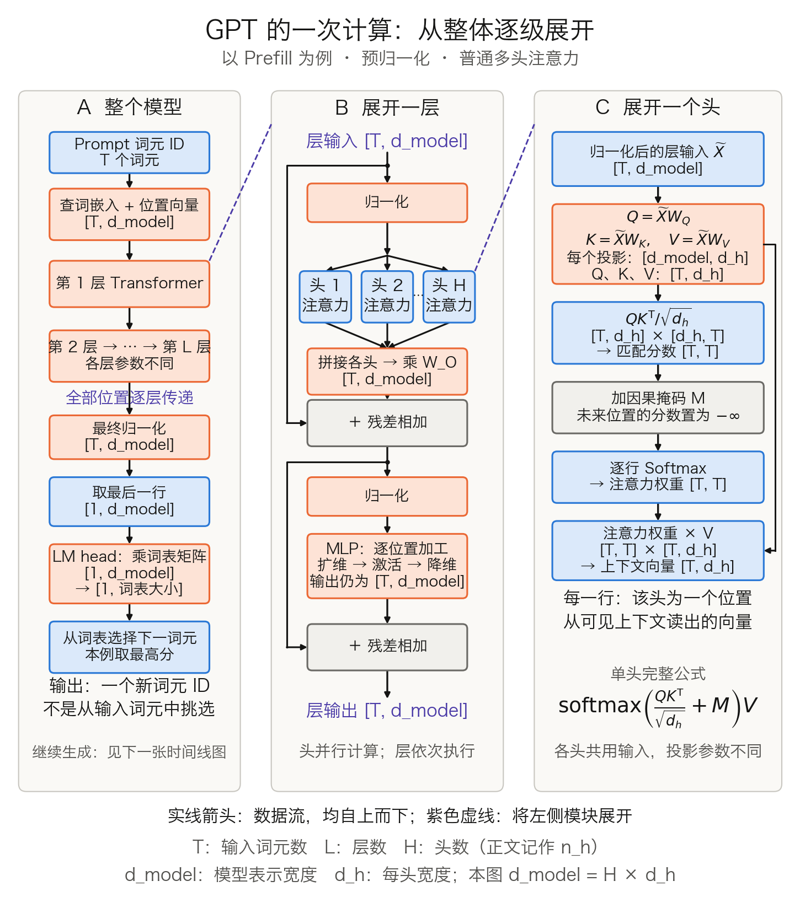

图 3-10：一次 Prefill 的计算结构，以预归一化、普通多头注意力和两矩阵 MLP 为例（[生成脚本](https://github.com/yeasy/llm_internals/blob/main/tools/figures/gpt_inference_overview.py)）。A 区展示整个模型，B 区展开其中一层，C 区展开一个注意力头；各区自上而下，紫色虚线只表示展开关系，不表示数据流。形状按“行数、列数”标注，T 是输入词元数。后文按同一路径给出矩阵算例。

图中的“表示”是描述一个位置的数值向量；将多个位置的向量按行排列，就得到矩阵。“头”是注意力内部并行计算的分支，“层”则是依次执行的处理单元。先理解它们的输入、输出与目的，后文再引入公式。

**归一化的目的。** 分别调整每个词元向量的数值尺度，有助于稳定训练；不混合不同位置的信息，也不改变矩阵形状。X̃ 表示归一化后的 X，仍为 `[T, d_model]`。归一化不是将数值变成概率，也不保证每个数落在固定区间；具体计算见 [3.6.3 节](3.6_layer_norm.md)。

**先看通用维度。** 矩阵形状统一写作 `[行数, 列数]`，暂不写批大小。`d_model` 是每个位置在层间传递的向量宽度；例如 `d_model = 4096` 表示每个词元位置用 4096 个数表示，不是 4096 个词元。`n_h` 是注意力头数，`d_h` 是每头宽度；普通多头注意力常取 `d_model = n_h × d_h`。`d_ff` 是 MLP 中间向量的宽度，`n_vocab` 是词表大小，不能与 Value 矩阵 V 混淆。

为同时描述两个阶段，用 `n` 表示本轮输入的位置数，`m` 表示本层历史与当前 K/V 的总位置数。首次处理整个 Prompt 时 `n = m = T`；启用缓存后，单词元 Decode 的 `n = 1`，但 `m` 随生成增长。各宽度由模型配置确定，不随本轮输入长短变化。

| 运算与目的 | 输入、参数 → 输出形状 |
| --- | --- |
| 嵌入查表：把 ID 变成向量 | `n` 个 ID，从嵌入表 `[n_vocab, d_model]` 取出 `n` 行 → `[n, d_model]` |
| 加位置向量：标明位置（本图方案） | 两个 `[n, d_model]` 逐元素相加 → `[n, d_model]` |
| 注意力前归一化：调整特征尺度 | `[n, d_model] → [n, d_model]`，每行独立处理 |
| 单头 Q/K/V 投影：生成查询、键、值 | 三次独立的 `[n, d_model] × [d_model, d_h]` → Q、新 K、新 V 各 `[n, d_h]` |
| 合并 K/V 缓存：保留可读取的历史 | 历史各 `[m−n, d_h]` 与新值各 `[n, d_h]` 沿行拼接 → 完整 K、V 各 `[m, d_h]` |
| 打分：衡量各位置的匹配程度 | `Q × Kᵀ`：`[n, d_h] × [d_h, m] → [n, m]`；除以 `√d_h` 不改变形状 |
| 掩码与逐行 Softmax：得到读取权重 | 分数加上 `[n, m]` 掩码，再沿每行的 `m` 列做 Softmax → `[n, m]` |
| 加权读取：得到一个头的上下文 | 权重乘 V：`[n, m] × [m, d_h] → [n, d_h]` |
| 拼接多头：汇集各头结果 | `n_h` 个 `[n, d_h]` 沿列拼接 → `[n, n_h × d_h]` |
| 输出投影：混合各头信息 | `[n, n_h × d_h] × W_O[n_h × d_h, d_model] → [n, d_model]` |
| 第一次残差：将注意力结果加回层输入 | 两个 `[n, d_model]` 逐元素相加 → `[n, d_model]` |
| MLP 前归一化：调整下一子层的输入 | `[n, d_model] → [n, d_model]` |
| 两矩阵 MLP：逐位置加工特征 | `[n, d_model] × W_up[d_model, d_ff] → [n, d_ff]`；激活后再乘 `W_down[d_ff, d_model] → [n, d_model]` |
| 第二次残差：将 MLP 结果加回其输入 | 两个 `[n, d_model]` 逐元素相加 → 本层输出 `[n, d_model]`；交给下一层 |
| 全部 L 层后，最终归一化并取最后位置 | `[n, d_model] → [n, d_model] → [1, d_model]` |
| LM head：为词表候选打分 | `[1, d_model] × W_vocab[d_model, n_vocab] → [1, n_vocab]` |
| 选词与停止判断：确定本轮结果 | 从 `n_vocab` 个分数中选出一个词元 ID；未停止则作为下一轮输入 |

表 3-14：普通多头、Pre-Norm 模型的一轮计算，省略线性层偏置；矩阵乘法的内侧维度必须相等。3.8.2 至 3.8.5 展开首轮计算，3.8.6 展开缓存复用。GQA 的 K/V 共享方式与带批大小的形状见 3.8.7；RoPE 不在输入处加位置向量，而是在各层 Q/K 投影后旋转，形状不变。

注意力权重 `[n, m]` 的**行是发起查询的位置，列是被读取的位置**，不是 `m` 维的词元表示。本例 Prefill 为 `Q[6,2] × Kᵀ[2,6] → 权重[6,6] → 上下文[6,2]`；下一轮 Decode 为 `Q[1,2] × Kᵀ[2,7] → 权重[1,7] → 上下文[1,2]`。其中打分后仍需缩放、掩码与 Softmax，读取上下文时再乘 V。

表中的真实两矩阵 MLP 会先扩维再降维；SwiGLU 则有两个并行的升维投影，其中一支先经 SiLU 激活，两支逐元素相乘后再降维，输入输出仍同形状（见 [3.4 节](3.4_feedforward.md)）。后文的 `0.1 × ReLU(x)` 只是手算替代，不能据此省略真实模型的投影矩阵。

首次计算处理全部输入词元，称为 **Prefill（预填充）**；此后每轮处理一个刚生成的词元，称为 **Decode（解码）**。两者使用同一个模型，区别是本轮输入的行数，以及是否读取历史缓存。每层保留自己算出的 Key、Value，供下一轮使用，这就是 **KV Cache（KV 缓存）**；3.8.3 解释这些量，3.8.6 说明缓存为什么可以复用。

在本例的基本自回归流程中，每轮前向计算得到下一词元的分数，选词后才能确定下一轮的输入。回答“5。”需要三轮计算：

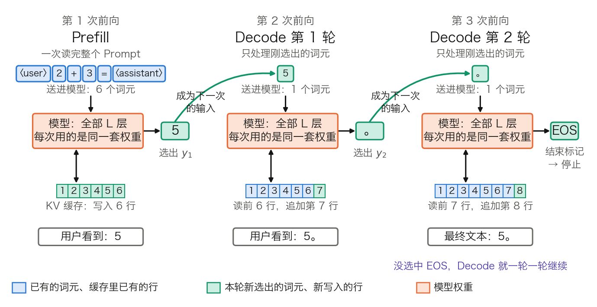

图 3-11：同一模型连续运行三轮：处理全部六个输入词元，生成首个词元“5”；输入词元“5”，生成下一个词元“。”；输入词元“。”，生成结束标记 EOS（[生成脚本](https://github.com/yeasy/llm_internals/blob/main/tools/figures/inference_timeline.py)）。EOS 只控制停止，不显示给用户。已生成词元的 ID 可以逐步还原为文本并输出，这一步称为反分词，不必等到整个回答生成完毕。

以下先逐步算出首个词元，再在 3.8.6 跟踪 Decode；优化放到最后讨论。

### 3.8.2 构造输入表示：从文本到向量矩阵

模型接收的是词元 ID，而不是原始文本。服务端先按模型的聊天模板组织消息，再由分词器转换为词元 ID；生成前，模板通常还会加入表示“助手回复开始”的控制标记。不同模型的模板和特殊词元不同，本节使用固定的教学模板与教学 ID。

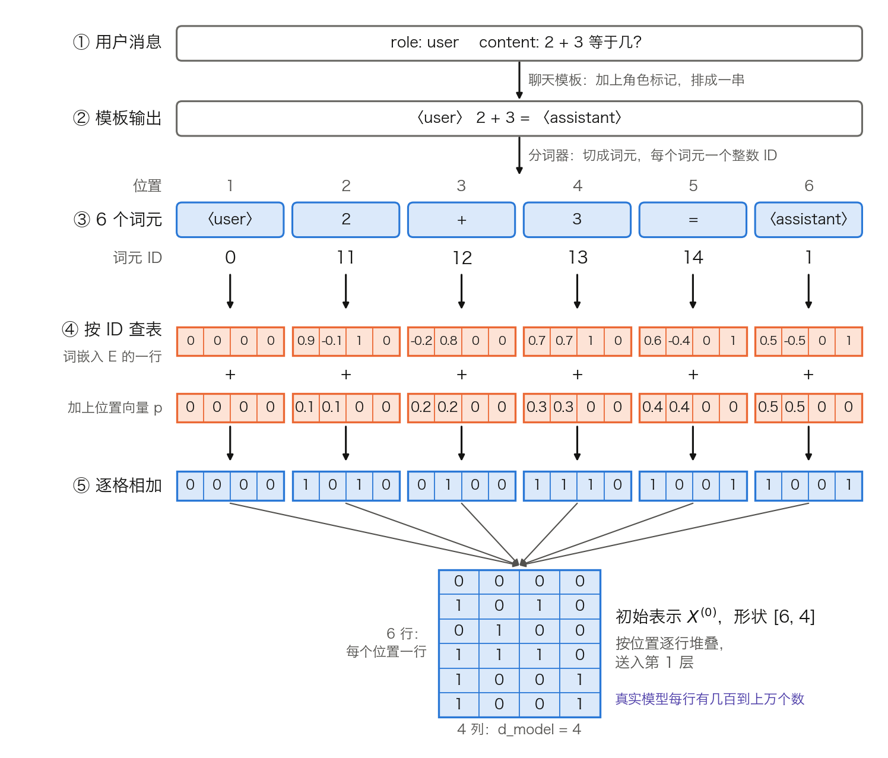

图 3-12：一条消息怎样变成初始表示 X⁽⁰⁾（[生成脚本](https://github.com/yeasy/llm_internals/blob/main/tools/figures/input_pipeline.py)）。图中数值与表 3-15 一致；真实模型的模板与 ID 可以不同，但数据流顺序相同。

图中先做分词，再做嵌入查表。分词把文本切成词元，并给每个词元一个整数 ID，此时仍是离散表示；嵌入查表才将 ID 转为连续向量：按 ID 从词嵌入矩阵 E 中取出对应的一行向量（见 [3.2 节](3.2_embedding.md)）。取出的向量只说明“这是哪个词元”，不说明“它排在第几位”，所以还要加上位置向量 p。两者之和就是该位置进入第 1 层之前的**初始表示**，全部位置合起来记作 X⁽⁰⁾。

表 3-15 展开前述六个教学词元：角色标记表示用户消息和助手回复的边界，算式是问题内容。把“等于几？”简写为“=”只是本例减少手算量的约定，不是聊天模板的功能；真实聊天模板通常保留用户内容，并补充角色、消息边界等控制标记。位置方面，这里采用“词嵌入加位置向量”的方案（见 [3.3 节](3.3_position_encoding.md)）；RoPE 则在每层注意力内部旋转 Query 和 Key 来引入位置（见[第四章](../04_position_encoding/README.md)），不在输入处相加。两种方案都在注意力打分之前引入位置信息。

| 位置 | 教学词元 | 教学 ID | 词嵌入 E | 位置向量 p | 初始表示 X⁽⁰⁾ |
| --- | --- | ---: | --- | --- | --- |
| 1 | `⟨user⟩` | 0 | [0.0, 0.0, 0, 0] | [0.0, 0.0, 0, 0] | [0, 0, 0, 0] |
| 2 | `2` | 11 | [0.9, -0.1, 1, 0] | [0.1, 0.1, 0, 0] | [1, 0, 1, 0] |
| 3 | `+` | 12 | [-0.2, 0.8, 0, 0] | [0.2, 0.2, 0, 0] | [0, 1, 0, 0] |
| 4 | `3` | 13 | [0.7, 0.7, 1, 0] | [0.3, 0.3, 0, 0] | [1, 1, 1, 0] |
| 5 | `=` | 14 | [0.6, -0.4, 0, 1] | [0.4, 0.4, 0, 0] | [1, 0, 0, 1] |
| 6 | `⟨assistant⟩` | 1 | [0.5, -0.5, 0, 1] | [0.5, 0.5, 0, 0] | [1, 0, 0, 1] |

表 3-15：教学 Prompt 的离散 ID 如何成为连续的初始表示。最后一列由它左边的两列（词嵌入 E 与位置向量 p）逐分量相加得到，例如位置 2 是 `[0.9 + 0.1, −0.1 + 0.1, 1 + 0, 0 + 0] = [1, 0, 1, 0]`。

每个位置用 4 个数表示，即 `d_model = 4`。这些值都是手工设定的：前两维是倒推出来的，为的是让相加后只剩 0 和 1，后面的乘法可以心算；第 3 维标记“这个词元是数字”，第 4 维标记“这个位置在等答案”，是为了让后文第二个注意力头的行为一眼看得懂。真实模型的向量有数百到上万维，由训练得到，单独某一维通常没有这样清晰的含义。

为便于跟踪输出，本例再固定四个教学 ID：`15` 对应 `5`，`16` 对应 `。`，`17` 对应 `6`，`2` 对应 EOS；“其他”代表其余候选。于是后文的 ID `15` 可以直接还原为词元 `5`。

### 3.8.3 多头注意力：计算权重并读取上下文

现在进入总图中的第 1 层，先计算多头注意力。输入是六个位置的向量，输出是每个头为各位置读出的上下文向量；这还不是整层输出，也不是词元。

本例采用 1 层、2 个头，每个位置用 4 个数表示，每头输出 2 个数。对应记号为：层数 `L = 1`、头数 `n_h = 2`、模型宽度 `d_model = 4`、每头宽度 `d_h = 2`。本轮有 6 个词元，即 `T = 6`。真实模型通常更深、更宽，公开配置在 3.8.7 集中对照。

真实预归一化模型先对层输入做归一化，再投影 Q/K/V。为便于手算，本例将归一化设为恒等变换，因此可直接使用上一小节的初始表示。头 1 展开全部位置的计算；头 2 沿用同一算法，只展开本层最后位置所需的结果。矩阵相乘遵循 `[a, b] × [b, c] → [a, c]`：左边的列数等于右边的行数，结果保留左边的行数和右边的列数。

为保证后续计算可复现，补充以下教学设定：各处归一化都设为恒等变换（即不改变输入）；MLP 定义为 `0.1 × ReLU(x)`，其中 ReLU 把负数变成 0、正数保持不变，这个定义省掉了真实 MLP“先扩到约 4 倍宽、再压回来”的两个矩阵（见 [3.4 节](3.4_feedforward.md)）；LM head 不设偏置。输出投影 `W_O`、词表投影 `W_vocab` 以及新词元 `5`、`。` 的词嵌入，用到时给出。每个头的三个投影矩阵都是 `[4, 2]`，即 4 行 2 列。头 1 的三个投影取同一个矩阵：

$$
W_{Q,1} = W_{K,1} = W_{V,1} =
\begin{bmatrix}
0 & 1 \\
1 & 0 \\
0 & 0 \\
0 & 0
\end{bmatrix}
$$

矩阵的第 k 行决定输入向量的第 k 维怎样进入结果，全 0 的行表示这个头不看那一维。头 1 只看前两维，并把它们左右互换，例如 `[1, 0, 1, 0]` 变成 `[0, 1]`；为缩短手算，它的三个投影设成了相同。头 2 的矩阵留到算头 2 时再给。这些权重都不是训练得到的，只为让乘法的每一步看得见。

以下分六步计算头 1，重点跟踪 Prompt 的最后位置（位置 6）：它经过全部层后的表示用于预测首个新词元。

手算只需要两样工具。一是矩阵乘法的规则：结果的第 i 行第 j 列，等于左边矩阵的第 i 行与右边矩阵的第 j 列逐项相乘再相加。二是几个常数。本例 Prefill 中的注意力分数只有 0、`1/√2 ≈ 0.707`、`√2 ≈ 1.414` 三种取值，对应的指数是 `e⁰ = 1`、`e^(1/√2) ≈ 2.028`、`e^√2 ≈ 4.113`；Decode 第 2 轮还会用到 `e^(−1/√2) ≈ 0.493`。本节所有注意力权重都能由这几个数加减乘除得到，普通计算器即可复核；只有 LM head 的概率一列需要计算器上的 eˣ 键。

**第 1 步：排成输入矩阵。** 问题：怎样让 6 个位置一起参与计算？把各位置的向量按行堆叠成一个矩阵，后面每一次矩阵乘法就同时处理了全部位置：

$$
X^{(0)} =
\begin{bmatrix}
x_1^{(0)} \\
\vdots \\
x_T^{(0)}
\end{bmatrix}
\in \mathbb{R}^{T\times d_{\mathrm{model}}}
$$

本例将表 3-15 的最后一列按位置堆叠，得到 `X⁽⁰⁾:[6, 4]`，6 行是 6 个位置，4 列是 `d_model`：

$$
\underbrace{X^{(0)}}_{6\times4} =
\begin{bmatrix}
0 & 0 & 0 & 0 \\
1 & 0 & 1 & 0 \\
0 & 1 & 0 & 0 \\
1 & 1 & 1 & 0 \\
1 & 0 & 0 & 1 \\
1 & 0 & 0 & 1
\end{bmatrix}
$$

**第 2 步：投影出 Q、K、V。** 将输入分别投影为 Query、Key 和 Value，用于匹配位置和读取内容。三个投影的输入相同，参数分别定义：

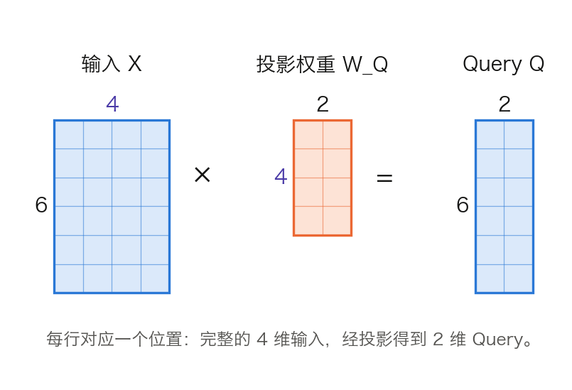

图 3-13：教学模型的矩阵形状示意，后续分图随计算展开。每个格子代表一个数，紫色标出相乘时必须相等的维度；蓝色为数据，橙色为训练参数（[生成脚本](https://github.com/yeasy/llm_internals/blob/main/tools/figures/attention_shape_flow.py)）。此图是 Q 的投影，K、V 的形状相同。

$$
Q=XW_Q,\quad K=XW_K,\quad V=XW_V
$$

形状：本例 `X[6, 4] × W_Q[4, 2] → Q[6, 2]`，每个位置从 4 个数变成 2 个数；GPT-3 Small 是 `X[6, 768] × W_Q[768, 64] → Q[6, 64]`。Q 的第 i 行是位置 i 的“我要找什么”，K 的第 i 行是“我可被怎样匹配”，V 的第 i 行是“我提供什么内容”。以头 1、位置 2 为例，取 `X⁽⁰⁾` 的第 2 行 `[1, 0, 1, 0]`，分别与 `W_Q,1` 的第 1 列 `[0, 1, 0, 0]`、第 2 列 `[1, 0, 0, 0]` 逐项相乘再相加：

$$
\begin{aligned}
\text{第 1 格} &= 1\times0+0\times1+1\times0+0\times0 = 0 \\
\text{第 2 格} &= 1\times1+0\times0+1\times0+0\times0 = 1 \\
[1,\ 0,\ 1,\ 0]\,W_{Q,1} &= [0,\ 1]
\end{aligned}
$$

其余各行同法。头 1 的三组权重相同，所以三个矩阵也相同，每一行恰是 `X⁽⁰⁾` 对应行的前两维左右互换：

$$
\underbrace{X^{(0)}}_{6\times4}
\underbrace{W_{Q,1}}_{4\times2}
= \underbrace{Q_1 = K_1 = V_1}_{\text{各为 }6\times2} =
\begin{bmatrix}
0 & 0 \\
0 & 1 \\
1 & 0 \\
1 & 1 \\
0 & 1 \\
0 & 1
\end{bmatrix}
$$

这一步的 K 和 V 还有第二个用途：它们就是 Prefill 留给 Decode 的 KV 缓存，3.8.6 会原样取用。第 3 到 6 步继续只算头 1，为了简洁，把 `Q₁`、`K₁`、`V₁` 写作 Q、K、V。

**第 3 步：Q 与 K 打分。** 问题：位置 i 该重点读取哪些位置？用位置 i 的 Query 与每个位置的 Key 做点积（对应分量相乘再相加），点积越大表示越匹配；再除以 `√d_h`，避免分数随维度增大而过大（见 2.2 节）：

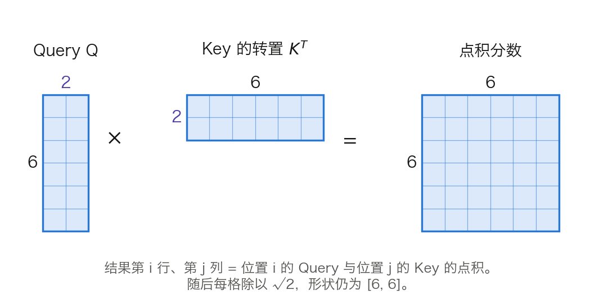

$$
\text{匹配分数}=\frac{QK^T}{\sqrt{d_h}}
$$

形状：本例 `Q[6, 2] × Kᵀ[2, 6] → 分数[6, 6]`；GPT-3 Small 是 `Q[6, 64] × Kᵀ[64, 6] → 分数[6, 6]`，沿每头的向量维度求和，结果的行、列分别对应 Query 和 Key 的位置，因此仍是 `[6, 6]`。第 i 行第 j 列是“位置 i 的 Query 对位置 j 的 Key”的分数。`Kᵀ` 是把 K 的行列对调，它的第 j 列就是 K 的第 j 行，所以按矩阵乘法的规则，这一格等于 Q 的第 i 行与 K 的第 j 行的点积。除数里是每头宽度 `d_h = 2` 而不是 `d_model = 4`，故除以 `√2`。以位置 6 对位置 4 为例，取 Q 的第 6 行和 K 的第 4 行：

$$
\frac{[0,1]\,[1,1]^T}{\sqrt{2}} = \frac{0\times1+1\times1}{\sqrt{2}} = 0.707
$$

同理，位置 4 对自己的分数是 `[1, 1]·[1, 1] / √2 = 2 × 0.707 = 1.414`，是全表最大的一格。头 1 的 Q、K 各行只含 0 和 1，点积只可能是 0、1 或 2，因此分数只有 0、0.707、1.414 三种取值。对所有位置对重复这一步，得到匹配分数矩阵：

$$
\frac{\underbrace{Q}_{6\times2}\underbrace{K^T}_{2\times6}}{\sqrt{2}}
=
\begin{bmatrix}
0 & 0 & 0 & 0 & 0 & 0 \\
0 & 0.707 & 0 & 0.707 & 0.707 & 0.707 \\
0 & 0 & 0.707 & 0.707 & 0 & 0 \\
0 & 0.707 & 0.707 & 1.414 & 0.707 & 0.707 \\
0 & 0.707 & 0 & 0.707 & 0.707 & 0.707 \\
0 & 0.707 & 0 & 0.707 & 0.707 & 0.707
\end{bmatrix}
$$

**第 4 步：加因果掩码。** 问题：上面的矩阵里，位置 2 对位置 5 也有分数，可位置 5 在位置 2 的右边，属于“未来”。Prompt 里位置 5 的内容其实是已知的，屏蔽它不是因为看不到，而是因为模型训练时每个位置就只见过自己和左边的内容，推理时必须保持同样的条件；也正因为每个位置从不读取右边，3.8.6 的 KV 缓存才成立。所以要把未来位置的分数屏蔽掉。做法是加上因果掩码 M：允许读取的格子加 0，禁止读取的格子加 −∞。

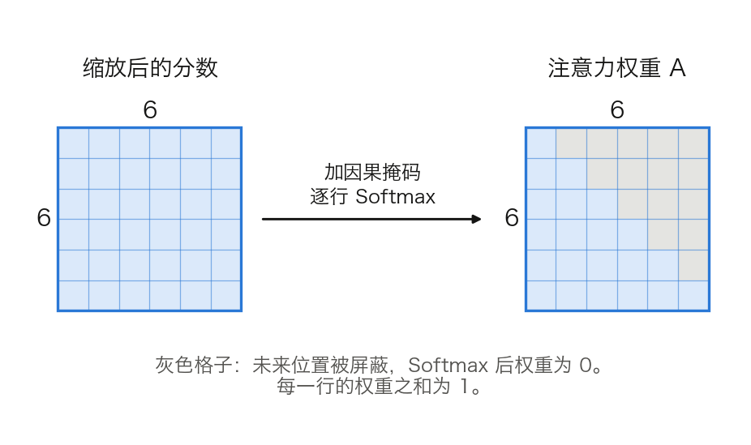

| Query 位置 \ Key 位置 | 1 | 2 | 3 | 4 | 5 | 6 |
| --- | ---: | ---: | ---: | ---: | ---: | ---: |
| 1 | 0 | −∞ | −∞ | −∞ | −∞ | −∞ |
| 2 | 0 | 0 | −∞ | −∞ | −∞ | −∞ |
| 3 | 0 | 0 | 0 | −∞ | −∞ | −∞ |
| 4 | 0 | 0 | 0 | 0 | −∞ | −∞ |
| 5 | 0 | 0 | 0 | 0 | 0 | −∞ |
| 6 | 0 | 0 | 0 | 0 | 0 | 0 |

表 3-16：教学 Prompt 的因果掩码 M。行是正在计算的 Query 位置，列是被读取的 Key 位置；位置 i 只能读取位置 1 到 i。

$$
\text{带掩码的分数}=\text{匹配分数}+M
$$

形状：`分数[6, 6] + M[6, 6] → [6, 6]`，逐格相加，不是矩阵乘法。位置 2 对位置 5 的分数变为 −∞；位置 6 右边没有位置，故整行不变：

$$
\underbrace{\text{匹配分数}}_{6\times6} + \underbrace{M}_{6\times6}
=
\begin{bmatrix}
0 & -\infty & -\infty & -\infty & -\infty & -\infty \\
0 & 0.707 & -\infty & -\infty & -\infty & -\infty \\
0 & 0 & 0.707 & -\infty & -\infty & -\infty \\
0 & 0.707 & 0.707 & 1.414 & -\infty & -\infty \\
0 & 0.707 & 0 & 0.707 & 0.707 & -\infty \\
0 & 0.707 & 0 & 0.707 & 0.707 & 0.707
\end{bmatrix}
$$

**第 5 步：把分数变成权重。** 问题：分数有大有小，还不能直接用来“按比例读取”。对每一行做 Softmax，把分数换成一组非负且和为 1 的权重；−∞ 经过 Softmax 恰好变成 0，被屏蔽的位置因此完全读不到：

$$
\text{注意力权重}=\operatorname{softmax}_{\mathrm{row}}(\text{带掩码的分数})
$$

一行分数 `s₁ … sₙ` 的 Softmax 分三个动作：每个分数取 e 的指数，把这一行的指数全部加起来，再用每个指数除以这个和。其中 `e^(−∞) = 0`，所以被屏蔽的格子既不进入行和，自己的权重也是 0：

$$
\text{第 } j \text{ 格的权重} = \frac{e^{s_j}}{e^{s_1}+e^{s_2}+\cdots+e^{s_n}}
$$

形状：`[6, 6] → 权重[6, 6]`，每一行各自归一化，行与行互不影响。位置 6 这一行的分数是 `[0, 0.707, 0, 0.707, 0.707, 0.707]`，取指数得 `[1, 2.028, 1, 2.028, 2.028, 2.028]`，行和为 `2 × 1 + 4 × 2.028 = 10.112`。于是它对位置 2 的权重为：

$$
\text{位置 6 对位置 2 的权重}
= \frac{e^{0.707}}{2e^0 + 4e^{0.707}} = \frac{2.028}{10.112} = 0.201
$$

对位置 1 的权重则是 `1 / 10.112 = 0.099`。表 3-17 对每一行都写出这三个动作。

| 位置 | 可见各格取指数 | 行和（指数相加） | 权重（各项 ÷ 行和） |
| --- | --- | ---: | --- |
| 1 | 1 | 1 | 1 |
| 2 | 1、2.028 | 3.028 | 0.330、0.670 |
| 3 | 1、1、2.028 | 4.028 | 0.248、0.248、0.503 |
| 4 | 1、2.028、2.028、4.113 | 9.169 | 0.109、0.221、0.221、0.449 |
| 5 | 1、2.028、1、2.028、2.028 | 8.084 | 0.124、0.251、0.124、0.251、0.251 |
| 6 | 1、2.028、1、2.028、2.028、2.028 | 10.112 | 0.099、0.201、0.099、0.201、0.201、0.201 |

表 3-17：逐行计算注意力权重。第一列是 Query 位置；每行从左到右依次对应 Key 位置 1、2、3…；被掩码屏蔽的格子指数为 0，未列出。

把各行的权重填回 `[6, 6]` 的矩阵，屏蔽的格子填 0：

$$
\underbrace{\text{注意力权重}}_{6\times6} =
\begin{bmatrix}
1 & 0 & 0 & 0 & 0 & 0 \\
0.330 & 0.670 & 0 & 0 & 0 & 0 \\
0.248 & 0.248 & 0.503 & 0 & 0 & 0 \\
0.109 & 0.221 & 0.221 & 0.449 & 0 & 0 \\
0.124 & 0.251 & 0.124 & 0.251 & 0.251 & 0 \\
0.099 & 0.201 & 0.099 & 0.201 & 0.201 & 0.201
\end{bmatrix}
$$

这张矩阵可以逐行读：最后一行表示位置 6 把约 20% 的注意力各分给位置 2、4、5、6，约 10% 各分给位置 1、3。右上角全是 0，正是因果掩码的效果；位置 1 只能读自己，所以第一行是 `[1, 0, 0, 0, 0, 0]`。

**第 6 步：按权重读取 Value。** 问题：权重只说明“各读多少”，读的内容是什么？是各位置的 Value。把每个位置的 Value 按权重加起来，得到该位置读到的上下文向量 context：

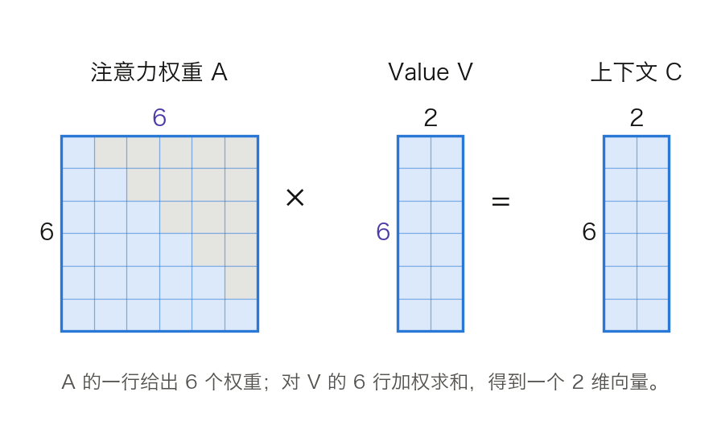

$$
\text{context}=\text{注意力权重}\times V
$$

形状：本例 `权重[6, 6] × V[6, 2] → context[6, 2]`；GPT-3 Small 是 `权重[6, 6] × V[6, 64] → context[6, 64]`。位置 6 的一行就是六个 Value 的加权和，权重取自上一步的最后一行，Value 取自第 2 步 V 矩阵的六行：

$$
\begin{aligned}
\text{位置 6 的 context}
&= 0.099[0,0] + 0.201[0,1] + 0.099[1,0] \\
&\quad + 0.201[1,1] + 0.201[0,1] + 0.201[0,1]
\end{aligned}
$$

两个分量分开算：第 1 个分量只有位置 3 和位置 4 的 Value 有贡献，第 2 个分量来自位置 2、4、5、6。直接用三位小数的权重相加会得到 `[0.300, 0.804]`，末位带有舍入误差；要得到准确值，可以先用未除行和的指数做加权，最后只除一次：

$$
\begin{aligned}
\text{位置 6 的 context}
&= \frac{[\,1+2.028,\ \ 4\times2.028\,]}{10.112} \\
&= \frac{[3.028,\ 8.112]}{10.112}
= [0.299,\ 0.802]
\end{aligned}
$$

本节其余的分数、权重和向量也都由未舍入的值算出后再保留三位，所以用页面上已舍入的数复算时，可能出现约 0.001 到 0.002 的差异。行和与 LM head 的指数例外：它们按页面上写出的常数和 logit 计算，可以直接核对。再看一个短的例子：位置 2 只能读位置 1 和 2，它的 context 是 `(1 × [0, 0] + 2.028 × [0, 1]) / 3.028 = [0, 0.670]`。

对所有位置重复这一步，得到：

$$
\underbrace{\text{注意力权重}}_{6\times6}\underbrace{V}_{6\times2}
=
\begin{bmatrix}
0 & 0 \\
0 & 0.670 \\
0.503 & 0.248 \\
0.670 & 0.670 \\
0.375 & 0.753 \\
0.299 & 0.802
\end{bmatrix}
$$

每一行都是该位置在头 1 里读出的 `d_h = 2` 维 context，最后一行 `[0.299, 0.802]` 留待拼接。第 2 步到第 6 步合起来，就是第 2 章的公式：

$$
\text{context} =
\operatorname{softmax}\!\left(\frac{QK^T}{\sqrt{d_h}} + M\right)V
$$

**头 2：同样的第 2 到 6 步，换一组权重。** 头 2 与头 1 读的是同一个 `X⁽⁰⁾`，区别只在投影矩阵。它的三个矩阵互不相同，这才是真实模型的常态：

$$
W_{Q,2} =
\begin{bmatrix}
0 & 0 \\
0 & 0 \\
0 & 1 \\
2 & 0
\end{bmatrix},\quad
W_{K,2} =
\begin{bmatrix}
0 & 0 \\
0 & 0 \\
1 & 0 \\
0 & 1
\end{bmatrix},\quad
W_{V,2} =
\begin{bmatrix}
1 & 0 \\
0 & 1 \\
0 & 0 \\
0 & 0
\end{bmatrix}
$$

回忆表 3-15 下方的说明：第 3 维标记“是数字”，第 4 维标记“在等答案”。头 2 的 Key 直接取这两维，第 1 格是“是数字”，第 2 格是“在等答案”；Query 则是交叉摆放的，第 1 格放“在等答案”并放大 2 倍，第 2 格放“是数字”；Value 取前两维。点积是对应格相乘再相加，所以 Query 第 1 格的“我在等答案”恰好对上 Key 第 1 格的“我是数字”。合起来的意思是：**等待答案的位置对数字位置给出更高的匹配分数，再对所有可见位置的前两维加权求和**；反向匹配时，数字位置对等待答案的位置也给出较高分数，但分数减半，3.8.6 会用到这一条。

先做第 2 步，三个投影都是 `[6, 4] × [4, 2] → [6, 2]`：

$$
Q_2 =
\begin{bmatrix}
0 & 0 \\
0 & 1 \\
0 & 0 \\
0 & 1 \\
2 & 0 \\
2 & 0
\end{bmatrix},\quad
K_2 =
\begin{bmatrix}
0 & 0 \\
1 & 0 \\
0 & 0 \\
1 & 0 \\
0 & 1 \\
0 & 1
\end{bmatrix},\quad
V_2 =
\begin{bmatrix}
0 & 0 \\
1 & 0 \\
0 & 1 \\
1 & 1 \\
1 & 0 \\
1 & 0
\end{bmatrix}
$$

以位置 6 的 Query 为例，`X⁽⁰⁾` 的第 6 行是 `[1, 0, 0, 1]`，第 1、4 维非 0；`W_Q,2` 的第 1 行全是 0，不起作用，只剩第 4 行 `[2, 0]`，得到 `q = 1 × [0, 0] + 1 × [2, 0] = [2, 0]`。`K₂` 的每一行就是 `X⁽⁰⁾` 对应行的第 3、4 维，`V₂` 的每一行是前两维。这一次 Q、K、V 三个矩阵各不相同。

本例只有一层，决定输出的只有位置 6 这一行，所以第 3 到 6 步只算这一行。用 `q = [2, 0]` 与 `K₂` 的六行逐一做点积再除以 `√2`：只有位置 2 和位置 4 的 Key 是 `[1, 0]`，点积为 2，分数为 `2 × 0.707 = 1.414`；其余都是 0。位置 6 是最后一个位置，掩码不改变这一行。

$$
\text{头 2 中位置 6 的分数} = [0,\ 1.414,\ 0,\ 1.414,\ 0,\ 0]
$$

取指数得 `[1, 4.113, 1, 4.113, 1, 1]`，行和为 `4 × 1 + 2 × 4.113 = 12.226`，于是：

$$
\text{头 2 中位置 6 的权重} = [0.082,\ 0.336,\ 0.082,\ 0.336,\ 0.082,\ 0.082]
$$

头 2 把约三分之二的注意力放在 `2` 和 `3` 这两个数字上；同一个位置 6，在头 1 里却是把注意力大致均分给位置 2、4、5、6。**各头使用不同的投影参数，分别计算注意力权重与上下文向量**，这正是设置多个头的目的。再按权重读取 `V₂`，沿用“先加权、最后只除一次”的算法：

$$
\begin{aligned}
\text{头 2 中位置 6 的 context}
&= \frac{[\,4.113+4.113+1+1,\ \ 1+4.113\,]}{12.226} \\
&= \frac{[10.226,\ 5.113]}{12.226}
= [0.836,\ 0.418]
\end{aligned}
$$

第 1 个分量来自 Value 首分量为 1 的位置 2、4、5、6，第 2 个分量来自位置 3 和位置 4。

### 3.8.4 完成一层并逐层传递

两个头的计算结束后，仍需合并各头结果、完成两次残差相加与 MLP，才能得到本层输出。先按同一例子完成计算，再说明这一层如何重复。

**拼接两个头，乘输出投影 `W_O`。** 每个头为位置 6 算出一个 2 维上下文向量，将两个向量首尾拼接，得到 `n_h × d_h = 4` 维：

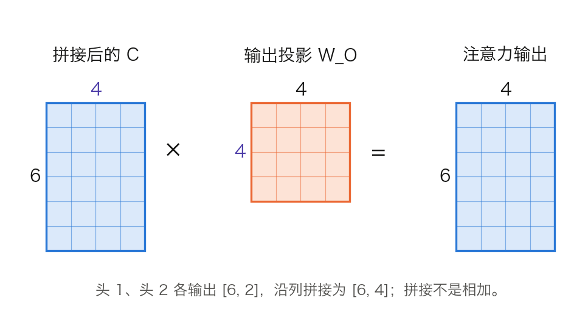

$$
\operatorname{Concat}\big([0.299,\ 0.802],\ [0.836,\ 0.418]\big)
= [0.299,\ 0.802,\ 0.836,\ 0.418]
$$

对 6 个位置都这样做，就是把两个头的 `[6, 2]` 左右并排成 `[6, 4]`。GPT-3 Small 做的是同一件事：12 个 `[T, 64]` 的 context 左右并排成 `[T, 12 × 64] = [T, 768]`。拼接只是把数字排在一起，前两维仍只含头 1 的信息，后两维只含头 2 的信息。输出投影 `W_O` 是一个 `[n_h × d_h, d_model] = [4, 4]` 的矩阵，它让两个头的结果相互混合，得到注意力子层的最终输出。整张矩阵的形状是 `[6, 4] × W_O[4, 4] → [6, 4]`（GPT-3 Small 是 `[6, 768] × W_O[768, 768] → [6, 768]`）；这里只算位置 6 这一行，所以是 `[1, 4] × W_O[4, 4] → [1, 4]`：

$$
\begin{aligned}
\text{注意力输出}
&= [0.299,\ 0.802,\ 0.836,\ 0.418]
\begin{bmatrix}
1 & 0 & 1 & 0 \\
0 & 1 & 0 & 1 \\
1 & 0 & 0 & 0 \\
0 & 1 & 0 & 0
\end{bmatrix} \\
&= [0.299+0.836,\ \ 0.802+0.418,\ \ 0.299,\ \ 0.802] \\
&= [1.136,\ 1.220,\ 0.299,\ 0.802]
\end{aligned}
$$

算法仍是“行乘列”：输出的第 1 个分量取 `W_O` 的第 1 列 `[1, 0, 1, 0]`，即头 1 的第 1 个数加上头 2 的第 1 个数。第 1 个分量若用页面上的三位小数相加会得到 1.135，未舍入的值是 1.1359，这仍是舍入带来的末位差。

**从注意力输出到本层输出。** 注意力只完成了“读”。接着把读到的结果加回位置 6 原来的向量（残差），再让 MLP 加工一次，加工结果同样加回去：

$$
\begin{aligned}
\text{注意力残差后的向量}
&= [1, 0, 0, 1] + [1.136, 1.220, 0.299, 0.802] \\
&= [2.136, 1.220, 0.299, 1.802] \\
\text{MLP 输出}
&= 0.1\operatorname{ReLU}([2.136, 1.220, 0.299, 1.802]) \\
&= [0.214, 0.122, 0.030, 0.180] \\
x_6^{(1)}
&= [2.349, 1.342, 0.329, 1.982]
\end{aligned}
$$

其中 `[1, 0, 0, 1]` 是位置 6 的初始表示。残差向量的四个分量均为正数，经过教学 MLP 后各乘以 0.1，再加回原向量，因此本层输出是残差向量的 1.1 倍。计算使用未舍入值，第一个分量约为 2.34945。

输出 `x₆⁽¹⁾` 仍有 4 个分量。残差相加要求输入与输出同形状，`W_O` 将拼接结果投回 `d_model`。真实多层模型在 Prefill 时把**全部位置的本层输出**送入下一层，而非只传递最后一行。本例只有一层，`x₆⁽¹⁾` 就是位置 6 的末层表示。

#### 一层的结构与多层重复

**一层包含两个子层。** 注意力子层从可见位置读取信息，MLP 子层逐位置加工信息。两者都采用“归一化 → 核心计算 → 残差相加”的组织方式，但核心计算不同。

| 子层 | 运算 | 目的 | 输入 → 输出 |
| --- | --- | --- | --- |
| 注意力 | 归一化 | 调整每个位置的特征尺度（见 [3.6 节](3.6_layer_norm.md)） | `[T, d_model] → [T, d_model]` |
| 注意力 | 多头因果自注意力 | 从自己和左侧位置读取信息，再合并各头结果 | `[T, d_model] → [T, d_model]` |
| 注意力 | 残差相加 | 将注意力输出加到本子层归一化前的输入上 | 两个 `[T, d_model]` 逐元素相加 |
| MLP | 归一化 | 用另一组参数调整特征尺度 | `[T, d_model] → [T, d_model]` |
| MLP | 逐位置 MLP | 对每个位置做非线性变换，不交换位置信息 | `[T, d_model] → [T, d_model]` |
| MLP | 残差相加 | 将 MLP 输出加到本子层归一化前的输入上 | 两个 `[T, d_model]` 逐元素相加 |

表 3-18：预归一化 Transformer 层的结构。表中是各运算的输入、输出形状；注意力内部和 MLP 中间的形状可以改变。

图 3-14 只展开归一化与残差：X 是层输入，U 是第一次残差相加后的中间结果，Y 是本层输出，三者均为 `[n, d_model]`。左侧旁路保留原输入，右侧计算分支学习对它的修正。

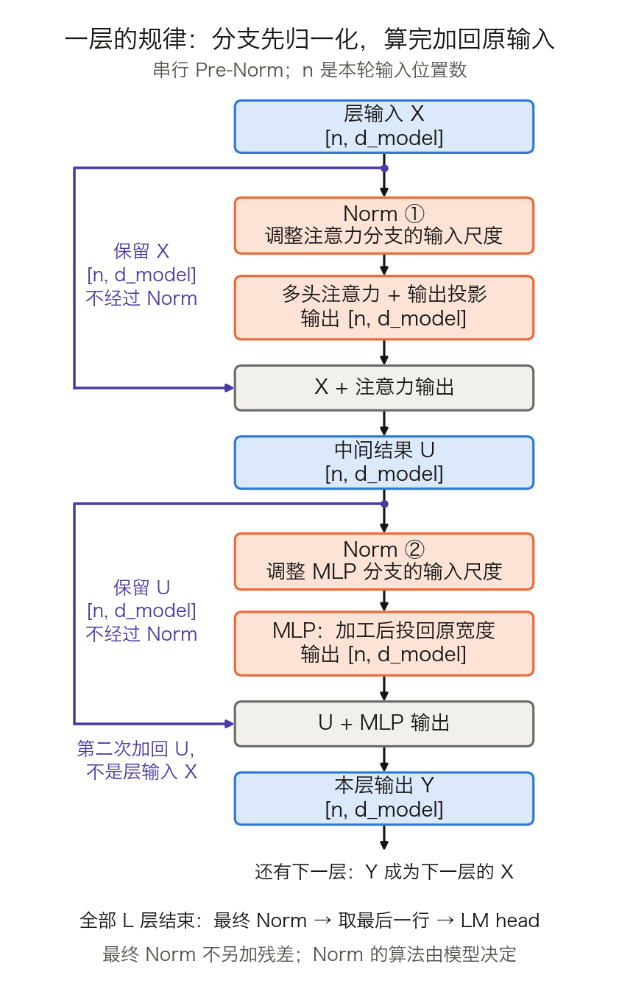

图 3-14：两次归一化与两次残差相加。紫色旁路分别保留归一化前的 X、U；每次相加的两路都是 `[n, d_model]`（[生成脚本](https://github.com/yeasy/llm_internals/blob/main/tools/figures/transformer_layer_blocks.py)）。多头内部计算见图 3-10；本图不重复展开。

**位置与目的。** 本节采用串行 Pre-Norm：子层的计算分支先归一化，调整输入尺度；子层出口做残差相加，保留原表示并叠加计算结果。位置由模型结构固定，不是运行时发现数值过大才临时插入。对应图中两次相加：

$$
\begin{aligned}
U &= X + \operatorname{Attention}\!\left(\operatorname{Norm}_{\mathrm{attn}}(X)\right), \\
Y &= U + \operatorname{MLP}\!\left(\operatorname{Norm}_{\mathrm{mlp}}(U)\right).
\end{aligned}
$$

这里 Attention 包括全部头的 Q/K/V 投影、注意力计算、拼接和输出投影；Decode 时还读取本层缓存。两条旁路分别保留**归一化前**的 X 和 U，不能把第二次相加也写成加 X。MLP 的中间向量可以扩为 `[n, d_ff]`，但必须投回 `[n, d_model]` 才能相加。

残差让子层在原表示上追加修正，而不是直接替换原表示；反向传播时也提供一条不经过子层权重的直通路径，有助于训练深层网络，但不保证梯度始终稳定（见 [3.5 节](3.5_residual.md)）。

便于检查的规则是：**看计算分支入口找 Norm，看子层出口找残差，看全部层的出口找最终 Norm。** 注意力和 MLP 各一组，不是每次矩阵乘法之后都添加一组。其他架构可以采用不同安排，不能在推理时随意更改。

**用 RMSNorm 还是 LayerNorm。** Llama 系列采用 RMSNorm，GPT-2 采用 LayerNorm；因此图中统一写 Norm，不将某一种方法当作所有 GPT 式模型的固定配置。两者都逐位置处理 `d_model` 个分量，且不改变形状。区别是 LayerNorm 先减均值再按标准差缩放，RMSNorm 不减均值，按均方根缩放。可对照 [Llama 实现](https://github.com/meta-llama/llama/blob/main/llama/model.py)的 `TransformerBlock` 与 [GPT-2 实现](https://github.com/openai/gpt-2/blob/master/src/model.py)的 `block`。

对一个位置的向量 x，RMSNorm 的第 j 个输出为：

$$
\operatorname{RMSNorm}(x)_j
= g_j\frac{x_j}{\sqrt{\frac{1}{d_{\mathrm{model}}}\sum_{k=1}^{d_{\mathrm{model}}}x_k^2+\varepsilon}}.
$$

其中 j、k 是向量分量的编号，g 是长度为 `d_model` 的可学习缩放向量，ε 是防止分母为零的小正数。每层两处 Norm 各有自己的参数，末层后的 Norm 也独立。RMSNorm 调整特征尺度；注意力 Softmax 则把一行匹配分数变为非负、总和为 1 的读取权重，二者作用不同，不能替代。推理仍需执行训练时的 Norm；本节手算将其设为恒等变换，只是教学简化。进一步比较见 [3.6 节](3.6_layer_norm.md)和 [RMSNorm 论文](https://arxiv.org/abs/1910.07467)。

**重复与收尾。** 本层的 Y 成为下一层的 X，换用下一层自己的参数，重复上述结构。完成全部 L 层后，做最终归一化，再取最后一行、经 LM head 得到词表分数；最终归一化处不另加残差。本节结构共有 `2L + 1` 次归一化、`2L` 次残差相加。选词后检查停止条件，决定是否进入下一轮生成。

只有注意力让位置之间交换信息；归一化、MLP 和残差相加都逐位置进行。3.8.3 已展开这些注意力运算；本小节补齐了合并、残差与 MLP。

Pre-Norm 表示归一化的位置，RMSNorm/LayerNorm 表示归一化的算法，两者是不同的选择维度。原始 Transformer 的 Post-Norm 则先计算子层、做残差相加，再归一化；与本节的结构差异见 [3.6 节](3.6_layer_norm.md)。

### 3.8.5 从最终表示选出首词元

只有全部 Transformer 层计算结束后，才将最后位置的最终表示转换为词元分数。本例只有一层，因此可直接使用上一小节得到的向量；最终归一化同样按教学设定取恒等变换。

记首个选出的词元为 y₁。

**从最终表示到首词元。** 最后一步由 LM head 完成：它是一个线性层，把最后位置的 `d_model` 维向量换算成词表中每个词元的一个分数。这些未归一化的分数称为 logits，记作 z。下面用 s 表示本轮最后位置（此处为 6），用 `n_vocab` 表示候选词元数：

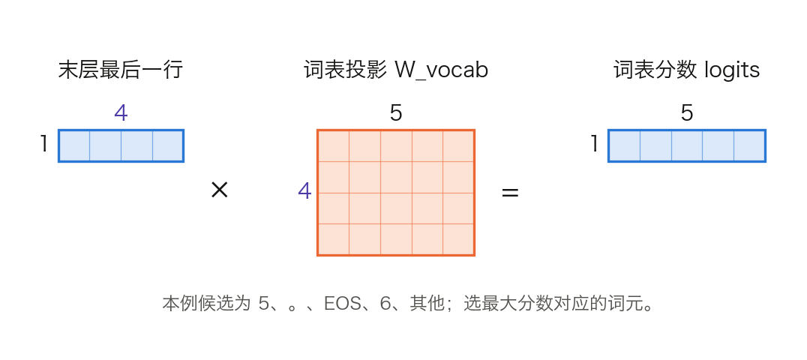

$$
\underbrace{\operatorname{Norm}_{\mathrm{final}}\left(x_s^{(L)}\right)}_{[1,\ d_{\mathrm{model}}]}
\underbrace{W_{\mathrm{vocab}}}_{[d_{\mathrm{model}},\ n_{\mathrm{vocab}}]}
+ \underbrace{b_{\mathrm{vocab}}}_{[n_{\mathrm{vocab}}]}
= \underbrace{z_s}_{[1,\ n_{\mathrm{vocab}}]}
$$

`Norm_final` 是全部 Transformer 层之后的最终归一化；本例将它设为恒等变换，因此下面仍直接用 `x₆⁽¹⁾`。`W_vocab` 是模型学习到的词表投影，`b_vocab` 是偏置；多数 GPT 式模型不设偏置，有些模型还让 `W_vocab` 直接取输入词嵌入矩阵的转置（见 3.7 节）。真实词表有数万到数十万个词元，z 也就有同样多个分数。本例只保留 `5`、`。`、EOS、`6`、“其他”五个候选，`W_vocab` 取一个手工设定的 `[4, 5]` 矩阵，偏置为 0。形状：本例 `x₆[1, 4] × W_vocab[4, 5] → logits[1, 5]`；GPT-3 Small 是 `[1, 768] × W_vocab[768, 50257] → [1, 50257]`：

$$
\begin{aligned}
z_6 = x_6^{(1)}W_{\mathrm{vocab}}
&= [2.349,\ 1.342,\ 0.329,\ 1.982]
\begin{bmatrix}
1 & 0 & -1 & 0 & 0 \\
0 & 1 & 0 & 0 & 0 \\
0 & 0 & 1 & 0 & 0 \\
0 & 0 & 0 & 1 & 0
\end{bmatrix} \\
&= [2.349,\ 1.342,\ -2.020,\ 1.982,\ 0]
\end{aligned}
$$

每一列对应一个候选词元。第 3 格取第 3 列 `[−1, 0, 1, 0]`，是 `2.349 × (−1) + 0.329 × 1 = −2.020`；第 5 列全 0，所以“其他”恒为 0。表 3-19 把这个矩阵的五列翻译成五条打分规则。

| 候选词元 | 教学 ID | 教学打分规则 | 位置 6 的 logit | 取指数 | 概率（÷ 22.692） |
| --- | ---: | --- | ---: | ---: | ---: |
| `5` | 15 | 取 `x₆⁽¹⁾` 的第 1 个分量 | 2.349 | 10.475 | 0.462 |
| `。` | 16 | 取第 2 个分量 | 1.342 | 3.827 | 0.169 |
| EOS | 2 | 第 3 个分量减第 1 个分量 | −2.020 | 0.133 | 0.006 |
| `6` | 17 | 取第 4 个分量 | 1.982 | 7.257 | 0.320 |
| 其他 | — | 恒为 0 | 0 | 1 | 0.044 |

表 3-19：教学 LM head 对位置 6 的打分。“取指数”一列是对表中三位小数的 logit 取指数，方便用计算器上的 eˣ 键直接核对；五个指数之和为 22.692，概率的算法与第 5 步的 Softmax 完全相同。

Softmax 把 logits 变成概率，第 9 章讨论如何按概率采样。本节固定采用最简单的贪心策略：直接选分数最大的候选，即 `argmax(z₆)`。贪心只需比较 logits 的大小，概率一列并非必需，列出来只为直观。五个 logits 中 2.349 最大，它对应教学 ID `15`，所以 y₁ = `5`。表中还可看到，错误答案 `6` 的概率也有 0.320，词元 `5` 的概率还不到一半；若改用按概率采样，这个教学模型大约每三次就有一次答成 `6`，这也印证了引言的提醒：它的权重是手工设定的，并未学会加法。

为什么只用位置 6？其实 6 个位置都能算出各自的 logits，位置 i 的 logits 预测的是“位置 i + 1 是什么词元”。对位置 1 到 5 而言，下一个词元早已写在 Prompt 里，预测结果在推理时用不上（训练时才用它们计算损失）；只有位置 6 的下一个位置还空着，所以只有它的 logits 决定新词元。

至此 Prefill 结束。本轮得到两个结果：首词元 y₁ = `5`，以及两个头在第 2 步算出的 `K₁`、`V₁`、`K₂`、`V₂` 四个 `[6, 2]` 矩阵，也就是这一层、6 个位置的 KV 缓存。真实模型的**每一层、每个 K/V 头**都要各留一份。

### 3.8.6 Decode：继续生成直到结束

根据位置 6 的 logits 只能确定第一个输出词元 `5`，不能同时确定第二个。要继续生成，先把 y₁ = `5` 作为位置 7 追加到序列末尾，再为位置 7 做一次前向；位置 7 的 logits 才决定 y₂。

**为什么位置 1 到 6 不必重算。** 位置 7 的 Query 要与位置 1 到 7 的 Key 逐一打分，再按权重读取位置 1 到 7 的 Value。其中位置 1 到 6 的 K、V 在 Prefill 的第 2 步已经算过，而且一个数都不会变：因果掩码保证位置 1 到 6 从不读取位置 7，而归一化、MLP 和残差都只作用于单个位置，注意力是位置之间唯一的信息通道；所以在末尾追加新词元，不会改变前面任何位置的任何中间结果。把它们原样留下、下一轮直接读取，就是 KV 缓存。表 3-20 列出本例缓存的全部内容：两个头各有一份 K 和一份 V。

| 位置 | 词元 | 头 1 的 K 行 | 头 1 的 V 行 | 头 2 的 K 行 | 头 2 的 V 行 | 何时写入 |
| --- | --- | --- | --- | --- | --- | --- |
| 1 | `⟨user⟩` | [0, 0] | [0, 0] | [0, 0] | [0, 0] | Prefill |
| 2 | `2` | [0, 1] | [0, 1] | [1, 0] | [1, 0] | Prefill |
| 3 | `+` | [1, 0] | [1, 0] | [0, 0] | [0, 1] | Prefill |
| 4 | `3` | [1, 1] | [1, 1] | [1, 0] | [1, 1] | Prefill |
| 5 | `=` | [0, 1] | [0, 1] | [0, 1] | [1, 0] | Prefill |
| 6 | `⟨assistant⟩` | [0, 1] | [0, 1] | [0, 1] | [1, 0] | Prefill |
| 7 | `5` | [1, 0] | [1, 0] | [1, 0] | [0, 1] | Decode 第 1 轮 |
| 8 | `。` | [0, −1] | [0, −1] | [0, 0] | [−1, 0] | Decode 第 2 轮 |

表 3-20：教学模型唯一一层的 KV 缓存。前 6 行就是 3.8.3 中的 `K₁`、`V₁`、`K₂`、`V₂` 四个矩阵。缓存里没有 Q：位置 i 的 Query 只用来算位置 i 自己那一行注意力，那一行算完就不再变，后来的位置也用不到它。

于是 Decode 的一轮只需为新位置 s 在每个头里多算一行。新 Query 是 `[1, d_h]`，这个头缓存的 Key/Value 追加新行后是 `[s, d_h]`；注意力权重是 `[1, s]`，新位置的 context 是 `[1, d_h]`。对第 ℓ 层的任意一个头写成公式（省略头下标）：

$$
\begin{aligned}
A_s^{(\ell)}
&= \operatorname{softmax}\!\left(
\frac{\underbrace{q_s^{(\ell)}}_{[1,\ d_h]}
\underbrace{[K_{\mathrm{cache}}^{(\ell)};k_s^{(\ell)}]^T}_{[d_h,\ s]}}{\sqrt{d_h}}
\right) && [1,\ s] \\
\operatorname{context}_s^{(\ell)}
&= \underbrace{A_s^{(\ell)}}_{[1,\ s]}
\underbrace{[V_{\mathrm{cache}}^{(\ell)};v_s^{(\ell)}]}_{[s,\ d_h]} && [1,\ d_h]
\end{aligned}
$$

其中 `q_s`、`k_s`、`v_s` 是同一个新位置分别投影得到的三个向量，每个向量各占一行，`A_s` 是它对各可见位置的一行注意力权重；上标 `ℓ` 表示层号。`[K_cache; k_s]` 表示在缓存的 K 矩阵下方追加新的一行 `k_s`，V 同理。公式里没有掩码 M：本例每轮只处理最后一个位置，右边没有需要屏蔽的“未来”。有填充位置（padding）、缓存预留空位或一次处理多个新位置时，需要相应的屏蔽规则；合批本身并不意味着一定需要额外屏蔽。

代入形状，教学模型第 1 轮中每个头分三步：投影 `新行[1, 4] × W_Q[4, 2] → q[1, 2]`，k、v 同理；打分 `q[1, 2] × Kᵀ[2, 7] → 分数[1, 7]`；读取 `权重[1, 7] × V[7, 2] → context[1, 2]`。GPT-3 Small 只需把 4 换成 768、把 2 换成 64。对照 3.8.3 的 Prefill 计算，每次乘法里左边的数据和结果的行数都从 6 变成了 1，因为 Query 一侧只剩新位置这一行；K、V 一侧的 6 反而变成 7，因为缓存追加了新行。Prefill 一次算 6 行，Decode 每轮只算 1 行。

图 3-15 的上半幅用头 1 在第 1 轮 Decode 中的真实数值，把“只算一行”画了出来：新位置的 q 与缓存里的 7 行 K 逐行打分，每一行 K 对应一个分数、一个权重，再按权重混合 7 行 V。下半幅是真实模型的情形，下文再说。

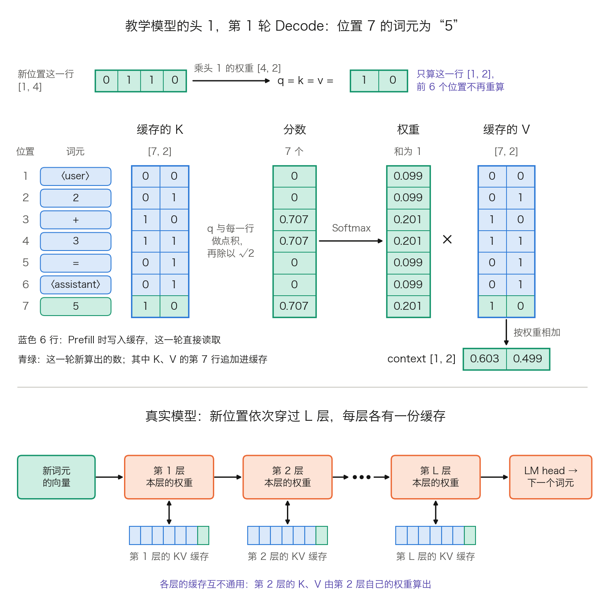

图 3-15：一轮 Decode 怎样对着 KV 缓存只算一行（[生成脚本](https://github.com/yeasy/llm_internals/blob/main/tools/figures/decode_with_cache.py)）。上：教学模型头 1 的第 1 轮，数值与下文的手算一致。下：真实模型中新位置依次穿过 L 层，每层读写本层自己的缓存。

#### 第 1 轮 Decode：由 y₁ = `5` 选出 y₂ = `。`

教学词元 `5` 的 ID 为 15，被追加到位置 7。令它的词嵌入为 `[-0.6, 0.4, 1, 0]`，第 3 维的 1 表示它是数字；位置向量沿表 3-15 的规律每个位置增加 0.1，位置 7 是 `[0.6, 0.6, 0, 0]`。两者相加，新位置的初始表示为 `[0, 1, 1, 0]`。这一轮送进模型的只有这一行 `[1, 4]`，而不是 `[7, 4]` 的整个矩阵。

**头 1。** 新行乘以 `W_Q,1` 得到 `q = k = v = [1, 0]`；其中 k、v 追加进缓存，成为表 3-20 的第 7 行。用 q 与头 1 的前 7 个 K 行逐一打分，例如对位置 4 是 `[1, 0]·[1, 1] / √2 = 0.707`，对位置 2 是 `[1, 0]·[0, 1] / √2 = 0`：

$$
\text{头 1 的分数}
= [0,\ 0,\ 0.707,\ 0.707,\ 0,\ 0,\ 0.707]
$$

取指数得 `[1, 1, 2.028, 2.028, 1, 1, 2.028]`，行和为 `4 × 1 + 3 × 2.028 = 10.084`，各项除以行和即得权重：

$$
\text{头 1 的权重} = [0.099,\ 0.099,\ 0.201,\ 0.201,\ 0.099,\ 0.099,\ 0.201]
$$

再按权重读取头 1 的前 7 个 V 行，沿用“先加权、最后只除一次”的算法。第 1 个分量来自 Value 首分量为 1 的位置 3、4、7，第 2 个分量来自位置 2、4、5、6：

$$
\begin{aligned}
\text{头 1 的 context}
&= \frac{[\,3\times2.028,\ \ 1+2.028+1+1\,]}{10.084} \\
&= \frac{[6.084,\ 5.028]}{10.084}
= [0.603,\ 0.499]
\end{aligned}
$$

**头 2。** 同一行 `[0, 1, 1, 0]` 乘以头 2 的三个矩阵，得到 `q = [0, 1]`、`k = [1, 0]`、`v = [0, 1]`，后两者追加进头 2 的缓存。q 与头 2 的 7 个 K 行打分，只有位置 5 和位置 6 的 Key 是 `[0, 1]`，分数为 0.707，其余为 0；换句话说，数字 `5` 在头 2 里回头去看 `=` 和 `⟨assistant⟩`：

$$
\text{头 2 的分数}
= [0,\ 0,\ 0,\ 0,\ 0.707,\ 0.707,\ 0]
$$

取指数得 `[1, 1, 1, 1, 2.028, 2.028, 1]`，行和为 `5 × 1 + 2 × 2.028 = 9.056`：

$$
\text{头 2 的权重} = [0.110,\ 0.110,\ 0.110,\ 0.110,\ 0.224,\ 0.224,\ 0.110]
$$

读取头 2 的 7 个 V 行，第 1 个分量来自位置 2、4、5、6，第 2 个分量来自位置 3、4、7：

$$
\begin{aligned}
\text{头 2 的 context}
&= \frac{[\,1+1+2.028+2.028,\ \ 1+1+1\,]}{9.056} \\
&= \frac{[6.056,\ 3]}{9.056}
= [0.669,\ 0.331]
\end{aligned}
$$

**拼接、输出投影、残差、MLP 和 LM head** 与 Prefill 中位置 6 的算法完全相同，用的也是同一个 `W_O` 和同一个 `W_vocab`：

$$
\begin{aligned}
\text{拼接} &= [0.603,\ 0.499,\ 0.669,\ 0.331] \\
\text{注意力输出} &= [0.603+0.669,\ \ 0.499+0.331,\ \ 0.603,\ \ 0.499] \\
&= [1.272,\ 0.830,\ 0.603,\ 0.499] \\
\text{注意力残差后的向量} &= [0, 1, 1, 0] + [1.272, 0.830, 0.603, 0.499] \\
&= [1.272,\ 1.830,\ 1.603,\ 0.499] \\
x_7^{(1)} &= 1.1 \times [1.272,\ 1.830,\ 1.603,\ 0.499] \\
&= [1.399,\ 2.013,\ 1.764,\ 0.548]
\end{aligned}
$$

四个分量都是正数，MLP 输出是各分量的 0.1 倍，加回去就是 1.1 倍。后两个分量若用页面上的三位小数计算会得到 1.763 和 0.549，各相差约 0.001，原因仍是舍入。

$$
z_7 = x_7^{(1)}W_{\mathrm{vocab}} = [1.399,\ 2.013,\ 0.364,\ 0.548,\ 0]
$$

五个分数仍按表 3-19 的顺序排列，其中第 3 格是 `1.764 − 1.399`（未舍入为 0.3644）。对这五个三位小数取指数，约为 `[4.051, 7.486, 1.439, 1.730, 1]`，和为 15.706，对应概率 `[0.258, 0.477, 0.092, 0.110, 0.064]`。`argmax(z₇)` 是第 2 个候选，对应教学 ID `16`，所以 y₂ = `。`。

这一轮可以用来检验缓存是否改变了结果。假如不用缓存，把 7 个词元重新做一遍 Prefill，每个头都会得到一张 `[7, 7]` 的权重矩阵：它的前 6 行与 Prefill 时的矩阵逐格相同，只是末尾多出一列 0；第 7 行正是上面那一行权重。缓存省掉的是前 6 行的重复计算，两种方法在数学上等价。实际实现若使用不同内核或计算顺序，可能有浮点数值差异；若再量化 KV 缓存，还会引入量化误差。计算量的差别也由此可见：Prefill 的每个头要算一张 `[6, 6]` 的分数矩阵，这一轮每个头只算了一行 7 个分数。

#### 第 2 轮 Decode：由 y₂ = `。` 选出 EOS

教学 ID `16` 被追加到位置 8。令它的词嵌入为 `[-1.7, -0.7, 0, 0]`，位置 8 的位置向量为 `[0.7, 0.7, 0, 0]`，新位置的初始表示为 `[-1, 0, 0, 0]`。

**头 1。** 新行乘以 `W_Q,1` 得到 `q = k = v = [0, −1]`，追加为表 3-20 的第 8 行。q 与头 1 的 8 个 K 行打分，例如对位置 2 是 `[0, −1]·[0, 1] / √2 = −0.707`：

$$
\text{头 1 的分数}
= [0,\ -0.707,\ 0,\ -0.707,\ -0.707,\ -0.707,\ 0,\ 0.707]
$$

这一行第一次出现负分数，取指数时用 `e^(−1/√2) ≈ 0.493`：指数为 `[1, 0.493, 1, 0.493, 0.493, 0.493, 1, 2.028]`，行和为 `3 × 1 + 4 × 0.493 + 2.028 = 7.000`：

$$
\text{头 1 的权重} = [0.143,\ 0.070,\ 0.143,\ 0.070,\ 0.070,\ 0.070,\ 0.143,\ 0.290]
$$

读取 Value 时，第 1 个分量来自 V 的首分量为 1 的位置 3、4、7，它们的指数分别是 1、0.493、1。第 2 个分量来自位置 2、4、5、6，指数各为 0.493；另有位置 8 的 Value `[0, −1]`，它的贡献是负的 2.028：

$$
\begin{aligned}
\text{头 1 的 context}
&= \frac{[\,1+0.493+1,\ \ 4\times0.493-2.028\,]}{7.000} \\
&= \frac{[2.493,\ -0.056]}{7.000}
= [0.356,\ -0.008]
\end{aligned}
$$

**头 2。** `。` 的第 3、4 维都是 0，乘以 `W_Q,2` 和 `W_K,2` 得到 `q = [0, 0]`、`k = [0, 0]`；Value 取前两维，`v = [−1, 0]`。Query 全为 0，它与任何 Key 的点积都是 0，8 个分数全是 0，取指数全是 1，于是 8 个位置各分到 `1/8 = 0.125`：一个“什么都不找”的 Query，得到的是平均注意力。读取头 2 的 8 个 V 行就是求它们的平均：

$$
\begin{aligned}
\text{头 2 的 context}
&= \frac{[\,1+1+1+1-1,\ \ 1+1+1\,]}{8} \\
&= \frac{[3,\ 3]}{8}
= [0.375,\ 0.375]
\end{aligned}
$$

第 1 个分量来自位置 2、4、5、6 的 1 和位置 8 的 −1，第 2 个分量来自位置 3、4、7。

$$
\begin{aligned}
\text{拼接} &= [0.356,\ -0.008,\ 0.375,\ 0.375] \\
\text{注意力输出} &= [0.356+0.375,\ \ -0.008+0.375,\ \ 0.356,\ \ -0.008] \\
&= [0.731,\ 0.367,\ 0.356,\ -0.008] \\
\text{注意力残差后的向量} &= [-1, 0, 0, 0] + [0.731, 0.367, 0.356, -0.008] \\
&= [-0.269,\ 0.367,\ 0.356,\ -0.008] \\
\text{MLP 输出} &= 0.1\operatorname{ReLU}([-0.269,\ 0.367,\ 0.356,\ -0.008]) \\
&= [0,\ 0.037,\ 0.036,\ 0] \\
x_8^{(1)} &= [-0.269,\ 0.404,\ 0.392,\ -0.008]
\end{aligned}
$$

这一次第 1、4 个分量是负数，ReLU 把它们置 0，MLP 对这两个分量没有贡献。再乘以 `W_vocab`，第 3 个候选 EOS 的分数是第 3 个分量减第 1 个分量，即 `0.392 − (−0.269) = 0.661`：

$$
z_8 = x_8^{(1)}W_{\mathrm{vocab}} = [-0.269,\ 0.404,\ 0.661,\ -0.008,\ 0]
$$

对这五个三位小数取指数，约为 `[0.764, 1.498, 1.937, 0.992, 1]`，和为 6.191，对应概率 `[0.123, 0.242, 0.313, 0.160, 0.162]`。`argmax(z₈)` 是第 3 个候选 EOS，循环停止。EOS 用于控制生成结束，不会被拼接到用户可见文本中；服务端去掉它和其他控制词元，把剩下的 ID `15`、`16` 反分词为“5。”。表 3-21 把图 3-11 写成一张完整的状态轨迹。

| 阶段 | 本轮输入 | 本轮选择 | 本轮结束后的 KV 长度 | 本轮结束后用户可见的文本 |
| --- | --- | --- | ---: | --- |
| Prefill | 6 个 Prompt 词元的 ID | y₁ = `5` | 6 | `5` |
| Decode 第 1 轮 | `5` 的 ID | y₂ = `。` | 7 | `5。` |
| Decode 第 2 轮 | `。` 的 ID | EOS | 8 | `5。` |
| 结束处理 | 已选词元 `5`、`。`、EOS | 去除 EOS，反分词 | 不再增长 | `5。` |

表 3-21：同一请求的离散状态轨迹。每一轮的“本轮选择”只能在本轮前向计算结束后出现；流式输出时，用户大体按这个节奏看到文本，不过一个汉字可能由多个词元拼成，要攒齐才能显示。

**真实模型中，每一层各有一份缓存。** 教学模型只有一层，所以表 3-20 就是它的全部缓存。真实模型的新位置要依次穿过第 1 层到第 L 层：每层用本层的权重算出新位置的 q、k、v，读取并追加**本层自己的**缓存，再把输出交给下一层。图 3-15 的下半幅画的就是这件事：每一层下方各有一条自己的缓存。新位置仍须经过全部 L 层，KV 缓存只是避免重算历史前缀。

在这种每层各有一套 K/V 投影的标准结构里，各层缓存不能混用：第 2 层的 K、V 来自第 1 层的输出，经第 2 层自己的归一化与投影得到，与第 1 层的 K、V 不是同一组数。让若干层共用一份 K/V 的变体见 [10.2 节](../10_inference_optimization/10.2_kv_cache.md)。可以把全部缓存想成“K 与 V 两份 × 层 × K/V 头 × 已有长度 × 每头宽度”的一大块数组；带 batch 时，单层的 K 和 V 各常写作 `[B, n_kv, s, d_h]`，B 是批大小，`n_kv` 是 K/V 头数，s 是当前总长度，实际数组顺序因运行时而异。要记住的只有一条：标准结构中，K/V 只在**同一层、跨时间步**复用。

### 3.8.7 从教学模型到真实模型

手算展开的是 1 层、2 个头、4 维的模型。回看 3.8.4 的图 3-14，可以将投影、注意力、拼接、残差和词表打分逐项对应起来。还原真实模型时，除了扩大矩阵、增加头数和层数，还要恢复本例简化掉的归一化与完整 MLP。

对照关系是：图中的 `T` 对应本例的 6，`d_model` 对应 4，`d_h` 对应 2，`n_h` 对应 2；将手算中相应的维度替换成真实配置，矩阵乘法规则不变。KV 缓存的大小也可以照此换算：每个词元要存“K 与 V 两份 × K/V 头数 × 每头宽度 × 层数”个数，教学模型是 `2 × 2 × 2 × 1 = 8` 个，GPT-3 Small 是 `2 × 12 × 64 × 12 = 18,432` 个。

从教学模型走到真实模型，变化发生在三个互相独立的方向上，难度并不一样。向量变宽（4 到 768）最容易：点积、加权求和的算法一字不改，只是每次多加几百项。头变多（2 到 12）也不改算法：每个头各做一遍第 2 到 6 步，拼接时多排几段。层变多（1 到 12）是把“注意力、残差、MLP、残差”整个重复，每层换一套权重，上一层的输出作为下一层的输入；这时位置 1 到 5 的 context 也要全部算出来，因为下一层要用到它们，而教学模型只有一层，才可以在头 2 里只算最后一行。

表 3-22 再从生成顺序的角度，将“可手算的 1 层 2 头”与“典型 L 层 n_h 头”并列。两者的区别在于并行的头数和串行的层数，而不是输出词元是否还能并行地产生。

| 教学局部 | 典型 GPT 式结构 | 对生成顺序的影响 |
| --- | --- | --- |
| 2 个头各有 Q/K/V 投影，拼接后过 W_O | 每层 n_h 个头各有 Q/K/V 投影，随后拼接并过 W_O | 同一层的头可并行；Prefill 处理全部输入位置，Decode 只计算新位置 |
| 1 层注意力与 MLP | L 层参数不同的注意力、残差、归一化和 MLP 依次执行 | 第 ℓ 层输出必须成为第 ℓ + 1 层输入 |
| 1 层、2 个头各存一份 K/V | 每层、每个 K/V 头各存一份；GQA/MQA 可令 n_kv 小于 n_h | 标准结构中只在同层跨时间步复用 |
| x⁽¹⁾ 的最后一行直接进 LM head | x⁽ᴸ⁾ 的最后一行经最终归一化后进 LM head | 每轮仍只得到一个“下一词元”分布 |

表 3-22：教学局部与典型 GPT 式结构的对应关系。

因此，完整的 Decode 不是“只跑一个小注意力层”。一个已选词元要先过第 1 层，再过第 2 层，直到第 L 层；每层中的 `n_h` 个头可以并行。最后才由 LM head 选出一个新词元。对单个请求，`y₁ → y₂ → …` 的因果顺序不可跳过；服务端能做的，是把多个请求各自的当前一步（不论各是第几轮）合并进同一次前向。

**回看：图 3-14 的精确写法。** 下面汇总一次 Prefill 的完整计算，采用预归一化与普通多头注意力；词元数为 T，省略各子层线性投影的偏置，位置信息已在初始表示中加入。若采用 RoPE，还需在 Q/K 投影后应用旋转；Decode 则使用 3.8.6 中追加缓存的注意力公式，不能只把下式的 T 换成 1。层号 `ℓ` 从 1 重复到 L，头号 `h` 从 1 重复到 `n_h`：

$$
\begin{aligned}
\widetilde{X}^{(\ell)}
&= \operatorname{Norm}_{\mathrm{attn}}^{(\ell)}\left(X^{(\ell-1)}\right) && [T, d_{\mathrm{model}}] \\[2pt]
Q_h^{(\ell)},K_h^{(\ell)},V_h^{(\ell)}
&= \widetilde{X}^{(\ell)}W_{Q,h}^{(\ell)},\ \widetilde{X}^{(\ell)}W_{K,h}^{(\ell)},\ \widetilde{X}^{(\ell)}W_{V,h}^{(\ell)} && [T, d_h] \\[2pt]
A_h^{(\ell)}
&= \operatorname{softmax}_{\mathrm{row}}\left(
\frac{Q_h^{(\ell)}K_h^{(\ell)T}}{\sqrt{d_h}} + M
\right) && [T, T] \\[2pt]
C_h^{(\ell)}
&= A_h^{(\ell)}V_h^{(\ell)} && [T, d_h] \\[2pt]
U^{(\ell)}
&= X^{(\ell-1)} +
\operatorname{Concat}\left(C_1^{(\ell)},\ldots,C_{n_h}^{(\ell)}\right)W_O^{(\ell)} && [T, d_{\mathrm{model}}] \\[2pt]
X^{(\ell)}
&= U^{(\ell)} +
\operatorname{MLP}^{(\ell)}\left(\operatorname{Norm}_{\mathrm{mlp}}^{(\ell)}\left(U^{(\ell)}\right)\right) && [T, d_{\mathrm{model}}] \\[2pt]
z
&= \operatorname{Norm}_{\mathrm{final}}\left(x_T^{(L)}\right)W_{\mathrm{vocab}} + b_{\mathrm{vocab}} && [n_{\mathrm{vocab}}]
\end{aligned}
$$

这里 `X̃` 是归一化后的层输入，`A_h` 是第 h 个头的注意力权重（3.8.3 的第 5 步），3.8.6 的 `A_s` 就是它的第 s 行，只是省略了头下标；`C_h` 是这个头读出的 context（第 6 步），`U` 是加上注意力残差后的中间表示。每层的两处归一化 `Norm_attn`、`Norm_mlp` 各有独立参数，最后还有一次 `Norm_final`。第 1 行是各头共用的归一化，第 2 到 4 行对应“一个头”，第 5、6 行对应“拼接 → 输出投影 → 残差 → MLP”；对 `ℓ = 1…L` 重复后，最后位置才经 LM head 得到 logits。真实模型的 `W_Q`、`W_K`、`W_V` 是三组分别学习到的权重，通常互不相同，也不会像教学模型那样只含 0、1、2 这几个“挑选维度”的数。GQA/MQA 只改变 K/V 的共享方式，不改变这条计算顺序；多头可并行，多层必须依次执行。

**真实规模的参照。** 实际规模没有唯一的“典型值”。表 3-23 从 [GPT-3 论文](https://arxiv.org/pdf/2005.14165)公开的八个纯解码器配置中取出三个，再加上 [Llama 3 论文](https://arxiv.org/abs/2407.21783)的三个配置。`d_h` 是每个 Query 头的宽度，等于 `d_model / n_h`。

| 公开配置 | 层数 L | `d_model` | Query 头数 `n_h` | 每头宽度 `d_h` | K/V 头数 `n_kv` | MLP 中间层宽度 |
| --- | ---: | ---: | ---: | ---: | ---: | ---: |
| GPT-3 Small（125M） | 12 | 768 | 12 | 64 | 12 | 3,072 |
| GPT-3 6.7B | 32 | 4,096 | 32 | 128 | 32 | 16,384 |
| GPT-3 175B | 96 | 12,288 | 96 | 128 | 96 | 49,152 |
| Llama 3 8B | 32 | 4,096 | 32 | 128 | 8 | 14,336 |
| Llama 3 70B | 80 | 8,192 | 64 | 128 | 8 | 28,672 |
| Llama 3 405B | 126 | 16,384 | 128 | 128 | 8 | 53,248 |

表 3-23：公开模型的层数、宽度与头数。GPT-3 各行取自该论文表 2.1，其 MLP 中间层宽度按文中规定的 `4 × d_model` 算出，`n_kv` 等于 `n_h`；Llama 3 各行取自该论文表 3，`d_h` 由 `d_model / n_h` 算出。

几条经验可以从表中直接读出。模型从 1 亿到 4000 亿参数，每头宽度只在 64 到 128 之间变化（GPT-3 未列出的配置里还有 80 和 96）；变大靠的是层数（12 到 126）、宽度（768 到 16,384）和头数（12 到 128）一起增长。MLP 中间层约为 `d_model` 的 3 到 4 倍：GPT-3 固定为 4 倍；Llama 3 采用 SwiGLU，MLP 有三个矩阵，中间层取 3.25 到 3.5 倍，高于 3.4 节提到的 8/3 惯例。GPT-3 6.7B 与 Llama 3 8B 的层数、宽度、头数完全相同，差别之一是后者只保留 8 组 K/V，每个词元的 KV 缓存因此缩小到四分之一。上下文长度方面，GPT-3 为 2,048 个词元；Llama 3 论文的结果均出自 Llama 3.1，三个规模都支持到 128K（见 13.2 节）。教学模型的 `L = 1`、`n_h = 2`、`d_model = 4` 只为把图 3-14 缩小到能手算的程度，并不表示真实模型只有一层两头。

**延伸：实现中的打包形状。** 上文按“一个头、一个请求”写作 `[T, d_h]`；实际运行通常还显式保留 batch 和头数：

| 对象 | 一个头的数学视角 | 常见的打包实现形状 |
| --- | --- | --- |
| Q | `[T, d_h]` | `[B, n_h, T, d_h]` |
| K、V | `[T, d_h]` | `[B, n_kv, T, d_h]` |
| 注意力权重 | `[T, T]` | `[B, n_h, T, T]` |
| 因果掩码 | `[T, T]` | 通常广播为 `[B, 1, T, T]` |

表 3-24：同一计算在运行时额外保留 batch 与头维度。权重同样是打包存放的：各头的 `[d_model, d_h]` 投影横向拼成一个 Q 投影 `[d_model, n_h × d_h]`，K、V 各为 `[d_model, n_kv × d_h]`，Llama 3 8B 分别是 4096 到 4096 和 4096 到 1024；有些框架按“输出 × 输入”存放，行列与本书相反。对照代码时看到方阵，并不与“每个头的投影不是方阵”矛盾。表中是 Prefill 的形状；Decode 时 Q 为 `[B, n_h, 1, d_h]`，注意力权重为 `[B, n_h, 1, s]`。`B` 是并行请求数；普通多头注意力中 `n_kv = n_h`，GQA/MQA 中 `n_kv` 更小。以 GPT-3 6.7B 为例，Q 可写作 `[B, 32, T, 128]`。

#### 参数与符号速查

以下内容用于回查，不是另一条计算流程。

**教学模型的设定，以及真实模型的典型取值。** 表 3-25 左边是本节的取值，右边是三个公开模型的取值，用来建立量级感：教学模型中每个位置的向量只有 4 维，真实模型则通常有数百到上万维。

| 符号 | 含义 | 教学取值 | GPT-3 Small | GPT-3 175B | Llama 3 8B |
| --- | --- | ---: | ---: | ---: | ---: |
| `L` | 层数 | 1 | 12 | 96 | 32 |
| `d_model` | 每个位置的向量宽度 | 4 | 768 | 12,288 | 4,096 |
| `n_h` | Query 头数 | 2 | 12 | 96 | 32 |
| `d_h` | 每个头的宽度 | 2 | 64 | 128 | 128 |
| `n_kv` | K/V 头数 | 2 | 12 | 96 | 8 |
| — | MLP 中间层宽度 | 不扩展 | 3,072 | 49,152 | 14,336 |
| `n_vocab` | 词表大小 | 5 个候选 | 50,257 | 50,257 | 128,000 |

表 3-25：教学取值与公开模型取值的对照。GPT-3 的层数、宽度、头数取自 [GPT-3 论文](https://arxiv.org/pdf/2005.14165)的表 2.1；该文规定 MLP 中间层为 `4 × d_model`，并说明沿用 GPT-2 的分词器，词表大小 50,257 出自 [GPT-2 论文](https://cdn.openai.com/better-language-models/language_models_are_unsupervised_multitask_learners.pdf)；它采用普通多头注意力，故 `n_kv = n_h`。Llama 3 的数值取自 [Llama 3 论文](https://arxiv.org/abs/2407.21783)的表 3，`d_h` 由 `d_model / n_h` 算出；128,000 是论文口径，发布权重的嵌入表另含特殊词元，共 128,256 行（见 9.3 节）。

这张表里有三条规律，读真实模型的配置时可以直接套用：

- **多数模型取 `d_model = n_h × d_h`。** 每个头都读取完整的 `d_model` 维输入，分别投影成 `d_h` 维；各头输出拼接后的总宽度等于 `d_model`，并不是把输入向量切片分给各头：本节是 `4 = 2 × 2`，GPT-3 Small 是 `768 = 12 × 64`。每头宽度 `d_h` 常见的取值是 64 到 128，模型变大主要靠增加宽度、头数和层数。少数模型单独设定每头宽度，此时拼接后的宽度 `n_h × d_h` 不等于 `d_model`，由 `W_O` 投影回去。
- **Q/K/V 的投影矩阵因此不是方阵**，形状是 `[d_model, d_h]`：本节是 `[4, 2]`，GPT-3 Small 是 `[768, 64]`。各头的结果拼接后回到 `n_h × d_h = d_model` 维。
- **`n_kv` 可以小于 `n_h`。** Llama 3 8B 让 32 个 Query 头共用 8 组 K/V，这就是 GQA（见 [3.7 节](3.7_full_architecture.md)），首次阅读可跳过；本节取 `n_kv = n_h = 2`，每个头各有自己的 K/V。

表 3-26 汇总本节符号，便于对照公式和实现。

| 符号 | 含义与用途 |
| --- | --- |
| `T`、`n_vocab` | 当前序列的词元数（本例 Prefill 时为 6）、词表大小。 |
| `n`、`m` | 通用维度表中的本轮输入位置数、完整 K/V 的位置数；Prefill 时均为 T，单词元 Decode 时 n 为 1、m 为当前总长度。 |
| `L` | Transformer 层数；层按 1 到 L 依次执行。 |
| `h`、`n_h`、`n_kv` | 第 h 个注意力头、Query 头总数、K/V 头总数；普通多头注意力中 `n_h = n_kv`，GQA/MQA 中 `n_kv` 可更小。 |
| `i`、`s`、`t` | 词元位置与生成轮次；i 表示任意已有位置，s 表示正在预测下一个词元的位置（Prefill 时是 Prompt 的最后位置，Decode 时是刚追加的新位置），t 表示第 t 个已选输出词元。 |
| `E[idᵢ]`、`pᵢ` | ID `idᵢ` 的词嵌入、位置 i 的位置向量。 |
| `X⁽ˡ⁾`、`xₛ⁽ˡ⁾` | 第 ℓ 层输出的全部位置表示、其中位置 s 的单个向量；`X⁽⁰⁾` 是进入第 1 层前的表示。 |
| `Q`、`K`、`V` | Query、Key、Value：分别表示“当前位置要找什么”“各位置可怎样匹配”“被加权读出的内容”。 |
| `qₛ`、`kₛ`、`vₛ`、`A` | 小写 q、k、v 是 Q、K、V 中位置 s 的那一行；A 是 Softmax 之后的注意力权重。 |
| `W_Q,h`、`W_K,h`、`W_V,h`、`W_O` | 第 h 个头的三个投影矩阵，形状 `[d_model, d_h]`；`W_O` 是把各头拼接（Concat）结果投回 `d_model` 的输出投影。 |
| `W_vocab`、`b_vocab` | LM head 的词表投影 `[d_model, n_vocab]` 与偏置。 |
| `d_model`、`d_h`、`M` | 模型表示宽度、每个头的向量宽度、因果掩码；M 将未来位置的分数置为 −∞。 |
| `d_ff`、`W_up`、`W_down` | MLP 中间宽度、升维矩阵 `[d_model, d_ff]`、降维矩阵 `[d_ff, d_model]`。 |
| `g`、`ε` | RMSNorm 的可学习缩放向量 `[d_model]`、防止分母为零的小正数。 |
| `zₛ`、`yₜ`、EOS | 位置 s 的 logits（各候选词元的未归一化分数）、已选第 t 个输出词元、序列结束词元。 |

表 3-26：本节使用的符号与含义。大写 `X` 表示全部位置，小写 `x` 表示一个位置；公式中的上标 `T` 表示矩阵转置，方括号形状里的 `T` 表示词元数。第 2 章的数学推导记每头宽度为 `d_k`、头数为 `h`、序列长度为 `n`，讨论张量形状时则已并用 `d_h`、`n_h`、`n_kv`、`T`；本节一律取后一套，并把 `h` 改作头的序号。3.2 节用 `V` 表示词表大小；本节的 `V` 专指 Value，词表大小记作 `n_vocab`。10.2 节把 K/V 头数记作 `H_kv`、已有长度记作 `t`，对应本节的 `n_kv` 和 `s`。单个位置的向量写作 `[d]` 或 `[1, d]`，两者不作区分。

### 3.8.8 计算开销与优化位置

前面展示的是单请求、使用 KV 缓存的基本自回归流程。有了 3.8.3 的矩阵形状，就可以估算各步骤的计算量和数据读取量，分析潜在瓶颈及对应优化。这里列出的优化都不改变“后一个词元依赖前一个词元”的因果顺序。

**怎么数计算量。** 一次 `[a, b] × [b, c]` 的矩阵乘法，要做 `a × b × c` 次乘法和差不多同样多次加法，按 [3.7 节](3.7_full_architecture.md)的惯例记作约 `2abc` 次浮点运算（FLOPs）。下面以 GPT-3 式普通多头注意力、两矩阵且中间宽度为 `4d` 的 MLP 为例，忽略归一化、激活等较小开销。用 d 表示 `d_model`、T 表示词元数，并把各个头合在一起算：

- 乘号右边是权重的几步：Q/K/V 投影约 `6Td²`，输出投影约 `2Td²`，MLP 的两个矩阵约 `16Td²`，合计约 `24Td²`，其中 MLP 占三分之二。
- 两边都是数据的第 3 步和第 6 步：打分与读取合计约 `2T²d`。因果掩码下只需要算下三角那一半，这个数已经折半。

所以一层的计算量约为 `24Td² + 2T²d`。前一项随词元数线性增长，后一项按平方增长；两项在 `T = 12d` 时相等，与 3.7 节给出的门槛一致。GPT-3 Small 的 `12d` 是 9,216，超过了它 2,048 的上下文上限，所以在它身上始终是前一项占大头；上下文越长的模型，后一项越不能忽略。

Decode 的一轮只有新位置这一行，相当于 `T = 1`：与权重相乘的部分是每层 `24d²`；打分与读取要对着缓存里的 s 行各做一次，每层约 `4sd`，s 是当前的总长度。不论 Prefill 还是 Decode，LM head 都只算一行，约 `2 × d × n_vocab`。

表 3-27 借用 GPT-3 Small 的尺寸算一个具体场景：上下文里已有 1,000 个词元，权重按 FP16 存放，每个数占 2 字节。这里统一按所有层使用全因果注意力估算，不复现 [GPT-3 论文](https://arxiv.org/html/2005.14165v4)第 2.1 节中密集与局部稀疏注意力交替的实现。代入 `d = 768`、12 层、`n_vocab = 50,257`，例如 Prefill 与权重相乘一项是 `24 × 1,000 × 768² × 12`，约 1,700 亿次；Decode 的同一项少了 1,000 这个因子，约 1.7 亿次；Decode 的打分与读取是 `4 × 1,001 × 768 × 12`，约 0.37 亿次。

| 项目 | Prefill：一次处理 1,000 个词元 | Decode：为第 1,001 个位置算一轮 |
| --- | ---: | ---: |
| 与权重相乘（Q/K/V、`W_O`、MLP），12 层 | 约 1,700 亿次 | 约 1.7 亿次 |
| 打分与读取，12 层 | 约 184 亿次 | 约 0.37 亿次 |
| LM head | 约 0.8 亿次（只算最后一行） | 约 0.8 亿次 |
| 计算量合计 | 约 1,880 亿次 | 约 2.8 亿次 |
| 要从显存读出的权重 | 约 250 MB | 约 250 MB |
| 要从显存读出的 KV 缓存 | 无，边算边写入 | 约 37 MB |
| 每读 1 字节，做多少次运算 | 约 750 次 | 约 1 次 |

表 3-27：借用 GPT-3 Small 尺寸、按全因果注意力计算的开销估算。权重约 1.25 亿个数，每个 2 字节，合 250 MB；KV 缓存每个词元 18,432 个数（算法见 3.8.7），1,000 个历史词元约 37 MB。Decode 的打分还包括当前第 1,001 个位置，当前 K/V 的读写在此粗略访存估算中略去。最后一行是“计算量合计 ÷ 要读出的字节数”：Prefill 为 `1,880 亿 ÷ 250 MB`，Decode 为 `2.8 亿 ÷ (250 MB + 37 MB)`。访存只数了权重和历史 KV 缓存，没有数其他中间结果的读写。

最后一行是关键。对 GPT-3 这类稠密模型，Prefill 和 Decode 要读的权重一样多，因为每一层的每个矩阵都得用到；可 Decode 只拿它们算一行，计算量不到 Prefill 的千分之二。[10.1 节](../10_inference_optimization/10.1_bottleneck.md)给出的判据是：以 H100 为例，每读 1 字节要配上约 295 次运算，理论算力上限与显存带宽上限才相匹配。Prefill 的约 750 次/字节只计权重读取，忽略了激活和中间结果的显存读写，因此是这一估算口径下的上界，不能据此认定实际执行一定受算力限制。它说明长 Prompt 提供了较高的权重复用机会；实际瓶颈还取决于矩阵尺寸、内核、并行度和硬件利用率。单请求 Decode 的约 1 次/字节则表明它更容易受显存带宽限制。这里采用的是一阶性能模型，而非实测结果；具体执行需用性能分析确认，参见 [NVIDIA 性能分析指南](https://docs.nvidia.com/deeplearning/performance/dl-performance-gpu-background/index.html)。图 3-16 把这几个数画在同一条数轴上。

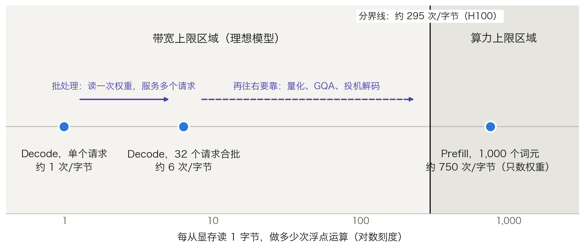

图 3-16：一阶模型下的算术强度对照，分区表示理论上限，不是实测瓶颈（[生成脚本](https://github.com/yeasy/llm_internals/blob/main/tools/figures/inference_bottleneck.py)）。数值按表 3-27 的口径算出；批处理能把 Decode 往右推，但提升幅度受 KV 缓存读取开销限制，见下文瓶颈三。

由此得到三个性质不同的瓶颈。

**瓶颈一：Prefill 的矩阵计算与中间结果读写。** 长 Prompt 的矩阵乘法有较高的并行度和权重复用率，因此更有机会充分利用算力。上下文变长后，`[T, T]` 的打分矩阵按平方增长，而且标准实现要把这张矩阵整个写进显存再读回来，增加了访存开销。FlashAttention 把第 3 到 6 步分块放在片上的高速存储中计算，不把完整的 `[T, T]` 中间矩阵写回显存。调度层面还有两种方法：分块 Prefill 把长 Prompt 拆成几段，与其他请求的 Decode 交错执行；前缀缓存复用相同 Prompt 前缀的 KV，省去命中前缀的计算，未命中的后缀仍需处理。

**瓶颈二：单请求 Decode 容易受显存带宽限制。** 每生成一个词元，250 MB 的权重要完整读一遍，却只换来 2.8 亿次运算。可通过三种方式减少或分摊权重读取成本：量化让每个权重占更少的字节，相对 FP16，FP8 减半，4 比特再减半；批处理把多个请求的当前一步合进同一次前向，同一遍权重读取换来多份结果；投机解码让一次前向确认多个词元。

**瓶颈三：KV 缓存卡在容量和带宽上。** 在这个估算中，批处理分摊的是权重读取成本，各请求仍需读取各自的 KV 缓存。上面的例子若把 32 个请求合成一批，每轮要读的 KV 缓存是 `32 × 37 MB`，约 1.2 GB，已是权重的近 5 倍；计算量是 `32 × 2.8 亿`，要读的字节是 `250 MB + 1.2 GB`，每字节的运算次数只从 1 升到约 6，而不是 32。每个词元要存的数按 3.8.7 的算法是“K 与 V 两份 × K/V 头数 × 每头宽度 × 层数”，GPT-3 Small 是 18,432 个，Llama 3 8B 是 `2 × 8 × 128 × 32 = 65,536` 个。KV 缓存的总大小再与上下文长度和批大小成正比，它既占用显存容量、限制可同时处理的请求数，也增加每轮生成的显存读取量。GQA/MQA 直接减少 K/V 头数；KV 量化减少每个数的字节；PagedAttention 按页分配显存，减少碎片和过度预留，让同样的显存装下更多请求；前缀缓存让相同前缀的请求共享一份。GPT-3 Small 的权重规模较小，合批后 KV 缓存的读取量较容易超过权重读取量；更大的模型权重占比更高，但上下文足够长、批足够大时，结论相同。

表 3-28 把三个瓶颈和对应的优化技术逐项对上。

| 瓶颈 | 技术 | 它改变了什么 | 深入阅读 |
| --- | --- | --- | --- |
| 不用缓存时的重复计算 | KV 缓存本身 | 用显存换计算：历史前缀的 K/V 不再重算；代价是增加缓存的显存占用与读取开销 | [10.2 节](../10_inference_optimization/10.2_kv_cache.md) |
| Prefill 的算力与 `[T, T]` 读写 | FlashAttention | attention 内核分块计算，中间矩阵不落显存；Decode 每轮只有一行分数，这项收益小得多 | [10.3 节](../10_inference_optimization/10.3_flash_attention.md) |
| Prefill 的算力与 `[T, T]` 读写 | 分块 Prefill、前缀缓存 | 长 Prompt 拆段与 Decode 交错；重复前缀不再计算 | [11.2 节](../11_serving/11.2_continuous_batching.md)、[10.2 节](../10_inference_optimization/10.2_kv_cache.md) |
| Decode 的显存带宽 | FP8 等低精度 | 权重、激活或 KV 的字节数 | [10.4 节](../10_inference_optimization/10.4_quantization.md)、[11.12 节](../11_serving/11.12_hardware.md) |
| Decode 的显存带宽 | Continuous Batching | 多个请求的当前一步合进同一次前向，并随时补位 | [11.2 节](../11_serving/11.2_continuous_batching.md) |
| Decode 的显存带宽 | 投机解码 | 一次前向确认多个词元 | [10.6 节](../10_inference_optimization/10.6_speculative_decoding.md) |
| KV 缓存的容量与带宽 | GQA/MQA | 每个词元须保存的 K/V 头数 | [3.7 节](3.7_full_architecture.md)、[10.2 节](../10_inference_optimization/10.2_kv_cache.md) |
| KV 缓存的容量与带宽 | PagedAttention | 多请求 KV 的显存分配方式，减少碎片和过度预留 | [11.2 节](../11_serving/11.2_continuous_batching.md) |
| 以上全部 | vLLM 等推理运行时 | 将执行内核、缓存和调度组织为系统 | [11.1 节](../11_serving/11.1_engines_overview.md) |

表 3-28：各项优化技术针对的瓶颈、改变的对象与深入章节。

这些技术作用于不同层面。FlashAttention 优化 attention 内核；GQA/MQA 改变模型结构；KV 缓存保存请求的历史状态（相同前缀还可以跨请求共享，见 10.2 节）；PagedAttention 管理缓存内存；Continuous Batching 调度请求；vLLM 将这些机制组织为运行时。KV 缓存本身就是一项优化：它以显存占用换取更少的重复计算。其余技术分别降低计算、数据搬运和缓存管理成本，或提高请求调度效率。

#### 回放与自测

回到本节开头的图 3-11。第一次看它时，三个“模型”方框里发生了什么还是未知的；现在每一格都已经算过：6 个 Prompt 词元经 Prefill 得到 `z₆`，选出 ID `15`，即 `5`，各层缓存写入 6 行；第 1 轮 Decode 只送进这一个词元，缓存长到 7 行，`z₇` 选出 ID `16`，即 `。`；第 2 轮缓存长到 8 行，`z₈` 选出 ID `2`，即 EOS，生成停止，去掉 EOS 后反分词得到“5。”。

读完本节，应能不看正文回答下面六个问题；答不上来时，括号里是回看的位置。

1. 回答“5。”一共做了几次前向计算？每次送进模型几个词元？（图 3-11）
2. 为什么 y₂ 不能与 y₁ 同时算出？（3.8.1；位置 7 的输入正是 y₁ 的嵌入）
3. KV 缓存里存的是什么？为什么追加新词元后，旧的内容不必更新？（表 3-20 及其上方的说明）
4. Prefill 时 6 个位置都能算出 logits，为什么只用位置 6 的？（3.8.5）
5. 真实模型有 L 层、每层 `n_h` 个头，哪些计算可以并行，哪些必须依次执行？（表 3-22）
6. Prefill 和 Decode 要读的权重一样多，为什么长 Prompt 的 Prefill 更有利于利用算力，而单请求 Decode 更容易受显存带宽限制？FlashAttention、量化、GQA 和 Continuous Batching 各自针对哪个瓶颈，有哪一条规则是它们都没有改变的？（3.8.8）

想换一个角度再看一遍同样的流程，可以读 Jay Alammar 的[图解 Transformer](https://jalammar.github.io/illustrated-transformer/)和[图解 GPT-2](https://jalammar.github.io/illustrated-gpt2/)，前者逐步讲解单个位置的注意力计算，后者画出了逐词元生成与 K/V 的保留；[Transformer Explainer](https://poloclub.github.io/transformer-explainer/) 则可以在浏览器里对真实的 GPT-2 逐阶段查看输入和输出。

本节固定用贪心策略选词；[第九章](../09_decoding/README.md)从这里接手，讨论贪心之外的选词方式，第十、十一章则沿 3.8.8 的三个瓶颈逐项展开各种优化。
