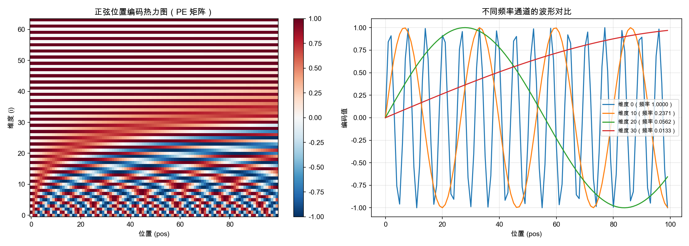

## 4.1 正弦位置编码：频率与外推的直觉

原始 Transformer 使用了一种精巧的固定位置编码方案——基于不同频率的正弦和余弦函数。这不是一个拍脑袋的选择，而是一个经过深思熟虑的数学设计。

### 4.1.1 编码公式

正弦位置编码（Sinusoidal Positional Encoding）的定义为：

$$\text{PE}(pos, 2i) = \sin\left(\frac{pos}{10000^{2i/d_{\text{model}}}}\right)$$

$$\text{PE}(pos, 2i+1) = \cos\left(\frac{pos}{10000^{2i/d_{\text{model}}}}\right)$$

其中 $pos$ 是位置索引（0, 1, 2, ...），$i$ 是维度索引（0, 1, 2, ..., $d_{\text{model}}/2 - 1$）。每个位置被编码为一个 $d_{\text{model}}$ 维的向量，偶数维度使用正弦函数，奇数维度使用余弦函数。

### 4.1.2 为什么使用正弦函数

这个编码方案看似简单，背后却隐藏着精妙的数学考量。要真正理解它，需要从"位置编码应该满足什么性质"出发，逐步推导出为什么正弦函数几乎是唯一的选择。

#### 位置编码的设计约束

一个好的位置编码需要同时满足以下性质：

1. **唯一性**：不同位置必须有不同的编码向量，否则模型无法区分它们。
2. **有界性**：编码值应当有界（理想情况下在 $[-1, 1]$），避免与词嵌入的尺度产生冲突，也避免梯度爆炸。
3. **平滑性**：相邻位置的编码应当接近，远距离位置的编码差异应当更大——即编码应保持位置之间的"距离感"。
4. **相对位置可学习**：注意力机制需要感知两个位置之间的距离，因此编码中应当蕴含某种结构，使得相对位置可以通过简单的运算（最好是线性变换）来提取。
5. **外推能力**：推理时可能遇到训练中未见过的更长序列，编码方案不应依赖于固定的查找表。

正弦函数恰好满足所有这些约束——而大多数其他函数做不到。

#### 为什么是正弦/余弦，而非其他周期函数

为什么不用方波、锯齿波或其他周期函数？关键在于约束 4——**线性变换性**。

4.1.4 节将详细推导：正弦编码的核心优势在于 $\text{PE}(pos + k) = M_k \cdot \text{PE}(pos)$，即位置偏移可以表示为线性变换。这个性质直接来自三角函数的和角公式。正弦和余弦是**唯一**满足以下条件的有界周期函数：$f(a + b)$ 可以写成 $f(a)$ 和 $f(b)$ 的线性组合。方波、锯齿波等其他周期函数都不具备这一代数性质。

#### 几何直觉：高维环面上的旋转

理解正弦编码最深刻的方式是几何视角。

考虑一对维度 $(\sin(\omega \cdot pos), \cos(\omega \cdot pos))$。当 $pos$ 从 0 递增时，这对值在二维平面上描绘出一个**单位圆**——每个位置对应圆上一个角度为 $\omega \cdot pos$ 的点。位置的递增就是圆上的旋转。

正弦编码有 $d_{\text{model}}/2$ 对这样的 (sin, cos)，每对以不同的频率 $\omega_i$ 旋转。因此，每个位置被映射到 $d_{\text{model}}/2$ 个独立圆的**笛卡尔积**上——数学上这是一个**高维环面**（torus）。每个位置是环面上的唯一一点，不同频率的旋转保证了唯一性。

这个几何图像还直接解释了为什么**相对位置等价于旋转**：位置从 $pos$ 移动到 $pos + k$，在每个 2D 子空间中就是旋转了一个角度 $\omega_i \cdot k$，对应的变换矩阵是标准的 2D 旋转矩阵。这正是 4.1.4 节中 $M_k$ 矩阵的几何含义。

#### 为什么交替使用 sin 和 cos

如果所有维度都用 $\sin$，位置 0 的编码将是全零向量——这显然有问题。更深层的原因在于，$\sin$ 和 $\cos$ 相位差 90°，在向量空间中正交。交替使用它们可以最大化不同位置编码之间的区分度。

从旋转矩阵的角度看，每对 $(\sin, \cos)$ 构成一个完整的 2D 旋转表示。单独使用 $\sin$ 只提供了旋转的一个分量，丢失了相位信息，无法唯一确定旋转角度。

#### 与复数指数的联系

欧拉公式 $e^{i\theta} = \cos\theta + i\sin\theta$ 揭示了更深层的统一视角：每对 (cos, sin) 本质上就是复数 $e^{i\omega \cdot pos}$ 的实部和虚部。正弦位置编码等价于在 $d_{\text{model}}/2$ 个独立的复平面上，以不同频率进行复数旋转。

这一洞察直接启发了后来的 RoPE（旋转位置编码，见 [4.3 节](4.3_rope.md)）——RoPE 不再将位置编码加到词嵌入上，而是直接对 Query 和 Key 向量的 2D 子空间施加旋转，在数学上更优雅地实现了同样的几何思想。

#### 频率的几何级数设计

频率按 $\omega_i = 1/10000^{2i/d_{\text{model}}}$ 排列，形成几何级数（等比数列）。波长从 $2\pi$（最高频，$i=0$）跨越到 $10000 \cdot 2\pi$（最低频，$i=d_{\text{model}}/2-1$），覆盖了约 4 个数量级。

这类似于**傅里叶变换**的思想：用不同频率的信号叠加来表示位置信息。高频分量区分相邻位置（"精调"），低频分量区分远距离位置（"粗调"）。两者结合，既能感知局部的词序，又能捕捉段落级别的结构。

**类比二进制计数。** 一种直观的理解方式是类比二进制数：最低位变化最快（每次加 1 就翻转），最高位变化最慢。正弦编码中的不同频率维度也是如此——低维度（高频）变化快，高维度（低频）变化慢。二进制用离散的 0/1 翻转，正弦编码用连续的波形，但本质是同一种多尺度表示策略。

### 4.1.3 频率分解的可视化

上文描述的多尺度频率特性，用图形来理解更加直观。下面的代码生成两幅图：一幅是位置编码矩阵的热力图，展示所有位置和所有维度的编码值；另一幅选取不同频率的通道叠加展示其波形。

```python
import torch
import matplotlib.pyplot as plt
import math

d_model = 64   # 编码维度
max_pos = 100  # 位置数量

# 计算正弦位置编码
pe = torch.zeros(max_pos, d_model)
position = torch.arange(0, max_pos).unsqueeze(1).float()
div_term = torch.exp(torch.arange(0, d_model, 2).float() *
                     -(math.log(10000.0) / d_model))
pe[:, 0::2] = torch.sin(position * div_term)  # 偶数维度
pe[:, 1::2] = torch.cos(position * div_term)  # 奇数维度

fig, axes = plt.subplots(1, 2, figsize=(14, 5))

# 左图：位置编码热力图
im = axes[0].imshow(pe.numpy().T, aspect="auto", cmap="RdBu_r",
                     origin="lower")
axes[0].set_xlabel("位置 (pos)")
axes[0].set_ylabel("维度 (i)")
axes[0].set_title("正弦位置编码热力图（PE 矩阵）")
plt.colorbar(im, ax=axes[0])

# 右图：选取 4 个不同频率通道的波形
channels = [0, 10, 20, 30]  # 从高频到低频
for ch in channels:
    freq = 1.0 / (10000 ** (ch / d_model))
    axes[1].plot(pe[:, ch].numpy(),
                 label=f"维度 {ch}（频率 {freq:.4f}）")
axes[1].set_xlabel("位置 (pos)")
axes[1].set_ylabel("编码值")
axes[1].set_title("不同频率通道的波形对比")
axes[1].legend(fontsize=8)
axes[1].grid(True, alpha=0.3)

plt.tight_layout()
plt.savefig("sinusoidal_pe_visualization.png", dpi=150)
plt.show()
```



图 4-1：正弦位置编码的频率分解可视化

在热力图（左）中可以观察到：**底部的低编号维度变化非常密集**（高频振荡），而**顶部的高编号维度变化缓慢**（低频、平滑过渡）。这种从高频到低频的渐变正是多尺度编码的核心——低频分量区分远距离的位置，高频分量区分相邻位置。在波形图（右）中，维度 0 的波形振荡极快，而维度 30 的波形几乎在整个范围内只完成了不到一个周期。

### 4.1.4 相对位置的线性表示

正弦编码的一个关键数学性质是：**任意两个位置之间的偏移量可以用线性变换表示。**

具体而言，存在一个只依赖于偏移量 $k$（而非绝对位置）的矩阵 $M_k$，使得：

$$\text{PE}(pos + k) = M_k \cdot \text{PE}(pos)$$

这源于三角函数的和角公式。例如对于单个频率 $\omega$：

$$\sin(\omega(pos + k)) = \sin(\omega \cdot pos)\cos(\omega k) + \cos(\omega \cdot pos)\sin(\omega k)$$

这意味着模型理论上可以通过学习这种线性关系来感知**相对位置**——注意力计算中两个位置编码之间的关系自然地编码了它们的距离。这个性质是正弦编码的核心优势之一。

### 4.1.5 外推能力

正弦编码的另一个重要优势是**外推能力**：由于使用了连续的数学函数，即使推理时遇到的序列长度超过训练时的最大长度，正弦函数仍然可以为新位置产生有意义的编码。

不过，外推能力的实际效果取决于模型是否在训练中真正学习了利用三角函数的数学性质。实验表明，直接外推到训练长度的 2 倍以上时，性能会有所下降——这推动了后续更强外推方案的研究。

### 4.1.6 固定 vs 可学习：原始论文的对比

Vaswani 等人在论文中指出，正弦编码和可学习编码在翻译任务上的效果几乎相同。选择固定正弦编码的原因主要是：

1. 不增加模型参数
2. 理论上具有外推能力
3. 数学结构清晰，便于分析
