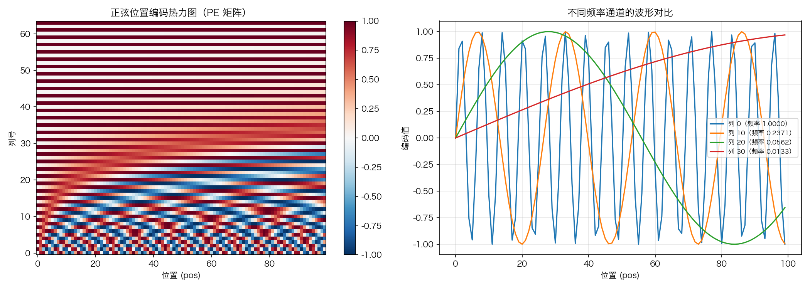

## 4.1 正弦位置编码：频率与外推的直觉

原始 Transformer 用一组不同频率的正弦和余弦函数给每个位置发一个向量。[3.3.4 节](../03_components/3.3_position_encoding.md)已经按公式逐位算出了前三个位置，也断言过“相对距离可以通过线性变换表示”，但那里既没有解释为什么偏偏是正弦，也没有证明那条线性性质。本节从这两处补起：先把那张表补成四个位置，供 4.1.4 验算线性平移性质时复用；再把线性性质证出来；最后交代这条性质在真实注意力里还剩多少。

### 4.1.1 编码公式

**正弦位置编码**（Sinusoidal Positional Encoding）的定义为：

$$\text{PE}(pos, 2i) = \sin\left(\frac{pos}{10000^{2i/d_{\text{model}}}}\right)$$

$$\text{PE}(pos, 2i+1) = \cos\left(\frac{pos}{10000^{2i/d_{\text{model}}}}\right)$$

其中 $$pos$$ 是位置索引（0, 1, 2, …），$$i$$ 是频率对的编号（0, 1, …, $$d_{\text{model}}/2 - 1$$）。每个位置得到一个 $$d_{\text{model}}$$ 维向量，第 $$2i$$ 列放正弦，第 $$2i+1$$ 列放余弦。记第 $$i$$ 对的角频率为 $$\omega_i = 10000^{-2i/d_{\text{model}}}$$，则位置 $$pos$$ 在第 $$i$$ 对上的两个数就是 $$(\sin(\omega_i \cdot pos),\ \cos(\omega_i \cdot pos))$$。

取 $$d_{\text{model}} = 4$$ 就能把公式算成数。此时只有两对频率：$$\omega_0 = 10000^{0} = 1$$，$$\omega_1 = 10000^{-1/2} = 0.01$$。位置 1 的第 0 列是 $$\sin(1 \times 1) = 0.8415$$，第 2 列是 $$\sin(1 \times 0.01) = 0.0100$$。表 4-1 给出前四个位置的完整向量，列号从 0 起算。

| 位置 | 第 0 列 $$\sin(\omega_0 pos)$$ | 第 1 列 $$\cos(\omega_0 pos)$$ | 第 2 列 $$\sin(\omega_1 pos)$$ | 第 3 列 $$\cos(\omega_1 pos)$$ |
| ---: | ---: | ---: | ---: | ---: |
| 0 | 0.0000 | 1.0000 | 0.0000 | 1.0000 |
| 1 | 0.8415 | 0.5403 | 0.0100 | 1.0000 |
| 2 | 0.9093 | −0.4161 | 0.0200 | 0.9998 |
| 3 | 0.1411 | −0.9900 | 0.0300 | 0.9996 |

表 4-1：$$d_{\text{model}} = 4$$ 时前四个位置的编码向量，保留四位小数。第 0、1 列是高频对（$$\omega_0 = 1$$），三步之内已经转过 172 度；第 2、3 列是低频对（$$\omega_1 = 0.01$$），三步只转过 1.7 度。同一张表在 4.1.4 用来验证线性平移性质。

两条规律从表里直接看得出来。第一，位置 0 的向量不是全零，因为余弦列取值为 1。第二，高频列在几步之内就绕了大半圈，低频列几乎没动；这正是 4.1.2 要解释的多尺度设计。

### 4.1.2 为什么是正弦函数

一个可用的位置编码需要同时满足几条约束：

1. **唯一性**：不同位置的编码向量必须不同，否则模型无法区分它们。
2. **有界性**：取值应当落在 $$[-1, 1]$$ 这类有限区间，避免与词嵌入的尺度冲突。
3. **平滑性**：相邻位置的编码应当接近，同时多个频率合起来在目标长度内仍能区分。
4. **相对位置可提取**：注意力要感知两个位置的距离，因此编码里应当有结构，使得位置偏移可以由一个线性变换实现。
5. **不依赖查找表**：推理时可能遇到训练中未见过的位置，编码应当对任意实数位置有定义。

约束 4 是筛掉其他周期函数的那一条。要求“位置偏移 $$k$$ 对应一个只依赖 $$k$$ 的线性变换”，等价于要求这组基函数在平移下张成一个平移不变子空间。在约束 2（有界）之下，满足这一要求的最低维实值表示就是一对 $$(\sin, \cos)$$。去掉有界性，一维的实指数 $$f(pos) = e^{a \cdot pos}$$ 也满足 $$f(pos + k) = e^{ak} f(pos)$$，维度更低；排除它的正是有界性，因为它的幅值随位置发散或衰减到零。方波、锯齿波不具备这一性质：它们的平移要展开成整条傅里叶级数才能表示，对应的变换矩阵不再是一个 2×2 的旋转。

**几何视角：高维环面上的旋转。** 一对 $$(\sin(\omega \cdot pos),\ \cos(\omega \cdot pos))$$ 在二维平面上描出一个单位圆，位置每加一，点就沿圆转过 $$\omega$$ 弧度。$$d_{\text{model}}/2$$ 对这样的值，把每个位置映射到 $$d_{\text{model}}/2$$ 个圆的笛卡尔积上，即一个高维**环面**（torus）。位置从 $$pos$$ 移到 $$pos + k$$，在每个二维子空间里都是转过 $$\omega_i k$$，对应一个标准的二维旋转矩阵，这就是 4.1.4 中 $$M_k$$ 的几何含义。

sin 与 cos 必须成对出现，理由是单独一个分量无法唯一确定角度：$$\sin\theta$$ 相同的角有两个，只有配上 $$\cos\theta$$ 才能把这一圈上的点定死。欧拉公式 $$e^{i\theta} = \cos\theta + i\sin\theta$$ 给出同一件事的复数写法：每对 (cos, sin) 就是复数 $$e^{i\omega \cdot pos}$$ 的实部和虚部，整个编码等价于在 $$d_{\text{model}}/2$$ 个复平面上以不同频率做复数旋转。这个写法直接通向 [4.3 节](4.3_rope.md)的 RoPE，区别在于 RoPE 不再把这个向量加到词嵌入上，而是用它去旋转 Query 和 Key。

**频率按等比数列排布。** $$\omega_i = 10000^{-2i/d_{\text{model}}}$$ 是一个公比固定的等比数列，对应的波长 $$\lambda_i = 2\pi / \omega_i = 2\pi \cdot 10000^{2i/d_{\text{model}}}$$ 同样等比。最高频（$$i = 0$$）的波长恒为 $$2\pi \approx 6.28$$；最低频（$$i = d_{\text{model}}/2 - 1$$）的波长是 $$2\pi \cdot 10000^{1 - 2/d_{\text{model}}}$$。代入 $$d_{\text{model}} = 512$$ 得 60,611，跨度接近四个数量级。原论文把这个范围写成“从 $$2\pi$$ 到 $$10000 \cdot 2\pi$$”，即 62,832，是把指数里的 $$1 - 2/d_{\text{model}}$$ 近似成 1 的说法；维度越高两者越接近。

这套排布与傅里叶分解同理：高频分量区分相邻位置，低频分量区分远距离位置，叠加起来同时覆盖局部词序和段落级结构。也可以类比二进制计数，最低位每加一就翻转，最高位变化最慢；差别只在二进制用离散的 0/1，正弦编码用连续波形。

### 4.1.3 频率分解的可视化

上文的多尺度特性用图看更直观。先按公式把 PE 矩阵构造出来：

```python
import torch
import math

d_model = 64   # 编码维度
max_pos = 100  # 位置数量

pe = torch.zeros(max_pos, d_model)
position = torch.arange(0, max_pos).unsqueeze(1).float()
div_term = torch.exp(torch.arange(0, d_model, 2).float() *
                     -(math.log(10000.0) / d_model))
pe[:, 0::2] = torch.sin(position * div_term)  # 偶数列
pe[:, 1::2] = torch.cos(position * div_term)  # 奇数列
```

把这个矩阵画成两幅图：左边是全部位置与全部列的热力图，右边选四个不同频率的列叠加展示波形。



图 4-1：正弦位置编码的频率分解可视化（[生成脚本](https://github.com/yeasy/llm_internals/blob/main/tools/figures/sinusoidal_pe.py)）。第 $$2i$$ 与 $$2i+1$$ 两列共用第 $$i$$ 对的频率。

热力图（左）里，底部的低编号列变化密集，顶部的高编号列平滑过渡。波形图（右）里，第 0 列的波长是 $$2\pi \approx 6.3$$，100 个位置里振荡了近 16 个周期；第 30 列的波长是 $$2\pi \cdot 10000^{30/64} \approx 471$$，100 个位置只走过 0.21 个周期。

### 4.1.4 相对位置的线性表示

正弦编码的关键性质是：存在一个只依赖偏移量 $$k$$ 的矩阵 $$M_k$$，使得

$$\text{PE}(pos + k) = M_k \cdot \text{PE}(pos)$$

这来自三角函数的**和角公式**（angle addition formula）。对单个频率 $$\omega$$ 展开：

$$\sin(\omega(pos + k)) = \sin(\omega \cdot pos)\cos(\omega k) + \cos(\omega \cdot pos)\sin(\omega k)$$

$$\cos(\omega(pos + k)) = \cos(\omega \cdot pos)\cos(\omega k) - \sin(\omega \cdot pos)\sin(\omega k)$$

写成矩阵形式，恰好是一个二维旋转：

$$\begin{pmatrix} \sin(\omega(pos+k)) \\ \cos(\omega(pos+k)) \end{pmatrix} = \begin{pmatrix} \cos(\omega k) & \sin(\omega k) \\ -\sin(\omega k) & \cos(\omega k) \end{pmatrix} \begin{pmatrix} \sin(\omega \cdot pos) \\ \cos(\omega \cdot pos) \end{pmatrix}$$

矩阵里只出现 $$\omega k$$，与绝对位置 $$pos$$ 无关。整个 $$M_k$$ 是 $$d_{\text{model}}/2$$ 个这样的 2×2 块拼成的分块对角矩阵。

**用表 4-1 验算一遍。** 取 $$k = 1$$、$$d_{\text{model}} = 4$$。第一块用 $$\omega_0 = 1$$，$$\cos 1 = 0.5403$$、$$\sin 1 = 0.8415$$；第二块用 $$\omega_1 = 0.01$$，$$\cos 0.01 = 0.99995$$、$$\sin 0.01 = 0.0100$$。把 $$\text{PE}(1) = [0.8415,\ 0.5403,\ 0.0100,\ 1.0000]$$ 代进去，第一格是

$$0.5403 \times 0.8415 + 0.8415 \times 0.5403 = 0.9093$$

第二格是

$$-0.8415 \times 0.8415 + 0.5403 \times 0.5403 = -0.4162$$

两个数与表 4-1 中 $$\text{PE}(2)$$ 的前两列相符；第二格的精确值是 $$\cos 2 = -0.4161$$，末位差别来自输入只取了四位小数。后两格同理得到 0.0200 与 0.9998。$$M_1$$ 把位置 1 的向量原地转成了位置 2 的向量，且这张矩阵对任何起点都一样。

**一个更直接的推论：点积只依赖距离。** 计算两个位置编码的内积，每一对贡献一项积化和差：

$$\text{PE}(pos) \cdot \text{PE}(pos+k) = \sum_{i} \bigl[\sin(\omega_i pos)\sin(\omega_i (pos+k)) + \cos(\omega_i pos)\cos(\omega_i (pos+k))\bigr] = \sum_{i} \cos(\omega_i k)$$

右边不含 $$pos$$，只含 $$k$$。表 4-2 给出 $$d_{\text{model}} = 512$$ 时的取值。

| 距离 $$k$$ | 0 | 1 | 2 | 10 | 100 | 1000 | 2000 |
| --- | ---: | ---: | ---: | ---: | ---: | ---: | ---: |
| $$\sum_i \cos(\omega_i k)$$ | 256.00 | 249.10 | 231.73 | 173.79 | 111.95 | 44.97 | 22.53 |

表 4-2：$$d_{\text{model}} = 512$$ 时两个位置编码的点积，由 256 项余弦求和得到。$$k = 0$$ 时每项都是 1，合计 256，即 $$d_{\text{model}}/2$$。数值随距离下降但并不单调，且 $$\cos$$ 是偶函数，$$k$$ 与 $$-k$$ 给出同一个值：这条曲线分不清“在前面 10 个词”和“在后面 10 个词”。

### 4.1.5 这条性质在注意力里还剩多少

上一小节证的是两个位置向量之间的关系。真实注意力算的不是这个。位置向量与词嵌入相加之后，位置 $$m$$ 与位置 $$n$$ 的打分是

$$(x_m + p_m)^T W_Q^T W_K (x_n + p_n)$$

展开成四项：内容-内容 $$x_m^T W_Q^T W_K x_n$$、内容-位置 $$x_m^T W_Q^T W_K p_n$$、位置-内容 $$p_m^T W_Q^T W_K x_n$$、位置-位置 $$p_m^T W_Q^T W_K p_n$$。只有最后一项与 4.1.4 的点积有关，而且中间还隔着 $$W_Q^T W_K$$。$$M_k$$ 是正交矩阵，但 $$M_k^T W_Q^T W_K M_k \ne W_Q^T W_K$$，所以整段平移之后这一项通常会变。结论是：正弦编码让“相对距离可以被线性提取”成为可能，但并不保证注意力分数只依赖距离，那需要模型自己学。这四项展开正是 [4.4.2 节](4.4_alibi_others.md)中 Transformer-XL 的出发点，它把后两项改写成与查询位置无关的两个全局偏置。

**加性注入还有一个尺度问题。** 位置向量与词嵌入共用同一条残差通道，两者直接相加，量级必须可比。正弦编码的每个分量幅值不超过 1，而词嵌入按常规初始化后幅值可能小得多。原论文只写了在嵌入层把词嵌入乘上 $$\sqrt{d_{\text{model}}}$$ 这一做法，没有给动机；通行解释是量级匹配，算例见 [3.2.6 节](../03_components/3.2_embedding.md)。

### 4.1.6 外推的实际边界

正弦函数对任意实数位置都有定义，因此训练长度之外的位置也能算出编码。能算出不等于算得对。本章用 $$L_{\text{train}}$$ 记训练长度，以区别于 [3.8 节](../03_components/3.8_gpt_inference_flow.md)表 3-17 中表示层数的 $$L$$，以及 [4.2 节](4.2_learnable.md)中表示位置表行数的 $$L_{\max}$$。ALiBi 论文做过直接测量：一个在 $$L_{\text{train}} = 512$$ 上训练的正弦编码模型，推理长度加到 $$L_{\text{train}} + k$$ 后，困惑度在 $$k = 20$$ 之前还在改善，$$k$$ 从 20 到 50 之间持平，此后开始变差；$$L_{\text{train}} = 1024$$ 的模型同样在 $$L_{\text{train}} + 50$$ 之后下滑。也就是说，可用的外推余量是几十个词元量级，不是成倍。

原因可以从波长看出来。以原始 Transformer 的 $$d_{\text{model}} = 512$$ 为例，256 对频率里只有 123 对的波长不超过 512，其余 133 对在整个训练长度内都没转满一圈。最低频那一对的波长是 60,611，在位置 512 处才转过 3.04 度。上面被测的基线其实宽 1,024。它的 512 对频率里波长不超过 512 的有 245 对，占比同样是 48%；最低频那一对波长 61,712，在位置 512 处转过 2.99 度。对数不同，机制一样。这些维度取到的值，在训练中只覆盖了整个圆周上很短的一段弧；超出训练长度后，它们给出的取值组合模型从未见过，相当于外插到分布之外。4.3.4 会看到，同样的机制在 RoPE 上原样重演。

### 4.1.7 固定与可学习：论文的口径与实现细节

Vaswani 等人在论文里给出的对比只有一句：两种编码在翻译任务上得到几乎相同的结果（见其表 3 第 (E) 行）。选择正弦版本的理由原文也只写了一条，即它**可能**让模型外推到训练中未见过的更长序列。“不增加参数”“数学结构清晰”是后人补的好处，论文本身没有把它们列为理由，4.2 节沿用同一口径。

实现上有三处值得知道。第一，论文公式写的是奇偶列交错，而 Tensor2Tensor 的原始实现把 sin 全放前半、cos 全放后半；两种布局只差一个固定的列置换，数学等价，但权重与布局绑定，移植时不能混用。同一个分歧在 RoPE 上再次出现（见 [4.3.6 节](4.3_rope.md)）。第二，正弦编码表通常以 `register_buffer` 的形式挂在模块上，不进优化器，也可以在遇到更长输入时按公式重算，不存在“表不够长”的问题。第三，这套公式至今仍在用。Whisper 的编码器把位置嵌入初始化为正弦值并关掉梯度；Transformer-XL 把正弦用在相对距离而非绝对位置上；扩散模型的时间步嵌入沿用同一组频率。

固定编码的代价在下一节的对照里才看得清楚：它把“位置怎样影响表示”这件事完全交给了一组人为选定的频率，模型无从调整。
