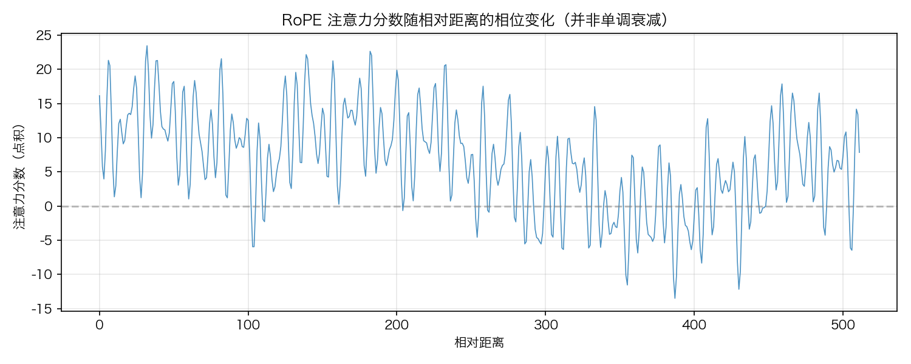
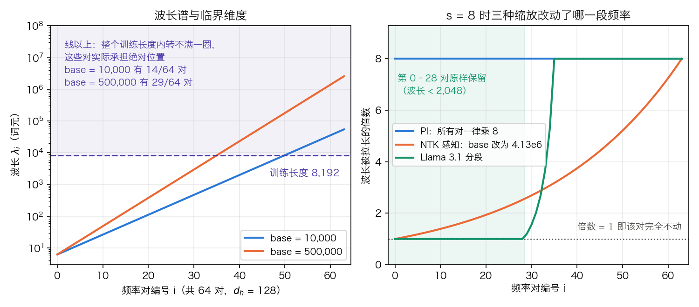

## 4.3 旋转位置编码：为什么旋转能编码相对位置

**旋转位置编码**（Rotary Position Embedding，RoPE）由 Su 等人在 2021 年提出，现已是 Llama、Gemma、Qwen、DeepSeek 等模型的默认方案。[4.2.6 节](4.2_learnable.md)把病灶指向“给每个绝对位置发一个向量”这件事本身；RoPE 保留了 [4.1.4 节](4.1_sinusoidal.md)证明过的那个旋转，扔掉了被加进残差流的向量。本节先把旋转算成数，再回答一个被反复问到的问题：既然分数只依赖相对距离，为什么 RoPE 仍然外推失败。

### 4.3.1 核心直觉

把查询和键各看成一串二维向量。位置 $$m$$ 的查询整体转 $$m\theta$$ 弧度，位置 $$n$$ 的键整体转 $$n\theta$$ 弧度，两者的点积就只与转角之差有关：

$$\bigl(R(m\theta) q\bigr)^T \bigl(R(n\theta) k\bigr) = q^T R((n-m)\theta) k$$

其中 $$R(\alpha)$$ 是下文采用的列向量旋转矩阵。结果只依赖 $$n - m$$。有的实现或论文把同一关系写成 $$R((m-n)\theta)$$，差别来自旋转矩阵的正负号或左右乘约定；关键是全文公式与代码用同一套约定。

**代进数字。** 取 $$\theta = \pi/6$$（30 度）、$$q = (1, 0)$$、$$k = (1, 1)$$。先算位置对 $$(m, n) = (3, 1)$$。查询转 $$3 \times 30° = 90°$$：

$$R(90°)\,(1, 0)^T = (\cos 90° \cdot 1 - \sin 90° \cdot 0,\ \sin 90° \cdot 1 + \cos 90° \cdot 0) = (0,\ 1)$$

键转 $$1 \times 30°$$：

$$R(30°)\,(1, 1)^T = (0.8660 - 0.5,\ 0.5 + 0.8660) = (0.3660,\ 1.3660)$$

两者点积为 $$0 \times 0.3660 + 1 \times 1.3660 = 1.3660$$。换成 $$(m, n) = (23, 21)$$：查询转 $$690°$$，减掉两圈等于 $$-30°$$，得 $$(0.8660,\ -0.5)$$；键转 $$630°$$，即 $$-90°$$，得 $$(1,\ -1)$$；点积为 $$0.8660 + 0.5 = 1.3660$$，与前一组完全相同。表 4-4 给出更多组。

| 位置对 $$(m, n)$$ | 相对距离 $$m - n$$ | 旋转后的点积 |
| --- | ---: | ---: |
| (0, 0) | 0 | 1.0000 |
| (1, 0) | 1 | 1.3660 |
| (3, 1) | 2 | 1.3660 |
| (23, 21) | 2 | 1.3660 |
| (4, 1) | 3 | 1.0000 |
| (5, 0) | 5 | −0.3660 |

表 4-4：$$\theta = \pi/6$$、$$q = (1, 0)$$、$$k = (1, 1)$$ 时旋转后的点积。闭式为 $$\cos(j\theta) + \sin(j\theta)$$，$$j = m - n$$，等于 $$\sqrt{2}\cos(j\theta - \pi/4)$$。距离相同的两组位置给出同一个值；距离变大时数值先升后降，到 $$j = 5$$ 已经为负，说明单个频率上的“衰减”并不成立。[附录 A.2](../appendix/a2_pytorch_examples.md) 给出同一性质的 `allclose` 验证代码。

### 4.3.2 数学形式

位置 $$m$$ 的二维旋转矩阵为：

$$R_m = \begin{pmatrix} \cos m\theta & -\sin m\theta \\ \sin m\theta & \cos m\theta \end{pmatrix}$$

对 $$d$$ 维向量（$$d$$ 为偶数），把它切成 $$d/2$$ 个二维子空间，每个子空间用自己的频率独立旋转：

$$\theta_i = b^{-2i/d}, \quad i \in \{0, 1, \dots, d/2 - 1\}$$

底数 $$b$$ 在原论文中取 10000，与正弦编码同一套频率。

**这里的 $$d$$ 是每个注意力头的宽度。** 它取 $$d_h$$ 而不是 $$d_{\text{model}}$$，Llama 系为 128，于是每个头有 64 对二维子空间。读源码时这是第一道坎：旋转发生在每一层、每一个头、Q/K 投影之后、打分之前，而不是在嵌入层。按 [3.8.3 节](../03_components/3.8_gpt_inference_flow.md)的形状清单，它插在第 2 步与第 3 步之间，`Q[T, d_h] → Q_rot[T, d_h]`，形状不变。

实现不会真的去乘一个矩阵。把 64 个 2×2 块的乘法展开，等价于两次逐元素乘加：

$$\text{RoPE}(x) = x \odot \cos + \text{rotate}(x) \odot \sin$$

其中 $$\cos$$、$$\sin$$ 是按位置和频率预先算好的表，$$\text{rotate}$$ 把每个二维子空间里的两个分量交换并给其中一个取负。形状是 `Q[T, d_h] ⊙ cos[T, d_h] → [T, d_h]`，cos、sin 两张表各存 `[T, d_h/2]` 个不同的数，再复制成 `[T, d_h]` 与 Q 对齐。

RoPE 只作用于查询和键，不作用于值。位置信息要影响的是“哪些位置该互相关注”，这由 $$QK^T$$ 决定；“关注之后读出什么内容”由 $$V$$ 决定，不需要带位置。ALiBi 论文对这一点的评价是：不把位置信息放进值，每一层的输出就不显式携带位置，这可能有利于外推。

### 4.3.3 RoPE 的性质

**天然的相对位置。** 注意力分数在旋转后自动成为 $$n - m$$ 的函数，模型不必先学会从绝对位置推出相对位置。与 [4.1.5 节](4.1_sinusoidal.md)的四项展开相比，这里不存在“位置项被 $$W_Q^T W_K$$ 搅乱”的问题：旋转直接作用在已经投影完的 q、k 上。

**相对距离相关的相位偏置。** RoPE 让分数显式依赖相对距离：距离改变时，各频率分量的相位差随之改变。原论文主张的“长程衰减”应理解为统计或包络意义上的倾向，而不是任意一对随机向量的点积都会随距离单调下降。表 4-4 里 $$j$$ 从 3 到 5 时分数由正转负，就是反例。下面的代码固定一个查询向量，扫描不同相对距离处的键，画出这条曲线：

```python
import torch

d = 64  # 向量维度
max_dist = 512  # 最大相对距离
theta_base = 10000.0

# 频率参数
freqs = 1.0 / (theta_base ** (torch.arange(0, d, 2).float() / d))

# 固定查询向量（随机初始化）
torch.manual_seed(42)
q = torch.randn(d)
k = torch.randn(d)

def apply_rope(x, pos):
    """对向量施加 RoPE 旋转"""
    x_pairs = x.view(-1, 2)
    angles = pos * freqs
    cos_a, sin_a = torch.cos(angles), torch.sin(angles)
    x_rot = torch.stack([
        x_pairs[:, 0] * cos_a - x_pairs[:, 1] * sin_a,
        x_pairs[:, 0] * sin_a + x_pairs[:, 1] * cos_a
    ], dim=-1)
    return x_rot.flatten()

# 计算不同相对距离的注意力分数
distances = torch.arange(0, max_dist)
scores = []
q_pos0 = apply_rope(q, 0)  # 查询固定在位置 0
for dist in distances:
    k_rot = apply_rope(k, dist.float())
    scores.append(torch.dot(q_pos0, k_rot).item())
```



图 4-2：RoPE 注意力分数随相对距离的相位变化示例（[生成脚本](https://github.com/yeasy/llm_internals/blob/main/tools/figures/rope_phase.py)）

曲线随距离振荡，因为各频率分量的相位差在变。它不应被读成单调或必然的衰减。

**计算量可以忽略，访存不能。** 以 Llama 3 8B 为例（`d_model = 4096`、32 个查询头、8 个 K/V 头、$$d_h = 128$$、MLP 中间层 14,336，取自 3.8 表 3-24）。每个词元每层要旋转 $$(32 + 8) \times 128 / 2 = 2{,}560$$ 个二维对，每对 4 次乘法加 2 次加法，合计 15,360 次浮点运算。同一层的 Q/K/V 与输出投影约 8,389 万次，SwiGLU MLP 约 3.52 亿次，RoPE 只占两者之和的 0.0035%。但它是逐元素算子，读写的元素数与计算量同阶，属于访存受限的一类；主流实现因此把它与投影或注意力融合成一个内核，而不是单独起一次核。RoPE 也不引入任何可学习参数。

### 4.3.4 波长与临界维度：为什么相对编码仍然外推失败

既然分数只依赖 $$n - m$$，超出训练长度似乎不该出问题。实测恰恰相反。[位置内插论文报告](https://arxiv.org/abs/2306.15595)，把 LLaMA 直接喂进更长序列，困惑度会冲到 $$10^3$$ 以上，注意力分数被“灾难性地放大”。ALiBi 论文的测量温和一些但结论相同：把 RoPE 用在它的基线模型上，$$L = 512$$ 训练的模型只能在多出 200 个词元以内继续改善，$$L = 1024$$ 的模型只能多出 100 个。

答案在波长里。第 $$i$$ 对的波长是

$$\lambda_i = \frac{2\pi}{\theta_i} = 2\pi \cdot b^{2i/d_h}$$

即这一对转满一整圈所需的词元数。YaRN 论文由此给出判据：给定训练长度 $$L$$，凡是 $$\lambda_i > L$$ 的那些对，在整个训练过程中都没有转满一圈，它们的取值与绝对位置一一对应，承担的其实是绝对位置信息；只有 $$\lambda_i$$ 远小于 $$L$$ 的对，才只携带相对信息。所以“RoPE 是相对编码”只对一部分维度成立。超出 $$L$$ 之后，那些低频对进入训练中从未出现过的角度区间，模型无从解释。

表 4-5 代入 $$d_h = 128$$ 算出具体数目。

| 底数 $$b$$ | $$\lambda_0$$ | $$\lambda_{63}$$ | 4,096 内未转满 | 8,192 内未转满 | 131,072 内未转满 |
| ---: | ---: | ---: | ---: | ---: | ---: |
| 10,000 | 6.28 | 54,410 | 18 / 64 | 14 / 64 | 0 / 64 |
| 500,000 | 6.28 | 2,559,196 | 32 / 64 | 29 / 64 | 15 / 64 |

表 4-5：$$d_h = 128$$ 时的波长跨度与临界维度。$$\lambda_{63} = 2\pi \cdot b^{126/128}$$，$$b = 10{,}000$$ 时为 54,410。Llama 3 用 $$b = 500{,}000$$ 且以 8,192 预训练，因此有 29 对频率在预训练阶段从未转满一圈。注意 $$\lambda_0 = 2\pi$$ 与底数无关，这一点在 4.3.5 讨论调大底数的代价时要用到。



图 4-3：左图是 64 对频率的波长谱，紫色虚线是训练长度 8,192，线以上的对在训练中从未转满一圈；右图是 $$s = 8$$ 时三种缩放各把哪一段频率的波长拉长了多少倍（[生成脚本](https://github.com/yeasy/llm_internals/blob/main/tools/figures/ch04_rope_wavelength.py)）。右图取 $$b = 500{,}000$$；NTK 感知的倍数曲线 $$s^{2i/(d_h-2)}$$ 与底数无关，图例里的 4.13e6 才是这一底数下的换底结果。右图各条曲线在 4.3.5 逐条解释。

### 4.3.5 把长度补回来：内插与外推

先把两个常被混用的词分开。**外推**指直接把更大的位置号喂进原来的公式，上面已经说明它会失败。下面这几种技术做的恰恰相反：它们把没见过的位置**内插**回训练时见过的角度范围，因此才有效。术语上把它们统称“外推技术”会掩盖这一点。

**位置内插**（Position Interpolation，PI）最直接：把位置号压缩回原范围，$$m \to m \cdot L / L'$$。训练长度 4,096、目标 8,192 时位置号一律除以 2，等价于所有 $$\theta_i$$ 同除以 2。它需要微调：PI 论文把 LLaMA 7B 到 65B 扩到 32,768，微调步数在 1,000 步以内。代价是均匀压缩了全部频率，包括最高频的那几对。YaRN 论文对此的说法是 PI “移除了 RoPE 的高频成分”，并指出前人用 PI 微调出的模型，扩展倍数大约到 $$s = 8$$ 就开始退化。

**NTK 感知缩放与调大底数是同一件事的两种说法。** 思路是不均匀地分摊内插压力：高频少动、低频多动。最简单的做法就是换底数。YaRN 论文给出的换底公式是

$$b' = b \cdot s^{\frac{d}{d-2}}$$

$$d = 128$$、$$b = 10{,}000$$ 时，$$s = 2, 4, 8, 32$$ 分别对应 $$b' \approx 20{,}221$$、$$40{,}890$$、$$82{,}685$$、$$338{,}097$$。这个式子的设计目标是让最低频那一对恰好被内插 $$s$$ 倍，而最高频那一对完全不变，因为 $$\lambda_0 = 2\pi$$ 与底数无关。图 4-3 右图的橙色曲线就是这条从 1 平滑升到 8 的倍数线。

至于“不改推理逻辑，只在长上下文续训时把底数调大”这个更朴素的做法，YaRN 论文在脚注里已经把它归到同一族。该脚注指出，Code Llama 采用的正是 NTK 感知缩放：手工把底数调到 100 万，称之为调整基频（adjusted base frequency，ABF）。[Code Llama 论文](https://arxiv.org/abs/2308.12950)自己的表述是把基周期从 10,000 提高到 1,000,000，在 16,384 长度上做长上下文续训，默认 10,000 步；它给出的理由是这样做减小了注意力分数随距离的衰减，让远处的词元也能参与当前预测。[Llama 3 的技术报告](https://arxiv.org/abs/2407.21783)同样把基频提高到 500,000，并引 Xiong 等人的结果说明该值对 32,768 以内有效；这是架构超参，从 8K 预训练起就采用，不是续训时才改。

调大底数的代价不在短距离分辨率。$$\lambda_0 = 2\pi$$ 与 $$b$$ 无关，最高频那一对根本不受影响，高频段几乎原样保留（图 4-3 右图的橙色与绿色曲线在左侧都贴着 1）。真正的代价有两处。其一，更多低频对在训练窗口内转不满一圈。表 4-5 里，同样以 8,192 训练，底数从 10,000 改到 500,000 会让未转满的对数从 14 涨到 29。被压缩掉的是可用的绝对位置分辨率。其二，最佳底数只能试出来。YaRN 论文的原话是，很难确定为某个目标扩展倍数应当采用什么底数，通常只能靠经验搜索，这显著抬高了拿到一个成功微调模型的成本；论文还指出 NTK 感知缩放会让部分维度轻微越界，因此用它做微调的效果反而不如 PI。

**NTK-by-parts 把上面的取舍写成一条显式的分段斜坡。** 引入比值 $$r_i = L / \lambda_i$$，即第 $$i$$ 对在训练长度内转了多少圈。$$r < \alpha$$ 的低频对完全按 PI 内插，$$r > \beta$$ 的高频对完全不动，中间按一条斜坡过渡。斜坡函数是

$$\gamma(r) = \mathrm{clip}\left(\frac{r - \alpha}{\beta - \alpha},\ 0,\ 1\right)$$

缩放后的频率按 $$\gamma$$ 在两端之间取加权平均：

$$\theta_i' = \bigl(1 - \gamma(r_i)\bigr)\frac{\theta_i}{s} + \gamma(r_i)\,\theta_i$$

$$\gamma = 0$$ 时整条除以 $$s$$，等同 PI；$$\gamma = 1$$ 时原样保留。YaRN 论文说明，对 Llama 系模型取 $$\alpha = 1$$、$$\beta = 32$$ 效果较好。

**YaRN 在分段内插之外多加了一项注意力温度。** 它与频率无关，容易被当成实现细节略过。[YaRN 论文的观察是](https://arxiv.org/abs/2309.00071)：在 Softmax 之前给 logits 引入温度 $$t$$，对困惑度的改善在扩展后的整个窗口内是一致的，与数据样本和词元位置无关。一个可能的解释是序列变长后每个查询要在更多键上分配注意力，Softmax 分布被摊平、熵随之上升，温度项把这个熵压回去；论文本身只写了“熵增加的这一性质”，并未展开这条因果。实现上有个便宜的技巧：由于 RoPE 已被重参数化成一组二维旋转，直接把 $$q$$ 和 $$k$$ 同乘常数 $$\sqrt{1/t}$$ 即可，等价于缩放预先算好的 cos/sin 表。这一项因此在训练和推理时都是零开销，不必改注意力代码。论文对 LLaMA 系列拟合出的经验式是

$$\sqrt{1/t} = 0.1\ln(s) + 1$$

$$s = 8$$ 时为 1.208，与论文式 23 一致；$$s = 32$$ 时为 1.347。所谓 YaRN 方法，按论文自己的定义就是 NTK-by-parts 分频内插加上这个注意力缩放。它同样需要微调：论文的 64K 模型在 $$s = 16$$ 下微调 400 步，128K 模型从该检查点起在 $$s = 32$$ 下再训 200 步，不是零样本。

**Llama 3.1 的分段方案给出了一个可以逐维复核的实例。** 它的 `rope_scaling` 写着 `factor = 8`、`low_freq_factor = 1`、`high_freq_factor = 4`、`original_max_position_embeddings = 8192`。记 $$s = 8$$、$$f_{\text{lo}} = 1$$、$$f_{\text{hi}} = 4$$、$$L_0 = 8192$$，规则按波长分三段：$$\lambda < L_0/f_{\text{hi}} = 2048$$ 的对完全不动；$$\lambda > L_0/f_{\text{lo}} = 8192$$ 的对频率整体除以 8；两者之间按一条斜坡过渡。斜坡上的权重与 $$\gamma$$ 同形，只是判据由转圈数换成了波长：

$$w_i = \frac{L_0/\lambda_i - f_{\text{lo}}}{f_{\text{hi}} - f_{\text{lo}}}, \qquad \theta_i' = (1 - w_i)\frac{\theta_i}{s} + w_i \theta_i$$

代入 $$b = 500{,}000$$、$$d_h = 128$$，第 0 至 28 对不动，第 29 至 34 对处在斜坡上，第 35 至 63 对整体除以 8。三段都能逐对验算。先看第 35 对：$$\theta = 7.645 \times 10^{-4}$$，位置 8,192 处的角度是 6.263 弧度；缩放后 $$\theta' = 9.556 \times 10^{-5}$$，位置 65,536 处的角度同样是 6.263 弧度。再看斜坡带的第 32 对：$$\theta = 1.414 \times 10^{-3}$$，$$\lambda = 4{,}443$$。代入上式得 $$w_{32} = (8192/4443 - 1)/(4 - 1) = 0.281$$，于是 $$\theta' = 0.719 \times \theta/8 + 0.281\,\theta = 5.248 \times 10^{-4}$$，相当于只除以 2.69，正落在 1 与 8 之间。被缩放的那些对在 8 倍长度上看到的角度，与预训练时在 8,192 上看到的完全一致，而高频对的局部分辨率一点没丢。Meta 参考实现里对这组常数的注释只有一句：由网格搜索得到。

表 4-6 把五种做法并列。

| 方法 | 改动了哪些频率 | 需要微调 | 主要代价 |
| --- | --- | --- | --- |
| 直接外推 | 不改 | 否 | 低频对进入未见过的角度区间，困惑度可升至 $$10^3$$ 以上 |
| 位置内插 PI | 全体一律除以 $$s$$ | 是（约千步量级） | 移除高频成分，约 $$s = 8$$ 后退化 |
| NTK 感知（调大底数） | 高频几乎不动，低频接近除以 $$s$$ | 通常配合长上下文续训 | 最佳底数只能经验搜索；部分维度轻微越界 |
| NTK-by-parts | 按 $$r = L/\lambda$$ 分三段 | 是 | 多两个超参 $$\alpha$$、$$\beta$$ 要调 |
| YaRN | NTK-by-parts 加注意力温度 | 是（论文用 400 步） | 同上，外加一个温度经验式 |

表 4-6：五种长度扩展做法的对照。除第一行外都属于内插而非外推。Llama 3.1 的分段方案在形式上与 NTK-by-parts 同类，判据由转圈数换成了波长阈值，且不含温度项，因此不应直接等同于 YaRN。

### 4.3.6 对到实现

公式与源码之间有四处对不上，读实现时会逐一碰到。以下的模块名、配置键与默认值核对自 Transformers v5.17.0 与各模型公开的 `config.json`；这类名字随框架版本增减，落到手边的版本要再确认一遍。

**两种配对布局。** 论文与 4.3.3 的代码把相邻两维配成一对（第 0 与第 1 维、第 2 与第 3 维……）；Hugging Face 的 `rotate_half` 则把前半与后半配对（第 0 与第 64 维、第 1 与第 65 维……），对应地把 cos/sin 表由 `[T, d_h/2]` 拼成 `[T, d_h]`。两者只差一个固定的维度置换，数学等价，但训练好的权重与布局绑定：把 Meta 的原始权重转成 HF 格式时，必须对 `q_proj`、`k_proj` 做相应的行置换，否则模型输出全错。[附录 A.2](../appendix/a2_pytorch_examples.md) 的 RoPE 实现用的是相邻配对，末尾也标注了这一点。

**cos/sin 表按 fp32 算。** 位置号可以很大而低频 $$\theta_i$$ 很小，bf16 只有 8 位尾数，直接相乘会丢相位精度。Transformers 的 Llama 实现显式关闭自动混合精度来强制 fp32 计算这张表，算完再转回激活的 dtype。

**KV 缓存里存的是旋转后的 K。** 因此 Decode 每轮只需旋转新词元的 q、k，历史部分直接复用（见 [3.8.5 节](../03_components/3.8_gpt_inference_flow.md)）。代价是位置一旦写进缓存就固定了：滑窗淘汰之后若想把剩余词元重新编号，或者想把某段前缀搬到别的位置复用，就必须存一份未旋转的 K 或者重新旋转一遍。这是 RoPE 相对 ALiBi 的一处结构性劣势，[4.4.1 节](4.4_alibi_others.md)会回到这一点。

**旋转挡住了低秩吸收。** 位置相关的旋转夹在查询投影与键的上投影之间，矩阵乘法不可交换，两个投影无法预先合并。MLA 因此把位置信息单独拉出一条不压缩的旁路，即 [10.2.7 节](../10_inference_optimization/10.2_kv_cache.md)讲的解耦 RoPE。

常见配置键见表 4-7。

| 配置键 | 含义 | 取值示例 |
| --- | --- | --- |
| `rope_theta` | 底数 $$b$$ | Llama 3 为 `500000.0`；GPT-NeoX 写作 `rotary_emb_base`，为 `10000` |
| `rope_scaling` | 缩放方案与参数 | `rope_type` 取 `ROPE_INIT_FUNCTIONS` 的键：`linear`、`dynamic`、`yarn`、`longrope`、`llama3`、`proportional`；不写则按 `default` 走不缩放的原始公式 |
| `max_position_embeddings` | 声明支持的最大位置 | Llama 3.1 为 131072 |
| `partial_rotary_factor` | 只旋转每个头的前若干维 | GPT-NeoX 写作 `rotary_pct`，20B 模型取 0.25 |

表 4-7：RoPE 相关的常见配置键，取自各模型公开的 `config.json` 与 Transformers 的 `modeling_rope_utils.py`（版本见本小节开头）。`partial_rotary_factor` 指向的“部分旋转”在 [4.4.3 节](4.4_alibi_others.md)与隔层 NoPE 放在一起讨论。

位置内插、NTK 感知、YaRN、调大底数这几项，性质上都是事后补丁：RoPE 把位置写进了每一层的 q、k 向量，一旦训练时的长度范围定死，超出部分就得靠这类手段往回掰。有没有一开始就不这么写的方案？
