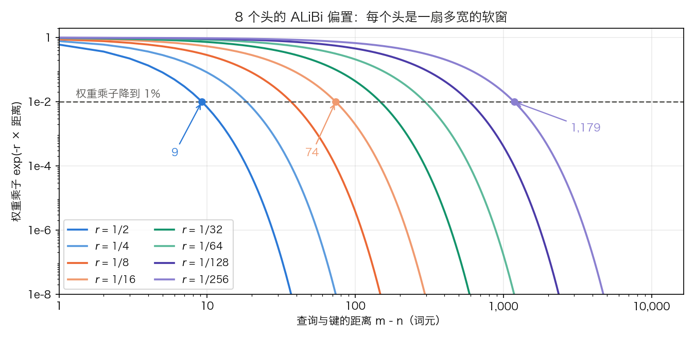

## 4.4 ALiBi 与其他相对位置方案

[4.3.5 节](4.3_rope.md)的几种长度扩展手段有一个共同前提：位置已经写进了每一层的 q、k 向量，只能事后往回掰。本节的方案换了注入点，把位置直接写进注意力分数；最极端的一种干脆什么都不写。把它们放在一起看，能划出位置编码的设计空间和各自的代价。

### 4.4.1 ALiBi：用偏置替代编码

**ALiBi**（Attention with Linear Biases，Press 等人，2021 年）不添加任何位置编码向量，而是在注意力分数上加一个与距离成正比的负偏置：

$$\text{score}(q_m, k_n) = \frac{q_m^T k_n}{\sqrt{d_k}} - r \cdot (m - n), \quad n \leq m$$

$$r$$ 是预设的斜率，每个头一个。头数为 2 的幂时，论文用的几何级数是 $$r_h = 2^{-8h/n_h}$$，$$h = 1, \dots, n_h$$；8 个头时即 $$1/2, 1/4, \dots, 1/256$$。头数不是 2 的幂时，常用实现按分段或几何插值生成斜率，而不是直接套用上式。$$m - n$$ 是因果注意力中当前查询到历史键的距离。扩展到双向注意力需要重新定义方向与掩码，不能把因果场景的公式无条件外推。

**偏置有多大。** 这个问题决定了 ALiBi 实际上是什么。Softmax 之前加上 $$-r \cdot (m-n)$$，等价于把该键的权重乘上 $$e^{-r(m-n)}$$。8 个头的情形：斜率 $$1/2$$ 的头在距离 16 处偏置为 $$-8$$，乘子 $$e^{-8} \approx 3.4 \times 10^{-4}$$；斜率 $$1/16$$ 的头在距离 256 处偏置为 $$-16$$，乘子约 $$1.1 \times 10^{-7}$$；最平缓的 $$1/256$$ 头在距离 2,048 处偏置为 $$-8$$，乘子同样是 $$3.4 \times 10^{-4}$$。以乘子降到 1% 作为这个头的有效窗口，该距离等于 $$\ln 100 / r$$，八个头依次是 9、18、37、74、147、295、589、1,179 个词元。

图 4-4：8 个头的 ALiBi 偏置换算成 Softmax 权重乘子后的衰减曲线，横纵轴均为对数坐标（[生成脚本](https://github.com/yeasy/llm_internals/blob/main/tools/figures/ch04_alibi_decay.py)）。虚线是乘子降到 1% 的位置，标注的是三个头对应的距离。

结论是：ALiBi 的八个头是八扇宽度不同的软窗，最宽的一扇也只有一千多个词元。这不是“无限外推”，而是“窗口宽度与序列长度无关”。困惑度不崩，是因为最窄的几个头就足以支撑局部可预测性。

**外推能力的两条口径都写在原论文里。** 第一，它是困惑度口径的外推，且有甜点区。论文自己的说法是性能在约两倍于训练长度处达到峰值，此后才是“在长达 10,000 的序列上仍保持强性能”；峰值之后并非无衰减。第二，收益来自一个明确的先验。论文把 ALiBi 在 WikiText-103 上胜过多种强位置方法的原因，直接归于它朝向近期的归纳偏置（inductive bias towards recency）。

这两条合起来给出一个重要的分辨：困惑度不随长度崩掉，与能在长上下文里精确检索远处的信息，不是同一件事。上面那组乘子把足够远的键压到了 $$10^{-4}$$ 以下，而困惑度主要由局部可预测性主导，对这种压平并不敏感；“从 100K 词元里找出那一句话”却恰恰依赖远端注意力不被压平。评估长上下文能力因此不能只报困惑度，需要检索类指标，见 [14.7.4 节](../14_future_trends/14.7_long_context.md)的大海捞针与 RULER。这也解释了为什么在长上下文成为主要战场之后，工业界的主流方案停在了 RoPE 加各种缩放（[4.3.5 节](4.3_rope.md)）：它不施加随距离线性增长的硬惩罚，代价是必须显式处理外推。

**实现形态。** 偏置是一个与内容无关的常量张量，按 `[n_h, T, T]` 加到掩码上。由于 Softmax 对每一行加同一个常数不变，$$-r(m-n)$$ 与 $$+r \cdot n$$ 等价，实现只需要键的位置。BLOOM 的实现正是这样：它构造的张量形状是 `[B × n_h, 1, T]`，只含键位置，靠广播对上查询维。由此得到一条 RoPE 没有的好处：K 缓存里不含任何位置信息，淘汰、重排、跨请求复用前缀都不需要重新旋转。FlashAttention 也以 `alibi_slopes` 参数原生支持这项偏置，接受形状 `(n_h,)` 或 `(B, n_h)` 的 fp32 斜率。

### 4.4.2 写进分数的其他方案

**Shaw 等人（2018 年）的相对位置表示**是这条路线的源头。它给每个相对距离学一个向量，加到键（可选地也加到值）上，并把距离裁剪在 $$\pm k$$ 之内，共 $$2k + 1$$ 个可学习向量；论文的基础模型取 $$k = 16$$。裁剪的理由有两条：精确的相对位置信息超过一定距离后没有用；裁剪也让模型能泛化到训练中未见过的长度。

**Transformer-XL 的相对位置编码**（Dai 等人，2019 年）把绝对位置下的四项展开重新参数化。绝对位置时分数展开为内容-内容、内容-位置、位置-内容、位置-位置四项（同 [4.1.5 节](4.1_sinusoidal.md)）。Transformer-XL 做两处替换：键一侧的绝对位置嵌入 $$U_j$$ 换成相对位置向量 $$R_{i-j}$$，查询一侧的 $$U_i^T W_q$$ 换成两个与位置无关的可训练向量 $$u$$、$$v$$。四项因而变成内容寻址、内容相关的位置偏置、全局内容偏置、全局位置偏置，查询侧不再含位置。注意 $$R_{i-j}$$ 本身是固定的正弦编码，不含可学习参数；可学习的是投影 $$W_{k,R}$$ 与 $$u$$、$$v$$。它与段级循环绑定：缓存上一段的隐状态后，绝对位置号在跨段复用时会冲突，这才是它必须改用相对位置的直接原因。Shaw 等人的方案只含前两项，且把 $$W_{k,R}$$ 与 $$R$$ 合并成一个可训练矩阵，丢掉了正弦编码自带的归纳偏置。

**T5 的相对位置偏置**更简。每个相对距离先映射到一个桶，每个桶、每个头学一个标量，直接加到 logits 上；这组参数在所有层之间共享，但同一层内各头不同。论文的取值是 32 个桶、按对数合并、128 以上同桶；Transformers 的实现进一步把前 16 个桶做成一距离一桶。表 4-8 给出因果方向上的映射。

| 相对距离 | 0 | 1 | 15 | 16 | 17 | 20 | 24 | 32 | 64 | 96 | 128 及以上 |
| ---: | ---: | ---: | ---: | ---: | ---: | ---: | ---: | ---: | ---: | ---: | ---: |
| 桶号 | 0 | 1 | 15 | 16 | 16 | 17 | 19 | 21 | 26 | 29 | 31 |

表 4-8：T5 的相对距离分桶（32 个桶、最大距离 128、因果方向），按 Transformers 的 `_relative_position_bucket` 规则算出。前 16 个桶一一对应距离 0 到 15；其余 16 个桶覆盖 16 到 127，宽度按对数增长；128 以上全部落进第 31 号桶。配置键是 `relative_attention_num_buckets` 与 `relative_attention_max_distance`。T5 论文提醒，单独一层对 128 以外的距离不敏感，但多层叠加后仍可组合出更大尺度的敏感性。

**DeBERTa 的解耦注意力**把内容与位置拆成两组向量，分数由内容-内容、内容-位置、位置-内容三项相加得到，位置一侧用相对距离。论文的理由是：Shaw 等人的写法只保留前两项，而位置-内容这一项同样重要，两项齐全才能完整刻画一对词的相对位置；位置-位置那一项在相对位置下提供的信息不多，实现中被略去。

### 4.4.3 不写位置与少写位置

位置可以少写，也可以干脆不写。本小节涉及的配置键与默认值核对自 Transformers v5.17.0 与各模型公开的 `config.json`，随版本可能改名或改默认值。

**NoPE**（No Positional Encoding）完全不注入位置信息，只靠因果掩码。它之所以能工作，是因为因果掩码本身携带位置：越靠后的词元可见的前驱越多，模型可以据此推出自己的大致位置。Haviv 等人（2022 年）据此指出，不带任何显式位置信息的因果语言模型能够学到隐式的绝对位置，困惑度在多个数据集、多种规模和多种输入长度上都接近显式方案。Kazemnejad 等人（2023 年）在从零训练的小规模解码器上比较了五种方案。结论有两条：在一组推理与数学任务的长度泛化上，NoPE 优于 APE、T5 偏置、ALiBi 与 RoPE；NoPE 在表达能力上可以表示绝对与相对两类编码，但用 SGD 训练出来的注意力模式更接近 T5 的相对偏置。两篇工作都不覆盖大规模长上下文模型，纯 NoPE 至今没有成为大模型的默认方案。

**混合方案已经进入公开发布的模型。** 做法是只在一部分层上加位置编码，其余层留空。Transformers 的 Llama 4 实现把它写成两个配置项：`no_rope_layers` 逐层标出哪些层用 RoPE，`no_rope_layer_interval` 默认 4，即每四层去掉一次；同时 `attention_chunk_size` 默认 8192，带 RoPE 的层做分块局部注意力。合起来就是“局部层带位置、全局层不带位置”的交错结构。SmolLM3 用同一组配置键，36 层里每四层去掉一次 RoPE。Cohere 的 Command 系列（`cohere2` 架构）走的是同一思路的另一种写法：滑窗层施加 RoPE，全局层不施加，实现里按层类型判断是否调用 `apply_rotary_pos_emb`。动机是一致的：负责长程的那些层不带显式位置，就不必为它们处理外推。

**部分旋转**是同一取舍在维度上的版本：只对每个头的前若干维施加 RoPE，其余维度保持不变。配置键是 `partial_rotary_factor`，GPT-NeoX 写作 `rotary_pct`，20B 模型取 0.25，即只旋转四分之一的维度。

**局部层与全局层用不同底数**是第三种写法。Gemma 3 的实现给滑窗层和全局层各配一个 $$\theta$$：全局层取 1,000,000，滑窗层取 10,000。理由可以从 4.3.4 的波长表直接读出：滑窗层只看几千个词元，用小底数保住高频分辨率即可；全局层要覆盖十万量级，需要大底数把低频波长拉长。

### 4.4.4 各方案的对比

表 4-9 把前面各节的结论按三条口径横向排开：位置信息注入在哪一层、超出训练长度时表现如何、扩展是否需要微调。各列的证据来源见表下说明。

| 方案 | 类型 | 注入点 | 超出训练长度时的表现 | 扩展是否需要微调 | 额外参数 | 代表模型 |
| --- | --- | --- | --- | --- | --- | --- |
| 正弦编码 | 绝对 | 嵌入层 | 困惑度约在 L+50 之后开始变差 | 不适用 | 无 | 原始 Transformer |
| 可学习编码 | 绝对 | 嵌入层 | 查表越界，直接报错 | 需插值后微调 | $$L_{\max} \times d$$ | GPT-2、BERT |
| RoPE | 相对为主 | 每层 Q/K 旋转 | 直接外推即崩，困惑度可上千 | 内插方案普遍需要 | 无 | Llama、Gemma |
| ALiBi | 相对 | 注意力偏置 | 困惑度约在两倍处见顶，其后缓降 | 否 | 无 | BLOOM |
| T5 偏置 | 相对 | 注意力偏置 | 超出最大距离的键全部同桶，不再可分 | 否 | 桶数 × 头数个标量，跨层共享 | T5、Flan-T5 |
| NoPE | 隐式 | 不注入 | 缺乏大规模长上下文证据 | 不适用 | 无 | 小规模研究模型；混合用法见 4.4.3 |

表 4-9：主要位置编码方案对比。“表现”一列的依据：正弦编码与 ALiBi 取自 ALiBi 论文的实测（分别见 [4.1.6 节](4.1_sinusoidal.md)与 4.4.1），RoPE 取自位置内插论文（见 [4.3.4 节](4.3_rope.md)）。RoPE 标为“相对为主”，是因为 4.3.4 已经说明它的低频维实际承担绝对位置。

### 4.4.5 设计趋势

四条趋势可以从上表读出。

1. **从绝对到相对**：注入的信息从“第几个”转向“相隔多远”，因为语言中的依存关系与相对距离更相关。
2. **从嵌入层到注意力层**：注入点从输入端移到每层的打分过程，位置因而不再占用残差通道，也不必穿过 $$W_Q^T W_K$$。
3. **从固定长度到可扩展**：把长度上限写进权重形状的方案退出，取而代之的是可以事后缩放的连续参数化。
4. **从全局统一到分层混合**：同一模型的不同层采用不同的位置方案或不同的底数，把局部分辨率和长程覆盖分开处理（4.4.3）。

RoPE 在相对位置、外推路径和计算效率三方面的综合表现使它成为目前的默认选择。但这道题没有关闭。4.3.4 的临界维度分析说明它的低频维仍在承担绝对位置；4.3.5 的每一种缩放都需要额外的微调预算；4.4.3 的混合设计正在把“哪些层需要位置”重新变成一个待定的问题。
