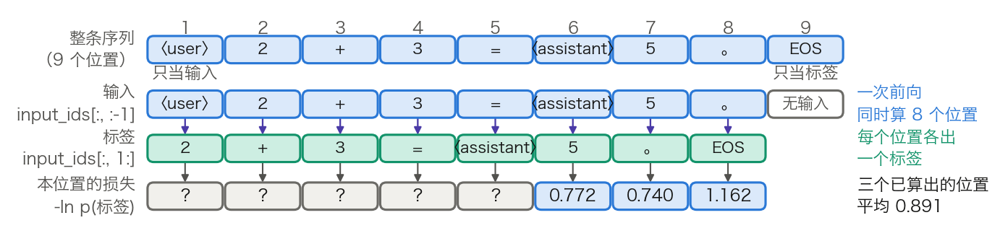

## 5.1 自回归语言模型：从左到右的世界观

第一部分交付的是一个 Transformer 的形状：注意力如何计算、位置如何编码、层与层如何相连。[3.8 节](../03_components/3.8_gpt_inference_flow.md)已经走完一次完整的前向，但那里的权重是手工摆的，它自己也说明“会算”的能力存放在权重里，而权重从哪来留给了本章。[1.5.1 节](../01_introduction/1.5_milestones.md)提到过 GPT 靠“预测下一个词”起家，那是一句历史叙述，不是一个可以优化的目标。本节把它写成目标函数，并把一条序列算成一个损失标量。

### 5.1.1 训练目标：链式分解与负对数似然

自回归语言模型（Autoregressive Language Model）把一段文本的联合概率按链式法则拆成逐位置的条件概率：

$$
P_\theta(x_1,\dots,x_T) = \prod_{t=1}^{T} P_\theta(x_t \mid x_{<t})
$$

其中 $$x_{<t}$$ 表示位置 $$t$$ 左边的全部词元。这个分解是恒等式，不含任何假设；模型要做的只是给每个条件概率一个参数化形式。训练目标取它的负对数，并按位置数归一：

$$
\mathcal{L}(\theta) = -\frac{1}{T}\sum_{t=1}^{T} \log P_\theta(x_t \mid x_{<t})
$$

三处细节决定了它能不能与别处的数字对上。第一，$$t=1$$ 时条件为空，需要一个约定：多数实现在序列开头补一个 BOS（begin of sequence）词元，$$x_{<1}$$ 就是它；不补 BOS 的实现则从 $$t=2$$ 起求和。第二，除以 $$T$$ 是必须的，否则长序列的损失天然更大，不同批次之间无法比较；[6.1.1 节](../06_training_techniques/6.1_loss_optimizer.md)的困惑度正是对这个每词元平均值取指数。第三，$$\log$$ 用自然对数时损失的单位是 nat，用以 2 为底的对数时单位是 bit，两者差一个常数因子 $$\ln 2$$。

### 5.1.2 从一条序列到一个损失标量

公式里的每个条件概率都要由模型算出来。关键在于因果掩码（见 [2.4 节](../02_attention/2.4_self_cross_causal.md)）让这件事一次前向就能全部完成：位置 $$t$$ 的输出只依赖位置 $$1$$ 到 $$t$$，所以把整条序列送进去，每个位置各自给出一份“下一个词元”的分布，互不污染。

按形状把整条链路写一遍，`B` 是批大小、`T` 是序列长度、`n_vocab` 是词表大小：

- **第 1 步：整条序列一次送进模型**（不切片）
  - `input_ids[B, T] → X⁽⁰⁾[B, T, d_model]`
- **第 2 步：前向到最后一层**（L 层，形状见 3.8.3 的清单）
  - `X⁽⁰⁾[B, T, d_model] → X⁽ᴸ⁾[B, T, d_model]`
- **第 3 步：LM head 对每个位置各算一次**（矩阵乘法）
  - `X⁽ᴸ⁾[B, T, d_model] × W_vocab[d_model, n_vocab] → logits[B, T, n_vocab]`
- **第 4 步：错位对齐**（两次切片，不是计算）
  - 预测端取前 T−1 个位置：`logits[B, T, n_vocab] → [B, T−1, n_vocab]`
  - 标签端取后 T−1 个位置：`input_ids[B, T] → 标签[B, T−1]`
- **第 5 步：逐位置取正确词元的负对数概率**（沿最后一维做 Softmax，再按标签取一格）
  - `logits[B, T−1, n_vocab] + 标签[B, T−1] → 逐位置损失[B, T−1]`
- **第 6 步：对有效位置求平均**（求和再除一次）
  - `逐位置损失[B, T−1] → 标量`

第 3 步与推理的差别只有一处，却决定了训练的性价比：3.8.4 末尾说明推理时只取最后一行送进 LM head，因为前面位置的“下一个词元”早已写在 Prompt 里；训练时恰恰要的就是这些位置，因为标签就是它们右边那个真实词元。第 4 步丢掉的则是最后一个位置的 logits，它预测的词元还不存在。图 5-1 把这一点画了出来。

图 5-1：一条序列怎样错一位变成 T−1 个训练样本（[生成脚本](https://github.com/yeasy/llm_internals/blob/main/tools/figures/ch05_shift_labels.py)）。序列沿用 3.8 节的教学例子，共 9 个位置：第 1 个位置只当输入，第 9 个位置只当标签，中间每个位置既是上一个位置的标签，又是下一个位置的输入。蓝色是数据，青绿色是本步新产生的标签。

由此得到自回归目标最重要的一条工程性质：一条长 $$T$$ 的序列一次前向产生 $$T-1$$ 个**监督信号**，每个词元既当过输入也当过标签（序列开头补了 BOS 时是 $$T$$ 个，与 5.1.1 的求和范围对应）。训练的计算量按 [3.7.7 节](../03_components/3.7_full_architecture.md)的 $$C \approx 6ND$$ 计，$$D$$ 就是这些词元位置数。下一节的掩码语言模型每次前向只产生约 $$0.15T$$ 个监督信号，差距正是从这里来的。

### 5.1.3 手算一步训练损失

3.8 节已经把一个 1 层 2 头 4 维的教学模型逐格算完，它的输出概率可以直接当作训练损失的输入。设训练序列为 `〈user〉 2 + 3 = 〈assistant〉 5 。 EOS`，共 9 个位置。位置 6、7、8 的下一个词元分别是 `5`、`。`、EOS，而这三个位置的概率 3.8 节都给出了：3.8.4 的表 3-21 给出位置 6 的五个候选概率，3.8.5 的两轮 Decode 分别给出位置 7 和位置 8 的。

先算位置 6 这一格。它的标签是 `5`，该表中 `5` 的概率是 0.462：

$$
\ell_6 = -\log P(\text{`5'} \mid x_{<7}) = -\ln 0.462 = 0.772
$$

其余两格同法，`。` 的概率 0.477、EOS 的概率 0.313：

$$
\ell_7 = -\ln 0.477 = 0.740,\qquad \ell_8 = -\ln 0.313 = 1.162
$$

三格平均为 $$(0.772 + 0.740 + 1.162)/3 = 0.891$$。位置 1 到 5 的 logits 3.8 节没有算（推理时用不上，那里就跳过了），完整的训练损失还要把它们一并平均进来。这三个数说明了一件事：损失不是某种抽象的“误差”，它就是模型分给正确答案的那个概率取负对数，概率越接近 1，这一格的损失越接近 0。

**训练开始时损失应该是多少。** 权重随机初始化时，模型对每个候选词元给出的概率大致均等，即 $$1/n_{\text{vocab}}$$，于是损失约为 $$\ln n_{\text{vocab}}$$。这是排查训练脚本最省事的一个检查：第一步的损失若明显偏离这个值，多半是标签没有对齐、学习率过大，或者词表配错了。表 5-1 给出几个常见词表的锚点。

| 词表 | `n_vocab` | 初始损失 `ln n_vocab`（nat） | 以 2 为底（bit） |
| --- | ---: | ---: | ---: |
| 本节教学模型（5 个候选） | 5 | 1.61 | 2.32 |
| T5 的 SentencePiece 词表 | 32,000 | 10.37 | 14.97 |
| GPT-2 与 GPT-3 | 50,257 | 10.82 | 15.62 |
| Llama 3 发布权重 | 128,256 | 11.76 | 16.97 |

表 5-1：均匀猜测时的损失锚点，由 `ln n_vocab` 算出。GPT-2 与 Llama 3 的词表大小见 3.8.3 的表 3-17，T5 的 32,000 见 5.3.2 引用的 T5 论文；Llama 3 论文的口径是 128,000，发布权重的嵌入表另含特殊词元，共 128,256 行。一个训练充分的大模型在通用网页语料上的每词元损失通常落在 2 附近，与这里的 11.76 相比，差的是近 10 个 nat。

### 5.1.4 为什么这个目标能学到知识

“预测下一个词元”看上去只是拟合共现频率。把损失写成信息论的形式，就能看清它要求的东西远不止于此。

设真实文本分布为 $$p$$、模型分布为 $$q$$，把期望损失按交叉熵展开：

$$
\mathbb{E}_{x\sim p}\!\left[-\log q(x)\right] = H(p) + D_{\mathrm{KL}}(p \,\|\, q)
$$

其中 $$H(p)$$ 是数据分布自身的熵，与模型无关；$$D_{\mathrm{KL}}$$ 非负，且仅当 $$q = p$$ 时为零。因此最小化损失等价于最小化模型分布与真实分布的 KL 散度，损失的下界就是数据的熵。这条恒等式给出三个推论。

第一，**损失降不到零不是缺陷**。自然语言本身有不确定性，$$H(p)$$ 大于零；5.4 节拟合式里的常数项正是对它的估计。

第二，**语言建模等价于无损压缩**。按香农的信源编码定理，以 2 为底的交叉熵就是用模型 $$q$$ 做算术编码时的平均码长。每词元损失 2.0 nat 换算为 $$2.0/\ln 2 = 2.885$$ bit/词元。若分词器在英文上平均每个词元覆盖 3.94 个字符（Llama 3 论文自报的压缩率），折合约 0.73 bit/字节。这一步换算默认英文 ASCII 文本下一个字符即一个字节，非 ASCII 文本不成立（见 5.4.7 节）。要把码长压到这个水平，模型必须把“下一个词元”预测得很准，而准确预测的前提是掌握语法、搭配、事实和篇章结构——压缩率是能力的一个直接度量。跨模型比较时要注意，困惑度依赖分词方式，bit/字节才与分词无关（见 6.1.1 节）。

第三，**被压缩的对象决定了学到什么**。同样一个目标，在网页文本上压出的是世界知识与常识，在代码上压出的是语法与控制流。补全“法国的首都是＿＿”需要世界知识，补全“如果 x > 5 且 x < 10，那么 x 的范围是＿＿”需要逻辑推理；这两类能力都不是被单独教授的，而是压缩这批语料的副产品。反过来说，语料里没有的东西，这个目标也学不到，也不保证事实可靠性或任务执行能力。

### 5.1.5 训练并行、推理串行

训练时整条序列一次算完，推理时每次只出一个词元，这两件事看似矛盾，其实由同一个因果掩码同时保证。

训练之所以能并行，是因为位置 $$t$$ 的条件 $$x_{<t}$$ 已经写在语料里，不必等模型自己生成。这种用真实前缀当条件的做法称为**教师强制**（Teacher Forcing）。推理时真实前缀不存在，只能把上一步选出的词元追加进去，再算下一步，于是 3.8.1 说的“后一次的输入是前一次的输出”成立。

需要精确区分的是哪一层一致、哪一层不一致。一致的是条件分布的形式：训练与推理用的是同一套权重、同一个因果掩码、同一条计算路径，位置 $$t$$ 的 logits 都是 $$P_\theta(\cdot \mid x_{<t})$$。不一致的是条件的来源：训练条件于人写的前缀，推理条件于模型自己生成的前缀。模型一旦生成了一个训练语料里不会出现的前缀，后续就在一个它没见过的条件分布上工作，误差可能逐步累积，这一现象称为**暴露偏差**（Exposure Bias）。它是[第九章](../09_decoding/README.md)各种解码策略要面对的前提之一。因此“训练与推理完全一致”是一句过强的表述，准确的说法是条件分布的形式一致、条件的来源不同。

### 5.1.6 单向性的代价，以及仅解码器为什么胜出

自回归目标的直接代价是**单向性**：每个位置的表示只汇总了它左边的信息。在理解型任务中右边同样重要，“这部电影的特效很好，但剧情＿＿”这一句，不看后文就无法判断整体情感。这一局限正是下一节 BERT 要解决的问题。

一个更尖锐的例子是**逆转诅咒**（Reversal Curse）：模型在“A 是 B”形式的句子上训练后，并不会自动学会回答“B 是 A”。[提出该现象的工作](https://arxiv.org/abs/2309.12288)给出的实测是，GPT-4 回答“某位名人的母亲是谁”的正确率约 79%，反过来问“某人的儿子是谁”只有约 33%。这不是记忆容量不足，而是训练目标只要求在给定左侧上下文时预测右侧词元，从未要求反向的条件概率也成立。

尽管如此，仅解码器架构仍然成为主流，理由是成本而非能力上限。三条都能落到数字上：

- **信号密度**。同样长度的一次前向，自回归产生 $$T-1$$ 个监督位置，掩码语言模型约 $$0.15T$$ 个（5.2.5 节给出算例）。
- **训练与推理同一条路径**。因果掩码使 KV 缓存成立（见 [10.2 节](../10_inference_optimization/10.2_kv_cache.md)），训练好的模型直接就能增量生成，不需要为推理另配结构。
- **无需任务头**。任何任务都可以写成“给一段前缀、续写后面”，不必像 BERT 那样为每类任务接一个分类头（见 [12.1.3 节](../12_encoder_models/12.1_bert.md)）。

至于规模变大后在理解型任务上的表现追平甚至反超，常被归因于涌现能力（Emergent Abilities）。该归因本身有争议，可能是评测指标选择的产物，详见 [13.1.3 节](../13_decoder_models/13.1_gpt_series.md)；更稳妥的说法是，足够大的模型可以用更多上下文和更强的表示部分补偿单向性，而不是单向性不再是代价。

### 5.1.7 对到实现

上面的形状清单在框架里对应几个具体约定，读源码时会直接遇到。

**标签由框架内部移位。** Hugging Face 的因果语言模型接口只接收一个 `labels`，与 `input_ids` 等长，移位在损失函数里完成：先把 `labels` 右侧补一格，再取 `labels[..., 1:]` 与 logits 对齐。调用方因此不需要自己错位，把 `input_ids` 原样传给 `labels` 即可。

**不计损失的位置用 −100 标记。** 交叉熵的 `ignore_index` 默认取 −100，被标为 −100 的位置既不进分子也不进分母。填充位置、跨文档边界都靠它排除。监督微调阶段只对回答部分计损失，做法同样是把指令部分的标签全部置为 −100（见 [8.1 节](../08_alignment/8.1_sft.md)），这是它与预训练“全位置计损失”的唯一区别。

**文档边界要显式隔断。** 预训练把大量短文档拼接成定长序列以避免填充浪费，这时必须防止一个文档读到上一个文档的内容。仅重置 `position_ids` 不够，还需要块对角的注意力掩码或等价的序列边界元数据（见 [6.4.2 节](../06_training_techniques/6.4_batch_sequence.md)）。文档之间通常插入 EOS，模型由此学会“何时该停”。
