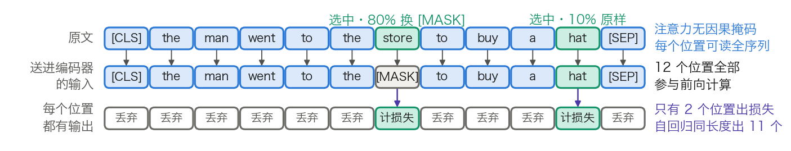

## 5.2 掩码语言模型：完形填空的智慧

上一节末尾那句“这部电影的特效很好，但剧情＿＿”卡住的是单向性：自回归目标让每个位置的表示只汇总左边的信息。掩码语言模型（Masked Language Model，MLM）用一种完形填空式的设计换来双向上下文。本节讲清它的数据流与损失怎么算，给出可复核的名额分配，并把“训练效率低”这句话变成一个可比的数字。

### 5.2.1 为什么不能直接做双向语言模型

把因果掩码去掉，让每个位置都能读全序列，再照旧预测“下一个词元”，这条路走不通。BERT 论文给出的理由是：双向条件下每个词可以**间接看到自己**，多层堆叠后模型能轻易预测出目标词。

“间接”二字是关键，它指的不是第一层就直接读到答案。第 1 层里位置 $$t+1$$ 的表示吸收了位置 $$t+1$$ 自己的词元；第 2 层里位置 $$t$$ 读取第 1 层的位置 $$t+1$$，于是位置 $$t$$ 的表示已经含有“下一个词元是什么”的信息。层数越多，这条泄漏路径越宽，预测退化为复制。

绕开它有两条路。一条是浅层拼接：分别训练一个从左到右和一个从右到左的模型，再把两者的表示拼起来，ELMo 走的就是这条路（见 [1.1 节](../01_introduction/1.1_seq_challenge.md)）。它可行，两个方向却从不在同一层交互，BERT 论文称之为“浅层拼接”，并认为深度双向严格更强。另一条就是改任务：不预测下一个词元，改为预测被遮住的词元，泄漏路径随之被掐断。

### 5.2.2 掩码流程与损失

设原始序列为 $$x_1,\dots,x_T$$。随机挑出一个位置集合 $$M$$ 作为预测目标，按下面的规则改写输入，得到 $$\tilde{x}$$，然后在 $$\tilde{x}$$ 上做一次双向前向，只在 $$M$$ 的位置上计损失：

$$
\mathcal{L}_{\mathrm{MLM}}(\theta) = -\frac{1}{|M|}\sum_{i \in M} \log P_\theta(x_i \mid \tilde{x})
$$

与 5.1.1 的式子对照，差别有三处。条件从 $$x_{<i}$$ 变成了整条改写后的序列 $$\tilde{x}$$，注意力没有因果掩码。求和范围从全部位置缩到 $$M$$，分母也相应变成 $$|M|$$。被预测的目标 $$x_i$$ 是原始词元，不是改写后的词元。

按形状把链路写一遍，与 5.1.2 并排看差别最清楚：

- **第 1 步：采样目标位置**（不涉及张量运算）
  - `input_ids[B, T] → 目标掩码[B, T]`，每个位置以 15% 的概率被选中
- **第 2 步：按 80/10/10 改写输入**（逐位置替换）
  - `input_ids[B, T] + 目标掩码[B, T] → 改写后的输入[B, T]`
- **第 3 步：双向前向**（无因果掩码，注意力矩阵是满的 `[B, n_h, T, T]`）
  - `改写后的输入[B, T] → X⁽ᴸ⁾[B, T, d_model]`
- **第 4 步：全部位置都过 MLM head**（矩阵乘法）
  - `X⁽ᴸ⁾[B, T, d_model] × W_vocab[d_model, n_vocab] → logits[B, T, n_vocab]`
- **第 5 步：只取目标位置的损失**（未选中位置的标签置 −100）
  - `logits[B, T, n_vocab] + 标签[B, T] → 标量`

有三件事容易弄错。未选中的位置照常参与前向计算、照常产生 logits，只是这些 logits 被丢弃，不计损失。“10% 保持不变”的位置输入虽未改动，仍属于 $$M$$，仍要计损失。改写只发生在输入侧，标签始终是原始词元。

图 5-2 把这三件事画在一条 12 个词元的序列上。

图 5-2：一条句子经 80/10/10 改写后，哪些位置计损失（[生成脚本](https://github.com/yeasy/llm_internals/blob/main/tools/figures/ch05_mlm_masking.py)）。12 个位置全部参与前向，只有 2 个选中位置产生损失；其中一个被改成 `[MASK]`，另一个保持原样。与图 5-1 对照：同样长度的序列，自回归会在 11 个位置上产生损失。

### 5.2.3 名额怎么分：一组可复核的数字

取序列长度 512，按 BERT 的配置算一遍每条序列的名额：

$$
|M| = 512 \times 15\% = 76.8
$$

实现里取整为 77 个位置。这 77 个再按 80/10/10 分：

$$
512 \times 0.15 \times 0.8 = 61.44,\quad
512 \times 0.15 \times 0.1 = 7.68
$$

即约 61 个换成 `[MASK]`、约 8 个换成随机词元、约 8 个保持原样。随机替换只占全部词元的 $$0.15 \times 0.10 = 1.5\%$$，BERT 论文特意指出这个比例小到不会损害模型的语言理解能力。

这组数字与官方实现对得上。BERT 的 `create_pretraining_data.py` 有两个相关默认值：`masked_lm_prob` 为 0.15，`max_predictions_per_seq` 为 20；该脚本的 `max_seq_length` 默认是 128，而 $$128 \times 0.15 = 19.2$$，向上取整恰为 20。Hugging Face 的 `DataCollatorForLanguageModeling` 把同一组比例写成三个参数：`mlm_probability` 为 0.15、`mask_replace_prob` 为 0.8、`random_replace_prob` 为 0.1，剩下的 0.1 即保持不变。

### 5.2.4 三个比例从何而来

原论文给出的动机只有一条，而且与常见的解释不同：`[MASK]` 这个词元只在预训练里出现，微调阶段从不出现，两阶段的输入分布因此失配。不总是替换成 `[MASK]`，就是为了缩小这个差距。

两个 10% 各自的作用，论文的表述同样具体。保持不变那一档是为了让表示偏向真实观测到的词。整套做法的效果则在于：编码器事先不知道哪些位置会被考、哪些已被换成随机词，因此必须为每一个输入词元都保留一份带上下文的表示。

论文附录 C.2 用消融支撑了这一设计，表 5-2 抄录其结果。

| Mask 比例 | Same 比例 | Rnd 比例 | MNLI 微调 | NER 微调 | NER 特征式 |
| ---: | ---: | ---: | ---: | ---: | ---: |
| 80% | 10% | 10% | 84.2 | 95.4 | 94.9 |
| 100% | 0% | 0% | 84.3 | 94.9 | 94.0 |
| 80% | 0% | 20% | 84.1 | 95.2 | 94.6 |
| 80% | 20% | 0% | 84.4 | 95.2 | 94.7 |
| 0% | 20% | 80% | 83.7 | 94.8 | 94.6 |
| 0% | 0% | 100% | 83.6 | 94.9 | 94.6 |

表 5-2：不同掩码策略的消融，数值取自 [BERT 论文](https://arxiv.org/abs/1810.04805)附录 C.2 的表 8。Mask 指换成 `[MASK]`，Same 指保持不变，Rnd 指换成随机词元。

这张表的读法不是“80/10/10 最优”。论文自己的结论是，微调路线对掩码策略相当不敏感：六行的 MNLI 成绩落在 83.6 到 84.4 之间，差距不到 1 分。真正拉开差距的是最后一列的特征式用法，即冻结 BERT、只把它的表示当特征喂给下游模型。在这一列里，只用 `[MASK]` 的那一行掉到 94.0，比 80/10/10 的 94.9 低 0.9 分，因为冻结的表示没有机会在微调阶段适应“没有 `[MASK]`”的输入。失配的代价正出现在无法补偿失配的场景里。

至于 15% 这个比例，BERT 论文只说“在全部实验中都遮 15%”，未给出扫描。T5 论文倒是扫过 10%、15%、25%、50% 四档，结论是破坏率对下游成绩影响有限，唯独 50% 会显著拖累 GLUE 与 SQuAD；它最终仍取 15%，理由是沿用 BERT 的先例。取舍的方向是清楚的：比例太低则每次前向的监督信号太少，太高则上下文被破坏到无从推断，中间有一大段平坦区。

### 5.2.5 信号密度：77 对 511

“MLM 训练效率低”是一句常见判断，把它量化成一个可比的量才有意义。可比的量是每次前向产生多少个监督位置：

$$
\frac{T - 1}{T \times 15\%} = \frac{511}{76.8} = 6.65
$$

同样一条 512 长度的序列，自回归给出 511 个监督位置，MLM 只给出约 77 个，相差约 6.6 倍。

这个倍数不能直接读作“学习效率差 6.6 倍”，理由有两条。一是 MLM 的每个预测用到了双向上下文，单个监督信号携带的约束更强；BERT 论文的实测是 MLM 收敛只是略慢于从左到右的模型，且绝对成绩很快反超。二是这个比值只统计损失位置，前向与反向的算力两者一样多，差的是同样算力换回多少梯度信号。

ELECTRA 是一个直接的旁证。它换一个判别式目标，让损失铺满全部 $$T$$ 个位置而不是 $$0.15T$$ 个，同等计算预算下训练效率提升约 4 倍（见 [12.2.3 节](../12_encoder_models/12.2_roberta_albert.md)）。4 倍与 6.6 倍之间的差距，正是“每个监督信号的价值不等”的量化体现。

再把总量算一笔。BERT 的预训练配置是批大小 256 条、序列长 512、训练 100 万步：

$$
10^6 \times 256 \times 512 = 1.31 \times 10^{11}
$$

约 1,310 亿个词元位置流过模型，其中只有 15%、约 197 亿个产生了损失。这是按全程 512 计的口径，与论文自报的每批 128,000 个词元一致。实际排布还有一个常被忽略的细节：为节省算力，BERT 的前 90% 步数用的是 128 的序列长度，只有最后 10% 用 512。按这个排布重算：

$$
0.9 \times 10^6 \times 256 \times 128 + 0.1 \times 10^6 \times 256 \times 512 = 4.26 \times 10^{10}
$$

实际流过的位置数因此只有上面那个数的约三分之一。论文同时说明这相当于在 33 亿词的语料上过约 40 遍——早在 2018 年，数据受限下的重复训练就已是常态，5.4.8 节会给出重复几遍才划算的定量答案。

表 5-3 把两种范式的差别汇总为可对照的五行。

| 特性 | 自回归 LM | 掩码 LM |
| --- | --- | --- |
| 预测目标 | 每个位置预测右边相邻的词元 | 只预测被选中的词元 |
| 注意力掩码 | 因果，位置 $$i$$ 只读 $$1$$ 到 $$i$$ | 无掩码，每个位置读全序列 |
| 512 长度下的监督位置 | 511 | 约 77 |
| 能否增量生成 | 能，KV 缓存成立 | 不能，改一个位置要重算全序列 |
| 代表模型 | GPT 系列、Llama | BERT 系列 |

表 5-3：两种预训练范式的机制差别。监督位置数的算法见 5.2.5 节。

### 5.2.6 NSP 的去留

BERT 还引入了**下一句预测**（Next Sentence Prediction，NSP）作为辅助任务：给定两段文本，判断第二段是否紧接第一段。训练损失是 MLM 与 NSP 两项的和。

RoBERTa 去掉了 NSP，同时还改了另外三件事：用动态掩码代替静态掩码、放大批次、换成更大的字节级 BPE 词表，并配合更多数据训练更久。成绩确实提升，但把提升全部记在“NSP 有害”上是过度引申。四项改动是一起做的，而 RoBERTa 自己对动态掩码的评价只是“与静态掩码相当或略好”；MLM 目标本身并未被改进。ALBERT 的结果从另一侧说明问题：它把 NSP 换成句序预测（Sentence Order Prediction，SOP），即判断两段文本的先后顺序是否被颠倒，这个聚焦句间连贯性的损失在多句输入的下游任务上持续有帮助。合理的结论是句间任务设计得当仍然有益，而不是辅助任务一概无用（见 [12.2 节](../12_encoder_models/12.2_roberta_albert.md)）。

### 5.2.7 对到实现

**静态掩码与动态掩码。** BERT 在数据预处理阶段一次性生成掩码并写进文件，这叫静态掩码。为免每一遍都做同一道填空题，它把训练数据复制了 10 份、各用一种掩码，于是 40 遍训练中每种掩码各被看到 4 次。RoBERTa 改为每次把序列喂进模型时现场生成掩码，这叫动态掩码；按其说明，数据集更大、步数更多时这一点更重要。`DataCollatorForLanguageModeling` 在每个批次现场采样，属于动态掩码。

**片段级的掩码。** 把 15% 的名额分散到孤立的词元上，模型常能靠词内其他片段猜出答案。全词掩码要求同一个词的所有子词一起被遮；[SpanBERT](https://arxiv.org/abs/1907.10529) 更进一步，直接遮连续随机片段，并训练片段两端的边界表示去还原整段内容，不依赖段内各词元自己的表示。下一节 T5 的片段破坏是同一思路在编码器-解码器上的版本。

**MLM 今天仍在用的地方。** 生成模型的主流是仅解码器，但嵌入模型、检索模型与重排序器仍以双向编码器为主：这类任务要的是整段文本的一个表示，而非逐词生成，双向上下文正对路（见[第十二章](../12_encoder_models/README.md)）。
