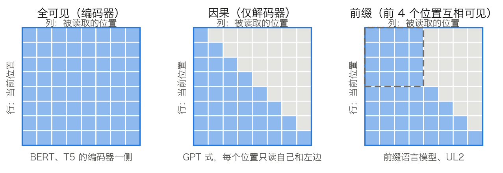

## 5.3 编码器-解码器预训练：两种范式的统一

[5.2.5 节](5.2_masked_lm.md)那张对比表把前两种范式分在了两边：自回归能生成但只能看左边，掩码 LM 能看两边却不能生成。第三条路想把这两格并成一格——编码器双向读输入，解码器自回归写输出。T5 和 BART 是它的代表。本节给出片段破坏怎样造出一对训练样本、它的序列长度账、三种注意力掩码形状的关系，以及仅解码器最终胜出的四条论据。

### 5.3.1 T5：文本到文本的接口

[T5](https://arxiv.org/abs/1910.10683)（Text-to-Text Transfer Transformer）的核心主张是把所有 NLP 任务统一为文本到文本的生成问题。做法是在输入前加一段任务前缀：

- 翻译：`translate English to German: That is good.` → `Das ist gut.`
- 语法可接受性判断：`cola sentence: John made Bill master of himself.` → `acceptable`

统一带来的工程收益很具体：同一个模型、同一套训练与推理流程、同一个损失函数可以处理所有任务，不必为每类任务另设分类头或序列标注头。

代价在边界处显形。T5 论文自述，它考虑的任务里只有 STS-B 无法直接转写，因为那是一个预测 1 到 5 之间相似度分数的回归任务。做法是把分数四舍五入到 0.2 的整数倍再写成字符串，例如 2.57 写作 `2.6`，回归于是被改造成 21 类分类。测试时若模型输出的字符串不是 1 到 5 之间的数，直接判错——输出不再受标签集合约束，是文本到文本接口固有的代价，需要在解码端另加限制（见 [9.4 节](../09_decoding/9.4_constrained.md)）。

### 5.3.2 片段破坏怎样造出一对训练样本

T5 的预训练目标叫**片段破坏**（Span Corruption）。它随机丢弃输入中 15% 的词元，把每一段连续被丢的词元换成一个**哨兵词元**（sentinel token）；目标序列则由被丢掉的那些片段组成，各段前面放回它在输入里对应的哨兵，末尾再补一个新的哨兵表示结束。

论文自带的例句最能说明问题。原句是 `Thank you for inviting me to your party last week .`，`for`、`inviting`、`last` 三个词被选中破坏，前两个相邻因而合成一段：

```text
输入：Thank you <X> me to your party <Y> week .
目标：<X> for inviting <Y> last <Z>
```

四件事由此确定。每段连续被破坏的词元只占用一个哨兵，所以输入变短。同一条样本里各哨兵的 ID 互不相同，模型据此知道该填哪一段。目标只含被丢掉的内容，不含整句。损失是解码器一侧对目标串的标准自回归交叉熵，与 5.1.1 的式子完全相同，区别只在条件里多了编码器输出，经交叉注意力进入解码器（见 [2.4 节](../02_attention/2.4_self_cross_causal.md)）。

实现上，哨兵是加进词表的特殊词元，不对应任何 wordpiece。T5 用的是 32,000 词的 SentencePiece 词表，Hugging Face 的 `T5Tokenizer` 默认追加 `extra_ids=100` 个哨兵，名字从 `<extra_id_0>` 起；`t5-base` 的 `config.json` 里 `vocab_size` 写作 32128，即 32,000 加 100 个哨兵再向上对齐。训练时 `T5ForConditionalGeneration` 由 `labels` 右移得到 `decoder_input_ids`，移位规则与 5.1.7 的因果语言模型一致。

### 5.3.3 长度账：为什么片段破坏省算力

片段破坏相对逐词遮盖的收益是工程性的，可以直接算出来。设输入长 512、破坏率 15%、平均片段长 3。

被破坏的词元数与片段数：

$$
512 \times 0.15 = 76.8,\qquad 76.8 \div 3 = 25.6
$$

编码器输入去掉这 76.8 个词元，换回 25.6 个哨兵：

$$
512 - 76.8 + 25.6 = 460.8
$$

解码器目标由 76.8 个被丢词元、25.6 个哨兵和 1 个结束哨兵组成：

$$
76.8 + 25.6 + 1 = 103.4
$$

论文自己举的是 500 与 25 个片段的版本，算出被破坏 75 个词元、平均片段长 3，与这里同一口径。

这组数字的意义要与两种替代方案比才看得清。BERT 式的逐词遮盖不合并片段，编码器输入长度不变，仍是 512。BART 式的重建整句让目标也是 512，是这里 103.4 的约 5 倍；解码器的自回归计算量与目标长度成正比，差距因此直接落在训练速度上。T5 论文在讨论各种目标时给出的取舍正是这一条：几种去噪目标的下游成绩差别有限，选哪一个主要看计算成本。

破坏率与片段长度都被扫过。破坏率 10%、15%、25%、50% 四档中，只有 50% 明显变差，且目标变长拖慢训练。平均片段长 2、3、5、10 四档差别也有限，其中 3 在多数非翻译基准上略优于逐词破坏。T5 最终取 15% 与 3。

再算一笔总量。T5 基线预训练 $$2^{19}$$ 步，每批约 $$2^{16}$$ 个词元：

$$
2^{19} \times 2^{16} = 2^{35} \approx 3.44 \times 10^{10}
$$

约 344 亿个词元，论文写作“约 34B”。对照 5.2.5 节 BERT 的 1,310 亿个词元位置，T5 基线只有它的约四分之一；而 C4 语料远大于此，所以 T5 基线训练中没有任何数据被重复使用。

### 5.3.4 BART：去噪自编码器

[BART](https://arxiv.org/abs/1910.13461) 把预训练视为序列去噪：对输入施加噪声，训练模型重建原始文本。论文评估了五种噪声：

- 词元遮盖：用单个掩码词元替换部分词元，同 BERT。
- 词元删除：直接删掉某些词元，模型还须推断删除的位置。
- 文本填充（Text Infilling）：采样若干片段，长度服从 $$\lambda = 3$$ 的泊松分布，每段换成一个掩码词元；长度为 0 的片段相当于插入一个掩码词元。
- 句子排列：打乱句子顺序。
- 文档旋转：从随机位置开始旋转文档。

五种是消融对象，不是最终配方。BART 大模型最终采用的是文本填充与句子排列的组合，遮盖 30% 的词元并打乱全部句子，训练 50 万步、批大小 8000，分词沿用 GPT-2 的字节级 BPE。

与 T5 的关键差别在目标串。BART 重建整句，因而目标长度等于原文长度；T5 只生成被破坏的片段。另一处差别是 BART 的文本填充让模型必须推断“这里缺了几个词元”，因为一个掩码词元可能对应任意长度的片段；SpanBERT 则用等长的掩码序列把长度直接告诉模型。

### 5.3.5 三种注意力掩码形状

编码器、解码器、前缀语言模型三者的区别，归根结底只是同一张 $$T \times T$$ 可见性方阵的形状不同。图 5-3 把三种形状并排画出。



图 5-3：全可见、因果、前缀三种注意力掩码形状（[生成脚本](https://github.com/yeasy/llm_internals/blob/main/tools/figures/ch05_mask_shapes.py)）。行是正在计算的位置，列是被读取的位置，深色表示可读，浅色表示分数被置为 −∞。虚线框标出前缀部分，其内部互相可见。

**前缀语言模型**（Prefix LM）是介于两者之间的形态：前缀部分用全可见掩码，其后的生成部分用因果掩码。它与编码器-解码器交出的信息流几乎相同，区别在于没有独立的编码器堆栈，前缀与生成部分共享同一套权重，也不存在交叉注意力。[UL2](https://arxiv.org/abs/2205.05131) 更进一步，用混合去噪器（Mixture-of-Denoisers）把几种去噪方案合进同一次预训练，并引入模式切换，让下游使用时指定套用其中哪一种。

这也解释了 3.8.3 所说的“因果掩码保证每个位置从不读右边”为何是 KV 缓存成立的前提：一旦掩码形状里出现“右边可见”的格子，追加新词元就会改变旧位置的表示，缓存随之失效。前缀语言模型的前缀部分一次性算完、其后严格因果，因此仍然可缓存。

### 5.3.6 三种范式的成绩与代价

T5 论文用同一套语料、同一套评测系统比较了架构与目标的组合，结果列在表 5-4。$$P$$ 是一个 12 层 BERT-base 规模堆栈的参数量，$$M$$ 是编码器-解码器处理一对输入-目标所需的 FLOPs。

| 架构 | 预训练目标 | 参数量 | 计算量 | GLUE | SQuAD | SuperGLUE |
| --- | --- | ---: | ---: | ---: | ---: | ---: |
| 编码器-解码器 | 去噪 | $$2P$$ | $$M$$ | 83.28 | 80.88 | 71.36 |
| 编码器-解码器（共享参数） | 去噪 | $$P$$ | $$M$$ | 82.81 | 80.63 | 70.73 |
| 编码器-解码器（各半层） | 去噪 | $$P$$ | $$M/2$$ | 80.88 | 77.59 | 68.42 |
| 前缀语言模型 | 去噪 | $$P$$ | $$M$$ | 81.82 | 78.94 | 68.11 |
| 仅解码器语言模型 | 去噪 | $$P$$ | $$M$$ | 74.70 | 61.14 | 55.02 |
| 编码器-解码器 | 自回归 | $$2P$$ | $$M$$ | 79.56 | 76.02 | 64.29 |

表 5-4：架构与预训练目标的组合成绩，取自 [T5 论文](https://arxiv.org/abs/1910.10683)的表 2，此处保留 GLUE、SQuAD、SuperGLUE 三列。该文的结论是编码器-解码器配去噪目标在所有任务上最好，且去噪目标一律优于自回归目标。

有一条关于参数量的常见误读需要纠正。$$L+L$$ 层的编码器-解码器确有约 $$2P$$ 个参数，是 $$L$$ 层仅解码器的两倍，但处理一对输入-目标的计算量同为 $$M$$：每个词元只经过编码器或解码器之一，不会两边都走一遍。T5 论文实测两者的单步耗时几乎相同。所以“参数量翻倍”不是纯粹的代价，它换来的是同等计算量下更多的容量。真正的代价在推理侧的显存与缓存形态，下一节展开。

表 5-5 把三种范式按本章已经算过的量重排。

| 范式 | 架构 | 每次前向的损失位置 | 同计算量下的参数量 | 增量生成时的缓存形态 | 代表模型 |
| --- | --- | --- | --- | --- | --- |
| 自回归 | 仅解码器 | $$T-1$$，全部位置 | $$P$$ | 单栈 KV 缓存，逐轮追加 | GPT 系列、Llama |
| 掩码 LM | 仅编码器 | 约 $$0.15T$$ | $$P$$ | 不适用，无法增量生成 | BERT 系列 |
| 片段破坏 | 编码器-解码器 | 约 $$0.15T$$（在解码器侧） | $$2P$$ | 解码器自注意力 KV 加交叉注意力 KV | T5 |

表 5-5：三种预训练范式的机制对照。损失位置数的算法见 5.2.5 与 5.3.3 节；参数量与计算量的关系见表 5-4 上方的说明。

### 5.3.7 为什么仅解码器成为主流

四条论据，每条都能落到前面算过的量上。

**信号密度。** 仅解码器的每个词元都产生损失，片段破坏只有约 15% 的词元产生损失。同样的 $$C \approx 6ND$$ 预算，前者换回的梯度信号多得多。数据规模进入万亿词元量级后，这一条的权重迅速上升。

**零样本能力。** [一项覆盖三种架构与两种目标的系统评估](https://arxiv.org/abs/2204.05832)给出一条分界：纯无监督预训练之后，因果仅解码器配自回归目标的零样本泛化最强；但若接一轮多任务提示微调，带非因果可见性、用掩码目标预训练的模型反而最好。大模型的主流用法是“预训练完直接提示”，正落在前一半。

**缓存形态。** 多轮对话里仅解码器只有一份逐轮追加的 KV 缓存，历史前缀还能跨请求共享（见 [11.5 节](../11_serving/11.5_prefix_reuse.md)）。编码器-解码器每轮要么重新编码整个上下文，要么额外维护一份交叉注意力的 K/V，服务端的状态管理复杂一档。

**系统简单。** 单一堆栈让张量并行的切分、流水线的分段、推理引擎的调度都只需处理一种层（见 [11.8 节](../11_serving/11.8_multi_gpu_inference.md)）。两个形状不同的堆栈要各自调优。

反过来，编码器-解码器仍占优的场景有共同特征：输入固定且完整、输出是对输入的转写而非开放续写。机器翻译、语音识别、固定模板的条件生成都属此类，编码器一次读完输入、解码器专注生成的分工在这里是优势而非负担。所以准确的说法不是“编码器-解码器被淘汰”，而是通用对话与工具调用这个最大的场景更偏爱仅解码器。
