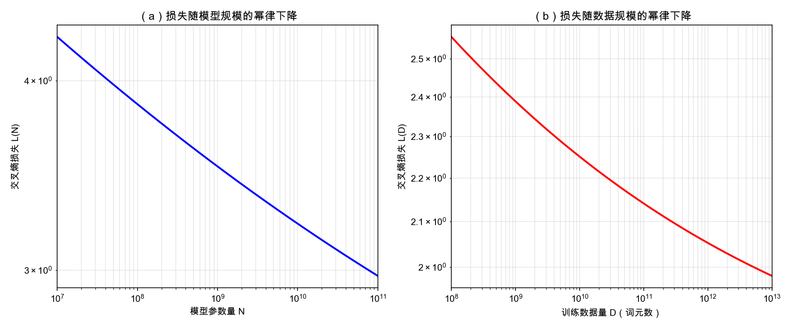

## 5.4 预训练数据：规模定律与数据质量的博弈

模型架构和训练目标固然重要，但决定预训练模型能力上限的还有一个关键要素——**数据**。近年来的实践表明，数据的规模和质量对模型性能的影响可能比架构创新更大。

### 5.4.1 规模定律的发现

2020 年，Kaplan 等人在 OpenAI 发表的论文中揭示了一个深刻的实验规律：**模型性能（以交叉熵损失衡量）与模型参数量 $$N$$、数据量 $$D$$ 和计算量 $$C$$ 之间存在平滑的幂律关系。**

$$L(N) \propto N^{-\alpha_N}, \quad L(D) \propto D^{-\alpha_D}, \quad L(C) \propto C^{-\alpha_C}$$

这意味着模型越大、数据越多、训练越充分，性能就越好——且这种改善是可预测的、连续的。

2022 年，DeepMind 的 Chinchilla 论文进一步修正了这一认识，提出了**计算最优**的原则：**给定固定的计算预算，模型参数量和训练数据量应该同比例增长。** 两者的差异可以用拟合指数概括：Kaplan 等人的结论是把额外算力优先投给参数（最优 $$N \propto C^{0.73}$$、$$D \propto C^{0.27}$$），Chinchilla 用改进的实验设置重新拟合后得到两者各 $$\propto C^{0.5}$$。 Chinchilla 表明，许多大模型实际上是“过大欠训练”的——用更少的参数配合更多的训练数据，可以用同样的计算预算获得更好的性能。

然而，近年来的开源模型实践对 Chinchilla 定律提出了新的拓展与挑战：

- **数据充分性优于计算最优**：DeepSeek-V3 和 Llama 3 等模型的实践表明，当考虑推理阶段的总体计算成本时，用远超 Chinchilla 最优比例的数据进行训练，虽然不满足训练期间的计算最优性，但能够在**推理成本受限**的场景下实现更好的总体经济效益。较小参数量的模型在部署时的日常推理成本远低于大模型，因此在训练阶段投入额外的计算资源来充分榨干其能力上限，具有极高的实际价值。这反映了一个关键的工业洞察：**训练计算的一次性投入可以通过降低推理的长期成本来摊销，从而改变最优的参数与数据比例**。
- **Llama 3 的数据策略**：Llama 3 的 8B 参数模型使用了 15T 词元（约 1,875 词元/参数）进行训练，这一数据量远超 Chinchilla 风格的约 20 词元/参数粗略估计（8B 模型约 160B 词元）。这一策略深刻验证了数据充分性对模型性能的持久影响，证明了小模型在海量优质数据的训练下，性能提升的潜力远未触及上限。

把三个阶段的口径并排看，变化的幅度会更清楚：

| 口径 | 算力如何分配 | 词元/参数 | 8B 模型对应的数据量 |
|------|-------------|----------|-------------------|
| Kaplan（2020） | $$N \propto C^{0.73}$$、$$D \propto C^{0.27}$$，额外算力优先给参数 | — | 倾向把模型做大 |
| Chinchilla（2022） | 两者各 $$\propto C^{0.5}$$，同比例增长 | 约 20 | 约 160B 词元 |
| Llama 3（2024） | 远超训练期计算最优，以摊薄推理成本 | 约 1,875 | 15T 词元 |

表 5-2：规模定律三个阶段的算力分配口径对比

三行之间的落差值得停一下：从 Chinchilla 的约 20 词元/参数到 Llama 3 的约 1,875，相差近百倍。这不是说 Chinchilla 算错了——在它自己的设定下（只看训练期算力）结论依然成立；变化的是**优化目标**。一旦把模型部署后长期的推理开销也计入总账，“训练时多喂数据、换取一个更小但更充分训练的模型”就变得划算。换句话说，**规模定律给出的是约束关系，不是行动指令；真正决定怎么分配算力的，是你在优化哪一段成本**。

图 5-1：规模定律的幂律曲线（log-log 坐标）

在 log-log 坐标下，幂律关系表现为**近似直线**——这正是规模定律的核心特征。左图展示了损失随模型参数量增长而平滑下降的趋势：从 1000 万参数到 1000 亿参数，损失持续降低，且降幅逐渐减小。右图展示了类似的数据规模效应。两条曲线都不会降到零，而是**渐近趋向一个经验拟合下限** $$L_\infty$$（示例中约为 1.69）；它是当前设定下的拟合项，不应被误读为语言建模的绝对理论极限。

### 5.4.2 数据来源与构建

大语言模型的预训练数据通常来自多种来源：

- **网页抓取**：Common Crawl 等项目提供了数万亿词元的网页文本，是最大的数据来源
- **书籍**：提供高质量、连贯的长文本
- **学术论文**：提供专业知识和科学推理
- **代码**：GitHub 等平台的代码数据，显著提升模型的编码和逻辑推理能力
- **百科全书**：Wikipedia 等提供结构化的事实知识
- **社交媒体与论坛**：提供对话风格的文本

### 5.4.3 数据质量的关键影响

规模虽重要，但并非唯一决定因素。数据质量通过多个维度影响模型能力：

**去重（Deduplication）**：训练数据中大量重复的文本会导致模型过拟合这些内容，降低泛化能力。去重是预处理的关键步骤。

**过滤（Filtering）**：低质量内容（如乱码、重复模板、垃圾网页）需要被过滤掉。许多团队使用分类器（甚至用已有的语言模型）来评估文本质量。

**领域混合比例（Domain Mixture）**：不同来源的数据（网页、书籍、代码等）的混合比例显著影响模型的能力分布。增加代码数据的比例被发现能提升推理能力，即使对非代码任务也有帮助。

**数据污染（Data Contamination）**：如果评估基准的测试数据出现在训练集中，评估结果会被人为抬高。防止数据污染是保证评估有效性的重要环节。

**数据治理（Data Governance）**：预训练数据还需要记录来源、许可、过滤规则、去重版本和敏感信息处理策略。没有可追溯的数据账本，后续很难解释模型能力来源、复现实验、排查评测污染，也难以满足版权、隐私和安全审查要求。

### 5.4.4 词元化的影响

不同的词元化（Tokenization）策略直接影响模型的有效训练长度和跨语言能力。例如，以英语为主训练的 BPE 分词器在处理中文时，每个汉字可能被拆分为多个词元，导致中文文本占用了更多的上下文窗口。

因此，多语言模型（如 Llama 3）在构建词汇表时会特意扩大词汇量（如从 32K 到 128K），并确保各语言有足够的覆盖率，以提升非英语语言的效率。

预训练数据的规模和质量是一个持续演进的领域。从 GPT-3 的约 3000 亿词元到 Llama 3 的超过 15 万亿词元，数据集规模仍在快速增长。正如一系列前沿探索所揭示的，**数据规模的大幅提升（数据充分性）** 与**精心策划的高质量数据（多维度提纯与配比）** 相互交织，配合充分的训练，能够让模型在推理阶段以更低的代价展现出惊人的潜能。
