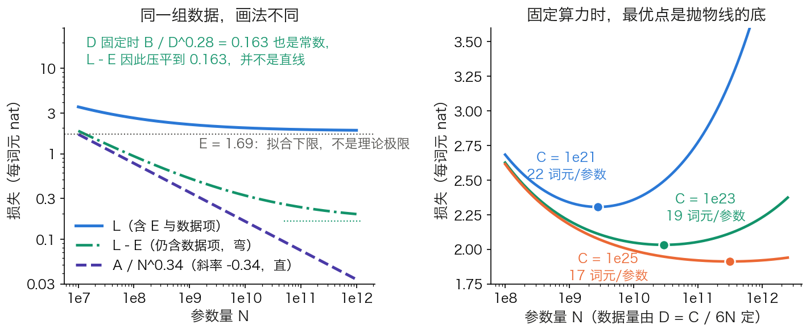

## 5.4 预训练数据：规模定律与数据质量的博弈

上一节把仅解码器的胜出落在了“超大规模”和“足够大”两个词上，但多大算大、要配多少数据，那里并没有交代。本节把这两个词换成数字：先给出规模定律的三条幂律与指数取值，再从参数化损失推出“计算最优”是怎么解出来的，然后用 [3.7.7 节](../03_components/3.7_full_architecture.md)的 $$C \approx 6ND$$ 算三笔真实的算力账，最后说明为什么工业界普遍不按计算最优来训。

### 5.4.1 三条幂律与它们的指数

Kaplan 等人 2020 年的[规模定律工作](https://arxiv.org/abs/2001.08361)给出的结论是：模型的交叉熵损失与参数量 $$N$$、数据量 $$D$$、计算量 $$C$$ 之间存在平滑的幂律关系，且在各自不受另外两项限制时分别成立。原文给出的三条式子连指数与常数一起写出：

$$
L(N) = (N_c/N)^{\alpha_N},\quad \alpha_N \approx 0.076
$$

$$
L(D) = (D_c/D)^{\alpha_D},\quad \alpha_D \approx 0.095
$$

$$
L(C_{\min}) = (C_c^{\min}/C_{\min})^{\alpha_C^{\min}},\quad \alpha_C^{\min} \approx 0.050
$$

其中 $$N$$ 取的是非嵌入参数量，$$N_c \approx 8.8 \times 10^{13}$$。第三条的上标不可省：$$C_{\min}$$ 是按最优批大小折算的算力，原文另有一个固定批大小口径的 $$\alpha_C \approx 0.057$$，两者在该文表 4 里并列，照书中记号去对原文会对到 0.057。指数小得出奇，这正是规模定律既令人振奋又令人沮丧的地方。把 $$\alpha_N = 0.076$$ 换算成一句可感知的话：

$$
10^{-0.076} = 0.840
$$

参数量翻 10 倍，损失只乘 0.84；翻 100 倍，也只乘 $$100^{-0.076} = 0.705$$。改善是平滑、可预测、连续的，但每一分改善都极其昂贵。这条性质支撑了整个大模型时代的投资逻辑：可预测意味着可以先用小模型试，再外推到大模型，不必赌。

Kaplan 的另一条结论是算力该怎么分：固定算力预算时，最优分配是 $$N \propto C^{0.73}$$、$$D \propto C^{0.27}$$，即额外算力应优先投给参数，训练时长与数据量增长得很慢。2022 年 DeepMind 的 [Chinchilla 工作](https://arxiv.org/abs/2203.15556)用改进的实验设置重新拟合，得到两者各约 $$\propto C^{0.5}$$，即参数与数据应同比例增长。这一修正的直接后果是：此前的许多大模型是“过大欠训练”的。

### 5.4.2 计算最优是怎么解出来的

“同比例增长”不是实验观察，是一个可以推导的结论。Chinchilla 把损失参数化为一个带常数项的双幂律：

$$
L(N, D) = E + \frac{A}{N^{\alpha}} + \frac{B}{D^{\beta}}
$$

三项各有含义。$$E$$ 是一个理想生成过程在该数据分布上的损失，按论文的说法应当对应自然文本的熵，即 5.1.4 节的 $$H(p)$$ 那一项；再大的模型、再多的数据也降不到它以下。$$A/N^{\alpha}$$ 是模型容量不足带来的额外损失，$$B/D^{\beta}$$ 是数据不足带来的额外损失。论文正文公布的拟合结果是 $$E = 1.69$$、$$A = 406.4$$、$$B = 410.7$$、$$\alpha = 0.34$$、$$\beta = 0.28$$。

在约束 $$C = 6ND$$ 下最小化它。把 $$D = C/(6N)$$ 代入，对 $$N$$ 求导并令其为零：

$$
-\frac{\alpha A}{N^{\alpha+1}} + \frac{\beta B}{N^{1-\beta}}\left(\frac{6}{C}\right)^{\beta} = 0
$$

整理得 $$N^{\alpha+\beta} \propto C^{\beta}$$，于是：

$$
N_{\mathrm{opt}} \propto C^{\frac{\beta}{\alpha+\beta}},\qquad
D_{\mathrm{opt}} \propto C^{\frac{\alpha}{\alpha+\beta}}
$$

代入上面的两个指数：$$\beta/(\alpha+\beta) = 0.28/0.62 = 0.452$$，$$\alpha/(\alpha+\beta) = 0.548$$。两个数都接近 0.5，这就是“同比例增长”的来源。论文自己报告的区间是 0.454 到 0.455、0.542 到 0.543，与这里的手算一致。$$\alpha \approx \beta$$ 是关键前提：两项的边际收益衰减速度相近，算力就该在两边平分。

该文并列用了三种估计方法。一是固定几个模型尺寸、改变训练词元数，沿各条训练曲线取最优点；二是 IsoFLOP 剖面，即固定算力、扫不同的 $$N$$，看损失随 $$N$$ 变化的抛物线最低点落在哪里；三是把上面的参数化式拟合到前两种方法产生的全部最终损失上。前两种不需要假设函数形式，第三种需要。三者给出的指数略有差异，5.4.4 节会说明这个差异并非无关紧要。

图 5-4 把这两件事画在一起。

图 5-4：左为同一条幂律的两种画法，右为 IsoFLOP 剖面（[生成脚本](https://github.com/yeasy/llm_internals/blob/main/tools/figures/ch05_scaling_curves.py)）。左图固定 $$D = 1.4$$T，用 Chinchilla 正文公布的系数画三条曲线：$$L$$、$$L - E$$、只剩参数项的 $$A/N^{\alpha}$$。带常数项的幂律在 log-log 坐标下是弯的；$$D$$ 固定时数据项也是常数，所以只减 $$E$$ 还不够，$$L - E$$ 会压平到 $$B/D^{\beta} = 0.163$$；把全部与 $$N$$ 无关的项都减掉，才得到斜率恰为 $$-\alpha = -0.34$$ 的直线。右图对三个算力预算各画一条 $$L(N, C/6N)$$ 的剖面，最低点就是该预算下的计算最优配比；为避免复现下一节要讨论的不自洽，右图用的是[复现工作](https://arxiv.org/abs/2404.10102)重拟合的一组系数。

左图那条性质值得单列一句：只有减去全部与 $$N$$ 无关的项，幂律在 log-log 坐标下才是直线。这里要减掉的不止 $$E$$：固定 $$D = 1.4$$T 时数据项也是常数，$$B/D^{\beta} = 410.7/(1.4\times10^{12})^{0.28} = 0.163$$，所以 $$L - E$$ 在大 $$N$$ 处会压平到 0.163 而不是趋于零，仍然不是直线。减到 $$A/N^{\alpha}$$ 才是直线，$$N = 10^9$$ 时它等于 0.354，而同一点的 $$L - E$$ 是 0.517。直接画 $$L$$ 会看到一条随规模增大而逐渐压平的曲线，那条曲线不是直线，压平也不意味着规模定律失效——失效与趋近 $$E$$ 是两回事。$$E$$ 本身是当前设定下的拟合项，换一套语料、换一种分词就会变，不应被读作语言建模的理论下界。

### 5.4.3 三笔算力账

有了 $$C \approx 6ND$$ 和上面的参数化式，就可以把几个公开模型放进同一张表里比较。表 5-6 的算力一列是 $$6ND$$ 的直接代入，损失一列是把 $$N$$、$$D$$ 代进 Chinchilla 正文系数得到的预测值。

| 模型配置 | 参数量 $$N$$ | 训练词元 $$D$$ | 词元/参数 | $$C = 6ND$$ | 预测损失 $$L(N,D)$$ |
| --- | ---: | ---: | ---: | ---: | ---: |
| Gopher 280B | 2.8×10¹¹ | 3.0×10¹¹ | 1.1 | 5.04×10²³ | 1.993 |
| Chinchilla 70B | 7.0×10¹⁰ | 1.4×10¹² | 20.0 | 5.88×10²³ | 1.937 |
| 8B 配 Chinchilla 比例 | 8.0×10⁹ | 1.6×10¹¹ | 20.0 | 7.68×10²¹ | 2.164 |
| Llama 3 8B | 8.0×10⁹ | 1.5×10¹³ | 1,875 | 7.20×10²³ | 1.949 |
| Llama 3 405B | 4.05×10¹¹ | 1.56×10¹³ | 38.5 | 3.79×10²⁵ | 1.819 |

表 5-6：五组配置的算力与预测损失。算力由 $$C = 6ND$$ 算出；损失由 $$L = 1.69 + 406.4/N^{0.34} + 410.7/D^{0.28}$$ 算出，系数取自 Chinchilla 论文正文，该文表 1 也是 Gopher 与 Chinchilla 两行参数量与词元数的出处。Llama 3 405B 的 15.6T 取自 [Llama 3 论文](https://arxiv.org/abs/2407.21783)，8B 的 15T 取自 [Llama 3 的官方模型卡](https://github.com/meta-llama/llama3/blob/main/MODEL_CARD.md)（记作“15T+”）。两处口径校验：405B 一行的 3.79×10²⁵ 与论文自报的 3.8×10²⁵ 对得上；Gopher 一行的 5.04×10²³ 则比 Chinchilla 论文记的 5.76×10²³ 低 12.5%，$$6ND$$ 只数与权重相乘的部分（见 3.8.7），是个便于心算的下界。“预测损失”一列是跨语料外推：系数拟合自 MassiveText 与该文自己的分词器，却被代到了 Llama 3 的 15T 语料上，且用的正是 5.4.4 节指出已知有偏的那一组。该列只能用于同一口径下的相对比较，不可当作实测损失。

三处对照值得停下来看。

第一，前两行复现了 Chinchilla 论文的主结论：算力几乎相同（5.04×10²³ 对 5.88×10²³），但 70B 配 1.4T 的预测损失比 280B 配 300B 低 0.056 nat。参数少了四分之三，成绩反而更好，代价只是数据量是它的 4.7 倍。

第二，第三行与第四行是同一个 8B 模型的两种训法。按 Chinchilla 比例只喂 160B 词元，预测损失 2.164；喂 15T 词元，降到 1.949。后者的训练算力是前者的 94 倍，换来 0.215 nat。

第三，也是最反直觉的一条：训练 Llama 3 8B 花掉的算力（7.20×10²³）比训练 Chinchilla 70B（5.88×10²³）还多 22%，而两者的预测损失几乎相同（1.949 对 1.937）。所以“用小模型多喂数据”根本不是省钱，它是把钱从推理挪到了训练。下一节说明这笔挪动为什么划算。

### 5.4.4 “20 词元/参数”的来历，以及它不是常数

“计算最优约等于 20 词元每参数”是流传最广的一条经验。它的准确出处是 Chinchilla 论文前两种估计方法的结果，也是该文真正用来训练 70B 模型的配比。

用第三种方法反解会得到别的数字。把论文正文公布的那组系数放回 $$C = 5.88 \times 10^{23}$$ 的约束下求极小，算出的最优点是 $$N = 3.25 \times 10^{10}$$、$$D = 3.02 \times 10^{12}$$，即约 93 词元每参数，而不是 20。一项[复现工作](https://arxiv.org/abs/2404.10102)专门追查了这处不自洽，结论是：论文报告的那组参数隐含约 70 词元每参数的策略，与它自己训练 70B 时用的 20 不符，也与前两种方法不符。70 与上面算出的 93 不矛盾。$$\alpha \neq \beta$$ 时这组系数给出的最优比值不是常数，而随算力上升：用同一组正文系数扫一遍，$$C = 10^{21}$$ 时是 50，$$10^{23}$$ 时是 78，$$10^{25}$$ 时是 122。该文的 70 是这条曲线在其考察区间上的代表值（见其图 5），93 是 $$C = 5.88\times10^{23}$$ 这一点的值。两者都远离 20。该文找到的原因有两条——优化器因损失尺度选得不当而提前停止，以及正文里的系数经过了四舍五入，而舍入本身就给预测带来了可观偏差。用该文重新拟合的系数（$$E = 1.8172$$、$$A = 482.01$$、$$B = 2085.43$$、$$\alpha = 0.3478$$、$$\beta = 0.3658$$）反解，同一算力下得到约 18 词元每参数，重新与 20 这个经验值吻合。

这件事给出两条可以带走的判断。其一，同一篇论文里的三种方法不一定自洽，引用“最优配比”时要说清是哪一种方法给出的。其二，最优配比不是常数：用重拟合的系数扫一遍算力，$$C = 10^{21}$$ 时约 22，$$10^{23}$$ 时约 19，$$10^{25}$$ 时约 17，随算力增大缓慢下降。图 5-4 右图画的正是这三个点。

### 5.4.5 把推理成本算进来

计算最优只优化训练期的算力。模型一旦部署，每处理一个词元还要付 $$2N$$ 的前向算力（见 3.7.7 节）。把两段成本写进同一个式子：

$$
C_{\mathrm{total}} = 6 N D_{\mathrm{train}} + 2 N D_{\mathrm{infer}}
$$

这正是[一项把推理计入规模定律的工作](https://arxiv.org/abs/2401.00448)采用的目标函数。它优化的不再是“给定算力把损失压到最低”，而是“给定质量要求把全生命周期算力压到最低”。

用表 5-6 的两行代进去算。Llama 3 8B 配 15T 与 Chinchilla 70B 配 1.4T 的预测损失只差 0.012 nat，在这一口径下差别极小，于是比较总算力有意义（这一列的外推局限见表 5-6 的脚注）：

- 部署后累计服务 1 万亿词元：8B 方案 $$7.20\times10^{23} + 2\times8\times10^{9}\times10^{12} = 7.36\times10^{23}$$；70B 方案 $$5.88\times10^{23} + 2\times7\times10^{10}\times10^{12} = 7.28\times10^{23}$$。两者基本打平。
- 累计服务 10 万亿词元：8B 方案 8.80×10²³，70B 方案 1.99×10²⁴，后者是前者的 2.3 倍。

令两个方案的总算力相等，解出打平点：

$$
D_{\mathrm{infer}} = \frac{6 \times 8{\times}10^{9} \times 1.5{\times}10^{13} - 6 \times 7{\times}10^{10} \times 1.4{\times}10^{12}}{2 \times 7{\times}10^{10} - 2 \times 8{\times}10^{9}} = \frac{1.32{\times}10^{23}}{1.24{\times}10^{11}} = 1.06{\times}10^{12}
$$

即约 1.06 万亿个推理词元。超过它，过度训练的小模型总算力更省；低于它，按计算最优训的大模型更省。这就是“何时该过度训练”的判据，也解释了为什么面向大规模部署的开源模型普遍远离计算最优，而一次性的研究型训练不必如此。

表 5-7 把三个阶段的口径并排。

| 口径 | 优化目标 | 算力如何分配 | 对应的词元/参数 |
| --- | --- | --- | ---: |
| Kaplan（2020） | 固定训练算力下的损失 | $$N \propto C^{0.73}$$、$$D \propto C^{0.27}$$，优先给参数 | 随 $$C$$ 增大而下降 |
| Chinchilla（2022） | 固定训练算力下的损失 | $$N \propto C^{0.5}$$、$$D \propto C^{0.5}$$，同比例增长 | 约 20 |
| 推理感知（2024） | 训练加推理的总算力 | 按预期推理量把最优点推向更小的 $$N$$ | 视推理量而定，可达数千 |

表 5-7：三种口径的差别在优化目标，不在幂律本身。三条幂律描述的是约束关系，决定怎么分配算力的是在优化哪一段成本。

需要划清边界的是：Chinchilla 在它自己的设定下依然成立，它从未声称 20 是任何目标下的最优。把 Llama 3 8B 说成“证明 Chinchilla 错了”是误读，准确的说法是它换了优化目标。同理，把某个 MoE 模型的总参数量代进“词元/参数”也要小心：$$6ND$$ 中的 $$N$$ 对 MoE 取的是激活参数量（见 3.7.7 节），按总参数和按激活参数算出的配比可以差一个数量级，不加限定的比较没有意义。

### 5.4.6 Llama 3 自己拟合的规模定律

Llama 3 论文公开了一套值得对照的做法，因为它把规模定律用在了两件事上。

第一件是选模型尺寸。该文在 $$6\times10^{18}$$ 到 $$10^{22}$$ FLOPs 之间做了一批预训练，每个算力档训练 40M 到 16B 不等的多个模型，得到一组 IsoFLOP 曲线，再用二次多项式拟合每条曲线、取最低点作为该预算下的计算最优模型。把由此得到的幂律外推到 3.8×10²⁵ FLOPs，结论是最优配置为 402B 参数配 16.55T 词元，即约 41 词元每参数。这个数是在它自己的数据上拟合出来的，比 20 大一倍；最终发布的 405B 与它很接近。论文还给出一条工程上有用的观察：算力预算越大，IsoFLOP 曲线在最低点附近越平坦，因此旗舰模型对“参数与数据怎么折中”并不敏感。

第二件是预测下游成绩。规模定律通常只预测下一词元损失，不预测基准分数。该文用两步桥接：先把计算最优模型在某个基准上正确答案的归一化负对数似然与训练 FLOPs 做线性关联，再把这个负对数似然与准确率用 Sigmoid 关联，后一步借用了算力更高的 Llama 2 系列作为锚点。

按这套口径，Llama 3 系列里只有 8B 和 70B 属于刻意的过度训练，405B 本身接近它自己拟合出的计算最优点。把整个系列笼统称作“远超计算最优”并不准确。

### 5.4.7 词元化与词表大小

$$D$$ 的单位是词元，而一个词元覆盖多少文本由分词器决定，所以分词器直接改变同一批文本折算出的 $$D$$。

Llama 3 把词表从 Llama 2 的 32K 扩到 128K：其中 10 万个取自 tiktoken 的词表，另加 2.8 万个用于更好地支持非英语。论文自报的收益是英文压缩率从每词元 3.17 个字符提升到 3.94，即同样的训练算力可以“读”到多约 24% 的文本；另加的 2.8 万个词元同时改善了压缩率和下游成绩，且不影响英文分词。

扩词表的代价也能直接算出来。嵌入矩阵与 LM head 各占 $$n_{\mathrm{vocab}} \times d_{\mathrm{model}}$$ 个参数，两者合计：

$$
2 \times 128{,}256 \times 4{,}096 = 1.05 \times 10^{9}
$$

Llama 3 8B 按 3.8.6 的表 3-24 配置逐项累加共约 8.03×10⁹ 个参数，上面这一项占 13.1%。若词表仍是 32K，这一项只有 2.62×10⁸，占 3.3%。换言之，扩词表花掉了约 7.9 亿个参数，相当于多加了近四层 Transformer。模型越小这笔开销的占比越高，这也是小模型往往不跟进超大词表的原因。

还有一条常被含混带过的前提：“每个汉字可能被拆成多个词元”只对字节级回退的分词器成立。字节级 BPE 把未登录字符按 UTF-8 字节切开，一个汉字通常占 3 个字节，于是最坏情况下变成 3 个词元；若分词器的词表里本就收录了该汉字，它就是 1 个词元。同一段中文在两个词表下的词元数之比，因此取决于该词表对中文的覆盖程度，而不是 BPE 这个算法本身（见 [3.1 节](../03_components/3.1_tokenization.md)）。

### 5.4.8 $$D$$ 不是随便什么词元

规模定律把 $$D$$ 当成一个标量，但它隐含一个前提：这些词元互不重复、质量均匀。真实语料两条都不满足，于是 $$D$$ 需要打折。

**重复的词元只值一部分。** [一项在最多 9000 亿词元、90 亿参数规模上的系统扫描](https://arxiv.org/abs/2305.16264)给出了折算方式。设唯一词元数为 $$U$$、重复次数为 $$R_D$$（即 epoch 数减一），有效词元数近似为：

$$
D' = U + U \cdot R_D^{*} \cdot \left(1 - e^{-R_D / R_D^{*}}\right)
$$

其中 $$R_D^{*}$$ 是重复的“半衰期”，即重复词元损失掉 $$1/e$$ 价值的那一点。该文拟合出 $$R_D^{*} \approx 15$$，对应 16 个 epoch。这个式子有一个立刻可见的性质：$$R_D \to \infty$$ 时 $$D'$$ 趋于 $$U(1 + R_D^{*}) = 16U$$，再怎么重复也超不过唯一数据的 16 倍。表 5-8 代入几个 epoch 数。

| epoch 数 | 处理的词元 | 有效词元 $$D'$$ | 这一段每多处理 1 份唯一数据值多少 |
| ---: | ---: | ---: | ---: |
| 1 | 1.0 $$U$$ | 1.00 $$U$$ | — |
| 2 | 2.0 $$U$$ | 1.97 $$U$$ | 0.97 |
| 4 | 4.0 $$U$$ | 3.72 $$U$$ | 0.88 |
| 8 | 8.0 $$U$$ | 6.59 $$U$$ | 0.72 |
| 16 | 16.0 $$U$$ | 10.48 $$U$$ | 0.49 |
| 32 | 32.0 $$U$$ | 14.10 $$U$$ | 0.23 |

表 5-8：重复训练的有效词元数，由上式代入 $$R_D^{*} = 15$$ 算出。最后一列是本行与上一行之间的边际值。论文的两条结论正对应表中两处：重复至多 4 个 epoch 相对于全用新数据，损失变化可以忽略（其 8.7B 模型训 4 个 epoch 的验证损失只比单 epoch 高 0.5%）；重复到 16 个 epoch 附近收益急剧衰减，此后很快趋平。

一个直接的用法：手里只有 2T 词元的语料，却想花掉 8T 词元的训练预算，即训 4 个 epoch，有效词元约 7.44T，相当于全新数据的 93%。这个折扣通常是可以接受的。

**重复的对象要分清。** 上式描述的是整个语料重复若干遍。只把某个小子集上采样很多遍是另一回事，该文引用的先前工作发现，把 0.1% 的训练数据重复 100 次会显著损害性能。5.5 节讲配比时会再回到这条边界。

**重复次数还决定逐字记忆。** 去重的收益不只是省算力。[一项去重研究](https://arxiv.org/abs/2107.06499)报告，在原始 C4 上训练的模型无提示生成 10 万条文本时，1.571% 的词元属于某段 50 词元的逐字复制；在去重后的数据上训练，这个比例降到 0.264%，约为六分之一。该文还发现网页语料里的近似重复占比在 3.04%（C4）到 13.63%（RealNews）之间，且 C4 验证集有 4.6% 的样本在训练集里有近似重复——后者直接抬高评测成绩。评测污染的检测手段与防御手段是两件事，见 5.5.8 节。

这三条合起来说明，$$D$$ 的大小与它的构成同样重要。下一节讲的就是一条真实管线怎样把原始网页变成可用的 $$D$$。
