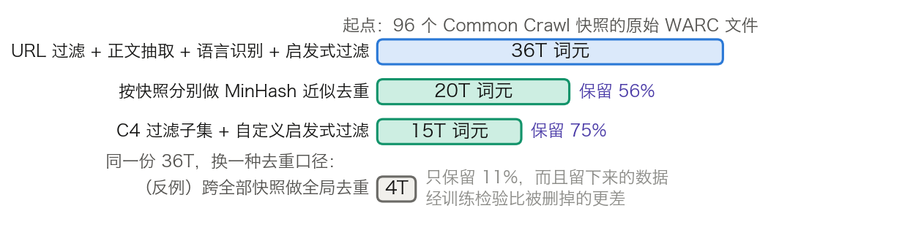
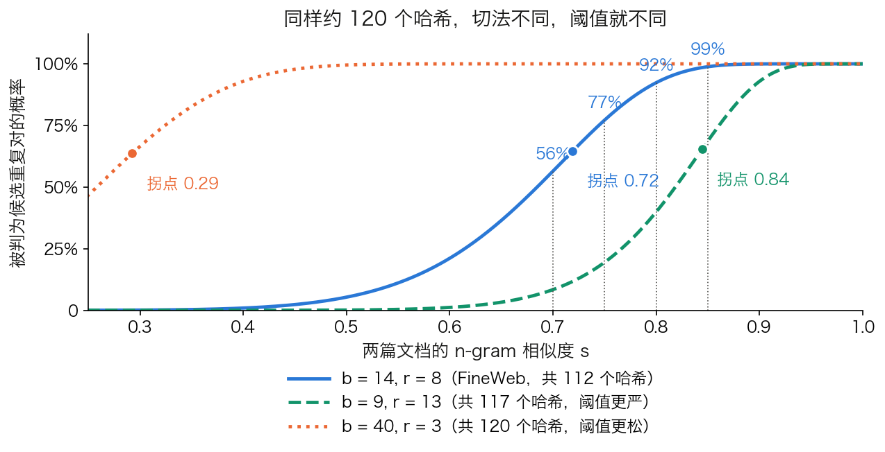

## 5.5 预训练数据管线：从原始网页到一份配比

[5.4.8 节](5.4_data_scaling.md)的结论是规模定律里的 $$D$$ 需要打折：重复的词元只值一部分，混进去的垃圾词元一分不值。本节讲清这份 $$D$$ 是怎么造出来的——抽取、语言识别、启发式过滤、质量分类器、去重、配比六个步骤各解决什么问题，各扔掉多少数据，以及每一步的参数怎么调。这些步骤在论文里通常只占半页，在工程上却占预训练团队大半的时间。

### 5.5.1 一条公开管线的顺序与逐步保留量

先看一条完整公开的管线。[FineWeb](https://arxiv.org/abs/2406.17557) 处理了 96 个 Common Crawl 快照，每一步的产出词元数都写在论文里，可以直接读出各步的淘汰率。

图 5-5：FineWeb 管线的逐步保留量（[生成脚本](https://github.com/yeasy/llm_internals/blob/main/tools/figures/ch05_data_pipeline.py)）。条形长度与词元数成正比，数值取自该论文对 96 个 Common Crawl 快照的自报口径，词元数按 GPT-2 分词器计。最下面一行是它的反例，见 5.5.5 节。

表 5-9 把每一步做的事和它解决的问题列全。步骤顺序不是随意的：便宜的过滤放前面，贵的放后面，去重放在过滤之后，因为对垃圾做去重是白费算力。

| 顺序 | 步骤 | 解决的问题 | 产出 |
| ---: | --- | --- | ---: |
| 1 | URL 黑名单过滤 | 成人内容、已知低质量站点 | — |
| 2 | 正文抽取 | 把 HTML 里的导航栏、页脚、广告剥掉 | — |
| 3 | 语言识别 | 只保留目标语言 | — |
| 4 | 启发式质量与重复规则 | 乱码、模板、极端重复 | 36T 词元 |
| 5 | 按快照分别做 MinHash 近似去重 | 转载、镜像、近似副本 | 20T 词元（保留 56%） |
| 6 | C4 过滤子集与自定义启发式过滤 | 更细的低质量模式 | 15T 词元（保留 75%） |

表 5-9：FineWeb 管线的六个步骤与产出，词元数取自该论文。步骤 1 到 4 的产出论文只给了合计值，故前三行留空。

### 5.5.2 正文抽取与语言识别

Common Crawl 同时提供两种文件：WARC 是原始 HTTP 响应，WET 是它自带的纯文本转换。直接用 WET 省事，但其正文抽取质量不高。FineWeb 的消融是：在同样 280 亿词元、除英文语言过滤外不做任何其他处理的条件下，用专门的抽取工具从 WARC 重新抽取，下游成绩优于直接用 WET。这一步排在最前面，是因为后面所有过滤规则都建立在“正文是干净的”这个前提上。

Llama 3 的做法更进一步，其团队自建了 HTML 解析器，并在两处做了专门处理：数学与代码页面要保留结构；数学内容常以预渲染图片呈现，而公式往往同时写在图片的 alt 属性里，因此保留 alt 文本。它还有一条反直觉的实测结论：对一个主要用网页数据训练的模型，保留 Markdown 标记反而有害，所以把全部 Markdown 标记都去掉了。

语言识别用的是轻量分类器。FineWeb 用 fastText 只保留得分不低于 0.65 的英文文档；Llama 3 用 fastText 把文档分到 176 种语言，再按语言分别去重和过滤。阈值是一个明确的取舍：调高会丢掉代码片段多、自然语言少的技术页面，调低会放进大量混杂语种的垃圾。

### 5.5.3 启发式过滤

启发式规则便宜且可解释，是淘汰量最大的一层。FineWeb 给出了每条规则的淘汰率，正好展示了这类规则的调参方式：

- 行尾带终止标点的行所占比例低于 0.12 的文档被删，淘汰 10.14% 的词元。C4 原版的同类规则阈值更严，一次淘汰约 30%。
- 重复行中的字符占比不低于 0.1 的文档被删，淘汰 12.47%。MassiveText 原版的阈值是 0.2。
- 短于 30 个字符的行占比不低于 0.67 的文档被删，淘汰 3.73%。

三条合起来淘汰约 22% 的词元，小于逐条相加的 26.34%，因为三条规则删掉的文档相互重叠。这一步在 280 亿词元的消融上把综合成绩抬高约 1%。

这组数字说明了启发式过滤的真实形态：不是照搬别人的规则，而是逐条测阈值再定阈值。C4 原版的终止标点过滤器单条收益最大，代价是删掉约 30% 的词元。FineWeb 的消融显示，去掉这一条、只留其余 C4 过滤器的组合成绩更好，且总共只删约 7%。于是它没有采用原版，改用上面那个 0.12 的自定义阈值。

Llama 3 公开的三条规则是另一种思路：用重复 $$n$$-gram 覆盖率删掉由重复内容构成的行（这类行很长且各不相同，行级去重抓不到）；用脏词计数过滤域名黑名单没覆盖的成人站点；用词元分布相对训练语料的 KL 散度过滤离群词元过多的文档。

### 5.5.4 质量分类器

启发式规则抓的是形式上的毛病，抓不到“这段文字有没有信息量”。模型打分补的是这一层。

常见做法是训练一个轻量分类器，正例取自已知高质量来源。Llama 3 用了两类。一类是 fastText，训练目标是判断一段文本是否可能被 Wikipedia 引用。另一类更重：先用 Llama 2 的对话模型按给定的质量要求给文档打标，再把这套判断蒸馏进一个 DistilRoBERTa 打分器，以便在万亿词元规模上跑得动。代码与数理推理另有专门的分类器与抽取流程，因为这两类内容的词元分布与自然语言差别很大。

FineWeb 的 FineWeb-Edu 是同一思路的一个公开结果：用一个自训的分类器从 15T 词元中挑出教育性强的部分，得到 1.3T 词元的子集，在 MMLU、ARC、OpenBookQA 这类知识与推理密集的基准上显著优于同规模的网页数据集。论文给出的成本是：把分类器跑一遍这 15T 词元花了 6,000 个 H100 小时。这个数字值得记住——模型打分是整条管线里最贵的一步，所以它排在便宜的启发式过滤之后。

### 5.5.5 去重：三层方法与一组可调参数

去重是分层的，不是一件事。三层的成本与召回的重复类型同步递增，实际管线通常三层都用。

**精确去重**按文档或段落的哈希消重，最便宜，只能抓到逐字相同的副本。

**近似去重**的主流做法是 MinHash 配合 LSH 的分带技巧。先把文档切成 $$n$$-gram，用 $$b \times r$$ 个哈希函数各取一次最小值，得到一个长度为 $$b \times r$$ 的签名；再把签名切成 $$b$$ 个带、每带 $$r$$ 行，只要有任意一个带完全相同，就把两篇文档视为候选重复对。

这样做的价值在于阈值是可以设计的。两篇 $$n$$-gram 相似度为 $$s$$ 的文档，某一个哈希函数取值相同的概率是 $$s$$，一个带的 $$r$$ 行全同的概率是 $$s^r$$，$$b$$ 个带全都不同的概率是 $$(1-s^r)^b$$，于是成为候选的概率是：

$$
P(s) = 1 - (1 - s^{r})^{b}
$$

这条 S 形曲线的拐点约在 $$(1/b)^{1/r}$$。代入 FineWeb 公开的配置——5-gram、112 个哈希函数、切成 14 个带每带 8 行——拐点为：

$$
(1/14)^{1/8} = 0.719
$$

再逐点代入，相似度 0.70、0.75、0.80、0.85 的文档对被判为候选的概率依次是 56%、77%、92%、98.8%。这组数与论文附录给出的值一致，也解释了它对这套参数的描述：目标是以高概率抓住相似度不低于 75% 的文档，并几乎必然抓住 85% 以上的。

调 $$b$$ 与 $$r$$ 就是调“多像才算重复”。在哈希总数几乎不变的前提下改切法，阈值会大幅移动。切成 9 个带每带 13 行，拐点升到 0.84，相似度 0.80 的文档对只有 40% 的概率被抓到。切成 40 个带每带 3 行，拐点降到 0.29，大量只是题材相近的文档会被误判为重复。图 5-6 把三组参数画在一起。

图 5-6：三组 $$(b, r)$$ 下的候选概率曲线（[生成脚本](https://github.com/yeasy/llm_internals/blob/main/tools/figures/ch05_minhash_scurve.py)）。实线是 FineWeb 的 14 × 8 配置，虚线与点线是哈希总数相近但切法不同的两组。三组曲线的哈希开销几乎一样，判定阈值却相差很大。

**语义去重**是最内层。[SemDeDup](https://arxiv.org/abs/2303.09540) 用预训练模型的嵌入找出语义相似但并非逐字相同的数据对，在 LAION 的子集上移除 50% 数据而性能损失极小、训练时间近乎减半。

**去重的范围比去重的算法更要紧。** FineWeb 报告了一个反直觉的结果。对 96 个快照做全局去重，越老的快照被删得越狠——最老的那些被删掉高达 90%，因为它们要与后来所有快照比对——全部做完只剩 4T 词元，训练效果却远不如预期。论文进一步用实验查证：把 2013-48 这个老快照单独拿出来，在全局去重中被保留的那 10% 数据，质量反而不如被删掉的那 90%。原因是全局去重把反复被转载的高质量内容删光了，留下的是各快照独有的、往往更边缘的内容。改为按快照分别去重，产出 20T 词元，成绩反而更好。这条结论的一般形态是：**去重强度**不是越大越好，被删掉的重复里含有“被反复引用因而重要”的信号。

去重的另一项收益是抑制逐字记忆，量化结果见 5.4.8 节。

### 5.5.6 配比：把同一批数据按什么比例抽

过完滤之后剩下的数据仍要决定各来源按什么比例进入训练。配比不改变总量，只改变同样的 $$D$$ 里模型学到的是什么。

Llama 3 公开了最终的大类比例，落到 15T 词元上如表 5-10。

| 大类 | 比例 | 折合词元 |
| --- | ---: | ---: |
| 通用知识 | 50% | 7.50T |
| 数理推理 | 25% | 3.75T |
| 代码 | 17% | 2.55T |
| 多语言 | 8% | 1.20T |

表 5-10：Llama 3 的预训练数据配比，比例取自 [Llama 3 论文](https://arxiv.org/abs/2407.21783)的 3.1.2 节，词元数由比例乘 15T 算出。非英语内容只占 8%，与该文“8B 和 70B 虽用多语言数据预训练，但当时的目标用法是英语”的说明一致。

配比怎么定出来，论文给的方法比比例本身更有价值。其一是知识分类：先训一个分类器给网页数据打上内容类别，才谈得上按类别配比。其二是用规模定律做代理实验：在一个候选配比上训几个小模型，按 5.4.6 节的两步法预测大模型在关键基准上的成绩，据此挑出下一个候选配比，反复多轮。这套做法把“配比”从口味问题变成了可测量的优化问题。同一方向上的自动化尝试是 [DoReMi](https://arxiv.org/abs/2305.10429)，它用一个小的代理模型学出各领域的权重，再用这组权重训练大模型。

配比与 5.4.8 节的有效词元数直接相扣：给某个小的高质量子集分配过高的权重，等价于让它重复很多遍，而那条折算式描述的是整个语料重复若干遍的情形。把一小部分数据上采样上百倍属于另一种情形，前述工作引用的先前结果是，把 0.1% 的训练数据重复 100 次会显著损害性能。所以提高一个子集的权重之前，先算它会被抽到几遍。

数据不够时还有一条替代路径：用别的数据类型补。同一项数据受限研究发现，在自然语言里混入代码可带来约 2 倍的有效词元增益，即便评测只看自然语言任务；混到占比一半仍无劣化，再往上自然语言任务开始下滑。

### 5.5.7 退火：训练末期的配比切换

训练末期学习率衰减到零的那一段称为**退火**（annealing），这一段常常切换数据配比，把高质量语料集中投放。

Llama 3 给出了可复核的效果与边界。在 GSM8K 与 MATH 的训练集上做退火，8B 预训练模型在这两个验证集上分别提升 24.0% 和 6.4%；而同样的做法对 405B 提升可以忽略。论文的解释是旗舰模型本身的上下文学习与推理能力已经够强，不需要特定领域的样本。这条对照本身就是一个有用的判据：退火带来的收益随模型变大而缩小。

该文还把退火当成一件评估工具用：要判断一份新的小数据集有没有价值，就取一个训练到一半的 8B 模型，在 400 亿词元上把学习率线性退火到零，新数据集给 30% 权重、默认配比给 70%，看基准成绩的变化。这比为每个小数据集单独做一轮规模定律实验便宜得多。作为纪律，该文明确说明退火数据里不含任何常用基准的训练集，以免污染少样本评估。

Llama 3 的完整训练还分成三个阶段：主训练、把上下文窗口从 8K 扩到 128K 的继续预训练，以及最后的退火——论文提到在最后 4,000 万词元上把学习率线性退到零，并保持 128K 的上下文长度。

### 5.5.8 污染防御与数据治理

**检测与防御是两件事。** 检测手段包括 $$n$$-gram 重叠比对、在语料中预埋 canary 串，以及基于模型行为的方法——[Min-K% Prob 的假设很朴素](https://arxiv.org/abs/2310.16789)：没见过的文本里往往含有几个概率极低的离群词，而见过的文本不太会有。但检测本质上是事后补救，真正的防线是让评测集从一开始就不可能进训练集：使用私有的、未公开的评测集，或者按时间切分——同一篇论文提出的 WIKIMIA 基准正是用模型训练前后创建的数据来构造判定基准。5.4.8 节给出的“C4 验证集有 4.6% 的样本在训练集里有近似重复”说明了不做这件事的代价。微调阶段的污染另有形态，见 [8.5 节](../08_alignment/8.5_practice.md)。

**合成数据是一条正在变化的边界。** 它能低成本补足稀缺领域，但完全用模型生成的内容训练下一代模型会触发[模型崩溃](https://arxiv.org/abs/2305.17493)：原始内容分布的尾部会消失，且这种缺陷是不可逆的。Llama 3 的实践给出了一个可用的折中：8B 与 70B 在更强模型生成的数据上训练收益明显，而让 405B 在自己生成的数据上训练无益甚至有害；它的做法是给合成数据接上执行反馈这类外部真值，把“模型自说自话”变成“模型提出、外部检验”。

**数据治理是管线的账本。** 预训练数据还需要记录来源、许可、过滤规则、去重版本和敏感信息处理策略。没有可追溯的账本，后续很难解释模型能力来源、复现实验、排查评测污染，也难以满足版权、隐私和安全审查要求。Llama 3 在管线最前端就移除了含大量个人身份信息的域名和已知成人内容域名，这类决定必须记录在案，否则无法在事后回答“某段内容为什么在或不在语料里”。
