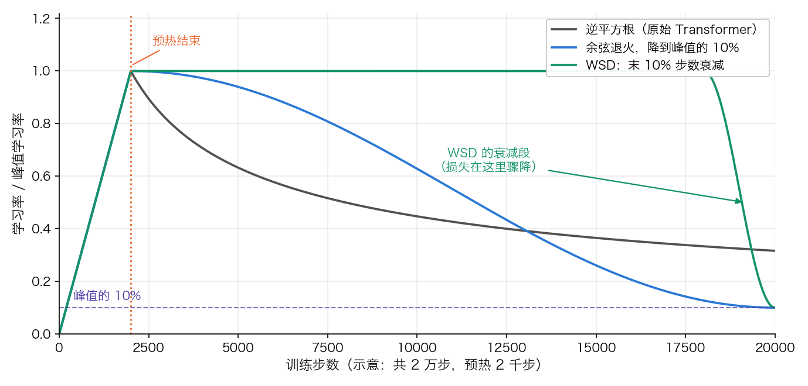

## 6.2 学习率调度：为什么需要先预热再衰减

学习率可能是 Transformer 训练中最关键的超参数。6.1 节的每一条更新公式里，$$\eta$$ 都只是写在最前面的一个常数——Adam 自适应的是各参数之间的相对步长，这个全局尺度并不在它的调节范围内。原始论文提出的“先预热再衰减”策略不是经验性的 trick，而是针对 Transformer 特定训练动态的必要设计。

### 6.2.1 原始调度公式

Transformer 的学习率调度公式为：

$$\text{lr} = d_{\text{model}}^{-0.5} \cdot \min(\text{step}^{-0.5}, \text{step} \cdot \text{warmup\_steps}^{-1.5})$$

这个公式通过 min 函数的“切换”实现两个阶段的平稳过渡。在 step = warmup_steps 时，两项相等：

$$\text{warmup\_steps}^{-0.5} = \text{warmup\_steps} \cdot \text{warmup\_steps}^{-1.5}$$

因此：

- **预热阶段**（step < warmup_steps）：$$\text{step} \cdot \text{warmup\_steps}^{-1.5}$$ 较小，学习率按此项线性增长：$$\text{lr} \propto \text{step}$$
- **衰减阶段**（step ≥ warmup_steps）：$$\text{step}^{-0.5}$$ 较小，学习率按此项逐渐衰减：$$\text{lr} \propto \text{step}^{-0.5}$$

原始论文使用 warmup_steps = 4000。峰值出现在 step = warmup_steps，此时学习率为 $$d_{\text{model}}^{-0.5} \cdot \text{warmup\_steps}^{-0.5}$$；对于 d_model = 512、warmup_steps = 4000，峰值约为 $$512^{-0.5} \cdot 4000^{-0.5} \approx 6.99 \times 10^{-4}$$。$$512^{-0.5} \approx 0.0442$$ 只是模型维度缩放因子，不是最终峰值学习率。

### 6.2.2 为什么需要预热

训练初期，模型参数是随机初始化的，此时的梯度方向**高度不稳定**——可能指向完全错误的方向。如果一开始就使用较大的学习率，模型可能在参数空间中进行剧烈的、无方向性的跳跃，导致：

1. **Adam 的估计不准确**：二阶矩 $$v_t$$ 在初始阶段样本不足，估计不可靠。过大的学习率会放大这种不准确性
2. **层归一化的不稳定**：训练初期的极端梯度更新可能导致归一化层的统计量剧烈波动
3. **注意力分布的退化**：过大的更新可能导致注意力权重坍塌为近似均匀分布或过度集中

预热通过在初始阶段使用微小的学习率，让模型“热身”——先建立基本的特征表示和稳定的梯度统计，然后再逐步增大学习率以加快训练。

### 6.2.3 为什么需要衰减

在训练后期，模型已经接近了损失函数的局部最优区域。此时如果继续使用较大的学习率，模型会在最优点附近**反复震荡**而无法收敛。逐步降低学习率让模型的更新步长越来越精细，最终“平稳着陆”到一个好的解。

### 6.2.4 现代调度策略

除了原始的逆平方根衰减，现代大模型训练中常用的调度策略还包括：

**余弦退火**（Cosine Annealing）：学习率按余弦函数从峰值平滑下降到接近零。这种方式在训练中期保持较高的学习率，有助于跳出局部最优。

**线性衰减**（Linear Decay）：从峰值线性下降到零。简单直接，效果通常不亚于余弦退火。

**预热-稳定-衰减**（Warmup-Stable-Decay，WSD）：DeepSeek-V3 等模型采用的三阶段策略——预热、以恒定峰值学习率训练较长时间、最后快速衰减。这种策略在大规模训练中被证明非常有效。

无论选择哪种策略，**预热阶段都是必须的**——这已经成为 Transformer 训练的普遍共识。共识只到这里为止：预热之后该用哪条衰减曲线、不同曲线之间怎样比较才算公平，并没有同样干脆的答案。
#### 一个容易得出错误结论的比较陷阱

上面几种策略常被拿来横向比较“谁的最终 loss 更低”，但这类比较很容易做错，而做错的方式相当隐蔽。

Kimi K3 的技术报告给出了一个值得记住的方法论。他们的 scaling-law 研究一致偏好余弦退火而非 WSD，但给出的理由不是“余弦更好”，而是**先说明为什么此前的对比可能不可信**：

> 尽管已有工作报告 WSD 可以追平甚至超过余弦退火，但我们观察到两种调度的最优超参差异很大——即使在相同模型规模与相同训练词元预算下，二者的最优峰值学习率与批大小也显著不同。因此，用**同一组超参**去比较两种调度，可能仅仅因为那组超参更贴合其中一方，就不公平地偏向它。

他们的做法是**对每种调度各自独立做一次 scaling-law 搜索**，让两者都跑在自己的最优超参上，再比较最终 loss；在这个前提下余弦退火才稳定更优。

这条经验的适用面远超学习率调度本身。**只要两个方案各自有一组需要调的超参，“固定超参、只换方案”的对比就是有偏的**——优化器、归一化位置、注意力变体的比较都吃这个坑。读到某篇工作声称“A 比 B 好”时，值得先看一眼：A 和 B 是否各自调过参？

> 口径说明：这里引的是 Kimi K3 技术报告（[arXiv:2607.24653](https://arxiv.org/abs/2607.24653)）中的 scaling-law 结论，属该团队在自己的模型族与数据上得到的观察，不是普适定论。方法论上的那条告诫（各自调参再比较）比“余弦优于 WSD”这个具体结果更值得带走。

### 6.2.5 学习率调度可视化

不同的调度策略在训练过程中的学习率走势差异显著。把三种主流策略——原始逆平方根、余弦退火、WSD 三阶段——画在同一张图上，行为差异一目了然。

图 6-1：三种学习率调度策略的曲线对比（[生成脚本](https://github.com/yeasy/llm_internals/blob/main/tools/figures/lr_schedule_comparison.py)）

从图中可以清晰看到三种策略的不同特征：**逆平方根**衰减最为平缓，在预热后缓慢下降；**余弦退火**在中期保持较高学习率，后期快速下降到接近零；**WSD 三阶段**在大部分训练过程中维持峰值学习率，只在最后 20% 快速衰减。三种策略都共享相同的预热阶段（灰线标注），再次印证了预热对 Transformer 训练的重要性。
